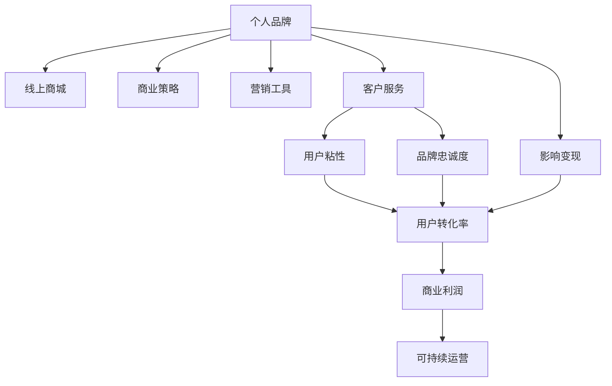

                 

# 建立个人品牌线上商城：变现你的影响力

> 关键词：个人品牌,线上商城,影响变现,商业策略,营销工具

## 1. 背景介绍

### 1.1 问题由来

在数字化时代，个人品牌（Personal Branding）成为互联网创业者、KOL（Key Opinion Leader）、专家学者等寻求自我变现的重要途径。无论是通过博客、微博、抖音等社交平台，还是通过开设线上商城、建立知识付费系统等商业化运营模式，个人品牌的影响力都为拥有者带来了巨大的经济价值。

然而，传统的商业运营模式，如实体店、线下活动等，已经难以适应瞬息万变的互联网市场。而个人品牌线上商城则提供了一个全新的可能性，将个人品牌与电子商务结合起来，利用线上渠道最大化影响力和变现潜力。

### 1.2 问题核心关键点

建立个人品牌线上商城的核心在于：
1. 构建一个具有独特品牌特色的在线销售平台，涵盖商品展示、购物车、支付结算等基本功能。
2. 借助社交媒体和网络推广渠道，吸引用户关注和参与，提升品牌的知名度和市场影响力。
3. 利用大数据和AI技术，实现精准推荐和个性化营销，提高用户粘性和转化率。
4. 构建一套完善的客户服务体系，提升用户购物体验，建立品牌忠诚度。
5. 通过多种盈利模式（如直接售卖、订阅制、广告分成等）实现可持续的商业变现。

## 2. 核心概念与联系

### 2.1 核心概念概述

为更好地理解个人品牌线上商城的构建过程，本节将介绍几个关键概念及其相互关系：

- **个人品牌**：通过网络渠道建立并维护的，具有一定知名度的个人或组织形象。
- **线上商城**：利用互联网技术搭建的在线商店，提供商品展示、购物、支付等功能。
- **影响变现**：通过个人品牌的市场影响力，转化为实际的商业利润。
- **商业策略**：针对不同市场和用户群体，制定并执行的商业模式和营销计划。
- **营销工具**：用于提升品牌知名度和促进用户转化的各类线上线下工具和技术。
- **客户服务**：为满足用户需求、提升用户体验而提供的服务和支持。

这些核心概念之间可以通过以下Mermaid流程图来展示：



这个流程图展示了个别品牌线上商城构建的逻辑关系：

1. 个人品牌是线上商城的基石。
2. 通过线上商城进行影响变现。
3. 商业策略指导线上商城的运营。
4. 营销工具提升线上商城的知名度和用户转化率。
5. 客户服务提升用户粘性和品牌忠诚度。
6. 所有这些因素共同作用，推动线上商城的可持续运营，实现商业利润。

## 3. 核心算法原理 & 具体操作步骤

### 3.1 算法原理概述

个人品牌线上商城的构建，本质上是一个复杂的商业运营系统。涉及多个子系统之间的协作与优化，以达到最终的目标：最大化商业利润和品牌影响力。

从技术实现的角度，线上商城的构建可以分解为以下几个核心模块：

- 前端展示：利用Web技术实现商品展示、分类、搜索等功能。
- 后端服务：处理订单、库存、支付等核心业务逻辑。
- 推荐系统：根据用户行为和历史数据，实现个性化商品推荐。
- 客户服务：提供FAQ、在线客服等功能。
- 数据分析：收集和分析用户行为数据，优化商业策略。

这些模块通过API接口进行协同工作，以实现统一的线上商城功能。

### 3.2 算法步骤详解

#### 3.2.1 前端展示模块

**步骤1: 网站设计**：
- 根据品牌特色，设计符合用户审美的网站UI/UX。
- 确保网站响应式设计，适配不同设备。

**步骤2: 前端技术选型**：
- 选择合适的技术栈，如React、Vue.js等前端框架。
- 利用Bootstrap或Tailwind CSS等框架，快速搭建响应式布局。

**步骤3: 商品展示设计**：
- 使用HTML和CSS布局商品列表，提供清晰的分类和搜索功能。
- 利用JavaScript和React等技术，实现商品的高效渲染和动态加载。

#### 3.2.2 后端服务模块

**步骤1: 服务器选择**：
- 选择适合的服务器架构，如AWS、阿里云等。
- 配置负载均衡、缓存策略等，提升系统的可扩展性和稳定性。

**步骤2: 数据库设计**：
- 设计数据库模型，包括商品信息、订单信息、用户信息等。
- 使用MySQL、PostgreSQL等关系型数据库，或NoSQL数据库如MongoDB。

**步骤3: 业务逻辑实现**：
- 实现商品添加、更新、删除等基本功能。
- 实现订单管理、支付结算、库存管理等核心业务逻辑。

#### 3.2.3 推荐系统模块

**步骤1: 数据采集**：
- 采集用户浏览历史、购买记录、评分数据等。
- 整合来自社交媒体、第三方平台的数据。

**步骤2: 特征工程**：
- 提取和构建用户和商品的特征向量。
- 使用PCA等降维技术，减少特征维度。

**步骤3: 模型训练**：
- 选择适合的推荐算法，如协同过滤、基于内容的推荐等。
- 使用Python等语言，实现推荐模型的训练和预测。

#### 3.2.4 客户服务模块

**步骤1: 客服系统搭建**：
- 集成第三方客服系统，如Tencent IM、Alibaba IM等。
- 配置自动回复、智能引导等功能。

**步骤2: 客户反馈收集**：
- 提供意见反馈渠道，如邮件、在线表单等。
- 收集用户评价和建议，分析用户需求。

**步骤3: 客户关系管理**：
- 使用CRM系统，管理用户信息、交易记录等。
- 定期进行用户细分和行为分析。

#### 3.2.5 数据分析模块

**步骤1: 数据采集和预处理**：
- 收集用户行为数据，如点击、浏览、购买等行为数据。
- 进行数据清洗和预处理，去除无效数据。

**步骤2: 数据分析与挖掘**：
- 使用数据挖掘技术，进行用户行为分析、关联规则挖掘等。
- 使用统计分析、机器学习等方法，构建用户画像。

**步骤3: 商业策略优化**：
- 根据数据分析结果，优化商品定价、推荐策略等。
- 使用A/B测试等方法，验证策略效果。

### 3.3 算法优缺点

#### 3.3.1 优点

1. **广泛覆盖市场**：线上商城不受地域限制，能够吸引全球用户。
2. **数据驱动决策**：通过数据分析，可以实现精准营销和个性化推荐。
3. **高效率运营**：线上运营成本相对较低，能够快速响应市场变化。
4. **品牌影响力扩散**：借助社交媒体，能够快速提升品牌知名度。
5. **用户粘性和忠诚度**：优秀的用户体验和个性化服务，能够提高用户粘性和品牌忠诚度。

#### 3.3.2 缺点

1. **网络安全风险**：线上交易存在信息泄露、欺诈等安全风险。
2. **技术门槛较高**：需要具备一定的技术能力，才能实现系统的开发和维护。
3. **用户信任度低**：初期需要大量营销推广，才能吸引用户信任和参与。
4. **运营成本高**：初期投入成本较高，需要支付技术开发、营销推广等费用。
5. **市场竞争激烈**：在线上市场中，个人品牌面对众多竞争者，难以突出重围。

### 3.4 算法应用领域

个人品牌线上商城的应用领域非常广泛，涵盖以下几个方向：

1. **个人自营商店**：如KOL博主、手工艺品艺术家等，将自己的特色商品在线上销售。
2. **知识付费平台**：如专家学者、企业培训师等，提供各类在线课程、咨询服务。
3. **数字出版物销售**：如作家、插画家等，在线销售自己的图书、插画作品。
4. **个性化定制服务**：如时尚设计师、美容导师等，提供个性化定制服务，如定制服饰、化妆品等。
5. **虚拟产品销售**：如虚拟形象、虚拟物品等，通过线上商城进行交易。

## 4. 数学模型和公式 & 详细讲解 & 举例说明

### 4.1 数学模型构建

个人品牌线上商城的构建，涉及到多个模块和子系统，可以通过以下几个数学模型进行建模和优化：

**用户行为模型**：
- 用户行为数据 $U = (u_1, u_2, ..., u_n)$，每个用户 $u_i$ 的行为数据包括点击、浏览、购买等。
- 利用贝叶斯网络或逻辑回归模型，构建用户行为模型 $P(U|T)$，其中 $T$ 为用户的历史行为数据。

**推荐系统模型**：
- 用户行为数据 $U = (u_1, u_2, ..., u_n)$，每个用户 $u_i$ 的评分数据 $R = (r_{ij})$，表示用户对商品的评分。
- 利用协同过滤算法或矩阵分解，构建推荐模型 $P(R|U, T)$，其中 $T$ 为用户的历史行为数据。

**商品销售模型**：
- 商品销售数据 $S = (s_1, s_2, ..., s_n)$，每个商品 $s_i$ 的销售量 $s_i$。
- 利用时间序列模型或回归模型，预测商品的销售趋势 $P(S|T)$，其中 $T$ 为时间序列数据。

### 4.2 公式推导过程

#### 4.2.1 用户行为模型

用户行为数据 $U = (u_1, u_2, ..., u_n)$ 可以通过贝叶斯网络进行建模，假设用户行为数据服从独立同分布的伯努利分布，即：

$$
P(U|T) = \prod_{i=1}^{n} P(u_i|T)
$$

其中 $T$ 为用户的历史行为数据。用户行为数据 $U$ 的概率分布可以通过训练数据进行最大似然估计，得到用户行为模型 $P(U|T)$。

#### 4.2.2 推荐系统模型

推荐系统模型 $P(R|U, T)$ 可以通过协同过滤算法进行建模。协同过滤算法通过用户行为数据 $U = (u_1, u_2, ..., u_n)$ 和商品评分数据 $R = (r_{ij})$，构建用户商品评分矩阵 $R$：

$$
R = \begin{bmatrix}
r_{11} & r_{12} & ... & r_{1n} \\
r_{21} & r_{22} & ... & r_{2n} \\
... & ... & ... & ... \\
r_{n1} & r_{n2} & ... & r_{nn}
\end{bmatrix}
$$

协同过滤算法可以使用矩阵分解的方法，将用户商品评分矩阵 $R$ 分解为用户兴趣向量 $V$ 和商品特征向量 $W$：

$$
R = V \cdot W^T
$$

其中 $V$ 为 $n \times k$ 的用户兴趣向量，$W$ 为 $m \times k$ 的商品特征向量，$k$ 为特征向量的维度。

### 4.3 案例分析与讲解

**案例1: KOL博主自营商店**

某知名KOL博主在社交媒体上拥有大量粉丝，决定开设线上商店销售特色文具。首先，利用社交媒体数据采集用户浏览和购买行为，构建用户行为模型 $P(U|T)$。然后，利用协同过滤算法，对博主销售的各类文具进行推荐，提升用户购买意愿。最终，通过支付平台进行商品交易和款项结算，完成线上商店的构建。

**案例2: 专家学者知识付费平台**

某知名学者决定开设在线课程平台，提供各类专业课程。首先，采集用户的历史学习记录和评价数据，构建用户行为模型 $P(U|T)$。然后，利用机器学习算法，对课程进行推荐，提升用户购买率和课程完成率。最终，通过支付平台进行课程支付和课程认证，完成知识付费平台的构建。

## 5. 项目实践：代码实例和详细解释说明

### 5.1 开发环境搭建

在进行个人品牌线上商城的开发前，需要先搭建开发环境。以下是Python开发环境的配置流程：

1. 安装Anaconda：从官网下载并安装Anaconda，用于创建独立的Python环境。

2. 创建并激活虚拟环境：
```bash
conda create -n virtual-env python=3.8 
conda activate virtual-env
```

3. 安装必要的Python包：
```bash
pip install django flask redis gunicorn
```

4. 安装相关的数据库和缓存系统：
```bash
pip install mysqlclient redis
```

5. 安装第三方库：
```bash
pip install requests scikit-learn matplotlib
```

完成上述步骤后，即可在虚拟环境中进行个人品牌线上商城的开发。

### 5.2 源代码详细实现

以下是一个简单的Django框架实现的个人品牌线上商城的前端展示部分代码实现。

**index.html**：
```html
<!DOCTYPE html>
<html>
<head>
    <title>Personal Branding Online Store</title>
    <link rel="stylesheet" href="https://stackpath.bootstrapcdn.com/bootstrap/4.5.2/css/bootstrap.min.css">
</head>
<body>
    <nav class="navbar navbar-expand-lg navbar-light bg-light">
        <a class="navbar-brand" href="#">Personal Branding Online Store</a>
        <button class="navbar-toggler" type="button" data-toggle="collapse" data-target="#navbarNav" aria-controls="navbarNav" aria-expanded="false" aria-label="Toggle navigation">
            <span class="navbar-toggler-icon"></span>
        </button>
        <div class="collapse navbar-collapse" id="navbarNav">
            <ul class="navbar-nav">
                <li class="nav-item">
                    <a class="nav-link" href="">Products</a>
                </li>
                <li class="nav-item">
                    <a class="nav-link" href="">Cart</a>
                </li>
                <li class="nav-item">
                    <a class="nav-link" href="">Checkout</a>
                </li>
            </ul>
        </div>
    </nav>
    <div class="container">
        <h1>Featured Products</h1>
        <div class="row">
            
                <div class="col-md-4">
                    <div class="card">
                        
                        <div class="card-body">
                            <h5 class="card-title">{{ product.name }}</h5>
                            <p class="card-text">{{ product.description }}</p>
                            <a href="" class="btn btn-primary">More Info</a>
                        </div>
                    </div>
                </div>
            
        </div>
    </div>
</body>
</html>
```

**views.py**：
```python
from django.shortcuts import render
from .models import Product

def index(request):
    product_list = Product.objects.all()
    return render(request, 'index.html', {'product_list': product_list})
```

**urls.py**：
```python
from django.urls import path
from . import views

urlpatterns = [
    path('', views.index, name='index'),
    path('products/', views.index, name='products'),
    path('cart/', views.cart, name='cart'),
    path('checkout/', views.checkout, name='checkout'),
]
```

### 5.3 代码解读与分析

**index.html**：
- 通过Django模板语言，实现了商品展示列表。
- 利用Bootstrap框架，实现响应式布局和美观的UI设计。

**views.py**：
- 通过Django视图函数，实现了商品列表的展示。
- 使用Django的模型-视图-模板(MVC)架构，实现了数据的渲染和业务逻辑的分离。

**urls.py**：
- 通过Django的URL配置，将视图函数与具体的URL路径绑定。
- 方便用户通过URL访问不同的页面和功能。

### 5.4 运行结果展示

在开发环境中运行上述代码后，可以在浏览器中访问http://localhost:8000/，查看个人品牌线上商城的前端展示效果。

## 6. 实际应用场景

### 6.1 智能客服系统

基于个人品牌线上商城的智能客服系统，可以提供高效、个性化的客户服务，提升用户购物体验。

**步骤1: 系统集成**：
- 将智能客服系统集成到商城平台，提供自动回复和智能引导功能。
- 利用NLP技术，理解用户的问题，提供个性化的解决方案。

**步骤2: 数据采集**：
- 收集用户聊天记录和客服交互数据。
- 利用NLP技术，提取和分析用户的问题类型和答案需求。

**步骤3: 智能推荐**：
- 根据用户的历史行为和问题记录，提供相关商品推荐。
- 利用推荐算法，提升用户购物转化率。

**步骤4: 数据分析与优化**：
- 分析用户反馈和客服聊天记录，识别常见问题和改进点。
- 优化推荐算法和智能客服模型，提升用户体验。

### 6.2 金融舆情监测

个人品牌线上商城可以整合金融舆情监测功能，提供实时的市场分析和风险预警。

**步骤1: 数据采集**：
- 采集金融市场的新闻、评论、社交媒体等数据。
- 利用NLP技术，提取和分析舆情信息。

**步骤2: 情感分析**：
- 利用情感分析模型，判断舆情信息的情感倾向。
- 分析市场情绪，预测股市趋势。

**步骤3: 风险预警**：
- 根据舆情信息，判断市场风险。
- 提供风险预警和投资建议。

### 6.3 个性化推荐系统

个人品牌线上商城可以结合个性化推荐系统，提升用户体验和转化率。

**步骤1: 数据采集**：
- 收集用户浏览、点击、购买等行为数据。
- 整合来自第三方平台的数据。

**步骤2: 特征工程**：
- 提取和构建用户和商品的特征向量。
- 使用PCA等降维技术，减少特征维度。

**步骤3: 推荐模型训练**：
- 选择适合的推荐算法，如协同过滤、基于内容的推荐等。
- 使用Python等语言，实现推荐模型的训练和预测。

**步骤4: 推荐效果评估**：
- 使用A/B测试等方法，评估推荐模型的效果。
- 根据评估结果，优化推荐算法和特征工程。

## 7. 工具和资源推荐

### 7.1 学习资源推荐

为了帮助开发者系统掌握个人品牌线上商城的理论基础和实践技巧，这里推荐一些优质的学习资源：

1. **《Web开发实战》**：详细介绍了Django、Flask等Web开发框架的使用方法和最佳实践。
2. **《Python数据科学手册》**：涵盖了Python在数据分析、机器学习等方面的应用，适合进一步学习数据分析和推荐系统。
3. **《Python深度学习》**：介绍了TensorFlow、Keras等深度学习框架的使用，适合进一步学习NLP和推荐系统。
4. **《Python爬虫与数据采集》**：介绍了Python爬虫技术的实现方法和应用场景，适合进一步学习数据采集和数据分析。
5. **《Python全栈开发实战》**：涵盖了Python在Web开发、数据库、缓存等全栈开发方面的应用，适合全面提升Web开发能力。

### 7.2 开发工具推荐

高效的开发离不开优秀的工具支持。以下是几款用于个人品牌线上商城开发的常用工具：

1. **Django**：一个高性能的Python Web框架，快速构建和部署Web应用。
2. **Flask**：一个轻量级的Python Web框架，适合快速开发小型应用。
3. **Redis**：一个高性能的内存数据存储系统，适合缓存和数据存储。
4. **Gunicorn**：一个Wsgi服务器，支持高并发的Web应用。
5. **Docker**：一个轻量级的容器化平台，方便应用部署和扩展。
6. **Jupyter Notebook**：一个交互式的Python开发环境，适合快速实验和调试。

### 7.3 相关论文推荐

个人品牌线上商城的构建，涉及多种前沿技术和算法。以下是几篇奠基性的相关论文，推荐阅读：

1. **《推荐系统算法》**：详细介绍了协同过滤、基于内容的推荐等算法，适合进一步学习推荐系统。
2. **《自然语言处理基础》**：介绍了NLP的基本概念和常用技术，适合进一步学习NLP和智能客服系统。
3. **《深度学习框架PyTorch》**：介绍了PyTorch的使用方法和最佳实践，适合进一步学习深度学习和推荐系统。
4. **《Web应用开发实战》**：介绍了Django、Flask等Web框架的使用方法和最佳实践，适合全面提升Web开发能力。
5. **《数据科学基础》**：介绍了数据科学的基础概念和常用技术，适合进一步学习数据分析和推荐系统。

## 8. 总结：未来发展趋势与挑战

### 8.1 研究成果总结

本文对个人品牌线上商城的构建过程进行了全面系统的介绍。首先阐述了个人品牌和线上商城的基本概念及其之间的联系，明确了线上商城在个人品牌变现中的重要地位。其次，从原理到实践，详细讲解了线上商城的数学模型和算法实现，给出了详细的代码实例和解读。同时，本文还探讨了线上商城在智能客服、金融舆情、个性化推荐等实际应用场景中的具体实现方法。

### 8.2 未来发展趋势

展望未来，个人品牌线上商城的发展趋势如下：

1. **全面智能化**：未来的线上商城将更加智能化，利用AI技术实现商品推荐、智能客服等功能。
2. **数据驱动运营**：通过大数据分析，实现精准营销和个性化推荐，提升用户转化率。
3. **多渠道融合**：线上商城将与社交媒体、线下门店等渠道融合，形成全渠道的销售和服务网络。
4. **用户体验优化**：通过改进UI/UX设计，提升用户购物体验，提高用户粘性和品牌忠诚度。
5. **平台化发展**：线上商城将演变为一个综合性的平台，提供各类服务，如金融、教育、医疗等。

### 8.3 面临的挑战

尽管个人品牌线上商城已经取得了一定的进展，但在迈向更加智能化、普适化应用的过程中，仍面临诸多挑战：

1. **技术门槛高**：线上商城的构建需要具备一定的技术能力，对于初学者和中小企业来说，可能存在一定的门槛。
2. **安全性问题**：线上交易存在信息泄露、欺诈等安全风险，需要采取严格的措施进行防范。
3. **用户体验问题**：用户购物体验的优化需要不断迭代和优化，才能提升用户粘性和品牌忠诚度。
4. **数据隐私问题**：收集和分析用户数据，需要注意数据隐私和用户隐私保护。
5. **市场竞争激烈**：在线上市场中，个人品牌面对众多竞争者，需要寻找差异化的竞争优势。

### 8.4 研究展望

面对个人品牌线上商城所面临的挑战，未来的研究需要在以下几个方面寻求新的突破：

1. **降低技术门槛**：开发更加易用和高效的开发工具和框架，降低线上商城构建的技术门槛。
2. **提升安全性**：引入区块链、加密技术等，提升线上交易的安全性。
3. **优化用户体验**：利用用户体验设计原则，优化UI/UX设计，提升用户购物体验。
4. **保护数据隐私**：采用数据脱敏、加密等技术，保护用户数据隐私。
5. **寻找差异化优势**：结合自身特色，寻找差异化的竞争优势，提升市场竞争力。

这些研究方向凸显了个人品牌线上商城的发展前景，相信随着技术的进步和市场的成熟，个人品牌线上商城必将在未来的互联网时代大放异彩。

## 9. 附录：常见问题与解答

**Q1：个人品牌线上商城是否适用于所有类型的个人品牌？**

A: 个人品牌线上商城适用于各类个人品牌，包括KOL博主、企业培训师、作家、插画家等。不同类型的个人品牌，可以结合自身的特色和优势，开发不同的产品和服务，吸引特定的用户群体。

**Q2：线上商城的盈利模式有哪些？**

A: 个人品牌线上商城的盈利模式包括：
1. 直接售卖：通过商品销售获取利润。
2. 订阅制：提供付费订阅服务，如会员制度、内容访问等。
3. 广告分成：通过平台广告收入进行分成。
4. 佣金模式：与其他平台或品牌合作，获取佣金。
5. 数据挖掘：通过数据分析和挖掘，提供定制化服务。

**Q3：如何构建个性化推荐系统？**

A: 构建个性化推荐系统，主要包括以下几个步骤：
1. 数据采集：收集用户浏览、点击、购买等行为数据。
2. 特征工程：提取和构建用户和商品的特征向量。
3. 推荐模型训练：选择适合的推荐算法，如协同过滤、基于内容的推荐等。
4. 推荐效果评估：使用A/B测试等方法，评估推荐模型的效果。
5. 优化推荐算法：根据评估结果，优化推荐算法和特征工程。

**Q4：如何优化线上商城的用户体验？**

A: 优化线上商城的用户体验，主要包括以下几个方面：
1. 响应式设计：确保商城在不同设备上的兼容性。
2. 简化操作流程：优化支付、结算等操作流程，减少用户操作步骤。
3. 个性化推荐：根据用户行为和历史数据，提供个性化推荐。
4. 在线客服：提供实时的在线客服支持，解决用户问题。
5. 用户评价和反馈：收集用户评价和反馈，持续优化商城功能和服务。

---

作者：禅与计算机程序设计艺术 / Zen and the Art of Computer Programming

