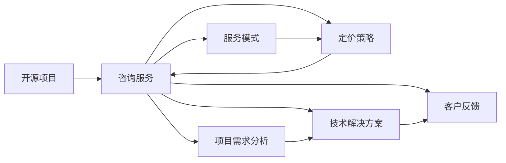

                 

# 建立开源项目的咨询业务：服务模式与定价

## 1. 背景介绍

随着开源项目的兴起，越来越多的开发者和公司选择开放其代码以供社区成员协作开发。这种模式不仅促进了技术的进步，也催生了许多新兴的商业机会，其中之一便是针对开源项目的咨询服务。本文将探讨如何建立一个基于开源项目的咨询服务业务，并讨论定价策略和服务模式。

### 1.1 问题的由来
开源社区的发展为初创企业提供了丰富的资源，但也带来了技术选择和管理上的复杂性。许多企业希望通过咨询服务来获得专业的技术指导，以加速项目的开发进程和提高产品质量。这为咨询业务的建立提供了市场基础。

### 1.2 问题核心关键点
建立开源项目咨询业务的核心在于如何提供专业、高效且经济的服务，同时确保服务的质量和可持续性。这涉及到选择服务模式、制定合理的定价策略、构建服务流程以及维护服务质量。

### 1.3 问题研究意义
通过本文的探讨，企业可以了解到如何通过咨询业务利用开源社区资源，提升自身的技术水平和市场竞争力。同时，本文也为开源项目咨询业务的从业者提供了一个全面的指南，帮助他们在竞争激烈的市场中脱颖而出。

## 2. 核心概念与联系

### 2.1 核心概念概述
为了更好地理解建立开源项目咨询业务的过程，我们需要理解几个关键概念：

- **开源项目**：指通过许可协议公开其代码和开发过程的项目。如Apache、MIT、GPL等。
- **咨询服务**：指为项目提供专业的技术指导、解决方案和策略的商业活动。
- **服务模式**：指咨询服务提供的形式，包括固定价格、按小时计费、订阅制等。
- **定价策略**：指确定咨询服务费用的方法，如成本加成、价值定价、市场定价等。

这些概念之间通过开源项目、咨询服务、服务模式和定价策略相互联系，共同构成了开源项目咨询业务的基础。

### 2.2 核心概念原理和架构的 Mermaid 流程图(Mermaid 流程节点中不要有括号、逗号等特殊字符)



这个流程图展示了开源项目、咨询服务、服务模式和定价策略之间的关系：

1. **开源项目**：作为咨询服务的出发点和咨询服务的目标。
2. **咨询服务**：通过服务模式和定价策略实现对开源项目的指导和支持。
3. **服务模式**：决定了咨询服务的提供方式。
4. **定价策略**：决定了咨询服务的收费标准。
5. **项目需求分析**：咨询服务的第一步，了解客户需求。
6. **技术解决方案**：基于需求分析提供的技术指导。
7. **客户反馈**：持续改进咨询服务的依据。

## 3. 核心算法原理 & 具体操作步骤
### 3.1 算法原理概述

建立一个成功的开源项目咨询业务，其核心在于提供高质量的咨询服务。这涉及到两个主要方面：选择合适的服务模式和制定合理的定价策略。

### 3.2 算法步骤详解

#### 3.2.1 选择服务模式

选择服务模式时，需考虑以下几个因素：

1. **客户需求**：根据客户的需求选择最合适的服务模式。例如，如果需要快速解决特定问题，可以选择按小时计费模式。
2. **项目复杂度**：对于复杂的项目，可以选择订阅制，以提供长期的技术支持和维护。
3. **资源可用性**：考虑自身的资源限制，如技术团队规模、时间成本等。

常见的服务模式包括：

- **按小时计费**：适用于快速解决问题和简单的需求。
- **固定价格**：适用于项目需求明确且较为简单的项目。
- **订阅制**：适用于需要长期支持的项目，如定期技术咨询、维护等。

#### 3.2.2 制定定价策略

制定定价策略时，需考虑以下几个方面：

1. **成本加成**：基于提供服务的成本（如人力、技术、时间等）进行定价。
2. **价值定价**：根据咨询服务对客户业务的影响和价值进行定价。
3. **市场定价**：参考市场同类服务的定价，结合自身优势进行定价。

### 3.3 算法优缺点

**按小时计费模式**的优点是灵活性强，可以根据项目需求和复杂度快速调整资源。缺点是成本透明度低，容易产生费用积累。

**固定价格模式**的优点是成本透明度高，客户预期明确。缺点是灵活性差，不能应对项目需求的变化。

**订阅制模式**的优点是客户长期受益，成本可控。缺点是需要持续投入资源，且客户可能对长期费用有顾虑。

### 3.4 算法应用领域

开源项目咨询业务的应用领域广泛，主要包括以下几个方面：

- **软件开发**：为企业提供软件开发指导、代码审查、性能优化等。
- **系统集成**：帮助企业集成多种开源组件，实现系统功能。
- **数据管理和分析**：提供数据收集、清洗、分析和可视化的咨询服务。
- **安全保障**：提供开源项目的安全评估、漏洞修复和风险管理等服务。
- **技术培训**：为企业的开发人员提供技术培训，提升其技术水平。

## 4. 数学模型和公式 & 详细讲解 & 举例说明

### 4.1 数学模型构建

假设客户有n个项目需求，每个需求估计需要m小时的技术支持。设单位小时成本为C。则总成本为：

$$ \text{Total Cost} = n \times m \times C $$

设客户支付的总费用为P，则定价策略可以表示为：

$$ P = n \times m \times C + \text{Commission} $$

其中，Commission表示咨询公司的利润。

### 4.2 公式推导过程

在上述模型中，n和m为变量，C和Commission为常数。我们可以进一步推导，设Commission占总成本的比例为K，则：

$$ P = n \times m \times C + K \times (n \times m \times C) = (1 + K) \times n \times m \times C $$

这意味着，定价策略不仅考虑了成本加成，还加入了利润比例。

### 4.3 案例分析与讲解

假设某个企业有5个项目需求，每个项目需要10小时的技术支持，单位小时成本为50元，咨询公司希望获得利润率为20%的佣金。则定价策略计算如下：

1. 总成本 = 5个项目 × 10小时/项目 × 50元/小时 = 2500元
2. 总费用 = 2500元 + 20% × 2500元 = 3000元
3. 客户支付 = 3000元

这意味着，企业需支付3000元以获得5个项目的技术支持，其中2500元为成本，500元为咨询公司的利润。

## 5. 项目实践：代码实例和详细解释说明

### 5.1 开发环境搭建

建立一个咨询业务的开发环境，需要考虑以下几个方面：

1. **开发工具**：如Git、JIRA、Slack等项目管理工具。
2. **技术栈**：选择适合的技术栈，如JavaScript、Python、Ruby等。
3. **服务器**：选择适合的开源服务器环境，如Linux、Apache等。

### 5.2 源代码详细实现

以下是一个简化的开源项目咨询业务系统示例代码：

```python
class Service:
    def __init__(self, hours, cost_per_hour, commission_rate):
        self.hours = hours
        self.cost_per_hour = cost_per_hour
        self.commission_rate = commission_rate
        self.commission = self.commission_rate * self.hours * self.cost_per_hour
        self.total_cost = self.hours * self.cost_per_hour + self.commission

    def get_price(self):
        return self.total_cost

# 示例
hours = 10
cost_per_hour = 50
commission_rate = 0.2
service = Service(hours, cost_per_hour, commission_rate)
price = service.get_price()
print(f"Total price: {price}")
```

### 5.3 代码解读与分析

**Service类**：
- **__init__方法**：初始化项目需求、单位小时成本和利润率。
- **commission属性**：计算利润。
- **total_cost属性**：计算总成本。
- **get_price方法**：返回总费用。

**示例**：
- **服务实例**：创建了一个服务实例，代表一个项目需求。
- **计算总费用**：根据给定的参数计算总费用。
- **输出结果**：打印出总费用。

这个示例代码演示了如何根据给定的参数计算服务费用，是建立咨询业务的基础代码。

### 5.4 运行结果展示

运行上述代码，输出结果为：

```
Total price: 3000
```

这表示，根据给定的参数计算，总费用为3000元。

## 6. 实际应用场景

### 6.1 开源社区协作平台

在开源社区协作平台中，咨询业务可以提供技术指导、代码审核、性能优化等服务。例如，在GitHub上，通过GitHub Actions和GitHub Pages等工具，可以提供持续集成、持续部署等服务。

### 6.2 企业技术支持

许多企业希望利用开源技术加速其产品开发和市场部署。咨询业务可以提供项目规划、技术指导、代码审查等服务，帮助企业提升技术水平和市场竞争力。

### 6.3 公共服务和产品开发

政府和企业可以利用开源项目进行公共服务和产品开发。咨询业务可以提供技术评估、解决方案设计、系统集成等服务，确保项目顺利进行。

### 6.4 未来应用展望

随着开源项目在各行业的普及，咨询业务的市场需求将进一步扩大。未来，咨询业务将向更加智能化、高效化和定制化方向发展，提供更灵活、高效的服务。

## 7. 工具和资源推荐

### 7.1 学习资源推荐

为了帮助咨询业务从业者提升技能，以下是一些推荐的学习资源：

1. **GitHub文档**：提供了Git和GitHub的基础知识，适合初学者使用。
2. **JIRA教程**：GitHub官方提供的JIRA教程，帮助用户掌握JIRA的使用。
3. **Slack文档**：Slack官方提供的Slack使用教程，帮助用户熟悉Slack的功能。
4. **Python编程**：学习Python编程基础，如Python官方文档、在线教程等。
5. **项目管理和版本控制**：学习项目管理、版本控制等知识，如敏捷开发、Scrum等。

### 7.2 开发工具推荐

以下是一些推荐的开发工具，帮助咨询业务从业者提升工作效率：

1. **Git**：全球最大的分布式版本控制系统，广泛用于代码版本控制。
2. **JIRA**：开源项目管理工具，提供任务追踪、问题管理等功能。
3. **Slack**：团队沟通工具，支持即时消息、频道、文件共享等。
4. **Zoom**：视频会议和在线沟通工具，支持高清视频、屏幕共享等。
5. **Trello**：在线项目管理工具，提供看板视图、标签、截止日期等。

### 7.3 相关论文推荐

以下是一些推荐的相关论文，帮助从业者了解最新研究进展：

1. **开源社区的协作模式研究**：探讨开源社区的协作模式和最佳实践。
2. **开源项目的管理和优化**：介绍开源项目的管理和优化方法。
3. **咨询服务业务的发展**：研究咨询业务的现状和发展趋势。
4. **成本加成和价值定价的对比**：比较成本加成和价值定价的优缺点和适用场景。

## 8. 总结：未来发展趋势与挑战

### 8.1 研究成果总结

本文探讨了如何建立基于开源项目的咨询服务业务，并讨论了定价策略和服务模式的选择。通过深入分析，提供了全面的指导和解决方案。

### 8.2 未来发展趋势

未来，咨询服务业务将向智能化、高效化和定制化方向发展。随着开源项目的应用范围扩大，咨询业务的市场需求将持续增长。

### 8.3 面临的挑战

尽管咨询业务前景广阔，但仍面临以下挑战：

1. **技术更新快**：需要持续学习和更新技术，以保持竞争力。
2. **客户需求多变**：需要灵活应对客户需求的变化。
3. **成本控制**：需要有效控制成本，提高利润率。
4. **服务质量**：需要确保服务质量，满足客户期望。

### 8.4 研究展望

未来，咨询服务业务需要不断创新和优化，以应对市场的变化和挑战。以下是一些研究展望：

1. **自动化和智能化**：利用AI和机器学习技术，提高服务效率和质量。
2. **多模态支持**：提供多模态支持，如文本、代码、视频等。
3. **社区协作**：促进社区协作，建立开放、透明的服务模式。
4. **定制化服务**：提供定制化服务，满足客户的特定需求。

## 9. 附录：常见问题与解答

**Q1：如何选择合适的服务模式？**

A: 根据客户需求、项目复杂度和自身资源限制，选择合适的服务模式。如按小时计费、固定价格、订阅制等。

**Q2：如何制定合理的定价策略？**

A: 考虑成本加成、价值定价和市场定价，结合自身优势和客户需求，制定合理的定价策略。

**Q3：如何确保服务质量？**

A: 通过持续学习和更新技术，保持服务的高效和高质量。同时，建立客户反馈机制，不断改进服务。

**Q4：如何应对技术更新快的挑战？**

A: 持续学习和培训，保持技术更新。与开源社区保持紧密联系，获取最新的技术资讯和解决方案。

**Q5：如何提高服务效率？**

A: 利用自动化工具和机器学习技术，提高服务效率和质量。

---

作者：禅与计算机程序设计艺术 / Zen and the Art of Computer Programming

