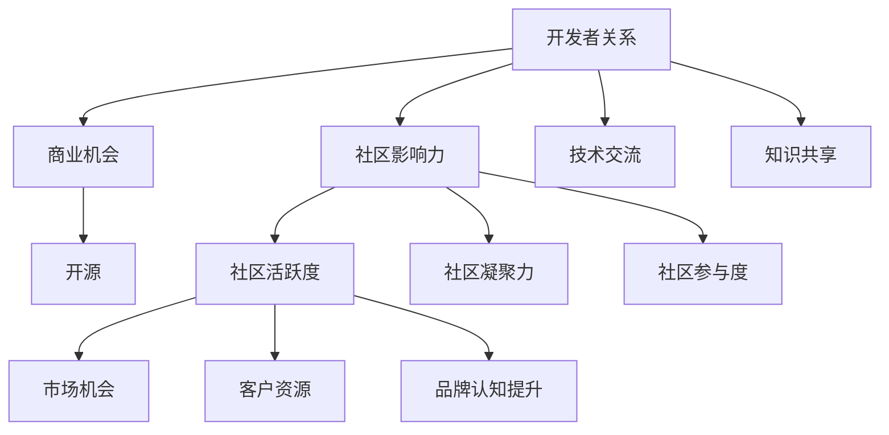

                 

# 开发者关系：将社区影响力转化为商业机会

> 关键词：开发者关系, 社区影响力, 商业机会, 生态系统, 开源, 技术交流, 知识共享

## 1. 背景介绍

在当今快速发展的科技时代，技术创新已成为驱动经济发展的重要引擎。然而，技术创新不仅仅是研发团队的孤军奋战，更是需要一个庞大的开发者社区共同协作的结果。在这样的背景下，开发者关系（Developer Relations, DR）逐渐成为各大科技公司重视的战略资源。

### 1.1 社区建设的重要性
开发者关系，是指企业在与开发者社区互动的过程中所建立起来的合作关系。这些关系不仅包括技术交流、知识共享、合作伙伴关系等，还包括对社区的影响力和支持，从而构建起一个良性的生态系统。社区的活跃度和影响力，直接影响着技术传播的速度和广度，对企业的长期发展具有重要影响。

### 1.2 社区对商业的驱动作用
随着技术的深入发展，许多企业开始认识到，一个活跃、健康且具有强烈创新力的开发者社区，对于推动产品创新、加速技术部署、提升品牌认知等方面具有不可替代的作用。社区中的开发者不仅能够贡献代码，还能提供技术支持、参与技术讨论、提升产品体验等，这些都有助于企业实现商业目标。

### 1.3 当前社区建设面临的挑战
尽管社区对于企业的价值越来越明显，但在实践中，许多企业仍面临诸多挑战，如社区管理难度大、开发者参与度低、社区运营成本高等。如何有效地将社区影响力转化为实际的商业机会，成为摆在各大企业面前的一大难题。

## 2. 核心概念与联系

### 2.1 核心概念概述

为更好地理解开发者关系，本节将介绍几个密切相关的核心概念：

- **开发者关系（Developer Relations, DR）**：企业与开发者社区之间的互动关系，旨在通过技术交流、知识共享、合作伙伴关系等方式，构建一个支持企业技术发展的社区。

- **社区影响力（Community Impact）**：指企业通过社区建设、技术支持等方式，对开发者社区产生的正面影响，包括提升社区活跃度、增强社区凝聚力、提升社区参与度等。

- **商业机会（Business Opportunity）**：指企业通过社区关系，获得的市场机会、客户资源、品牌认知提升等商业价值。

- **开源（Open Source）**：一种协作开发、代码共享的软件生产模式，是社区构建的重要基础。

- **技术交流（Technology Exchange）**：开发者之间、开发者与企业之间的技术讨论和分享，是社区活力和创新力的重要来源。

- **知识共享（Knowledge Sharing）**：开发者共享经验、技术解决方案等知识，是社区健康发展的关键。

这些核心概念之间的逻辑关系可以通过以下Mermaid流程图来展示：



这个流程图展示了几大核心概念之间的关系：

1. 开发者关系通过社区建设和技术支持等活动，提升社区的活跃度和凝聚力，增强社区参与度。
2. 社区影响力增强，企业获得的市场机会、客户资源和品牌认知提升等商业机会也会随之增加。
3. 开源和知识共享是社区建设的重要组成部分，它们共同作用于社区的影响力和企业的商业机会。

这些概念共同构成了开发者关系和社区建设的理论框架，为理解如何将社区影响力转化为商业机会提供了基础。

## 3. 核心算法原理 & 具体操作步骤

### 3.1 算法原理概述

将社区影响力转化为商业机会，本质上是一个复杂的数据分析与决策优化问题。其核心在于，通过评估社区的影响力指标，识别和预测这些指标对商业价值的影响，从而制定相应的策略和措施。

形式化地，假设社区影响力指标为 $I$，商业机会价值为 $V$，则两者之间的关系可以表示为：

$$
V = f(I)
$$

其中 $f$ 为影响函数，描述了社区影响力对商业机会的具体作用方式。

为了更好地分析和量化社区影响力与商业机会之间的关系，通常采用以下步骤：

1. **数据收集**：收集社区活跃度、开发者参与度、技术贡献度等关键指标。
2. **数据分析**：对收集到的数据进行分析，识别与商业机会相关的影响因子。
3. **模型建立**：基于影响函数，建立数学模型，预测社区影响力对商业机会的影响。
4. **策略制定**：根据预测结果，制定相应的社区管理和运营策略。

### 3.2 算法步骤详解

以下是基于上述理论模型的具体操作步骤：

**Step 1: 数据收集**
- 定义社区影响力指标，如GitHub上的开源项目贡献次数、社区讨论量、技术会议参与度等。
- 收集企业与社区互动的数据，如技术支持记录、社区活动参与情况、开发者关系团队的工作日志等。
- 利用爬虫工具、API接口等手段，从社区平台、社交媒体等渠道收集相关数据。

**Step 2: 数据分析**
- 对收集到的数据进行清洗和预处理，去除噪声和异常值。
- 使用统计方法（如均值、方差、标准差等）描述数据的基本特征。
- 应用聚类分析、关联规则挖掘等技术，识别社区影响力的关键因素和影响规律。

**Step 3: 模型建立**
- 选择合适的数学模型（如线性回归、逻辑回归、决策树等），建立社区影响力与商业机会之间的关系。
- 对模型进行训练和验证，确保其准确性和稳定性。
- 根据预测结果，分析社区影响力的提升和降低对商业机会的具体影响。

**Step 4: 策略制定**
- 根据模型预测结果，制定相应的社区管理和运营策略。
- 识别对商业机会有显著影响的社区活动，重点投入资源。
- 优化社区参与路径，提升开发者参与度，增强社区凝聚力。
- 设立社区激励机制，鼓励开发者贡献代码和技术支持。

### 3.3 算法优缺点

将社区影响力转化为商业机会的方法具有以下优点：
1. 数据驱动决策：通过数据分析和模型预测，科学制定社区管理和运营策略，避免盲目投入。
2. 精准识别关键指标：能够识别对商业机会影响最大的社区影响力因子，确保资源利用效率。
3. 灵活调整策略：根据预测结果，实时调整社区运营策略，提高适应性和响应速度。

同时，该方法也存在一定的局限性：
1. 数据收集难度大：社区数据来源广泛，收集和处理工作量大。
2. 模型复杂度较高：建立精准的数学模型需要大量数据和专业知识，对技术和资源要求较高。
3. 结果解释性差：模型预测结果往往难以直接解释，需要结合实际经验和专业知识进行判断。

尽管如此，基于数据分析的社区影响力转化为商业机会的方法，仍是大规模社区管理的重要参考和工具。

### 3.4 算法应用领域

将社区影响力转化为商业机会的方法，在技术企业中的应用十分广泛，包括但不限于以下几个方面：

- **开源项目支持**：通过技术贡献、社区活动等方式，提升开源项目的活跃度和质量，吸引更多开发者参与。
- **开发者培训与认证**：建立开发者培训体系和认证机制，提高社区参与度，增强企业品牌认知。
- **技术交流与合作**：举办技术会议、黑客马拉松等活动，促进开发者之间的技术交流和合作。
- **客户关系管理**：通过社区活动和开发者关系团队的支持，提升客户对企业产品的认同感和忠诚度。
- **市场推广与销售**：利用社区影响力进行市场推广和销售，扩大产品覆盖面和用户基数。

## 4. 数学模型和公式 & 详细讲解 & 举例说明

### 4.1 数学模型构建

本节将使用数学语言对社区影响力转化为商业机会的预测过程进行更加严格的刻画。

设社区影响力指标为 $I$，商业机会价值为 $V$，假设两者之间的关系可以表示为线性函数：

$$
V = \alpha I + \beta
$$

其中 $\alpha$ 为影响系数，$\beta$ 为截距。

社区影响力指标 $I$ 可以进一步分解为多个子指标，如代码贡献次数、社区讨论量、技术会议参与度等，每个子指标 $i$ 对商业机会价值 $V$ 的影响可以表示为：

$$
V_i = \gamma_i I_i + \delta
$$

其中 $\gamma_i$ 为子指标 $i$ 的影响系数，$\delta$ 为截距。

将这些子指标代入总模型中，可以得到社区影响力对商业机会的综合影响：

$$
V = \sum_{i} \gamma_i I_i + \delta
$$

### 4.2 公式推导过程

为了更直观地理解上述模型的推导过程，我们以一个简单的例子来详细解释：

假设企业开发了一个开源项目，该项目在GitHub上的活跃度可以通过代码贡献次数和社区讨论量来衡量。设 $I_1$ 为代码贡献次数，$I_2$ 为社区讨论量，模型关系可以表示为：

$$
V = \alpha_1 I_1 + \alpha_2 I_2 + \beta
$$

其中 $\alpha_1$ 和 $\alpha_2$ 为代码贡献次数和社区讨论量的影响系数，$\beta$ 为截距。

在实践中，可以通过历史数据拟合模型，得到具体的 $\alpha_1$、$\alpha_2$ 和 $\beta$ 值。例如，假设模型拟合结果为 $\alpha_1=0.2$、$\alpha_2=0.3$、$\beta=5$，则对于代码贡献次数为 $I_1=100$，社区讨论量为 $I_2=50$ 的开源项目，预测的商业机会价值为：

$$
V = 0.2 \times 100 + 0.3 \times 50 + 5 = 25 + 15 + 5 = 45
$$

### 4.3 案例分析与讲解

假设某公司希望提升其开源项目的活跃度，以吸引更多的开发者参与。该公司收集了过去一年内开源项目的代码贡献次数、社区讨论量、技术会议参与度等数据，建立了如下数学模型：

$$
V = 0.1 I_1 + 0.2 I_2 + 0.3 I_3 + 2
$$

其中 $I_1$、$I_2$ 和 $I_3$ 分别表示代码贡献次数、社区讨论量和技术会议参与度。模型的截距为2，表示即使不进行任何社区活动，也存在基本的商业机会价值。

通过模型分析，公司发现：
- 代码贡献次数对商业机会价值的影响最大，为0.1，即每次代码贡献可增加1%的商业机会价值。
- 社区讨论量和技术会议参与度的影响分别为0.2和0.3，表明两者对商业机会的贡献同样重要。

基于此，公司可以制定相应的社区活动策略：
- 加大对代码贡献者的奖励和表彰，鼓励更多代码贡献。
- 组织更多的技术会议和社区讨论，提升社区活跃度。
- 设立专门的开发者关系团队，负责社区管理和活动组织。

通过这些措施，公司能够有效提升社区的活跃度，增加商业机会价值，实现业务增长。

## 5. 项目实践：代码实例和详细解释说明

### 5.1 开发环境搭建

在进行社区影响力转化为商业机会的实践前，我们需要准备好开发环境。以下是使用Python进行数据分析和模型训练的环境配置流程：

1. 安装Anaconda：从官网下载并安装Anaconda，用于创建独立的Python环境。

2. 创建并激活虚拟环境：
```bash
conda create -n dr-env python=3.8 
conda activate dr-env
```

3. 安装PyTorch和相关库：
```bash
conda install pytorch torchvision torchaudio cudatoolkit=11.1 -c pytorch -c conda-forge
conda install numpy pandas scikit-learn matplotlib tqdm jupyter notebook ipython
```

4. 安装相关工具包：
```bash
pip install networkx scikit-learn seaborn
```

完成上述步骤后，即可在`dr-env`环境中开始实践。

### 5.2 源代码详细实现

下面我们以开源项目活跃度分析为例，给出使用Python进行数据分析和模型训练的代码实现。

首先，定义数据结构和数据加载函数：

```python
import pandas as pd
import numpy as np
from sklearn.model_selection import train_test_split
from sklearn.linear_model import LinearRegression

class CommunityDataLoader:
    def __init__(self, file_path):
        self.file_path = file_path
        self.data = pd.read_csv(self.file_path, index_col='index')

    def get_train_test_data(self, test_size=0.2):
        features = self.data.drop('V', axis=1)
        labels = self.data['V']
        train_features, test_features, train_labels, test_labels = train_test_split(features, labels, test_size=test_size, random_state=42)
        return train_features, test_features, train_labels, test_labels
```

然后，定义数据处理和模型训练函数：

```python
class CommunityModel:
    def __init__(self, features, labels):
        self.model = LinearRegression()
        self.model.fit(features, labels)

    def predict(self, features):
        return self.model.predict(features)

# 数据加载
data_loader = CommunityDataLoader('community_data.csv')

# 获取训练和测试数据
train_features, test_features, train_labels, test_labels = data_loader.get_train_test_data()

# 模型训练
model = CommunityModel(train_features, train_labels)
model.train()

# 模型预测
predictions = model.predict(test_features)
```

最后，评估模型性能：

```python
from sklearn.metrics import mean_squared_error

mse = mean_squared_error(test_labels, predictions)
print(f"Mean Squared Error: {mse:.2f}")
```

以上就是使用Python进行社区影响力转化为商业机会的完整代码实现。可以看到，通过使用线性回归模型，我们能够对社区影响力与商业机会之间的关系进行预测，并通过评估指标（如均方误差）对模型性能进行评估。

### 5.3 代码解读与分析

让我们再详细解读一下关键代码的实现细节：

**CommunityDataLoader类**：
- `__init__`方法：初始化数据加载器，加载指定路径的CSV文件，并指定'index'列为索引。
- `get_train_test_data`方法：分割数据为训练集和测试集，返回分割后的特征和标签。

**CommunityModel类**：
- `__init__`方法：初始化线性回归模型。
- `predict`方法：使用模型进行预测，返回预测值。

**数据加载和模型训练**：
- 首先创建CommunityDataLoader实例，加载CSV数据。
- 调用`get_train_test_data`方法，将数据分割为训练集和测试集。
- 创建CommunityModel实例，使用训练数据拟合模型。
- 使用`predict`方法进行测试数据预测，并计算预测误差。

通过以上代码实现，我们能够对社区影响力转化为商业机会的过程进行数据驱动的分析和预测，从而制定相应的社区管理和运营策略。

## 6. 实际应用场景

### 6.1 智能客服系统

在智能客服系统中，开发者关系团队可以通过构建开发者社区，吸引开发者提交代码、参与技术讨论，从而提升系统功能和用户体验。社区中的开发者不仅能够贡献代码，还能提供技术支持和反馈，帮助企业持续改进产品。

通过社区的影响力，企业可以提升系统功能，增强用户黏性，提高市场竞争力。例如，某智能客服系统可以通过开发者关系团队引入开源项目，提升系统的数据处理能力和智能推荐功能。同时，通过社区活动和开发者培训，提高客服人员的技术水平，提升客户满意度。

### 6.2 金融科技平台

在金融科技平台中，开发者关系团队可以通过构建开发者社区，吸引开发者贡献算法、模型和工具，提升平台的功能和性能。社区中的开发者不仅能够提供代码和技术支持，还能参与技术讨论和市场推广，帮助企业快速迭代产品。

通过社区的影响力，企业可以提升平台的稳定性和安全性，增强用户信任和依赖。例如，某金融科技平台可以通过开发者关系团队引入金融领域的专业算法和模型，提升平台的风险评估能力和用户理财建议的准确性。同时，通过社区活动和开发者培训，提高开发人员的编程能力和技术水平，提升产品开发效率。

### 6.3 医疗健康平台

在医疗健康平台中，开发者关系团队可以通过构建开发者社区，吸引开发者贡献医疗数据和算法，提升平台的数据质量和功能。社区中的开发者不仅能够提供数据和技术支持，还能参与技术讨论和市场推广，帮助企业快速迭代产品。

通过社区的影响力，企业可以提升平台的数据准确性和功能完善度，增强用户的医疗体验。例如，某医疗健康平台可以通过开发者关系团队引入医疗领域的专业数据和算法，提升平台的诊断准确性和治疗建议的科学性。同时，通过社区活动和开发者培训，提高开发人员的医疗知识和编程能力，提升产品开发效率。

### 6.4 未来应用展望

随着开发者关系和社区建设的重要性日益凸显，未来社区的影响力和商业价值将会进一步增强。以下是一些可能的未来应用方向：

- **全球化社区构建**：企业可以通过跨地区、跨文化的开发者关系团队，构建全球化的社区，吸引更多国际开发者参与，提升品牌认知度。
- **社区成员分级管理**：企业可以根据开发者贡献和技术水平，进行分级管理，建立社区荣誉体系，激励开发者积极参与。
- **社区技术标准制定**：企业可以主导或参与社区技术标准的制定，提升产品兼容性，增强市场竞争力。
- **社区数据共享与合作**：企业可以通过数据共享和合作，提升社区的数据质量和功能，实现更高效的技术创新。

## 7. 工具和资源推荐

### 7.1 学习资源推荐

为了帮助开发者系统掌握开发者关系和社区建设的理论基础和实践技巧，这里推荐一些优质的学习资源：

1. **《开发者关系管理手册》**：介绍了开发者关系的基本概念、实践方法和管理工具，是开发者关系从业者的必读书籍。
2. **《社区管理与运营》课程**：通过线上课程，系统讲解社区建设和管理的关键方法和技巧，适合技术企业的产品经理和开发者关系团队。
3. **《开源社区管理》书籍**：详细介绍了开源社区的运营管理、参与者激励和社区文化建设等关键内容，是开源项目管理的经典之作。
4. **开发者关系博客**：各大企业开发者关系团队的博客，分享社区建设和运营的实践经验和成功案例，值得参考学习。

通过对这些资源的学习实践，相信你一定能够快速掌握开发者关系和社区建设的方法论，并用于解决实际的社区管理问题。

### 7.2 开发工具推荐

高效的开发离不开优秀的工具支持。以下是几款用于开发者关系和社区管理开发的常用工具：

1. **JIRA**：项目管理工具，适用于社区活动管理和开发者贡献追踪。
2. **GitHub**：代码托管平台，适用于开源项目管理和开发者贡献。
3. **Slack**：团队沟通工具，适用于社区交流和开发者互动。
4. **Zoom**：视频会议工具，适用于远程社区活动和技术讨论。
5. **Google Colab**：在线Jupyter Notebook环境，适用于数据分析和模型训练。

合理利用这些工具，可以显著提升开发者关系和社区管理的效率，加快创新迭代的步伐。

### 7.3 相关论文推荐

开发者关系和社区建设的研究始于学界的持续研究。以下是几篇奠基性的相关论文，推荐阅读：

1. **《开发者关系管理：现状、挑战与未来》**：全面概述了开发者关系的基本概念、实践方法和未来发展方向，是研究开发者关系的重要参考资料。
2. **《开源社区的组织与运营》**：通过案例分析，深入探讨了开源社区的组织架构、运营管理和技术创新，提供了宝贵的实践经验。
3. **《社区影响力与商业机会》**：利用数据科学方法，分析了社区影响力对商业机会的影响，提出了基于数据分析的社区管理策略。
4. **《开发者关系与技术创新》**：研究了开发者关系对技术创新的促进作用，提供了大量实证数据和分析结果。

这些论文代表了大开发者关系和社区建设的研究脉络。通过学习这些前沿成果，可以帮助研究者把握学科前进方向，激发更多的创新灵感。

## 8. 总结：未来发展趋势与挑战

### 8.1 总结

本文对开发者关系和社区影响力转化为商业机会的方法进行了全面系统的介绍。首先阐述了开发者关系和社区建设的重要性，明确了社区影响力对商业机会的具体作用。其次，从理论到实践，详细讲解了社区影响力转化为商业机会的数学模型和操作步骤，给出了社区管理实践的完整代码实例。同时，本文还广泛探讨了社区影响力在智能客服、金融科技、医疗健康等多个领域的应用前景，展示了开发者关系的巨大潜力。

通过本文的系统梳理，可以看到，开发者关系和社区影响力对技术企业的商业价值有着不可忽视的作用。有效的社区管理和运营，不仅能够提升产品功能和用户体验，还能增强品牌认知度，促进技术创新，带来长期的商业回报。

### 8.2 未来发展趋势

展望未来，开发者关系和社区建设将呈现以下几个发展趋势：

1. **技术融合与协同**：开发者关系将与AI、大数据、区块链等技术融合，提升社区管理的智能化水平，实现更高效的技术创新。
2. **跨领域应用拓展**：开发者关系将扩展到更多垂直领域，如医疗、教育、工业等，为企业提供跨领域的解决方案。
3. **全球化与本地化结合**：企业将构建全球化的开发者社区，同时注重本地化运营，提升全球化影响力。
4. **社区成员分级管理**：企业将建立社区成员的分级管理制度，激励高价值开发者积极参与，提升社区活跃度。
5. **社区技术标准制定**：企业将主导或参与社区技术标准的制定，提升产品兼容性和市场竞争力。
6. **数据共享与合作**：企业将加强数据共享与合作，提升社区的数据质量和功能，实现更高效的技术创新。

这些趋势凸显了开发者关系和社区建设的广阔前景。这些方向的探索发展，必将进一步提升社区的活跃度和影响力，为技术企业带来更大的商业价值。

### 8.3 面临的挑战

尽管开发者关系和社区建设已经取得了显著成效，但在实践中仍面临诸多挑战：

1. **社区管理复杂度高**：社区成员众多，管理复杂度高，需要多层次、多维度的管理策略。
2. **开发者参与度不稳定**：社区中的开发者活跃度和参与度不稳定，需要通过激励机制和活动组织等方式维持社区的活跃度。
3. **社区数据安全性问题**：社区数据包含大量敏感信息，需要采取严格的保护措施，防止数据泄露和滥用。
4. **社区文化和价值观差异**：跨地区、跨文化的社区成员具有不同的文化和价值观，需要灵活管理，避免文化冲突。
5. **社区技术标准不一致**：不同社区的技术标准和规范可能不一致，需要协调和统一，避免技术壁垒。

这些挑战需要我们不断探索和优化，才能使开发者关系和社区建设真正发挥其价值。

### 8.4 研究展望

面对开发者关系和社区建设面临的挑战，未来的研究需要在以下几个方面寻求新的突破：

1. **社区自动化管理**：利用AI和大数据技术，实现社区成员的分级管理和自动化运营，提升管理效率。
2. **社区文化建设**：通过文化建设，营造积极的社区氛围，提升社区成员的归属感和参与度。
3. **社区数据保护与隐私**：建立严格的社区数据保护机制，确保数据安全，防止数据滥用。
4. **跨文化社区管理**：通过跨文化交流和协作，建立全球化的开发者社区，提升国际化影响力。
5. **社区技术标准统一**：通过技术合作和标准制定，实现不同社区的技术标准统一，提升产品兼容性和市场竞争力。

这些研究方向将为开发者关系和社区建设提供新的思路和方法，帮助企业在激烈的市场竞争中占据优势。

## 9. 附录：常见问题与解答

**Q1：开发者关系的重要性体现在哪些方面？**

A: 开发者关系的重要性体现在多个方面：
1. **技术创新**：开发者关系团队能够引入新的技术思路和创新方案，提升产品功能和性能。
2. **市场推广**：通过社区活动和技术支持，提升品牌认知度，扩大市场覆盖面。
3. **客户关系**：开发者关系团队能够提升客户对产品的认同感和忠诚度，增强客户黏性。
4. **资源整合**：开发者关系能够整合外部资源，如开源项目、技术合作伙伴等，提升企业资源利用效率。
5. **社区建设**：开发者关系团队能够构建健康的开发者社区，提升社区活跃度和影响力。

**Q2：如何进行社区管理和运营？**

A: 社区管理和运营是一个复杂的过程，需要综合考虑多个因素：
1. **社区规则制定**：制定社区规则和行为准则，确保社区健康有序发展。
2. **激励机制设计**：设计社区激励机制，如代码贡献奖励、技术支持回报等，激励开发者积极参与。
3. **活动组织与宣传**：组织社区活动和技术讨论，提升社区成员的参与度，并通过宣传提高社区知名度。
4. **数据分析与评估**：定期收集社区数据，进行数据分析和评估，了解社区健康状况，及时调整管理策略。
5. **社区文化建设**：通过文化建设，营造积极的社区氛围，提升社区成员的归属感和参与度。

**Q3：社区影响力转化为商业机会的数学模型如何选择？**

A: 社区影响力转化为商业机会的数学模型选择应根据具体情况而定：
1. **数据特征**：如果社区数据具有线性关系，则选择线性回归模型。如果具有非线性关系，则选择多项式回归、决策树等模型。
2. **预测精度**：选择预测精度高的模型，如随机森林、梯度提升树等。
3. **计算效率**：选择计算效率高的模型，如线性回归、逻辑回归等。
4. **模型可解释性**：选择模型可解释性高的模型，如线性回归、决策树等，便于理解模型内部机制。

**Q4：开发者关系团队如何建立和发展？**

A: 开发者关系团队的建立和发展需要多方面的努力：
1. **招募优秀的团队成员**：招募具有技术背景、社区管理经验的人才，建立专业的开发者关系团队。
2. **制定明确的职责和目标**：制定团队职责和目标，确保团队工作有序开展。
3. **建立有效的沟通渠道**：建立与开发者社区的沟通渠道，如Slack、邮件等，保持与社区成员的良好互动。
4. **持续学习和提升**：团队成员应持续学习和提升，掌握最新的社区管理和技术发展趋势。
5. **激励与认可**：通过激励机制和认可，鼓励团队成员积极参与社区管理。

**Q5：开发者关系对企业有哪些具体的商业价值？**

A: 开发者关系对企业的具体商业价值包括：
1. **提升产品功能和性能**：通过引入新的技术思路和创新方案，提升产品功能和性能。
2. **扩大市场覆盖面**：通过社区活动和技术支持，提升品牌认知度，扩大市场覆盖面。
3. **增强客户黏性**：开发者关系团队能够提升客户对产品的认同感和忠诚度，增强客户黏性。
4. **整合外部资源**：通过开发者关系团队，整合外部资源，如开源项目、技术合作伙伴等，提升企业资源利用效率。
5. **建立健康的开发者社区**：开发者关系团队能够构建健康的开发者社区，提升社区活跃度和影响力。

**Q6：社区影响力转化为商业机会的过程需要注意哪些细节？**

A: 社区影响力转化为商业机会的过程需要注意以下细节：
1. **数据收集和处理**：确保数据收集和处理过程的准确性和全面性，去除噪声和异常值。
2. **模型选择和训练**：选择适合的数学模型，并进行训练和验证，确保模型预测准确。
3. **结果解释和应用**：结合实际经验和专业知识，对模型预测结果进行解释，并应用于社区管理和运营策略中。
4. **定期评估和调整**：定期评估模型和策略的效果，根据实际情况进行动态调整。
5. **激励机制和活动组织**：设计激励机制和组织社区活动，提升社区成员的参与度和活跃度。

---

作者：禅与计算机程序设计艺术 / Zen and the Art of Computer Programming

