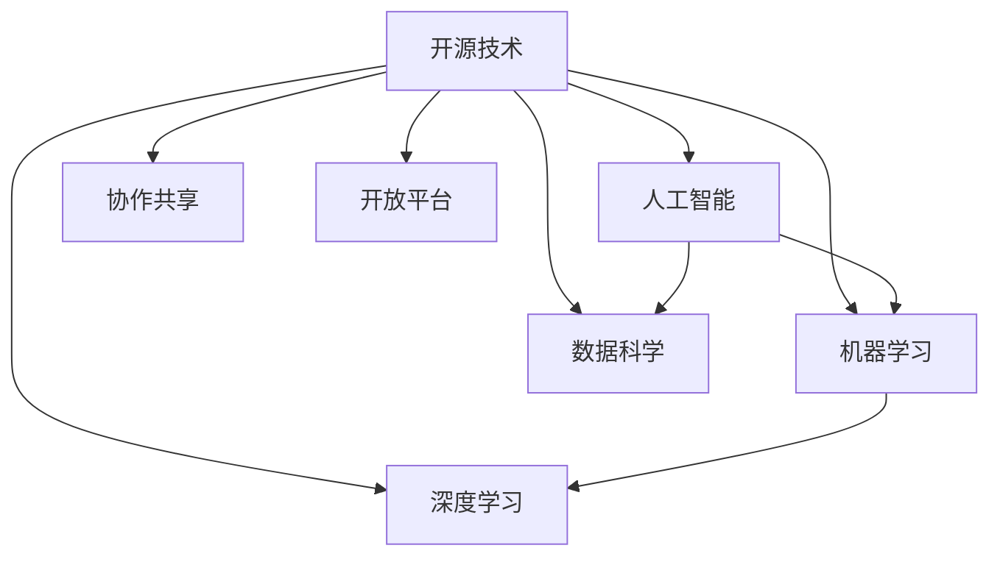

                 

# 开源技术在AI进步中的作用

> 关键词：开源技术,人工智能,机器学习,深度学习,数据科学,协作共享,开放平台

## 1. 背景介绍

### 1.1 问题由来
随着人工智能(AI)技术的迅猛发展，开源技术的广泛应用已经成为推动AI进步的重要力量。AI领域的开放源码运动，不仅极大地推动了学术研究的进展，也促进了AI技术的商业化进程。从深度学习框架、数据分析工具到应用算法，开源技术以其免费、灵活、高效的特点，受到了全球科技界的广泛关注和热烈追捧。

开源技术的兴起，打破了传统的技术壁垒，使得AI领域的研发和应用成本大幅降低，催生了一批创新型企业和创业公司。通过共享代码、工具和算法，科学家和工程师能够协作研究，快速迭代，共同推动AI技术的发展。同时，开源技术还在教育、医疗、金融、交通等众多领域得到了广泛应用，为各行各业的数字化转型提供了强大的技术支撑。

## 2. 核心概念与联系

### 2.1 核心概念概述

为更好地理解开源技术在AI进步中的作用，本节将介绍几个关键概念：

- **开源技术**：指公开源码、工具、算法和技术，允许开发者自由使用、修改和共享的技术形态。
- **人工智能**：指利用计算机技术，模拟人类智能行为的技术领域。
- **机器学习**：指利用数据和算法训练模型，自动提取数据特征，进行预测和决策的技术。
- **深度学习**：指使用多层神经网络结构，模仿人类大脑神经元工作方式，进行复杂任务处理的技术。
- **数据科学**：指通过数据收集、处理、分析和可视化，发现数据背后的规律，指导决策的技术。
- **协作共享**：指通过开源技术的开放性，促进跨机构、跨学科的合作交流，共同推进技术进步。
- **开放平台**：指基于开源技术构建的，提供计算资源、工具、算法等资源共享的平台。

这些概念之间的逻辑关系可以通过以下Mermaid流程图来展示：



这个流程图展示了开源技术对AI技术不同分支的促进作用，以及协作共享和开放平台对整个AI生态系统的积极影响。

## 3. 核心算法原理 & 具体操作步骤
### 3.1 算法原理概述

开源技术在AI进步中起到了至关重要的作用，尤其是在深度学习、机器学习等领域。其核心原理是：通过开放源码和算法，使得研究者和开发者能够自由地获取和使用最先进的技术，进行快速迭代和创新。

开源技术的算法原理主要包括以下几个方面：

1. **共享代码**：开发者可以将自己的算法、模型和工具公开分享，供他人使用和改进。
2. **协作研发**：通过开源社区，汇聚全球的智慧和力量，共同推进技术进步。
3. **开源竞赛**：各大开源社区和平台定期举办竞赛，激励研究人员和开发者不断突破技术瓶颈。
4. **开放算法**：提供一系列开源算法，方便研究者快速进行实验和验证。

这些原理共同作用，推动了AI技术的飞速发展，使得人工智能技术在各个领域得到了广泛应用。

### 3.2 算法步骤详解

基于开源技术进行AI研发和应用，一般包括以下几个关键步骤：

**Step 1: 选择开源框架和工具**
- 选择合适的深度学习框架（如TensorFlow、PyTorch）和数据分析工具（如Pandas、Scikit-learn）。
- 根据项目需求，选择适合的模型和算法。

**Step 2: 数据准备和预处理**
- 收集和整理数据集，进行清洗、归一化、标注等预处理操作。
- 将数据集划分为训练集、验证集和测试集。

**Step 3: 模型训练和验证**
- 使用开源工具训练模型，优化模型参数。
- 在验证集上评估模型性能，调整超参数，避免过拟合。

**Step 4: 模型评估和部署**
- 在测试集上评估模型效果，对比改进前后的性能。
- 将模型部署到实际应用场景中，进行实时推理。

**Step 5: 持续学习和优化**
- 定期收集新数据，对模型进行重新微调，提升模型效果。
- 集成反馈机制，不断改进模型性能。

以上步骤展示了开源技术在AI研发和应用中的核心流程。通过这些步骤，可以高效、灵活地开发AI模型，实现技术创新和应用落地。

### 3.3 算法优缺点

开源技术在AI进步中带来了诸多优势：

1. **成本低**：开源技术的免费使用大大降低了AI研发和应用成本，使得中小企业和研究机构也能够参与到AI技术的发展中来。
2. **灵活性高**：开发者可以根据自己的需求，自由修改和扩展开源代码，适应不同的应用场景。
3. **社区支持**：开源社区汇聚了全球最优秀的AI人才，提供了丰富的技术支持和资源共享。
4. **加速创新**：通过开源竞赛和协作研发，加速了AI技术的快速迭代和突破。

然而，开源技术也存在一些局限性：

1. **代码质量参差不齐**：开源代码的质量良莠不齐，开发者需要花费更多时间进行筛选和调试。
2. **版本管理复杂**：开源项目通常版本众多，开发者需要仔细跟踪每个版本的更新和差异。
3. **技术门槛高**：对于一些复杂的应用场景，开源技术的使用门槛较高，需要较高的技术水平和经验。

尽管存在这些局限性，但整体而言，开源技术在推动AI进步中发挥了不可替代的作用。未来相关研究的重点在于如何进一步降低使用门槛，提高代码质量，优化版本管理，增强社区协作，使开源技术在AI领域发挥更大的潜力。

### 3.4 算法应用领域

开源技术在AI领域的应用已经涵盖了多个领域，具体包括：

- **深度学习**：TensorFlow、PyTorch等深度学习框架的广泛应用，推动了计算机视觉、自然语言处理、语音识别等领域的快速发展。
- **机器学习**：Scikit-learn、XGBoost等开源算法库的应用，提高了分类、回归、聚类等机器学习任务的效率和效果。
- **数据科学**：Pandas、NumPy等开源工具的普及，提升了数据处理、分析和可视化的能力，加速了大数据分析的发展。
- **AI协作平台**：GitHub、Kaggle等开源协作平台，为全球AI研究者提供了丰富的数据集、模型和工具，促进了跨机构和跨学科的合作交流。
- **开源竞赛**：Kaggle、DrivenData等平台定期举办AI竞赛，激励了更多研究者投身AI技术创新，推动了AI技术的快速突破。

这些开源技术和平台不仅推动了AI技术的研究进展，还加速了AI技术的商业化应用。未来，开源技术将在更多的领域得到应用，为各行各业带来变革性的影响。

## 4. 数学模型和公式 & 详细讲解 & 举例说明

### 4.1 数学模型构建

在AI领域，数学模型是理解和描述数据规律的重要工具。以下是几个常见数学模型的构建过程：

1. **线性回归模型**：
   - 构建公式：$\hat{y} = \theta_0 + \theta_1 x_1 + \theta_2 x_2 + ... + \theta_n x_n$
   - 最小二乘法求解$\theta$：$\theta = (X^T X)^{-1} X^T y$

2. **逻辑回归模型**：
   - 构建公式：$\hat{y} = \frac{1}{1 + e^{-\theta^T x}}$
   - 交叉熵损失函数：$\ell(y, \hat{y}) = -(y \log \hat{y} + (1-y) \log (1-\hat{y}))$
   - 梯度下降优化：$\theta \leftarrow \theta - \eta \nabla_{\theta}\ell(y, \hat{y})$

3. **神经网络模型**：
   - 构建公式：$y = \sigma(W x + b)$
   - 链式法则计算梯度：$\frac{\partial \ell(y, \hat{y})}{\partial W} = \frac{\partial \ell(y, \hat{y})}{\partial y} \frac{\partial y}{\partial W}$
   - 反向传播算法计算全梯度：$\nabla_{\theta} \ell(y, \hat{y}) = \nabla_{\theta} \ell(y, \sigma(W x + b))$

4. **卷积神经网络模型**：
   - 构建公式：$y = \sigma(W * x + b)$
   - 卷积操作：$y = W * x$
   - 池化操作：$y = max_{i,j}(W * x)$

5. **循环神经网络模型**：
   - 构建公式：$y = \sigma(W x + U h_{t-1} + b)$
   - 链式法则计算梯度：$\frac{\partial \ell(y, \hat{y})}{\partial W} = \frac{\partial \ell(y, \hat{y})}{\partial y} \frac{\partial y}{\partial W}$
   - 反向传播算法计算全梯度：$\nabla_{\theta} \ell(y, \hat{y}) = \nabla_{\theta} \ell(y, \sigma(W x + U h_{t-1} + b))$

### 4.2 公式推导过程

下面我们以线性回归模型为例，详细推导其公式和梯度计算过程。

假设有一组数据集$(x_i, y_i), i=1,2,...,n$，其中$x_i$为特征向量，$y_i$为标签。线性回归模型的目标是最小化预测值与真实值之间的差异，即均方误差损失函数：

$$
\ell(y, \hat{y}) = \frac{1}{2N} \sum_{i=1}^N (y_i - \hat{y}_i)^2
$$

其中，$\hat{y}_i = \theta_0 + \theta_1 x_{i1} + \theta_2 x_{i2} + ... + \theta_n x_{in}$。

根据梯度下降算法，求解最小化损失函数$\ell(y, \hat{y})$的过程可以表示为：

$$
\theta \leftarrow \theta - \eta \nabla_{\theta}\ell(y, \hat{y})
$$

其中，$\eta$为学习率，$\nabla_{\theta}\ell(y, \hat{y})$为损失函数对$\theta$的梯度。

计算梯度的过程可以分为两步：

1. 计算预测值$\hat{y}_i$对$\theta$的偏导数：
$$
\frac{\partial \hat{y}_i}{\partial \theta_k} = x_{ik}
$$

2. 计算损失函数对预测值的偏导数：
$$
\frac{\partial \ell(y, \hat{y})}{\partial \hat{y}_i} = \frac{\partial \ell(y, \hat{y})}{\partial y_i} = -(y_i - \hat{y}_i)
$$

将上述两个偏导数代入梯度公式，得到：

$$
\nabla_{\theta}\ell(y, \hat{y}) = \frac{1}{N} \sum_{i=1}^N (y_i - \hat{y}_i) x_i
$$

通过链式法则，可以得到$\theta$的更新公式：

$$
\theta \leftarrow \theta - \eta \frac{1}{N} \sum_{i=1}^N (y_i - \hat{y}_i) x_i
$$

以上就是线性回归模型的数学模型构建和梯度计算过程。

## 5. 项目实践：代码实例和详细解释说明

### 5.1 开发环境搭建

在进行AI项目实践前，我们需要准备好开发环境。以下是使用Python进行TensorFlow开发的环境配置流程：

1. 安装Anaconda：从官网下载并安装Anaconda，用于创建独立的Python环境。

2. 创建并激活虚拟环境：
```bash
conda create -n tensorflow-env python=3.8 
conda activate tensorflow-env
```

3. 安装TensorFlow：根据CUDA版本，从官网获取对应的安装命令。例如：
```bash
conda install tensorflow tensorflow-gpu=cuda11.1 -c conda-forge
```

4. 安装各类工具包：
```bash
pip install numpy pandas scikit-learn matplotlib tqdm jupyter notebook ipython
```

完成上述步骤后，即可在`tensorflow-env`环境中开始AI项目实践。

### 5.2 源代码详细实现

这里我们以图像分类任务为例，给出使用TensorFlow进行线性回归模型训练的PyTorch代码实现。

首先，定义数据集：

```python
from tensorflow.keras.datasets import mnist
from tensorflow.keras.utils import to_categorical

(train_images, train_labels), (test_images, test_labels) = mnist.load_data()
train_images = train_images / 255.0
test_images = test_images / 255.0
train_labels = to_categorical(train_labels)
test_labels = to_categorical(test_labels)
```

然后，定义模型和优化器：

```python
import tensorflow as tf

model = tf.keras.Sequential([
    tf.keras.layers.Flatten(input_shape=(28, 28)),
    tf.keras.layers.Dense(10, activation='softmax')
])

optimizer = tf.keras.optimizers.Adam(learning_rate=0.001)
```

接着，定义训练和评估函数：

```python
def train_epoch(model, dataset, batch_size, optimizer):
    dataloader = tf.data.Dataset.from_tensor_slices((dataset[0], dataset[1])).batch(batch_size)
    for batch in dataloader:
        inputs, labels = batch
        with tf.GradientTape() as tape:
            outputs = model(inputs)
            loss = tf.keras.losses.categorical_crossentropy(labels, outputs)
        gradients = tape.gradient(loss, model.trainable_variables)
        optimizer.apply_gradients(zip(gradients, model.trainable_variables))

def evaluate(model, dataset, batch_size):
    dataloader = tf.data.Dataset.from_tensor_slices((dataset[0], dataset[1])).batch(batch_size)
    correct_predictions = 0
    total_predictions = 0
    for batch in dataloader:
        inputs, labels = batch
        outputs = model(inputs)
        predictions = tf.argmax(outputs, axis=1)
        total_predictions += labels.shape[0]
        correct_predictions += tf.reduce_sum(tf.cast(tf.equal(predictions, labels), tf.float32))
    return correct_predictions / total_predictions
```

最后，启动训练流程并在测试集上评估：

```python
epochs = 10
batch_size = 64

for epoch in range(epochs):
    train_epoch(model, train_images, batch_size, optimizer)
    print(f"Epoch {epoch+1}, train loss: {loss:.3f}")
    
    print(f"Epoch {epoch+1}, test accuracy: {evaluate(model, test_images, batch_size)}")
    
print("Final test accuracy:", evaluate(model, test_images, batch_size))
```

以上就是使用TensorFlow进行线性回归模型训练的完整代码实现。可以看到，TensorFlow提供的高级API使得模型构建和训练过程变得简洁高效。

### 5.3 代码解读与分析

让我们再详细解读一下关键代码的实现细节：

**data preparation**：
- 使用Keras的MNIST数据集，获取训练集和测试集的图片和标签。
- 将像素值归一化到0-1之间，避免梯度爆炸。
- 将标签进行one-hot编码，便于模型输出。

**model definition**：
- 构建一个包含一个Flatten层和Dense层的模型，其中Flatten层用于将二维图片展开为一维向量，Dense层用于分类输出。
- 使用Adam优化器，设定学习率为0.001。

**training and evaluation**：
- 定义训练和评估函数，使用Keras的Dataset API进行数据批处理。
- 在每个批次上，计算模型输出与真实标签之间的交叉熵损失，并反向传播更新模型参数。
- 在验证集上评估模型性能，计算准确率。

**training loop**：
- 循环10次进行模型训练，每次训练后在验证集上评估模型性能。
- 输出每个epoch的损失和测试集上的准确率。

通过这些步骤，可以高效地构建和训练线性回归模型，实现对图像分类任务的预测。

## 6. 实际应用场景

### 6.1 智能推荐系统

智能推荐系统是开源技术在AI领域的重要应用之一。通过机器学习和深度学习技术，推荐系统能够根据用户的历史行为和兴趣，推荐个性化的商品、内容和服务，提升用户体验和满意度。

具体而言，推荐系统通常包含以下几个关键步骤：

1. **用户画像构建**：通过收集用户的浏览、购买、评分等数据，构建用户画像，描述用户兴趣和行为特征。
2. **物品特征提取**：从物品的标题、描述、标签等文本信息中，提取物品的特征向量，用于表示物品的属性和价值。
3. **相似度计算**：计算用户画像与物品特征向量之间的相似度，衡量用户与物品的匹配度。
4. **推荐排序**：根据相似度排序，推荐用户可能感兴趣的商品、内容或服务。

使用开源技术和工具，如TensorFlow、Keras、PyTorch等，可以高效实现推荐系统的各个环节。开源社区还提供了大量的推荐算法和工具，如TensorFlow Recommenders、Surprise等，加速了推荐系统的研究和应用。

### 6.2 自动驾驶

自动驾驶是AI技术的另一大应用领域。通过深度学习和计算机视觉技术，自动驾驶车辆能够识别道路标志、行人、车辆等环境信息，进行路径规划和决策。

自动驾驶系统的实现需要多种AI技术的协同工作，包括：

1. **传感器数据处理**：通过摄像头、激光雷达等传感器，采集车辆周围的环境信息。
2. **目标检测和跟踪**：使用深度学习模型，如YOLO、Faster R-CNN等，检测并跟踪道路上的目标物体。
3. **路径规划和决策**：结合地图信息、交通规则等，使用深度学习模型进行路径规划和决策。
4. **车辆控制**：根据路径规划和决策结果，控制车辆转向、加速等行为。

开源技术和工具，如TensorFlow、OpenCV、PyTorch等，提供了丰富的算法和工具，支持自动驾驶系统的研究和实现。开源社区还提供了大量自动驾驶相关的开源项目和数据集，如COCO、KITTI等，为研究者提供了丰富的数据和模型支持。

### 6.3 自然语言处理

自然语言处理(NLP)是AI技术的另一大重要分支。通过深度学习和语言模型，NLP技术能够理解和处理自然语言，实现文本分类、情感分析、机器翻译等任务。

具体而言，NLP系统通常包含以下几个关键步骤：

1. **分词和词向量表示**：将文本分割成单词或词向量，便于后续处理。
2. **语言模型训练**：使用深度学习模型，如BERT、GPT等，训练语言模型，学习单词之间的语义关系。
3. **任务适配**：根据具体任务，设计合适的任务适配层，如分类器、解码器等。
4. **模型微调**：使用少量标注数据，对预训练语言模型进行微调，适应特定任务。

开源技术和工具，如TensorFlow、PyTorch、Hugging Face等，提供了丰富的NLP算法和工具，支持NLP系统的研究和实现。开源社区还提供了大量NLP相关的数据集和模型，如IMDB、WikiText等，为研究者提供了丰富的数据和模型支持。

## 7. 工具和资源推荐

### 7.1 学习资源推荐

为了帮助开发者系统掌握开源技术在AI进步中的作用，这里推荐一些优质的学习资源：

1. **《TensorFlow深度学习》系列博文**：由Google开发者撰写，深入浅出地介绍了TensorFlow的核心概念和使用方法。
2. **《PyTorch深度学习》系列博文**：由Facebook开发者撰写，全面介绍了PyTorch的API和最佳实践。
3. **Kaggle在线竞赛平台**：提供大量AI竞赛数据集和开源代码，鼓励研究者参与竞赛，加速技术创新。
4. **GitHub开源社区**：汇聚全球开源项目和代码，提供丰富的技术资源和合作机会。
5. **Coursera《深度学习专项课程》**：由斯坦福大学和DeepLearning.AI联合推出，系统介绍了深度学习的基础知识和高级技术。

通过对这些资源的学习实践，相信你一定能够快速掌握开源技术在AI领域的应用，并用于解决实际的AI问题。

### 7.2 开发工具推荐

高效的开发离不开优秀的工具支持。以下是几款用于AI项目开发的常用工具：

1. **Jupyter Notebook**：Python交互式开发环境，支持代码编辑、调试和可视化。
2. **Git**：版本控制工具，支持代码管理和协作。
3. **PyCharm**：Python IDE，提供丰富的开发工具和调试功能。
4. **Anaconda**：Python发行版，提供了丰富的科学计算库和环境管理工具。
5. **TensorFlow**：深度学习框架，提供了丰富的API和工具。
6. **PyTorch**：深度学习框架，提供了动态计算图和丰富的API。

合理利用这些工具，可以显著提升AI项目的开发效率，加速创新迭代的步伐。

### 7.3 相关论文推荐

AI领域的开源技术不断发展，推动了众多研究方向。以下是几篇奠基性的相关论文，推荐阅读：

1. **TensorFlow：A System for Large-Scale Machine Learning**：TensorFlow的原始论文，介绍了其核心架构和优化技术。
2. **Keras: Deep Learning for Humans**：Keras的原始论文，介绍了其API设计和使用方式。
3. **TensorFlow Recommenders**：TensorFlow推荐系统的论文，介绍了其架构和算法。
4. **FastText for Scalable Text Classification**：FastText的原始论文，介绍了其高效的文本分类算法。
5. **Transformer is All You Need**：Transformer的原始论文，介绍了其高效的序列建模技术。

这些论文代表了大规模开源技术的发展脉络，通过学习这些前沿成果，可以帮助研究者把握学科前进方向，激发更多的创新灵感。

## 8. 总结：未来发展趋势与挑战

### 8.1 总结

本文对开源技术在AI进步中的作用进行了全面系统的介绍。首先阐述了开源技术在AI研究与应用中的重要性，明确了开源技术对AI发展的推动作用。其次，从原理到实践，详细讲解了开源技术的核心原理和应用步骤，给出了AI项目开发的完整代码实例。同时，本文还广泛探讨了开源技术在推荐系统、自动驾驶、自然语言处理等多个领域的应用前景，展示了开源技术在AI领域的应用潜力。

通过本文的系统梳理，可以看到，开源技术在推动AI进步中发挥了不可替代的作用。这些技术的普及和应用，极大地降低了AI研发和应用的成本，推动了AI技术的快速迭代和商业化进程。未来，随着开源技术的不断发展和完善，AI技术将在更多领域得到应用，为各行各业带来深远的变革。

### 8.2 未来发展趋势

展望未来，开源技术在AI领域的应用前景广阔，将呈现以下几个发展趋势：

1. **AI平台普及化**：开源AI平台将成为各行各业的标准配置，提供一站式的AI开发、部署和运维服务。
2. **AI工具生态化**：开源社区将形成丰富多样的AI工具生态，满足不同应用场景的需求。
3. **AI技术融合化**：AI技术将与其他技术深度融合，如区块链、物联网、边缘计算等，拓展AI应用的边界。
4. **AI协作全球化**：开源社区将形成全球化的协作网络，汇聚全球AI人才，共同推动技术进步。
5. **AI应用场景化**：AI技术将深入各行各业，实现智能化、自动化、个性化的应用场景。

以上趋势凸显了开源技术在AI领域的巨大潜力和应用前景。这些方向的探索发展，必将进一步推动AI技术的普及和应用，为人类社会带来深远的变革。

### 8.3 面临的挑战

尽管开源技术在推动AI进步中发挥了重要作用，但在迈向更加智能化、普适化应用的过程中，它仍面临着诸多挑战：

1. **数据隐私和安全**：开源项目通常需要公开数据集和算法，可能涉及用户隐私和安全问题。
2. **算法可解释性**：许多AI算法难以解释其决策过程，可能给高风险应用带来隐患。
3. **技术复杂度**：开源项目通常使用复杂的技术，对开发者要求较高，学习门槛较高。
4. **生态系统管理**：开源社区和平台的管理难度较大，容易出现代码冲突和版本混乱等问题。
5. **商业化难度**：开源技术的商业化难度较高，需要考虑开源与商业化的平衡。

尽管存在这些挑战，但开源技术在推动AI进步中的优势明显，未来仍需从技术、管理和应用等多个维度进行改进，才能充分发挥其在AI领域的潜力。

### 8.4 研究展望

面对开源技术面临的挑战，未来的研究需要在以下几个方面寻求新的突破：

1. **隐私保护技术**：开发隐私保护算法，保护用户数据隐私和安全。
2. **可解释AI技术**：开发可解释性强的AI算法，提升算法的可信度和透明性。
3. **简化技术门槛**：开发易于上手的开发工具和教程，降低学习和使用开源技术的门槛。
4. **生态系统管理**：制定开源项目的标准化管理规范，优化版本管理和协作流程。
5. **商业化模式创新**：探索开源技术与商业化结合的新模式，实现开源技术的可持续发展和应用。

这些研究方向的探索，必将引领开源技术在AI领域迈向更高的台阶，为构建安全、可靠、可解释、可控的智能系统铺平道路。面向未来，开源技术需要在技术、管理、应用等多个方面协同发力，才能真正实现人工智能技术的普适化和产业化。

## 9. 附录：常见问题与解答

**Q1：开源技术在AI应用中需要考虑哪些因素？**

A: 开源技术在AI应用中需要考虑以下因素：

1. **数据隐私和安全**：确保开源数据和算法的隐私和安全，避免数据泄露和滥用。
2. **算法可解释性**：提升算法的透明性和可解释性，避免不透明决策带来的风险。
3. **技术复杂度**：简化开源工具和算法的复杂度，降低学习和使用门槛。
4. **生态系统管理**：优化开源项目的版本管理、协作流程等，提高开源社区的协作效率。
5. **商业化难度**：探索开源技术与商业化的结合方式，实现商业可持续性。

这些因素在开源技术的应用过程中需要综合考虑，才能充分发挥其优势，推动AI技术的普及和应用。

**Q2：如何选择合适的开源工具和算法？**

A: 选择合适的开源工具和算法，需要考虑以下几个方面：

1. **应用场景**：根据具体应用场景选择合适的开源工具和算法，如深度学习、机器学习、数据科学等。
2. **技术成熟度**：选择技术成熟度高的开源工具和算法，确保其稳定性和可靠性。
3. **社区活跃度**：选择社区活跃度高的开源项目，获取更好的技术支持和资源共享。
4. **可扩展性**：选择可扩展性强的开源工具和算法，满足未来应用需求。
5. **使用成本**：考虑开源工具和算法的使用成本，包括学习成本、开发成本和运行成本。

通过综合考虑这些因素，选择合适的开源工具和算法，可以显著提高AI项目的开发效率和应用效果。

**Q3：如何处理开源项目中的版本管理问题？**

A: 开源项目中的版本管理问题可以通过以下几个步骤进行处理：

1. **版本控制**：使用Git等版本控制工具，记录和追踪代码变更历史。
2. **代码冲突解决**：使用合并工具如Git Merge、git pull等解决代码冲突。
3. **分支管理**：使用分支策略管理代码变更，如开发分支、主分支、发布分支等。
4. **版本规范**：制定统一的版本命名规范，便于版本管理和升级。
5. **持续集成和部署**：使用CI/CD工具如Jenkins、Travis CI等，自动化代码测试和部署流程。

通过这些步骤，可以有效地处理开源项目中的版本管理问题，确保代码变更的准确性和一致性。

**Q4：开源技术如何促进AI研究进展？**

A: 开源技术通过以下方式促进AI研究进展：

1. **数据共享**：开源项目通常提供大量数据集，供研究者免费使用和研究。
2. **算法和工具**：提供丰富的算法和工具，支持研究者的快速迭代和实验。
3. **社区交流**：通过开源社区和平台，促进跨机构、跨学科的合作交流，汇聚全球智慧。
4. **开源竞赛**：定期举办开源竞赛，激励研究者不断突破技术瓶颈，推动技术进步。
5. **持续改进**：开源技术社区不断改进和完善代码和算法，提升其稳定性和性能。

这些方式使得开源技术成为AI研究的重要推动力量，加速了AI技术的创新和发展。

**Q5：开源技术在AI应用中面临哪些挑战？**

A: 开源技术在AI应用中面临以下挑战：

1. **数据隐私和安全**：开源项目需要公开数据集和算法，可能涉及用户隐私和安全问题。
2. **算法可解释性**：许多AI算法难以解释其决策过程，可能给高风险应用带来隐患。
3. **技术复杂度**：开源项目通常使用复杂的技术，对开发者要求较高，学习门槛较高。
4. **生态系统管理**：开源社区和平台的管理难度较大，容易出现代码冲突和版本混乱等问题。
5. **商业化难度**：开源技术的商业化难度较高，需要考虑开源与商业化的平衡。

这些挑战在开源技术的应用过程中需要综合考虑，并寻求有效的解决方案。

通过本文的系统梳理，可以看到，开源技术在推动AI进步中发挥了不可替代的作用。这些技术的普及和应用，极大地降低了AI研发和应用的成本，推动了AI技术的快速迭代和商业化进程。未来，随着开源技术的不断发展和完善，AI技术将在更多领域得到应用，为各行各业带来深远的变革。

