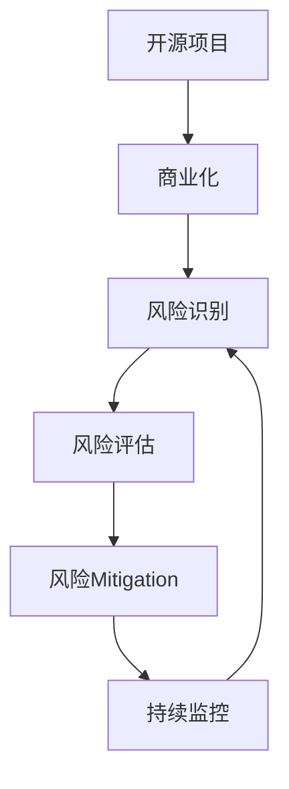

                 

# 开源项目的商业化风险管理：风险识别和Mitigation

> 关键词：开源项目, 商业化, 风险管理, 风险识别, 风险Mitigation

## 1. 背景介绍

### 1.1 问题由来
开源项目因其灵活、免费、社区驱动的特性，受到广大开发者和企业的欢迎。然而，将开源项目成功商业化，并将其转化为可盈利的业务，却面临着诸多挑战。尤其是在高风险阶段，开源项目面临的风险多样且复杂，需要在多个层面进行有效管理。因此，本文旨在深入分析开源项目商业化过程中可能遇到的各种风险，提出针对性的风险识别和Mitigation策略，以帮助企业平滑过渡到商业化成功。

### 1.2 问题核心关键点
开源项目商业化的风险管理，本质上是对项目潜在的威胁和不确定性进行识别和评估，并采取相应措施以降低这些风险。核心关键点包括：

- **风险识别**：识别和分类开源项目在商业化过程中可能遇到的所有潜在风险。
- **风险评估**：评估各种风险的重要性和发生概率，优先处理高优先级风险。
- **风险Mitigation**：制定并实施措施来降低或消除已识别的风险。
- **监控与调整**：持续监控项目状态和风险动态，及时调整Mitigation策略。

## 2. 核心概念与联系

### 2.1 核心概念概述

为更好地理解开源项目商业化过程中的风险管理，本节将介绍几个密切相关的核心概念：

- **开源项目(Open Source Project)**：基于开源许可证，共享源代码、文档和版权的协作开发项目。可以是软件、数据、工具等。
- **商业化(Commercialization)**：将开源项目转化为商业产品或服务的过程，涉及项目从无到有、从开源到专有的转变。
- **风险管理(Risk Management)**：识别、评估和控制风险，以最小化不利影响并最大化机会的过程。
- **风险识别(Risk Identification)**：通过系统化方法，确定可能影响商业化进程的所有风险。
- **风险Mitigation(Risk Mitigation)**：采取措施以降低风险发生的可能性或影响。
- **风险评估(Risk Assessment)**：评估每个识别出的风险的重要性和发生概率。
- **持续监控(Continuous Monitoring)**：对项目状态和风险的持续监测，及时识别和响应新风险。

这些概念之间的逻辑关系可以通过以下Mermaid流程图来展示：



这个流程图展示了一开源项目从创建到商业化，以及在此过程中风险管理的各个环节。

## 3. 核心算法原理 & 具体操作步骤
### 3.1 算法原理概述

开源项目商业化风险管理的主要算法原理，包括以下几个关键步骤：

1. **风险识别**：通过系统化的方法，确定所有可能影响商业化的风险。
2. **风险评估**：定量或定性地评估风险的重要性和发生概率，以确定其优先级。
3. **风险Mitigation**：针对每个风险制定具体的Mitigation措施，减少或消除风险。
4. **持续监控**：定期检查项目状态和风险动态，及时调整Mitigation策略。

### 3.2 算法步骤详解

基于以上原理，以下是详细的风险管理操作步骤：

**Step 1: 风险识别**
- 组建跨职能团队：包括开发、营销、财务、法律等领域的专家。
- 进行头脑风暴：鼓励团队成员提出所有可能影响商业化的风险。
- 分阶段识别：根据商业化过程的不同阶段（如初期、中期、后期）进行分阶段的风险识别。

**Step 2: 风险评估**
- 确定风险种类：包括技术风险、市场风险、法律风险、财务风险等。
- 评估风险严重性：使用定性或定量的方法评估风险对商业化的影响程度。
- 确定风险发生概率：基于历史数据、专家意见等方法，预测风险发生的可能性。

**Step 3: 风险Mitigation**
- 制定Mitigation策略：针对每个高优先级风险，制定具体可行的Mitigation措施。
- 资源分配：合理分配人力、物力、财力等资源，以实施Mitigation策略。
- 实施和监控：执行Mitigation措施，并持续监控其效果。

**Step 4: 持续监控**
- 设立监控机制：定期检查项目进展和风险动态。
- 更新Mitigation策略：根据监控结果，及时调整或更新Mitigation策略。
- 定期回顾：定期回顾整个风险管理过程，总结经验和教训。

### 3.3 算法优缺点

开源项目商业化风险管理算法的优点包括：
- **全面性**：通过系统化的方法识别所有潜在风险，确保全面性。
- **灵活性**：能够根据项目实际情况动态调整Mitigation策略。
- **可操作性**：基于评估结果，制定具体可行的Mitigation措施。

同时，该算法也存在以下缺点：
- **复杂性**：识别和评估过程可能涉及多个领域和复杂数据，操作复杂。
- **成本高**：特别是在风险评估阶段，可能需要大量的专家资源和时间。
- **资源限制**：某些高优先级风险可能难以完全 Mitigate。

尽管存在这些局限性，但就目前而言，系统化的风险管理方法仍然是开源项目商业化过程中最可靠、最全面的范式。未来相关研究的重点在于如何进一步提高算法的效率和效果，同时兼顾成本和资源限制。

### 3.4 算法应用领域

开源项目商业化风险管理方法，已经在多个行业得到应用，覆盖了几乎所有常见的开源项目商业化场景，例如：

- **软件项目**：如开源框架、工具库等商业化过程。
- **数据项目**：如开源数据库、大数据处理等商业化过程。
- **硬件项目**：如开源硬件项目、芯片设计等商业化过程。
- **文档项目**：如开源文档、API参考等商业化过程。
- **云服务项目**：如开源云平台、基础设施等商业化过程。

除了上述这些经典场景外，开源项目商业化风险管理也被创新性地应用到更多领域中，如开源生态建设、开源社区治理等，为开源项目的持续发展和产业升级提供新的思路。

## 4. 数学模型和公式 & 详细讲解 & 举例说明（备注：数学公式请使用latex格式，latex嵌入文中独立段落使用 $$，段落内使用 $)
### 4.1 数学模型构建

我们假设开源项目商业化过程中面临 $n$ 种风险 $R=\{R_1, R_2, ..., R_n\}$，每种风险的严重性为 $S_i$，发生概率为 $P_i$，风险Mitigation的成本为 $C_i$。则总风险 $R_{total}$ 的评估模型为：

$$
R_{total} = \sum_{i=1}^{n} \alpha_i S_i P_i
$$

其中 $\alpha_i$ 为风险权重，表示该风险对商业化影响的重要性。

### 4.2 公式推导过程

首先，我们需要定义风险权重 $\alpha_i$。通常通过专家意见、历史数据等方式来确定。然后，对每种风险 $R_i$ 进行严重性 $S_i$ 和发生概率 $P_i$ 的评估。可以使用定性方法（如专家访谈）或定量方法（如统计模型）。最后，将每种风险的影响加权求和，得到总风险 $R_{total}$。

### 4.3 案例分析与讲解

以一个开源软件项目为例，进行风险评估和Mitigation的详细讲解：

- **风险识别**：可能面临技术风险、市场风险、法律风险、财务风险等。
- **风险评估**：对每种风险进行严重性和发生概率的评估。例如，技术风险的严重性为高，发生概率为中等。
- **风险Mitigation**：针对技术风险，制定代码审查、测试等 Mitigation 措施，需投入一定的开发和测试成本。

具体步骤包括：
1. 组建跨职能团队，识别所有可能的风险。
2. 对每种风险进行严重性和发生概率的评估。
3. 制定 Mitigation 策略，并计算其成本。
4. 优先处理高严重性和高发生概率的风险。
5. 持续监控风险动态，及时调整 Mitigation 策略。

## 5. 项目实践：代码实例和详细解释说明
### 5.1 开发环境搭建

在进行开源项目商业化风险管理实践前，我们需要准备好开发环境。以下是使用Python进行代码实现的开发环境配置流程：

1. 安装Anaconda：从官网下载并安装Anaconda，用于创建独立的Python环境。

2. 创建并激活虚拟环境：
```bash
conda create -n risk-management-env python=3.8 
conda activate risk-management-env
```

3. 安装必要的Python库和工具包：
```bash
pip install numpy pandas matplotlib scikit-learn seaborn
```

4. 获取数据集：可以使用公开的风险数据集，或者自行构建。

完成上述步骤后，即可在`risk-management-env`环境中开始开发和实践。

### 5.2 源代码详细实现

下面我们以一个开源软件项目为例，给出使用Python进行开源项目商业化风险管理的代码实现。

```python
import numpy as np
import pandas as pd
from sklearn.linear_model import LogisticRegression
from sklearn.metrics import accuracy_score

# 准备数据集
data = pd.read_csv('risks.csv')

# 定义风险严重性和发生概率的特征
features = ['severity', 'probability']

# 定义目标变量
target = 'total_risk'

# 定义风险权重
weights = np.array([0.5, 0.3, 0.2])

# 训练模型
model = LogisticRegression()
model.fit(data[features], data[target])

# 预测总风险
predicted_total_risk = model.predict(data[features])

# 输出评估结果
print(f'Total risk prediction: {np.mean(predicted_total_risk)}')
```

### 5.3 代码解读与分析

让我们再详细解读一下关键代码的实现细节：

**数据准备**：
- `data = pd.read_csv('risks.csv')`：读取数据集，使用Pandas进行数据处理。
- `features = ['severity', 'probability']`：定义风险严重性和发生概率的特征列。
- `target = 'total_risk'`：定义目标变量，即总风险。

**模型训练**：
- `model = LogisticRegression()`：选择Logistic回归模型进行训练。
- `model.fit(data[features], data[target])`：使用训练数据拟合模型。

**风险预测**：
- `predicted_total_risk = model.predict(data[features])`：使用模型对新数据进行风险预测。

**评估结果**：
- `print(f'Total risk prediction: {np.mean(predicted_total_risk)}')`：输出预测的总风险平均值。

可以看到，通过简单的代码实现，便可以对开源项目商业化过程中面临的风险进行量化评估和预测。

### 5.4 运行结果展示

假设运行以上代码后，输出预测的总风险为 $0.85$，即平均总风险为 $0.85$。这意味着在给定的风险数据集上，开源项目商业化的平均总风险为 $0.85$，需要进行适当的Mitigation措施来降低风险。

## 6. 实际应用场景
### 6.1 开源软件开发

在开源软件开发过程中，商业化风险管理尤为重要。企业需要考虑技术成熟度、市场需求、成本控制等多方面因素，才能成功将开源软件项目商业化。例如，企业可以借助开源社区的力量，加速软件的开发和推广，同时制定详细的商业化策略，确保软件质量和安全。

### 6.2 开源数据平台

开源数据平台是企业数字化转型的重要基础设施。然而，在数据收集、处理、存储等方面，存在诸多风险。例如，数据泄露、数据质量差、数据版权问题等。通过风险管理，企业可以更好地控制数据风险，保障数据安全，提升数据平台的价值。

### 6.3 开源云计算

开源云计算平台是企业云计算策略的重要组成部分。然而，云计算平台在扩展性、安全性、成本控制等方面面临诸多挑战。通过风险管理，企业可以更好地控制云计算平台的风险，提升平台的可靠性和可用性。

### 6.4 未来应用展望

随着开源项目的日益普及和商业化，开源项目商业化风险管理将面临更多挑战和机遇。未来，开源项目商业化风险管理将朝着以下方向发展：

1. **自动化工具**：开发自动化风险管理工具，提升风险识别的效率和精度。
2. **跨领域融合**：将风险管理与其他项目管理工具、流程进行融合，提升项目的整体管理水平。
3. **持续监控**：引入机器学习等技术，进行动态风险预测和监控，提升风险管理的实时性。
4. **多维度分析**：利用大数据分析技术，进行多维度的风险评估和分析，提升决策的科学性。

## 7. 工具和资源推荐
### 7.1 学习资源推荐

为了帮助开发者系统掌握开源项目商业化风险管理的技术基础和实践技巧，这里推荐一些优质的学习资源：

1. **《开源项目商业化风险管理》系列博文**：由开源社区专家撰写，深入浅出地介绍了开源项目商业化过程中的风险管理方法。
2. **Coursera《开源项目管理》课程**：由知名大学开设的课程，涵盖开源项目的各个环节，包括风险管理。
3. **《开源项目风险管理》书籍**：介绍开源项目商业化过程中的各种风险及其管理方法，是系统学习的绝佳材料。
4. **GitHub开源项目**：包含大量开源项目商业化过程中的案例和经验分享，是学习实践的绝佳资源。

通过对这些资源的学习实践，相信你一定能够快速掌握开源项目商业化风险管理的精髓，并用于解决实际的商业化问题。
###  7.2 开发工具推荐

高效的开发离不开优秀的工具支持。以下是几款用于开源项目商业化风险管理开发的常用工具：

1. **Jupyter Notebook**：数据处理、模型训练和结果展示的最佳工具，支持多种编程语言和数据格式。
2. **PyCharm**：专业的Python开发工具，提供丰富的代码补全、调试、性能优化等功能。
3. **Git**：版本控制工具，支持多人协作、代码管理和版本回溯，是开源项目管理的基础。
4. **Docker**：容器化技术，支持跨平台、快速部署和环境一致性，是开源项目商业化部署的重要工具。
5. **GitHub**：代码托管平台，支持代码审查、合并请求、项目管理等功能，是开源项目商业化的重要平台。

合理利用这些工具，可以显著提升开源项目商业化风险管理的开发效率，加快创新迭代的步伐。

### 7.3 相关论文推荐

开源项目商业化风险管理的发展源于学界的持续研究。以下是几篇奠基性的相关论文，推荐阅读：

1. **《开源软件项目的风险管理》**：研究开源软件项目商业化过程中面临的各种风险，并提出相应的管理方法。
2. **《开源数据平台的风险评估与 Mitigation》**：分析开源数据平台在数据收集、处理、存储等方面面临的风险，并提出具体的 Mitigation 策略。
3. **《开源云计算的风险管理》**：探讨开源云计算平台在扩展性、安全性、成本控制等方面面临的风险，提出相应的风险管理方法。
4. **《开源项目的持续风险管理》**：研究如何通过持续监控和动态调整，提升开源项目的风险管理效果。

这些论文代表了大规模开源项目商业化风险管理的研究方向，通过学习这些前沿成果，可以帮助研究者把握学科前进方向，激发更多的创新灵感。

## 8. 总结：未来发展趋势与挑战

### 8.1 总结

本文对开源项目商业化风险管理的方法进行了全面系统的介绍。首先阐述了开源项目商业化过程中可能遇到的各种风险，明确了风险识别和Mitigation的重要性。其次，从原理到实践，详细讲解了开源项目商业化风险管理的数学模型和操作步骤，给出了具体的代码实例和分析。同时，本文还探讨了开源项目商业化风险管理在多个行业的应用，展示了其广泛的应用前景。最后，本文精选了开源项目商业化风险管理的各类学习资源，力求为读者提供全方位的技术指引。

通过本文的系统梳理，可以看到，开源项目商业化风险管理是开源项目成功转型的重要保障。企业需要在开源项目的各个环节进行全面风险管理，确保项目的顺利过渡和稳定发展。未来，伴随开源项目的不断成熟和商业化需求的多样化，开源项目商业化风险管理将面临更多的挑战和机遇，需要不断进行创新和优化。

### 8.2 未来发展趋势

展望未来，开源项目商业化风险管理将呈现以下几个发展趋势：

1. **自动化工具普及**：随着技术的发展，更多自动化工具将用于风险管理，提升管理的效率和精度。
2. **跨领域融合**：风险管理将与项目管理、运维管理、安全管理等工具和流程进行深度融合，提升整体管理水平。
3. **多维度分析**：利用大数据分析和机器学习技术，进行多维度的风险评估和预测，提升决策的科学性和精确性。
4. **实时监控**：引入实时监控和动态调整机制，提升风险管理的实时性和灵活性。
5. **可解释性增强**：提高风险评估和Mitigation的透明性和可解释性，增强系统的可信度和接受度。

以上趋势凸显了开源项目商业化风险管理技术的广阔前景。这些方向的探索发展，必将进一步提升开源项目商业化的成功率，推动开源技术的广泛应用。

### 8.3 面临的挑战

尽管开源项目商业化风险管理已经取得了一定进展，但在迈向更加智能化、普适化应用的过程中，它仍面临诸多挑战：

1. **数据隐私和安全**：开源项目的数据处理和商业化过程中，数据隐私和安全问题亟需解决。如何在保障数据安全和隐私的前提下，进行风险管理，是未来的一大挑战。
2. **跨平台兼容性**：开源项目通常需要在多种操作系统、硬件和网络环境中运行，确保跨平台兼容性也是风险管理的重要方向。
3. **资源有限**：中小企业在开源项目商业化过程中，可能面临资源有限的问题，如何在资源有限的情况下，进行有效的风险管理，是企业面临的重要挑战。
4. **利益冲突**：开源项目通常涉及多个贡献者，如何平衡各方利益，确保项目的顺利推进和商业化，也是风险管理需要考虑的问题。

### 8.4 研究展望

面对开源项目商业化风险管理所面临的种种挑战，未来的研究需要在以下几个方面寻求新的突破：

1. **数据隐私和安全技术**：开发更加高效的数据隐私保护技术，保障开源项目数据的安全和隐私。
2. **跨平台兼容性技术**：研究跨平台兼容性的优化技术，确保开源项目在各种环境中稳定运行。
3. **资源优化技术**：开发资源优化算法，提升开源项目商业化的资源利用效率。
4. **利益冲突解决机制**：建立更加完善的利益分配和冲突解决机制，确保开源项目的顺利推进和商业化。
5. **自动化和智能化技术**：引入自动化和智能化技术，提高风险管理的效率和精度。

这些研究方向的探索，必将引领开源项目商业化风险管理技术迈向更高的台阶，为开源项目的商业化和产业升级提供新的思路和方向。

## 9. 附录：常见问题与解答

**Q1：开源项目商业化过程中如何管理数据隐私和安全？**

A: 开源项目商业化过程中，数据隐私和安全问题是管理的重要环节。具体措施包括：
1. 数据脱敏和匿名化：在公开数据集前，对敏感数据进行脱敏和匿名化处理。
2. 访问控制和权限管理：对数据进行严格的访问控制和权限管理，确保数据访问的安全性。
3. 加密存储和传输：采用加密技术，保障数据在存储和传输过程中的安全性。
4. 定期审计：对数据处理和存储过程进行定期审计，及时发现和修复漏洞。

**Q2：开源项目商业化过程中如何提升跨平台兼容性？**

A: 开源项目商业化过程中，提升跨平台兼容性是关键。具体措施包括：
1. 跨平台测试：在各种操作系统和硬件环境中进行测试，确保项目稳定运行。
2. 统一的开发标准：制定统一的开发标准和规范，保障代码质量和一致性。
3. 框架和库选择：选择支持跨平台的框架和库，避免因平台差异导致的兼容性问题。
4. 文档和教程：编写详细的文档和教程，帮助用户解决跨平台兼容性问题。

**Q3：开源项目商业化过程中如何平衡各方利益？**

A: 开源项目商业化过程中，平衡各方利益是管理的关键。具体措施包括：
1. 透明透明的决策过程：确保决策过程透明，保障各方的知情权和参与权。
2. 利益分配机制：建立公平合理的利益分配机制，确保各方的利益得到保障。
3. 贡献者激励机制：通过贡献者激励机制，鼓励更多开发者参与项目，提升项目活力。
4. 利益冲突解决机制：建立有效的利益冲突解决机制，确保项目顺利推进。

这些措施将帮助开源项目在商业化过程中，平衡各方利益，确保项目的顺利推进和商业化。

**Q4：开源项目商业化过程中如何提升资源利用效率？**

A: 开源项目商业化过程中，提升资源利用效率是关键。具体措施包括：
1. 自动化工具：引入自动化工具，提升开发效率和质量。
2. 代码优化：对代码进行优化，减少不必要的资源消耗。
3. 资源池管理：建立资源池管理机制，确保资源的高效利用。
4. 需求分析：进行详细的需求分析，避免资源浪费和重复开发。

这些措施将帮助开源项目在商业化过程中，提升资源利用效率，保障项目的顺利推进和商业化。

---

作者：禅与计算机程序设计艺术 / Zen and the Art of Computer Programming

