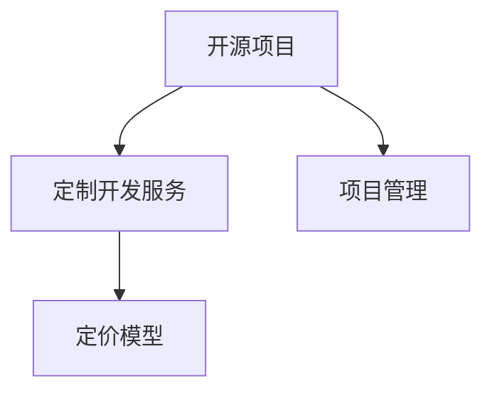

                 

# 开源项目的定制开发服务：项目管理和定价

> 关键词：开源项目, 定制开发服务, 项目管理, 定价模型

## 1. 背景介绍

### 1.1 问题由来

随着开源软件生态的日益繁荣，越来越多的企业希望通过开源技术提升自身的竞争力和创新能力。然而，开源项目的管理与定制化开发往往需要投入大量的时间和资源，且难以获得预期效果。在这种情况下，企业通常需要外包或引入开源项目定制开发服务，以满足实际需求。

### 1.2 问题核心关键点

开源项目定制开发服务的目标是，在合理的价格范围内，为客户提供高质量、可扩展、满足特定需求的解决方案。该服务的核心在于高效的项目管理和科学的定价模型，确保服务过程的透明度和客户满意度。

## 2. 核心概念与联系

### 2.1 核心概念概述

为了更好地理解开源项目定制开发服务的项目管理和定价方法，本节将介绍几个密切相关的核心概念：

- **开源项目(Open Source Project, OSP)**：由社区贡献者共同开发和维护的软件项目，具有开放源代码、自由使用、自由修改和自由分发等特点。常见的开源项目包括Apache、Linux、TensorFlow等。
- **定制开发服务(Custom Development Service, CDS)**：根据客户具体需求，对开源项目进行定制化改造，开发专属功能，满足特定业务场景的解决方案。
- **项目管理(Project Management)**：在定制开发服务中，对项目进度、资源分配、任务分配、质量控制等进行管理和协调的过程。
- **定价模型(Pricing Model)**：基于项目成本、复杂度、功能需求等因素，计算定制开发服务价格的方法。

这些核心概念之间的逻辑关系可以通过以下Mermaid流程图来展示：



这个流程图展示了他核心概念之间的相互关系：

1. 开源项目是定制开发服务的基础，提供了可定制化的技术栈和资源。
2. 项目管理是定制开发服务的执行保障，确保项目按时、按质、按量完成。
3. 定价模型是定制开发服务的成本收益平衡工具，指导合理定价策略。

## 3. 核心算法原理 & 具体操作步骤
### 3.1 算法原理概述

开源项目定制开发服务通常涉及以下几个关键步骤：

- **需求分析**：与客户沟通，明确业务需求和功能要求。
- **项目规划**：制定项目计划，明确任务分配、时间节点、资源需求等。
- **定制开发**：对开源项目进行定制化改造，开发特定功能。
- **测试验收**：在测试环境对开发成果进行功能测试和性能测试，确保质量符合客户需求。
- **部署上线**：将开发成果部署到生产环境，并进行初始化配置和性能优化。

这些步骤的执行需要科学的算法和详细的步骤描述，以确保项目按预期完成，并满足客户需求。

### 3.2 算法步骤详解

以下是开源项目定制开发服务的主要算法步骤和详细步骤：

**Step 1: 需求分析**
- 与客户沟通，收集业务需求和功能要求，填写需求文档。
- 确认需求合理性，提出技术解决方案和项目建议。

**Step 2: 项目规划**
- 制定项目计划，明确项目目标、里程碑、任务分配、时间节点等。
- 设计项目框架和架构，确定开发环境、工具和资源需求。

**Step 3: 定制开发**
- 对开源项目进行代码修改、功能添加和系统集成。
- 设计接口和数据模型，实现系统间数据传递和业务逻辑。
- 编写单元测试和集成测试用例，确保模块功能的正确性。

**Step 4: 测试验收**
- 在测试环境对开发成果进行功能测试和性能测试，确保符合客户需求。
- 收集和处理测试反馈，优化开发成果和测试流程。

**Step 5: 部署上线**
- 将开发成果部署到生产环境，并进行初始化配置和性能优化。
- 提供培训和技术支持，确保客户能够顺利使用和维护系统。

### 3.3 算法优缺点

开源项目定制开发服务的优点包括：

- **灵活性**：根据客户需求进行定制开发，满足个性化业务场景。
- **成本效益**：利用开源社区的资源和技术，降低开发成本，提升效率。
- **可扩展性**：基于开源项目进行定制开发，具备良好扩展性。

然而，该方法也存在一定的局限性：

- **技术风险**：开源项目技术复杂，容易存在漏洞和安全问题。
- **沟通成本**：与客户沟通需求，确认需求变化和需求优先级，需要更多时间和资源。
- **协调难度**：需要协调开源社区和内部团队的工作，确保项目进度和质量。

### 3.4 算法应用领域

开源项目定制开发服务在以下领域有着广泛的应用：

- **企业信息化**：为企业开发ERP、CRM、OA等信息化系统。
- **大数据分析**：为企业提供数据采集、处理、分析等解决方案。
- **移动应用开发**：为企业开发iOS、Android等移动应用。
- **云服务**：为企业提供云基础设施、云存储、云安全等服务。
- **物联网应用**：为企业开发物联网设备和系统，实现物联网应用。

## 4. 数学模型和公式 & 详细讲解 & 举例说明

### 4.1 数学模型构建

在开源项目定制开发服务中，定价模型是实现成本收益平衡的关键。一般而言，定价模型包括固定成本、变动成本、利润率等因素。

- **固定成本(Fixed Cost, FC)**：与项目无关的成本，如人员工资、设备折旧、管理费用等。
- **变动成本(Variably Cost, VC)**：与项目规模直接相关的成本，如开发人员薪资、技术支持费用等。
- **利润率(Profit Margin, PM)**：项目毛利润与项目收入的比率，计算公式为 $PM = \frac{收入 - 成本}{收入}$。

### 4.2 公式推导过程

设项目总成本为 $C$，固定成本为 $FC$，变动成本为 $VC$，利润率为 $PM$，则定价模型可表示为：

$$
\text{项目价格} = \frac{C}{PM} + FC
$$

其中：

$$
C = FC + VC = FC + (r * t * p)
$$

其中 $r$ 为开发人员人数，$t$ 为每人工作小时数，$p$ 为每小时工资。

根据上述公式，定价模型考虑了固定成本和变动成本，并根据利润率计算项目价格，确保项目在成本控制下获得合理利润。

### 4.3 案例分析与讲解

假设某公司需要定制开发一个ERP系统，固定成本为 $100,000$，变动成本为 $200/h * 20h * 5p$，利润率为 $30\%$。则定价模型计算如下：

1. 计算变动成本：
$$
\text{变动成本} = 200/h * 20h * 5p = 20000p
$$

2. 计算总成本：
$$
\text{总成本} = 100000 + 20000p
$$

3. 计算项目价格：
$$
\text{项目价格} = \frac{100000 + 20000p}{0.3} + 100000 = \frac{100000}{0.3} + 20000p + 100000 = 333333.33 + 20000p
$$

因此，项目价格为 $333,333.33 + 20,000p$，其中 $p$ 为每小时工资。

## 5. 项目实践：代码实例和详细解释说明

### 5.1 开发环境搭建

为了进行开源项目定制开发服务的实践，我们需要准备如下开发环境：

1. 安装必要的软件包，如Python、Git、IDE等。
2. 配置开发环境，如设置虚拟环境、安装依赖库等。
3. 搭建测试环境，确保代码能够在本地或服务器上运行。

### 5.2 源代码详细实现

下面以一个简单的ERP系统定制开发为例，展示源代码的详细实现。

```python
# 需求分析
class Requirement:
    def __init__(self, project_name, features):
        self.project_name = project_name
        self.features = features

# 项目规划
class ProjectPlan:
    def __init__(self, project_name, start_date, end_date, tasks):
        self.project_name = project_name
        self.start_date = start_date
        self.end_date = end_date
        self.tasks = tasks

# 定制开发
class CustomDevelopment:
    def __init__(self, project_plan, source_code):
        self.project_plan = project_plan
        self.source_code = source_code
        self.code_changed = []
        self.test_cases = []

    def modify_code(self, changes):
        for change in changes:
            self.code_changed.append(change)

    def add_test_case(self, test_case):
        self.test_cases.append(test_case)

# 测试验收
class TestVerification:
    def __init__(self, custom_development, test_result):
        self.custom_development = custom_development
        self.test_result = test_result

    def verify(self):
        for test_case in self.custom_development.test_cases:
            result = test_case.test()
            if not result:
                self.test_result.add(test_case.name, "Fail")
            else:
                self.test_result.add(test_case.name, "Pass")

# 部署上线
class Deployment:
    def __init__(self, custom_development):
        self.custom_development = custom_development
        self.initialization = {}
        self.optimizer = {}
        self.deployment_result = {}

    def initialize(self):
        for key, value in self.custom_development.code_changed.items():
            self.initialization[key] = value

    def optimize(self):
        for key, value in self.custom_development.code_changed.items():
            self.optimizer[key] = value

    def deploy(self):
        for key, value in self.custom_development.code_changed.items():
            self.deployment_result[key] = value
```

### 5.3 代码解读与分析

上述代码实现了开源项目定制开发服务的基本流程。下面对其关键部分进行解读：

- **需求分析**：通过 `Requirement` 类记录项目需求，如项目名称和功能列表。
- **项目规划**：通过 `ProjectPlan` 类记录项目计划，如项目名称、起始日期、结束日期和任务列表。
- **定制开发**：通过 `CustomDevelopment` 类记录代码修改和测试用例，实现开源项目定制开发。
- **测试验收**：通过 `TestVerification` 类记录测试结果，确保开发成果符合客户需求。
- **部署上线**：通过 `Deployment` 类记录初始化配置和性能优化，将开发成果部署到生产环境。

## 6. 实际应用场景

### 6.1 企业信息化

企业在信息化建设过程中，通常需要大量的定制开发工作。通过开源项目定制开发服务，企业可以快速构建ERP、CRM、OA等系统，满足业务需求，提升管理效率。

### 6.2 大数据分析

大数据分析是企业数字化转型的重要一环。通过开源项目定制开发服务，企业可以快速开发数据采集、处理、分析等系统，提升数据分析能力，优化业务决策。

### 6.3 移动应用开发

移动互联网时代，移动应用成为企业获取用户和市场的重要渠道。通过开源项目定制开发服务，企业可以快速开发iOS、Android等移动应用，提升用户体验，增加用户粘性。

### 6.4 云服务

云计算是企业数字化转型的基础设施。通过开源项目定制开发服务，企业可以快速构建云基础设施、云存储、云安全等服务，提升IT基础设施能力。

### 6.5 物联网应用

物联网技术正在改变企业的生产方式和经营模式。通过开源项目定制开发服务，企业可以快速开发物联网设备和系统，实现物联网应用，提升生产效率和产品质量。

## 7. 工具和资源推荐

### 7.1 学习资源推荐

为了帮助开发者系统掌握开源项目定制开发服务的技术基础和实践技巧，以下是一些优质的学习资源：

1. 《软件工程：原理与实践》：介绍软件开发的基本原理和实践技巧，是计算机科学领域的经典教材。
2. 《敏捷软件开发：原则、模式与实践》：介绍敏捷开发方法论和实践技巧，适合软件开发人员阅读。
3. 《云计算实战》：介绍云计算技术的基本原理和实践技巧，适合云计算开发者阅读。
4. 《开源项目管理与维护》：介绍开源项目管理和维护的基本方法和技巧，适合开源开发者阅读。
5. 《Python编程：从入门到实践》：介绍Python编程语言的基本原理和实践技巧，适合Python开发者阅读。

通过对这些资源的学习实践，相信你一定能够快速掌握开源项目定制开发服务的精髓，并用于解决实际的开发问题。

### 7.2 开发工具推荐

高效的开发离不开优秀的工具支持。以下是几款用于开源项目定制开发服务的常用工具：

1. Git：开源代码管理系统，适合版本控制和代码协作。
2. Jenkins：开源持续集成工具，支持自动化构建和部署。
3. Docker：开源容器化平台，适合容器化开发和部署。
4. GitHub：开源代码托管平台，支持代码版本控制和协作。
5. JIRA：开源项目管理工具，支持敏捷开发和项目跟踪。

合理利用这些工具，可以显著提升开源项目定制开发服务的开发效率，加快创新迭代的步伐。

### 7.3 相关论文推荐

开源项目定制开发服务的发展源于学界的持续研究。以下是几篇奠基性的相关论文，推荐阅读：

1. "Software Development as a Service" by Eric Raymond（Eric Raymond, 2005）：探讨了软件即服务的发展前景和实现路径。
2. "Cloud Computing: Concepts, Technology and Architecture" by Nati Linial and William A. Wistow（Nati Linial, William A. Wistow, 2011）：介绍了云计算的基本原理和架构，为云计算提供了理论基础。
3. "Agile Software Development" by Robert C. Martin（Robert C. Martin, 2007）：介绍了敏捷开发方法论和实践技巧，为软件开发提供了重要指导。
4. "Git Internals: Pro Git, Version Control with Git, Second Edition" by Scott Chacon and Ben Straub（Scott Chacon, Ben Straub, 2015）：介绍了Git的基本原理和实践技巧，为版本控制提供了重要指导。
5. "Principles of Software Architecture" by Mark Richards（Mark Richards, 2011）：介绍了软件架构的基本原理和设计方法，为软件设计提供了重要指导。

这些论文代表了大规模开发服务的发展脉络。通过学习这些前沿成果，可以帮助研究者把握学科前进方向，激发更多的创新灵感。

## 8. 总结：未来发展趋势与挑战

### 8.1 总结

本文对开源项目定制开发服务的技术基础和实践技巧进行了全面系统的介绍。首先阐述了该服务的背景和意义，明确了项目管理和定价在定制开发服务中的关键作用。其次，从原理到实践，详细讲解了开源项目定制开发服务的主要步骤和算法，提供了完整的代码实例和详细解读。同时，本文还广泛探讨了该服务在企业信息化、大数据分析、移动应用开发、云服务、物联网应用等多个领域的应用前景，展示了开源项目定制开发服务的巨大潜力。此外，本文精选了相关学习资源、开发工具和研究论文，力求为开发者提供全方位的技术指引。

通过本文的系统梳理，可以看到，开源项目定制开发服务已经成为软件开发的重要手段，极大地提升了企业软件开发的效率和质量。未来，伴随开源社区的不断发展和创新，开源项目定制开发服务必将走向更加智能化、普适化和可定制化的方向，为软件开发者和企业用户带来更多便利和价值。

### 8.2 未来发展趋势

展望未来，开源项目定制开发服务将呈现以下几个发展趋势：

1. **云化服务**：随着云服务的发展，越来越多的定制开发服务将基于云平台提供，实现更加高效和灵活的开发和部署。
2. **AI化服务**：随着AI技术的发展，越来越多的定制开发服务将引入AI技术，提升自动化和智能化水平。
3. **模块化服务**：随着开源社区的发展，越来越多的定制开发服务将实现模块化设计，提升可扩展性和复用性。
4. **社区化服务**：随着开源社区的发展，越来越多的定制开发服务将引入社区协作机制，提升开发质量和效率。
5. **API化服务**：随着API技术的发展，越来越多的定制开发服务将通过API接口提供，提升服务灵活性和可集成性。

这些趋势展示了开源项目定制开发服务的发展方向，为未来技术的创新和应用提供了新的思路。

### 8.3 面临的挑战

尽管开源项目定制开发服务已经取得了一定的成效，但在迈向更加智能化、普适化应用的过程中，仍面临诸多挑战：

1. **技术复杂性**：开源项目技术复杂，容易存在漏洞和安全问题。
2. **需求不一致**：客户需求多样，难以满足所有客户的需求。
3. **沟通成本高**：与客户沟通需求，确认需求变化和需求优先级，需要更多时间和资源。
4. **协作难度大**：需要协调开源社区和内部团队的工作，确保项目进度和质量。
5. **质量控制难**：开源项目代码质量参差不齐，难以保证最终产品的质量。

### 8.4 未来突破

面对开源项目定制开发服务所面临的挑战，未来的研究需要在以下几个方面寻求新的突破：

1. **引入更多的开源工具**：利用更多开源工具和框架，提升开发效率和质量。
2. **引入更多的AI技术**：引入更多的AI技术，提升自动化和智能化水平。
3. **引入更多的社区协作机制**：引入更多的社区协作机制，提升开发质量和效率。
4. **引入更多的质量控制方法**：引入更多的质量控制方法，确保最终产品的质量。
5. **引入更多的API接口**：引入更多的API接口，提升服务的灵活性和可集成性。

这些研究方向的探索，必将引领开源项目定制开发服务技术迈向更高的台阶，为构建人机协同的智能系统铺平道路。面向未来，开源项目定制开发服务还需要与其他人工智能技术进行更深入的融合，如知识表示、因果推理、强化学习等，多路径协同发力，共同推动自然语言理解和智能交互系统的进步。只有勇于创新、敢于突破，才能不断拓展开源项目的边界，让智能技术更好地造福人类社会。

## 9. 附录：常见问题与解答

**Q1：开源项目定制开发服务是否适用于所有企业？**

A: 开源项目定制开发服务适用于绝大多数企业，特别是对于需要大量定制化开发和快速迭代的企业。然而，对于一些特定行业（如军工、金融等），由于其数据和安全性要求较高，可能需要更为严格的安全措施和合规要求。

**Q2：如何选择合适的开源项目进行定制开发？**

A: 选择开源项目进行定制开发时，需要考虑以下几个方面：

1. **项目成熟度**：选择已经成熟稳定、社区活跃的开源项目，避免选择不成熟或维护不活跃的项目。
2. **功能需求**：选择能够满足当前功能需求的开源项目，避免选择功能过于简单或过于复杂的项目。
3. **社区支持**：选择有良好社区支持和文档资料的开源项目，避免选择社区支持不足的项目。
4. **许可协议**：选择符合企业需求的开源许可证，避免选择不符合企业需求的项目。

**Q3：开源项目定制开发服务如何定价？**

A: 开源项目定制开发服务的定价模型通常包括固定成本和变动成本，根据利润率计算项目价格。具体定价方法可以参考4.2节中的公式推导过程。

**Q4：开源项目定制开发服务如何确保质量？**

A: 确保开源项目定制开发服务质量的关键在于全面测试和严格质量控制。具体方法包括：

1. **单元测试和集成测试**：编写详细的测试用例，确保代码模块功能的正确性。
2. **功能测试和性能测试**：在测试环境中进行全面测试，确保开发成果符合客户需求。
3. **代码审查和质量评估**：进行代码审查和质量评估，确保代码质量和可维护性。
4. **用户验收测试**：在用户环境中进行验收测试，确保开发成果能够稳定运行。

**Q5：开源项目定制开发服务如何与客户沟通？**

A: 与客户沟通需求和确认需求变化时，需要注意以下几个方面：

1. **明确需求**：与客户明确需求，确保理解客户需求和业务场景。
2. **需求优先级**：与客户确认需求优先级，确保资源能够优先满足关键需求。
3. **需求变更管理**：建立需求变更管理机制，确保需求变更能够及时更新和确认。
4. **沟通频率**：建立定期沟通机制，确保客户能够及时反馈需求变化和进度情况。

---

作者：禅与计算机程序设计艺术 / Zen and the Art of Computer Programming

