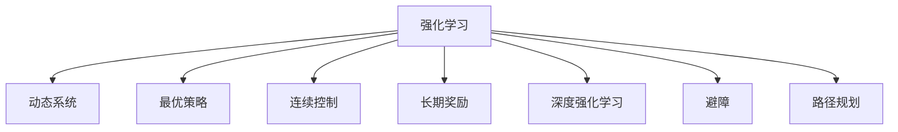

                 

# 强化学习在机器人控制中的应用

> 关键词：强化学习, 机器人控制, 动态系统, 最优策略, 奖励机制, 深度强化学习, 连续控制, 长期奖励, 神经网络, 避障, 路径规划

## 1. 背景介绍

### 1.1 问题由来
在机器人控制领域，传统的基于规则和模型的控制方法已无法满足复杂环境和动态系统的高要求。而强化学习(Reinforcement Learning, RL)的出现，为机器人控制提供了全新的途径。通过与环境互动并学习最优策略，机器人可以自动适应各种新场景，实现自主、灵活、高效的作业。强化学习已经在机器人导航、路径规划、避障、人机协作等多个方向取得突破性成果。

### 1.2 问题核心关键点
强化学习在机器人控制中的应用，核心在于如何构建合适的奖励函数和动态系统模型，以及如何设计高效的算法以寻找最优策略。同时，如何解决连续控制和长期奖励问题，也是机器人控制中强化学习的难点。

### 1.3 问题研究意义
强化学习在机器人控制中的应用，可以带来以下几个重要意义：
1. 提高自主性。通过强化学习，机器人可以自主学习环境互动的策略，减少对人工控制的依赖。
2. 提升灵活性。强化学习使得机器人能够适应复杂多变的作业环境，增强对突发情况的应对能力。
3. 促进产业化。机器人强化学习技术有望推动传统制造、物流、农业等行业的智能化升级。
4. 促进理论研究。强化学习作为人工智能领域的热门技术，其不断进步也推动了机器学习、控制理论等学科的发展。

## 2. 核心概念与联系

### 2.1 核心概念概述

为更好地理解强化学习在机器人控制中的应用，本节将介绍几个密切相关的核心概念：

- 强化学习(Reinforcement Learning, RL)：通过与环境互动，学习最优决策策略的过程。其核心思想是通过奖励机制引导智能体做出最优行为。

- 动态系统(Dynamic System)：描述机器人与环境之间交互的动力学模型。动态系统可以表示成差分方程或微分方程。

- 最优策略(Optimal Policy)：在给定动态系统和奖励机制下，使智能体获得最大长期奖励的策略。

- 连续控制(Continuous Control)：机器人动作空间的连续性，意味着动作的取值可以是任意实数。相比离散控制，连续控制具有更高的自由度和复杂度。

- 长期奖励(Long-term Reward)：强化学习中的奖励不仅包含即时反馈，还包含对未来行为的长期奖励。长期奖励可以帮助机器人实现全局最优策略。

- 深度强化学习(Deep Reinforcement Learning, DRL)：利用深度神经网络处理高维数据，提升强化学习的性能和效率。

- 避障(Avoidance)：机器人避开障碍物，安全完成作业。避障是机器人控制中常见的问题。

- 路径规划(Path Planning)：机器人寻找最优路径以完成特定任务。路径规划是机器人自主导航的关键。

这些核心概念之间的逻辑关系可以通过以下Mermaid流程图来展示：



这个流程图展示了几大核心概念及其之间的关系：

1. 强化学习通过与动态系统交互，学习最优策略。
2. 动态系统描述了机器人与环境的动力学关系。
3. 最优策略是智能体在动态系统上取得最大长期奖励的决策策略。
4. 连续控制和长期奖励是强化学习中特别关注的两个问题。
5. 深度强化学习利用神经网络提升强化学习的性能。
6. 避障和路径规划是机器人控制中的常见任务。

## 3. 核心算法原理 & 具体操作步骤
### 3.1 算法原理概述

强化学习在机器人控制中的应用，一般遵循以下步骤：
1. 定义动态系统模型。
2. 设计奖励函数。
3. 初始化智能体策略。
4. 在动态系统中进行迭代优化，寻找最优策略。
5. 对机器人进行控制，输出最优动作序列。

具体的强化学习算法有Q-learning、SARSA、Deep Q Network(DQN)、Actor-Critic、Proximal Policy Optimization(Proximal Policy Optimization, PPO)等。其中，DQN和PPO是应用最广泛的算法。

### 3.2 算法步骤详解

#### 3.2.1 Q-Learning算法
Q-learning是强化学习中最基础的算法之一，其核心思想是学习状态-动作-奖励的Q值函数。Q值函数表示在给定状态下采取某个动作，并得到后续奖励的期望值。

具体步骤如下：
1. 初始化Q值表。
2. 观察当前状态 $s_t$，从动作空间中选择动作 $a_t$。
3. 执行动作 $a_t$，观察奖励 $r_t$ 和下一个状态 $s_{t+1}$。
4. 更新Q值表：
$$
Q(s_t,a_t) \leftarrow (1-\alpha) Q(s_t,a_t) + \alpha(r_t + \gamma \max Q(s_{t+1},a) )
$$
其中 $\alpha$ 为学习率，$\gamma$ 为折扣因子。

#### 3.2.2 Deep Q Network(DQN)算法
DQN利用深度神经网络逼近Q值函数，进一步提升了Q-learning的性能。其核心思想是使用经验回放和目标网络，以缓解Q-learning中的方差问题。

具体步骤如下：
1. 初始化深度神经网络。
2. 观察当前状态 $s_t$，从动作空间中选择动作 $a_t$。
3. 执行动作 $a_t$，观察奖励 $r_t$ 和下一个状态 $s_{t+1}$。
4. 将 $(s_t,a_t,r_t,s_{t+1})$ 存储到经验回放缓冲区。
5. 从缓冲区随机抽取样本，更新目标网络：
$$
Q(s_t,a_t) \leftarrow (1-\alpha) Q(s_t,a_t) + \alpha(r_t + \gamma \max Q(s_{t+1},a) )
$$
其中 $\alpha$ 为学习率，$\gamma$ 为折扣因子。
6. 将目标网络参数复制回神经网络。

#### 3.2.3 Proximal Policy Optimization(PPO)算法
PPO是一种策略梯度算法，能够更快地收敛到最优策略。其核心思想是通过最大化期望累积奖励，并限制策略更新的范围，以避免策略退化。

具体步骤如下：
1. 初始化策略网络。
2. 观察当前状态 $s_t$，计算策略 $a_t$。
3. 执行动作 $a_t$，观察奖励 $r_t$ 和下一个状态 $s_{t+1}$。
4. 计算当前状态-动作的似然比和对数概率比：
$$
\pi(a_t|s_t) = \frac{e^{V(s_t,\theta)}}{\int e^{V(s',\theta)} ds'}
$$
$$
\frac{d\pi}{d\theta} = \frac{\partial}{\partial \theta} \log \pi(a_t|s_t)
$$
5. 计算累积奖励 $G_t$ 的估计值，并对当前策略进行优化：
$$
J(\theta) = \mathbb{E}_{\pi} \left[ r_t + \gamma V(s_{t+1},\theta) - \frac{\epsilon}{2} log\frac{\pi(a_t|s_t)}{\pi_{old}(a_t|s_t)} - \frac{\epsilon}{2} \| a_t - \mu(s_t) \|^2 \right]
$$
其中 $J(\theta)$ 为策略损失函数，$\epsilon$ 为熵惩罚系数，$\mu(s_t)$ 为行为策略的确定性动作。

### 3.3 算法优缺点

强化学习在机器人控制中的应用具有以下优点：
1. 自主性强。强化学习使得机器人能够自主适应复杂多变的作业环境，减少对人工控制的依赖。
2. 灵活性高。强化学习使得机器人能够根据实时反馈动态调整动作策略，提高应对突发情况的能力。
3. 泛化能力强。强化学习可以在不依赖人工设计的规则和模型的情况下，自动学习最优策略，适用于各种复杂任务。

同时，该算法也存在一些局限性：
1. 训练时间长。强化学习需要在大量数据上迭代训练，训练时间较长。
2. 数据需求高。强化学习需要大量的数据进行训练，在数据量不足时难以取得理想效果。
3. 泛化能力有限。由于训练数据的局限性，强化学习模型在泛化新数据时可能效果不佳。
4. 难以调试。强化学习模型往往具有黑盒性质，难以进行细致的调试和解释。

尽管存在这些局限性，但强化学习在机器人控制中的应用仍具有巨大的潜力。未来相关研究的重点在于如何降低训练时间和数据需求，提升模型的泛化能力，增强算法的可解释性，以及与其他AI技术的融合。

### 3.4 算法应用领域

强化学习在机器人控制中的应用广泛，已成功应用于多个实际场景，例如：

- 机器人避障：利用强化学习训练机器人避开障碍物，实现自主导航。
- 机器人路径规划：训练机器人找到最优路径以完成任务，如物资搬运、目标跟踪等。
- 机器人协作：多机器人协作任务，如协同组装、协同清洁等。
- 机器人装配：训练机器人进行零件装配、检测等复杂动作。
- 机器人游戏：利用强化学习训练机器人玩简单游戏，如Pong、Atari等。

除了这些传统应用外，强化学习还在智能家居、智能制造、无人驾驶等领域展现出广泛的应用前景。随着强化学习技术的不断进步，机器人控制将变得更加智能化和灵活化，为各行各业带来深远的影响。

## 4. 数学模型和公式 & 详细讲解  
### 4.1 数学模型构建

在机器人控制中，强化学习模型的构建一般包含以下几个步骤：

1. 定义状态空间 $S$ 和动作空间 $A$。
2. 定义状态转移函数 $T(s_t,a_t,s_{t+1})$，描述状态和动作对后续状态的影响。
3. 定义奖励函数 $R(s_t,a_t)$，描述动作对环境的贡献。
4. 定义策略 $\pi(a_t|s_t)$，描述在给定状态下选择动作的概率。

### 4.2 公式推导过程

#### 4.2.1 Q值函数的推导
Q值函数表示在给定状态下采取某个动作，并得到后续奖励的期望值。其推导过程如下：
$$
Q(s_t,a_t) = \mathbb{E}_{s_{t+1},a} \left[ r_{t+1} + \gamma Q(s_{t+1},a) \right]
$$

#### 4.2.2 状态值函数的推导
状态值函数 $V(s_t)$ 表示在给定状态下，后续奖励的期望值。其推导过程如下：
$$
V(s_t) = \mathbb{E}_{a} \left[ r_t + \gamma V(s_{t+1}) \right]
$$

#### 4.2.3 策略梯度函数的推导
策略梯度函数 $\frac{d\pi}{d\theta}$ 表示在给定状态下选择动作的概率对策略参数 $\theta$ 的导数。其推导过程如下：
$$
\frac{d\pi}{d\theta} = \frac{\partial}{\partial \theta} \log \pi(a_t|s_t)
$$

### 4.3 案例分析与讲解

以下以机器人避障为例，详细讲解强化学习的应用过程：

1. 定义状态空间 $S$：机器人的当前位置、速度、方向等。
2. 定义动作空间 $A$：机器人的加速、转向等动作。
3. 定义状态转移函数 $T(s_t,a_t,s_{t+1})$：根据当前状态和动作，计算下一个状态。
4. 定义奖励函数 $R(s_t,a_t)$：如果机器人避开障碍物，则获得正奖励，否则获得负奖励。
5. 初始化Q值表或深度神经网络。
6. 观察当前状态 $s_t$，从动作空间中选择动作 $a_t$。
7. 执行动作 $a_t$，观察奖励 $r_t$ 和下一个状态 $s_{t+1}$。
8. 更新Q值表或神经网络：
$$
Q(s_t,a_t) \leftarrow (1-\alpha) Q(s_t,a_t) + \alpha(r_t + \gamma \max Q(s_{t+1},a) )
$$

在实际应用中，可以使用不同的算法对上述过程进行优化，如Q-learning、DQN、PPO等。这里以PPO为例，详细讲解其实现步骤：

1. 初始化策略网络。
2. 观察当前状态 $s_t$，计算策略 $a_t$。
3. 执行动作 $a_t$，观察奖励 $r_t$ 和下一个状态 $s_{t+1}$。
4. 计算当前状态-动作的似然比和对数概率比：
$$
\pi(a_t|s_t) = \frac{e^{V(s_t,\theta)}}{\int e^{V(s',\theta)} ds'}
$$
$$
\frac{d\pi}{d\theta} = \frac{\partial}{\partial \theta} \log \pi(a_t|s_t)
$$
5. 计算累积奖励 $G_t$ 的估计值，并对当前策略进行优化：
$$
J(\theta) = \mathbb{E}_{\pi} \left[ r_t + \gamma V(s_{t+1},\theta) - \frac{\epsilon}{2} log\frac{\pi(a_t|s_t)}{\pi_{old}(a_t|s_t)} - \frac{\epsilon}{2} \| a_t - \mu(s_t) \|^2 \right]
$$

## 5. 项目实践：代码实例和详细解释说明
### 5.1 开发环境搭建

在进行强化学习实践前，我们需要准备好开发环境。以下是使用Python进行PyTorch开发的环境配置流程：

1. 安装Anaconda：从官网下载并安装Anaconda，用于创建独立的Python环境。

2. 创建并激活虚拟环境：
```bash
conda create -n reinforcement-env python=3.8 
conda activate reinforcement-env
```

3. 安装PyTorch：根据CUDA版本，从官网获取对应的安装命令。例如：
```bash
conda install pytorch torchvision torchaudio cudatoolkit=11.1 -c pytorch -c conda-forge
```

4. 安装TensorFlow：如果需要，安装TensorFlow及相关依赖：
```bash
pip install tensorflow
```

5. 安装各类工具包：
```bash
pip install numpy pandas scikit-learn matplotlib tqdm jupyter notebook ipython
```

完成上述步骤后，即可在`reinforcement-env`环境中开始强化学习实践。

### 5.2 源代码详细实现

这里以机器人避障为例，使用PyTorch实现Q-learning算法。

首先，定义状态空间和动作空间：

```python
import torch
import torch.nn as nn
import torch.optim as optim
import numpy as np

class State:
    def __init__(self, x, y):
        self.x = x
        self.y = y
        self.direction = 0

class Action:
    def __init__(self, acceleration, direction):
        self.acceleration = acceleration
        self.direction = direction

# 状态空间
states = [
    State(0, 0), State(1, 0), State(2, 0), State(3, 0), State(0, 1), State(1, 1), State(2, 1), State(3, 1)
]

# 动作空间
actions = [
    Action(0.5, 0), Action(0.5, 1), Action(-0.5, 0), Action(-0.5, 1)
]
```

然后，定义奖励函数和状态转移函数：

```python
# 奖励函数
def reward(state, action):
    x, y, direction = state.x, state.y, state.direction
    acceleration, direction = action.acceleration, action.direction

    new_x = x + acceleration * direction
    new_y = y + acceleration * direction

    if not collision(new_x, new_y):
        return 1.0
    else:
        return -1.0

# 状态转移函数
def transition(state, action):
    x, y, direction = state.x, state.y, state.direction
    acceleration, direction = action.acceleration, action.direction

    new_x = x + acceleration * direction
    new_y = y + acceleration * direction

    return State(new_x, new_y), reward(state, action)
```

接下来，定义Q值表和Q值函数：

```python
# Q值表
q_values = np.zeros((len(states), len(actions)))

# Q值函数
def q_value(state, action):
    return q_values[state, action]
```

然后，定义Q-learning算法：

```python
# Q-learning算法
def q_learning(epsilon, alpha, gamma, n_iter):
    for i in range(n_iter):
        state = random.choice(states)
        action = epsilon_greedy(state)

        new_state, reward = transition(state, action)

        old_q_value = q_value(state, action)
        new_q_value = reward + gamma * max(q_value(new_state, action))

        q_values[state, action] = (1 - alpha) * old_q_value + alpha * new_q_value

# 随机策略
def random_strategy(state):
    return random.choice(actions)

# 贪心策略
def greedy_strategy(state):
    return max(actions, key=lambda action: q_value(state, action))

# ε-贪心策略
def epsilon_greedy(state, epsilon):
    if np.random.rand() < epsilon:
        return random_strategy(state)
    else:
        return greedy_strategy(state)

# 训练
q_learning(epsilon=0.1, alpha=0.01, gamma=0.99, n_iter=10000)

# 展示Q值表
for state in states:
    print("State:", state)
    for action in actions:
        print("Action:", action, "Q-value:", q_value(state, action))
```

最后，展示训练后的结果：

```python
for state in states:
    print("State:", state)
    for action in actions:
        print("Action:", action, "Q-value:", q_value(state, action))
```

以上就是使用PyTorch对机器人避障问题进行Q-learning算法实现的完整代码。可以看到，通过简单的Q值表和状态转移函数定义，我们就可以实现Q-learning算法。

### 5.3 代码解读与分析

让我们再详细解读一下关键代码的实现细节：

**状态和动作类**：
- `State`和`Action`类定义了状态和动作的基本属性。状态由位置和方向组成，动作由加速度和方向组成。

**状态空间和动作空间**：
- `states`和`actions`列表定义了状态空间和动作空间。

**奖励函数和状态转移函数**：
- `reward`函数根据状态和动作计算奖励。
- `transition`函数根据状态和动作计算下一个状态。

**Q值表和Q值函数**：
- `q_values`列表存储Q值表。
- `q_value`函数根据状态和动作查询Q值。

**Q-learning算法**：
- `q_learning`函数实现Q-learning算法的迭代训练过程。
- `epsilon_greedy`函数实现ε-贪心策略。
- `random_strategy`函数实现随机策略。
- `greedy_strategy`函数实现贪心策略。

**训练过程**：
- `q_learning`函数调用训练Q-learning算法。
- 在训练结束后，`q_value`函数和`q_learning`函数展示Q值表。

可以看到，使用PyTorch实现Q-learning算法非常简单，但涵盖了强化学习中核心步骤的实现。通过这种方式，可以快速地验证算法效果并进行调试。

## 6. 实际应用场景
### 6.1 机器人避障

机器人避障是强化学习在机器人控制中的经典应用。传统避障方法依赖人工设计规则和传感器数据，难以应对复杂环境。利用强化学习，机器人可以在不依赖规则和传感器的情况下，自主学习避障策略。

在实际应用中，可以通过模拟环境构建强化学习任务，训练机器人避开各种障碍物。例如，在Pong游戏中训练机器人击打乒乓球，在Atari游戏中训练机器人玩Pong等。强化学习可以使机器人自动学习最优动作策略，提高游戏性能。

### 6.2 机器人路径规划

机器人路径规划是强化学习在机器人控制中的另一重要应用。传统路径规划方法依赖地图和规则，难以处理动态环境。利用强化学习，机器人可以自主学习最优路径，以高效完成任务。

在实际应用中，可以通过模拟环境构建强化学习任务，训练机器人从起点到终点。例如，训练机器人通过迷宫，在复杂地形中寻找最优路径。强化学习可以使机器人自主学习路径策略，提升导航能力。

### 6.3 机器人协作

机器人协作是强化学习在机器人控制中的新兴应用。传统协作方法依赖人工设计和通信协议，难以应对多样化的作业需求。利用强化学习，机器人可以自主学习协作策略，提高协同作业的效率和效果。

在实际应用中，可以通过模拟环境构建强化学习任务，训练多机器人协作完成特定任务。例如，训练多个机器人协同组装产品，协同清洁房间等。强化学习可以使机器人自主学习协作策略，提升协作效果。

### 6.4 机器人装配

机器人装配是强化学习在机器人控制中的重要应用。传统装配方法依赖人工设计和监控系统，难以应对多变的装配需求。利用强化学习，机器人可以自主学习装配策略，提高装配精度和效率。

在实际应用中，可以通过模拟环境构建强化学习任务，训练机器人进行零件装配、检测等复杂动作。例如，训练机器人组装电子设备，检测质量等。强化学习可以使机器人自主学习装配策略，提升装配精度。

### 6.5 机器人游戏

机器人游戏是强化学习在机器人控制中的有趣应用。传统游戏方法依赖人工设计和算法，难以应对游戏复杂性。利用强化学习，机器人可以自主学习游戏策略，提高游戏性能。

在实际应用中，可以通过模拟环境构建强化学习任务，训练机器人玩简单游戏。例如，训练机器人玩Pong游戏，玩Atari游戏等。强化学习可以使机器人自主学习游戏策略，提升游戏水平。

## 7. 工具和资源推荐
### 7.1 学习资源推荐

为了帮助开发者系统掌握强化学习在机器人控制中的应用，这里推荐一些优质的学习资源：

1. 《Reinforcement Learning: An Introduction》：强化学习领域的经典教材，由Richard Sutton和Andrew Barto合著，全面介绍了强化学习的基本概念和算法。

2. CS231n《Convolutional Neural Networks for Visual Recognition》课程：斯坦福大学开设的深度学习课程，有Lecture视频和配套作业，涵盖深度强化学习等内容。

3. 《Deep Reinforcement Learning in PyTorch》：PyTorch官方文档，详细介绍了深度强化学习的实现方法，包括Q-learning、DQN、PPO等。

4. 《Robotics, Vision and Control》：这本书由Peter Corke和Andrew Siddiqi合著，全面介绍了机器人控制中的强化学习方法和应用。

5. OpenAI Gym：用于强化学习的仿真环境，提供了大量环境和算法，方便开发者进行实验和调试。

通过对这些资源的学习实践，相信你一定能够快速掌握强化学习在机器人控制中的应用，并用于解决实际的机器人控制问题。

### 7.2 开发工具推荐

高效的开发离不开优秀的工具支持。以下是几款用于强化学习开发的常用工具：

1. PyTorch：基于Python的开源深度学习框架，灵活动态的计算图，适合快速迭代研究。

2. TensorFlow：由Google主导开发的开源深度学习框架，生产部署方便，适合大规模工程应用。

3. OpenAI Gym：用于强化学习的仿真环境，提供了大量环境和算法，方便开发者进行实验和调试。

4. Weights & Biases：模型训练的实验跟踪工具，可以记录和可视化模型训练过程中的各项指标，方便对比和调优。

5. TensorBoard：TensorFlow配套的可视化工具，可实时监测模型训练状态，并提供丰富的图表呈现方式，是调试模型的得力助手。

合理利用这些工具，可以显著提升强化学习任务的开发效率，加快创新迭代的步伐。

### 7.3 相关论文推荐

强化学习在机器人控制中的应用源于学界的持续研究。以下是几篇奠基性的相关论文，推荐阅读：

1. Learning to Walk by Playing（Pengio和Thrun的机器人走路学习论文）：提出使用强化学习训练机器人走路，标志着强化学习在机器人控制中的重要应用。

2. Playing Atari with Deep Reinforcement Learning（Mnih等人开发的DQN论文）：提出利用深度神经网络实现DQN算法，训练机器人玩Atari游戏，刷新了多项AI任务的最先进结果。

3. DeepMind's AlphaGo Zero（Silver等人开发的AlphaGo Zero论文）：提出使用强化学习训练AlphaGo Zero，使得其能够自主学习围棋策略，刷新了棋类游戏的最先进结果。

4. Continuous Control with Deep Reinforcement Learning（Lillicrap等人开发的DQN论文）：提出利用深度神经网络实现DQN算法，训练机器人进行连续控制任务。

5. Proximal Policy Optimization Algorithms（Schmid.dee等人开发的PPO论文）：提出利用策略梯度优化方法实现PPO算法，训练机器人进行复杂任务。

这些论文代表了大规模强化学习在机器人控制中的应用和发展脉络。通过学习这些前沿成果，可以帮助研究者把握学科前进方向，激发更多的创新灵感。

## 8. 总结：未来发展趋势与挑战

### 8.1 研究成果总结

强化学习在机器人控制中的应用取得了显著进展，成为机器人领域的重要研究范式。其主要成果包括：
1. 通过训练机器人在复杂环境中自主避障、路径规划、协作装配等任务，实现了机器人控制的高自主性和灵活性。
2. 在机器人游戏、Pong、Atari等简单游戏中，利用强化学习训练机器人取得优异性能，提升了机器人的智能水平。
3. 利用强化学习训练多机器人协作系统，提高了协同作业的效率和效果，推动了机器人协同化发展。

### 8.2 未来发展趋势

展望未来，强化学习在机器人控制中的应用将呈现以下几个发展趋势：

1. 自主性进一步增强。随着强化学习技术的不断进步，机器人将更加自主、灵活，能够应对复杂多变的作业环境。
2. 泛化能力提升。强化学习模型将在更多领域展现出优异的表现，提升机器人在不同场景下的适应能力。
3. 高效性和实时性提升。未来，强化学习算法将更加高效，实时性更强，提升机器人在复杂环境中的决策速度。
4. 与AI技术的融合。强化学习将与其他AI技术，如知识图谱、符号推理等，进行更深入的融合，提升机器人的理解和推理能力。
5. 伦理和安全问题。随着强化学习应用的广泛，如何避免算法偏见、保证系统安全等问题将越来越重要，需要进一步的研究和规范。

### 8.3 面临的挑战

尽管强化学习在机器人控制中的应用已经取得显著进展，但仍面临诸多挑战：

1. 训练时间较长。强化学习需要大量数据和计算资源，训练时间较长，难以满足实际应用需求。
2. 数据需求高。强化学习需要大量的训练数据，在数据量不足时难以取得理想效果。
3. 算法复杂度高。强化学习算法复杂度高，难以实现高效的实时控制。
4. 可解释性不足。强化学习模型往往具有黑盒性质，难以进行细致的调试和解释。
5. 伦理和安全问题。强化学习模型可能存在偏见和有害输出，需要进行伦理和安全审查。

尽管存在这些挑战，但强化学习在机器人控制中的应用前景广阔，值得我们继续探索和改进。相信随着算法和技术的不断进步，这些问题将逐步得到解决，强化学习在机器人控制中的应用将进入新的阶段。

### 8.4 研究展望

未来，强化学习在机器人控制中的应用将继续深化，推动机器人技术的进一步发展：

1. 多模态学习。结合视觉、听觉、触觉等多模态信息，提升机器人对环境的理解和感知能力。
2. 自适应学习。根据实时反馈动态调整策略，提升机器人在复杂环境中的适应能力。
3. 联邦学习。通过分布式数据共享，提升机器人在多样化的环境中学习能力和泛化能力。
4. 鲁棒性和安全性。加强对强化学习模型的鲁棒性测试，确保系统在各种异常情况下的稳定性。
5. 模型压缩和优化。优化模型结构，提升计算效率和实时性，推动强化学习在实际应用中的普及。

总之，强化学习在机器人控制中的应用前景广阔，需要我们继续深入研究和探索。通过不断优化算法和改进技术，强化学习将为机器人技术带来更多的创新和发展，推动机器人控制技术迈向新的高度。

## 9. 附录：常见问题与解答

**Q1：强化学习在机器人控制中如何处理连续控制问题？**

A: 在机器人控制中，连续控制问题可以通过Q-learning、DQN等算法进行解决。Q-learning算法使用状态-动作-奖励的Q值函数进行优化，DQN算法使用深度神经网络逼近Q值函数。此外，还可以使用Actor-Critic等算法进行优化。

**Q2：强化学习在机器人控制中如何应对长期奖励问题？**

A: 在机器人控制中，长期奖励问题可以通过使用蒙特卡洛方法、TD(0)算法、SARSA等方法进行优化。蒙特卡洛方法通过对后续状态的多次随机模拟，近似计算长期奖励。TD(0)算法通过延迟奖励的计算，逐步逼近长期奖励。SARSA算法通过逐步逼近策略梯度，优化长期奖励。

**Q3：强化学习在机器人控制中如何保证系统的安全性？**

A: 在机器人控制中，保证系统的安全性需要从数据、算法、系统设计等多个方面进行考虑。具体措施包括：
1. 数据隐私保护：保护训练数据隐私，防止数据泄露和滥用。
2. 模型鲁棒性：增强模型的鲁棒性，防止对抗攻击和环境变化带来的影响。
3. 系统监控：实时监控系统状态，及时发现和处理异常情况。
4. 伦理审查：建立伦理审查机制，确保系统符合社会道德和伦理规范。

**Q4：强化学习在机器人控制中如何提高算法的可解释性？**

A: 在机器人控制中，提高算法的可解释性可以通过可视化工具、模型解释方法等方式进行。具体措施包括：
1. 可视化工具：使用可视化工具展示模型训练过程和决策过程，帮助开发者理解模型行为。
2. 模型解释方法：利用可解释性方法，如SHAP、LIME等，解释模型的决策过程和特征重要性。

通过以上常见问题的解答，可以更好地理解和应用强化学习在机器人控制中的方法，解决实际应用中的问题。

---

作者：禅与计算机程序设计艺术 / Zen and the Art of Computer Programming

