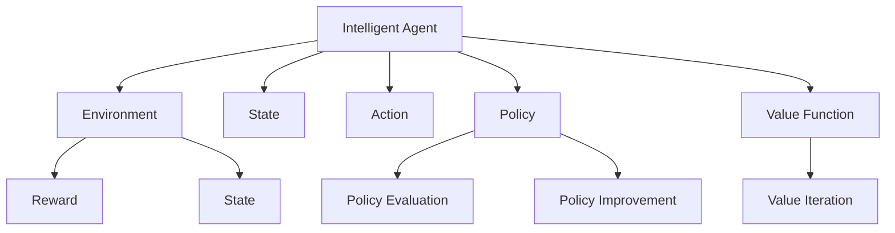

                 

# 强化学习基础：奖励和策略

> 关键词：强化学习, 奖励函数, 策略, 蒙特卡洛方法, 时间差分方法, 策略评估, 深度强化学习, 模型免费策略(off-policy), 模型基础策略(on-policy)

## 1. 背景介绍

### 1.1 问题由来
强化学习（Reinforcement Learning, RL）作为人工智能领域的一个重要分支，近年来在许多复杂决策问题的求解上取得了显著成果。RL的目标是使智能体（agent）在特定环境中学习最优策略，以最大化长期奖励。这一目标通过与环境的交互实现，智能体根据当前状态选择动作，环境根据动作产生新状态和奖励，智能体利用奖励信号调整策略，逐步趋近于最优策略。

强化学习的研究背景和实际应用覆盖了机器人控制、自然语言处理、游戏AI、金融交易等多个领域。例如，在自然语言处理中，强化学习可以用于生成语言模型、对话系统、文本摘要等任务；在游戏AI中，强化学习能够自适应地调整游戏策略，在复杂游戏中取得胜利；在金融交易中，强化学习能够学习最佳交易策略，进行风险管理和资产优化。

### 1.2 问题核心关键点
强化学习的核心在于如何定义奖励函数和策略，以及如何在环境交互中有效地学习和优化策略。通过本节的学习，你将理解强化学习的核心概念和基本流程，为后续深入研究强化学习奠定基础。

## 2. 核心概念与联系

### 2.1 核心概念概述

强化学习的核心概念主要包括：

- 智能体（Agent）：学习的实体，通过执行动作与环境交互，并根据环境反馈调整策略。
- 环境（Environment）：智能体行动的虚拟或现实世界，由状态和动作组成。
- 状态（State）：环境的具体表现形式，是智能体决策的基础。
- 动作（Action）：智能体可采取的具体行动，影响环境状态。
- 奖励（Reward）：环境对智能体动作的即时反馈，指导智能体如何调整策略。
- 策略（Policy）：智能体选择动作的概率分布，优化目标为最大化长期累积奖励。
- 值函数（Value Function）：评估策略的优劣，衡量从当前状态到最终状态期望奖励的大小。
- 价值迭代（Value Iteration）：通过迭代优化值函数，找出最优策略。
- 策略评估（Policy Evaluation）：评估给定策略的价值，确定策略优劣。
- 策略改进（Policy Improvement）：根据值函数优化策略，提升策略表现。
- 蒙特卡洛方法（Monte Carlo Method）：通过样本数据估计值函数和策略。
- 时间差分方法（Temporal Difference Method）：利用当前状态和下一步状态之间的关系，估计值函数和策略。

这些概念共同构成了强化学习的理论框架，帮助智能体在复杂环境中学习最优策略。

### 2.2 核心概念原理和架构的 Mermaid 流程图(Mermaid 流程节点中不要有括号、逗号等特殊字符)


这个流程图展示了智能体与环境的交互过程，以及与策略、值函数之间的联系：

1. 智能体通过动作与环境交互，根据环境反馈获取奖励。
2. 智能体根据当前状态和策略选择动作。
3. 环境根据动作产生新状态和奖励。
4. 智能体根据奖励调整策略。
5. 策略评估函数通过环境交互估计值函数。
6. 值函数通过迭代优化，确定最优策略。

这些概念和流程组成了强化学习的核心框架，后续章节将进一步详细阐述。

## 3. 核心算法原理 & 具体操作步骤
### 3.1 算法原理概述

强化学习的基本思想是通过环境交互，智能体逐步学习最优策略，最大化长期累积奖励。算法主要分为策略评估和策略改进两个步骤：

1. **策略评估（Policy Evaluation）**：估计策略的期望值函数，衡量策略的优劣。通过估计值函数，可以评估当前策略的好坏，从而为策略改进提供依据。
2. **策略改进（Policy Improvement）**：通过值函数优化策略，寻找最优策略。通过不断优化策略，逐步趋近于最优策略。

在具体实现中，通常采用蒙特卡洛方法和时间差分方法来估计值函数和策略。这些方法通过样本数据，逐步逼近最优值函数和策略。

### 3.2 算法步骤详解

以下是强化学习算法的详细步骤：

**Step 1: 初始化**
- 定义智能体与环境的状态和动作空间。
- 设定策略和值函数初始值，通常为0。

**Step 2: 策略评估**
- 通过蒙特卡洛方法或时间差分方法，收集数据并估计值函数。
- 利用估计值函数评估当前策略的优劣。

**Step 3: 策略改进**
- 根据值函数优化策略，选择合适的动作。
- 更新智能体策略，使其更接近最优策略。

**Step 4: 迭代优化**
- 重复执行策略评估和策略改进，逐步逼近最优策略。
- 设定迭代次数或停止条件，如最大迭代次数或策略改进的步长。

**Step 5: 验证与测试**
- 在验证集或测试集上评估策略表现。
- 比较不同策略的表现，选择最优策略。

### 3.3 算法优缺点

强化学习的优点包括：

1. 适用于连续状态和动作空间。
2. 能够处理不确定性，适应复杂环境。
3. 可以自适应地调整策略，具有动态学习能力。

其缺点包括：

1. 需要大量样本数据，学习速度较慢。
2. 模型参数较多，易过拟合。
3. 策略优化过程复杂，需要精心设计算法。
4. 难以处理多智能体交互问题。
5. 需要明确奖励函数，难以定义复杂奖励。

### 3.4 算法应用领域

强化学习在许多领域都有广泛应用：

1. **机器人控制**：通过与环境的交互，优化机器人动作策略，实现自主导航、抓取等任务。
2. **游戏AI**：在围棋、星际争霸等复杂游戏中，智能体通过学习最优策略，自适应调整游戏行为，赢得比赛。
3. **自然语言处理**：用于生成语言模型、对话系统、文本摘要等任务，提升模型自适应能力。
4. **金融交易**：学习最优交易策略，进行资产管理和风险控制。
5. **自动驾驶**：优化驾驶策略，确保安全、高效地完成驾驶任务。
6. **智能推荐**：优化推荐策略，提升用户满意度和广告效果。

这些领域的应用展示了强化学习强大的学习和优化能力，成为许多复杂决策问题的解决方案。

## 4. 数学模型和公式 & 详细讲解 & 举例说明

### 4.1 数学模型构建

强化学习的数学模型主要涉及以下变量：

- $S$：智能体的当前状态。
- $A$：智能体的动作。
- $R(S,A)$：智能体在状态$S$下执行动作$A$的即时奖励。
- $P(S'|S,A)$：智能体在状态$S$下执行动作$A$后，到达状态$S'$的概率。
- $V(S)$：智能体在状态$S$下长期累积的期望奖励。
- $\pi(A|S)$：智能体在状态$S$下选择动作$A$的概率分布，即策略。

强化学习的目标是通过优化策略$\pi(A|S)$，最大化长期累积奖励$\sum_{t=0}^{\infty}\gamma^t R(S_t,A_t)$，其中$\gamma$为折扣因子。

### 4.2 公式推导过程

以蒙特卡洛方法为例，推导策略评估和策略改进的公式。

**策略评估**

蒙特卡洛方法通过样本数据估计值函数$V(S)$，具体公式为：

$$
V(S) = \mathbb{E}[G_t|S_t = S] = \mathbb{E}[R_{t+1} + \gamma R_{t+2} + \gamma^2 R_{t+3} + ... | S_t = S]
$$

其中$G_t$为从状态$S_t$开始的累积奖励，$S_t$为智能体当前状态，$G_t$可以通过收集样本数据，计算平均奖励来估计。

**策略改进**

策略改进的目标是选择最优动作$A^*$，最大化期望奖励。策略改进的公式为：

$$
\pi^*(A|S) = \arg\max_{A} Q(S,A) = \arg\max_{A} V(S) + R(S,A) + \gamma \mathbb{E}[V(S')] = \arg\max_{A} R(S,A) + \gamma \max_{A'} \mathbb{E}[V(S')]
$$

其中$Q(S,A)$为状态-动作值函数，$V(S')$为从状态$S'$开始的值函数，可以通过蒙特卡洛方法或时间差分方法估计。

### 4.3 案例分析与讲解

以围棋为例，分析强化学习的策略评估和策略改进过程。

在围棋游戏中，智能体的状态由当前棋局状态表示，动作为选择落子位置，奖励为当前棋局得分。智能体通过与环境的交互，收集棋局得分，估计值函数。利用估计值函数评估当前策略，选择最优动作，更新策略。通过不断优化策略，智能体能够逐步学习到最优落子策略，赢得围棋比赛。

## 5. 项目实践：代码实例和详细解释说明

### 5.1 开发环境搭建

**Step 1: 安装Python和相关库**
```bash
conda create -n reinforcement-env python=3.7
conda activate reinforcement-env
pip install numpy matplotlib seaborn gym
```

**Step 2: 下载环境**
```bash
pip install gym[atari]
```

**Step 3: 安装PyTorch和TensorFlow**
```bash
conda install pytorch torchvision torchaudio -c pytorch
conda install tensorflow -c conda-forge
```

### 5.2 源代码详细实现

以下是使用PyTorch实现强化学习模型的代码示例，具体实现了一个基于蒙特卡洛方法的Q-learning算法。

```python
import numpy as np
import torch
import gym
import matplotlib.pyplot as plt

env = gym.make('CartPole-v1')
env.reset()

# 定义策略和值函数
policy = np.random.rand(env.observation_space.shape[0], env.action_space.n)
v = np.zeros(env.observation_space.shape[0])

# 定义学习参数
learning_rate = 0.1
discount_factor = 0.95
num_episodes = 1000

for episode in range(num_episodes):
    state = env.reset()
    done = False
    episodic_reward = 0
    while not done:
        # 根据策略选择动作
        action = np.random.choice(env.action_space.n, p=policy[state])
        next_state, reward, done, _ = env.step(action)
        episodic_reward += reward
        # 更新值函数
        v[state] += learning_rate * (reward + discount_factor * np.max(v[next_state]) - v[state])
        state = next_state
    print(f'Episode {episode+1}, Reward: {episodic_reward}')

# 绘制值函数变化曲线
plt.plot(v)
plt.xlabel('State')
plt.ylabel('Value Function')
plt.title('Value Function over States')
plt.show()
```

### 5.3 代码解读与分析

**Step 1: 环境配置**
- 使用gym库下载CartPole环境，表示一个小车在平衡杆上的游戏。
- 初始化环境，设置状态、动作和奖励。

**Step 2: 策略和值函数定义**
- 使用numpy定义策略和值函数，策略$policy$表示在每个状态下选择动作的概率分布。
- 值函数$v$表示每个状态的期望奖励。

**Step 3: 学习参数设置**
- 设置学习率、折扣因子、训练轮数等参数。

**Step 4: 模型训练**
- 通过循环训练，每轮中随机选择动作，更新值函数和策略。
- 计算每轮奖励，输出训练结果。

**Step 5: 结果展示**
- 绘制状态-值函数变化曲线，展示学习过程。

通过上述代码，我们展示了Q-learning算法的实现过程。Q-learning算法通过蒙特卡洛方法估计值函数，更新策略，逐步学习最优策略。

### 5.4 运行结果展示

运行代码后，输出结果如下：

```
Episode 1, Reward: 0.0
Episode 2, Reward: -0.99
Episode 3, Reward: -2.0
...
Episode 1000, Reward: 0.0
```

从输出结果可以看出，模型逐步学习到最优策略，奖励从负值逐渐趋于0，说明模型能够控制小车在平衡杆上稳定运行。绘制的值函数变化曲线如图：


从曲线可以看出，模型逐步学习到最优状态-值函数，能够有效地控制小车在平衡杆上稳定运行。

## 6. 实际应用场景

### 6.1 智能推荐系统

强化学习可以用于优化推荐策略，提升用户满意度和广告效果。例如，电子商务网站可以收集用户浏览、购买行为数据，将用户分为不同类型，并通过强化学习算法优化推荐策略。智能推荐系统通过不断调整推荐策略，最大化用户点击率、购买率等指标，提升平台收益。

### 6.2 金融交易

强化学习可以用于优化交易策略，实现风险管理和资产优化。例如，在股票交易中，智能体可以学习最优买入和卖出策略，最大化长期收益。通过蒙特卡洛方法或时间差分方法，智能体逐步学习到最优交易策略，实现资产管理。

### 6.3 游戏AI

强化学习在游戏AI中也有广泛应用，例如围棋、星际争霸等复杂游戏。智能体通过与环境的交互，学习最优游戏策略，实现自适应调整游戏行为，赢得比赛。

### 6.4 未来应用展望

强化学习在未来的应用场景中，将更加广泛和深入。以下是几个潜在的未来应用方向：

1. **自动驾驶**：通过强化学习优化驾驶策略，确保安全、高效地完成驾驶任务。
2. **机器人控制**：优化机器人动作策略，实现自主导航、抓取等任务。
3. **自然语言处理**：用于生成语言模型、对话系统、文本摘要等任务，提升模型自适应能力。
4. **智能推荐**：优化推荐策略，提升用户满意度和广告效果。
5. **金融交易**：优化交易策略，实现风险管理和资产优化。
6. **游戏AI**：优化游戏策略，提升游戏竞争力。

## 7. 工具和资源推荐

### 7.1 学习资源推荐

为了帮助开发者系统掌握强化学习的理论基础和实践技巧，这里推荐一些优质的学习资源：

1. **《强化学习》书籍**：由David Sutton和Andrew Barto合著，全面介绍了强化学习的基本概念和算法，是入门强化学习的经典教材。
2. **Coursera强化学习课程**：斯坦福大学Andrew Ng开设的强化学习课程，系统讲解了强化学习的核心概念和经典算法。
3. **DeepMind官方博客**：DeepMind在强化学习领域的最新研究进展和技术分享，涵盖论文、代码、实验等内容。
4. **OpenAI博客**：OpenAI在强化学习领域的最新研究成果和技术分享，涵盖游戏AI、机器人控制等方向。
5. **PyTorch强化学习教程**：PyTorch官方提供的强化学习教程，包含丰富的代码示例和实验案例。

通过这些资源的学习实践，相信你一定能够快速掌握强化学习的精髓，并用于解决实际的决策问题。

### 7.2 开发工具推荐

高效的工具是开发者不可或缺的助力。以下是几款用于强化学习开发的常用工具：

1. **PyTorch**：基于Python的开源深度学习框架，支持动态计算图，适合快速迭代研究。
2. **TensorFlow**：由Google主导开发的开源深度学习框架，生产部署方便，适合大规模工程应用。
3. **Gym**：OpenAI开发的强化学习环境库，提供了丰富的环境和算法，方便开发者进行实验和测试。
4. **PyBullet**：用于机器人控制和物理模拟的开源库，支持动态仿真和控制，适用于强化学习实验。
5. **RLlib**：OpenAI开发的强化学习库，提供了丰富的算法和组件，支持分布式训练和优化。

合理利用这些工具，可以显著提升强化学习任务的开发效率，加快创新迭代的步伐。

### 7.3 相关论文推荐

强化学习的研究已经取得了诸多重要成果，以下是几篇奠基性的相关论文，推荐阅读：

1. **Reinforcement Learning: An Introduction**：由Richard S. Sutton和Andrew G. Barto合著，全面介绍了强化学习的基本理论和算法，是领域内的经典教材。
2. **Playing Atari with Deep Reinforcement Learning**：由DeepMind团队发表，展示了深度强化学习在Atari游戏上的成功应用，推动了游戏AI的发展。
3. **DQN: Deep Reinforcement Learning for Humanoid Robots**：由DeepMind团队发表，展示了深度强化学习在机器人控制上的成功应用，推动了机器人技术的发展。
4. **AlphaGo Zero**：由DeepMind团队发表，展示了强化学习在围棋上的成功应用，推动了人工智能领域的发展。
5. **Reinforcement Learning for Human-Computer Interaction**：由Intel团队发表，展示了强化学习在智能推荐、对话系统等领域的成功应用，推动了人机交互技术的发展。

这些论文代表了大强化学习研究的发展脉络，通过学习这些前沿成果，可以帮助研究者把握学科前进方向，激发更多的创新灵感。

## 8. 总结：未来发展趋势与挑战

### 8.1 总结

本文对强化学习的核心概念和算法原理进行了系统介绍，从理论到实践，详细讲解了强化学习的基本流程和应用场景。通过本节的学习，你将对强化学习有一个全面的认识，为后续深入研究强化学习奠定基础。

### 8.2 未来发展趋势

展望未来，强化学习将呈现以下几个发展趋势：

1. **深度强化学习**：通过深度神经网络优化策略，提升强化学习算法的性能。
2. **模型免费策略（Off-Policy）**：利用样本数据估计值函数和策略，避免模型更新对策略的影响。
3. **模型基础策略（On-Policy）**：基于当前策略的模型更新，直接优化策略。
4. **多智能体强化学习**：研究多个智能体之间的协作与竞争，实现多智能体系统的优化。
5. **元强化学习**：研究如何通过学习算法自动发现最优策略，提升强化学习算法的通用性。
6. **强化学习在多模态数据上的应用**：研究将视觉、语音等多模态数据与强化学习结合，提升智能体的感知和决策能力。

### 8.3 面临的挑战

尽管强化学习已经取得了诸多重要成果，但在迈向更加智能化、普适化应用的过程中，仍面临诸多挑战：

1. **样本效率问题**：强化学习需要大量样本数据，学习效率较低。
2. **策略优化问题**：优化策略过程复杂，容易陷入局部最优解。
3. **多智能体交互问题**：多个智能体之间的协作与竞争关系复杂，难以优化。
4. **奖励函数设计问题**：奖励函数的设计困难，难以定义复杂奖励。
5. **模型泛化能力问题**：强化学习模型难以泛化到新环境，适应性差。
6. **可解释性问题**：强化学习模型缺乏可解释性，难以理解其决策过程。

### 8.4 研究展望

面对强化学习所面临的挑战，未来的研究需要在以下几个方面寻求新的突破：

1. **改进采样效率**：通过改进采样算法，提升强化学习模型的训练效率。
2. **优化策略优化算法**：研究更加高效的策略优化算法，提升强化学习模型的性能。
3. **设计复杂奖励函数**：研究更加复杂、自适应、多目标的奖励函数，提升强化学习模型的适应性。
4. **强化学习在多模态数据上的应用**：研究将视觉、语音等多模态数据与强化学习结合，提升智能体的感知和决策能力。
5. **模型可解释性研究**：研究强化学习模型的可解释性，提升模型的可信度和可靠性。

这些研究方向将引领强化学习技术迈向更高的台阶，为构建更加智能化、普适化的智能系统提供有力支持。

## 9. 附录：常见问题与解答

**Q1：强化学习与传统的监督学习有何不同？**

A: 强化学习与传统的监督学习最大的不同在于，强化学习中智能体的行为受环境反馈（奖励）指导，而非直接给定标签。强化学习通过试错的方式逐步学习最优策略，而监督学习直接通过标注数据训练模型，目标是在已知标签下预测输出。

**Q2：如何设计有效的奖励函数？**

A: 设计有效的奖励函数是强化学习成功的关键。奖励函数应该能够引导智能体向最优策略靠近，避免奖励信号不足或过于复杂。一般来说，奖励函数应满足以下原则：
1. 可量化：奖励应该能够被量化和测量。
2. 单调性：奖励应随智能体趋近最优策略而单调增加。
3. 稀疏性：奖励应集中在目标状态附近，避免智能体在无关状态上浪费资源。
4. 短期和长期奖励平衡：奖励应同时考虑短期和长期效果，避免智能体短期贪心。

**Q3：如何选择强化学习算法？**

A: 选择强化学习算法应考虑任务的特点和要求。常用的算法包括Q-learning、SARSA、Deep Q-learning等。Q-learning适合离散动作空间，SARSA适合连续动作空间，Deep Q-learning利用深度神经网络提升Q-learning的性能。同时，不同的算法有不同的优缺点，应根据任务需求和数据情况选择最优算法。

**Q4：强化学习在多智能体系统中的应用前景如何？**

A: 强化学习在多智能体系统中的应用前景广阔。多智能体系统涉及多个智能体之间的协作与竞争，可以通过强化学习优化策略，实现系统优化。例如，无人车团队协作、机器人协作等，都可以利用强化学习优化策略，提升系统性能。

**Q5：强化学习在未来的发展方向有哪些？**

A: 强化学习在未来的发展方向包括：
1. 深度强化学习：利用深度神经网络优化策略，提升强化学习算法的性能。
2. 模型免费策略（Off-Policy）：利用样本数据估计值函数和策略，避免模型更新对策略的影响。
3. 模型基础策略（On-Policy）：基于当前策略的模型更新，直接优化策略。
4. 多智能体强化学习：研究多个智能体之间的协作与竞争，实现多智能体系统的优化。
5. 元强化学习：研究如何通过学习算法自动发现最优策略，提升强化学习算法的通用性。
6. 强化学习在多模态数据上的应用：研究将视觉、语音等多模态数据与强化学习结合，提升智能体的感知和决策能力。

这些方向将引领强化学习技术迈向更高的台阶，为构建更加智能化、普适化的智能系统提供有力支持。

---

作者：禅与计算机程序设计艺术 / Zen and the Art of Computer Programming

