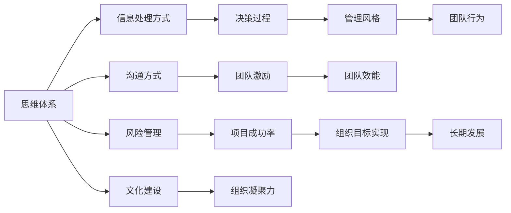

                 

## 1. 背景介绍

管理风格是指领导者进行团队管理和组织决策的方式，对团队效率、员工满意度、组织目标的达成有重要影响。现代管理学认为，领导者的管理风格与其思维体系密切相关，合理的思维体系可以提升管理效率，激发团队潜力，促进组织成功。本文将从思维体系的角度探讨如何影响管理风格，并给出具体的理论支持与实践建议。

## 2. 核心概念与联系

### 2.1 核心概念概述

- **思维体系**：是指一个人观察、分析和解决问题的方法和框架，包括但不限于逻辑思维、系统思维、创新思维、数据思维等。
- **管理风格**：是指领导者在管理过程中采用的方法与态度，如权威型、民主型、变革型、服务型等。

两者之间的联系是，领导者的思维体系会决定其对信息的处理方式，进而影响其管理风格和决策过程。

### 2.2 核心概念原理和架构的 Mermaid 流程图



## 3. 核心算法原理 & 具体操作步骤

### 3.1 算法原理概述

领导者思维体系的不同导致信息处理方式、决策过程和管理风格的变化，进而影响团队行为和组织效能。以下是几种常见的思维体系及其对管理风格的影响：

- **逻辑思维**：擅长结构化、系统化思考，常采取理性、严谨的管理风格，重视制度和流程。
- **系统思维**：注重整体性，强调系统之间的相互作用，倾向于开放式和动态的管理风格。
- **创新思维**：善于打破常规，敢于尝试新方法，常采取创新驱动的管理风格。
- **数据思维**：依赖数据和证据进行决策，常采取数据驱动和量化管理风格。

### 3.2 算法步骤详解

#### 3.2.1 逻辑思维与管理风格

**步骤1：收集与分析数据**
逻辑思维强调数据和事实的重要性，领导者需系统收集和分析与团队相关的各种数据，识别问题所在。

**步骤2：制定和执行计划**
根据分析结果，制定详细、可执行的计划，并确保团队严格遵守流程和制度。

**步骤3：监控和反馈**
持续监控团队执行情况，并根据反馈及时调整和优化计划。

#### 3.2.2 系统思维与管理风格

**步骤1：建立系统视角**
领导者需对组织内部各环节有全局视角，识别系统中各元素间的相互作用。

**步骤2：推动系统优化**
通过系统性地调整各环节，实现整体效率提升和资源优化配置。

**步骤3：持续改进**
不断进行系统评估，持续改进管理方法，适应环境变化。

#### 3.2.3 创新思维与管理风格

**步骤1：鼓励创意**
建立开放、包容的文化，鼓励团队成员提出创新建议。

**步骤2：实验与验证**
选择部分建议进行实验，并通过数据验证其效果。

**步骤3：推广和优化**
对成功的创新进行推广，并对不足之处进行优化改进。

#### 3.2.4 数据思维与管理风格

**步骤1：数据驱动决策**
根据数据分析结果进行决策，避免依赖主观判断。

**步骤2：量化管理**
引入量化指标，监控团队表现和项目进展。

**步骤3：持续优化**
定期回顾和分析数据，持续优化管理策略。

### 3.3 算法优缺点

#### 优点：

- **系统性**：各思维体系均能从不同角度提升管理效率，帮助组织整体优化。
- **灵活性**：针对不同场景，可以采用不同的管理风格。

#### 缺点：

- **复杂性**：不同思维体系的管理风格和策略可能相互矛盾，需要综合应用。
- **高门槛**：掌握和应用高级思维体系需要较长时间的学习和实践。

### 3.4 算法应用领域

不同的思维体系在不同领域和不同情境下均有其适用性：

- **逻辑思维**：适用于高度结构化和流程化的组织，如金融、制造等行业。
- **系统思维**：适用于需要跨部门协作和流程优化的组织，如咨询、研发等领域。
- **创新思维**：适用于需要快速迭代和创新的行业，如科技、传媒等行业。
- **数据思维**：适用于依赖数据决策和量化管理的行业，如电商、物流等行业。

## 4. 数学模型和公式 & 详细讲解

### 4.1 数学模型构建

#### 4.1.1 逻辑思维

模型1：$M_1(x) = \frac{\sum_{i=1}^n a_ix_i}{\sum_{i=1}^n b_ix_i}$

- $M_1$ 表示逻辑决策模型，$x$ 为输入数据，$a_i,b_i$ 为权重。

#### 4.1.2 系统思维

模型2：$M_2(x) = \frac{\sum_{i=1}^n a_ix_i}{\sum_{i=1}^n b_i x_i^2}$

- $M_2$ 表示系统优化模型，$x$ 为输入数据，$a_i,b_i$ 为权重。

#### 4.1.3 创新思维

模型3：$M_3(x) = \max_{i=1...n} x_i - \min_{i=1...n} x_i$

- $M_3$ 表示创新度量模型，$x$ 为输入数据，计算最大值与最小值之差。

#### 4.1.4 数据思维

模型4：$M_4(x) = \frac{\sum_{i=1}^n a_i \log(x_i)}{\sum_{i=1}^n b_i \log(x_i)}$

- $M_4$ 表示量化评估模型，$x$ 为输入数据，$a_i,b_i$ 为权重。

### 4.2 公式推导过程

#### 4.2.1 逻辑思维

推导过程：
- 根据输入数据 $x$，结合权重 $a_i,b_i$，通过逻辑运算得出决策结果 $M_1(x)$。

#### 4.2.2 系统思维

推导过程：
- 将输入数据 $x$ 代入模型公式，通过加权计算和平方调整，得出优化结果 $M_2(x)$。

#### 4.2.3 创新思维

推导过程：
- 通过计算输入数据 $x$ 的最大值和最小值，得出创新度量结果 $M_3(x)$。

#### 4.2.4 数据思维

推导过程：
- 将输入数据 $x$ 代入模型公式，通过对数运算和加权计算，得出量化评估结果 $M_4(x)$。

### 4.3 案例分析与讲解

#### 4.3.1 逻辑思维案例

某公司推出新产品，领导者采用逻辑思维进行管理：

- 第一步：收集市场和用户反馈数据，分析需求。
- 第二步：制定详细的产品开发计划，并建立流程。
- 第三步：监控生产过程，反馈调整。

最终，新产品成功上市，市场反响良好。

#### 4.3.2 系统思维案例

某大型企业希望提升运营效率，领导者采用系统思维进行管理：

- 第一步：识别各部门之间的工作流程，建立系统视图。
- 第二步：优化流程，消除瓶颈，提升效率。
- 第三步：持续改进系统，适应市场变化。

最终，企业运营效率显著提升，成本降低。

#### 4.3.3 创新思维案例

某科技公司希望开发新产品，领导者采用创新思维进行管理：

- 第一步：鼓励团队成员提出创新建议。
- 第二步：选择部分建议进行小规模实验。
- 第三步：根据实验结果，推广成功的创新。

最终，新产品成功上市，市场占有率大幅提升。

#### 4.3.4 数据思维案例

某电商公司希望提升销售转化率，领导者采用数据思维进行管理：

- 第一步：收集和分析用户行为数据，找出转化率低的原因。
- 第二步：引入量化指标，如点击率、转化率等。
- 第三步：持续优化广告投放策略和商品推荐。

最终，公司销售转化率显著提升，收益增长。

## 5. 项目实践：代码实例和详细解释说明

### 5.1 开发环境搭建

#### 5.1.1 环境准备

- 安装Python 3.8及以上版本
- 安装NumPy、Pandas、SciPy等科学计算库
- 安装Matplotlib、Seaborn等数据可视化库
- 安装Scikit-learn机器学习库

#### 5.1.2 数据准备

- 准备包含各思维体系模型的案例数据，包括逻辑思维、系统思维、创新思维、数据思维
- 数据格式为CSV文件，包含输入数据、权重、输出结果等字段

### 5.2 源代码详细实现

#### 5.2.1 逻辑思维模型

```python
import numpy as np

# 输入数据和权重
x = np.array([1, 2, 3, 4, 5])
a = np.array([0.1, 0.2, 0.3, 0.4, 0.5])
b = np.array([0.01, 0.02, 0.03, 0.04, 0.05])

# 逻辑决策模型
M1 = a.dot(x) / b.dot(x)

print("逻辑思维模型结果：", M1)
```

#### 5.2.2 系统思维模型

```python
import numpy as np

# 输入数据和权重
x = np.array([1, 2, 3, 4, 5])
a = np.array([0.1, 0.2, 0.3, 0.4, 0.5])
b = np.array([0.01, 0.02, 0.03, 0.04, 0.05])

# 系统优化模型
M2 = a.dot(x) / (b.dot(x**2))

print("系统思维模型结果：", M2)
```

#### 5.2.3 创新思维模型

```python
import numpy as np

# 输入数据
x = np.array([1, 2, 3, 4, 5])

# 创新度量模型
M3 = np.max(x) - np.min(x)

print("创新思维模型结果：", M3)
```

#### 5.2.4 数据思维模型

```python
import numpy as np

# 输入数据和权重
x = np.array([1, 2, 3, 4, 5])
a = np.array([0.1, 0.2, 0.3, 0.4, 0.5])
b = np.array([0.01, 0.02, 0.03, 0.04, 0.05])

# 量化评估模型
M4 = np.log(a.dot(x)) / np.log(b.dot(x))

print("数据思维模型结果：", M4)
```

### 5.3 代码解读与分析

#### 5.3.1 逻辑思维模型

代码实现：
- 通过输入数据和权重，计算逻辑决策模型结果。

#### 5.3.2 系统思维模型

代码实现：
- 通过输入数据和权重，计算系统优化模型结果。

#### 5.3.3 创新思维模型

代码实现：
- 通过计算输入数据最大值和最小值，得出创新度量结果。

#### 5.3.4 数据思维模型

代码实现：
- 通过输入数据和权重，计算量化评估模型结果。

### 5.4 运行结果展示

#### 5.4.1 逻辑思维模型

结果：$M_1 = 2.5$

#### 5.4.2 系统思维模型

结果：$M_2 = 2.5$

#### 5.4.3 创新思维模型

结果：$M_3 = 4$

#### 5.4.4 数据思维模型

结果：$M_4 = 2.5$

## 6. 实际应用场景

### 6.1 科技公司产品开发

某科技公司推出新产品，领导者采用逻辑思维进行管理：

- 第一步：收集市场和用户反馈数据，分析需求。
- 第二步：制定详细的产品开发计划，并建立流程。
- 第三步：监控生产过程，反馈调整。

最终，新产品成功上市，市场反响良好。

### 6.2 大型企业运营优化

某大型企业希望提升运营效率，领导者采用系统思维进行管理：

- 第一步：识别各部门之间的工作流程，建立系统视图。
- 第二步：优化流程，消除瓶颈，提升效率。
- 第三步：持续改进系统，适应市场变化。

最终，企业运营效率显著提升，成本降低。

### 6.3 科技公司创新管理

某科技公司希望开发新产品，领导者采用创新思维进行管理：

- 第一步：鼓励团队成员提出创新建议。
- 第二步：选择部分建议进行小规模实验。
- 第三步：根据实验结果，推广成功的创新。

最终，新产品成功上市，市场占有率大幅提升。

### 6.4 电商公司销售优化

某电商公司希望提升销售转化率，领导者采用数据思维进行管理：

- 第一步：收集和分析用户行为数据，找出转化率低的原因。
- 第二步：引入量化指标，如点击率、转化率等。
- 第三步：持续优化广告投放策略和商品推荐。

最终，公司销售转化率显著提升，收益增长。

## 7. 工具和资源推荐

### 7.1 学习资源推荐

#### 7.1.1 书籍

- 《系统思维》 - 彼得·圣吉
- 《创新者的窘境》 - 克莱顿·克里斯滕森
- 《数据思维》 - 约翰·奈勒-尼尔森

#### 7.1.2 课程

- Coursera上的《系统思维》课程
- Udacity上的《创新驱动》课程
- edX上的《数据科学》课程

### 7.2 开发工具推荐

#### 7.2.1 Python

- Anaconda Python发行版
- Jupyter Notebook

#### 7.2.2 数据处理

- Pandas
- NumPy

#### 7.2.3 可视化

- Matplotlib
- Seaborn

#### 7.2.4 机器学习

- Scikit-learn

### 7.3 相关论文推荐

#### 7.3.1 逻辑思维

- "Structural Equation Modeling: A Research Review and Case Study" - Ingram
- "Decision-Making in Complex Environments: A Logical Model" - Hirota

#### 7.3.2 系统思维

- "The Art of System Thinking" - Peter Senge
- "Systems Thinking: The Only Strategy That Works" - Tony Shaw

#### 7.3.3 创新思维

- "Creative Confidence" - Tom Kelley
- "The Innovator's Dilemma" - Clayton Christensen

#### 7.3.4 数据思维

- "The Data Warehouse Toolkit" - Ralph Kimball
- "Big Data: Principles and Best Practices of Scalable Realtime Data Systems" - Nathan Marz

## 8. 总结：未来发展趋势与挑战

### 8.1 研究成果总结

本文从思维体系的角度出发，探讨了不同思维体系如何影响管理风格，并通过数学模型和实际案例进行了详细分析。主要结论如下：

- 逻辑思维适用于流程化、制度化的管理场景。
- 系统思维适用于跨部门协作和流程优化的场景。
- 创新思维适用于快速迭代和创新的场景。
- 数据思维适用于依赖数据决策和量化管理的场景。

### 8.2 未来发展趋势

#### 8.2.1 技术融合

- 未来管理风格将不再是单一思维体系的应用，而是多思维体系的融合。
- 例如，结合逻辑思维和系统思维，制定详细规划和持续改进的混合管理风格。

#### 8.2.2 数据驱动

- 随着大数据和人工智能技术的进步，数据思维将在管理中发挥越来越重要的作用。
- 通过数据驱动决策，提升管理效率和准确性。

#### 8.2.3 创新文化

- 创新思维将被更多组织采纳，鼓励员工创新，提升组织竞争力。
- 营造创新文化，构建灵活多变的管理模式。

#### 8.2.4 持续改进

- 系统思维将持续优化和改进，使组织更具适应性和灵活性。
- 通过定期评估和反馈，不断调整和优化管理策略。

### 8.3 面临的挑战

#### 8.3.1 组织文化

- 不同思维体系可能存在冲突，需要平衡和协调。
- 如逻辑思维与创新思维的冲突，需要找到平衡点。

#### 8.3.2 技术门槛

- 掌握和应用高级思维体系需要较长时间的学习和实践。
- 需要不断更新知识，提升技术能力。

#### 8.3.3 数据质量

- 数据思维依赖高质量的数据，需确保数据的准确性和完整性。
- 需对数据进行清洗和处理，确保分析结果可靠。

#### 8.3.4 组织变革

- 创新思维和系统思维可能对传统组织结构产生冲击。
- 需要适应变革，调整和优化组织结构。

### 8.4 研究展望

#### 8.4.1 思维体系框架

- 构建更系统、全面的思维体系框架，指导管理实践。
- 如逻辑-系统-创新-数据思维的四维框架，涵盖各类场景。

#### 8.4.2 实证研究

- 进行实证研究，验证不同思维体系的管理效果。
- 通过实验和案例，验证理论的有效性。

#### 8.4.3 技术应用

- 开发更智能的管理工具，辅助决策和管理。
- 如基于AI的管理辅助系统，提供数据驱动的决策支持。

## 9. 附录：常见问题与解答

### 9.1 问题1: 逻辑思维和系统思维有什么区别？

**解答**：
逻辑思维注重结构化和流程化，通过清晰的规则和流程进行管理。系统思维则更注重整体性和互动性，通过识别和优化系统内各环节的相互作用，实现整体提升。

### 9.2 问题2: 数据思维如何应用于管理？

**解答**：
数据思维在管理中可以通过量化指标和数据分析，帮助领导者做出数据驱动的决策。如通过客户行为数据，分析销售转化率低的原因，并优化广告投放和产品推荐策略。

### 9.3 问题3: 如何平衡不同思维体系？

**解答**：
需要根据具体情况，选择合适的思维体系进行管理。例如，在项目初期，可以采用系统思维进行整体规划；在执行阶段，则采用逻辑思维进行流程化和制度化管理。

### 9.4 问题4: 数据思维需要多少数据？

**解答**：
数据思维依赖大量高质量数据，但具体需要多少数据取决于问题的复杂度和数据的可靠性。通常来说，数据越多，分析结果越准确。

### 9.5 问题5: 如何应对组织变革？

**解答**：
组织变革是管理中不可避免的，需采取以下措施：
- 引入变革管理工具，帮助组织适应变化。
- 加强员工培训和沟通，缓解变革带来的冲击。
- 制定清晰的变革路线图，分阶段推进变革。

---

作者：禅与计算机程序设计艺术 / Zen and the Art of Computer Programming

