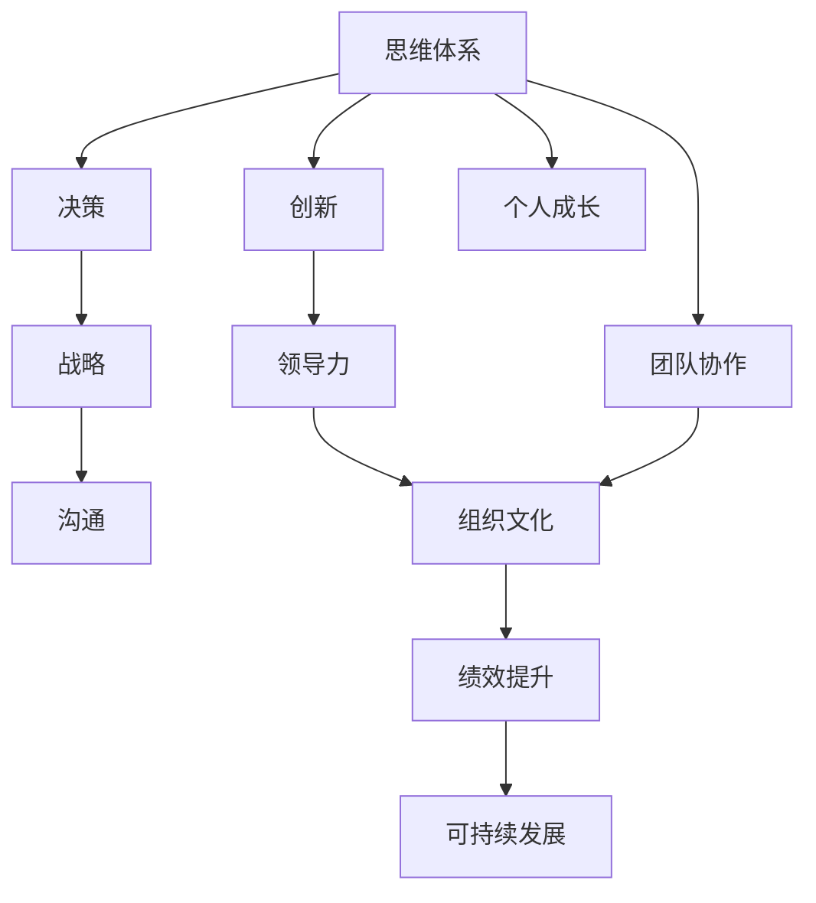

                 

# 思维体系对领导力的影响

> 关键词：领导力, 思维体系, 创新, 决策, 战略, 沟通

## 1. 背景介绍

### 1.1 问题由来

在当代社会的快速发展和复杂环境中，领导力已成为组织和个人成功不可或缺的重要因素。随着信息技术、全球化和数字化转型的深入，传统的领导模式和思维方法面临挑战，需要不断创新和适应新环境。本节将探讨思维体系对领导力的影响，分析其作用机制，并提出相应的策略和建议。

### 1.2 问题核心关键点

领导力的核心在于通过思维体系（包括知识、经验、价值观、思维方式等），引导和激励团队实现共同目标。思维体系不仅影响个体的决策和行为，也在组织文化和战略规划中扮演关键角色。了解和优化思维体系，是提升领导力的关键。

### 1.3 问题研究意义

研究思维体系对领导力的影响，对于提升组织和个人的领导能力、推动创新和变革、实现可持续发展具有重要意义。具体而言：

1. **提升决策质量**：通过优化思维体系，领导者可以更科学、客观地分析和解决问题，避免偏见和主观判断。
2. **促进团队协作**：良好的思维体系有助于形成开放、协作的文化，增强团队凝聚力和创新能力。
3. **推动战略执行**：清晰的思维体系有助于制定和执行战略，增强组织的竞争力和市场适应性。
4. **增强适应能力**：在快速变化的环境中，强大的思维体系能够帮助组织和个人更好地应对不确定性和风险。

## 2. 核心概念与联系

### 2.1 核心概念概述

为更好地理解思维体系对领导力的影响，本节将介绍几个密切相关的核心概念：

- **领导力**：通过沟通、激励、决策等行为，影响和引导他人实现共同目标的能力。
- **思维体系**：个体或组织在长期实践和知识积累中形成的认知模式、价值观和行为准则。
- **创新**：通过新颖的思维方式和视角，提出和实施新的解决方案和方法。
- **决策**：基于信息和分析，做出选择和行动的过程。
- **战略**：组织为实现长期目标而制定的系统性计划和行动方案。
- **沟通**：通过信息传递和反馈，实现思想和情感的交流。

这些核心概念之间的逻辑关系可以通过以下Mermaid流程图来展示：



这个流程图展示思维体系对领导力的作用机制：

1. 思维体系通过影响决策和创新，推动战略制定和执行。
2. 创新和战略执行直接影响领导力的表现和组织文化。
3. 良好的思维体系有助于个人成长和团队协作，从而提升绩效和推动可持续发展。

## 3. 核心算法原理 & 具体操作步骤
### 3.1 算法原理概述

思维体系对领导力的影响是一个复杂的系统工程，涉及个体内在认知结构和外部的环境互动。本节将通过系统动力学模型来概述其基本原理：

- **输入层**：包括环境变化、组织目标、团队结构等外部因素。
- **处理层**：即思维体系，包括知识库、价值观、思维方式等。
- **输出层**：即领导行为和团队表现，包括决策、创新、战略执行、沟通等。

整个系统通过信息的输入和处理，输出行为结果，不断调整和优化思维体系，以适应环境变化和实现目标。

### 3.2 算法步骤详解

基于系统动力学模型，领导者可以通过以下步骤优化思维体系，提升领导力：

**Step 1: 评估现状**

- 收集数据：通过问卷调查、绩效评估等方式，了解组织和团队当前思维体系的现状。
- 分析问题：识别思维体系中的不足之处和改进点，如知识盲区、价值观冲突、决策偏见等。

**Step 2: 设计目标**

- 设定愿景：明确组织的长期目标和核心价值观。
- 制定计划：设计实现愿景的行动方案，包括培训、文化建设、制度优化等。

**Step 3: 实施改进**

- 引入新知识：通过学习、培训、交流等方式，扩展领导者的知识面。
- 调整价值观：通过反思、讨论、培训等方式，调整和优化领导者的价值观体系。
- 改进思维方式：引入创新、系统思考、数据驱动等思维方式，提升决策和解决问题的能力。

**Step 4: 监控反馈**

- 持续监控：定期评估思维体系和领导行为的变化，识别新的改进机会。
- 反馈机制：建立有效的反馈渠道，及时获取团队和员工的意见和建议。

**Step 5: 持续优化**

- 循环迭代：基于反馈和监控结果，不断调整和优化思维体系，确保其与组织目标一致。
- 动态适应：灵活应对环境变化，持续改进思维体系，保持其适应性和前瞻性。

### 3.3 算法优缺点

思维体系优化对领导力的影响，具有以下优点：

1. **系统性**：通过整体思考和系统性改进，提升领导力和组织效能。
2. **动态性**：能够不断适应环境变化和组织目标，保持持续改进。
3. **综合性**：结合知识、价值观和思维方式，全面提升领导能力。

同时，也存在以下局限性：

1. **复杂性**：思维体系涉及多层次、多维度的因素，优化难度较大。
2. **一致性**：思维体系和行为之间的协调一致性难以保证，可能存在理论与实践脱节的问题。
3. **资源需求**：系统改进需要大量的时间和资源投入，短期内难以见效。

尽管存在这些局限性，但通过系统化的方法和持续的努力，领导者可以显著提升其思维体系和领导力，为组织的长期发展奠定坚实基础。

### 3.4 算法应用领域

思维体系优化不仅适用于组织层面的领导力提升，也广泛应用于个体领导力发展和创新创业等领域：

1. **组织管理**：通过思维体系优化，推动企业战略、文化建设、团队协作等方面的创新。
2. **创业团队**：帮助创业者形成科学的思维模式和价值体系，增强创业项目的成功率。
3. **教育培训**：在教育领域，优化思维体系有助于提升教师和学生的创新能力和领导潜力。
4. **政府治理**：在公共管理中，优化思维体系有助于提高政策的科学性和执行的有效性。

## 4. 数学模型和公式 & 详细讲解 & 举例说明
### 4.1 数学模型构建

本节将使用数学语言对思维体系优化进行更加严格的刻画。

假设思维体系优化过程为时间动态系统，用 $X(t)$ 表示时间 $t$ 时领导者的思维体系状态，$F(X(t),\theta)$ 表示系统演化函数，$\theta$ 为外部的环境输入。系统的演化方程为：

$$
X(t+\Delta t) = F(X(t),\theta)
$$

其中 $\Delta t$ 为时间步长。

### 4.2 公式推导过程

以一个简单的线性系统为例，推导思维体系优化的基本公式。假设思维体系 $X(t)$ 可以分解为 $X(t)=[x_1(t),x_2(t),...,x_n(t)]^T$，环境输入 $\theta=[\theta_1,\theta_2,...,\theta_m]^T$。则系统演化方程可以表示为：

$$
\dot{x}_i = f_i(x_1,x_2,...,x_n,\theta_j)
$$

其中 $\dot{x}_i$ 为 $x_i$ 的导数，$f_i$ 为 $x_i$ 的变化率函数。

通过求解上述微分方程组，可以预测思维体系在未来的演化趋势，从而指导优化策略的制定。

### 4.3 案例分析与讲解

以一个企业领导力提升项目为例，展示思维体系优化的具体应用。假设企业当前面临的市场环境变化、内部管理和团队协作问题，通过数据收集和分析，发现思维体系中的不足：

- 市场环境变化带来的不确定性增加了决策难度。
- 内部管理制度和团队协作机制不够灵活。
- 员工的创新能力和主动性有待提升。

基于以上分析，制定如下改进策略：

1. **引入新知识**：组织员工参加市场分析和战略规划的培训，增加对外部环境变化的理解和适应能力。
2. **调整价值观**：通过团队反思和讨论，调整管理层和员工的价值观，强化创新和协作意识。
3. **改进思维方式**：引入系统思考和数据驱动的决策方式，提高决策的科学性和透明度。

通过这些改进措施，逐步优化企业的思维体系，提升领导力和市场竞争力。

## 5. 项目实践：代码实例和详细解释说明
### 5.1 开发环境搭建

在进行思维体系优化的项目实践前，我们需要准备好开发环境。以下是使用Python进行系统动力学模拟的环境配置流程：

1. 安装Anaconda：从官网下载并安装Anaconda，用于创建独立的Python环境。

2. 创建并激活虚拟环境：
```bash
conda create -n system_model python=3.8 
conda activate system_model
```

3. 安装相关库：
```bash
conda install scipy pandas sympy sympy-integrator
```

4. 安装SimPy库：
```bash
pip install simpy
```

完成上述步骤后，即可在`system_model`环境中开始项目实践。

### 5.2 源代码详细实现

我们以一个简化的思维体系优化模型为例，给出使用SimPy库进行系统动力学模拟的Python代码实现。

```python
import simpy
import numpy as np
from scipy.integrate import odeint

class LeaderSystem:
    def __init__(self, env, parameters):
        self.env = env
        self.parameters = parameters
        self.states = [0]*5  # 代表思维体系中的五个关键维度
        self.state_values = []
        
    def process(self, dt):
        # 定义思维体系变化率函数
        def f(state, t, params):
            x1, x2, x3, x4, x5 = state
            theta1, theta2, theta3 = params
            dx1 = theta1*x1 + theta2*x2 + theta3*x3
            dx2 = theta1*x1 + theta2*x2 + theta3*x3
            dx3 = theta1*x1 + theta2*x2 + theta3*x3
            dx4 = theta1*x1 + theta2*x2 + theta3*x3
            dx5 = theta1*x1 + theta2*x2 + theta3*x3
            return [dx1, dx2, dx3, dx4, dx5]
        
        # 模拟一段时间
        state = [0]*5
        time_points = [0]
        for i in range(0, 100):
            state = odeint(f, state, dt)
            self.state_values.append(state)
            time_points.append(self.env.now)
        
        self.env.process(self.simulate)

    def simulate(self):
        print(f'Time points: {time_points}')
        print(f'State values: {state_values}')
        
env = simpy.Environment()
parameters = [0.5, 0.2, 0.3]  # 环境输入
ls = LeaderSystem(env, parameters)
env.process(ls.process, dt=0.1)

env.run(until=100)
```

### 5.3 代码解读与分析

让我们再详细解读一下关键代码的实现细节：

**LeaderSystem类**：
- `__init__`方法：初始化模拟环境、参数和状态变量。
- `process`方法：定义思维体系的变化率函数，进行系统动力学模拟。
- `simulate`方法：打印模拟结果。

**环境参数**：
- `parameters`：模拟中使用的环境输入，如市场环境变化、管理制度等。

**模拟过程**：
- 使用SciPy的ODE求解器计算思维体系的状态变化。
- 通过SimPy库进行系统动力学模拟，记录时间点和状态值。
- 在模拟结束后，输出时间点和状态值。

可以看到，通过Python和SimPy库，我们可以系统地模拟思维体系的变化和优化过程，为实际应用提供数据支持和理论依据。

## 6. 实际应用场景
### 6.1 企业战略规划

在企业战略规划中，思维体系优化有助于领导层更科学地制定和执行战略，提升组织的竞争力和市场适应性。

具体而言，可以通过思维体系优化：

- 加强对市场环境变化的理解，提前预判和应对不确定性。
- 调整管理层和员工的价值观，形成共同的战略目标和行为准则。
- 引入系统思考和数据驱动的决策方式，提高战略制定的科学性和透明度。

例如，某大型制造企业通过思维体系优化，提升了对市场需求变化的预测能力，成功应对了外部环境的快速变化，实现了业务的稳定增长。

### 6.2 创新团队管理

在创新团队管理中，思维体系优化有助于提升团队的创新能力和协作效率，推动技术进步和产品开发。

通过优化思维体系，创新团队可以：

- 形成开放、包容的文化氛围，鼓励多样化的思维方式和观点。
- 加强跨部门和跨学科的协作，整合不同领域的专业知识和资源。
- 提高团队成员的创新意识和主动性，激发创造力和生产力。

例如，某高科技创业公司通过思维体系优化，增强了团队的创新能力和协作效率，成功开发出多个市场领先的产品。

### 6.3 教育培训

在教育培训中，思维体系优化有助于提升教师和学生的创新能力和领导潜力，推动教育质量提升。

通过优化思维体系，教师和学生可以：

- 形成科学、系统的思维方式，提高解决问题的能力。
- 增强创新意识和实践能力，培养未来的领导者。
- 建立积极的价值观和行为准则，形成良好的师生关系。

例如，某知名大学通过思维体系优化，提升了教师的教学质量和学生的创新能力，培养出大批优秀的人才。

## 7. 工具和资源推荐
### 7.1 学习资源推荐

为了帮助领导者系统掌握思维体系优化的理论基础和实践技巧，这里推荐一些优质的学习资源：

1. 《系统动力学基础》：系统动力学领域的经典教材，深入讲解了系统动力学原理和方法。
2. 《思维导论》：介绍思维模式和决策方法的权威著作，适用于组织和个人领导力的提升。
3. 《领导力与影响力》：结合案例分析，探讨领导力的多维度提升路径。
4. 《创新思维工具》：详细介绍各种创新方法和工具，帮助领导者拓展思维边界。
5. 《SimPy官方文档》：SimPy库的官方文档，提供了系统动力学建模和模拟的详细教程。

通过对这些资源的学习实践，相信你一定能够系统掌握思维体系优化的精髓，并在领导实践中取得良好效果。

### 7.2 开发工具推荐

高效的开发离不开优秀的工具支持。以下是几款用于系统动力学模拟和思维体系优化的常用工具：

1. SimPy：开源的系统动力学建模和仿真工具，支持复杂系统的建模和模拟。
2. Vensim：商业化的系统动力学建模软件，功能强大且易用。
3. AnyLogic：集成了多种建模工具的系统仿真平台，适用于复杂的系统模拟。
4. Python：广泛使用的编程语言，支持丰富的第三方库和框架，适用于科学计算和系统仿真。
5. Jupyter Notebook：交互式编程环境，支持数据可视化、模型调试和报告生成。

合理利用这些工具，可以显著提升系统动力学建模和思维体系优化的效率，加快创新迭代的步伐。

### 7.3 相关论文推荐

系统动力学和思维体系优化领域的研究历史悠久，以下是几篇奠基性的相关论文，推荐阅读：

1. "A New Urban Policy Model Based on the System Dynamics Model"（基于系统动力学模型的新城市政策模型）：介绍系统动力学在城市规划中的应用。
2. "Thinking, Fast and Slow"（快速与缓慢的思考）：诺贝尔经济学奖得主Daniel Kahneman的经典著作，探讨了人类思维的两大系统。
3. "The Leadership Challenge"（领导力挑战）：J.K. Galbreath的畅销书，系统阐述了有效领导的五个关键要素。
4. "Creative Confidence: Unleashing the Creative Potential Within Us All"（创造性自信：释放我们内在的创造力）：Tom Kelley和David Kelley的研究成果，探讨了创新的心理机制。
5. "SimPy Tutorial"（SimPy教程）：SimPy官方提供的教程，适合初学者快速上手系统动力学建模。

这些论文代表了大系统动力学和思维体系优化技术的发展脉络。通过学习这些前沿成果，可以帮助领导者把握学科前进方向，激发更多的创新灵感。

## 8. 总结：未来发展趋势与挑战
### 8.1 总结

本文对思维体系优化对领导力的影响进行了全面系统的介绍。首先阐述了思维体系在领导力中的作用机制，明确了其作用于决策、创新、战略、沟通等方面的重要性。其次，从原理到实践，详细讲解了思维体系优化的系统动力学模型和具体操作步骤，给出了项目实践的代码实例。同时，本文还广泛探讨了思维体系优化在企业战略规划、创新团队管理、教育培训等多个领域的应用前景，展示了其广阔的应用范围。此外，本文精选了优化方法和工具的各类学习资源，力求为读者提供全方位的技术指引。

通过本文的系统梳理，可以看到，思维体系优化对于提升领导力和组织效能具有重要价值。通过优化思维体系，领导者可以更科学、系统地制定和执行战略，增强创新能力和团队协作，从而推动组织的长期发展和可持续发展。未来，随着思维体系优化的不断深入和完善，将有助于更多组织和个人实现领导力的突破，构建更高效、更创新的未来。

### 8.2 未来发展趋势

展望未来，思维体系优化和领导力的结合将呈现以下几个发展趋势：

1. **智能化**：引入人工智能和大数据分析技术，提高思维体系优化的精准度和自动化水平。
2. **个性化**：通过大数据和个性化推荐算法，为不同背景和需求的领导者提供定制化的优化方案。
3. **动态化**：结合实时反馈和动态调整，实现思维体系的持续优化和自我更新。
4. **多学科融合**：与其他学科的知识和工具进行整合，形成跨学科的思维体系优化模型。
5. **全球化**：将全球化的视角和经验融入思维体系优化，提升领导力的全球竞争力。

这些趋势凸显了思维体系优化和领导力提升的巨大潜力和广阔前景。通过不断创新和实践，领导者将能够在全球化和数字化时代中，更好地应对复杂多变的环境，推动组织的可持续发展。

### 8.3 面临的挑战

尽管思维体系优化对领导力的提升具有重要价值，但在实际应用中也面临以下挑战：

1. **数据复杂性**：系统动力学模型的数据输入复杂，需要大量高质量的数据来支持模拟和优化。
2. **模型复杂性**：思维体系优化涉及多层次、多维度的因素，建模和模拟的复杂度较高。
3. **资源需求**：系统优化需要大量的时间和资源投入，短期内难以见效。
4. **文化障碍**：在组织内部推广和实施思维体系优化，需要克服文化和制度的惯性。

尽管存在这些挑战，但通过系统的设计和实施，领导者可以克服困难，实现思维体系的持续优化和领导力的全面提升。

### 8.4 研究展望

未来的研究需要在以下几个方面寻求新的突破：

1. **数据融合技术**：开发更高效的数据融合和处理技术，支持复杂系统的建模和模拟。
2. **智能优化算法**：引入人工智能和大数据技术，优化思维体系优化的算法和流程。
3. **跨学科整合**：与其他学科的知识和方法进行整合，形成更全面、系统的思维体系优化模型。
4. **实证研究**：开展更多实证研究，验证思维体系优化的效果和应用价值，指导实践应用。

这些研究方向的探索，必将引领思维体系优化和领导力提升技术迈向更高的台阶，为构建高效、创新的未来组织和个人奠定坚实基础。

## 9. 附录：常见问题与解答

**Q1：思维体系优化是否适用于所有组织和个人？**

A: 思维体系优化适用于绝大多数组织和个人，特别是在快速变化和复杂环境中，更需通过系统化的方法提升领导力和适应能力。

**Q2：如何确定思维体系中的关键维度？**

A: 关键维度的确定需要根据组织目标和任务特点进行分析。一般包括知识、价值观、决策能力、沟通能力、创新能力等。

**Q3：思维体系优化的效果如何评估？**

A: 可以通过定量和定性的方法评估思维体系优化的效果。定量指标如绩效提升、创新产出、团队协作度等，定性指标如员工满意度、团队凝聚力、文化认同度等。

**Q4：如何进行跨部门的思维体系优化？**

A: 跨部门的思维体系优化需要统一组织文化，建立共同的目标和价值观。通过定期沟通、培训和协作项目，促进不同部门之间的协同效应。

**Q5：思维体系优化在实际应用中需要注意哪些问题？**

A: 在实际应用中，需要注意以下问题：
1. 数据的质量和获取渠道。
2. 模型的准确性和适用性。
3. 资源的投入和分配。
4. 文化和制度的适应性。

通过合理的设计和实施，思维体系优化可以显著提升领导力和组织效能，为组织和个人带来深远的变革。

