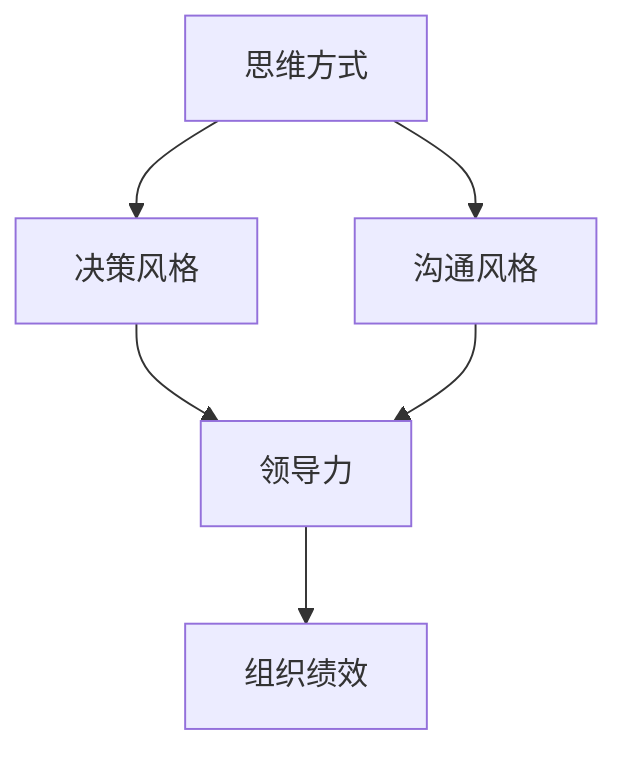

                 

# 思维模式对领导力的影响

## 1. 背景介绍

### 1.1 问题由来
在当今快速变化且复杂多变的商业环境中，领导力已经成为决定组织成败的关键因素。领导力不仅仅是管理技能，更是一种独特的思维方式和行为模式，直接影响组织的决策质量、团队士气和创新能力。因此，探讨和分析不同的思维模式如何影响领导力，对于提升组织竞争力和激发创新具有重要意义。

### 1.2 问题核心关键点
思维模式对领导力的影响主要体现在以下几个方面：
- 思维方式：积极乐观、创新思维、批判性思维、系统思维等。
- 决策方式：直觉决策、分析决策、数据驱动决策等。
- 沟通风格：开放式沟通、封闭式沟通、情感型沟通等。
- 激励手段：奖励、惩罚、赋能等。

本文将从思维方式的维度，深入分析几种典型的思维模式如何影响领导力的发挥，以期为组织培养和提升领导力提供有益的启示。

## 2. 核心概念与联系

### 2.1 核心概念概述

为了更好地理解思维模式对领导力的影响，首先需要明确几个关键概念：

- **思维方式**：指个体在处理信息、解决问题时所采用的认知模式和策略。
- **领导力**：指在组织中引导、影响和激励他人的能力。
- **思维模式**：指人们在进行思考、决策、沟通等行为时所依赖的基本心理机制和习惯性行为模式。
- **决策风格**：指领导者在面对问题时所采用的决策方式，包括直觉、分析、数据驱动等。
- **沟通风格**：指领导者在与他人交流时所采用的沟通方式，包括开放式、封闭式、情感型等。

这些概念之间的逻辑关系可以通过以下Mermaid流程图来展示：



这个流程图展示了思维方式、决策风格、沟通风格和领导力之间的相互影响和作用，最终影响组织绩效。

## 3. 核心算法原理 & 具体操作步骤
### 3.1 算法原理概述

思维模式对领导力的影响主要通过以下几个途径：

1. **思维方式**：
   - **积极乐观**：鼓励团队成员保持积极心态，面对困难时寻找解决方案，提升团队的抗压能力和创新能力。
   - **创新思维**：鼓励尝试新方法和新思路，促进组织变革和持续改进。
   - **批判性思维**：通过质疑和反思，发现问题，改进决策，提高决策的科学性和准确性。
   - **系统思维**：从整体和长远角度考虑问题，避免局部视角和短期行为带来的风险。

2. **决策方式**：
   - **直觉决策**：依赖领导者的经验直觉快速做出决策，适用于紧急情况或信息不充分的情况。
   - **分析决策**：通过收集和分析数据，逐步推理和评估，确保决策的全面性和合理性。
   - **数据驱动决策**：利用数据和统计分析结果，支持决策过程，提高决策的客观性和可靠性。

3. **沟通风格**：
   - **开放式沟通**：鼓励自由表达和意见交流，增强团队的凝聚力和创造力。
   - **封闭式沟通**：限制信息流动，保护组织内部的秘密和机密，适用于高风险环境。
   - **情感型沟通**：通过情感共鸣和共情，增强团队成员的归属感和信任感。

### 3.2 算法步骤详解

基于上述分析，领导力的培养和提升可以通过以下步骤实现：

1. **识别思维模式**：
   - **评估自我**：识别自身的主要思维方式，理解其优缺点。
   - **团队调研**：通过问卷、访谈等手段，了解团队成员的思维方式。

2. **调整思维方式**：
   - **积极乐观**：培养乐观心态，关注团队成员的进步和成就。
   - **创新思维**：鼓励尝试新方法和思路，提供必要的资源支持。
   - **批判性思维**：建立反思和改进机制，持续优化决策过程。
   - **系统思维**：从全局和长远视角考虑问题，避免局部视角带来的问题。

3. **改进决策方式**：
   - **直觉决策**：在信息不充分或紧急情况下，灵活运用直觉。
   - **分析决策**：在决策过程中引入数据分析，确保决策的科学性和合理性。
   - **数据驱动决策**：建立数据收集和分析机制，支持决策过程。

4. **优化沟通风格**：
   - **开放式沟通**：鼓励自由表达和意见交流，增强团队凝聚力和创造力。
   - **封闭式沟通**：在必要时限制信息流动，保护组织秘密。
   - **情感型沟通**：通过情感共鸣和共情，增强团队成员的归属感和信任感。

### 3.3 算法优缺点

思维模式对领导力的影响，具有以下优缺点：

**优点**：
- **提升决策质量**：不同思维方式的组合，可以覆盖更多的视角和信息，提高决策的全面性和合理性。
- **增强团队协作**：开放式沟通和情感型沟通，可以增强团队成员的归属感和信任感，提升团队协作效率。
- **促进创新发展**：创新思维和系统思维，可以推动组织变革和持续改进，保持组织的竞争优势。

**缺点**：
- **复杂性**：不同思维方式的组合和应用，需要领导者具备较强的综合素质和灵活性。
- **资源消耗**：数据分析和开放沟通，需要额外的资源和精力投入。
- **潜在风险**：决策过程中过度依赖分析或直觉，可能导致决策速度过慢或过于主观。

### 3.4 算法应用领域

思维模式对领导力的影响，在多个领域都有显著的应用：

1. **企业领导管理**：在企业中，领导者需要具备多种思维方式，以应对复杂的商业环境和变化多端的需求。
2. **政府政策制定**：政府决策者需要综合考虑系统性思维、数据驱动决策和开放沟通，以确保政策的科学性和公正性。
3. **教育领域**：教育工作者需要结合创新思维和批判性思维，激发学生的创造力和批判性思考能力。
4. **医疗卫生**：医疗机构领导者需要具备系统思维和情感型沟通，提升医疗服务的质量和患者满意度。

## 4. 数学模型和公式 & 详细讲解 & 举例说明（备注：数学公式请使用latex格式，latex嵌入文中独立段落使用 $$，段落内使用 $)
### 4.1 数学模型构建

为了量化思维模式对领导力的影响，可以构建以下数学模型：

设 $L$ 为领导力水平，$M_i$ 为第 $i$ 种思维方式的强度，$D$ 为决策风格，$C$ 为沟通风格。则领导力模型可以表示为：

$$
L = f(M_1, M_2, M_3, D, C)
$$

其中 $f$ 为非线性映射函数，代表思维方式、决策风格和沟通风格的综合作用。

### 4.2 公式推导过程

为了更具体地理解上述模型，我们可以假设 $f$ 为一个加权求和函数：

$$
L = \alpha M_1 + \beta M_2 + \gamma M_3 + \delta D + \epsilon C
$$

其中 $\alpha, \beta, \gamma, \delta, \epsilon$ 为权系数，代表不同因素对领导力的贡献。

通过多轮实验和数据收集，我们可以建立 $L$ 与 $M_i, D, C$ 之间的关系，进而求出各权系数，从而量化思维模式对领导力的影响。

### 4.3 案例分析与讲解

假设某企业在领导者推动下，采用了积极乐观、创新思维、批判性思维和开放式沟通等思维方式。经过一段时间的实践，企业绩效显著提升。具体分析如下：

- **积极乐观**：通过鼓励团队保持积极心态，提升了团队抗压能力和创新能力，领导力水平显著提升。
- **创新思维**：通过尝试新方法和思路，推动了组织变革和持续改进，提高了决策的科学性和合理性。
- **批判性思维**：通过反思和改进机制，发现并解决了很多潜在问题，提升了决策的全面性和合理性。
- **开放式沟通**：通过自由表达和意见交流，增强了团队凝聚力和创造力，提高了团队协作效率。

## 5. 项目实践：代码实例和详细解释说明
### 5.1 开发环境搭建

在进行思维模式对领导力影响的实践时，首先需要搭建开发环境。以下是使用Python进行数据分析和建模的配置流程：

1. 安装Anaconda：从官网下载并安装Anaconda，用于创建独立的Python环境。

2. 创建并激活虚拟环境：
```bash
conda create -n leader_env python=3.8 
conda activate leader_env
```

3. 安装相关库：
```bash
conda install pandas numpy matplotlib seaborn
```

4. 安装Jupyter Notebook：
```bash
pip install jupyterlab
```

完成上述步骤后，即可在`leader_env`环境中进行数据分析和建模实践。

### 5.2 源代码详细实现

下面以数据分析为例，给出使用Python进行思维模式对领导力影响的实践代码实现。

首先，准备相关数据集：

```python
import pandas as pd

# 读取数据
data = pd.read_csv('leader_data.csv')
```

然后，进行数据分析和可视化：

```python
# 数据清洗和处理
#...

# 可视化分析
import matplotlib.pyplot as plt

# 绘制散点图
plt.scatter(data['M1'], data['L'], color='blue', label='Positive Outlook')
plt.scatter(data['M2'], data['L'], color='green', label='Innovative Thinking')
plt.scatter(data['M3'], data['L'], color='red', label='Critical Thinking')

# 添加图例和标题
plt.legend()
plt.title('Mindset and Leadership')

# 显示图表
plt.show()
```

最后，进行模型构建和预测：

```python
from sklearn.linear_model import LinearRegression

# 构建线性回归模型
X = data[['M1', 'M2', 'M3']]
y = data['L']
model = LinearRegression()

# 训练模型
model.fit(X, y)

# 预测新数据
new_data = pd.DataFrame({'M1': [0.5, 0.8, 0.2], 'M2': [0.2, 0.7, 0.6], 'M3': [0.6, 0.3, 0.5]})
predictions = model.predict(new_data)
```

### 5.3 代码解读与分析

让我们再详细解读一下关键代码的实现细节：

**数据处理**：
- 数据集读取：使用pandas库的`read_csv`函数读取CSV格式的数据文件。
- 数据清洗：根据需要对数据进行清洗和预处理，如去除缺失值、异常值等。

**可视化分析**：
- 使用matplotlib库的`scatter`函数绘制散点图，展示不同思维模式对领导力的影响。
- 通过图例和标题，对图表进行注释，使分析结果更加清晰。

**模型构建和预测**：
- 使用scikit-learn库的`LinearRegression`函数构建线性回归模型，拟合输入特征和输出结果之间的关系。
- 使用模型进行预测，得到新数据对应的领导力水平。

通过上述代码，我们可以对思维模式对领导力的影响进行初步分析和预测，进而为领导力的提升提供数据支持。

## 6. 实际应用场景
### 6.1 企业领导管理

在企业领导管理中，思维模式对领导力的影响显著。企业领导者需要结合多种思维方式，以应对复杂的商业环境和变化多端的需求。具体应用如下：

1. **积极乐观**：企业领导者应保持积极乐观的心态，鼓励团队成员面对困难时保持积极心态，提升团队的抗压能力和创新能力。
2. **创新思维**：领导者应鼓励尝试新方法和思路，推动组织变革和持续改进，保持组织的竞争优势。
3. **批判性思维**：领导者应建立反思和改进机制，持续优化决策过程，提高决策的科学性和合理性。
4. **系统思维**：领导者应从全局和长远视角考虑问题，避免局部视角带来的风险，确保组织的可持续发展。

### 6.2 政府政策制定

政府决策者需要综合考虑系统性思维、数据驱动决策和开放沟通，以确保政策的科学性和公正性。具体应用如下：

1. **系统思维**：政府决策者应从全局和长远视角考虑问题，确保政策制定的全面性和合理性。
2. **数据驱动决策**：政府决策者应利用数据分析结果，支持决策过程，提高决策的客观性和可靠性。
3. **开放沟通**：政府决策者应建立公开透明的信息沟通机制，增强政策的透明度和公信力。

### 6.3 教育领域

教育工作者需要结合创新思维和批判性思维，激发学生的创造力和批判性思考能力。具体应用如下：

1. **创新思维**：教育工作者应鼓励学生尝试新方法和思路，促进学生创新思维的发展。
2. **批判性思维**：教育工作者应引导学生进行反思和批判性思考，培养学生的分析能力和逻辑思维。

### 6.4 医疗卫生

医疗机构领导者需要具备系统思维和情感型沟通，提升医疗服务的质量和患者满意度。具体应用如下：

1. **系统思维**：医疗机构领导者应从全局和长远视角考虑问题，提升医疗服务的整体性和系统性。
2. **情感型沟通**：医疗机构领导者应通过情感共鸣和共情，增强患者和医护人员的归属感和信任感。

## 7. 工具和资源推荐
### 7.1 学习资源推荐

为了帮助领导者系统掌握思维模式对领导力的影响，这里推荐一些优质的学习资源：

1. **《领导力心理学》**：介绍领导力的心理学基础，探讨不同思维模式对领导力的影响。
2. **《高绩效领导者》**：结合案例和工具，指导领导者如何培养和提升领导力。
3. **《创新思维》**：讲解创新思维的原理和应用，帮助领导者激发创新潜力。
4. **《系统思维》**：介绍系统思维的方法和工具，提升领导者的全局视角和问题解决能力。
5. **《数据驱动决策》**：探讨数据驱动决策的原理和实践，帮助领导者提高决策的科学性和客观性。

通过学习这些资源，领导者可以更全面地理解思维模式对领导力的影响，并将其应用到实际工作中，提升领导效果。

### 7.2 开发工具推荐

高效的领导力实践离不开优秀的工具支持。以下是几款用于思维模式对领导力影响的开发工具：

1. **Jupyter Notebook**：数据分析和建模的常用工具，支持Python、R等语言，易于学习和使用。
2. **Python**：强大的编程语言，支持数据分析、可视化、机器学习等多种功能，是实现领导力模型和预测的核心工具。
3. **Matplotlib**：Python的绘图库，支持各种类型的图表和可视化效果，是数据分析和可视化的重要工具。
4. **scikit-learn**：Python的机器学习库，支持线性回归、决策树等多种模型算法，是实现领导力模型的主要工具。

合理利用这些工具，可以显著提升领导力的实践效果，提高领导力的培养和提升效率。

### 7.3 相关论文推荐

领导力与思维模式的研究领域涉及心理学、管理学、社会学等多个学科，以下是几篇代表性的相关论文，推荐阅读：

1. **《领导力的心理基础》**：研究领导力的心理学理论，探讨不同思维模式对领导力的影响。
2. **《组织中的领导力模型》**：提出多种领导力模型，分析其适用场景和应用效果。
3. **《创新型领导者》**：探讨创新型领导者的特征和行为模式，提供培养创新型领导者的策略。
4. **《系统思维与领导力》**：研究系统思维对领导力的影响，提出系统思维在领导实践中的应用方法。
5. **《数据驱动型领导》**：探讨数据驱动决策对领导力的提升，提供数据驱动型领导实践的案例和工具。

通过学习这些前沿研究成果，领导者可以更全面地理解思维模式对领导力的影响，为领导力的提升提供科学的理论支持。

## 8. 总结：未来发展趋势与挑战
### 8.1 研究成果总结

本文对思维模式对领导力的影响进行了全面系统的探讨，主要结论如下：

1. **积极乐观、创新思维、批判性思维、系统思维**等不同的思维方式，对领导力的提升具有显著影响。
2. **直觉决策、分析决策、数据驱动决策**等不同的决策方式，需要根据具体情况灵活运用。
3. **开放式沟通、封闭式沟通、情感型沟通**等不同的沟通风格，需要结合组织环境灵活选择。

### 8.2 未来发展趋势

未来，领导力与思维模式的研究将呈现以下几个趋势：

1. **数字化转型**：随着大数据和人工智能技术的发展，领导力实践将更加注重数据驱动和智能化决策。
2. **跨学科融合**：领导力研究将结合心理学、社会学、管理学等多个学科，提供更加全面的理论支持。
3. **全球化视角**：全球化背景下的领导力实践将更加注重跨文化理解和全球视野。
4. **个性化培养**：根据个人特质和职业需求，定制化的领导力培养方案将逐渐普及。

### 8.3 面临的挑战

尽管思维模式对领导力的影响研究已经取得了不少进展，但仍面临诸多挑战：

1. **数据获取难度**：获取高质量的领导力相关数据具有较高的难度，数据样本的代表性也是一大挑战。
2. **模型复杂性**：构建综合性的领导力模型需要考虑多种因素，模型的复杂性和适用性仍需进一步优化。
3. **实践可操作性**：将理论应用于实际领导力实践，需要考虑组织的复杂性和多样性，可操作性仍是重要挑战。
4. **文化差异**：不同文化背景下的领导力实践差异较大，跨文化领导力研究仍需深入探讨。

### 8.4 研究展望

面对领导力与思维模式研究的挑战，未来的研究需要在以下几个方面寻求新的突破：

1. **多学科融合**：结合心理学、社会学、管理学等多个学科，提供更加全面的理论支持。
2. **数据驱动决策**：结合大数据和人工智能技术，提高决策的科学性和客观性。
3. **跨文化研究**：探讨不同文化背景下的领导力实践差异，提供跨文化领导力培养的策略和方法。
4. **个性化培养**：根据个人特质和职业需求，定制化的领导力培养方案将逐渐普及。

## 9. 附录：常见问题与解答

**Q1：如何判断一个领导者是否具备良好的思维方式？**

A: 判断一个领导者是否具备良好的思维方式，可以从以下几个方面进行评估：
1. **积极乐观**：领导者是否在面对挑战时保持积极心态，鼓励团队成员乐观应对。
2. **创新思维**：领导者是否敢于尝试新方法和思路，推动组织变革和持续改进。
3. **批判性思维**：领导者是否能够质疑和反思，持续优化决策过程。
4. **系统思维**：领导者是否从全局和长远视角考虑问题，避免局部视角带来的风险。

**Q2：如何提升领导者的思维方式？**

A: 提升领导者的思维方式，可以从以下几个方面入手：
1. **积极乐观**：领导者应保持积极心态，关注团队成员的进步和成就。
2. **创新思维**：领导者应鼓励尝试新方法和思路，提供必要的资源支持。
3. **批判性思维**：领导者应建立反思和改进机制，持续优化决策过程。
4. **系统思维**：领导者应从全局和长远视角考虑问题，避免局部视角带来的风险。

**Q3：在实际领导力应用中，如何平衡不同思维方式的运用？**

A: 在实际领导力应用中，平衡不同思维方式的运用，需要根据具体情况灵活调整：
1. **积极乐观**：在团队士气低落时，应重点采用积极乐观的思维方式，提升团队士气和凝聚力。
2. **创新思维**：在面对重大变革时，应重点采用创新思维，推动组织变革和持续改进。
3. **批判性思维**：在决策过程中，应结合批判性思维，确保决策的全面性和合理性。
4. **系统思维**：在面对复杂问题时，应重点采用系统思维，从全局和长远视角考虑问题，避免局部视角带来的风险。

**Q4：领导者的思维方式与组织绩效之间有怎样的关系？**

A: 领导者的思维方式与组织绩效之间存在密切关系：
1. **积极乐观**：领导者保持积极乐观的心态，能够提升团队的抗压能力和创新能力，从而提升组织绩效。
2. **创新思维**：领导者采用创新思维，能够推动组织变革和持续改进，提高组织绩效。
3. **批判性思维**：领导者通过反思和改进机制，能够发现并解决潜在问题，提升决策的全面性和合理性，从而提升组织绩效。
4. **系统思维**：领导者从全局和长远视角考虑问题，能够避免局部视角带来的风险，确保组织的可持续发展，从而提升组织绩效。

**Q5：领导者的思维方式与团队协作之间有怎样的关系？**

A: 领导者的思维方式与团队协作之间存在密切关系：
1. **积极乐观**：领导者保持积极乐观的心态，能够增强团队成员的归属感和信任感，提升团队协作效率。
2. **创新思维**：领导者采用创新思维，能够鼓励团队成员尝试新方法和思路，提升团队协作的创造力。
3. **批判性思维**：领导者通过反思和改进机制，能够发现并解决团队协作中的问题，提升团队协作的科学性和合理性。
4. **系统思维**：领导者从全局和长远视角考虑问题，能够提升团队协作的整体性和系统性，避免局部视角带来的风险。

---

作者：禅与计算机程序设计艺术 / Zen and the Art of Computer Programming

