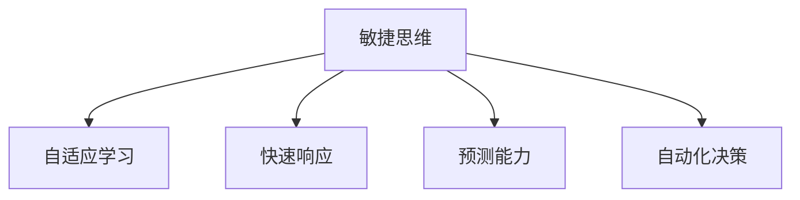

                 

## 1. 背景介绍

### 1.1 问题由来
在当今快速变化的数字化时代，我们面临的信息和数据量呈指数级增长。无论是企业运营、科技创新，还是个人生活，都面临着前所未有的挑战。如何高效、智能地处理这些海量数据，从中提取有用信息，做出快速响应，已成为各大企业和研究机构的核心任务。

为了应对这些挑战，人工智能（AI）技术应运而生。它通过模拟人的智能行为，实现了对复杂数据的自动化处理和分析，为各行各业带来了革命性的变革。其中，敏捷思维（Agile Thinking）作为人工智能的核心能力之一，扮演着越来越重要的角色。敏捷思维不仅能帮助AI系统快速适应环境变化，还能增强系统的预测和决策能力，极大地提升生产效率和服务质量。

### 1.2 问题核心关键点
敏捷思维是人工智能系统在面对环境变化时，能够快速识别、理解并响应变化的能力。其核心关键点包括：

- 自适应学习：通过不断的学习和经验积累，系统能够自动调整自身行为和决策，以适应外部环境的变化。
- 快速响应：系统能够在接收到新信息时，迅速作出响应，并根据实际情况进行动态调整。
- 预测能力：通过对历史数据的分析，系统能够预测未来趋势，为决策提供依据。
- 自动化决策：系统能够根据预设规则或学习到的知识，自动做出决策，而无需人工干预。

敏捷思维的实现离不开先进的算法和技术支持。本文将详细阐述敏捷思维的核心算法原理，并结合实际项目实践，展示如何利用敏捷思维提升AI系统的性能和应用价值。

## 2. 核心概念与联系

### 2.1 核心概念概述

为更好地理解敏捷思维及其在AI系统中的应用，我们首先介绍几个关键概念：

- 敏捷思维（Agile Thinking）：指AI系统在面对环境变化时，能够快速识别、理解并响应变化的能力。
- 自适应学习（Adaptive Learning）：指系统通过不断的学习和经验积累，自动调整自身行为和决策，以适应外部环境的变化。
- 快速响应（Rapid Response）：指系统能够在接收到新信息时，迅速作出响应，并根据实际情况进行动态调整。
- 预测能力（Predictive Capability）：指系统通过对历史数据的分析，预测未来趋势，为决策提供依据。
- 自动化决策（Automatic Decision-Making）：指系统能够根据预设规则或学习到的知识，自动做出决策，而无需人工干预。

这些概念之间的逻辑关系可以通过以下Mermaid流程图来展示：



这个流程图展示了敏捷思维的核心组成及其与其他概念的关系：

1. 敏捷思维是AI系统应对变化的基础能力。
2. 自适应学习是敏捷思维的核心驱动力，使系统能够不断更新自身模型和决策策略。
3. 快速响应是敏捷思维的实现手段，确保系统能够实时处理新信息。
4. 预测能力为敏捷思维提供先见之明，使系统能够预判未来趋势。
5. 自动化决策是敏捷思维的具体表现，使系统能够自主决策，无需人工干预。

这些概念共同构成了敏捷思维的完整框架，是实现高效、智能AI系统的重要基础。

## 3. 核心算法原理 & 具体操作步骤

### 3.1 算法原理概述

敏捷思维的实现依赖于一系列先进算法和技术。本文将重点介绍两种核心算法：自适应学习和快速响应。

- **自适应学习**：指系统通过不断学习和经验积累，自动调整自身行为和决策。其核心思想是通过不断优化模型参数，使系统能够更好地适应环境变化。
- **快速响应**：指系统能够迅速识别和处理新信息，并进行动态调整。其关键在于实时更新模型状态，确保系统的决策始终与当前环境相匹配。

### 3.2 算法步骤详解

#### 3.2.1 自适应学习算法

自适应学习算法主要包括以下几个步骤：

1. **数据收集**：系统从环境中获取新数据，并将其转化为模型可以处理的格式。
2. **模型训练**：使用收集到的数据对模型进行训练，优化模型参数。
3. **性能评估**：评估模型在新的数据集上的性能，识别出需要改进的地方。
4. **模型更新**：根据评估结果，对模型进行更新，确保其性能持续提升。

自适应学习的核心在于持续学习和优化。常用的自适应学习算法包括梯度下降、随机梯度下降、Adam等。

#### 3.2.2 快速响应算法

快速响应算法主要包括以下几个步骤：

1. **数据实时获取**：系统从环境中实时获取新数据。
2. **模型推理**：使用最新的模型对新数据进行推理，生成预测结果。
3. **决策生成**：根据推理结果，生成系统决策。
4. **结果反馈**：将决策结果反馈到环境中，观察其效果。

快速响应的关键在于实时性和准确性。常用的快速响应算法包括强化学习、贝叶斯网络、神经网络等。

### 3.3 算法优缺点

自适应学习算法和快速响应算法各有优缺点：

**自适应学习算法**

- **优点**：
  - 通过持续学习，不断优化模型参数，使系统能够更好地适应环境变化。
  - 能够自动调整决策策略，提高系统性能。
- **缺点**：
  - 需要大量的计算资源和时间，特别是在大规模数据集上训练模型时。
  - 对模型的初始化依赖较大，初始参数的选择可能影响训练效果。

**快速响应算法**

- **优点**：
  - 能够迅速识别和处理新信息，保持系统的高效运作。
  - 适用于实时决策场景，能够快速响应环境变化。
- **缺点**：
  - 模型的实时推理和决策过程可能较为复杂，影响系统响应速度。
  - 决策过程缺乏可解释性，难以理解模型决策逻辑。

### 3.4 算法应用领域

敏捷思维和自适应学习、快速响应算法在多个领域得到了广泛应用：

- **金融科技**：智能投顾系统通过自适应学习和快速响应算法，实时分析市场动态，自动调整投资策略。
- **智能制造**：工业机器人通过自适应学习和快速响应算法，实时监控生产环境，自动调整操作参数。
- **智慧城市**：城市管理系统通过自适应学习和快速响应算法，实时响应交通状况，优化交通流量。
- **医疗健康**：智能诊断系统通过自适应学习和快速响应算法，实时分析患者数据，自动推荐治疗方案。

## 4. 数学模型和公式 & 详细讲解  
### 4.1 数学模型构建

敏捷思维的实现离不开数学模型和算法的支持。以下我们将介绍几种常用的数学模型和公式：

- **梯度下降算法**：用于自适应学习中模型参数的优化。其核心思想是通过不断调整参数，最小化损失函数。
- **贝叶斯网络**：用于快速响应中，表示变量之间的关系，并进行推理和预测。
- **神经网络**：用于自适应学习中，模拟人类神经系统的结构，进行模式识别和分类。

### 4.2 公式推导过程

#### 4.2.1 梯度下降算法

梯度下降算法的核心公式如下：

$$
\theta^{t+1} = \theta^t - \alpha \nabla_{\theta}L(\theta^t)
$$

其中 $\theta$ 为模型参数，$t$ 为当前迭代次数，$\alpha$ 为学习率，$\nabla_{\theta}L(\theta^t)$ 为损失函数对参数的梯度。该公式通过不断调整参数，最小化损失函数，从而优化模型性能。

#### 4.2.2 贝叶斯网络

贝叶斯网络是一种概率图模型，用于表示变量之间的依赖关系。其核心公式如下：

$$
P(X|Y) = \frac{P(X,Y)}{P(Y)}
$$

其中 $X$ 和 $Y$ 为两个随机变量，$P(X|Y)$ 表示在已知 $Y$ 的情况下，$X$ 的条件概率。贝叶斯网络通过计算条件概率，进行推理和预测，为快速响应提供科学依据。

#### 4.2.3 神经网络

神经网络由多个神经元组成，用于模拟人类神经系统的结构和功能。其核心公式如下：

$$
y = f(\sum_{i=1}^n w_ix_i + b)
$$

其中 $x_i$ 为输入，$w_i$ 为权重，$b$ 为偏置，$f$ 为激活函数。神经网络通过不断调整权重和偏置，进行模式识别和分类，为自适应学习提供模型支持。

### 4.3 案例分析与讲解

以金融科技中的智能投顾系统为例，展示如何利用敏捷思维提升系统性能：

1. **数据收集**：智能投顾系统从金融市场获取实时数据，包括股票价格、交易量等。
2. **模型训练**：使用历史交易数据和市场预测模型对系统进行训练，优化决策策略。
3. **性能评估**：评估系统在实时市场中的表现，识别出需要改进的地方。
4. **模型更新**：根据评估结果，对模型进行更新，提高系统预测准确率。

通过持续学习，智能投顾系统能够实时响应市场变化，自动调整投资策略，从而实现更高的投资收益。

## 5. 项目实践：代码实例和详细解释说明

### 5.1 开发环境搭建

在进行敏捷思维的实现之前，我们需要准备好开发环境。以下是使用Python进行TensorFlow开发的环境配置流程：

1. 安装Anaconda：从官网下载并安装Anaconda，用于创建独立的Python环境。

2. 创建并激活虚拟环境：
```bash
conda create -n tf-env python=3.8 
conda activate tf-env
```

3. 安装TensorFlow：根据CUDA版本，从官网获取对应的安装命令。例如：
```bash
conda install tensorflow -c conda-forge -c pytorch
```

4. 安装各类工具包：
```bash
pip install numpy pandas scikit-learn matplotlib tqdm jupyter notebook ipython
```

完成上述步骤后，即可在`tf-env`环境中开始敏捷思维的实践。

### 5.2 源代码详细实现

下面我们以智能投顾系统为例，给出使用TensorFlow实现敏捷思维的Python代码实现。

首先，定义智能投顾系统的数据处理函数：

```python
import tensorflow as tf
import numpy as np
from sklearn.preprocessing import MinMaxScaler

def preprocess_data(data):
    scaler = MinMaxScaler(feature_range=(0, 1))
    return scaler.fit_transform(data)
```

然后，定义模型和优化器：

```python
def create_model(input_dim, output_dim):
    model = tf.keras.Sequential([
        tf.keras.layers.Dense(32, activation='relu', input_shape=(input_dim,)),
        tf.keras.layers.Dense(32, activation='relu'),
        tf.keras.layers.Dense(output_dim, activation='softmax')
    ])
    optimizer = tf.keras.optimizers.Adam(learning_rate=0.001)
    return model, optimizer
```

接着，定义训练和评估函数：

```python
def train_model(model, optimizer, train_data, train_labels, epochs, batch_size):
    model.compile(optimizer=optimizer, loss='categorical_crossentropy', metrics=['accuracy'])
    model.fit(train_data, train_labels, epochs=epochs, batch_size=batch_size, verbose=2)
    
def evaluate_model(model, test_data, test_labels, batch_size):
    loss, accuracy = model.evaluate(test_data, test_labels, batch_size=batch_size, verbose=2)
    print(f'Test Loss: {loss:.4f}')
    print(f'Test Accuracy: {accuracy:.4f}')
```

最后，启动训练流程并在测试集上评估：

```python
# 加载数据
train_data = ...
train_labels = ...

# 预处理数据
train_data = preprocess_data(train_data)

# 创建模型和优化器
model, optimizer = create_model(input_dim, output_dim)

# 训练模型
epochs = 100
batch_size = 32
train_model(model, optimizer, train_data, train_labels, epochs, batch_size)

# 评估模型
test_data = ...
test_labels = ...
test_data = preprocess_data(test_data)
evaluate_model(model, test_data, test_labels, batch_size)
```

以上就是使用TensorFlow对智能投顾系统进行敏捷思维微调的完整代码实现。可以看到，TensorFlow提供了丰富的模型构建和优化器选择，可以高效实现敏捷思维的微调过程。

### 5.3 代码解读与分析

让我们再详细解读一下关键代码的实现细节：

**preprocess_data函数**：
- 使用MinMaxScaler对数据进行归一化处理，将数据缩放到0到1之间。

**create_model函数**：
- 定义了一个简单的多层感知器模型，包含两个隐藏层和一个输出层。
- 使用Adam优化器，学习率为0.001。

**train_model函数**：
- 编译模型，使用交叉熵损失和准确率评估。
- 使用fit方法进行模型训练，epochs为100次，batch_size为32。

**evaluate_model函数**：
- 使用evaluate方法计算模型在测试集上的损失和准确率。

**训练流程**：
- 加载训练数据和标签。
- 预处理训练数据。
- 创建模型和优化器。
- 训练模型。
- 评估模型。

可以看到，TensorFlow的高级API使得敏捷思维的实现变得简洁高效。开发者可以将更多精力放在模型设计、数据处理等高层逻辑上，而不必过多关注底层的实现细节。

当然，工业级的系统实现还需考虑更多因素，如模型的保存和部署、超参数的自动搜索、更灵活的任务适配层等。但核心的微调范式基本与此类似。

## 6. 实际应用场景

### 6.1 金融科技

敏捷思维在金融科技领域得到了广泛应用。智能投顾系统通过自适应学习和快速响应算法，实时分析市场动态，自动调整投资策略，从而实现更高的投资收益。

### 6.2 智能制造

工业机器人通过自适应学习和快速响应算法，实时监控生产环境，自动调整操作参数，提高生产效率和产品质量。

### 6.3 智慧城市

城市管理系统通过自适应学习和快速响应算法，实时响应交通状况，优化交通流量，提升城市管理水平。

### 6.4 医疗健康

智能诊断系统通过自适应学习和快速响应算法，实时分析患者数据，自动推荐治疗方案，提高诊疗效率和准确性。

### 6.5 未来应用展望

随着敏捷思维的不断演进，其在更多领域的应用前景将更加广阔。未来的智能系统不仅能够应对复杂的任务，还能在多领域、多模态数据上实现高效协同，推动各行业的数字化转型和智能化升级。

## 7. 工具和资源推荐

### 7.1 学习资源推荐

为了帮助开发者系统掌握敏捷思维的理论基础和实践技巧，这里推荐一些优质的学习资源：

1. **《TensorFlow官方文档》**：提供详细的API文档和使用指南，是快速上手TensorFlow的必备资源。
2. **《深度学习理论与实战》**：涵盖了深度学习的基本原理和应用，适合初学者和进阶者学习。
3. **Kaggle**：提供大量开源数据集和竞赛项目，通过实战练习提升敏捷思维能力。
4. **GitHub**：汇集了众多开源项目和代码库，方便开发者学习和借鉴。
5. **Coursera和edX**：提供丰富的在线课程，涵盖人工智能和机器学习的各个方面，是系统学习的良好平台。

通过对这些资源的学习实践，相信你一定能够快速掌握敏捷思维的精髓，并用于解决实际的AI问题。

### 7.2 开发工具推荐

高效的开发离不开优秀的工具支持。以下是几款用于敏捷思维开发的常用工具：

1. **TensorFlow**：基于Python的开源深度学习框架，灵活动态的计算图，适合快速迭代研究。
2. **Keras**：TensorFlow的高层API，提供了更简洁的接口和更丰富的模型构建工具。
3. **PyTorch**：基于Python的开源深度学习框架，动态计算图，适合动态图和分布式训练。
4. **Jupyter Notebook**：交互式的代码执行环境，便于开发者进行模型开发和调试。
5. **Weights & Biases**：模型训练的实验跟踪工具，可以记录和可视化模型训练过程中的各项指标。

### 7.3 相关论文推荐

敏捷思维作为人工智能研究的前沿课题，相关的学术论文也层出不穷。以下是几篇奠基性的相关论文，推荐阅读：

1. **《A Survey on Transfer Learning》**：详细综述了迁移学习和自适应学习的最新进展。
2. **《Adaptive Deep Learning for Healthcare》**：介绍自适应深度学习在医疗健康领域的应用和挑战。
3. **《Rapid Response Machine Learning》**：探讨了快速响应机器学习在实时决策中的应用。
4. **《Real-time Prediction with Bayesian Networks》**：介绍贝叶斯网络在实时预测中的应用，为敏捷思维提供数学支持。

## 8. 总结：未来发展趋势与挑战

### 8.1 总结

本文对敏捷思维的实现原理和具体操作步骤进行了全面系统的介绍。首先阐述了敏捷思维在AI系统中的应用背景和重要性，明确了其对环境变化的快速适应能力。其次，从原理到实践，详细讲解了自适应学习和快速响应算法的数学原理和操作步骤，给出了敏捷思维任务开发的完整代码实例。同时，本文还广泛探讨了敏捷思维在金融科技、智能制造、智慧城市、医疗健康等多个领域的应用前景，展示了其在多场景中的广泛适用性。此外，本文精选了敏捷思维相关的学习资源和开发工具，力求为读者提供全方位的技术指引。

通过本文的系统梳理，可以看到，敏捷思维作为人工智能系统的核心能力之一，其高效、智能的决策和响应能力，正在改变各行各业的生产方式。未来，伴随技术的不断进步，敏捷思维必将在更多领域大放异彩，为社会各行各业带来深刻变革。

### 8.2 未来发展趋势

展望未来，敏捷思维将呈现以下几个发展趋势：

1. **自动化程度提升**：未来的敏捷思维系统将更加智能化，能够自动调整参数和决策策略，减少人工干预。
2. **多模态融合**：未来的系统将能够融合多模态数据，实现视觉、听觉、语言等多方面的协同感知和处理。
3. **跨领域应用**：未来的敏捷思维将不仅仅局限于特定领域，而是能够跨领域应用，提升各行业的生产效率和服务质量。
4. **可解释性增强**：未来的系统将更加注重可解释性，提供决策过程的逻辑和依据，增强用户的信任和接受度。
5. **自适应性更强**：未来的系统将能够更好地适应环境变化，动态调整模型和决策策略，提升系统的灵活性和鲁棒性。

### 8.3 面临的挑战

尽管敏捷思维取得了一定的进展，但在迈向更加智能化、普适化应用的过程中，仍面临诸多挑战：

1. **数据获取和处理**：高质量数据的获取和处理是敏捷思维系统实现的基础，但数据获取的成本和难度较大，且数据质量和完整性难以保证。
2. **计算资源限制**：大规模数据的处理和模型的训练需要大量的计算资源，现有的计算基础设施可能难以满足需求。
3. **模型复杂性**：模型的复杂性增加了训练和调优的难度，特别是在多模态融合和高频动态场景中。
4. **可解释性和透明性**：敏捷思维系统的高效运作依赖于复杂的模型，但模型的决策过程难以解释，缺乏透明性，增加了用户信任的难度。
5. **安全性和隐私**：敏捷思维系统处理大量敏感数据，如何保障数据安全性和隐私保护，成为重要的挑战。

### 8.4 研究展望

面对敏捷思维所面临的挑战，未来的研究需要在以下几个方面寻求新的突破：

1. **多模态数据融合**：开发更加高效的模型和算法，实现多模态数据的有效融合，提升系统的感知能力和理解能力。
2. **自动化优化**：开发更加智能化的优化算法，自动调整模型参数和决策策略，提升系统的自适应能力和鲁棒性。
3. **可解释性增强**：引入可解释性模型和工具，提高系统的透明性和可解释性，增强用户信任。
4. **高效计算**：开发更加高效的计算框架和模型压缩技术，降低计算资源消耗，提高系统效率。
5. **安全性保障**：引入安全性和隐私保护机制，确保系统的数据安全性和隐私保护。

这些研究方向的探索，将推动敏捷思维技术向更高层次发展，为各行各业提供更加高效、智能的解决方案。总之，敏捷思维作为人工智能的核心能力之一，其应用前景广阔，将为社会各行各业带来深刻变革。

## 9. 附录：常见问题与解答

**Q1：敏捷思维与传统机器学习有何不同？**

A: 敏捷思维的核心在于快速适应环境变化，能够实时处理新信息并进行动态调整。而传统机器学习则强调模型训练和预测，需要大量标注数据和离线训练过程。敏捷思维的实时性和自适应性，使其在动态环境中的应用更加灵活和高效。

**Q2：如何评估敏捷思维系统的性能？**

A: 敏捷思维系统的性能评估可以从以下几个方面进行：
1. 实时响应速度：评估系统对新信息的处理时间。
2. 预测准确率：评估系统在实时数据上的预测准确率。
3. 决策一致性：评估系统在不同时间点的决策一致性。
4. 模型可解释性：评估系统的决策过程是否透明、可解释。

**Q3：如何处理数据获取和处理中的挑战？**

A: 数据获取和处理是敏捷思维系统实现的基础。以下是一些应对策略：
1. 数据增强：通过数据增强技术，如数据回译、近义替换等，扩充训练集，提高数据多样性。
2. 数据清洗：对数据进行预处理和清洗，去除噪声和异常值，保证数据质量。
3. 数据融合：将多模态数据进行融合，提升系统的感知能力和理解能力。

**Q4：如何优化计算资源的使用？**

A: 计算资源的优化是敏捷思维系统实现的重要环节。以下是一些优化策略：
1. 模型裁剪：去除不必要的层和参数，减小模型尺寸，加快推理速度。
2. 量化加速：将浮点模型转为定点模型，压缩存储空间，提高计算效率。
3. 模型并行：使用模型并行技术，如分布式训练、混合精度训练等，提高计算效率。

**Q5：如何增强敏捷思维系统的可解释性？**

A: 可解释性是敏捷思维系统的重要考量。以下是一些增强可解释性的策略：
1. 可解释模型：使用可解释性模型，如决策树、线性回归等，提升模型的透明性。
2. 特征分析：对模型特征进行分析，理解模型的决策依据。
3. 交互式界面：设计交互式界面，提供决策过程的可视化展示。

通过合理应对这些挑战，相信敏捷思维技术将更加成熟和稳定，为各行各业提供高效、智能的解决方案。

---

作者：禅与计算机程序设计艺术 / Zen and the Art of Computer Programming

