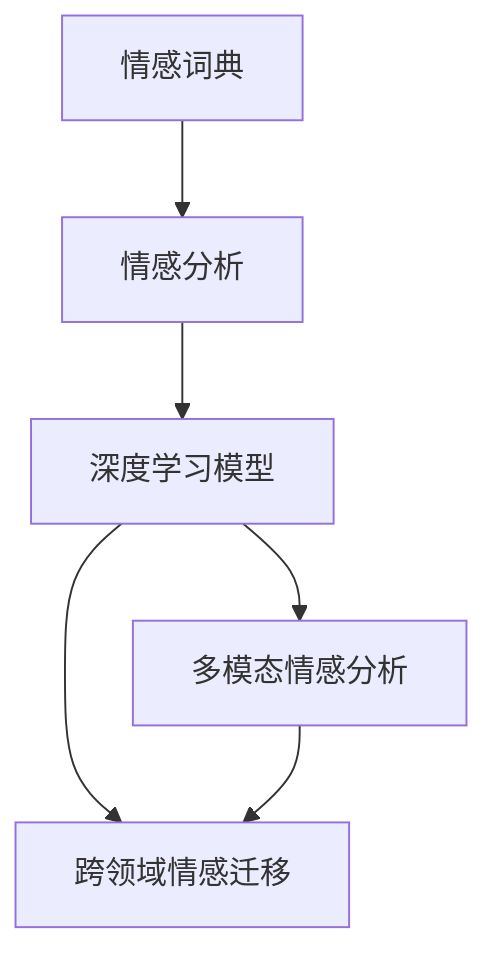

                 

# 情感AI：机器与人类情感的交互

## 1. 背景介绍

### 1.1 问题由来
情感分析(Sentiment Analysis)是自然语言处理(NLP)领域的一项关键技术，旨在从文本中提取和分析情感信息。它广泛应用于社交媒体监控、市场情感预测、产品评价分析等多个领域，对企业决策、消费者行为预测等有着重要影响。传统的情感分析方法基于规则和词典，难以覆盖文本中的丰富情感表达和复杂语境。而基于深度学习的情感AI技术，通过从大规模无标签数据中进行预训练，能够有效捕捉语言中的隐含情感，适应各种自然语言表达形式。

### 1.2 问题核心关键点
情感AI的核心在于如何从文本中精准识别和提取情感信息。这需要解决以下几个关键问题：
- 构建高质量的情感词典：情感词典的构建直接影响情感分析的效果，需要涵盖丰富的情感标签，并不断更新以应对新的情感表达。
- 深度学习模型选择：不同的深度学习模型如卷积神经网络、递归神经网络、Transformer等，对情感分析的效果影响显著。
- 情感表达的理解：情感分析不仅需要识别正面或负面情感，还需要理解情感强度和情感变化趋势。
- 多模态情感融合：情感不仅通过文字表达，还通过语音、表情、行为等多种形式呈现，如何在多种模态下进行情感识别和分析，是一个重要的研究方向。
- 跨领域情感迁移：情感AI模型在不同领域的应用能力，如医疗、教育、金融等，需要借助领域迁移或微调技术提升。

### 1.3 问题研究意义
情感AI技术的研究和应用，对提升社会服务的智能化水平、优化企业决策、增强消费者体验等方面具有重要意义。

1. **社会服务智能化**：情感AI能够实时监控社交媒体、论坛、客户评论等，通过情感分析快速识别舆情动态，提升政府和企业的社会服务效率。
2. **企业决策优化**：企业可以通过情感分析获取市场反馈，预测消费者需求和情感趋势，从而优化产品和服务，提升竞争力。
3. **消费者体验增强**：在电商、娱乐、旅游等行业，情感AI能够个性化推荐商品和服务，提升用户体验。
4. **心理健康支持**：情感AI可以分析患者的情感状态，辅助心理健康诊断和治疗，提供心理支持。

## 2. 核心概念与联系

### 2.1 核心概念概述

为更好地理解情感AI技术，本节将介绍几个核心概念：

- **情感分析(Sentiment Analysis)**：从文本中识别和提取情感信息，并将其分为正面、负面或中性等类别。
- **情感词典(Sentiment Lexicon)**：包含情感标签和其情感极性（正面或负面）的数据集，用于情感分析任务的特征提取。
- **深度学习模型(Deep Learning Models)**：如卷积神经网络(CNN)、递归神经网络(RNN)、Transformer等，通过从数据中学习特征，实现情感分类和情感强度预测。
- **多模态情感分析(Multimodal Sentiment Analysis)**：结合文本、语音、图像等多种数据源，综合分析情感信息，提升情感识别的准确性和全面性。
- **跨领域情感迁移(Cross-domain Sentiment Transfer)**：通过迁移学习或微调技术，使情感AI模型在不同领域间进行知识迁移和应用。

这些核心概念之间的逻辑关系可以通过以下Mermaid流程图来展示：



这个流程图展示了一系列情感AI的核心概念及其之间的逻辑联系：

1. 情感词典为情感分析提供数据基础。
2. 情感分析使用深度学习模型进行情感分类。
3. 多模态情感分析融合多种数据源进行情感识别。
4. 跨领域情感迁移使模型在不同领域中应用，提升模型泛化能力。

这些概念共同构成了情感AI的技术框架，使其能够在各种应用场景中发挥强大的情感识别和分析能力。

## 3. 核心算法原理 & 具体操作步骤
### 3.1 算法原理概述

情感AI的核心算法原理是通过深度学习模型，从文本中自动学习情感特征，并进行情感分类或情感强度预测。其中，预训练模型和微调技术是关键。

- **预训练模型**：如BERT、GPT等，在大规模无标签文本数据上进行预训练，学习通用的语言表示和情感语义。
- **微调**：在预训练模型基础上，通过少量有标签数据进行微调，使模型适应特定任务，提升情感分析精度。

### 3.2 算法步骤详解

情感AI的算法步骤主要包括以下几个环节：

**Step 1: 数据准备**
- 收集情感标注数据集，如IMDb电影评论、Twitter情感数据等，并进行数据预处理，如分词、停用词过滤、词形还原等。

**Step 2: 模型选择与预训练**
- 选择适合的深度学习模型，如BERT、GPT等，在预训练语料上进行预训练，学习语言和情感的表示。

**Step 3: 微调情感分类器**
- 设计合适的输出层和损失函数，如多类别交叉熵损失，使用有标签数据集对模型进行微调，优化情感分类器的性能。

**Step 4: 情感强度预测**
- 设计任务适配层，如回归器，对情感强度进行预测。微调模型以标注数据为监督信号，优化情感强度预测的能力。

**Step 5: 模型评估与测试**
- 在验证集和测试集上评估模型性能，如准确率、召回率、F1值等，并使用混淆矩阵、ROC曲线等可视化工具分析模型效果。

### 3.3 算法优缺点

情感AI具有以下优点：
1. **高准确性**：深度学习模型能够自动捕捉文本中的情感表达，并在大规模数据上实现高准确性情感分类。
2. **泛化能力**：预训练模型和微调技术使得情感AI模型具备较强的泛化能力，能够适应不同领域和语境的情感分析任务。
3. **自适应学习**：情感词典和任务适配层的引入，使得情感AI模型能够自适应不同的情感标签和任务需求。
4. **多模态融合**：结合多种模态数据，如语音、图像、行为等，能够更全面地理解情感信息。

同时，情感AI也存在以下局限：
1. **依赖标注数据**：情感AI的效果很大程度上依赖标注数据的质量和数量，获取高质量标注数据的成本较高。
2. **数据偏差**：预训练语料和标注数据可能存在偏差，影响情感AI模型的公平性和普适性。
3. **解释性不足**：深度学习模型的决策过程难以解释，难以理解情感分析的内部逻辑。
4. **跨领域迁移能力有限**：情感AI模型在不同领域之间的迁移能力有限，需要针对性的迁移学习或微调。
5. **复杂度较高**：情感AI模型的构建和训练较为复杂，需要较强的计算资源和技术积累。

### 3.4 算法应用领域

情感AI技术已经在多个领域得到了广泛应用，例如：

- **社交媒体监控**：实时分析社交媒体上的情感动态，及时预警负面舆情，支持公共安全和社会治理。
- **市场情感预测**：通过情感分析预测股票市场情绪，辅助投资决策。
- **产品评价分析**：分析消费者对产品的评价情感，指导产品设计和营销策略。
- **消费者行为预测**：通过情感分析预测消费者需求，提升个性化推荐系统的精准度。
- **心理健康监测**：分析患者的情感状态，辅助心理健康诊断和治疗。

除了上述这些经典应用外，情感AI还被创新性地应用到更多场景中，如医疗情感分析、司法审判情感识别、智能客服情感评估等，为情感智能技术的落地提供了新的可能性。

## 4. 数学模型和公式 & 详细讲解  
### 4.1 数学模型构建

本节将使用数学语言对情感AI的核心算法进行严格的刻画。

假设情感分类问题为二分类任务，训练集为 $D=\{(x_i,y_i)\}_{i=1}^N$，其中 $x_i$ 为输入文本， $y_i \in \{0, 1\}$ 为情感标签。定义模型 $M_{\theta}$ 在输入 $x$ 上的输出为 $\hat{y}=M_{\theta}(x) \in [0,1]$，表示样本属于正类的概率。情感分类问题的损失函数为二元交叉熵损失：

$$
\ell(M_{\theta}(x),y) = -[y\log M_{\theta}(x) + (1-y)\log(1-M_{\theta}(x))]
$$

在训练集 $D$ 上的经验风险为：

$$
\mathcal{L}(\theta) = \frac{1}{N}\sum_{i=1}^N \ell(M_{\theta}(x_i),y_i)
$$

微调的目标是最小化经验风险，即找到最优参数：

$$
\theta^* = \mathop{\arg\min}_{\theta} \mathcal{L}(\theta)
$$

### 4.2 公式推导过程

以二分类任务为例，推导二元交叉熵损失函数的梯度。

模型 $M_{\theta}$ 在输入 $x$ 上的输出为 $\hat{y}=M_{\theta}(x) \in [0,1]$，真实标签 $y \in \{0,1\}$。二元交叉熵损失函数定义为：

$$
\ell(M_{\theta}(x),y) = -[y\log \hat{y} + (1-y)\log(1-\hat{y})]
$$

将损失函数代入经验风险公式，得：

$$
\mathcal{L}(\theta) = -\frac{1}{N}\sum_{i=1}^N [y_i\log M_{\theta}(x_i)+(1-y_i)\log(1-M_{\theta}(x_i))]
$$

根据链式法则，损失函数对参数 $\theta_k$ 的梯度为：

$$
\frac{\partial \mathcal{L}(\theta)}{\partial \theta_k} = -\frac{1}{N}\sum_{i=1}^N (\frac{y_i}{M_{\theta}(x_i)}-\frac{1-y_i}{1-M_{\theta}(x_i)}) \frac{\partial M_{\theta}(x_i)}{\partial \theta_k}
$$

其中 $\frac{\partial M_{\theta}(x_i)}{\partial \theta_k}$ 可进一步递归展开，利用自动微分技术完成计算。

在得到损失函数的梯度后，即可带入参数更新公式，完成模型的迭代优化。重复上述过程直至收敛，最终得到适应下游任务的最优模型参数 $\theta^*$。

## 5. 项目实践：代码实例和详细解释说明
### 5.1 开发环境搭建

在进行情感AI项目实践前，我们需要准备好开发环境。以下是使用Python进行PyTorch开发的环境配置流程：

1. 安装Anaconda：从官网下载并安装Anaconda，用于创建独立的Python环境。

2. 创建并激活虚拟环境：
```bash
conda create -n pytorch-env python=3.8 
conda activate pytorch-env
```

3. 安装PyTorch：根据CUDA版本，从官网获取对应的安装命令。例如：
```bash
conda install pytorch torchvision torchaudio cudatoolkit=11.1 -c pytorch -c conda-forge
```

4. 安装TensorFlow：从官网下载并安装TensorFlow，用于使用其提供的预训练模型。

5. 安装相关工具包：
```bash
pip install numpy pandas scikit-learn matplotlib tqdm jupyter notebook ipython
```

完成上述步骤后，即可在`pytorch-env`环境中开始情感AI项目的开发。

### 5.2 源代码详细实现

下面我们以IMDb影评情感分类任务为例，给出使用PyTorch进行情感分析的代码实现。

首先，定义情感分类任务的数据处理函数：

```python
from torch.utils.data import Dataset
import torch

class IMDbDataset(Dataset):
    def __init__(self, texts, labels, tokenizer):
        self.texts = texts
        self.labels = labels
        self.tokenizer = tokenizer
        
    def __len__(self):
        return len(self.texts)
    
    def __getitem__(self, item):
        text = self.texts[item]
        label = self.labels[item]
        
        encoding = self.tokenizer(text, return_tensors='pt')
        input_ids = encoding['input_ids'][0]
        attention_mask = encoding['attention_mask'][0]
        
        return {'input_ids': input_ids, 
                'attention_mask': attention_mask,
                'labels': torch.tensor(label, dtype=torch.long)}
```

然后，定义模型和优化器：

```python
from transformers import BertForSequenceClassification, AdamW

model = BertForSequenceClassification.from_pretrained('bert-base-cased', num_labels=2)

optimizer = AdamW(model.parameters(), lr=2e-5)
```

接着，定义训练和评估函数：

```python
from tqdm import tqdm
from sklearn.metrics import accuracy_score

device = torch.device('cuda') if torch.cuda.is_available() else torch.device('cpu')
model.to(device)

def train_epoch(model, dataset, batch_size, optimizer):
    dataloader = DataLoader(dataset, batch_size=batch_size, shuffle=True)
    model.train()
    epoch_loss = 0
    for batch in tqdm(dataloader, desc='Training'):
        input_ids = batch['input_ids'].to(device)
        attention_mask = batch['attention_mask'].to(device)
        labels = batch['labels'].to(device)
        model.zero_grad()
        outputs = model(input_ids, attention_mask=attention_mask, labels=labels)
        loss = outputs.loss
        epoch_loss += loss.item()
        loss.backward()
        optimizer.step()
    return epoch_loss / len(dataloader)

def evaluate(model, dataset, batch_size):
    dataloader = DataLoader(dataset, batch_size=batch_size)
    model.eval()
    preds, labels = [], []
    with torch.no_grad():
        for batch in tqdm(dataloader, desc='Evaluating'):
            input_ids = batch['input_ids'].to(device)
            attention_mask = batch['attention_mask'].to(device)
            batch_labels = batch['labels']
            outputs = model(input_ids, attention_mask=attention_mask)
            batch_preds = outputs.logits.argmax(dim=1).to('cpu').tolist()
            batch_labels = batch_labels.to('cpu').tolist()
            for pred, label in zip(batch_preds, batch_labels):
                preds.append(pred)
                labels.append(label)
                
    accuracy = accuracy_score(labels, preds)
    print(f"Accuracy: {accuracy:.4f}")
```

最后，启动训练流程并在测试集上评估：

```python
epochs = 3
batch_size = 16

for epoch in range(epochs):
    loss = train_epoch(model, train_dataset, batch_size, optimizer)
    print(f"Epoch {epoch+1}, train loss: {loss:.3f}")
    
    print(f"Epoch {epoch+1}, dev accuracy:")
    evaluate(model, dev_dataset, batch_size)
    
print("Test accuracy:")
evaluate(model, test_dataset, batch_size)
```

以上就是使用PyTorch对BERT进行IMDb影评情感分类的完整代码实现。可以看到，借助Transformers库，情感分析的代码实现变得简洁高效。

### 5.3 代码解读与分析

让我们再详细解读一下关键代码的实现细节：

**IMDbDataset类**：
- `__init__`方法：初始化文本、标签、分词器等关键组件。
- `__len__`方法：返回数据集的样本数量。
- `__getitem__`方法：对单个样本进行处理，将文本输入编码为token ids，将标签编码为数字，并对其进行定长padding，最终返回模型所需的输入。

**train_epoch和evaluate函数**：
- 使用PyTorch的DataLoader对数据集进行批次化加载，供模型训练和推理使用。
- `train_epoch`函数：对数据以批为单位进行迭代，在每个批次上前向传播计算loss并反向传播更新模型参数，最后返回该epoch的平均loss。
- `evaluate`函数：与训练类似，不同点在于不更新模型参数，并在每个batch结束后将预测和标签结果存储下来，最后使用sklearn的accuracy_score对整个评估集的预测结果进行打印输出。

**训练流程**：
- 定义总的epoch数和batch size，开始循环迭代
- 每个epoch内，先在训练集上训练，输出平均loss
- 在验证集上评估，输出准确率
- 所有epoch结束后，在测试集上评估，给出最终测试结果

可以看到，PyTorch配合Transformers库使得BERT情感分类的代码实现变得简洁高效。开发者可以将更多精力放在数据处理、模型改进等高层逻辑上，而不必过多关注底层的实现细节。

当然，工业级的系统实现还需考虑更多因素，如模型的保存和部署、超参数的自动搜索、更灵活的任务适配层等。但核心的情感分析范式基本与此类似。

## 6. 实际应用场景
### 6.1 社交媒体情感监控

社交媒体是情感分析的重要应用场景。通过分析社交媒体上的用户评论、帖子等，可以实时监控舆情动态，及时预警负面舆情，支持公共安全和社会治理。例如，政府机构可以实时监控社交媒体上的情感变化，及时应对重大事件或公共危机，确保社会稳定。

在技术实现上，可以收集社交媒体平台上的用户评论，将文本作为模型输入，使用情感分析模型识别出正面或负面的情感，并进行情感极性的分类。对于热点话题，可以通过情感分析结果进行舆情预测和预警。

### 6.2 市场情感预测

金融市场具有高风险和高收益的特点，情感分析在市场预测中具有重要应用价值。通过分析股票、商品等金融产品的市场评论、新闻报道等，可以预测市场情绪，辅助投资决策。

在技术实现上，可以收集金融市场的新闻、评论、分析报告等文本数据，并对其进行情感分析。情感分析结果可以作为市场情绪指标，辅助投资分析师进行股票预测和市场判断。例如，可以构建情感指数，实时监控市场情绪变化，预测市场趋势。

### 6.3 产品评价分析

消费者对产品的评价是企业了解市场反馈的重要途径。通过情感分析，企业可以获取消费者对产品的评价情感，指导产品设计和营销策略。

在技术实现上，可以收集电商平台上的产品评论、用户反馈等文本数据，并对其进行情感分析。情感分析结果可以用于产品评价分析，帮助企业优化产品设计和改进用户体验。例如，可以构建情感评分系统，实时监控用户对产品的评价，指导产品改进和市场推广。

### 6.4 消费者行为预测

消费者行为预测是电商、旅游、金融等行业的核心需求之一。通过情感分析，可以预测消费者的行为和需求，提升个性化推荐系统的精准度。

在技术实现上，可以收集用户的行为数据，如浏览记录、购买历史、评论等，并对其进行情感分析。情感分析结果可以用于行为预测，构建用户画像，提供个性化推荐服务。例如，可以构建情感评分系统，实时监控用户的情感状态，预测其下一步行为，提升推荐系统的精准度和用户满意度。

## 7. 工具和资源推荐
### 7.1 学习资源推荐

为了帮助开发者系统掌握情感AI的理论基础和实践技巧，这里推荐一些优质的学习资源：

1. 《情感分析与深度学习》系列博文：由情感AI领域专家撰写，深入浅出地介绍了情感分析的原理和应用。
2. 《自然语言处理实战》课程：斯坦福大学开设的NLP课程，涵盖了情感分析在内的多种NLP任务。
3. 《情感分析与自然语言处理》书籍：详细介绍了情感分析的技术实现和应用案例。
4. HuggingFace官方文档：提供了丰富的情感分析预训练模型和微调样例代码，是情感AI学习的必备资源。
5. Kaggle情感分析竞赛：通过参与情感分析竞赛，实战练兵，积累经验和提升技能。

通过对这些资源的学习实践，相信你一定能够快速掌握情感AI的精髓，并用于解决实际的情感分析问题。

### 7.2 开发工具推荐

高效的开发离不开优秀的工具支持。以下是几款用于情感AI开发的常用工具：

1. PyTorch：基于Python的开源深度学习框架，灵活动态的计算图，适合快速迭代研究。支持情感分析任务的多种深度学习模型。
2. TensorFlow：由Google主导开发的开源深度学习框架，生产部署方便，适合大规模工程应用。
3. HuggingFace Transformers：提供了多种预训练情感分析模型，支持微调和优化，是情感AI开发的利器。
4. Weights & Biases：模型训练的实验跟踪工具，可以记录和可视化模型训练过程中的各项指标，方便对比和调优。
5. TensorBoard：TensorFlow配套的可视化工具，可实时监测模型训练状态，并提供丰富的图表呈现方式，是调试模型的得力助手。

合理利用这些工具，可以显著提升情感AI开发的效率，加快创新迭代的步伐。

### 7.3 相关论文推荐

情感AI技术的发展源于学界的持续研究。以下是几篇奠基性的相关论文，推荐阅读：

1. Sentiment Analysis with Recurrent Neural Networks（基于RNN的情感分析）：提出了使用RNN进行情感分类的模型，是情感分析的早期探索。
2. Convolutional Neural Networks for Sentence Classification（基于CNN的情感分析）：展示了使用CNN进行情感分类的效果，展示了CNN在处理文本数据中的优势。
3. A Survey on Sentiment Analysis（情感分析综述）：全面综述了情感分析的研究现状和进展，介绍了多种情感分析方法和应用场景。
4. Attention Mechanism in Sentiment Analysis（情感分析中的注意力机制）：引入了注意力机制，提升了情感分析的效果和泛化能力。
5. Multi-modal Sentiment Analysis（多模态情感分析）：展示了多模态情感分析的技术和方法，结合文本、语音、图像等数据源进行情感识别。

这些论文代表了大语言模型微调技术的进展脉络。通过学习这些前沿成果，可以帮助研究者把握学科前进方向，激发更多的创新灵感。

## 8. 总结：未来发展趋势与挑战

### 8.1 总结

本文对情感AI技术进行了全面系统的介绍。首先阐述了情感AI技术的研究背景和应用价值，明确了情感AI在社交媒体监控、市场情感预测、产品评价分析等领域的核心作用。其次，从原理到实践，详细讲解了情感AI的核心算法和操作步骤，给出了情感分析任务开发的完整代码实例。同时，本文还广泛探讨了情感AI在多个行业领域的应用前景，展示了情感AI技术的广泛应用潜力。此外，本文精选了情感AI技术的各类学习资源，力求为读者提供全方位的技术指引。

通过本文的系统梳理，可以看到，情感AI技术正在成为NLP领域的重要范式，极大地拓展了情感分析的应用边界，为NLP技术的发展注入了新的活力。未来，伴随情感AI技术的发展，情感智能技术必将在更广阔的应用领域大放异彩，深刻影响人类的生产生活方式。

### 8.2 未来发展趋势

展望未来，情感AI技术将呈现以下几个发展趋势：

1. **多模态情感分析**：情感不仅通过文字表达，还通过语音、图像、行为等多种形式呈现，情感AI技术将结合多种模态数据，提升情感识别的准确性和全面性。
2. **跨领域情感迁移**：情感AI模型在不同领域之间的迁移能力有限，未来的研究将更多关注情感迁移技术，使模型在不同领域中实现知识共享。
3. **可解释性增强**：情感AI模型往往被认为是"黑盒"系统，难以解释其内部工作机制和决策逻辑。未来的研究将更多关注模型的可解释性，帮助用户理解情感分析的内部机制。
4. **鲁棒性提升**：当前情感AI模型面对噪声数据和复杂语境时，鲁棒性不足。未来的研究将更多关注模型的鲁棒性，提升模型对噪声数据的抗干扰能力。
5. **个性化推荐**：情感AI技术与推荐系统结合，能够更好地理解用户情感和需求，提供更加个性化的推荐服务。

这些趋势凸显了情感AI技术的广阔前景。这些方向的探索发展，必将进一步提升情感AI系统的性能和应用范围，为人类情感智能的进化带来深远影响。

### 8.3 面临的挑战

尽管情感AI技术已经取得了瞩目成就，但在迈向更加智能化、普适化应用的过程中，它仍面临着诸多挑战：

1. **标注数据获取难度**：情感AI的效果很大程度上依赖标注数据的质量和数量，获取高质量标注数据的成本较高。如何进一步降低情感分析对标注数据的依赖，将是一大难题。
2. **跨领域泛化能力**：情感AI模型在不同领域之间的迁移能力有限，需要更多的迁移学习或微调技术提升模型的跨领域泛化能力。
3. **多模态数据融合**：情感AI技术需要融合多种模态数据进行情感识别，如何高效地整合多模态数据，提升情感识别的准确性，将是重要的研究课题。
4. **计算资源需求高**：情感AI模型的构建和训练较为复杂，需要较强的计算资源和技术积累。如何在保证模型性能的同时，降低计算资源消耗，将是未来的研究方向。
5. **模型鲁棒性不足**：情感AI模型面对噪声数据和复杂语境时，鲁棒性不足。如何提升模型的鲁棒性，避免误判，将是重要的研究方向。

### 8.4 研究展望

面对情感AI技术面临的挑战，未来的研究需要在以下几个方面寻求新的突破：

1. **无监督和半监督学习**：摆脱对大规模标注数据的依赖，利用无监督和半监督学习范式，最大限度利用非结构化数据，实现更加灵活高效的情感分析。
2. **多模态情感融合**：结合多种模态数据进行情感识别，提升情感分析的全面性和准确性。
3. **知识图谱融合**：将知识图谱与情感AI技术结合，提升情感分析的上下文理解和知识迁移能力。
4. **可解释性增强**：引入可解释性技术，提升情感AI模型的可解释性，帮助用户理解模型的决策过程。
5. **鲁棒性增强**：引入鲁棒性技术，提升情感AI模型对噪声数据的抗干扰能力。

这些研究方向将引领情感AI技术的发展，为构建更加智能、普适、可信的情感智能系统铺平道路。面向未来，情感AI技术还需要与其他人工智能技术进行更深入的融合，如知识表示、因果推理、强化学习等，多路径协同发力，共同推动情感智能技术的发展。只有勇于创新、敢于突破，才能不断拓展情感AI技术的边界，让情感智能技术更好地造福人类社会。

## 9. 附录：常见问题与解答

**Q1：情感AI的预训练模型有哪些？**

A: 常用的情感预训练模型包括BERT、GPT、XLNet、RoBERTa等。这些模型都是在大规模无标签文本数据上进行预训练，能够学习到丰富的情感表达和语言表示。

**Q2：如何选择合适的情感词典？**

A: 选择情感词典时，需要考虑词典的情感标签丰富度、标签粒度、情感极性明确度等因素。常用的情感词典包括NRC Emotion Lexicon、SentiWordNet、VADER等。

**Q3：情感AI模型的训练过程需要注意哪些事项？**

A: 情感AI模型的训练过程需要注意以下几个事项：
1. 选择合适的优化器和学习率。通常使用AdamW优化器，学习率需要根据数据规模和模型复杂度进行调参。
2. 使用合适的损失函数。对于情感分类任务，通常使用交叉熵损失。
3. 正则化技术的使用。使用L2正则、Dropout等技术防止过拟合。
4. 数据增强技术。使用文本清洗、回译、近义词替换等技术扩充数据集。
5. 模型评估指标的选择。使用准确率、召回率、F1值等指标评估模型性能。

**Q4：情感AI技术在不同领域的应用有哪些？**

A: 情感AI技术在不同领域的应用包括：
1. 社交媒体情感监控：实时监控社交媒体上的情感变化，预警负面舆情。
2. 市场情感预测：通过情感分析预测金融市场情绪，辅助投资决策。
3. 产品评价分析：分析消费者对产品的评价情感，指导产品设计和营销策略。
4. 消费者行为预测：预测消费者的行为和需求，提升个性化推荐系统的精准度。
5. 医疗情感分析：分析患者的情感状态，辅助心理健康诊断和治疗。

**Q5：情感AI模型在不同领域之间的迁移能力如何提升？**

A: 情感AI模型在不同领域之间的迁移能力可以通过迁移学习或微调技术提升。具体来说，可以使用预训练模型在大规模数据上进行预训练，然后微调模型适应特定领域的任务。例如，在大规模中文数据上预训练的BERT模型，可以微调成中文情感分析模型，用于特定领域的情感分析任务。

---

作者：禅与计算机程序设计艺术 / Zen and the Art of Computer Programming

