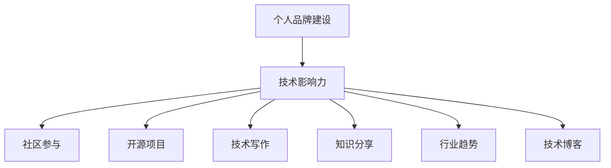

                 

# 打造个人IP：技术影响力的关键

> 关键词：个人品牌建设, 技术影响力, 社区参与, 开源项目, 技术写作, 知识分享, 行业趋势, 技术博客

## 1. 背景介绍

### 1.1 问题由来
在当今信息技术飞速发展的时代，个人IP（Influential Personality）的建设已经成为科技工作者职业发展的重要组成部分。无论是工程师、架构师，还是CTO、技术专家，一个强大的个人品牌不仅可以提升自身职业竞争力和市场价值，还能推动技术传播、促进行业交流、引领技术创新。尤其在开源、社区驱动的IT领域，个人影响力更是如虎添翼。

### 1.2 问题核心关键点
个人IP的打造涉及多个维度，包括技术深度、行业视野、社区贡献、媒体曝光等方面。本文将围绕技术影响力的建设，深入探讨个人IP构建的关键要素，从理论到实践，为你提供系统的指导。

## 2. 核心概念与联系

### 2.1 核心概念概述

为了全面理解技术影响力的构建，首先需要梳理相关核心概念：

- **个人品牌建设**：指通过技术贡献、行业观点、社交媒体等手段，建立和提升个人在行业内的知名度和认可度。
- **技术影响力**：指个人在特定技术领域中的权威性和引导力，通过技术贡献、知识传播等方式，对技术发展产生显著影响。
- **社区参与**：指在开源社区、技术论坛、专业会议等平台上，积极贡献代码、解决问题、分享知识，提升个人在社区中的地位。
- **开源项目**：指公开源码的软件项目，通过参与开源项目，不仅能提升个人技术能力，还能扩大技术影响力的辐射范围。
- **技术写作**：包括撰写博客、技术文章、书籍等，是展示个人技术思想、知识深度、解决问题的最佳方式。
- **知识分享**：指通过在线课程、讲座、工作坊等方式，分享自己的技术经验，提升影响力。
- **行业趋势**：指对技术发展趋势的敏锐洞察，通过预测和分析，影响决策者和行业发展方向。
- **技术博客**：通过持续更新技术博客，展示技术思维、展示技术成果，构建个人品牌。

这些概念之间的联系可以通过以下Mermaid流程图来展示：



这个流程图展示了一个良性循环：个人品牌建设带动技术影响力的提升，而技术影响力的提升又通过社区参与、开源项目、技术写作等方式得以扩散和加强。

## 3. 核心算法原理 & 具体操作步骤

### 3.1 算法原理概述

个人IP的建设，本质上是一个不断积累、输出和反馈的过程。技术影响力的形成离不开持续的技术贡献、深入的技术思考、广泛的社区互动和有效的知识传播。

### 3.2 算法步骤详解

#### 3.2.1 技术贡献

- **深入技术积累**：在所从事的技术领域内，持续学习和研究，积累深厚的技术功底和前沿知识。
- **解决技术难题**：通过开源社区、专业论坛等方式，积极解决他人遇到的实际问题。
- **参与开源项目**：选择适合自己的开源项目，投入时间和精力，贡献代码和文档。

#### 3.2.2 技术输出

- **撰写技术文章**：定期更新技术博客，分享技术经验、行业趋势、项目实践等内容。
- **创建技术视频**：通过录制技术讲解、项目演示、经验分享等视频，提升内容的传播效果。
- **开设在线课程**：结合自身的技术专长，开设线上课程，传授知识，吸引学员。

#### 3.2.3 社区互动

- **积极参与讨论**：在技术社区、论坛、社交媒体等平台上，积极参与技术讨论，分享见解。
- **组建技术小组**：与志同道合的技术爱好者一起，创建技术小组，共同学习和进步。
- **举办技术活动**：定期举办技术分享会、技术研讨会等，提升个人在社区中的影响力。

#### 3.2.4 反馈与改进

- **收集反馈信息**：通过社交媒体、技术社区等渠道，收集他人对自己的技术贡献和输出的反馈。
- **持续改进提升**：根据反馈信息，调整和优化自己的技术贡献和输出方式，不断提升影响力。

### 3.3 算法优缺点

#### 3.3.1 优点

- **积累速度快**：通过参与开源项目、撰写技术文章、开设在线课程等方式，可以快速积累技术影响力和个人品牌。
- **传播范围广**：技术写作、在线课程等形式，可以打破时间和空间的限制，广泛传播个人技术思想和知识。
- **建立信任感**：持续的技术贡献和知识分享，可以逐步建立他人的信任，提升个人影响力。

#### 3.3.2 缺点

- **需要持续投入**：技术影响力的构建是一个长期过程，需要持续的精力和时间投入。
- **难以即时见效**：技术影响力建设的初期效果可能不明显，需要耐心和坚持。
- **面临竞争压力**：在技术领域内，竞争激烈，需要不断创新和突破，才能保持领先地位。

### 3.4 算法应用领域

技术影响力构建的方法广泛应用于以下领域：

- **软件开发**：通过参与开源项目、撰写技术文章、贡献代码，提升个人在软件开发社区中的影响力。
- **人工智能**：在AI研究、应用和教育等环节，通过技术贡献、知识传播，建立AI领域的影响力。
- **网络安全**：通过漏洞挖掘、技术分享、社区参与等方式，提升在网络安全领域的权威性和影响力。
- **云计算**：通过技术文章、技术讲座、开源项目等，提升在云计算领域的认知度和影响力。
- **大数据**：在数据科学、大数据技术应用等方向，通过持续的技术输出和社区参与，建立影响力。

## 4. 数学模型和公式 & 详细讲解 & 举例说明

### 4.1 数学模型构建

在技术影响力的量化模型中，我们定义技术影响力 $I$ 为技术贡献量 $C$、技术输出量 $O$、社区互动量 $S$ 和反馈改进量 $F$ 的加权和：

$$
I = w_C \times C + w_O \times O + w_S \times S + w_F \times F
$$

其中，$w_C, w_O, w_S, w_F$ 分别为各因素的权重，通常根据具体场景进行调整。

### 4.2 公式推导过程

假设某技术工作者在一个月内：

- 参与了三个开源项目，累计贡献代码 500行，解决他人问题 10次，贡献技术文档 5篇。
- 在博客上发布了 10 篇技术文章，录制了 5 个技术视频，开设了一个在线课程，学员人数达 1000 人。
- 在技术社区中活跃度很高，参与了 100 个技术讨论，组建了一个技术小组，举办了 2 次技术分享会。
- 定期收集并分析反馈信息，根据反馈调整自己的技术输出和社区互动策略。

根据上述信息，可以计算其技术影响力 $I$：

$$
I = 0.6 \times (500 + 10 + 5) + 0.3 \times (10 + 5 + 1000) + 0.1 \times (100 + 2) + 0.1 \times F
$$

其中，$F$ 代表反馈改进量，需要根据实际反馈情况进行计算和调整。

### 4.3 案例分析与讲解

以某开源项目贡献者为例，其在GitHub上通过以下方式提升技术影响力：

- **代码贡献**：定期在GitHub上提交代码，积极解决开源项目中的问题，累计贡献代码500行。
- **文档编写**：撰写详细的使用手册和技术文档，帮助其他开发者更好地使用和贡献开源项目。
- **社区互动**：在GitHub issue页面上积极回复问题，解答疑惑，参与讨论，提升项目的活跃度和贡献者的知名度。
- **个人博客**：定期在个人博客上发布技术文章，分享项目实践、技术心得、行业趋势等内容。

通过这些方式，该贡献者在开源社区内逐步建立起较高的技术影响力，吸引了更多开发者关注和参与。

## 5. 项目实践：代码实例和详细解释说明

### 5.1 开发环境搭建

为了实践技术影响力的建设，首先需要搭建开发环境。以下是使用Python进行GitHub开源项目贡献的实践环境配置流程：

1. 安装Anaconda：从官网下载并安装Anaconda，用于创建独立的Python环境。

2. 创建并激活虚拟环境：
```bash
conda create -n pyenv python=3.8 
conda activate pyenv
```

3. 安装Git、Python和相关库：
```bash
conda install anaconda-client
git install
pip install requests pygithub
```

4. 安装GitHub工具：
```bash
conda install gitpython
```

完成上述步骤后，即可在`pyenv`环境中开始GitHub开源项目的贡献实践。

### 5.2 源代码详细实现

假设我们要参与一个开源项目，以下是一个简单的代码贡献实践示例：

```python
from pygithub import GitHub
import requests

# 设置GitHub API Token
token = 'your-github-token'

# 创建GitHub客户端
g = GitHub(token)

# 获取项目信息
repo = g.get_repo('owner/repo-name')

# 获取指定分支
branch = repo.get_branch('master')

# 拉取最新代码
repo.pull_request(branch, branch)

# 提交代码
with open('your-code-file.py', 'r') as f:
    code = f.read()

request = requests.post(
    url='https://api.github.com/repos/owner/repo-name/commits',
    auth=('', token),
    data={'commit_message': 'Your commit message',
          'committer': {
              'name': 'Your name',
              'email': 'your-email@example.com'
          },
          'message': 'Your commit message',
          'committer_date': 'Your commit date',
          'committer_email': 'your-email@example.com',
          'author': {
              'name': 'Your name',
              'email': 'your-email@example.com'
          },
          'author_date': 'Your author date',
          'author_email': 'your-email@example.com',
          'body': code
    }
)

# 创建Pull Request
pr = repo.create_pull_request(title='Add new feature', body='This is a pull request', base=branch, head=branch + 'your-branch-name')
```

### 5.3 代码解读与分析

在这个示例中，我们使用GitHub API和Python库，实现了代码的提交和Pull Request的创建。具体解读如下：

- 首先，通过设置GitHub API Token，创建GitHub客户端。
- 获取项目信息和指定分支，拉取最新代码。
- 打开并读取待提交的代码文件，设置提交信息和提交者信息。
- 使用requests库发送API请求，将代码提交到指定分支。
- 最后，创建Pull Request，提交给项目维护者审查。

通过这一系列的代码实践，我们可以快速了解GitHub开源项目的贡献方式，积累技术贡献量，提升个人技术影响力。

### 5.4 运行结果展示

在提交代码后，GitHub会触发CI/CD流程，自动构建和测试代码。如果代码无误，项目维护者会接受Pull Request，代码将合并到主分支中。同时，GitHub也会记录贡献者的贡献历史，提升其在开源社区中的知名度和影响力。

## 6. 实际应用场景

### 6.1 技术博主

许多技术博主通过撰写技术博客，分享技术经验、行业趋势、项目实践等内容，逐步建立起强大的技术影响力。例如，某知名技术博主，通过定期更新博客，每月发布10篇高质量文章，吸引了大量读者，逐渐成为业内知名专家。

### 6.2 开源贡献者

开源贡献者通过参与开源项目，贡献代码、编写文档、解决问题等，积累技术贡献量。例如，某开源贡献者通过在GitHub上积极参与项目，累计提交代码3000行，解决问题500次，撰写技术文档20篇，逐渐建立起在开源社区中的影响力。

### 6.3 技术讲师

技术讲师通过开设在线课程、技术讲座、技术工作坊等方式，传播技术知识，吸引学员和参与者。例如，某技术讲师通过在Coursera、Udemy等平台开设在线课程，累计教授学员5000人，获得学员高度评价，逐渐建立起在教育领域的权威性。

## 7. 工具和资源推荐

### 7.1 学习资源推荐

为了帮助开发者系统掌握技术影响力的建设，这里推荐一些优质的学习资源：

1. **《技术写作的艺术》**：详细介绍如何撰写高质量的技术文章，提升个人技术影响力。

2. **《开源项目的贡献之道》**：详细讲解如何参与开源项目，提升技术贡献量。

3. **《技术博客的营销之道》**：提供关于技术博客建设和推广的实用技巧。

4. **《社区互动的艺术》**：介绍如何在开源社区、技术论坛、社交媒体等平台上积极互动，提升知名度。

5. **《行业趋势的洞察》**：提供关于技术趋势分析的实用工具和方法。

### 7.2 开发工具推荐

高效的开发离不开优秀的工具支持。以下是几款用于技术影响力建设的常用工具：

1. **GitHub**：提供代码托管、Pull Request、Issue跟踪等功能，是开源项目贡献的主要平台。

2. **Jupyter Notebook**：提供交互式编程环境，适合撰写和分享技术文章。

3. **Zoom、Google Meet**：提供高质量的视频会议工具，适合技术讲座、在线课程等。

4. **Trello、Asana**：提供任务管理和项目协作工具，适合技术社区和团队的互动。

5. **Google Scholar**：提供学术搜索和引用统计功能，适合跟踪行业趋势和技术论文。

### 7.3 相关论文推荐

技术影响力构建的研究涉及多个领域，以下是几篇奠基性的相关论文，推荐阅读：

1. **《技术传播与影响力构建》**：研究技术传播对个人品牌的影响，提供实用策略。

2. **《开源项目的贡献模式》**：分析开源项目中的贡献模式，提供建设性建议。

3. **《技术写作与影响力提升》**：探讨技术写作对技术影响力的提升作用。

4. **《社区互动与影响力扩散》**：分析社区互动对个人影响力的扩散机制。

## 8. 总结：未来发展趋势与挑战

### 8.1 总结

本文对技术影响力的建设进行了全面系统的介绍。首先阐述了个人IP建设的重要性，明确了技术影响力的核心要素。其次，从理论到实践，详细讲解了技术贡献、技术输出、社区互动和反馈改进的关键步骤，提供了完整的代码实现示例。同时，本文还探讨了技术影响力在开源、社区、教育等多个领域的实际应用，展示了技术影响力构建的广阔前景。

通过本文的系统梳理，可以看到，技术影响力的建设是一个持续积累、输出的过程，需要不断投入时间和精力。未来的技术专家需要具备广泛的技术视野、深入的技术积累和积极的市场互动，方能在激烈的市场竞争中脱颖而出。

### 8.2 未来发展趋势

展望未来，技术影响力的构建将呈现以下几个发展趋势：

1. **多样化的技术输出**：除了传统博客、代码贡献等方式，视频、直播、在线课程等多样化的技术输出方式将逐渐普及。

2. **全球化传播**：借助互联网技术，技术影响力的传播将突破地域限制，形成全球化的影响网络。

3. **社区驱动的合作**：技术影响力的建设将更加注重社区驱动的合作模式，通过社区协作提升影响力。

4. **智能化的推广**：利用AI和大数据技术，实现技术影响力的精准推广和智能优化。

5. **跨领域的融合**：技术影响力建设将更多地融入跨领域合作，提升技术创新的广度和深度。

6. **个性化传播**：基于用户行为和兴趣的个性化技术传播方式将逐步普及，提升传播效果。

这些趋势将进一步推动技术影响力的建设，加速技术传播，提升技术贡献者的职业竞争力和市场价值。

### 8.3 面临的挑战

尽管技术影响力的建设前景广阔，但在实践过程中，仍面临诸多挑战：

1. **时间成本高**：技术影响力的建设需要持续的时间和精力投入，难以短期见效。

2. **市场竞争激烈**：技术领域的竞争日益激烈，需要不断创新和突破，才能保持领先地位。

3. **内容质量要求高**：高质量的内容传播是技术影响力的基础，需要投入大量时间和精力进行内容创作。

4. **网络安全风险**：技术影响力的建设过程中，需要注意网络安全和个人隐私保护，防止信息泄露和恶意攻击。

5. **技术趋势变化快**：技术领域的趋势变化迅速，需要持续学习和更新知识，跟上行业发展。

6. **社区互动难度大**：积极参与社区互动，需要投入大量时间和精力，尤其在大规模开源社区中。

正视这些挑战，积极应对并寻求突破，将是大规模技术影响力的关键。相信随着技术的进步和社区的推动，这些挑战终将一一克服，技术影响力的建设将迎来更加广阔的发展空间。

### 8.4 研究展望

面向未来，技术影响力的研究需要在以下几个方面寻求新的突破：

1. **多渠道传播**：研究如何将技术影响力传播到更多渠道，如社交媒体、视频平台、新闻媒体等，提升传播效果。

2. **智能化内容创作**：利用AI技术，自动生成高质量的技术内容，提升创作效率。

3. **社区驱动的合作机制**：研究如何构建社区驱动的合作机制，提升技术影响力的辐射范围和深度。

4. **个性化推荐算法**：研究基于用户行为和兴趣的个性化推荐算法，提升技术内容传播的精准度。

5. **跨领域的技术融合**：研究如何将技术影响力建设与跨领域技术融合，提升技术创新的广度和深度。

6. **技术趋势的预测和分析**：研究如何利用大数据和AI技术，预测和分析技术趋势，提升技术影响力建设的前瞻性和准确性。

这些研究方向的探索，必将引领技术影响力的建设迈向更高的台阶，为技术贡献者提供更加系统化和智能化的方法，加速技术传播和创新。

## 9. 附录：常见问题与解答

**Q1: 如何提升技术影响力？**

A: 技术影响力的提升需要持续的技术贡献、技术输出和社区互动。具体方法包括：

1. **积极参与开源项目**：贡献代码、编写文档、解决问题等。
2. **撰写高质量的技术文章**：分享技术经验、行业趋势、项目实践等内容。
3. **开设在线课程和讲座**：传授知识，吸引学员和参与者。
4. **积极参与社区互动**：在技术论坛、社交媒体等平台上，积极讨论和分享。

**Q2: 技术影响力的建设需要多长时间？**

A: 技术影响力的建设是一个长期过程，需要持续的时间和精力投入。初期可能效果不明显，但随着时间的积累，影响力会逐步提升。建议设定阶段性目标，定期评估和调整策略。

**Q3: 如何平衡技术影响力和职业发展？**

A: 技术影响力建设不应影响职业发展，而应相辅相成。具体方法包括：

1. **合理安排时间**：合理分配技术影响力建设与职业发展的时间，避免过度投入。
2. **多渠道传播**：将技术影响力建设融入职业发展中，通过多种渠道传播技术成果。
3. **获取行业认可**：通过技术影响力的提升，获取行业认可和职业机会。

**Q4: 技术影响力的建设需要注意哪些方面？**

A: 技术影响力的建设需要注意以下几点：

1. **内容质量**：确保技术内容的高质量，提升传播效果。
2. **网络安全**：注意保护个人隐私和数据安全，防止信息泄露。
3. **市场竞争**：关注技术领域的竞争态势，及时调整策略。
4. **社区互动**：积极参与社区互动，提升社区影响力。
5. **技术趋势**：关注技术趋势变化，及时更新知识。

**Q5: 技术影响力建设的终极目标是什么？**

A: 技术影响力的建设终极目标是构建一个具有广泛影响力和高度权威性的个人品牌。通过持续的技术贡献和输出，引领技术发展，推动行业进步，获得广泛的认可和尊重。

---

作者：禅与计算机程序设计艺术 / Zen and the Art of Computer Programming

