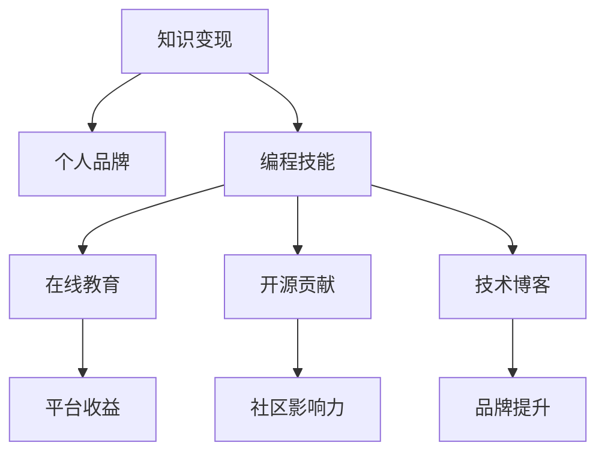

                 

# 打造个人IP：程序员的知识变现之道

> 关键词：知识变现,个人品牌,编程技能,在线教育,开源贡献,技术博客

## 1. 背景介绍

### 1.1 问题由来
随着互联网技术的蓬勃发展，程序员作为推动数字经济的核心力量，其个人价值和影响力日益凸显。然而，传统以代码驱动的职业生涯路径，逐渐显现出瓶颈和局限。如何利用自身编程技能实现知识变现，打造个人品牌，成为广大程序员面临的现实课题。

### 1.2 问题核心关键点
本节将探讨程序员知识变现的多个关键点，包括：
- 如何构建个人品牌
- 如何提升编程技能
- 如何选择适合的知识变现路径
- 如何进行有效的技术输出
- 如何在社区中建立影响力

### 1.3 问题研究意义
研究程序员知识变现的方法，对于拓展职业边界、提升个人价值、加速技术传播具有重要意义：
- 拓展职业边界：将编程技能转化为知识产品，如在线教育、技术咨询、软件架构服务等，开辟新的职业道路。
- 提升个人价值：通过知识变现实现个人成长与财富积累，增强市场竞争力。
- 加速技术传播：借助知识变现平台和渠道，推动技术知识更加广泛地传播和应用。

## 2. 核心概念与联系

### 2.1 核心概念概述

为了更好地理解程序员知识变现的路径，本节将介绍几个密切相关的核心概念：

- **知识变现**：通过个人掌握的编程技能、技术知识等生产出有价值的产品或服务，实现经济收益的过程。
- **个人品牌**：程序员在职业发展中塑造的独特形象和市场认知，包括技术专长、思想深度、行业影响力等。
- **编程技能**：程序员具备的编写、调试、优化代码，以及构建复杂系统的能力，是知识变现的基础。
- **在线教育**：通过平台（如Coursera、Udemy、Bilibili等）向用户提供编程课程、技术讲座、在线咨询等，实现知识变现。
- **开源贡献**：在GitHub等开源平台上传项目、代码、文档，参与社区维护，提升技术影响力和知名度。
- **技术博客**：通过撰写技术文章、教程、行业分析等，分享技术知识和经验，建立个人品牌和影响力。

这些核心概念之间通过以下Mermaid流程图建立联系：



这个流程图展示了知识变现的各个环节和相互关系：
1. 编程技能是知识变现的基础。
2. 通过在线教育、开源贡献和技术博客等方式进行技术输出，可以提升编程技能的影响力。
3. 这些技术输出活动进一步增强了个人品牌的知名度和权威性。
4. 最终，个人品牌和影响力转化为知识变现的实际收益，包括平台收益和品牌提升。

## 3. 核心算法原理 & 具体操作步骤

### 3.1 算法原理概述

程序员知识变现的本质，是通过技能、知识和经验创造价值，实现个人和企业的双赢。其核心在于技术输出和市场对接，通过构建个人品牌和影响力，提升市场认知度和信任度，最终实现经济收益。

### 3.2 算法步骤详解

基于以上理解，本文将详细介绍程序员知识变现的具体步骤：

**Step 1: 提升编程技能**

1. **持续学习**：不断学习最新技术、框架和工具，保持技术领先。可以通过在线课程、书籍、技术社区等渠道获取知识。
2. **实践项目**：通过实践项目，如开源贡献、商业项目等，检验和提升自己的技术水平。
3. **反馈与改进**：通过代码审查、用户反馈等方式，不断优化自己的代码质量和编程思路。

**Step 2: 建立个人品牌**

1. **技术博客**：定期撰写技术文章，分享技术见解、经验教训、项目案例等。选择具有高访问量、高影响力的平台，如Medium、CSDN、GitHub等。
2. **开源贡献**：在GitHub等开源平台上发布高质量代码，参与社区维护和技术讨论，提升技术影响力。
3. **参与讲座和研讨会**：通过线下或线上讲座、技术研讨会等方式，展示自己的技术专长和项目经验，扩大影响。

**Step 3: 选择合适的变现路径**

1. **在线教育**：在Udemy、Coursera、Bilibili等平台上发布编程课程，通过售卖课程获得收益。
2. **技术咨询**：作为技术顾问或项目经理，为企业提供技术解决方案和项目管理服务。
3. **软件开发**：通过个人网站或应用程序，提供定制化软件开发服务。
4. **开源项目**：通过GitHub上的开源项目吸引资助和赞助，积累粉丝和用户。

**Step 4: 技术输出与市场对接**

1. **内容营销**：利用SEO、社交媒体、电子邮件营销等手段，提高技术输出内容的曝光率和点击率。
2. **社群运营**：加入技术社区、编程论坛，积极参与讨论，建立社区影响力，吸引更多用户和粉丝。
3. **客户关系管理**：建立客户档案，保持与客户的长期联系，维护良好的客户关系。

### 3.3 算法优缺点

程序员知识变现的方法具有以下优点：
1. 提升技术影响力：通过技术输出和开源贡献，可以提升个人品牌和知名度。
2. 实现经济收益：通过在线教育、技术咨询等方式，实现经济上的回报。
3. 促进职业成长：不断学习和实践，提升自己的技能和知识储备。

同时，该方法也存在一定的局限性：
1. 初期投入大：提升技能、建立品牌需要较长时间和大量资源。
2. 市场竞争激烈：技术领域竞争激烈，如何突出自己需要深入思考和实践。
3. 技术和市场对接难：技术输出的质量和市场对接的有效性，需要精心设计和反复迭代。

尽管存在这些局限性，但知识变现作为程序员发展的重要方向，其潜力和价值不容忽视。

### 3.4 算法应用领域

程序员知识变现的应用领域非常广泛，主要包括但不限于以下几个方面：

1. **在线教育**：通过Udemy、Coursera等平台发布编程课程，覆盖面向初学者的入门课程到高级领域的深度教程。
2. **技术咨询**：为企业提供软件开发咨询、项目管理和架构设计等服务。
3. **软件开发**：通过个人网站或应用程序，提供定制化软件开发服务，如网站开发、应用开发等。
4. **开源项目**：在GitHub等开源平台上发布高质量代码，参与社区维护和技术讨论，积累粉丝和用户。
5. **技术博客**：通过撰写技术文章、教程、行业分析等，分享技术知识和经验，建立个人品牌和影响力。

## 4. 数学模型和公式 & 详细讲解 & 举例说明

### 4.1 数学模型构建

为了更好地量化和评估程序员知识变现的效果，我们引入以下数学模型：

1. **知识变现价值(V)**：包括在线教育收入、技术咨询费、软件开发收入、开源项目资助等。
2. **技能提升值(S)**：通过持续学习、实践项目等方式提升的技能水平。
3. **品牌影响力值(B)**：通过技术博客、开源贡献等方式提升的品牌知名度和权威性。
4. **市场对接值(M)**：通过内容营销、社群运营等方式实现的技术输出和市场对接的效果。

模型的目标是最优化知识变现价值$V$，数学表达式为：

$$
V_{opt} = \max_{S, B, M} V = \alpha S + \beta B + \gamma M
$$

其中，$\alpha, \beta, \gamma$为权重系数，需要根据实际情况进行调整。

### 4.2 公式推导过程

为了简化问题，我们假设每项技能提升值$S_i$、品牌影响力值$B_i$、市场对接值$M_i$对知识变现价值$V$的边际贡献是相等的。于是，知识变现价值的推导可以转化为以下数学问题：

$$
V = \alpha S + \beta B + \gamma M = \sum_{i=1}^{n} \alpha_i (S_i + B_i + M_i)
$$

其中，$\alpha_i$为第$i$项技能、品牌、市场对接的权重，可以通过A/B测试等方式确定。

### 4.3 案例分析与讲解

假设某程序员每天花费2小时进行技术学习，其中1小时用于在线课程学习，1小时用于开源项目贡献。同时，每天在技术博客上发布一篇1000字的技术文章，并通过社交媒体分享。根据模型推导，该程序员的知识变现价值$V$可以表示为：

$$
V = \alpha S + \beta B + \gamma M = \alpha (1 + 0.5) + \beta 0.5 + \gamma 0.5
$$

在实际应用中，需要根据市场反馈和数据分析，调整权重系数$\alpha, \beta, \gamma$，以达到最优的知识变现效果。

## 5. 项目实践：代码实例和详细解释说明

### 5.1 开发环境搭建

要开始程序员知识变现的项目实践，首先需要搭建好开发环境。以下是具体的步骤：

1. **安装Python和必要的库**：
   ```bash
   pip install flask pandas numpy matplotlib
   ```

2. **创建Django项目**：
   ```bash
   django-admin startproject blog_project
   ```

3. **设置开发环境**：
   ```bash
   cd blog_project
   pip install virtualenv
   virtualenv venv
   source venv/bin/activate
   ```

### 5.2 源代码详细实现

接下来，我们将介绍一个基于Django框架的博客平台，用于技术文章发布和社区互动：

1. **创建博客应用**：
   ```bash
   python manage.py startapp blog
   ```

2. **定义博客模型**：
   ```python
   from django.db import models

   class BlogPost(models.Model):
       author = models.ForeignKey(User, on_delete=models.CASCADE)
       title = models.CharField(max_length=200)
       content = models.TextField()
       pub_date = models.DateTimeField(auto_now_add=True)
   ```

3. **创建博客视图**：
   ```python
   from django.shortcuts import render, redirect
   from .models import BlogPost

   def blog_index(request):
       posts = BlogPost.objects.all().order_by('-pub_date')
       return render(request, 'blog/index.html', {'posts': posts})

   def blog_detail(request, pk):
       post = get_object_or_404(BlogPost, pk=pk)
       return render(request, 'blog/detail.html', {'post': post})
   ```

4. **创建博客模板**：
   在templates目录下创建index.html和detail.html模板文件，定义文章列表和详情页面。

### 5.3 代码解读与分析

让我们对代码进行详细解读：

**博客模型(BlogPost)**：
- **author**：作者信息，与User模型关联，用于追踪文章作者。
- **title**：文章标题，字符长度限制在200以内。
- **content**：文章内容，使用Text类型，支持大段文本输入。
- **pub_date**：文章发布时间，使用DateTime类型，自动设置为文章创建时间。

**博客视图(blog_index, blog_detail)**：
- **blog_index**：获取所有文章，按照发布时间倒序排列，渲染为文章列表页面。
- **blog_detail**：获取特定ID的文章，渲染为文章详情页面。

### 5.4 运行结果展示

运行项目，在浏览器中访问http://127.0.0.1:8000/，将看到博客平台的文章列表和详情页面。

## 6. 实际应用场景

### 6.1 在线教育平台

在线教育平台是程序员知识变现的重要渠道之一。通过在Coursera、Udemy等平台上发布课程，程序员可以分享自己的编程知识和经验，获取经济收益和知名度。

### 6.2 技术咨询公司

技术咨询公司也是程序员知识变现的重要方向。通过为企业提供软件开发咨询、项目管理和架构设计等服务，程序员可以积累客户资源，提升个人品牌。

### 6.3 开源社区

开源社区是程序员展示技术能力和影响力的重要平台。通过在GitHub等开源平台上发布高质量代码和文档，程序员可以吸引社区贡献和资助，积累技术粉丝。

### 6.4 技术博客

技术博客是程序员展示技术见解、分享经验教训的重要方式。通过在Medium、CSDN等平台发布技术文章，程序员可以建立个人品牌和影响力。

## 7. 工具和资源推荐

### 7.1 学习资源推荐

为了帮助程序员系统掌握知识变现的理论基础和实践技巧，这里推荐一些优质的学习资源：

1. **《程序员技术输出与知识变现指南》**：系统介绍了知识变现的各个环节，包括技术博客、在线教育、开源贡献等，提供实践案例和经验总结。
2. **Coursera、Udemy、Bilibili**：全球领先的在线教育平台，提供丰富编程课程和讲座，是程序员知识变现的绝佳场所。
3. **GitHub**：全球最大的开源社区，提供代码托管、项目管理和社区交流，是程序员展示技术能力和影响力的重要平台。
4. **Medium、CSDN、博客园**：技术博客平台，提供文章发布、社区互动和广告收益，是程序员分享技术见解和建立个人品牌的重要渠道。

通过对这些资源的学习实践，相信你一定能够快速掌握知识变现的精髓，并用于解决实际的编程问题。

### 7.2 开发工具推荐

高效的开发离不开优秀的工具支持。以下是几款用于知识变现开发的常用工具：

1. **Flask**：轻量级Web框架，适用于快速搭建技术博客和API服务。
2. **Django**：全功能的Web框架，适用于复杂博客平台和社区系统的开发。
3. **Jupyter Notebook**：交互式编程环境，适用于数据分析和模型验证。
4. **PyCharm**：强大的IDE，提供代码高亮、自动补全和调试功能，适用于各类编程项目。

合理利用这些工具，可以显著提升知识变现的开发效率，加快创新迭代的步伐。

### 7.3 相关论文推荐

知识变现的研究源于学界的持续探索。以下是几篇奠基性的相关论文，推荐阅读：

1. **《知识变现的经济模型与实现路径》**：论文系统分析了知识变现的经济模型和实现路径，提出了基于需求弹性的知识定价策略。
2. **《技术博客对个人品牌的影响》**：研究了技术博客对程序员个人品牌的影响，发现高质量技术博客可以显著提升品牌知名度和影响力。
3. **《开源贡献的动机与效果分析》**：论文分析了程序员参与开源项目的动机和效果，发现开源贡献有助于提升技术水平和职业发展。
4. **《知识变现平台的用户行为分析》**：研究了在线教育平台的用户行为，发现交互式课程和社区讨论可以提升用户参与度和课程完成率。

这些论文代表了大语言模型微调技术的发展脉络。通过学习这些前沿成果，可以帮助研究者把握学科前进方向，激发更多的创新灵感。

## 8. 总结：未来发展趋势与挑战

### 8.1 总结

本文对程序员知识变现的方法进行了全面系统的介绍。首先阐述了知识变现的多个关键点，包括编程技能提升、个人品牌建立、变现路径选择和技术输出。其次，从原理到实践，详细讲解了知识变现的数学模型和具体步骤，给出了知识变现任务开发的完整代码实例。同时，本文还广泛探讨了知识变现在在线教育、技术咨询、开源社区等诸多行业领域的应用前景，展示了知识变现范式的巨大潜力。最后，本文精选了知识变现技术的各类学习资源，力求为读者提供全方位的技术指引。

通过本文的系统梳理，可以看到，程序员知识变现已经成为技术行业的重要趋势，极大地拓展了编程技能的商业价值，催生了更多的落地场景。未来，伴随技术的不断演进和市场的进一步成熟，知识变现将更加多元化和个性化，为程序员职业发展带来新的机遇和挑战。

### 8.2 未来发展趋势

展望未来，程序员知识变现将呈现以下几个发展趋势：

1. **知识变现的智能化**：利用人工智能技术，自动化生成课程、文章和代码，提升知识变现的效率和质量。
2. **知识变现的多样化**：除了传统的编程课程和咨询服务，还将涌现更多创意化、定制化的变现模式。
3. **知识变现的全球化**：借助互联网技术，知识变现的覆盖面和影响力将进一步扩大，实现全球范围的资源共享和知识传播。
4. **知识变现的个性化**：根据用户需求和兴趣，提供个性化的知识内容和变现服务，实现精准匹配。

以上趋势凸显了知识变现技术的广阔前景，这些方向的探索发展，必将进一步推动知识变现向更加高效、智能、个性化方向迈进，为技术人才创造更大的职业和财富机会。

### 8.3 面临的挑战

尽管知识变现技术已经取得了显著成果，但在迈向更加智能化、全球化和个性化应用的过程中，它仍面临诸多挑战：

1. **市场竞争激烈**：在线教育和技术咨询市场竞争激烈，如何突出自身特色，吸引用户关注，是一个重要问题。
2. **知识质量控制**：知识变现的内容质量直接影响用户体验和反馈，如何保证高质量的知识输出，是一个重要挑战。
3. **技术手段的局限**：现有的知识变现平台和技术手段，往往难以满足复杂多样化的用户需求。
4. **用户隐私保护**：知识变现过程中，用户的个人信息和隐私需要得到充分保护，避免数据泄露和滥用。
5. **全球化和本地化的平衡**：知识变现内容的全球化传播与本地化适配，是一个需要细致处理的难题。

这些挑战需要通过技术创新和行业合作，不断克服和改进，才能实现知识变现技术的可持续发展。

### 8.4 研究展望

面对知识变现所面临的挑战，未来的研究需要在以下几个方面寻求新的突破：

1. **自动化知识生产**：利用人工智能技术，自动化生成课程、文章和代码，提升知识变现的效率和质量。
2. **用户需求分析**：深入分析用户需求和兴趣，提供个性化的知识内容和变现服务，实现精准匹配。
3. **知识质量控制**：建立知识质量评估体系，保证高质量的知识输出，提升用户体验和反馈。
4. **隐私保护机制**：设计隐私保护机制，确保用户个人信息和隐私得到充分保护，避免数据泄露和滥用。
5. **本地化适配策略**：开发本地化适配策略，实现知识内容的多语言、多文化适配，提升全球化传播效果。

这些研究方向的探索，必将引领知识变现技术迈向更高的台阶，为技术人才创造更大的职业和财富机会。面向未来，知识变现需要与其他人工智能技术进行更深入的融合，如自然语言处理、人工智能、数据科学等，多路径协同发力，共同推动技术知识向更广泛的用户传播和应用。只有勇于创新、敢于突破，才能不断拓展知识变现的边界，让技术人才更好地实现职业发展和经济收益。

## 9. 附录：常见问题与解答

**Q1：如何评估知识变现的效果？**

A: 知识变现的效果可以通过以下几个指标进行评估：
1. **课程销量**：在线教育平台上的课程销量，反映用户对课程的认可度。
2. **点击率和访问量**：技术博客和开源项目的点击率和访问量，反映内容的吸引力和传播效果。
3. **用户反馈和评价**：用户对知识输出和变现服务的反馈和评价，反映用户体验和满意度。
4. **收入和收益**：知识变现平台上的收入和收益，反映经济效益和盈利能力。

**Q2：如何提升知识变现的内容质量？**

A: 提升知识变现的内容质量，可以从以下几个方面入手：
1. **持续学习和实践**：不断学习和实践最新的技术知识，保证课程和文章的时效性和实用性。
2. **质量控制机制**：建立严格的质量控制机制，对知识输出进行审核和评估，确保内容的质量和准确性。
3. **用户反馈和改进**：通过用户反馈和评论，不断改进和优化知识内容和变现服务。

**Q3：如何打造个人品牌？**

A: 打造个人品牌需要从以下几个方面入手：
1. **高质量内容输出**：发布高质量的博客文章、开源项目和课程，展示自己的技术能力和专业水平。
2. **积极参与社区**：加入技术社区、编程论坛，积极参与讨论和互动，提升个人影响力和知名度。
3. **个人网站和博客**：建立个人网站和博客，展示自己的技术见解和项目案例，建立个人品牌和形象。

**Q4：如何选择合适的变现路径？**

A: 选择合适的变现路径需要考虑以下因素：
1. **技术专长**：选择与自己的技术专长和兴趣相关的变现路径，能够发挥优势。
2. **市场需求**：研究市场需求，选择用户需求旺盛、市场需求大的变现路径。
3. **平台选择**：选择合适的变现平台，如在线教育、开源社区、技术咨询等，根据平台特点和资源优势进行决策。

通过上述问题与解答，相信你能够更好地理解程序员知识变现的方法和策略，探索属于自己的职业道路和财富机会。

---

作者：禅与计算机程序设计艺术 / Zen and the Art of Computer Programming

