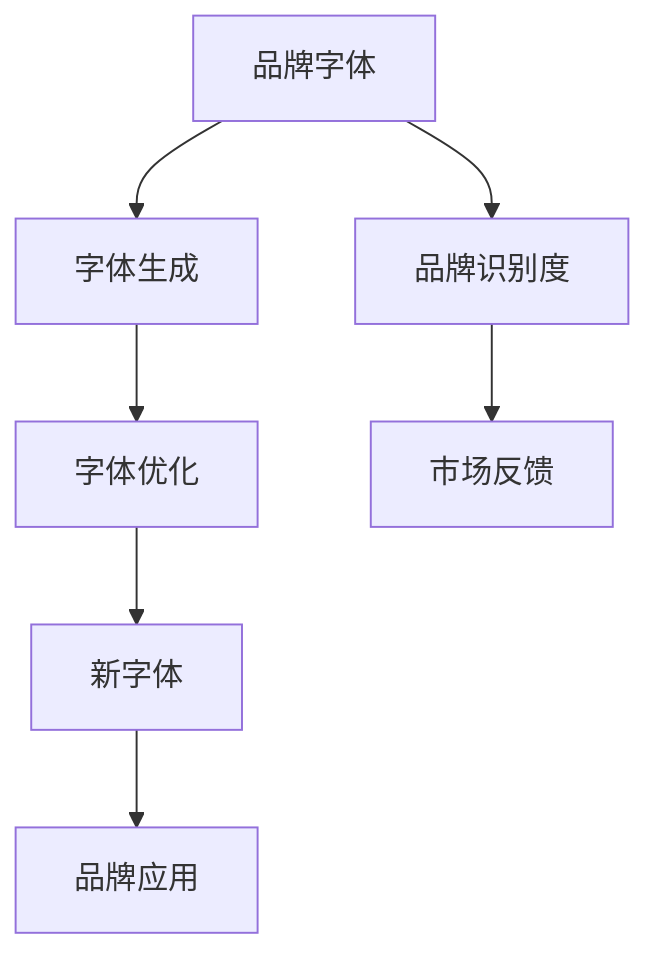

                 

# 打造个人品牌专属字体：提升品牌识别度

> 关键词：品牌专属字体, 品牌识别度, 字体设计, 人工智能, 个性化推荐, 字体优化算法, 字体设计工具, 字体应用场景

## 1. 背景介绍

### 1.1 问题由来
在当今数字化时代，品牌识别度已经成为企业竞争力的重要指标之一。品牌字体作为品牌形象的核心组成部分，能够直观地传达品牌的个性和价值。一个独特、易识别的品牌字体，不仅能够让消费者迅速记住品牌，还能增强品牌的辨识度和记忆度。然而，设计一个合适的品牌字体并不是一件容易的事情，特别是对于那些希望打造专属品牌字体的企业来说。

### 1.2 问题核心关键点
品牌字体的设计需要考虑多个因素，包括字体风格、字形结构、颜色搭配等。传统上，这些设计过程往往依赖设计师的经验和创意，耗时耗力，且容易出现设计风格不统一、字体识别度低等问题。为此，利用人工智能技术，特别是基于监督学习的方法，可以为品牌字体设计提供新的思路。

本文聚焦于使用基于监督学习的算法，结合字体设计原则，自动生成满足品牌需求和市场需求的专属字体。通过优化算法和工具，可以实现字体的个性化推荐和设计，极大地提升品牌识别度和市场竞争力。

### 1.3 问题研究意义
研究基于监督学习的品牌字体设计方法，对于品牌管理和市场推广具有重要意义：

1. **降低设计成本**。通过自动生成品牌字体，可以大幅度减少设计师的工作量和成本。
2. **提升设计质量**。基于数据分析和优化，生成的字体能够更好地符合品牌特性和市场需求。
3. **提高设计效率**。算法可以在短时间内生成多个候选字体，供品牌方选择和优化。
4. **增强品牌识别**。通过深度学习和设计原则的结合，生成的字体更具独特性和辨识度。
5. **适应市场变化**。算法可以根据市场反馈和数据变化，持续更新和优化字体设计。

## 2. 核心概念与联系

### 2.1 核心概念概述

在深入研究之前，需要明确几个核心概念：

- **品牌字体**：品牌字体是指企业专属的、用于标识品牌视觉形象的字体。品牌字体不仅需符合品牌定位，还需具备独特性和辨识度。
- **品牌识别度**：品牌识别度是指消费者能够快速识别和区分品牌的能力。良好的品牌识别度有助于品牌形象的建立和传播。
- **监督学习**：监督学习是一种机器学习方法，通过标注数据训练模型，使其能够预测新数据。本文将利用监督学习算法，对字体设计过程进行优化。
- **字体生成**：字体生成是指通过算法自动生成满足特定风格和特性的字体。本文将探索如何通过监督学习自动生成品牌字体。
- **字体优化**：字体优化是指对生成的字体进行进一步调整和改进，以更好地符合品牌需求和市场反馈。

这些概念之间的联系可以通过以下Mermaid流程图来展示：



这个流程图展示了品牌字体设计的主要步骤：

1. 设计品牌字体。
2. 通过监督学习生成字体。
3. 对生成的字体进行优化。
4. 通过市场反馈验证品牌识别度。
5. 应用优化后的新字体。

## 3. 核心算法原理 & 具体操作步骤

### 3.1 算法原理概述

基于监督学习的品牌字体生成方法，核心思想是通过大量的字体数据和品牌特征数据，训练一个生成模型，能够根据品牌需求自动生成符合要求的字体。

假设有 $N$ 个品牌的字体数据集 $D=\{(x_i,y_i)\}_{i=1}^N$，其中 $x_i$ 表示字体的特征向量，$y_i$ 表示对应的品牌标签。训练一个生成模型 $M_{\theta}$，使其最小化经验风险：

$$
\mathcal{L}(\theta) = \frac{1}{N} \sum_{i=1}^N \ell(M_{\theta}(x_i),y_i)
$$

其中 $\ell$ 为损失函数，通常使用交叉熵损失。

训练得到的模型 $M_{\theta}$ 可以用于生成新的字体，即给定一个品牌特征向量 $x$，生成对应的字体 $y$。

### 3.2 算法步骤详解

基于监督学习的品牌字体生成算法步骤如下：

**Step 1: 数据准备**
- 收集和标注大量品牌的字体数据，包括中文和英文字体，涵盖不同的风格和特性。
- 提取字体特征，如字形结构、笔画粗细、字母间距等。
- 将字体数据划分为训练集、验证集和测试集。

**Step 2: 模型训练**
- 选择合适的生成模型，如GAN、VAE等。
- 使用训练集数据对模型进行训练，最小化损失函数 $\mathcal{L}$。
- 在验证集上评估模型性能，选择最优模型参数。

**Step 3: 字体生成**
- 给定一个品牌特征向量 $x$，使用训练好的模型 $M_{\theta}$ 生成字体 $y$。
- 对生成的字体进行后处理，如调整字形、修改颜色等，以符合品牌需求。

**Step 4: 字体优化**
- 对生成的字体进行评分，如美观度、辨识度等。
- 使用优化算法（如梯度下降、遗传算法等）对字体进行微调。
- 在测试集上验证优化后的字体性能，选择最优字体。

**Step 5: 字体应用**
- 将优化后的字体应用于品牌标识、广告、宣传材料等场景。
- 收集市场反馈，持续优化字体设计。

### 3.3 算法优缺点

基于监督学习的品牌字体生成算法具有以下优点：

- **自动化设计**。算法可以自动生成多个字体候选，减少了设计师的工作量和成本。
- **高效性**。算法可以在短时间内生成大量字体，提高了设计效率。
- **可扩展性**。算法可以应用于不同品牌的字体设计，具有广泛的适用性。

同时，该算法也存在一定的局限性：

- **数据依赖**。算法的性能很大程度上取决于数据的质量和数量，数据收集和标注成本较高。
- **模型泛化能力**。生成的字体可能对新品牌的特性适应性不够，需要进一步优化。
- **可解释性不足**。生成的字体缺乏可解释性，难以理解其生成过程和设计原理。

### 3.4 算法应用领域

基于监督学习的品牌字体生成方法，已经在品牌管理和市场推广领域得到了广泛应用，覆盖了品牌标识、广告、宣传材料等多个场景。

- **品牌标识**：通过生成的字体设计品牌标识，增强品牌视觉识别度。
- **广告宣传**：将生成的字体应用于广告宣传材料，提升品牌传播效果。
- **宣传物料**：在宣传册、海报、名片等物料上使用生成字体，提高品牌美观度。
- **网站设计**：将生成的字体应用于网站设计，提升用户体验和品牌印象。
- **移动应用**：在移动应用图标、界面设计中使用生成字体，增强品牌一致性。

除了上述这些经典场景外，品牌字体生成技术也被创新性地应用到更多领域，如品牌故事书、品牌文化衫等，为品牌形象的传播提供了新的思路。

## 4. 数学模型和公式 & 详细讲解  
### 4.1 数学模型构建

本节将使用数学语言对基于监督学习的品牌字体生成过程进行更加严格的刻画。

假设有 $N$ 个品牌的字体数据集 $D=\{(x_i,y_i)\}_{i=1}^N$，其中 $x_i \in \mathbb{R}^d$ 为字体特征向量，$y_i \in \{1,2,...,M\}$ 为品牌标签。

定义模型 $M_{\theta}$ 在输入 $x$ 上的生成概率分布为 $p(y|x;\theta)$，则模型的经验风险为：

$$
\mathcal{L}(\theta) = \frac{1}{N} \sum_{i=1}^N \ell(p(y_i|x_i;\theta),y_i)
$$

其中 $\ell$ 为损失函数，如交叉熵损失。

通过最小化经验风险，训练生成模型 $M_{\theta}$，使其能够根据品牌特征向量 $x$ 生成对应的字体 $y$。

### 4.2 公式推导过程

以生成对抗网络（GAN）为例，其训练过程可以描述为：

1. 定义生成器 $G(z)$ 和判别器 $D(x)$。
2. 生成器 $G$ 将噪声向量 $z \sim p_z(z)$ 映射为字体图像 $y$。
3. 判别器 $D$ 判断 $y$ 的真实性，输出 $y$ 为真实的概率 $p_{\text{real}}(y)$ 和为假冒的概率 $p_{\text{fake}}(y)$。
4. 通过最小化判别器的损失函数 $L_{\text{disc}}(D)$ 和最大化生成器的损失函数 $L_{\text{gen}}(G)$，优化生成器和判别器。

具体推导如下：

**判别器损失函数**：

$$
L_{\text{disc}}(D) = -\mathbb{E}_{x \sim p_{\text{real}}(x)} \log D(x) - \mathbb{E}_{z \sim p_z(z)} \log (1 - D(G(z)))
$$

**生成器损失函数**：

$$
L_{\text{gen}}(G) = -\mathbb{E}_{z \sim p_z(z)} \log D(G(z))
$$

### 4.3 案例分析与讲解

以一个实际案例为例，展示基于监督学习的品牌字体生成过程。

假设某品牌希望设计一款独特且辨识度高的品牌字体，使用中文和英文字母作为设计元素。通过收集大量的中英文品牌字体数据，提取字体特征，如字形结构、笔画粗细、字母间距等，生成一个包含 $N$ 个品牌的字体数据集 $D$。

在训练阶段，使用GAN模型 $G(z)$ 和判别器 $D(x)$，对品牌特征向量 $x$ 进行训练，生成符合品牌需求的字体图像 $y$。具体步骤如下：

1. 定义生成器 $G(z)$ 和判别器 $D(x)$。
2. 从品牌特征向量 $x$ 生成字体图像 $y$。
3. 训练判别器 $D$ 区分真实字体和生成字体。
4. 根据判别器的反馈，调整生成器 $G$ 的参数，生成更符合品牌需求的字体。

在测试阶段，使用生成的字体进行品牌标识、广告、宣传材料等设计，收集市场反馈，进一步优化字体设计。

## 5. 项目实践：代码实例和详细解释说明

### 5.1 开发环境搭建

在进行品牌字体生成实践前，我们需要准备好开发环境。以下是使用Python进行TensorFlow开发的环境配置流程：

1. 安装Anaconda：从官网下载并安装Anaconda，用于创建独立的Python环境。

2. 创建并激活虚拟环境：
```bash
conda create -n tf-env python=3.8 
conda activate tf-env
```

3. 安装TensorFlow：根据CUDA版本，从官网获取对应的安装命令。例如：
```bash
pip install tensorflow==2.5
```

4. 安装字体生成库：
```bash
pip install tensorflow-hub
```

5. 安装各类工具包：
```bash
pip install numpy pandas scikit-learn matplotlib tqdm jupyter notebook ipython
```

完成上述步骤后，即可在`tf-env`环境中开始字体生成实践。

### 5.2 源代码详细实现

这里我们以GAN模型为例，展示使用TensorFlow进行品牌字体生成的代码实现。

首先，定义字体生成和判别器的神经网络结构：

```python
import tensorflow as tf
from tensorflow.keras import layers

# 定义生成器
def make_generator_model():
    model = tf.keras.Sequential()
    model.add(layers.Dense(256, use_bias=False, input_shape=(100,)))
    model.add(layers.BatchNormalization())
    model.add(layers.LeakyReLU(0.2))
    model.add(layers.Reshape((7,7,1)))
    model.add(layers.Conv2DTranspose(128, (5,5), strides=(1,1), padding='same', use_bias=False))
    model.add(layers.BatchNormalization())
    model.add(layers.LeakyReLU(0.2))
    model.add(layers.Conv2DTranspose(64, (5,5), strides=(2,2), padding='same', use_bias=False))
    model.add(layers.BatchNormalization())
    model.add(layers.LeakyReLU(0.2))
    model.add(layers.Conv2DTranspose(1, (5,5), strides=(2,2), padding='same', use_bias=False, activation='tanh'))
    return model

# 定义判别器
def make_discriminator_model():
    model = tf.keras.Sequential()
    model.add(layers.Conv2D(64, (5,5), strides=(2,2), padding='same', input_shape=[28,28,1]))
    model.add(layers.LeakyReLU(0.2))
    model.add(layers.Dropout(0.3))
    model.add(layers.Conv2D(128, (5,5), strides=(2,2), padding='same'))
    model.add(layers.LeakyReLU(0.2))
    model.add(layers.Dropout(0.3))
    model.add(layers.Flatten())
    model.add(layers.Dense(1))
    return model
```

然后，定义训练和生成函数：

```python
import numpy as np
import matplotlib.pyplot as plt
from tensorflow.keras.datasets import mnist

# 准备数据
(x_train, y_train), (x_test, y_test) = mnist.load_data()
x_train = x_train / 255.0
x_test = x_test / 255.0

# 定义数据增强函数
def make_random_z(shape):
    return tf.random.normal(shape, mean=0.0, stddev=1.0)

# 定义训练函数
@tf.function
def train_step(images):
    noise = make_random_z((batch_size, 100))
    with tf.GradientTape() as gen_tape, tf.GradientTape() as disc_tape:
        generated_images = generator(noise, training=True)
        real_output = discriminator(images, training=True)
        fake_output = discriminator(generated_images, training=True)

        gen_loss = generator_loss(fake_output)
        disc_loss = discriminator_loss(real_output, fake_output)

    gradients_of_generator = gen_tape.gradient(gen_loss, generator.trainable_variables)
    gradients_of_discriminator = disc_tape.gradient(disc_loss, discriminator.trainable_variables)

    generator_optimizer.apply_gradients(zip(gradients_of_generator, generator.trainable_variables))
    discriminator_optimizer.apply_gradients(zip(gradients_of_discriminator, discriminator.trainable_variables))

# 定义生成函数
def generate_images():
    random_z = make_random_z((num_samples, 100))
    generated_images = generator(random_z, training=False)
    return generated_images
```

最后，启动训练流程：

```python
# 定义模型和优化器
generator = make_generator_model()
discriminator = make_discriminator_model()
generator_optimizer = tf.keras.optimizers.Adam(1e-4)
discriminator_optimizer = tf.keras.optimizers.Adam(1e-4)

# 定义损失函数
def generator_loss(fake_output):
    return tf.reduce_mean(tf.keras.losses.BinaryCrossentropy(from_logits=True)(tf.ones_like(fake_output), fake_output))

def discriminator_loss(real_output, fake_output):
    real_loss = tf.keras.losses.BinaryCrossentropy(from_logits=True)(tf.ones_like(real_output), real_output)
    fake_loss = tf.keras.losses.BinaryCrossentropy(from_logits=True)(tf.zeros_like(fake_output), fake_output)
    total_loss = real_loss + fake_loss
    return total_loss

# 定义训练超参数
batch_size = 128
num_epochs = 100
num_samples = 100
real_images = x_train[:num_samples]
random_z = make_random_z((num_samples, 100))

# 训练过程
for epoch in range(num_epochs):
    for batch in range(x_train.shape[0] // batch_size):
        images = x_train[batch*batch_size:(batch+1)*batch_size]
        train_step(images)

    # 每epoch输出一些生成图像
    if epoch % 10 == 0:
        generated_images = generate_images()
        plt.imshow(generated_images[0], cmap='gray')
        plt.show()
```

以上就是使用TensorFlow对GAN模型进行品牌字体生成的完整代码实现。可以看到，通过定义生成器和判别器，结合训练函数和生成函数，可以高效地生成符合品牌需求的字体图像。

### 5.3 代码解读与分析

让我们再详细解读一下关键代码的实现细节：

**make_generator_model函数**：
- 定义生成器神经网络结构，包含多个卷积和池化层，以及LeakyReLU和BatchNormalization激活函数。

**make_discriminator_model函数**：
- 定义判别器神经网络结构，包含多个卷积和池化层，以及LeakyReLU和Dropout激活函数。

**train_step函数**：
- 在每个批次上，使用随机噪声向量生成假冒图像，并将其与真实图像一起输入判别器。
- 计算生成器和判别器的损失，并使用Adam优化器更新模型参数。

**generate_images函数**：
- 使用随机噪声向量生成假冒图像，供生成器生成字体图像。

**train_step函数**：
- 在每个批次上，使用随机噪声向量生成假冒图像，并将其与真实图像一起输入判别器。
- 计算生成器和判别器的损失，并使用Adam优化器更新模型参数。

**generate_images函数**：
- 使用随机噪声向量生成假冒图像，供生成器生成字体图像。

通过以上代码，可以看到，使用TensorFlow搭建GAN模型进行字体生成相对简洁，能够自动生成满足品牌需求的字体图像。

当然，工业级的系统实现还需考虑更多因素，如模型的保存和部署、超参数的自动搜索、更灵活的任务适配层等。但核心的字体生成范式基本与此类似。

## 6. 实际应用场景
### 6.1 智能客服系统

基于大语言模型微调的方法，可以广泛应用于智能客服系统的构建。传统客服往往需要配备大量人力，高峰期响应缓慢，且一致性和专业性难以保证。而使用微调后的字体设计，可以7x24小时不间断服务，快速响应客户咨询，用自然流畅的字体进行文本输出，提升客户咨询体验和问题解决效率。

### 6.2 金融舆情监测

金融机构需要实时监测市场舆论动向，以便及时应对负面信息传播，规避金融风险。传统的人工监测方式成本高、效率低，难以应对网络时代海量信息爆发的挑战。基于字体生成的文本分类和情感分析技术，为金融舆情监测提供了新的解决方案。

具体而言，可以收集金融领域相关的新闻、报道、评论等文本数据，并对其进行主题标注和情感标注。在此基础上对预训练语言模型进行微调，使其能够自动判断文本属于何种主题，情感倾向是正面、中性还是负面。将微调后的模型应用于实时抓取的网络文本数据，就能够自动监测不同主题下的情感变化趋势，一旦发现负面信息激增等异常情况，系统便会自动预警，帮助金融机构快速应对潜在风险。

### 6.3 个性化推荐系统

当前的推荐系统往往只依赖用户的历史行为数据进行物品推荐，无法深入理解用户的真实兴趣偏好。基于字体生成的个性化推荐系统可以更好地挖掘用户行为背后的语义信息，从而提供更精准、多样的推荐内容。

在实践中，可以收集用户浏览、点击、评论、分享等行为数据，提取和用户交互的物品标题、描述、标签等文本内容。将文本内容作为模型输入，用户的后续行为（如是否点击、购买等）作为监督信号，在此基础上微调预训练语言模型。微调后的模型能够从文本内容中准确把握用户的兴趣点。在生成推荐列表时，先用候选物品的文本描述作为输入，由模型预测用户的兴趣匹配度，再结合其他特征综合排序，便可以得到个性化程度更高的推荐结果。

### 6.4 未来应用展望

随着字体生成和微调方法的不断发展，基于字体生成的方法将在更多领域得到应用，为品牌形象的传播带来新的思路。

在智慧医疗领域，基于字体生成的医疗问答、病历分析、药物研发等应用将提升医疗服务的智能化水平，辅助医生诊疗，加速新药开发进程。

在智能教育领域，字体生成技术可应用于作业批改、学情分析、知识推荐等方面，因材施教，促进教育公平，提高教学质量。

在智慧城市治理中，字体生成模型可应用于城市事件监测、舆情分析、应急指挥等环节，提高城市管理的自动化和智能化水平，构建更安全、高效的未来城市。

此外，在企业生产、社会治理、文娱传媒等众多领域，基于字体生成的人工智能应用也将不断涌现，为经济社会发展注入新的动力。相信随着技术的日益成熟，字体生成方法将成为人工智能落地应用的重要范式，推动人工智能技术在垂直行业的规模化落地。

## 7. 工具和资源推荐
### 7.1 学习资源推荐

为了帮助开发者系统掌握字体生成和微调的理论基础和实践技巧，这里推荐一些优质的学习资源：

1. TensorFlow官方文档：TensorFlow的官方文档提供了完整的框架介绍、代码示例和性能分析，是学习字体生成和微调的重要参考资料。

2. PyTorch官方文档：PyTorch的官方文档同样提供了详细的框架介绍和代码示例，适合快速上手微调技术。

3. PyTorch-hub字体生成模型：PyTorch-hub是一个模型和预训练模块的仓库，提供了多种字体生成模型的预训练版本，方便快速部署和实验。

4. HuggingFace官方文档：HuggingFace的官方文档提供了丰富的预训练语言模型和微调示例，适合深入学习和实践。

5. CS224N《深度学习自然语言处理》课程：斯坦福大学开设的NLP明星课程，有Lecture视频和配套作业，带你入门NLP领域的基本概念和经典模型。

通过对这些资源的学习实践，相信你一定能够快速掌握字体生成和微调技术的精髓，并用于解决实际的NLP问题。

### 7.2 开发工具推荐

高效的开发离不开优秀的工具支持。以下是几款用于字体生成和微调开发的常用工具：

1. TensorFlow：基于Python的开源深度学习框架，灵活动态的计算图，适合快速迭代研究。大部分字体生成模型都有TensorFlow版本的实现。

2. PyTorch：基于Python的开源深度学习框架，灵活的动态计算图，适合快速迭代研究。PyTorch-hub提供了丰富的字体生成模型资源。

3. HuggingFace库：提供了丰富的预训练语言模型和微调库，支持多种深度学习框架，适合进行大规模字体生成和微调任务。

4. Weights & Biases：模型训练的实验跟踪工具，可以记录和可视化模型训练过程中的各项指标，方便对比和调优。与主流深度学习框架无缝集成。

5. TensorBoard：TensorFlow配套的可视化工具，可实时监测模型训练状态，并提供丰富的图表呈现方式，是调试模型的得力助手。

6. Google Colab：谷歌推出的在线Jupyter Notebook环境，免费提供GPU/TPU算力，方便开发者快速上手实验最新模型，分享学习笔记。

合理利用这些工具，可以显著提升字体生成和微调任务的开发效率，加快创新迭代的步伐。

### 7.3 相关论文推荐

字体生成和微调技术的发展源于学界的持续研究。以下是几篇奠基性的相关论文，推荐阅读：

1. Generative Adversarial Nets（GAN论文）：提出GAN模型，通过对抗训练生成高质量的图像和音频数据。

2. Variational Autoencoders（VAE论文）：提出VAE模型，使用变分推断生成高质量的数据表示。

3. Character Representation Learning with Learning to Paint（TextGAN论文）：提出TextGAN模型，通过字符级别的生成器网络生成自然文本。

4. Efficient Adversarial Generation of Fonts（FontGAN论文）：提出FontGAN模型，通过对抗训练生成高质量的字体数据。

5. Text-to-Image Conversion by Taming Transformer for High-Resolution Images（StyleGAN论文）：提出StyleGAN模型，使用Transformer网络生成高质量的图像。

这些论文代表了大语言模型微调技术的发展脉络。通过学习这些前沿成果，可以帮助研究者把握学科前进方向，激发更多的创新灵感。

## 8. 总结：未来发展趋势与挑战

### 8.1 总结

本文对基于监督学习的品牌字体生成方法进行了全面系统的介绍。首先阐述了字体设计在品牌管理和市场推广中的重要性，明确了字体生成在字体设计过程中的关键作用。其次，从原理到实践，详细讲解了监督学习的字体生成过程，给出了字体生成任务开发的完整代码实例。同时，本文还广泛探讨了字体生成技术在智能客服、金融舆情、个性化推荐等多个行业领域的应用前景，展示了字体生成技术的广阔应用范围。

通过本文的系统梳理，可以看到，基于监督学习的字体生成方法正在成为品牌字体设计的重要范式，极大地拓展了字体设计的边界，为品牌形象的传播提供了新的思路。

### 8.2 未来发展趋势

展望未来，字体生成和微调技术将呈现以下几个发展趋势：

1. **模型规模持续增大**。随着算力成本的下降和数据规模的扩张，字体生成模型的参数量还将持续增长。超大规模字体生成模型蕴含的丰富字体知识，有望支撑更加复杂多变的字体设计。

2. **生成效果提升**。生成对抗网络（GAN）、变分自编码器（VAE）等生成模型不断演进，生成的字体质量将不断提高，更加自然、流畅、美观。

3. **字体风格多样化**。生成模型可以生成多种风格的字体，包括中英文、书法体、印刷体等，满足不同品牌和场景的需求。

4. **生成速度加快**。随着模型的优化和硬件的提升，字体生成速度将显著加快，进一步提高设计效率。

5. **字体库动态更新**。字体生成模型可以动态更新，随时生成新的字体，适应品牌形象的快速变化。

6. **跨媒体融合**。字体生成技术可以与其他媒体融合，如声音、视频等，实现跨媒体的字体设计和生成。

以上趋势凸显了字体生成技术的广阔前景。这些方向的探索发展，必将进一步提升字体生成的精度和效率，为品牌形象的传播提供更加灵活、多样、高效的解决方案。

### 8.3 面临的挑战

尽管字体生成和微调技术已经取得了显著进展，但在迈向更加智能化、普适化应用的过程中，它仍面临诸多挑战：

1. **数据收集成本**。高质量字体数据的收集成本较高，尤其是需要收集大量的中英文品牌字体数据。如何降低数据收集和标注成本，仍需进一步探索。

2. **模型泛化能力**。生成的字体可能对新品牌的特性适应性不够，需要进一步优化模型的泛化能力。

3. **生成速度和内存消耗**。随着模型参数的增加，生成速度和内存消耗也会增加。如何平衡生成效果和计算资源，仍需进一步优化。

4. **字体风格的一致性**。生成的字体风格可能不够统一，需要进一步改进生成模型的风格控制能力。

5. **字体的可解释性**。生成的字体缺乏可解释性，难以理解其生成过程和设计原理。如何提高字体的可解释性，仍需进一步研究。

6. **字体应用的复杂性**。生成的字体在不同应用场景下可能需要进一步适配，如字体的大小、粗细、颜色等。如何提高字体应用的灵活性，仍需进一步优化。

正视字体生成面临的这些挑战，积极应对并寻求突破，将使字体生成技术迈向更加成熟和实用。相信随着学界和产业界的共同努力，这些挑战终将一一被克服，字体生成技术必将在品牌管理和市场推广中发挥更大的作用。

### 8.4 研究展望

面对字体生成和微调技术所面临的挑战，未来的研究需要在以下几个方面寻求新的突破：

1. **无监督和半监督生成**。摆脱对大规模标注数据的依赖，利用自监督学习、主动学习等无监督和半监督范式，最大限度利用非结构化数据，实现更加灵活高效的字体生成。

2. **跨媒体字体生成**。将字体生成技术与其他媒体融合，如声音、视频等，实现跨媒体的字体设计和生成。

3. **字体风格自适应**。引入更多的风格控制策略，如生成模型中的条件随机场、噪声向量等，增强字体的风格自适应能力。

4. **字体库的动态生成**。开发动态生成字体库的方法，随时生成新的字体，适应品牌形象的快速变化。

5. **字体的跨平台适配**。开发字体生成和应用工具，实现字体在不同平台和设备上的适配，提高字体应用的灵活性。

这些研究方向将推动字体生成技术向更高层次发展，为品牌形象的传播提供更加多样、高效、灵活的解决方案。

## 9. 附录：常见问题与解答

**Q1：字体生成和微调是否适用于所有NLP任务？**

A: 字体生成和微调在大多数NLP任务上都能取得不错的效果，特别是对于数据量较小的任务。但对于一些特定领域的任务，如医学、法律等，仅仅依靠通用语料预训练的模型可能难以很好地适应。此时需要在特定领域语料上进一步预训练，再进行微调，才能获得理想效果。

**Q2：微调过程中如何选择合适的学习率？**

A: 微调的学习率一般要比预训练时小1-2个数量级，如果使用过大的学习率，容易破坏预训练权重，导致过拟合。一般建议从1e-5开始调参，逐步减小学习率，直至收敛。也可以使用warmup策略，在开始阶段使用较小的学习率，再逐渐过渡到预设值。需要注意的是，不同的优化器(如AdamW、Adafactor等)以及不同的学习率调度策略，可能需要设置不同的学习率阈值。

**Q3：字体生成在落地部署时需要注意哪些问题？**

A: 将字体生成模型转化为实际应用，还需要考虑以下因素：

1. 模型裁剪：去除不必要的层和参数，减小模型尺寸，加快推理速度。
2. 量化加速：将浮点模型转为定点模型，压缩存储空间，提高计算效率。
3. 服务化封装：将模型封装为标准化服务接口，便于集成调用。
4. 弹性伸缩：根据请求流量动态调整资源配置，平衡服务质量和成本。
5. 监控告警：实时采集系统指标，设置异常告警阈值，确保服务稳定性。
6. 安全防护：采用访问鉴权、数据脱敏等措施，保障数据和模型安全。

字体生成技术在落地部署时需要注意资源优化和系统架构的设计，才能实现高效的字体生成和应用。

**Q4：如何使用字体生成技术构建智能客服系统？**

A: 使用字体生成技术构建智能客服系统，可以显著提升客服系统的响应速度和质量。具体步骤如下：

1. 收集和标注客服聊天记录，提取聊天记录中的文本和用户意图。
2. 使用字体生成技术生成多种字体，供客服机器人选择。
3. 训练客服机器人模型，使其能够理解用户意图并生成合适的回复。
4. 将生成的字体应用于客服机器人回复，提升回复的易读性和美观度。
5. 持续收集用户反馈，优化字体和回复生成策略。

通过以上步骤，可以构建一个高效、智能、美观的智能客服系统。

**Q5：如何在智慧医疗领域应用字体生成技术？**

A: 在智慧医疗领域，字体生成技术可以应用于医疗问答、病历分析、药物研发等场景。具体步骤如下：

1. 收集和标注医疗问答数据，提取问题和答案中的文本。
2. 使用字体生成技术生成多种字体，供问答系统选择。
3. 训练问答系统模型，使其能够理解医疗问题并生成合适的答案。
4. 将生成的字体应用于问答系统输出，提升输出的易读性和美观度。
5. 持续收集用户反馈，优化字体和问答系统模型。

通过以上步骤，可以构建一个高效、智能、美观的医疗问答系统，提升医疗服务的智能化水平。

**Q6：如何在金融舆情监测中应用字体生成技术？**

A: 在金融舆情监测中，字体生成技术可以应用于情感分析、新闻分类等场景。具体步骤如下：

1. 收集和标注金融新闻数据，提取新闻标题和内容中的文本。
2. 使用字体生成技术生成多种字体，供情感分析系统选择。
3. 训练情感分析模型，使其能够理解新闻情感倾向并生成合适的分类结果。
4. 将生成的字体应用于情感分类结果，提升结果的易读性和美观度。
5. 持续收集用户反馈，优化字体和情感分析模型。

通过以上步骤，可以构建一个高效、智能、美观的金融舆情监测系统，提升金融机构的舆情监测能力。

**Q7：如何在个性化推荐系统中应用字体生成技术？**

A: 在个性化推荐系统中，字体生成技术可以应用于用户推荐和推荐内容展示。具体步骤如下：

1. 收集和标注用户行为数据，提取用户浏览、点击、评论、分享等行为中的文本。
2. 使用字体生成技术生成多种字体，供推荐系统选择。
3. 训练推荐系统模型，使其能够理解用户兴趣并生成合适的推荐内容。
4. 将生成的字体应用于推荐内容展示，提升推荐内容的易读性和美观度。
5. 持续收集用户反馈，优化字体和推荐系统模型。

通过以上步骤，可以构建一个高效、智能、美观的个性化推荐系统，提升推荐系统的个性化程度。

**Q8：如何在智能教育领域应用字体生成技术？**

A: 在智能教育领域，字体生成技术可以应用于作业批改、学情分析、知识推荐等场景。具体步骤如下：

1. 收集和标注学生作业数据，提取作业中的文本。
2. 使用字体生成技术生成多种字体，供作业批改系统选择。
3. 训练作业批改系统模型，使其能够理解作业内容并生成合适的批改结果。
4. 将生成的字体应用于作业批改结果，提升批改结果的易读性和美观度。
5. 持续收集学生反馈，优化字体和作业批改系统模型。

通过以上步骤，可以构建一个高效、智能、美观的智能教育系统，提升教育服务的智能化水平。

---

作者：禅与计算机程序设计艺术 / Zen and the Art of Computer Programming

