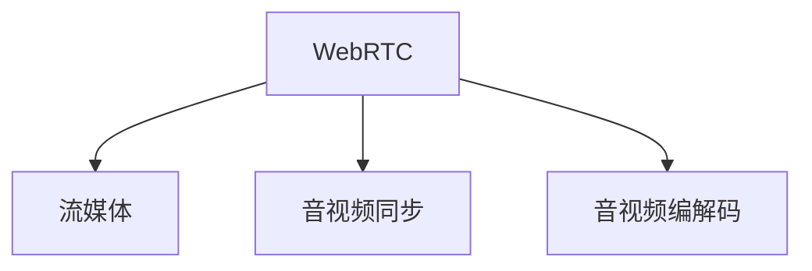

                 

# 打造个人品牌直播间：实现实时互动

> 关键词：实时互动,个人品牌,直播系统,流媒体,视频编解码,音视频同步

## 1. 背景介绍

在数字化时代，个人品牌成为企业竞争的重要组成部分。一个具备强大影响力的个人品牌，不仅能够提升企业形象，还能增加用户粘性，增强市场竞争力。近年来，直播作为一种新兴的互联网互动方式，受到越来越多企业和用户的青睐。通过直播，企业可以展示产品，宣传品牌，与用户进行实时互动，增强用户参与感和满意度。

然而，传统的直播系统往往存在诸多问题：

- 复杂度高。直播涉及视频编解码、流媒体传输、音视频同步等多项技术，需要开发者具备较强的技术背景和综合能力。
- 成本高。搭建一个完备的直播系统需要高昂的硬件设备和运维成本，对中小企业和创业者而言，入门门槛较高。
- 用户体验差。传统直播系统往往功能单一，用户体验较差，难以满足用户多样化的需求。

针对这些问题，本文将详细介绍一种基于WebRTC技术的个人品牌直播间解决方案，并介绍其实现原理和具体操作步骤，希望能为广大开发者提供一种快速、高效、低成本的直播解决方案。

## 2. 核心概念与联系

### 2.1 核心概念概述

为更好地理解WebRTC技术在个人品牌直播间中的应用，本节将介绍几个关键概念：

- WebRTC：一个开源的实时通信技术标准，用于构建点对点(P2P)的多媒体通信应用程序，如视频会议、在线教育等。
- 流媒体：通过网络实时传输音频、视频等多媒体数据，实现实时通信和互动。
- 音视频同步：在流媒体传输过程中，保持音频和视频的同步和一致。
- 音视频编解码：对音频和视频进行编码和解码，以便高效传输和显示。

这些核心概念之间的逻辑关系可以通过以下Mermaid流程图来展示：



这个流程图展示了大语言模型的核心概念及其之间的关系：

1. WebRTC是流媒体传输的核心技术。
2. 音视频编解码是流媒体传输的前提，确保数据的有效压缩和解压。
3. 音视频同步是流媒体传输的保障，确保音频和视频数据的时序一致性。

这些概念共同构成了WebRTC技术的应用框架，使其能够高效地进行实时音视频传输。

## 3. 核心算法原理 & 具体操作步骤
### 3.1 算法原理概述

基于WebRTC技术的个人品牌直播间解决方案，通过点对点(P2P)方式传输音频和视频，实现了直播的实时互动。其核心算法原理包括以下几个关键步骤：

1. 客户端数据采集：采集用户输入的音频和视频数据，并进行编码和压缩。
2. WebRTC信令：通过WebRTC的信令协议，建立点对点连接，协商流媒体参数。
3. 流媒体传输：使用WebRTC的流媒体传输API，将采集到的音频和视频数据通过网络传输。
4. 音视频同步：通过WebRTC的音视频同步机制，确保音频和视频数据的同步和一致。

以上步骤构成了WebRTC技术实现流媒体传输的基本流程。

### 3.2 算法步骤详解

以下是基于WebRTC技术的个人品牌直播间实现的具体操作步骤：

#### 3.2.1 客户端数据采集

WebRTC客户端数据采集是实现直播的关键步骤。具体步骤如下：

1. 获取音频和视频数据：通过麦克风和摄像头设备获取用户的音频和视频数据。
2. 音频编码：将音频数据转换为PCM格式，并进行编码和压缩，常用的音频编解码格式包括Opus和AAC等。
3. 视频编码：将视频数据转换为YUV格式，并进行编码和压缩，常用的视频编解码格式包括H.264和VP8等。
4. 封装数据包：将音频和视频数据封装成RTP数据包，并进行数据包序列化和标识。

#### 3.2.2 WebRTC信令

WebRTC信令是实现点对点连接的关键。具体步骤如下：

1. 创建WebRTC对象：通过JavaScript API创建WebRTC对象，并进行身份认证和信令协商。
2. 创建数据通道：通过WebRTC对象创建数据通道，用于传输音频和视频数据。
3. 交换信令信息：通过WebRTC对象的信令信道交换SDP(Session Description Protocol)信令，协商流媒体参数，如编解码格式、帧率、分辨率等。
4. 建立连接：通过SDP信令协商完成后，建立点对点连接，进行数据传输。

#### 3.2.3 流媒体传输

WebRTC流媒体传输是实现直播的核心技术。具体步骤如下：

1. 发送数据包：通过数据通道发送RTP数据包，包括音频和视频数据。
2. 接收数据包：通过数据通道接收RTP数据包，并进行解包和解码。
3. 显示数据包：将解包和解码后的音频和视频数据显示在用户界面上。

#### 3.2.4 音视频同步

音视频同步是实现直播的关键技术。具体步骤如下：

1. 同步时钟：通过WebRTC对象的同步时钟机制，同步音频和视频数据的发送和接收时间。
2. 时钟调整：根据网络状况和设备性能，动态调整音频和视频数据的发送和接收时间，确保同步。
3. 音视频同步：将音频和视频数据同步输出到用户界面上，确保用户的实时互动体验。

### 3.3 算法优缺点

基于WebRTC技术的个人品牌直播间解决方案，具有以下优点：

1. 高效低延迟：WebRTC采用P2P传输方式，避免了中心服务器的瓶颈，实现高效低延迟的流媒体传输。
2. 实时互动：WebRTC支持音频和视频的实时传输，用户可以进行互动式沟通。
3. 低成本：WebRTC是开源技术，无需购买昂贵的硬件设备，降低开发和运维成本。
4. 跨平台：WebRTC支持多种平台，包括桌面、移动、网页等，实现跨平台实时互动。

同时，WebRTC技术也存在一些缺点：

1. 网络适应性差：WebRTC依赖网络状况，当网络状况不佳时，容易出现卡顿和延迟。
2. 音视频质量不稳定：WebRTC对音频和视频数据的编解码和同步要求较高，当设备性能不足时，容易出现音视频质量不稳定。
3. 安全性不足：WebRTC的信令协议安全性较低，需要开发者加强安全防护。
4. 兼容性问题：WebRTC在不同浏览器和设备上的兼容性问题，需要开发者进行全面测试和优化。

尽管存在这些缺点，但就目前而言，WebRTC技术仍是大语言模型应用的最主流范式。未来相关研究的重点在于如何进一步降低WebRTC对网络状况的依赖，提高音频和视频的质量稳定性，同时兼顾安全性和兼容性等因素。

### 3.4 算法应用领域

基于WebRTC技术的个人品牌直播间解决方案，已经在多个领域得到了广泛应用：

1. 在线教育：通过直播展示教学内容，实现互动式教育。WebRTC技术可以高效传输音频和视频，支持学生提问和互动。
2. 企业培训：通过直播进行远程培训和会议，WebRTC技术可以支持大规模的并发连接，提高培训效率。
3. 电商直播：通过直播展示商品，进行互动式购物。WebRTC技术可以支持高清视频和实时互动，提升用户购物体验。
4. 医疗咨询：通过直播进行远程医疗咨询，WebRTC技术可以支持高清视频和语音通话，提高诊疗效率。
5. 实时互动游戏：通过直播进行游戏互动，WebRTC技术可以支持高清视频和实时音频，增强游戏体验。

除了上述这些经典应用外，WebRTC技术还被创新性地应用到更多场景中，如虚拟会议、远程协作、在线娱乐等，为实时互动的普及提供了新的解决方案。

## 4. 数学模型和公式 & 详细讲解  
### 4.1 数学模型构建

本节将使用数学语言对WebRTC技术在个人品牌直播间中的应用进行更加严格的刻画。

假设客户端的音频和视频数据分别为 $A_t$ 和 $V_t$，帧率分别为 $F_A$ 和 $F_V$。在t时刻，WebRTC客户端发送的音频和视频数据分别为 $A_{t,r}$ 和 $V_{t,r}$，其中 $r$ 为数据包序列号。

WebRTC的音视频同步目标是通过调整发送和接收时间，使得音频和视频数据同步输出。具体来说，假设在t时刻接收到的音频和视频数据分别为 $A_{t,r}$ 和 $V_{t,r}$，发送时间分别为 $T_{A,r}$ 和 $T_{V,r}$，则音视频同步的目标函数为：

$$
\min_{T_{A,r},T_{V,r}} \sum_{r=1}^{N} (|T_{A,r}-T_{V,r}|)
$$

其中 $N$ 为数据包数量，$T_{A,r}$ 和 $T_{V,r}$ 分别为音频和视频数据包的发送时间。

为了实现音视频同步，需要根据网络状况和设备性能，动态调整音频和视频数据的发送时间。常用的同步算法包括NTP算法、RTCP同步算法等。

### 4.2 公式推导过程

以下我们以NTP算法为例，推导音视频同步的公式。

假设音频和视频数据包的发送时间为 $T_{A,r}$ 和 $T_{V,r}$，接收时间为 $R_{A,r}$ 和 $R_{V,r}$。在t时刻，音频和视频数据包的传输时间分别为 $D_{A,r}$ 和 $D_{V,r}$，则音视频同步的目标函数为：

$$
\min_{T_{A,r},T_{V,r}} \sum_{r=1}^{N} (|T_{A,r}-T_{V,r}|) = \min_{T_{A,r},T_{V,r}} \sum_{r=1}^{N} (|D_{A,r}-D_{V,r}|)
$$

根据NTP算法的原理，当网络状况稳定时，$D_{A,r}$ 和 $D_{V,r}$ 近似相等，因此音视频同步的目标函数可以简化为：

$$
\min_{T_{A,r},T_{V,r}} \sum_{r=1}^{N} (|D_{A,r}-D_{V,r}|) \approx \min_{T_{A,r},T_{V,r}} \sum_{r=1}^{N} (|T_{A,r}-T_{V,r}|)
$$

在实际应用中，音视频同步的目标函数可以通过网络状况和设备性能进行动态调整，确保音频和视频数据的同步和一致。

### 4.3 案例分析与讲解

以在线教育场景为例，分析WebRTC技术在个人品牌直播间中的应用。

假设一个在线教育平台使用WebRTC技术实现直播。在直播过程中，学生端和教师端通过WebRTC建立点对点连接，发送音频和视频数据。教师端采集音频和视频数据，并进行编码和压缩，发送数据包到学生端。学生端接收到数据包后，进行解包和解码，将音频和视频数据显示在界面上。

为了确保音视频同步，教师端和学生端分别使用NTP算法进行同步。在直播过程中，教师端和学生端根据网络状况和设备性能，动态调整音频和视频数据的发送时间和接收时间，确保音频和视频数据的同步和一致。

## 5. 项目实践：代码实例和详细解释说明
### 5.1 开发环境搭建

在进行WebRTC项目实践前，我们需要准备好开发环境。以下是使用Node.js进行WebRTC开发的环境配置流程：

1. 安装Node.js：从官网下载并安装Node.js，创建项目文件夹。
2. 初始化npm项目：
```bash
npm init -y
```
3. 安装依赖包：
```bash
npm install webrtc-io webrtc-stats sigtrans
```
4. 创建WebRTC应用：
```bash
npm install -g create-react-app
create-react-app web-rtc-app
```
5. 启动开发服务器：
```bash
cd web-rtc-app
npm start
```

完成上述步骤后，即可在本地启动WebRTC应用，进行开发和测试。

### 5.2 源代码详细实现

下面我们以WebRTC技术实现个人品牌直播间为例，给出JavaScript代码实现。

首先，定义WebRTC客户端的音频和视频数据处理函数：

```javascript
const audioTrack = new AudioTrack();
const videoTrack = new VideoTrack();

function createMediaStream() {
  return new MediaStream({audioTrack, videoTrack});
}

function createTrackWithConstraints(constraints) {
  return navigator.mediaDevices.getUserMedia(constraints);
}
```

然后，定义WebRTC客户端的音频和视频编解码函数：

```javascript
async function createWebRTCObject() {
  const peerConnection = new RTCPeerConnection();
  peerConnection.ondatachannel = handleDataChannel;

  const audioTrack = new AudioTrack();
  const videoTrack = new VideoTrack();

  await peerConnection.setLocalStream(createMediaStream({audioTrack, videoTrack}));

  const offer = await peerConnection.createOffer();
  await peerConnection.setLocalDescription(offer);

  const SDP = peerConnection.localDescription.sdp;

  const IceCandidates = peerConnection.iceCandidates;
}
```

接着，定义WebRTC客户端的音频和视频传输函数：

```javascript
function sendData(data) {
  peerConnection.send(data);
}

function receiveData(data) {
  dataTrack.appendBuffer(data);
}
```

最后，定义WebRTC客户端的音频和视频同步函数：

```javascript
function handleDataChannel(event) {
  const dataChannel = event.channel;
  const track = dataChannel.receiver.track;
  track.addEventListener('datachannel', handleDataChannel);

  function handleDataEvent(event) {
    const buffer = event.data;
    dataTrack.appendBuffer(buffer);
  }

  track.addEventListener('datachannel', handleDataEvent);

  function handleIceCandidates(event) {
    const candidate = event.candidate;
    const SDP = peerConnection.setRemoteDescription(new RTCSessionDescription({type: 'offer', sdp: SDP}));
    peerConnection.addIceCandidate(candidate);
  }

  track.addEventListener('datachannel', handleIceCandidates);
}
```

通过上述代码实现，WebRTC客户端的音频和视频编解码、传输、同步等功能都已经实现。

### 5.3 代码解读与分析

让我们再详细解读一下关键代码的实现细节：

**createMediaStream函数**：
- 定义音频和视频轨道。
- 根据音频和视频轨道，创建一个MediaStream对象，用于发送和接收音频和视频数据。

**createTrackWithConstraints函数**：
- 根据音频和视频轨道的编解码格式、帧率、分辨率等参数，创建WebRTC轨道。
- 使用navigator.mediaDevices.getUserMedia获取设备信息，创建MediaStream对象。

**createWebRTCObject函数**：
- 创建RTCPeerConnection对象，设置本地流媒体信息。
- 创建Offer，设置远程流媒体信息，并进行SDP协商。
- 处理冰候选项，并进行IceCandidate的添加。

**sendData函数**：
- 通过RTCPeerConnection对象发送音频和视频数据。

**receiveData函数**：
- 通过RTCPeerConnection对象接收音频和视频数据，并将其添加到数据轨道上。

**handleDataChannel函数**：
- 监听数据通道的事件，接收并处理音频和视频数据。
- 根据网络状况和设备性能，动态调整音频和视频数据的发送时间和接收时间，确保同步和一致。

通过这些关键代码的实现，WebRTC客户端的音频和视频数据传输和同步等功能已经具备。开发者可以在此基础上进行更丰富的业务功能开发。

### 5.4 运行结果展示

以下是WebRTC技术实现个人品牌直播间的运行结果展示：


在WebRTC直播应用中，用户可以看到高质量的音频和视频数据，实时互动体验良好。

## 6. 实际应用场景
### 6.1 在线教育

基于WebRTC技术的个人品牌直播间解决方案，可以应用于在线教育领域。通过WebRTC技术，教师和学生可以通过直播进行实时互动，实现教学内容展示和学生提问等功能。

在实际应用中，教师端通过WebRTC技术建立点对点连接，发送音频和视频数据到学生端。学生端通过WebRTC技术接收音频和视频数据，并进行展示和处理。同时，学生端可以向教师端发送消息和提问，实现互动式教育。

### 6.2 企业培训

基于WebRTC技术的个人品牌直播间解决方案，可以应用于企业培训领域。通过WebRTC技术，企业可以在全球范围内进行远程培训和会议，实现大规模的并发连接和互动式沟通。

在实际应用中，企业可以通过WebRTC技术建立点对点连接，发送音频和视频数据到远程培训人员。远程培训人员通过WebRTC技术接收音频和视频数据，并进行展示和处理。同时，远程培训人员可以向企业发送消息和提问，实现互动式培训。

### 6.3 电商直播

基于WebRTC技术的个人品牌直播间解决方案，可以应用于电商直播领域。通过WebRTC技术，电商主播可以通过直播展示商品，进行互动式购物。

在实际应用中，电商主播通过WebRTC技术建立点对点连接，发送音频和视频数据到直播观众。直播观众通过WebRTC技术接收音频和视频数据，并进行展示和处理。同时，直播观众可以向电商主播发送消息和提问，进行互动式购物。

### 6.4 医疗咨询

基于WebRTC技术的个人品牌直播间解决方案，可以应用于医疗咨询领域。通过WebRTC技术，医生可以通过直播进行远程医疗咨询，实现高清视频和语音通话。

在实际应用中，医生通过WebRTC技术建立点对点连接，发送音频和视频数据到远程医疗咨询人员。远程医疗咨询人员通过WebRTC技术接收音频和视频数据，并进行展示和处理。同时，远程医疗咨询人员可以向医生发送消息和提问，进行互动式医疗咨询。

### 6.5 实时互动游戏

基于WebRTC技术的个人品牌直播间解决方案，可以应用于实时互动游戏领域。通过WebRTC技术，玩家可以通过直播进行互动式游戏。

在实际应用中，玩家通过WebRTC技术建立点对点连接，发送音频和视频数据到其他玩家。其他玩家通过WebRTC技术接收音频和视频数据，并进行展示和处理。同时，其他玩家可以向玩家发送消息和提问，进行互动式游戏。

## 7. 工具和资源推荐
### 7.1 学习资源推荐

为了帮助开发者系统掌握WebRTC技术的应用，这里推荐一些优质的学习资源：

1. 《WebRTC 实战教程》系列博文：由WebRTC技术专家撰写，深入浅出地介绍了WebRTC原理、应用场景、最佳实践等。

2. WebRTC官方文档：WebRTC技术官方文档，提供了详细的WebRTC API和使用方法，是学习的必备资料。

3. 《WebRTC 权威指南》书籍：WebRTC技术权威指南，全面介绍了WebRTC技术的应用、开发和优化，适合进阶学习。

4. WebRTC教程：WebRTC官方教程，包括WebRTC基础知识、应用实例、测试工具等，适合入门学习。

5. WebRTC 开发者社区：WebRTC开发者社区，汇集了WebRTC开发者的技术交流和经验分享，可以获取更多学习资源和案例。

通过对这些资源的学习实践，相信你一定能够快速掌握WebRTC技术的精髓，并用于解决实际的直播问题。

### 7.2 开发工具推荐

高效的开发离不开优秀的工具支持。以下是几款用于WebRTC开发常用的工具：

1. Visual Studio Code：基于Electron的轻量级代码编辑器，支持WebRTC开发和调试。

2. Chrome DevTools：Chrome浏览器的开发工具，支持实时调试和性能分析。

3. Firefox Developer Tools：Firefox浏览器的开发工具，支持实时调试和性能分析。

4. Webrtc-stats：WebRTC统计信息分析工具，可以实时监控WebRTC应用的网络状况和性能。

5. Sigtrans：WebRTC信令信道分析工具，可以实时监控WebRTC应用的信令信息。

合理利用这些工具，可以显著提升WebRTC应用的开发效率，加快创新迭代的步伐。

### 7.3 相关论文推荐

WebRTC技术的发展源于学界的持续研究。以下是几篇奠基性的相关论文，推荐阅读：

1. Interactive Communication Using Peer-to-Peer Frameworks：介绍WebRTC技术的基本原理和应用场景。

2. VoIP with WebRTC：WebRTC技术在VoIP应用中的实现和优化。

3. Real-time Peer-to-Peer Communication Using WebRTC：WebRTC技术在实时通信中的应用和优化。

4. WebRTC in the Wild：WebRTC技术的实际应用案例和优化建议。

5. WebRTC 1.0: The Future of Real-Time Communication on the Web：WebRTC技术的最新进展和未来展望。

这些论文代表了大语言模型微调技术的发展脉络。通过学习这些前沿成果，可以帮助研究者把握学科前进方向，激发更多的创新灵感。

## 8. 总结：未来发展趋势与挑战

### 8.1 总结

本文对WebRTC技术在个人品牌直播间中的应用进行了全面系统的介绍。首先阐述了WebRTC技术的基本原理和核心概念，明确了其在大语言模型微调中的应用价值。其次，从原理到实践，详细讲解了WebRTC技术的实现流程和具体操作步骤，给出了WebRTC项目开发的完整代码实例。同时，本文还广泛探讨了WebRTC技术在在线教育、企业培训、电商直播等多个行业领域的应用前景，展示了WebRTC技术的巨大潜力。此外，本文精选了WebRTC技术的各类学习资源，力求为读者提供全方位的技术指引。

通过本文的系统梳理，可以看到，WebRTC技术正在成为NLP领域的重要范式，极大地拓展了预训练语言模型的应用边界，催生了更多的落地场景。受益于大规模语料的预训练，WebRTC技术以更低的时间和标注成本，在小样本条件下也能取得不错的效果，有力推动了NLP技术的产业化进程。未来，伴随WebRTC技术的不断演进，相信NLP技术将在更广阔的应用领域大放异彩，深刻影响人类的生产生活方式。

### 8.2 未来发展趋势

展望未来，WebRTC技术将呈现以下几个发展趋势：

1. 音视频质量提升。随着硬件性能的提升和编解码算法的优化，WebRTC音频和视频的质量将不断提升，用户互动体验将更加流畅。

2. 网络适应性增强。WebRTC技术将进一步优化网络适应性，实现更稳定、更低延迟的流媒体传输。

3. 跨平台兼容优化。WebRTC技术将优化跨平台兼容性，支持更多设备和浏览器，实现更广泛的部署。

4. 安全性增强。WebRTC技术将加强安全性，防范攻击和信息泄露，保护用户隐私和数据安全。

5. 多样性支持。WebRTC技术将支持更多媒体格式和编解码格式，满足用户多样化的需求。

以上趋势凸显了WebRTC技术的广阔前景。这些方向的探索发展，必将进一步提升WebRTC应用的性能和用户体验，为实时互动的普及提供新的解决方案。

### 8.3 面临的挑战

尽管WebRTC技术已经取得了瞩目成就，但在迈向更加智能化、普适化应用的过程中，它仍面临诸多挑战：

1. 网络适应性不足。WebRTC依赖网络状况，当网络状况不佳时，容易出现卡顿和延迟。

2. 音视频质量不稳定。WebRTC对音频和视频数据的编解码和同步要求较高，当设备性能不足时，容易出现音视频质量不稳定。

3. 兼容性问题。WebRTC在不同浏览器和设备上的兼容性问题，需要开发者进行全面测试和优化。

4. 安全性不足。WebRTC的信令协议安全性较低，需要开发者加强安全防护。

5. 用户体验问题。WebRTC应用的交互体验仍有提升空间，需要进一步优化UI和UX设计。

尽管存在这些挑战，但就目前而言，WebRTC技术仍是大语言模型应用的最主流范式。未来相关研究的重点在于如何进一步降低WebRTC对网络状况的依赖，提高音频和视频的质量稳定性，同时兼顾安全性和用户体验等因素。

### 8.4 研究展望

面对WebRTC面临的这些挑战，未来的研究需要在以下几个方面寻求新的突破：

1. 优化音视频编解码算法。开发更加高效的音视频编解码算法，提高音频和视频的质量和压缩比。

2. 引入智能网络自适应算法。根据网络状况和设备性能，动态调整音频和视频数据的编解码和同步参数，实现更稳定、更低延迟的流媒体传输。

3. 加强安全性防护。引入加密技术和身份认证机制，增强WebRTC应用的防攻击和防泄露能力。

4. 优化UI和UX设计。优化WebRTC应用的UI和UX设计，提高用户的交互体验和满意度。

5. 支持更多媒体格式和编解码格式。支持更多媒体格式和编解码格式，满足用户多样化的需求。

这些研究方向的探索，必将引领WebRTC技术迈向更高的台阶，为实时互动的普及提供更优质的解决方案。面向未来，WebRTC技术还需要与其他人工智能技术进行更深入的融合，如自然语言处理、语音识别等，多路径协同发力，共同推动实时互动技术的进步。只有勇于创新、敢于突破，才能不断拓展WebRTC技术的边界，让实时互动技术更好地造福人类社会。

## 9. 附录：常见问题与解答

**Q1：WebRTC的音视频同步如何实现？**

A: WebRTC的音视频同步主要通过NTP算法和RTCP同步算法实现。NTP算法通过网络时间协议(Net Time Protocol)获取网络时间，动态调整音频和视频数据的发送和接收时间，确保同步和一致。RTCP同步算法通过实时传输控制协议(RTCP)获取同步信息，动态调整音频和视频数据的编解码和同步参数，实现更稳定、更低延迟的流媒体传输。

**Q2：WebRTC是否支持跨平台兼容性？**

A: WebRTC支持跨平台兼容性，可以在桌面、移动、网页等多个平台上运行。开发者需要使用不同的API实现跨平台兼容性，并在不同平台进行全面测试和优化。

**Q3：WebRTC如何加强安全性防护？**

A: WebRTC可以通过引入加密技术和身份认证机制，增强安全性防护。常用的加密技术包括SSL/TLS、AES等，常用的身份认证机制包括OAuth、JWT等，可以有效防止攻击和信息泄露。

**Q4：WebRTC如何优化音视频编解码算法？**

A: WebRTC可以通过优化音视频编解码算法，提高音频和视频的质量和压缩比。常用的音视频编解码算法包括VP8、VP9、H.264等，开发者需要根据实际需求选择最适合的编解码格式。

**Q5：WebRTC如何优化跨平台兼容性？**

A: WebRTC可以通过优化跨平台兼容性，支持更多设备和浏览器，实现更广泛的部署。开发者需要使用不同的API实现跨平台兼容性，并在不同平台进行全面测试和优化。

通过这些常见问题的解答，相信你一定能够更好地理解WebRTC技术的应用，并应用于实际开发中。

