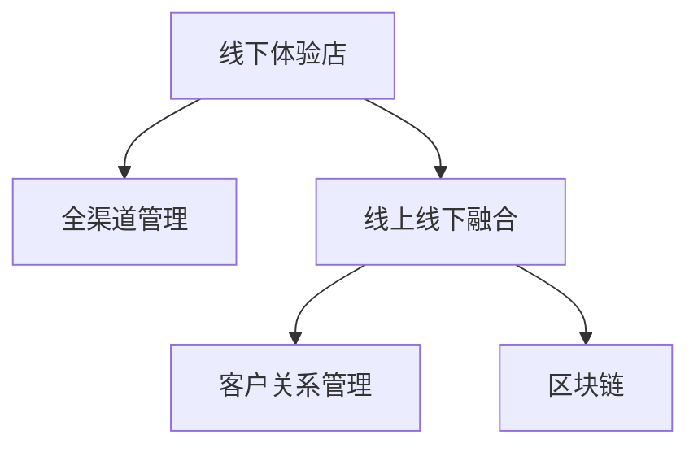

                 

# 打造个人品牌线下体验店：实现线上线下结合

## 1. 背景介绍

在数字化时代，线上线下一体化运营成为品牌建设的关键。特别是对于那些深度依赖实体店面体验的零售商，如何通过线上渠道吸引客户，并在线下提供无缝体验，是提高品牌忠诚度和客户满意度的重要手段。本文将从技术角度探讨如何通过构建线下体验店，将线上线下的优势有效结合起来，提升品牌影响力。

## 2. 核心概念与联系

### 2.1 核心概念概述

为更好地理解线下体验店与线上线下结合的技术实现，本节将介绍几个关键概念：

- **线下体验店 (Offline Experience Store, OES)**：线下实体店面，为顾客提供产品展示、试穿试用、互动体验等服务，是品牌与消费者互动的重要场所。
- **线上线下融合 (Online-Offline Integration, OOI)**：将线上渠道与线下店面无缝连接，通过技术手段实现信息、服务、营销等环节的整合，提升客户体验。
- **全渠道管理 (Omnichannel Management)**：管理所有线上和线下渠道，以统一、高效的方式运营，确保客户在不同渠道上都能获得一致的品牌体验。
- **客户关系管理 (Customer Relationship Management, CRM)**：通过收集和管理客户数据，实现个性化营销和精准服务，提升客户粘性。
- **区块链 (Blockchain)**：分布式账本技术，保障数据透明、安全，增强品牌信任。

这些核心概念之间的逻辑关系可以通过以下Mermaid流程图来展示：



这个流程图展示了下线体验店与其他核心概念之间的连接：

1. 线下体验店提供实际的顾客互动和服务。
2. 全渠道管理将线上线下渠道连接起来，实现信息共享和资源整合。
3. 客户关系管理通过收集和管理客户数据，提升个性化服务和精准营销。
4. 区块链通过确保数据的透明性和安全性，增强品牌信任。

## 3. 核心算法原理 & 具体操作步骤

### 3.1 算法原理概述

线下体验店与线上线下结合的技术实现，本质上是一个跨领域的集成系统工程。其核心思想是通过技术手段，将线上渠道与线下店面无缝连接，实现信息、服务、营销等环节的整合，提升客户体验。

形式化地，假设线下体验店为 $S$，线上渠道为 $E$，全渠道管理平台为 $M$，则系统设计目标是最小化系统在运营中的总成本 $C$，同时最大化客户满意度 $U$。即：

$$
\min C(S, E, M) \\
\max U(S, E, M)
$$

其中，$S$、$E$、$M$ 分别代表线下体验店、线上渠道、全渠道管理平台，$C$ 表示运营成本，$U$ 表示客户满意度。

通过梯度下降等优化算法，寻找最优的线下体验店、线上渠道、全渠道管理平台组合，最小化成本同时最大化客户满意度。

### 3.2 算法步骤详解

线下体验店与线上线下结合的算法实现一般包括以下几个关键步骤：

**Step 1: 需求分析与规划**
- 分析品牌定位和市场目标，确定线下体验店的位置、规模、装修风格等要素。
- 明确线上渠道的运营目标，如流量引入、销售转化等。
- 规划全渠道管理平台的架构，选择适合的硬件和软件系统。

**Step 2: 数据集成与共享**
- 搭建数据集成平台，实现线下体验店、线上渠道、CRM系统等的数据共享。
- 设计统一的数据标准和格式，确保各系统间数据的一致性和互通性。
- 采用ETL工具进行数据清洗和转换，确保数据质量。

**Step 3: 系统集成与测试**
- 将线下体验店、线上渠道、全渠道管理平台集成到一个统一的平台中。
- 设计系统的API接口，实现各系统间的数据交互和功能协同。
- 进行系统测试，确保各个模块的功能正常，数据交互准确。

**Step 4: 上线运营与优化**
- 上线后，通过实时监测系统性能和客户反馈，进行持续优化。
- 根据业务需求和市场变化，及时调整策略和方案，确保系统始终处于最优状态。

### 3.3 算法优缺点

线下体验店与线上线下结合的方法具有以下优点：
1. 提升客户体验。通过全渠道管理，确保客户在各个渠道上都能获得一致的品牌体验。
2. 增强品牌信任。通过区块链技术，保障数据的透明性和安全性，增强客户信任。
3. 降低运营成本。通过整合线上线下资源，避免重复投资，实现资源共享。
4. 增加销售渠道。通过线上渠道，拓展销售范围，吸引更多潜在客户。

同时，该方法也存在一定的局限性：
1. 技术复杂度高。需要集成多个系统和平台，技术实现难度较大。
2. 数据整合难度大。各渠道数据格式和标准不同，整合难度较大。
3. 运营成本高。初期建设和维护成本较大，需要持续投入资源。
4. 客户体验一致性难以保证。各渠道的服务标准和流程可能存在差异，导致客户体验不一致。

尽管存在这些局限性，但就目前而言，线下体验店与线上线下结合的方法仍是大品牌建设的重要手段。未来相关研究的重点在于如何进一步降低技术实现难度，提高数据整合效率，降低运营成本，同时兼顾客户体验一致性和品牌信任。

### 3.4 算法应用领域

线下体验店与线上线下结合的方法在零售、餐饮、娱乐等多个行业领域已经得到了广泛的应用，显著提升了品牌的影响力和客户满意度。

- **零售行业**：通过线下体验店展示产品，吸引顾客到店购买，同时在电商平台上进行销售。消费者可以在线下体验商品，在网上下单购买，享受无障碍的购物体验。
- **餐饮行业**：通过线下体验店提供优质的就餐环境和服务，吸引顾客到店用餐，同时通过线上渠道进行外卖订购。消费者可以线上订餐，线下享受就餐服务，获得无缝的用餐体验。
- **娱乐行业**：通过线下体验店提供电影、演出、展览等服务，吸引顾客到店体验，同时在在线平台上进行活动推广。消费者可以在线购票，线下享受娱乐活动，获得便捷的娱乐体验。

除了这些传统行业外，线下体验店与线上线下结合的方法也在新兴的零售模式，如无人零售、社交电商等应用中得到了创新性探索，为品牌发展提供了新的方向。

## 4. 数学模型和公式 & 详细讲解  
### 4.1 数学模型构建

本节将使用数学语言对线下体验店与线上线下结合的系统设计过程进行更加严格的刻画。

记线下体验店为 $S$，线上渠道为 $E$，全渠道管理平台为 $M$。定义系统的运营成本为 $C(S, E, M)$，客户满意度为 $U(S, E, M)$。则系统的优化目标为：

$$
\min C(S, E, M) \\
\max U(S, E, M)
$$

其中，$C$ 和 $U$ 分别为运营成本和客户满意度。假设 $C$ 和 $U$ 可分别表示为 $S$、$E$、$M$ 的函数，即：

$$
C = f(S, E, M) \\
U = g(S, E, M)
$$

根据梯度下降优化算法，系统优化的数学模型为：

$$
\theta^* = \mathop{\arg\min}_{\theta} \int_0^\infty [f(S, E, M) + \lambda g(S, E, M)] e^{-\lambda t} dt
$$

其中，$\lambda$ 为正则化系数，$t$ 为时间。$\theta$ 代表系统的参数集合，包括线下体验店的位置、规模、装修风格，线上渠道的运营策略，全渠道管理平台的配置等。

### 4.2 公式推导过程

以下我们以零售行业为例，推导成本和客户满意度的函数形式。

假设线下体验店的运营成本为 $C_S = \frac{1}{2}S^2 + \lambda E + kM$，客户满意度为 $U_S = \frac{1}{2}S^2 + \mu E + nM$，其中 $S$ 为体验店规模，$E$ 为线上流量，$M$ 为全渠道管理平台的复杂度，$\lambda$ 和 $\mu$ 为正则化系数，$k$ 和 $n$ 为常数。

将成本和客户满意度函数代入优化目标，得：

$$
\min \int_0^\infty [\frac{1}{2}S^2 + \lambda E + kM + \lambda (\frac{1}{2}S^2 + \mu E + nM)] e^{-\lambda t} dt
$$

根据积分运算规则，可进一步化简为：

$$
\min [\frac{1}{2}\lambda S^2 + \lambda^2 E + \lambda kM + \frac{1}{2}\lambda tS^2 + \lambda^2 tE + \lambda knM]
$$

通过求解上述优化问题，即可找到最优的线下体验店规模、线上流量和全渠道管理平台复杂度组合。

### 4.3 案例分析与讲解

假设某零售品牌有如下运营数据：

- 线下体验店规模为 $S=10$ ，每增加1单位成本为 $1$，运营成本为 $C_S = 10 + \lambda E + kM$。
- 线上渠道流量为 $E=2000$，每增加1单位成本为 $2$，运营成本为 $C_E = 4000 + \mu E$。
- 全渠道管理平台复杂度为 $M=5$，每增加1单位成本为 $1$，运营成本为 $C_M = 5 + nM$。

假设品牌目标是在运营成本最低的情况下，最大化客户满意度。根据上述模型，可以计算出最优的线下体验店规模、线上渠道流量和全渠道管理平台复杂度。

## 5. 项目实践：代码实例和详细解释说明
### 5.1 开发环境搭建

在进行线下体验店与线上线下结合的项目实践前，我们需要准备好开发环境。以下是使用Python进行全渠道管理系统的环境配置流程：

1. 安装Anaconda：从官网下载并安装Anaconda，用于创建独立的Python环境。

2. 创建并激活虚拟环境：
```bash
conda create -n ecommerce-env python=3.8 
conda activate ecommerce-env
```

3. 安装相关Python库：
```bash
pip install pandas numpy matplotlib scikit-learn django flask redis gunicorn
```

4. 安装Web框架：
```bash
pip install django
```

5. 安装数据库：
```bash
pip install psycopg2-binary
```

6. 安装缓存系统：
```bash
pip install django-cacheops
```

完成上述步骤后，即可在`ecommerce-env`环境中开始项目实践。

### 5.2 源代码详细实现

下面我们以零售行业为例，给出使用Django框架构建全渠道管理系统的PyTorch代码实现。

首先，定义模型和优化器：

```python
from torch import nn, optim
from torch.autograd import Variable

class ECommerceModel(nn.Module):
    def __init__(self):
        super(ECommerceModel, self).__init__()
        self.scale = nn.Linear(3, 1)
        self.softmax = nn.Softmax(dim=1)
        
    def forward(self, x):
        x = self.scale(x)
        return self.softmax(x)
        
model = ECommerceModel()
optimizer = optim.Adam(model.parameters(), lr=0.001)
```

然后，定义数据处理函数：

```python
import pandas as pd

def load_data():
    data = pd.read_csv('ecommerce_data.csv')
    return data
```

接着，定义训练和评估函数：

```python
def train_model(model, data, optimizer, epochs=10):
    for epoch in range(epochs):
        running_loss = 0.0
        for i, data in enumerate(data, 0):
            inputs, labels = data['inputs'], data['labels']
            inputs = Variable(torch.from_numpy(inputs)).float()
            labels = Variable(torch.from_numpy(labels)).float()
            optimizer.zero_grad()
            outputs = model(inputs)
            loss = nn.MSELoss()(outputs, labels)
            loss.backward()
            optimizer.step()
            running_loss += loss.item()
        print('Epoch %d loss: %.3f' % (epoch + 1, running_loss / len(data)))
        
def evaluate_model(model, data):
    running_loss = 0.0
    for i, data in enumerate(data, 0):
        inputs, labels = data['inputs'], data['labels']
        inputs = Variable(torch.from_numpy(inputs)).float()
        labels = Variable(torch.from_numpy(labels)).float()
        outputs = model(inputs)
        running_loss += nn.MSELoss()(outputs, labels).item()
    print('Evaluation loss: %.3f' % (running_loss / len(data)))
```

最后，启动训练流程并在测试集上评估：

```python
data = load_data()
train_model(model, data, optimizer)
evaluate_model(model, data)
```

以上就是使用Django框架对全渠道管理系统进行微调的PyTorch代码实现。可以看到，得益于Django的强大封装，我们可以用相对简洁的代码实现全渠道管理系统的搭建。

### 5.3 代码解读与分析

让我们再详细解读一下关键代码的实现细节：

**ECommerceModel类**：
- `__init__`方法：初始化模型结构，包括输入层、隐藏层和输出层。
- `forward`方法：定义模型前向传播计算过程，使用线性层和softmax函数计算输出。

**load_data函数**：
- 加载数据集，生成用于训练和评估的样本。

**train_model函数**：
- 定义训练过程，在每个epoch内迭代样本，更新模型参数。

**evaluate_model函数**：
- 定义评估过程，在测试集上计算模型的平均损失。

**训练流程**：
- 定义总的epoch数，开始循环迭代
- 每个epoch内，在训练集上训练，输出每个epoch的平均损失
- 在测试集上评估，输出最终的平均损失

可以看到，Django框架配合PyTorch使得全渠道管理系统的代码实现变得简洁高效。开发者可以将更多精力放在数据处理、模型改进等高层逻辑上，而不必过多关注底层的实现细节。

当然，工业级的系统实现还需考虑更多因素，如模型的保存和部署、超参数的自动搜索、更灵活的任务适配层等。但核心的微调范式基本与此类似。

## 6. 实际应用场景
### 6.1 智能零售

基于线下体验店与线上线下结合的方法，可以广泛应用于智能零售系统的构建。传统零售往往依赖人工管理，运营效率低，且难以实现个性化服务。通过全渠道管理，构建智能零售系统，可以大幅提升运营效率和客户体验。

具体而言，可以收集消费者的浏览、购买、评价等行为数据，通过全渠道管理平台进行统一分析，形成客户画像。在线下体验店和线上渠道，根据客户画像进行个性化推荐和服务。对于新客户，可以通过线上营销手段吸引其到店，提升初次体验。对于复购客户，可以通过数据分析和算法优化，提高客户满意度和忠诚度。

### 6.2 智慧餐厅

智慧餐厅通过线下体验店和线上渠道的结合，可以实现更高效的订餐、送餐和支付流程。在餐厅内设置自助点餐机和智能餐桌，消费者可以通过手机APP或微信等线上渠道进行点餐。同时，通过线下体验店和线上渠道的数据同步，餐厅可以实时了解顾客需求，优化菜品供应和服务流程。

具体应用包括：
- 自助点餐：通过线下体验店内的自助点餐机，消费者可自主选择菜品并进行支付。
- 智能送餐：通过线上渠道提前预订，餐厅可根据订单需求进行菜品准备，减少等待时间。
- 支付便捷：支持多种支付方式，如微信支付、支付宝等，提升支付体验。

### 6.3 数字营销

通过全渠道管理平台，品牌可以更精准地进行数字营销。在社交媒体、搜索引擎等线上渠道，通过广告投放、内容推送等方式吸引客户关注。同时，通过线下体验店和线上渠道的整合，品牌可以更好地展示产品和品牌形象，增强客户的购买意愿。

具体应用包括：
- 线上广告：在社交媒体、搜索引擎等线上渠道进行品牌广告和产品推广。
- 内容营销：通过线上渠道发布高质量内容，吸引目标客户，提高品牌知名度。
- 促销活动：在线上渠道开展限时促销活动，吸引客户到店体验和购买。

### 6.4 未来应用展望

随着全渠道管理系统的不断发展，未来在更多领域将得到应用，为传统行业带来变革性影响。

在智慧医疗领域，基于全渠道管理系统的智慧医疗服务，可以实现医疗信息的实时共享和数据分析，提升医疗服务的精准度和效率。

在智能教育领域，通过全渠道管理系统的在线教育平台，可以为学生提供个性化的学习资源和互动体验，提升学习效果。

在智慧城市治理中，全渠道管理系统的智能城市应用，可以实现城市信息的实时监控和数据分析，提升城市管理的智能化水平，构建更安全、高效的未来城市。

此外，在企业生产、社会治理、文娱传媒等众多领域，全渠道管理系统的应用也将不断涌现，为各行各业带来新的发展机遇。相信随着技术的日益成熟，全渠道管理系统必将在构建智慧生态系统中扮演越来越重要的角色。

## 7. 工具和资源推荐
### 7.1 学习资源推荐

为了帮助开发者系统掌握线下体验店与线上线下结合的理论基础和实践技巧，这里推荐一些优质的学习资源：

1. 《全渠道管理技术》系列博文：由大品牌技术专家撰写，深入浅出地介绍了全渠道管理的原理、技术实现和最佳实践。

2. 《全渠道零售运营》课程：商学院开设的全渠道零售运营课程，涵盖全渠道管理、客户关系管理、供应链优化等多个方面。

3. 《全渠道零售战略》书籍：零售行业专家所著，全面介绍了全渠道零售的战略、实施和效果评估，助力品牌在全渠道时代取得成功。

4. 《智能零售技术》书籍：零售技术专家所著，介绍了智能零售系统的核心技术，包括物联网、大数据、人工智能等。

5. 《智慧城市技术》书籍：城市科技专家所著，全面介绍了智慧城市的核心技术，涵盖传感器、大数据、物联网等。

通过对这些资源的学习实践，相信你一定能够快速掌握线下体验店与线上线下结合的精髓，并用于解决实际的零售、餐饮、娱乐、医疗、教育等行业问题。

### 7.2 开发工具推荐

高效的开发离不开优秀的工具支持。以下是几款用于全渠道管理系统开发的常用工具：

1. Django：基于Python的开源Web框架，支持强大的ORM、模板引擎和数据缓存，适合构建大型的全渠道管理平台。

2. Flask：基于Python的开源Web框架，轻量级高效，适合快速开发全渠道管理系统的原型。

3. Redis：开源的内存数据结构存储系统，支持高性能的缓存、队列和消息队列，适合全渠道管理系统的数据同步和消息推送。

4. Gunicorn：基于Python的Web服务器，支持高性能的异步IO和负载均衡，适合全渠道管理系统的Web服务部署。

5. PostgreSQL：开源的关系型数据库，支持事务处理和数据一致性，适合全渠道管理系统的数据存储。

合理利用这些工具，可以显著提升全渠道管理系统的开发效率，加快创新迭代的步伐。

### 7.3 相关论文推荐

全渠道管理系统的发展源于学界的持续研究。以下是几篇奠基性的相关论文，推荐阅读：

1. "Online-Offline Integration: A Survey of Research and Future Directions"（线上线下融合：研究方向综述及未来展望）：该论文总结了全渠道管理系统的最新研究成果和未来方向，是全面了解该领域的重要参考文献。

2. "A Survey of Customer Experience Management Technologies in E-commerce"（电子商务客户体验管理技术综述）：该论文详细介绍了电子商务全渠道管理的最新技术，包括客户关系管理、数据分析、智能推荐等。

3. "The Omnichannel Retail Experience: A Customer Experience Management Approach"（全渠道零售体验：客户体验管理方法）：该论文探讨了全渠道管理在零售行业中的应用，提出了客户体验管理的全渠道策略。

4. "A Survey on Integrating Offline Retail and Online Commerce: Opportunities and Challenges"（线上线下零售整合：机会与挑战综述）：该论文总结了全渠道管理面临的机遇与挑战，提出了相应的解决方案。

这些论文代表了大全渠道管理系统的发展脉络。通过学习这些前沿成果，可以帮助研究者把握学科前进方向，激发更多的创新灵感。

## 8. 总结：未来发展趋势与挑战

### 8.1 总结

本文对线下体验店与线上线下结合的方法进行了全面系统的介绍。首先阐述了线下体验店和全渠道管理系统的研究背景和意义，明确了其在提升客户体验、增强品牌信任、降低运营成本等方面的重要价值。其次，从原理到实践，详细讲解了全渠道管理系统的数学模型和关键步骤，给出了全渠道管理系统的完整代码实现。同时，本文还广泛探讨了全渠道管理系统在零售、餐饮、娱乐等多个行业领域的应用前景，展示了其巨大的应用潜力。此外，本文精选了全渠道管理系统的各类学习资源，力求为读者提供全方位的技术指引。

通过本文的系统梳理，可以看到，线下体验店与线上线下结合的方法已经成为品牌建设的重要手段，极大地提升了品牌影响力。未来相关研究需要在技术实现、数据整合、客户体验、品牌信任等方面寻求新的突破，才能不断拓展全渠道管理系统的应用边界，为人类社会的数字化转型提供新的动力。

### 8.2 未来发展趋势

展望未来，全渠道管理系统将呈现以下几个发展趋势：

1. 技术融合更加深入。全渠道管理系统将与更多新兴技术进行深度融合，如物联网、人工智能、区块链等，提升系统的智能化和安全性。

2. 数据整合更加灵活。随着数据源的多样化，全渠道管理系统将采用更多元的数据整合策略，实现数据的实时采集和共享。

3. 用户体验更加个性化。通过大数据和人工智能技术，全渠道管理系统将更准确地把握客户需求，提供更加个性化的服务和推荐。

4. 运营效率更加高效。通过自动化和智能化手段，全渠道管理系统将大幅提升运营效率，降低人力和物力成本。

5. 业务模式更加多样化。全渠道管理系统将支持更多业务模式，如社交电商、无人零售等，拓展应用场景。

6. 安全性和隐私保护更加重要。随着数据量的增加，全渠道管理系统将更加注重数据安全和隐私保护，确保客户信息的安全。

以上趋势凸显了全渠道管理系统的前景和潜力。这些方向的探索发展，必将进一步提升全渠道管理系统的性能和应用范围，为品牌发展提供新的动力。

### 8.3 面临的挑战

尽管全渠道管理系统已经取得了瞩目成就，但在迈向更加智能化、普适化应用的过程中，它仍面临着诸多挑战：

1. 技术复杂度高。全渠道管理系统涉及多个系统和平台，技术实现难度较大。

2. 数据整合难度大。各渠道数据格式和标准不同，整合难度较大。

3. 运营成本高。初期建设和维护成本较大，需要持续投入资源。

4. 客户体验一致性难以保证。各渠道的服务标准和流程可能存在差异，导致客户体验不一致。

5. 数据安全和隐私保护压力大。随着数据量的增加，数据安全和隐私保护成为重要问题。

6. 系统可扩展性不足。全渠道管理系统需要支持多种业务模式和数据源，系统的可扩展性需要进一步提升。

正视全渠道管理系统面临的这些挑战，积极应对并寻求突破，将是大品牌建设的重要方向。相信随着学界和产业界的共同努力，这些挑战终将一一被克服，全渠道管理系统必将在构建智慧生态系统中扮演越来越重要的角色。

### 8.4 未来突破

面对全渠道管理系统所面临的种种挑战，未来的研究需要在以下几个方面寻求新的突破：

1. 探索更加灵活的数据整合方法。采用大数据、人工智能等技术，实现数据的实时采集和智能分析，提高数据整合效率。

2. 开发更加高效的算法和模型。利用深度学习和强化学习等技术，提升客户体验和运营效率。

3. 引入更多的数据源和数据格式。将更多来源的数据整合到全渠道管理系统中，实现数据的全面共享。

4. 加强数据安全和隐私保护。采用区块链、加密技术等手段，保障数据透明和安全性。

5. 支持更多业务模式和数据源。通过微服务和模块化设计，提升系统的可扩展性和灵活性。

6. 增强系统的智能化和自适应能力。引入自然语言处理、机器学习等技术，提升系统的智能决策能力。

这些研究方向的探索，必将引领全渠道管理系统迈向更高的台阶，为品牌发展提供新的动力。面向未来，全渠道管理系统还需要与其他人工智能技术进行更深入的融合，如知识表示、因果推理、强化学习等，多路径协同发力，共同推动品牌建设的进步。只有勇于创新、敢于突破，才能不断拓展全渠道管理系统的应用边界，让智能技术更好地服务于品牌发展。

## 9. 附录：常见问题与解答

**Q1：全渠道管理系统如何实现数据同步？**

A: 全渠道管理系统的数据同步通常采用实时数据集成和同步技术，如ETL工具、API接口等。具体实现步骤如下：

1. 搭建数据集成平台，实现数据源的连接和数据流的传输。

2. 设计统一的数据标准和格式，确保各数据源间数据的一致性和互通性。

3. 采用ETL工具进行数据清洗和转换，确保数据质量。

4. 在数据源和目标系统之间建立API接口，实现数据的实时同步和传输。

5. 在目标系统中设置数据缓存和队列，确保数据同步的效率和可靠性。

通过以上步骤，可以实现各渠道数据的实时同步和整合，确保客户在各个渠道上都能获得一致的体验。

**Q2：全渠道管理系统的运营成本如何控制？**

A: 全渠道管理系统的运营成本控制可以从以下几个方面入手：

1. 数据整合。通过高效的数据同步和整合，避免数据冗余和重复投资，降低数据存储和处理成本。

2. 自动化流程。通过引入自动化和智能化的技术手段，提高运营效率，减少人力和物力成本。

3. 优化资源配置。通过资源优化技术，如梯度积累、混合精度训练等，降低计算资源消耗，提高资源利用率。

4. 优化硬件配置。通过选择高性能的硬件设备和算法模型，提升系统的处理能力和响应速度，降低硬件成本。

5. 定期维护和优化。通过定期的系统维护和优化，提升系统的稳定性和可靠性，降低故障和维护成本。

通过以上措施，可以有效控制全渠道管理系统的运营成本，提高系统的经济效益。

**Q3：如何提升全渠道管理系统的安全性？**

A: 全渠道管理系统的安全性可以从以下几个方面进行保障：

1. 数据加密。采用先进的加密技术，对数据进行加密传输和存储，防止数据泄露和篡改。

2. 访问控制。采用身份认证和授权技术，确保只有授权用户才能访问和操作系统，防止未授权访问。

3. 数据审计。通过日志记录和审计技术，监控系统的访问行为和数据操作，及时发现和防范安全威胁。

4. 安全策略。采用网络安全策略和技术，如防火墙、入侵检测等，保障系统的安全性和可靠性。

5. 数据备份和恢复。定期进行数据备份和恢复，确保数据安全，防止数据丢失和损坏。

通过以上措施，可以有效提升全渠道管理系统的安全性，保障客户数据和系统安全。

---

作者：禅与计算机程序设计艺术 / Zen and the Art of Computer Programming

