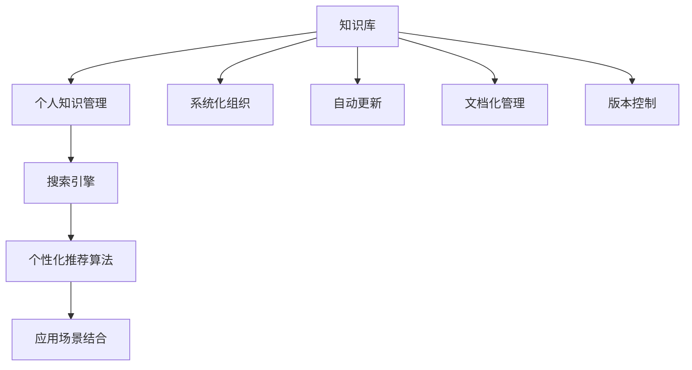

                 

# 打造个人知识库:程序员的效率提升之道

## 1. 背景介绍

在当今数字化和信息爆炸的时代，程序员面临着复杂多变的技术环境，必须不断学习新的技能和工具才能保持竞争力。然而，由于知识的庞杂和零散，如何有效地管理和利用这些知识，成为了每位程序员都面临的挑战。在本文中，我们将深入探讨如何构建个人知识库，以提升编程效率和创新能力。

### 1.1 问题由来

随着软件开发的复杂性不断增加，单一的知识点或技能已经无法满足复杂项目的需求。程序员需要不断学习新的编程语言、框架、库、工具，以及最新的技术趋势。这些知识的学习和应用，如果缺乏有效的组织和管理系统，很容易导致知识碎片化，难以整合和复用。因此，建立一套高效的知识管理系统，成为提升工作效率和解决技术问题的重要手段。

### 1.2 问题核心关键点

构建个人知识库的核心关键点包括：
- **系统化组织**：将知识按照主题、层次和应用场景进行分类和结构化，方便查找和应用。
- **自动更新**：通过RSS订阅、GitHub Watch、技术博客等方式，自动获取最新知识和技术动态。
- **搜索与检索**：提供高效、精准的搜索功能，快速定位到所需信息。
- **个性化推荐**：根据个人兴趣和项目需求，推荐相关的资源和文章。
- **应用场景结合**：将知识与具体项目和问题结合，提高知识的应用价值。

### 1.3 问题研究意义

构建个人知识库不仅可以帮助程序员提升工作效率，还可以加速技术学习和创新。具体来说：
- **提升学习效率**：通过系统化、结构化的知识管理，提升对新知识的吸收和应用能力。
- **加速技术创新**：将最新的技术动态和知识与项目需求结合，提升项目的技术水平和竞争力。
- **推动职业发展**：通过持续的知识积累和学习，提升个人技能和专业水平，推动职业成长。
- **协作与交流**：知识库可以作为团队协作的工具，促进知识共享和技术交流。

## 2. 核心概念与联系

### 2.1 核心概念概述

为了更好地理解如何构建个人知识库，我们将介绍几个关键概念：

- **知识库(Knowledge Base)**：一个包含各种知识信息的数据库，通常以文档、代码、笔记、教程等多种形式存储。
- **个人知识管理(PKM)**：利用工具和技术，帮助个人有效管理和利用知识，提升工作效率和学习能力。
- **搜索引擎(搜索引擎)**：提供高效、精准的搜索功能，支持快速定位所需信息。
- **个性化推荐算法**：根据用户行为和偏好，推荐相关资源和文章，提升知识获取的效率和精准度。
- **应用场景结合**：将知识与具体的项目和问题结合，提高知识的应用价值和效果。

这些概念之间存在紧密的联系，通过将知识库、搜索、推荐算法和应用场景结合，可以形成一个高效的知识管理系统，帮助程序员提升工作效率和学习能力。

### 2.2 核心概念原理和架构的 Mermaid 流程图



这个流程图展示了知识库管理的全过程，从系统化组织、自动更新到应用场景结合，每个环节都是不可或缺的。

## 3. 核心算法原理 & 具体操作步骤

### 3.1 算法原理概述

构建个人知识库的核心算法可以归纳为以下几个关键部分：

- **知识分类与组织**：利用分类算法，对知识进行分类和组织，形成清晰的结构。
- **自动更新与同步**：通过订阅技术，自动获取最新的知识资源，并与知识库同步。
- **搜索与检索**：构建高效的搜索引擎，支持快速定位和检索所需信息。
- **个性化推荐**：通过个性化推荐算法，根据用户行为和偏好推荐相关资源。

### 3.2 算法步骤详解

以下是构建个人知识库的详细步骤：

1. **知识分类与组织**：
   - 确定知识分类标准：根据项目需求和知识特点，确定分类标准和层次结构。
   - 创建分类目录：使用文本编辑器或文档管理系统创建分类目录，将知识按照主题、类型和层次进行结构化。
   - 存储知识内容：将文档、代码、笔记、教程等知识内容存储到对应的分类目录中。

2. **自动更新与同步**：
   - 选择订阅源：选择常用的技术博客、GitHub仓库、RSS订阅源等，作为自动更新的数据源。
   - 配置订阅工具：使用工具如Feedly、Zite、IFTTT等，配置自动订阅规则。
   - 同步到知识库：将订阅到的知识内容同步到本地知识库中，更新已有的文档或创建新的文档。

3. **搜索与检索**：
   - 选择搜索引擎：选择如Elasticsearch、Apache Solr等高性能搜索引擎，构建知识库搜索功能。
   - 索引知识内容：对知识库中的文档、代码等进行索引，建立搜索索引。
   - 实现搜索功能：根据用户输入的关键字或搜索表达式，快速定位到相关的知识内容。

4. **个性化推荐**：
   - 收集用户行为数据：记录用户对知识内容的访问、阅读、评价等行为数据。
   - 构建推荐模型：使用协同过滤、基于内容的推荐算法等，构建个性化推荐模型。
   - 提供推荐服务：根据用户行为数据和推荐模型，推荐相关的知识资源和文章。

### 3.3 算法优缺点

构建个人知识库的算法有如下优缺点：

**优点**：
- **系统化管理**：通过分类和组织，使知识更加结构化和系统化，便于查找和应用。
- **自动更新**：通过订阅和同步，自动获取最新知识，保持知识的时效性。
- **搜索与检索**：提供高效、精准的搜索功能，快速定位到所需信息。
- **个性化推荐**：根据用户偏好推荐相关资源，提升知识获取的效率和精准度。

**缺点**：
- **初始成本高**：构建和维护知识库需要一定的初始成本，包括分类标准的确定、工具的选择和数据的同步。
- **数据质量问题**：订阅源和自动同步的数据可能存在质量问题，需要进行人工筛选和校验。
- **算法复杂度**：个性化推荐算法和搜索引擎的构建和维护，需要一定的算法知识和经验。

### 3.4 算法应用领域

构建个人知识库的算法在以下几个领域有广泛的应用：

- **软件开发**：提升代码阅读、编写、调试和测试效率，推动项目创新和技术进步。
- **技术学习**：提升学习效率和效果，快速掌握新技术和工具。
- **项目协作**：促进知识共享和技术交流，提升团队协作效率。
- **学术研究**：组织和存储学术文献和研究成果，推动学术交流和创新。
- **个人发展**：提升个人技能和专业水平，推动职业成长和转型。

## 4. 数学模型和公式 & 详细讲解 & 举例说明

### 4.1 数学模型构建

在构建个人知识库的过程中，我们可以使用数学模型来描述和优化各个环节的性能。

**知识分类与组织**：
- 使用层次聚类算法，对知识进行分类和组织。层次聚类算法通过计算知识之间的相似度，将相似的知识归为一类，形成分类目录。

**自动更新与同步**：
- 使用定时器算法，定期检查订阅源的更新情况，自动同步到知识库。

**搜索与检索**：
- 使用倒排索引技术，构建搜索索引，提高搜索效率。倒排索引将关键词与文档关联起来，快速定位到相关文档。

**个性化推荐**：
- 使用协同过滤算法，根据用户行为数据和知识内容推荐相关资源。协同过滤算法通过计算用户与物品之间的相似度，推荐用户可能感兴趣的知识资源。

### 4.2 公式推导过程

以下是几个关键算法的公式推导过程：

**层次聚类算法**：
$$
C_k = \arg\min_{C \in \mathcal{C}} \sum_{i,j \in C} d(x_i, x_j)
$$
其中，$C_k$ 表示聚类结果，$d(x_i, x_j)$ 表示两个知识点的相似度。

**定时器算法**：
$$
\text{定时器} = \text{当前时间} - \text{上次同步时间}
$$
当定时器大于设定的同步周期时，触发同步操作。

**倒排索引**：
$$
I_k = \{d \mid d_k = k, d \in D\}
$$
其中，$I_k$ 表示关键词 $k$ 的文档集合，$d_k$ 表示文档 $d$ 中包含关键词 $k$。

**协同过滤算法**：
$$
\text{similarity}(u, i) = \frac{\sum_{j \in \text{items}(i)} x_{u,j} x_{i,j}}{\sqrt{\sum_{j \in \text{items}(u)} x_{u,j}^2} \sqrt{\sum_{j \in \text{items}(i)} x_{i,j}^2}}
$$
其中，$similarity(u, i)$ 表示用户 $u$ 和物品 $i$ 的相似度，$x_{u,j}$ 表示用户 $u$ 对物品 $j$ 的评分，$items(i)$ 表示物品 $i$ 的评分集合。

### 4.3 案例分析与讲解

以下是一个基于Python的案例，展示如何使用Scikit-learn实现层次聚类算法：

```python
from sklearn.cluster import AgglomerativeClustering
from sklearn.metrics.pairwise import cosine_similarity
from sklearn.datasets import make_blobs

# 生成随机数据
X, _ = make_blobs(n_samples=100, centers=4, cluster_std=0.60, random_state=42)

# 使用层次聚类算法进行分类
clustering = AgglomerativeClustering(n_clusters=4, linkage='ward')
labels = clustering.fit_predict(X)

# 计算相似度矩阵
similarity_matrix = cosine_similarity(X)

# 打印聚类结果
print(labels)
```

这个代码展示了如何通过层次聚类算法对数据进行分类，并将相似度矩阵输出。

## 5. 项目实践：代码实例和详细解释说明

### 5.1 开发环境搭建

构建个人知识库需要选择合适的开发环境和工具。以下是搭建环境的详细步骤：

1. **安装开发环境**：
   - 使用Python 3.x作为开发语言。
   - 安装Jupyter Notebook或JupyterLab，用于编写和运行代码。
   - 安装相关的Python库，如Pandas、NumPy、Scikit-learn、PyTorch等。

2. **配置环境变量**：
   - 设置Python路径，使其能够在不同的环境中运行。
   - 配置GitHub访问权限，以便自动同步GitHub仓库。

### 5.2 源代码详细实现

以下是一个简单的Python代码示例，展示如何使用GitHub API自动同步仓库到本地知识库：

```python
import os
import requests
import json

# GitHub API配置
GITHUB_TOKEN = 'YOUR_GITHUB_TOKEN'
REPO_OWNER = 'YOUR_REPO_OWNER'
REPO_NAME = 'YOUR_REPO_NAME'

# 获取GitHub仓库的最新提交记录
response = requests.get(f'https://api.github.com/repos/{REPO_OWNER}/{REPO_NAME}/commits', headers={'Authorization': f'token {GITHUB_TOKEN}'})
commits = json.loads(response.text)

# 遍历每个提交记录，同步到本地知识库
for commit in commits:
    commit_hash = commit['commit']['sha']
    commit_message = commit['commit']['message']
    commit_file = commit['commit']['author']['email'].split('@')[0] + '.txt'
    with open(commit_file, 'a') as f:
        f.write(f'{commit_hash}: {commit_message}\n')
```

这个代码展示了如何使用GitHub API获取仓库的最新提交记录，并将提交信息同步到本地知识库中。

### 5.3 代码解读与分析

以下是对上述代码的详细解读：

- **环境配置**：首先需要获取GitHub的API配置信息，包括Token、仓库拥有者和仓库名称。
- **获取提交记录**：通过API获取仓库的最新提交记录，包括提交哈希、提交信息和提交者邮箱。
- **同步提交信息**：将提交信息格式化为文本文件，同步到本地知识库中。

### 5.4 运行结果展示

运行上述代码后，可以在本地知识库中查看最新的提交记录。这将有助于程序员及时了解项目的最新动态，掌握项目进展和问题。

## 6. 实际应用场景

### 6.1 软件开发

在软件开发中，构建个人知识库可以有效提升代码阅读、编写、调试和测试效率。通过知识库，程序员可以快速找到相关的代码示例、技术文档和调试日志，避免重复劳动和错误，提升开发效率。

### 6.2 技术学习

在技术学习中，构建个人知识库可以帮助程序员快速掌握新技术和工具。通过订阅技术博客、GitHub仓库和在线课程，获取最新的技术动态和资源，并将其整理到知识库中，便于随时查阅和学习。

### 6.3 项目协作

在项目协作中，构建个人知识库可以促进知识共享和技术交流。通过知识库，团队成员可以快速共享项目知识和技术经验，提高团队协作效率和项目成功率。

### 6.4 个人发展

在个人发展中，构建个人知识库有助于提升个人技能和专业水平。通过不断学习和积累项目经验，建立自己的知识体系和技术能力，推动职业成长和转型。

## 7. 工具和资源推荐

### 7.1 学习资源推荐

为了帮助程序员系统掌握构建个人知识库的理论和实践，以下是几本推荐书籍和资源：

- **《系统化个人知识管理：构建知识体系、提升工作效率》**：深入探讨个人知识管理的系统化方法，提供实用的工具和技巧。
- **《知识图谱与推荐系统》**：介绍知识图谱和推荐系统的基本原理和算法，帮助理解个性化推荐技术。
- **《Python数据科学手册》**：提供Python编程和数据科学的学习资源，包括数据处理、机器学习和数据可视化等。
- **《软件开发规范与实践》**：介绍软件开发的最佳实践和规范，提升代码质量和开发效率。

### 7.2 开发工具推荐

以下是几个常用的开发工具，用于构建个人知识库：

- **GitHub**：GitHub是全球最大的代码托管平台，提供丰富的代码库和API接口，支持自动化同步和协作。
- **Google Colab**：Google提供的在线Jupyter Notebook环境，免费提供GPU算力和免费存储空间，适合快速迭代研究。
- **PyTorch**：一个强大的深度学习框架，支持构建和训练各类模型，提供高效的计算图和自动微分功能。
- **Elasticsearch**：一个高性能搜索引擎，支持分布式部署和高并发处理，适用于大规模知识库构建和搜索。

### 7.3 相关论文推荐

以下是几篇关键论文，推荐阅读：

- **《数据仓库设计与实现》**：介绍数据仓库的设计和实现方法，帮助理解知识库的存储和检索技术。
- **《深度学习中的推荐系统》**：探讨深度学习在推荐系统中的应用，介绍协同过滤、基于内容的推荐算法等。
- **《软件工程的最新进展》**：介绍软件工程的最佳实践和最新技术，提供软件开发和项目管理的新思路。

## 8. 总结：未来发展趋势与挑战

### 8.1 研究成果总结

本文从背景介绍、核心概念、算法原理和操作步骤等多个方面，系统介绍了如何构建个人知识库，提升程序员的效率和学习能力。通过层次聚类、自动同步、搜索引擎和个性化推荐等算法，可以实现知识的高效管理和应用。

### 8.2 未来发展趋势

未来，个人知识库将在以下几个方面发展：

- **自动化与智能化**：通过AI技术，实现自动分类、推荐和检索，提升知识管理的智能化水平。
- **跨平台与集成**：将知识库与各类平台和应用集成，提升知识管理的便捷性和效率。
- **动态更新与维护**：通过动态更新和维护机制，保持知识库的时效性和有效性。
- **个性化与定制**：根据用户行为和需求，提供个性化的知识推荐和定制化服务。
- **多模态知识融合**：将文本、图像、音频等多模态数据融合，提升知识管理的丰富性和深度。

### 8.3 面临的挑战

尽管构建个人知识库有很多优势，但仍面临以下挑战：

- **初始成本高**：构建和维护知识库需要投入时间和精力，且需要一定的技术基础。
- **数据质量和一致性**：知识库中存储的数据需要严格筛选和校验，保持一致性。
- **系统复杂性**：知识库的系统构建和维护需要多个模块协同工作，系统复杂性高。
- **知识更新频繁**：随着技术和应用的不断发展，知识库需要不断更新，保持最新状态。
- **用户使用习惯**：用户需要逐步习惯和掌握知识库的使用方法和技巧，才能发挥其最大价值。

### 8.4 研究展望

未来的研究将重点关注以下几个方面：

- **自动化技术**：研究自动化分类、推荐和检索技术，提升知识管理的智能化和自动化水平。
- **跨平台集成**：研究跨平台集成和知识共享技术，提升知识管理的便捷性和协作效率。
- **多模态知识融合**：研究多模态知识融合技术，提升知识管理的丰富性和深度。
- **个性化推荐算法**：研究个性化推荐算法，提高知识推荐的精准度和用户满意度。
- **知识库安全性**：研究知识库的安全性保障技术，防止数据泄露和恶意攻击。

## 9. 附录：常见问题与解答

### 9.1 问题Q1：构建个人知识库需要哪些工具和资源？

A: 构建个人知识库需要以下工具和资源：
- 知识管理工具：如Confluence、Evernote、OneNote等，用于创建和存储知识库。
- 搜索引擎：如Elasticsearch、Solr等，用于快速检索和定位知识。
- 自动化工具：如IFTTT、Zapier等，用于自动化数据同步和任务执行。
- 编程语言和库：如Python、R、JavaScript等，用于数据处理和自动化任务。
- 数据库管理系统：如MySQL、PostgreSQL等，用于存储和管理知识库数据。

### 9.2 问题Q2：如何选择合适的分类标准？

A: 选择合适的分类标准需要考虑以下几个因素：
- 领域特点：根据知识库的应用领域，选择合适的分类标准和层次结构。
- 数据量大小：根据知识库中数据的数量和复杂度，确定分类粒度和数量。
- 用户需求：根据目标用户的知识需求和使用习惯，确定分类标准和方式。

### 9.3 问题Q3：如何提高知识库的检索效率？

A: 提高知识库的检索效率需要以下措施：
- 建立倒排索引：对知识库中的文档进行倒排索引，快速定位到相关文档。
- 使用搜索引擎：选择高性能搜索引擎，如Elasticsearch、Solr等，提升检索效率。
- 优化搜索算法：优化搜索算法，如布尔查询、向量空间模型等，提升检索精度和速度。

### 9.4 问题Q4：如何进行知识库的动态更新？

A: 进行知识库的动态更新需要以下步骤：
- 选择订阅源：选择常用的技术博客、GitHub仓库、在线课程等，作为自动更新的数据源。
- 配置订阅工具：使用工具如Feedly、Zite、IFTTT等，配置自动订阅规则。
- 同步到知识库：将订阅到的知识内容同步到本地知识库中，更新已有的文档或创建新的文档。

### 9.5 问题Q5：如何进行个性化推荐？

A: 进行个性化推荐需要以下步骤：
- 收集用户行为数据：记录用户对知识内容的访问、阅读、评价等行为数据。
- 构建推荐模型：使用协同过滤、基于内容的推荐算法等，构建个性化推荐模型。
- 提供推荐服务：根据用户行为数据和推荐模型，推荐相关的知识资源和文章。

---

作者：禅与计算机程序设计艺术 / Zen and the Art of Computer Programming

