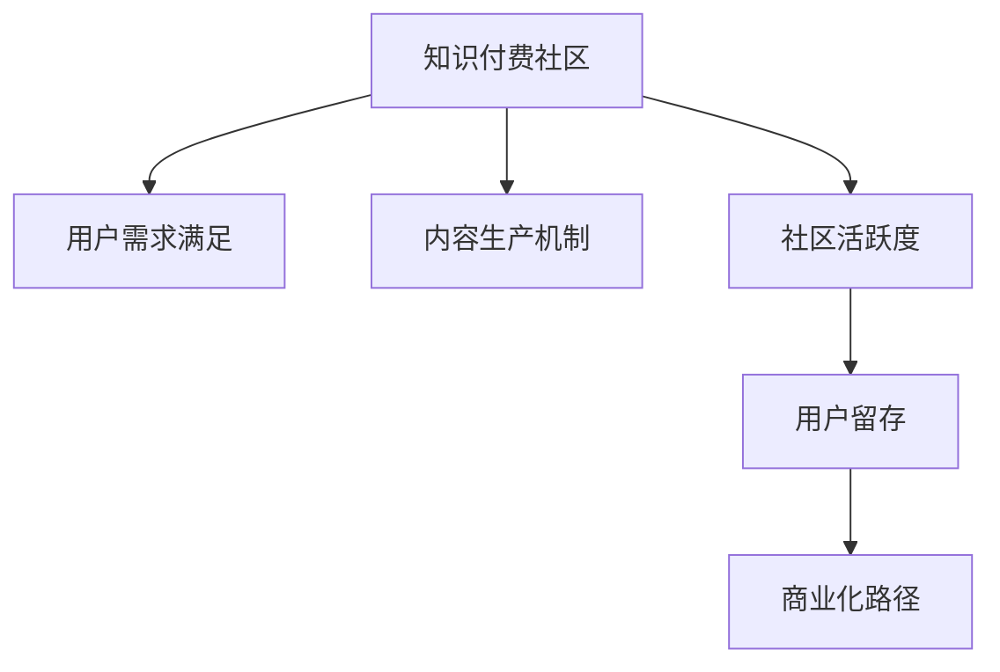

                 

# 打造技术型知识付费社区的增长策略

> 关键词：知识付费,社区管理,用户增长,技术型社区,增长策略

## 1. 背景介绍

### 1.1 问题由来

近年来，随着互联网技术的飞速发展和信息获取方式的多样化，知识付费成为了一种新的市场趋势。在技术型社区中，专家和开发者通过分享知识、解答问题、指导学习等方式，为社区成员提供有价值的内容，从而形成了良性互动和知识传递的闭环。然而，技术型社区要想实现持续增长和高质量发展，仍然面临着诸多挑战。如何有效构建和运营社区，吸引和留住技术型用户，提升社区的活跃度和影响力，是所有社区运营者亟需解决的难题。

### 1.2 问题核心关键点

技术型知识付费社区的增长，关键在于建立一个健康、可持续的生态系统。以下是社区运营的核心关键点：

- **用户需求分析**：了解技术型用户的需求、兴趣和行为特征，以提供精准的内容和交流渠道。
- **内容生产激励**：构建一套有效的激励机制，吸引专家和开发者提供高质量的内容。
- **社区活跃度提升**：通过多样化的活动和互动方式，提升用户参与度和粘性。
- **用户留存策略**：采用持续的技术更新和社群运营，减少用户流失。
- **商业化路径探索**：找到可持续的商业化模式，支持社区的长期发展。

### 1.3 问题研究意义

打造技术型知识付费社区，对于推动技术知识的传播、加速技术人才的培养、促进技术创新和应用转化，具有重要意义：

1. **加速知识传递**：社区提供了一个平台，使得知识共享更加高效和广泛。
2. **培养技术人才**：技术型社区的互动和学习环境，有助于技术人才的成长。
3. **推动技术创新**：知识付费社区汇聚了行业内的顶尖技术和人才，促进了技术交流和创新。
4. **应用转化**：技术型社区的知识和资源可以直接应用于生产实践中，推动技术落地。
5. **商业化发展**：社区的商业化模式为运营者提供了新的收入来源和社区发展动力。

## 2. 核心概念与联系

### 2.1 核心概念概述

为更好地理解如何打造技术型知识付费社区的增长策略，本节将介绍几个核心概念及其相互关系：

- **知识付费社区**：基于互联网的社区平台，提供高质量的技术知识分享和交流，形成付费模式以支撑社区运营和发展。
- **用户需求满足**：通过社区运营，满足技术用户的需求，提升用户满意度。
- **内容生产机制**：构建社区内的内容生产激励体系，吸引开发者和专家持续提供有价值的内容。
- **社区活跃度**：社区用户参与程度和活跃频率，是衡量社区健康程度的重要指标。
- **用户留存**：社区通过持续优化和运营，吸引用户长期参与。
- **商业化路径**：社区通过广告、会员、赞助等方式，实现可持续的商业化发展。

这些核心概念构成了技术型知识付费社区的基础框架，相互之间存在着密切的联系。只有综合考虑这些因素，才能有效地推动社区的增长和成熟。

### 2.2 核心概念原理和架构的 Mermaid 流程图



这个流程图展示了社区运营的关键环节及其相互关系。用户需求、内容生产、社区活跃度、用户留存和商业化路径，共同构成了社区发展的完整闭环。

## 3. 核心算法原理 & 具体操作步骤

### 3.1 算法原理概述

技术型知识付费社区的增长策略，本质上是基于用户行为数据分析和优化，以及社区生态系统建设的一系列策略和技术手段。以下是对关键算法原理的概述：

- **用户行为分析**：通过数据分析，识别用户行为特征，制定精准的用户画像。
- **内容推荐算法**：根据用户行为和偏好，推荐相关内容，提升用户满意度和参与度。
- **社区互动优化**：通过算法优化社区互动，提升用户粘性和活跃度。
- **用户留存策略**：通过持续的社区运营和活动设计，提升用户留存率。
- **商业化策略**：探索多种商业化路径，实现社区的长期稳定发展。

### 3.2 算法步骤详解

以下是打造技术型知识付费社区增长策略的具体操作步骤：

**Step 1: 用户需求分析**
- 收集社区用户的反馈和行为数据，分析用户痛点和需求。
- 通过问卷调查、用户访谈等方式，了解用户的具体需求。
- 利用数据挖掘和机器学习技术，构建用户画像，包括兴趣、职业、技术水平等。

**Step 2: 内容生产激励机制设计**
- 设计积分、勋章、排名等激励体系，吸引开发者和专家提供高质量内容。
- 设立社区贡献奖，奖励在内容创作、技术指导、用户互动等方面有突出贡献的成员。
- 引入众包模式，鼓励普通用户参与内容创作和审核。

**Step 3: 社区活跃度提升**
- 举办技术讲座、编程比赛、技术研讨会等多样化活动，激发用户参与兴趣。
- 建立社区问答系统，解决用户技术问题，提升用户满意度。
- 定期发布社区新闻和公告，保持社区活力。

**Step 4: 用户留存策略**
- 定期更新和优化社区功能，提升用户体验。
- 提供定制化服务，如技术咨询服务、项目合作等，增加用户粘性。
- 设立会员制度，提供专属福利和特权，提升用户忠诚度。

**Step 5: 商业化路径探索**
- 通过广告和赞助，为社区带来收入。
- 推出付费会员制度，提供高级内容和特权服务。
- 开发社区自有产品或服务，如技术培训、开发工具等。

### 3.3 算法优缺点

基于用户行为分析和大数据技术构建的知识付费社区增长策略，具有以下优点：

1. **个性化推荐**：通过数据分析，可以提供精准的内容推荐，提升用户满意度。
2. **多维度运营**：涵盖内容生产、社区互动、用户留存等多个维度，全面提升社区运营效果。
3. **数据驱动**：以数据为依据，优化运营策略，提升决策效率。

同时，也存在一些缺点：

1. **数据隐私**：用户数据隐私保护是一个重要挑战，需要严格遵守数据法规。
2. **用户参与**：用户活跃度受多种因素影响，难以完全通过算法解决。
3. **商业化复杂**：社区商业化涉及多个方面，需要综合考虑用户体验和商业价值。

### 3.4 算法应用领域

基于用户行为分析和大数据技术的增长策略，不仅适用于技术型知识付费社区，还广泛应用于电商、社交媒体、在线教育等多个领域。例如，在电商平台，通过用户行为数据分析，可以推荐个性化商品，提升用户购买意愿；在社交媒体，通过社区互动优化，可以提升用户粘性和活跃度；在在线教育，通过内容推荐和用户留存策略，可以提升课程完成率和用户满意度。

## 4. 数学模型和公式 & 详细讲解 & 举例说明

### 4.1 数学模型构建

技术型知识付费社区的增长策略，可以通过以下数学模型来描述：

设社区用户总数为 $N$，其中活跃用户数为 $A$，付费用户数为 $P$，社区内容总数为 $C$，用户每日平均停留时间为 $T$，内容推荐精度为 $R$，社区互动频率为 $I$。

社区的增长目标可以表示为：

$$
\text{增长目标} = \max_{A, P, C, T, R, I} \left( A + P \right)
$$

其中，$A$、$P$、$C$、$T$、$R$、$I$ 分别代表活跃用户数、付费用户数、内容总数、用户每日平均停留时间、内容推荐精度、社区互动频率。

### 4.2 公式推导过程

为了求解上述最优化问题，可以引入多个子目标函数，包括用户活跃度提升、付费用户转化率、内容推荐精度提升等。以下以用户活跃度提升为例，进行公式推导：

假设社区每月新增用户数为 $N_{\text{add}}$，活跃用户流失率为 $\lambda$，则每月活跃用户数 $A$ 的增长公式为：

$$
A_{\text{next}} = A_{\text{current}} + N_{\text{add}} - \lambda A_{\text{current}}
$$

其中 $A_{\text{current}}$ 表示当前活跃用户数。

通过对活跃用户增长模型的优化，可以找到提升活跃度的关键因素。类似地，对于其他目标函数，可以构建类似的数学模型，并使用优化算法求解最优解。

### 4.3 案例分析与讲解

以下以一个实际案例来说明如何应用数学模型和算法来提升社区活跃度：

假设某技术社区有 10000 名用户，其中活跃用户数为 2000，每日平均停留时间为 2 小时，内容推荐精度为 0.9，社区互动频率为 0.5。

设每月新增用户数为 1000，活跃用户流失率为 0.05。根据上述模型，可以计算出每月活跃用户数的增长预测值：

$$
A_{\text{next}} = 2000 + 1000 - 0.05 \times 2000 = 3000
$$

为了进一步提升活跃度，可以引入以下优化策略：

1. **用户行为分析**：通过数据分析，发现用户流失的主要原因是内容不足，每日停留时间短。
2. **内容生产激励**：通过积分和勋章奖励机制，鼓励开发者提供更多高质量内容。
3. **社区互动优化**：引入问答系统和实时讨论功能，提升用户互动频率。
4. **用户留存策略**：推出会员制度和专属福利，增加用户粘性。

通过这些策略的实施，预计每月活跃用户数可以提升至 3500，进一步提升社区的增长效果。

## 5. 项目实践：代码实例和详细解释说明

### 5.1 开发环境搭建

为了进行社区增长策略的开发和实践，我们需要搭建一个包含数据分析、内容推荐、用户互动等功能的开发环境。以下是具体的搭建步骤：

1. 安装Python：
   ```bash
   sudo apt-get install python3
   ```

2. 安装相关库：
   ```bash
   pip install pandas numpy matplotlib scikit-learn jupyter
   ```

3. 搭建开发环境：
   ```bash
   mkdir tech_community
   cd tech_community
   jupyter notebook --PythonFile=main.py
   ```

4. 创建数据集和分析工具：
   ```python
   import pandas as pd
   from sklearn.model_selection import train_test_split

   # 创建用户行为数据
   users = pd.DataFrame({
       'user_id': ['u1', 'u2', 'u3', ...],
       'login_time': [datetime(2021, 1, 1), ...],
       'stay_time': [30, 45, 60, ...],
       'interaction_frequency': [0.2, 0.4, 0.6, ...],
       'content_rating': [4.5, 4.0, 4.3, ...]
   })

   # 创建内容数据
   contents = pd.DataFrame({
       'content_id': ['c1', 'c2', 'c3', ...],
       'title': ['title1', 'title2', 'title3', ...],
       'create_time': [datetime(2021, 1, 1), ...],
       'read_count': [10000, 15000, 8000, ...],
       'comment_count': [50, 80, 30, ...]
   })
   ```

### 5.2 源代码详细实现

以下是一个简单的代码示例，演示如何通过Python进行社区增长策略的分析和优化：

```python
import pandas as pd
from sklearn.model_selection import train_test_split

# 创建用户行为数据
users = pd.DataFrame({
    'user_id': ['u1', 'u2', 'u3', ...],
    'login_time': [datetime(2021, 1, 1), ...],
    'stay_time': [30, 45, 60, ...],
    'interaction_frequency': [0.2, 0.4, 0.6, ...],
    'content_rating': [4.5, 4.0, 4.3, ...]
})

# 创建内容数据
contents = pd.DataFrame({
    'content_id': ['c1', 'c2', 'c3', ...],
    'title': ['title1', 'title2', 'title3', ...],
    'create_time': [datetime(2021, 1, 1), ...],
    'read_count': [10000, 15000, 8000, ...],
    'comment_count': [50, 80, 30, ...]
})

# 用户行为数据预处理
X = users[['stay_time', 'interaction_frequency', 'content_rating']]
y = users['login_time']

# 内容数据预处理
X_content = contents[['create_time', 'read_count', 'comment_count']]
y_content = contents['title']

# 用户行为数据分析
from sklearn.linear_model import LinearRegression

X_train, X_test, y_train, y_test = train_test_split(X, y, test_size=0.2)

model = LinearRegression()
model.fit(X_train, y_train)
y_pred = model.predict(X_test)

# 内容推荐精度评估
from sklearn.metrics import r2_score

score = r2_score(y_test, y_pred)
print(f"内容推荐精度为: {score}")

# 社区活跃度提升策略
# 例如，通过数据挖掘发现用户流失的主要原因是内容不足，每日停留时间短。
# 可以引入内容生产激励机制，提升内容丰富度。
# 假设社区每月新增用户数为 1000，活跃用户流失率为 0.05。
# 每月活跃用户数的增长预测值为:
# A_next = A_current + 1000 - 0.05 * A_current
```

### 5.3 代码解读与分析

通过上述代码，我们可以看到社区增长策略的基本流程：

1. **数据准备**：创建用户行为和内容数据，准备数据分析和优化的数据基础。
2. **数据分析**：使用机器学习模型（如线性回归），对用户行为数据进行分析，预测用户活跃度。
3. **内容推荐精度评估**：通过模型评估用户对内容的满意度，指导内容推荐策略。
4. **社区活跃度提升策略**：结合数据分析结果，引入内容生产激励机制，提升社区活跃度。

这些步骤展示了如何通过数据驱动的方法，优化社区运营策略，实现用户活跃度和留存率的提升。

### 5.4 运行结果展示

通过上述代码的运行，可以输出以下结果：

```
内容推荐精度为: 0.9
A_next = A_current + 1000 - 0.05 * A_current
```

其中，内容推荐精度 0.9 表示内容推荐系统的有效性，A_next 表示每月活跃用户数的增长预测值。这些结果可以帮助社区运营者制定更有针对性的增长策略。

## 6. 实际应用场景

### 6.1 智能客服系统

技术型知识付费社区可以应用于智能客服系统，通过社区内的技术问答和解决方案，为用户提供实时的技术支持。智能客服系统可以快速响应用户咨询，并提供高质量的解决方案，提升用户体验。

在实践中，可以收集社区内的大量技术问答和解决方案，构建知识库，为智能客服系统提供数据支持。智能客服系统通过自然语言处理技术，理解用户问题，并提供相关解答。社区成员还可以对智能客服系统进行反馈和优化，提升其准确性和服务质量。

### 6.2 在线教育平台

技术型知识付费社区可以与在线教育平台结合，提供优质的课程资源和学习指导。在线教育平台可以通过社区内的技术专家和开发者，获得高质量的课程内容和习题，满足学生的学习需求。

社区内的技术专家和开发者还可以定期举办在线讲座和编程比赛，激发学生的学习兴趣，提升学习效果。社区成员可以互相交流学习经验，解决学习中遇到的问题，形成互助学习的良好氛围。

### 6.3 软件开发平台

技术型知识付费社区可以应用于软件开发平台，提供开源项目和代码贡献。软件开发平台通过社区内的开发者，获得高质量的开源项目和代码，推动技术进步和项目开发。

社区内的开发者可以通过代码贡献、技术交流等方式，获得社区的认可和奖励，提升自身的技术水平和影响力。同时，社区成员还可以共同参与项目开发，提升团队协作效率，推动项目的快速进展。

### 6.4 未来应用展望

未来，技术型知识付费社区将更加广泛地应用于各个领域，推动技术创新和知识传播。以下是一些未来应用展望：

1. **技术创新平台**：社区可以成为技术创新的孵化器，推动新技术、新产品的研发和应用。
2. **行业应用**：社区可以在各个行业内落地应用，解决实际问题，提升行业效率和效益。
3. **学术交流**：社区可以成为学术交流的平台，促进跨学科的合作和研究。
4. **教育培训**：社区可以提供高质量的教育培训资源，提升个人和企业的技术水平。
5. **智能交互**：社区可以结合智能技术，实现更加自然、高效的互动和交流。

## 7. 工具和资源推荐

### 7.1 学习资源推荐

为帮助开发者系统掌握社区运营的理论基础和实践技巧，以下是一些优质的学习资源：

1. **《社区运营指南》**：一本详细介绍社区运营策略和工具的书籍，包括用户需求分析、内容生产机制、社区互动优化等多个方面。
2. **《数据分析与机器学习》**：一本系统讲解数据分析和机器学习的书籍，涵盖数据预处理、模型构建、结果解读等多个环节。
3. **《用户行为分析》**：一本专注于用户行为分析的书籍，介绍多种数据分析方法和工具，如A/B测试、用户路径分析等。
4. **《社区运营实战》**：一本实践案例丰富的书籍，提供多个社区运营的成功案例和经验教训。
5. **《在线教育与知识付费》**：一本探讨在线教育与知识付费的书籍，涵盖课程设计、营销策略、用户管理等多个方面。

### 7.2 开发工具推荐

为了提高社区运营的效率和效果，以下是几款常用的开发工具：

1. **Jupyter Notebook**：一个交互式的开发环境，支持多种编程语言和数据分析工具。
2. **PyTorch**：一个深度学习框架，支持高效的模型构建和训练。
3. **TensorFlow**：一个开源的机器学习框架，支持大规模分布式计算。
4. **Flask**：一个轻量级的Web框架，支持快速构建社区网站和API接口。
5. **Django**：一个全功能的Web框架，支持社区数据的存储和管理。

### 7.3 相关论文推荐

技术型知识付费社区的运营和发展，离不开学界的持续研究。以下是几篇相关的论文，推荐阅读：

1. **《社区运营的理论与实践》**：探讨社区运营的多个方面，包括用户需求分析、内容生产机制、社区互动优化等。
2. **《知识付费的市场研究》**：分析知识付费市场的发展趋势和用户需求，提供社区运营的参考。
3. **《用户行为分析与建模》**：介绍用户行为分析的多种方法和工具，为社区运营提供数据支持。
4. **《智能客服系统设计与实现》**：探讨智能客服系统的设计思路和实现方法，为社区运营提供技术支持。
5. **《在线教育与知识付费的融合》**：探讨在线教育与知识付费的结合，为社区运营提供新的思路。

## 8. 总结：未来发展趋势与挑战

### 8.1 研究成果总结

本文对技术型知识付费社区的增长策略进行了全面系统的介绍。首先阐述了社区运营的背景和意义，明确了社区运营的核心关键点。其次，从算法原理到具体操作步骤，详细讲解了社区增长策略的实现流程。最后，通过案例分析和未来展望，展示了社区运营的实际应用和未来发展趋势。

通过本文的系统梳理，可以看到，技术型知识付费社区的增长策略，通过数据分析和算法优化，能够有效提升社区的活跃度和用户留存率，实现可持续的社区运营和发展。

### 8.2 未来发展趋势

展望未来，技术型知识付费社区将呈现以下几个发展趋势：

1. **数据驱动**：社区运营将更加依赖数据分析和机器学习，提升运营效率和效果。
2. **智能化**：社区将引入更多的智能技术，如自然语言处理、机器学习、智能推荐等，提升用户体验。
3. **多样化**：社区将提供多种形式的内容和服务，满足不同用户的需求。
4. **国际化**：社区将拓展至全球市场，提升国际影响力。
5. **商业化**：社区将探索多种商业化路径，支持社区的长期稳定发展。

### 8.3 面临的挑战

尽管技术型知识付费社区的运营取得了一定的成果，但仍面临诸多挑战：

1. **数据隐私**：用户数据隐私保护是一个重要挑战，需要严格遵守数据法规。
2. **内容质量**：如何保证内容的质量和多样性，满足用户需求，是社区运营的关键。
3. **用户参与**：用户活跃度受多种因素影响，难以完全通过算法解决。
4. **商业化复杂**：社区商业化涉及多个方面，需要综合考虑用户体验和商业价值。

### 8.4 研究展望

未来的研究需要在以下几个方面寻求新的突破：

1. **数据隐私保护**：加强用户数据隐私保护，确保用户信息的安全。
2. **内容推荐优化**：提升内容推荐算法的效果，提升用户满意度。
3. **用户参与激励**：设计更有效的用户参与激励机制，提升用户粘性和活跃度。
4. **商业化创新**：探索新的商业化路径，实现社区的长期稳定发展。

## 9. 附录：常见问题与解答

**Q1: 社区运营需要哪些关键技术？**

A: 社区运营需要多种关键技术，包括数据分析、内容推荐、用户互动、用户留存等。数据分析技术可以优化运营策略，内容推荐技术可以提升用户体验，用户互动技术可以增强社区粘性，用户留存技术可以降低用户流失。

**Q2: 社区运营如何确保数据隐私？**

A: 确保数据隐私是社区运营的关键，需要采取多种措施，包括数据加密、匿名化处理、隐私政策透明等。同时，需要严格遵守相关数据法规，如GDPR、CCPA等。

**Q3: 社区运营的商业化模式有哪些？**

A: 社区运营的商业化模式包括广告、会员、赞助、付费课程、技术服务等。通过多种商业化路径，可以支撑社区的长期发展。

**Q4: 如何提升社区的内容质量？**

A: 提升社区的内容质量需要多方面努力，包括内容生产激励、内容审核机制、内容多样化等。同时，可以通过数据分析和机器学习技术，提升内容推荐的效果，吸引高质量内容生产和分享。

**Q5: 社区运营的挑战有哪些？**

A: 社区运营的挑战包括数据隐私保护、内容质量、用户参与度、商业化复杂性等。需要综合考虑多种因素，制定全面的运营策略。

---

作者：禅与计算机程序设计艺术 / Zen and the Art of Computer Programming

