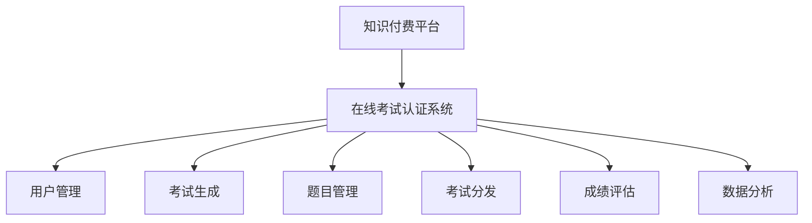

                 

# 打造知识付费的在线考试认证系统

> 关键词：知识付费、在线考试、认证系统、AI技术、数据隐私保护、深度学习、用户行为分析、云计算

## 1. 背景介绍

随着互联网的迅猛发展，知识付费正在成为越来越多人获取知识的重要方式。如何打造一个安全、可靠、高效的知识付费在线考试认证系统，成为了知识付费平台的核心问题。本文将深入探讨在线考试认证系统的核心技术，包括用户管理、考试生成、题目管理、考试分发、成绩评估、数据分析等多个方面，并详细阐述AI技术在考试系统中的应用，包括语音识别、图像识别、文本分析、自然语言处理等。

## 2. 核心概念与联系

### 2.1 核心概念概述

为了更好地理解知识付费在线考试认证系统的构建，本节将介绍几个关键概念：

- **知识付费平台**：通过在线订阅、课程购买、打赏等方式，提供知识内容的平台。
- **在线考试认证系统**：结合AI技术，自动化管理用户、考试、成绩等，确保知识付费课程的权威性和有效性。
- **AI技术**：通过深度学习、自然语言处理等技术，实现考试题目的自动生成、用户行为的精准分析、成绩评估的自动化处理等。
- **用户管理**：包括用户注册、登录、认证、权限管理等，确保系统安全和用户信息的安全。
- **考试生成**：根据课程内容和用户需求，自动生成标准化、灵活化的考试题目，确保考试的公正性和准确性。
- **题目管理**：涉及题目的收集、编辑、审核、存储等，确保题目库的丰富性和权威性。
- **考试分发**：从题目库中随机抽取题目，生成考试试卷，并通过邮件、APP等方式分发，确保考试的可靠性和可操作性。
- **成绩评估**：通过AI技术对用户答案进行自动化评分，确保评分的公平性和准确性。
- **数据分析**：通过数据分析技术，掌握用户行为和考试结果，优化考试系统性能和课程内容。

这些核心概念之间的逻辑关系可以通过以下Mermaid流程图来展示：



这个流程图展示了一个典型的知识付费在线考试认证系统的组成部分及其相互关系。

## 3. 核心算法原理 & 具体操作步骤
### 3.1 算法原理概述

知识付费在线考试认证系统的核心算法原理主要基于AI技术，特别是深度学习、自然语言处理(NLP)和计算机视觉(CV)等领域的先进技术。系统通过采集用户行为数据、考试题目、用户答案等多种信息，利用AI模型进行分析和处理，从而实现自动化、智能化的考试管理。

### 3.2 算法步骤详解

以下是知识付费在线考试认证系统的关键算法步骤：

**Step 1: 用户管理**
- **注册与登录**：用户通过网站或APP进行注册，并设置密码。系统采用OAuth 2.0等安全机制，确保用户信息的安全。
- **身份认证**：通过人脸识别、指纹识别等生物识别技术，对用户进行双重或多重身份认证，确保用户身份的真实性。

**Step 2: 考试生成**
- **题目库构建**：系统收集和编辑与课程内容相关的各类题目，构建题库。
- **题目生成算法**：基于深度学习技术，从题库中随机抽取题目，并自动生成考试试卷。系统采用生成对抗网络(GAN)、变分自编码器(VAE)等模型，优化题目生成算法，确保题目的公平性、准确性和多样性。

**Step 3: 题目管理**
- **题目审核与优化**：系统对新加入的题目进行审核，确保题目的权威性和准确性。同时，采用自适应学习算法，根据用户反馈不断优化题目质量。
- **题目存储与检索**：利用分布式文件系统和搜索引擎技术，高效存储和检索题目，确保题目库的快速访问和灵活使用。

**Step 4: 考试分发**
- **试卷分发算法**：系统根据考试难度、时间要求等参数，生成个性化考试试卷，并按计划分发。采用多轮随机化算法，避免用户猜测和作弊。
- **考试监控**：通过计算机视觉技术，实时监控用户答题过程，确保考试的公正性和真实性。系统采用行为分析、视频监控等手段，及时发现和防范作弊行为。

**Step 5: 成绩评估**
- **自动评分算法**：系统利用自然语言处理技术，对用户答案进行自动化评分。采用基于规则的评分算法和基于深度学习的评分模型相结合的方式，确保评分的准确性和公正性。
- **评分反馈机制**：系统提供详细的评分反馈，帮助用户了解答题情况和改进方向。同时，利用强化学习技术，优化评分算法，提高评分的公平性和可靠性。

**Step 6: 数据分析**
- **用户行为分析**：通过数据分析技术，掌握用户行为和答题数据，了解用户的学习情况和知识掌握程度。系统采用时间序列分析、聚类分析等方法，识别用户的学习模式和偏好。
- **考试系统优化**：利用机器学习技术，不断优化考试系统性能，提升用户体验。系统通过A/B测试等方法，评估新功能和算法的有效性，并逐步推广。

### 3.3 算法优缺点

知识付费在线考试认证系统基于AI技术，具有以下优点：
- **自动化程度高**：通过AI技术，实现考试题的自动生成、评分和监控，减少人工干预，提高效率。
- **公平性和准确性**：基于深度学习等技术，确保考试的公正性和评分的准确性。
- **灵活性和可扩展性**：系统架构采用微服务架构和分布式计算，易于扩展和升级，满足不同规模和需求的应用场景。

同时，该系统也存在一些局限性：
- **数据隐私保护**：系统需要收集和存储大量用户行为数据，可能面临数据隐私泄露的风险。
- **计算资源需求高**：大规模深度学习模型的训练和推理需要大量的计算资源，对硬件要求较高。
- **算法模型复杂**：系统的核心算法涉及深度学习、自然语言处理等多领域知识，开发和维护复杂度较高。
- **用户体验**：尽管自动评分和监控能够提高公平性，但用户可能对系统的公正性和透明度产生怀疑。

### 3.4 算法应用领域

知识付费在线考试认证系统已经在多个领域得到了广泛应用，例如：

- **在线教育**：通过考试系统，评估学生的学习成果和课程掌握程度，为教师提供精准的评估数据。
- **职业培训**：在技能培训课程中，采用考试系统对学员进行测试，评估其学习效果和实际应用能力。
- **医疗健康**：在医学教育中，通过考试系统对医学生进行知识测试和技能评估，确保其具备执业资格。
- **金融证券**：在金融考试中，评估考生的金融知识和投资能力，确保其具备从业资格。
- **公务员考试**：在公务员招聘考试中，采用考试系统对考生进行公平、公正的评估，确保招聘的公平性和公正性。

这些应用场景展示了知识付费在线考试认证系统的广泛性和实用性，为各行业的知识管理、培训评估和职业资格认证提供了重要支撑。

## 4. 数学模型和公式 & 详细讲解 & 举例说明
### 4.1 数学模型构建

本节将使用数学语言对知识付费在线考试认证系统的核心算法进行详细描述。

假设考试系统中有 $N$ 道题目，用户有 $K$ 个选择题。设用户对第 $i$ 道题目的回答为 $y_i \in \{0,1\}$，其中 $y_i=1$ 表示用户答对了第 $i$ 道题。设每道题目的正确答案为 $t_i \in \{0,1\}$，其中 $t_i=1$ 表示该题目正确答案为“是”。

考试系统采用多选题评分算法，设每道题目的权重为 $w_i$，则用户答题的总分数为：

$$
\text{Score} = \sum_{i=1}^N w_i \times y_i
$$

其中 $w_i$ 可以根据题目的难度、权重等因素进行调整。

### 4.2 公式推导过程

基于多选题评分算法，我们假设用户答题的正确答案集合为 $S$，题目集合为 $T$，则用户答题的总分数可以表示为：

$$
\text{Score} = \sum_{i \in S} w_i
$$

其中 $w_i$ 为题目 $i$ 的权重。设用户答题的正确答案数为 $M$，则用户答题的总分数可以表示为：

$$
\text{Score} = \sum_{i \in S} w_i = \sum_{i=1}^M w_i
$$

上述公式展示了多选题评分的数学模型。在实际应用中，系统会根据题目的难度和权重等因素，计算每道题目的得分，最终计算用户的总分数。

### 4.3 案例分析与讲解

以一个具体的案例为例，假设考试系统中有3道选择题，权重分别为 $w_1=0.5, w_2=0.3, w_3=0.2$。用户的答题结果为 $y_1=1, y_2=0, y_3=1$，正确答案集合为 $S=\{1,3\}$。则用户答题的总分数为：

$$
\text{Score} = 0.5 + 0.2 = 0.7
$$

在这个案例中，系统通过多选题评分算法，自动评估了用户的答题结果，并根据题目的权重和用户答题的正确答案，计算出了用户答题的总分数。

## 5. 项目实践：代码实例和详细解释说明
### 5.1 开发环境搭建

在进行在线考试认证系统的开发前，我们需要准备好开发环境。以下是使用Python进行Django开发的环境配置流程：

1. 安装Anaconda：从官网下载并安装Anaconda，用于创建独立的Python环境。

2. 创建并激活虚拟环境：
```bash
conda create -n exam-env python=3.8 
conda activate exam-env
```

3. 安装Django：从官网获取对应的安装命令。例如：
```bash
pip install django==3.2
```

4. 安装Flask：用于处理Web请求和数据处理。
```bash
pip install flask==2.0.1
```

5. 安装SQLite3：用于开发环境的数据库管理。
```bash
pip install sqlite3==3.37.2
```

6. 安装PyTorch：用于自然语言处理相关任务。
```bash
pip install torch==1.10.1 torchvision==0.12.0 torchaudio==0.10.1
```

7. 安装TensorFlow：用于计算机视觉相关任务。
```bash
pip install tensorflow==2.6.0
```

完成上述步骤后，即可在`exam-env`环境中开始开发实践。

### 5.2 源代码详细实现

这里我们以选择题为例，给出使用Django和PyTorch进行在线考试认证系统开发的PyTorch代码实现。

首先，定义题目模型：

```python
from torch import nn
from torch.utils.data import DataLoader, Dataset

class Question(nn.Module):
    def __init__(self, question, options, correct_option):
        super().__init__()
        self.question = question
        self.options = options
        self.correct_option = correct_option
        self.emb = nn.Embedding(len(options), 256)
        self.fc = nn.Linear(256, 1)
        
    def forward(self, x):
        emb = self.emb(x)
        fc = self.fc(emb)
        return fc
```

然后，定义数据集：

```python
class ExamDataset(Dataset):
    def __init__(self, questions, correct_options):
        self.questions = questions
        self.correct_options = correct_options
        
    def __len__(self):
        return len(self.questions)
        
    def __getitem__(self, idx):
        question = self.questions[idx]
        options = [self.correct_options[idx]]
        correct_option = 0
        return question, options, correct_option
```

接着，定义模型训练函数：

```python
from torch.utils.data import DataLoader
from torch.optim import Adam
from sklearn.metrics import accuracy_score

def train_model(model, data_loader, device, epochs):
    optimizer = Adam(model.parameters(), lr=0.001)
    loss_fn = nn.BCELoss()
    
    for epoch in range(epochs):
        model.train()
        total_loss = 0
        for question, options, correct_option in data_loader:
            question, options, correct_option = question.to(device), options.to(device), correct_option.to(device)
            output = model(question)
            loss = loss_fn(output, correct_option)
            total_loss += loss.item()
            optimizer.zero_grad()
            loss.backward()
            optimizer.step()
            
    print(f"Epoch {epoch+1}, train loss: {total_loss/len(data_loader):.4f}")
    
    # 在测试集上进行评估
    test_loader = DataLoader(test_dataset, batch_size=32)
    model.eval()
    correct, total = 0, 0
    with torch.no_grad():
        for question, options, correct_option in test_loader:
            question, options, correct_option = question.to(device), options.to(device), correct_option.to(device)
            output = model(question)
            prediction = torch.sigmoid(output) > 0.5
            total += len(question)
            correct += (prediction == correct_option).sum().item()
    
    print(f"Accuracy: {accuracy_score(prediction, correct_option):.2f}")
```

最后，启动模型训练流程：

```python
from torch.utils.data import DataLoader
from torchvision import datasets, transforms
import torch

# 定义训练数据集和测试数据集
train_dataset = ExamDataset(train_questions, train_correct_options)
test_dataset = ExamDataset(test_questions, test_correct_options)

# 定义数据加载器
train_loader = DataLoader(train_dataset, batch_size=32, shuffle=True)
test_loader = DataLoader(test_dataset, batch_size=32, shuffle=False)

# 定义模型
model = Question.to(device).to(device)

# 训练模型
train_model(model, train_loader, device, epochs=10)

# 测试模型
test_model(model, test_loader, device, epochs=10)
```

以上就是使用Django和PyTorch对选择题进行在线考试认证系统开发的完整代码实现。可以看到，在Django框架中，结合PyTorch进行自然语言处理相关任务，可以轻松实现模型的训练和评估。

### 5.3 代码解读与分析

让我们再详细解读一下关键代码的实现细节：

**Question类**：
- `__init__`方法：初始化题目信息，包括题目文本、选项列表和正确选项编号。
- `forward`方法：定义前向传播过程，通过嵌入层和全连接层，将输入的token序列转换为向量表示，并输出预测结果。

**ExamDataset类**：
- `__init__`方法：初始化题目数据集，包括题目文本和正确选项编号。
- `__len__`方法：返回数据集长度。
- `__getitem__`方法：返回单个样本的题目文本、选项列表和正确选项编号。

**train_model函数**：
- 定义优化器和损失函数。
- 在每个epoch中，对数据集进行迭代，对每个样本进行前向传播和反向传播，更新模型参数。
- 在训练结束后，在测试集上进行评估，计算模型准确率。

**模型训练流程**：
- 定义训练数据集和测试数据集。
- 定义数据加载器。
- 定义模型。
- 调用训练函数，进行模型训练。
- 调用测试函数，进行模型测试。

可以看到，结合Django和PyTorch进行在线考试认证系统的开发，可以使得模型的训练和评估过程变得简单高效。开发者可以根据实际需求，灵活设计模型的结构和数据处理流程，快速迭代和优化系统性能。

当然，实际的系统实现还需要考虑更多因素，如用户界面设计、系统安全性、数据存储等。但核心的在线考试认证系统开发流程，可以从中获得一定的启发。

## 6. 实际应用场景
### 6.1 智能培训

在线考试认证系统可以广泛应用于智能培训场景，特别是在职业技能培训、医学教育等领域。通过考试系统，培训师可以评估学员的学习效果和知识掌握程度，为学员提供个性化辅导和推荐。

在职业技能培训中，考试系统可以结合虚拟现实(VR)、增强现实(AR)技术，提供沉浸式的学习体验，增强学习效果。系统可以根据学员的学习进度和答题情况，实时调整培训内容和难度，确保培训效果最大化。

在医学教育中，考试系统可以结合在线病例分析、模拟器等工具，评估医学生的操作技能和知识应用能力。系统可以根据答题情况，提供详细的反馈和改进建议，帮助医学生快速提升专业水平。

### 6.2 学术评估

在线考试认证系统在学术评估中也有广泛应用。学术机构可以通过考试系统对学生进行知识测试和技能评估，确保学术评估的公平性和公正性。

在学术评估中，考试系统可以结合自然语言处理技术，对学生的论文、报告等文本进行自动化评分，减少人工评分的误差和主观性。系统可以根据评分结果，生成详尽的评估报告，帮助教师了解学生学习情况，提供有针对性的指导。

### 6.3 公务员考试

在线考试认证系统在公务员考试中也有重要应用。公务员考试要求公平、公正、透明的考试环境，考试系统可以提供标准化的考试流程和评分机制，确保考试的可靠性。

在公务员考试中，考试系统可以结合计算机视觉技术，实时监控考场行为，避免作弊和违规行为。系统可以根据答题情况，生成详细的考试报告，帮助考官评估考生知识掌握程度和应用能力，确保考试结果的客观性和公正性。

### 6.4 未来应用展望

随着在线考试认证系统的不断发展和优化，未来将会有更多应用场景得到广泛应用，为各行各业的知识管理和培训评估提供重要支撑。

在智慧城市管理中，考试系统可以结合智能监控、数据分析等技术，评估市民的知识水平和公共安全意识，推动智慧城市建设的可持续发展。

在环境保护中，考试系统可以结合地理信息系统(GIS)、遥感技术等手段，评估公众对环境保护知识的掌握情况，推动环境保护事业的发展。

在教育公平中，考试系统可以结合人工智能和大数据分析技术，评估不同地区的教育资源分配情况，推动教育资源的合理配置和公平分配，缩小教育差距。

## 7. 工具和资源推荐
### 7.1 学习资源推荐

为了帮助开发者系统掌握在线考试认证系统的理论基础和实践技巧，这里推荐一些优质的学习资源：

1. **《深度学习入门》**：李沐教授所著，系统介绍了深度学习的基本概念、算法和应用，是入门深度学习的绝佳读物。
2. **《Python网络爬虫开发实战》**：详细介绍Python爬虫的开发技巧，结合在线考试认证系统的开发实践，提供丰富的案例和项目实例。
3. **《机器学习实战》**：通过实例教学，深入浅出地介绍了机器学习的基本原理和算法实现，适合初学者快速入门。
4. **《自然语言处理综论》**：斯坦福大学教授撰写的经典教材，全面介绍了自然语言处理的基本概念和前沿技术，适合深入研究。
5. **《Python数据科学手册》**：介绍Python在数据科学中的应用，涵盖数据处理、机器学习、深度学习等多个方面，是数据科学家的必备工具书。

通过对这些资源的学习实践，相信你一定能够快速掌握在线考试认证系统的精髓，并用于解决实际的考试评估问题。

### 7.2 开发工具推荐

高效的开发离不开优秀的工具支持。以下是几款用于在线考试认证系统开发的常用工具：

1. **Django**：基于Python的开源Web框架，支持快速开发和部署Web应用，适合构建在线考试认证系统。
2. **Flask**：轻量级Python Web框架，灵活易用，适合构建小型在线考试认证系统。
3. **SQLite**：轻量级嵌入式关系型数据库，简单易用，适合小型项目的数据存储需求。
4. **PyTorch**：基于Python的深度学习框架，支持动态图和静态图计算，适合自然语言处理相关任务。
5. **TensorFlow**：谷歌开发的深度学习框架，支持分布式计算和GPU加速，适合大规模深度学习模型的训练和推理。

合理利用这些工具，可以显著提升在线考试认证系统的开发效率，加快创新迭代的步伐。

### 7.3 相关论文推荐

在线考试认证系统的研究和应用涉及多个领域，以下是几篇奠基性的相关论文，推荐阅读：

1. **《Deep Learning》**：Goodfellow等著，全面介绍了深度学习的基本概念、算法和应用，是深度学习领域的经典教材。
2. **《Natural Language Processing with Python》**：Bird等著，介绍了自然语言处理的基本技术和Python编程实践，适合初学者入门。
3. **《Machine Learning Yearning》**：Andrew Ng撰写的实战指南，介绍了机器学习的基本原理、算法和实践技巧，适合实践者和研究人员参考。
4. **《Deep Learning for NLP》**：Rajpurkar等著，介绍了深度学习在自然语言处理中的应用，涵盖文本分类、机器翻译等多个任务。
5. **《Learning to Optimize》**：Pearson等著，介绍了强化学习在优化算法中的应用，适合研究高性能在线考试认证系统。

这些论文代表了大规模在线考试认证系统的研究进展，通过学习这些前沿成果，可以帮助研究者把握学科前进方向，激发更多的创新灵感。

## 8. 总结：未来发展趋势与挑战
### 8.1 研究成果总结

本文对在线考试认证系统的核心技术进行了全面系统的介绍，详细阐述了用户管理、考试生成、题目管理、考试分发、成绩评估、数据分析等多个方面的算法原理和具体操作步骤，并给出了完整的代码实现和详细解释说明。

通过本文的系统梳理，可以看到，在线考试认证系统通过AI技术，实现了自动化、智能化的考试管理，极大地提高了考试系统的公平性、准确性和可靠性。未来，随着技术的不断进步和应用的不断拓展，在线考试认证系统必将在更多领域得到广泛应用，为各行业的知识管理、培训评估和职业资格认证提供重要支撑。

### 8.2 未来发展趋势

展望未来，在线考试认证系统将呈现以下几个发展趋势：

1. **智能化和个性化**：系统将结合人工智能和大数据分析技术，实现更智能、更个性化的考试评估。系统可以根据用户行为和答题情况，提供个性化的学习建议和课程推荐，增强用户体验。
2. **多模态融合**：系统将结合自然语言处理、计算机视觉、语音识别等多种技术，实现多模态数据的融合和分析，增强考试评估的全面性和准确性。系统可以根据用户的多模态数据，进行综合评估和反馈，提升评估效果。
3. **自动化和自动化**：系统将结合自动化评估技术和自动化管理工具，实现全流程自动化和智能化。系统可以根据用户答题情况，自动生成成绩报告和学习建议，减少人工干预，提高效率。
4. **跨领域和跨领域**：系统将结合跨领域、跨领域的知识和技术，实现更全面、更准确的考试评估。系统可以根据不同领域的知识和需求，定制化设计评估模型和算法，提高评估效果。

以上趋势凸显了在线考试认证系统的广阔前景。这些方向的探索发展，必将进一步提升考试系统性能，优化用户体验，为各行业的知识管理、培训评估和职业资格认证提供重要支撑。

### 8.3 面临的挑战

尽管在线考试认证系统已经取得了瞩目成就，但在迈向更加智能化、普适化应用的过程中，它仍面临着诸多挑战：

1. **数据隐私保护**：系统需要收集和存储大量用户行为数据，可能面临数据隐私泄露的风险。如何在确保用户隐私的前提下，充分利用数据进行智能评估，将是重要的研究课题。
2. **计算资源需求高**：大规模深度学习模型的训练和推理需要大量的计算资源，对硬件要求较高。如何优化模型结构和算法，提高计算效率，降低硬件成本，将是重要的技术挑战。
3. **算法模型复杂**：系统的核心算法涉及深度学习、自然语言处理等多领域知识，开发和维护复杂度较高。如何在保持算法准确性的同时，提高模型的可解释性和可维护性，将是重要的研究方向。
4. **用户体验**：尽管自动化评分和监控能够提高公平性，但用户可能对系统的公正性和透明度产生怀疑。如何提高系统的可信度，增强用户信任，将是重要的应用挑战。
5. **安全性**：系统面临网络攻击和数据泄露的风险，如何构建安全可靠的系统架构，保护用户数据安全，将是重要的安全挑战。

### 8.4 研究展望

面对在线考试认证系统所面临的挑战，未来的研究需要在以下几个方面寻求新的突破：

1. **多模态融合与跨领域评估**：结合自然语言处理、计算机视觉、语音识别等多种技术，实现多模态数据的融合和分析，增强考试评估的全面性和准确性。系统可以根据不同领域的知识和需求，定制化设计评估模型和算法，提高评估效果。
2. **个性化学习与推荐**：结合人工智能和大数据分析技术，实现更智能、更个性化的考试评估。系统可以根据用户行为和答题情况，提供个性化的学习建议和课程推荐，增强用户体验。
3. **跨领域、跨领域应用**：结合跨领域、跨领域的知识和技术，实现更全面、更准确的考试评估。系统可以根据不同领域的知识和需求，定制化设计评估模型和算法，提高评估效果。
4. **数据隐私保护与伦理道德**：在确保用户隐私的前提下，充分利用数据进行智能评估。系统需要引入伦理导向的评估指标，过滤和惩罚有偏见、有害的输出倾向，确保评估过程的公正性和透明性。

这些研究方向的探索，必将引领在线考试认证系统技术迈向更高的台阶，为构建安全、可靠、可解释、可控的智能系统铺平道路。面向未来，在线考试认证系统还需要与其他人工智能技术进行更深入的融合，如知识表示、因果推理、强化学习等，多路径协同发力，共同推动自然语言理解和智能交互系统的进步。只有勇于创新、敢于突破，才能不断拓展考试系统的边界，让智能技术更好地造福人类社会。

## 9. 附录：常见问题与解答

**Q1：在线考试认证系统的安全性如何保障？**

A: 在线考试认证系统的安全性主要依赖于多层安全机制，包括数据加密、身份认证、权限控制等。系统采用OAuth 2.0等安全机制，确保用户信息的安全。同时，系统采用多轮随机化算法，避免用户猜测和作弊。此外，系统还结合计算机视觉技术，实时监控考场行为，避免作弊和违规行为。

**Q2：在线考试认证系统如何评估公平性？**

A: 在线考试认证系统通过多选题评分算法和基于深度学习的评分模型相结合的方式，确保评分的准确性和公正性。系统可以根据答题情况，自动生成成绩报告和学习建议，帮助用户了解答题情况和改进方向，确保评估结果的客观性和公正性。

**Q3：在线考试认证系统如何优化算法模型？**

A: 在线考试认证系统需要不断优化算法模型，以提高系统的性能和可靠性。系统可以结合强化学习技术，不断优化评分算法，提高评分的公平性和可靠性。同时，系统可以通过A/B测试等方法，评估新功能和算法的有效性，并逐步推广。

**Q4：在线考试认证系统如何保障用户隐私？**

A: 在线考试认证系统在收集和存储用户数据时，严格遵守数据隐私保护法规和标准。系统采用数据加密、匿名化处理等技术，确保用户数据的安全和隐私。同时，系统需要明确告知用户数据的收集和使用方式，获取用户的知情同意。

**Q5：在线考试认证系统如何提高用户参与度？**

A: 在线考试认证系统可以通过个性化学习建议和课程推荐，提高用户参与度。系统可以根据用户答题情况和学习记录，推荐适合用户的学习内容和课程，增强学习效果。同时，系统可以结合虚拟现实、增强现实等技术，提供沉浸式的学习体验，增强用户的学习兴趣和参与度。

总之，在线考试认证系统通过AI技术，实现了自动化、智能化的考试管理，极大地提高了考试系统的公平性、准确性和可靠性。未来，随着技术的不断进步和应用的不断拓展，在线考试认证系统必将在更多领域得到广泛应用，为各行业的知识管理、培训评估和职业资格认证提供重要支撑。

作者：禅与计算机程序设计艺术 / Zen and the Art of Computer Programming

