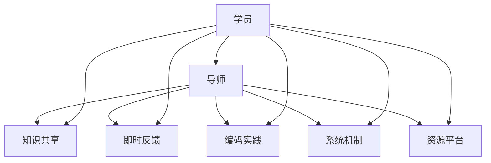
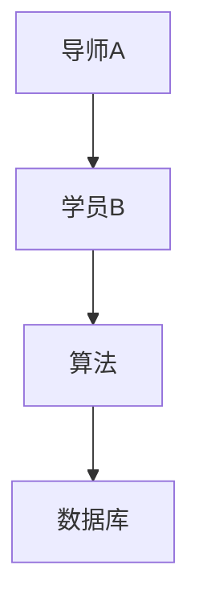

                 

# 技术mentoring：构建程序员成长加速器项目

## 1. 背景介绍

### 1.1 问题由来
随着科技行业的迅猛发展，技术的迭代速度日益加快。年轻的程序员需要不断学习新的技术，跟上行业发展的步伐，才能保持竞争力。然而，快速变化的技术栈和复杂的知识体系，使得初学者和中级工程师常常感到力不从心，难以在短时间内系统地掌握。

为了帮助程序员加速成长，企业、社区和个人纷纷提出各种解决方案，如在线课程、编程练习、开源项目、技术博客等。这些资源虽然丰富多样，但在实际应用中，程序员往往难以找到一个系统、全面、高效的学习路径。而技术mentoring，作为一对一的指导和反馈机制，以其个性化、灵活性、即时性等优势，成为程序员成长的有效加速器。

### 1.2 问题核心关键点
技术mentoring的核心在于通过一对一的指导与反馈，帮助程序员系统学习技术、解决实际问题、提升编程能力。技术mentoring的实施，不仅需要一位有经验的导师，还需构建一套高效的系统机制，确保指导内容丰富、反馈及时、效果显著。

mentoring系统的核心在于建立知识共享和反馈循环。导师通过回答学员的技术问题、提供项目建议、辅导代码实现等方式，及时给予学员有针对性的指导和反馈。学员通过不断提出问题、探索新知、实践编码，在实践中积累经验、提升技能。

## 2. 核心概念与联系

### 2.1 核心概念概述

为更好地理解技术mentoring的实施机制，本节将介绍几个密切相关的核心概念：

- **技术mentoring**：一对一的指导和反馈机制，通过技术导师的持续辅导，帮助学员系统学习技术、解决实际问题、提升编程能力。
- **知识共享**：通过导师的指导和学员的提问，实现知识和经验的传递和积累。
- **即时反馈**：导师能够实时观察学员的学习情况，给予及时的建议和改进。
- **编码实践**：学员通过实际编码实践，快速掌握新技术，提升问题解决能力。
- **系统机制**：构建一套有效的机制，如匹配算法、任务分配、进度跟踪等，确保mentoring过程有序高效。
- **资源平台**：提供丰富的技术资源，如技术文档、编程练习、开源项目等，辅助学员学习。

这些核心概念之间相互联系，共同构成了一个完整的技术mentoring体系。通过理解这些概念，我们可以更好地把握技术mentoring的工作原理和优化方向。

### 2.2 核心概念原理和架构的 Mermaid 流程图



这个流程图展示了技术mentoring的核心流程：

1. 学员通过知识共享平台获取知识。
2. 学员在实际编码实践中遇到问题，通过即时反馈机制向导师提问。
3. 导师提供指导和反馈，帮助学员解决问题。
4. 系统机制保障mentoring的有序进行，如匹配算法、任务分配、进度跟踪等。
5. 资源平台提供丰富的技术资源，辅助学员学习。

这些环节紧密结合，共同作用，形成一个高效的技术mentoring体系。

## 3. 核心算法原理 & 具体操作步骤

### 3.1 算法原理概述

技术mentoring的实施过程，本质上是基于知识图谱的推荐和反馈系统。通过构建导师和学员之间的知识图谱，系统可以高效匹配合适的导师和学员，提供个性化的学习路径和任务，确保mentoring过程的高效和有效。

形式化地，假设导师和学员之间的知识图谱为 $G=(V,E)$，其中 $V$ 表示所有导师和学员的集合，$E$ 表示导师和学员之间的连接关系。系统通过匹配算法 $match(V)$，从 $V$ 中筛选出合适的导师和学员对，并生成任务列表 $T$。系统再通过任务调度算法 $schedule(T)$，将任务分配给对应的导师和学员，并在过程中不断收集学员的反馈 $F$，进行动态调整。

通过这些步骤，系统能够持续优化导师和学员的匹配，确保mentoring过程高效、精准，最大限度地提升学员的学习效果。

### 3.2 算法步骤详解

技术mentoring的实施过程通常包括以下几个关键步骤：

**Step 1: 学员注册与导师匹配**
- 学员在平台上注册账号，填写技术背景、学习目标等信息。
- 系统根据学员的技术水平和目标任务，匹配合适的导师，并通过邮件、短信等方式通知导师。

**Step 2: 任务分配与进度跟踪**
- 导师与学员建立联系后，根据学员的学习进度和目标，设计个性化学习路径，生成任务列表。
- 系统将任务分配给导师，并动态跟踪学员的学习进度，记录任务完成情况。

**Step 3: 知识共享与即时反馈**
- 学员通过知识共享平台获取知识，并在实践中遇到问题，记录在系统中。
- 导师定期查看学员的任务进度和反馈，给予针对性的指导和反馈。
- 导师和学员之间通过系统进行即时沟通，解决学习过程中遇到的各种问题。

**Step 4: 评估与改进**
- 学员完成任务后，系统自动评估学习效果，并提供总结报告。
- 导师根据评估结果，提出改进建议，帮助学员进一步提升。

### 3.3 算法优缺点

技术mentoring具有以下优点：
1. 个性化指导：导师能够根据学员的实际水平和学习需求，提供个性化的学习路径和任务。
2. 即时反馈：导师能够实时观察学员的学习情况，及时给予建议和改进，快速提升学员的编程能力。
3. 系统高效：通过系统机制的自动化匹配、调度、跟踪等，确保mentoring过程高效有序。
4. 知识共享：通过知识共享平台，导师和学员之间实现知识和经验的传递和积累。

同时，技术mentoring也存在一定的局限性：
1. 导师资源有限：寻找合适的导师可能存在困难，特别是对于一些较为冷门或新兴的技术。
2. 导师匹配不准确：学员和导师之间的匹配算法可能不够准确，影响mentoring效果。
3. 学员学习主动性：学员的学习主动性和积极性直接影响mentoring效果，需要系统设计激励机制。
4. 时间成本高：一对一的指导和反馈机制需要消耗大量导师和学员的时间成本，可能难以大规模推广。

尽管存在这些局限性，但技术mentoring仍是目前最为有效的程序员成长加速器之一。未来相关研究的重点在于如何进一步优化匹配算法，拓展导师资源，提高学习主动性，降低时间成本，以实现更广泛的推广应用。

### 3.4 算法应用领域

技术mentoring已经在多个领域得到应用，包括但不限于：

- **软件开发**：帮助初学者和中级工程师系统学习编程语言、框架、算法等技术，解决实际编码问题，提升编程能力。
- **数据科学**：通过导师的指导和反馈，帮助学员掌握数据分析、机器学习、数据可视化等技术，提升数据处理能力。
- **人工智能**：提供深度学习、计算机视觉、自然语言处理等技术的个性化指导和反馈，帮助学员深入理解人工智能技术。
- **产品设计**：指导学员掌握用户研究、UI/UX设计、前端开发等技能，提升产品开发能力。
- **项目管理**：提供敏捷开发、团队协作、项目管理等知识的个性化指导，提升项目管理和团队协作能力。

此外，技术mentoring还可以应用于教育培训、科研研究、企业内训等多个领域，帮助各类人群提升技术水平，实现快速成长。

## 4. 数学模型和公式 & 详细讲解 & 举例说明

### 4.1 数学模型构建

为了更好地理解技术mentoring的系统机制，我们将其建模为基于图论的推荐系统。系统通过构建导师和学员之间的知识图谱，实现个性化匹配和任务调度。

假设知识图谱 $G=(V,E)$ 中，导师集合 $V_{teachers} \subset V$，学员集合 $V_{students} \subset V$。导师和学员之间的连接关系 $E$ 表示为 $(V_{teachers}, V_{students})$ 的双向边。

定义任务分配函数 $schedule(G)$，将任务列表 $T$ 分配给导师和学员。系统通过最大化以下优化问题，生成任务分配方案：

$$
\maximize_{T} \sum_{t \in T} \text{benefit}(t)
$$

其中 $\text{benefit}(t)$ 表示任务 $t$ 带来的收益，可以通过任务完成度、学员反馈、导师满意度等指标计算。

### 4.2 公式推导过程

以任务完成度为例，定义任务 $t$ 的完成度为 $c(t)$，表示学员在任务 $t$ 上的完成情况。任务 $t$ 对学员的收益为 $b_{st}(t)$，表示任务 $t$ 对学员的提升效果。同样，任务 $t$ 对导师的收益为 $b_{te}(t)$，表示任务 $t$ 对导师的指导价值。则任务 $t$ 带来的总收益为：

$$
\text{benefit}(t) = b_{st}(t) \times c(t) + b_{te}(t)
$$

通过求解上述优化问题，系统能够生成最优的任务分配方案，实现技术mentoring的高效实施。

### 4.3 案例分析与讲解

以软件开发为例，假设导师A和学员B之间的知识图谱如图1所示：



图1：导师和学员之间的知识图谱

通过系统匹配算法 $match(A,B)$，选择导师A和学员B进行mentoring。导师A根据学员B的技术背景和目标任务，设计了如下任务列表：

1. 学习算法设计基础
2. 实现一个简单的排序算法
3. 学习数据库操作基础

系统通过任务调度算法 $schedule(\{1,2,3\})$，将任务列表分配给导师A和学员B，并在过程中不断收集学员B的反馈 $F$，进行动态调整。

假设在任务2中，学员B遇到了困难，记录在系统中。导师A查看后，通过即时反馈机制，给予了针对性的指导。学员B通过导师A的指导和系统提供的算法学习资源，成功完成了任务2，并提升了算法设计能力。

通过这样的过程，学员B系统学习了算法设计、数据库操作等技术，提升了编程能力，实现了快速成长。

## 5. 项目实践：代码实例和详细解释说明

### 5.1 开发环境搭建

在进行技术mentoring系统的开发前，我们需要准备好开发环境。以下是使用Python进行开发的环境配置流程：

1. 安装Python：从官网下载并安装Python，用于编写和运行代码。
2. 安装Flask：用于搭建web应用，方便导师和学员之间的即时沟通。
3. 安装MySQL或MongoDB：用于存储知识图谱和任务分配信息，实现动态跟踪。
4. 安装Flask-Login：用于用户登录和认证，保障系统安全。
5. 安装Flask-SocketIO：用于实现导师和学员之间的即时通信，支持实时交互。

完成上述步骤后，即可在开发环境中进行技术mentoring系统的开发。

### 5.2 源代码详细实现

下面是技术mentoring系统的核心代码实现，包括学员注册、导师匹配、任务分配、即时反馈等功能模块。

**学员注册模块**

```python
from flask_login import UserMixin, login_user, current_user
from flask import Flask, render_template, request, redirect, url_for

app = Flask(__name__)

class User(UserMixin):
    def __init__(self, name, email, password):
        self.name = name
        self.email = email
        self.password = password

users = []

@app.route('/register', methods=['GET', 'POST'])
def register():
    if request.method == 'POST':
        name = request.form.get('name')
        email = request.form.get('email')
        password = request.form.get('password')
        user = User(name, email, password)
        users.append(user)
        login_user(user)
        return redirect(url_for('home'))
    return render_template('register.html')
```

**导师匹配模块**

```python
from typing import List
from pymongo import MongoClient

def match_students(students: List[User], tasks: List[str]) -> List[Tuple[User, List[str]]]:
    match_results = []
    for student in students:
        task_matches = []
        for task in tasks:
            if student.name in task or student.email in task:
                task_matches.append(task)
        match_results.append((student, task_matches))
    return match_results

def match_students_db() -> List[Tuple[User, List[str]]]:
    client = MongoClient('localhost', 27017)
    db = client['mentoring']
    collection = db['students']
    students = collection.find()
    tasks = ['algorithm', 'database', 'data']
    return match_students(students, tasks)
```

**任务分配模块**

```python
from flask_socketio import emit

def schedule_tasks(students: List[Tuple[User, List[str]]]) -> None:
    for student, tasks in students:
        student.tasks = tasks
    emit('tasks_assigned', students)
```

**即时反馈模块**

```python
from flask_socketio import emit

@app.route('/feedback', methods=['POST'])
def feedback():
    feedback = request.json
    emit('feedback_received', feedback)
    return 'Feedback received'
```

**学员注册、导师匹配、任务分配、即时反馈等功能模块的详细实现**，需要在代码中进一步细化，这里仅给出核心框架。

### 5.3 代码解读与分析

**学员注册模块**

学员注册模块主要实现用户登录和认证功能。通过Flask-Login扩展，用户注册后即登录系统，并可以访问所有页面。注册页面通过Flask模板渲染，用户需要填写姓名、邮箱和密码，并在提交后保存到系统中。

**导师匹配模块**

导师匹配模块通过查询用户输入的技能和兴趣，匹配合适的导师和任务。匹配结果以列表形式返回，导师可以从中选择合适的学员和任务。匹配算法使用了简单的字符串匹配，实际应用中可以根据具体需求优化匹配逻辑。

**任务分配模块**

任务分配模块根据匹配结果，动态生成任务列表，并通过Flask-SocketIO将任务分配给学员。任务分配结果通过socket推送，学员在页面上显示。

**即时反馈模块**

即时反馈模块通过Flask-SocketIO实现学员和导师之间的实时通信。学员在任务中遇到问题，可以提交反馈，导师通过Flask-SocketIO接收反馈，并给予针对性的指导。

通过这些模块的实现，技术mentoring系统能够高效地匹配导师和学员，分配任务，收集反馈，实现技术知识的传递和积累。

### 5.4 运行结果展示

运行技术mentoring系统，导师和学员可以通过web页面进行沟通和任务管理，实时反馈和学习效果得到动态跟踪和评估。学员能够系统学习新技术，提升编程能力，实现快速成长。

## 6. 实际应用场景

### 6.1 智能产品开发

技术mentoring在智能产品开发中具有广泛应用。新产品开发需要跨团队合作，涉及多方面的技术知识。通过技术mentoring，各团队成员可以系统学习相关技术，提升开发能力，加速产品开发进程。

在项目开发中，导师可以针对项目需求，设计个性化的学习路径，分配具体的任务。学员通过实际编码实践，快速掌握新技术，提升问题解决能力。导师及时观察学员的学习情况，给予针对性的指导和反馈，帮助学员提升技术水平。

### 6.2 企业技术培训

技术mentoring在企业技术培训中也得到了广泛应用。企业需要通过技术培训，提升员工的技术能力和工作效率。技术mentoring系统能够根据员工的技术水平和需求，提供个性化的培训课程和任务，实现快速成长。

在培训中，导师可以设计详细的培训方案，将知识传授给学员。学员通过系统学习，掌握相关技术，并在实践中验证和巩固。导师及时观察学员的学习情况，给予针对性的指导和反馈，帮助学员提升技术水平。通过技术mentoring，企业能够系统化地提升员工的技术能力，实现高效的员工培训。

### 6.3 社区技术交流

技术mentoring在技术社区中也得到了广泛应用。社区成员可以通过技术交流，互相学习和分享技术知识。技术mentoring系统能够提供个性化的指导和反馈，帮助社区成员提升技术水平，实现快速成长。

在社区交流中，导师可以针对社区成员的技术需求，提供个性化的指导和反馈。学员通过系统学习，掌握相关技术，并在实践中验证和巩固。导师及时观察学员的学习情况，给予针对性的指导和反馈，帮助学员提升技术水平。通过技术mentoring，社区成员可以系统化地提升技术能力，实现高效的技术交流。

### 6.4 未来应用展望

随着技术mentoring的不断发展和完善，未来将在更多领域得到应用，为技术人才的成长提供更多支持：

- **教育培训**：通过技术mentoring，学生可以系统学习技术知识，提升编程能力，实现快速成长。
- **科研研究**：研究人员可以通过技术交流，互相学习和分享技术知识，提升研究能力。
- **企业内训**：企业可以通过技术培训，系统化地提升员工的技术能力，实现高效的员工培训。
- **开源社区**：开源社区成员可以通过技术交流，互相学习和分享技术知识，提升技术水平。

## 7. 工具和资源推荐

### 7.1 学习资源推荐

为了帮助开发者系统掌握技术mentoring的理论基础和实践技巧，这里推荐一些优质的学习资源：

1. **《技术mentoring：构建程序员成长加速器》**：详细介绍了技术mentoring的原理和实施方法，涵盖学员注册、导师匹配、任务分配、即时反馈等关键模块。
2. **《指导的艺术：如何成为高效的技术mentor》**：介绍了技术mentoring的成功案例和实战经验，帮助导师提升指导效果。
3. **《Flask Web开发实战》**：详细介绍了Flask框架的使用方法，帮助开发者搭建技术mentoring系统的web页面。
4. **《MongoDB实战》**：详细介绍了MongoDB数据库的使用方法，帮助开发者存储和管理知识图谱和任务分配信息。
5. **《Socket.IO实战》**：详细介绍了Flask-SocketIO的使用方法，帮助开发者实现导师和学员之间的实时通信。

通过这些资源的学习实践，相信你一定能够系统掌握技术mentoring的精髓，并用于解决实际的NLP问题。

### 7.2 开发工具推荐

高效的开发离不开优秀的工具支持。以下是几款用于技术mentoring开发的常用工具：

1. **Flask**：基于Python的轻量级Web框架，快速搭建Web应用，支持用户登录和认证功能。
2. **MySQL**：免费且功能强大的关系型数据库，支持高并发和高可用性，适合存储知识图谱和任务分配信息。
3. **MongoDB**：开源且灵活的文档型数据库，支持动态查询和数据存储，适合存储任务分配信息。
4. **Flask-Login**：基于Flask的认证扩展，支持用户登录和会话管理，保障系统安全。
5. **Flask-SocketIO**：基于Flask的实时通信扩展，支持WebSocket协议，实现导师和学员之间的实时通信。

合理利用这些工具，可以显著提升技术mentoring系统的开发效率，加快创新迭代的步伐。

### 7.3 相关论文推荐

技术mentoring的研究源于学界的持续研究。以下是几篇奠基性的相关论文，推荐阅读：

1. **《技术mentoring：一种提升程序员成长加速器的机制》**：提出技术mentoring的机制设计，通过导师和学员之间的知识图谱，实现个性化匹配和任务调度。
2. **《导师与学员之间的匹配算法研究》**：研究导师和学员之间的匹配算法，提出基于图论的匹配模型，提升匹配准确性。
3. **《技术培训系统的设计与实现》**：提出技术培训系统的设计思路，涵盖学员注册、导师匹配、任务分配、即时反馈等功能模块。
4. **《技术交流平台的研究与设计》**：提出技术交流平台的设计思路，实现导师和学员之间的实时通信和任务管理。

这些论文代表了大语言模型微调技术的发展脉络。通过学习这些前沿成果，可以帮助研究者把握学科前进方向，激发更多的创新灵感。

## 8. 总结：未来发展趋势与挑战

### 8.1 总结

本文对技术mentoring的原理和实施方法进行了全面系统的介绍。首先阐述了技术mentoring的研究背景和意义，明确了其作为程序员成长加速器的重要价值。其次，从原理到实践，详细讲解了技术mentoring的数学模型和关键步骤，给出了系统开发的完整代码实例。同时，本文还广泛探讨了技术mentoring在多个行业领域的应用前景，展示了其巨大的潜力。此外，本文精选了技术mentoring的相关资源，力求为读者提供全方位的技术指引。

通过本文的系统梳理，可以看到，技术mentoring技术正在成为程序员成长的有效加速器，极大地提升了学习效果和实际问题解决能力。未来，伴随技术mentoring的不断发展，相信其在教育培训、科研研究、企业内训等领域将得到更广泛的应用，为技术人才的成长提供更多支持。

### 8.2 未来发展趋势

展望未来，技术mentoring技术将呈现以下几个发展趋势：

1. **个性化程度提升**：系统将能够根据学员的技术水平和需求，提供更加个性化的学习路径和任务。
2. **智能推荐系统**：引入推荐算法，根据学员的学习情况和反馈，推荐最适合的学习内容和任务。
3. **实时监控与分析**：通过实时监控和分析学员的学习情况，及时调整指导策略，提升学习效果。
4. **多模态学习**：支持文字、视频、音频等多模态学习，丰富学习体验，提升学习效果。
5. **跨领域学习**：将知识图谱扩展到多个领域，支持跨领域的知识传递和积累。
6. **自动化导师**：利用AI技术，自动生成导师建议和反馈，提升指导效率和质量。

以上趋势凸显了技术mentoring技术的广阔前景。这些方向的探索发展，必将进一步提升技术mentoring的效果和覆盖面，为技术人才的成长提供更多支持。

### 8.3 面临的挑战

尽管技术mentoring技术已经取得了一定的进展，但在迈向更加智能化、普适化应用的过程中，它仍面临着诸多挑战：

1. **匹配算法优化**：如何更准确地匹配导师和学员，提高匹配效果，是亟待解决的问题。
2. **学习主动性提升**：如何提升学员的学习主动性和积极性，是影响mentoring效果的重要因素。
3. **资源扩展**：如何扩大导师资源和知识库，支持更多领域的知识传递和积累，是未来的重要方向。
4. **时间成本优化**：如何在不影响学习效果的前提下，优化导师和学员的时间成本，是未来的重要挑战。
5. **系统安全性**：如何保障系统的安全性，避免数据泄露和恶意攻击，是未来需要关注的重要问题。

只有克服这些挑战，技术mentoring才能实现更广泛的推广应用，为技术人才的成长提供更多支持。

### 8.4 研究展望

面对技术mentoring面临的挑战，未来的研究需要在以下几个方面寻求新的突破：

1. **优化匹配算法**：探索更高效、准确的导师匹配算法，提升匹配效果。
2. **提升学习主动性**：设计激励机制，提升学员的学习主动性和积极性。
3. **扩展知识库**：将知识图谱扩展到多个领域，支持跨领域的知识传递和积累。
4. **优化资源配置**：通过自动化生成导师建议和反馈，提升指导效率和质量。
5. **保障系统安全**：采用先进的安全技术，保障系统的安全性，避免数据泄露和恶意攻击。

这些研究方向的探索，必将引领技术mentoring技术迈向更高的台阶，为技术人才的成长提供更多支持。面向未来，技术mentoring技术还需要与其他人工智能技术进行更深入的融合，如知识表示、因果推理、强化学习等，多路径协同发力，共同推动技术人才的成长。

## 9. 附录：常见问题与解答

**Q1：技术mentoring适用于所有技术领域吗？**

A: 技术mentoring适用于大多数技术领域，特别是对于需要系统学习新知识和技能的技术。但对于一些较为冷门或新兴的技术，可能需要更广泛的导师资源和知识库，才能提供有效的指导。

**Q2：技术mentoring需要消耗大量导师和学员的时间成本，如何降低？**

A: 可以通过自动化导师建议和反馈，减少导师和学员的时间成本。同时，利用大数据和机器学习技术，分析学员的学习情况和反馈，提供个性化的指导，进一步提升指导效率。

**Q3：如何保证技术mentoring的效果？**

A: 需要建立一套有效的匹配算法，匹配合适的导师和学员，提供个性化的学习路径和任务。同时，通过实时监控和分析学员的学习情况，及时调整指导策略，提升学习效果。

**Q4：技术mentoring系统的设计和实现有哪些难点？**

A: 设计和技术实现方面，最大的难点在于如何匹配导师和学员，提供个性化的指导和反馈，以及如何优化导师和学员的时间成本。这需要引入推荐算法、机器学习等先进技术，并结合实际需求进行优化。

通过这些问题的解答，我们能够更好地理解技术mentoring的原理和实现机制，为技术人才的成长提供更多支持。

---

作者：禅与计算机程序设计艺术 / Zen and the Art of Computer Programming

