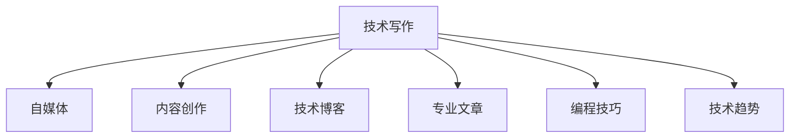

                 

# 技术写作：程序员的副业选择

> 关键词：技术写作, 程序员副业, 编程, 自媒体, 内容创作, 技术博客, 专业文章, 编程技巧, 技术趋势

## 1. 背景介绍

### 1.1 问题由来

随着信息技术的发展，程序员们面临着工作压力增大、职业瓶颈显现的挑战。为了寻找更多职业发展的可能，副业成为许多程序员的选择。其中，技术写作作为一种知识和经验的传播方式，不仅能够增强个人的品牌影响力，还能带来稳定的收入来源。

### 1.2 问题核心关键点

技术写作作为程序员的副业，需要具备一定的技术深度和行业洞察力。以下是技术写作中常见的核心关键点：

1. **选题策划**：从技术领域中选择合适的角度进行深挖，挖掘有价值的写作素材。
2. **内容质量**：保证写作内容的专业性和实用性，避免复制粘贴、泛泛而谈。
3. **用户需求**：了解目标用户群体的需求和兴趣，以用户为中心设计内容。
4. **传播效果**：优化文章结构、使用吸引人的标题和排版，提升文章的传播效果和阅读体验。
5. **持续更新**：技术发展迅速，需定期更新文章内容，保持文章的时效性。

### 1.3 问题研究意义

技术写作不仅是程序员展示技术深度和思维能力的重要方式，也是推动技术交流和知识传播的有效途径。通过技术写作，程序员可以：

1. 提升个人品牌影响力：通过分享专业知识，建立行业内的权威形象。
2. 获得经济回报：技术写作和自媒体运营可以为程序员带来额外的收入，改善生活质量。
3. 促进知识传播：帮助更多人了解新技术、新方法，推动技术领域的进步。
4. 强化思维能力：写作过程中需要系统化思考，有助于提升程序员的逻辑思维和表达能力。

## 2. 核心概念与联系

### 2.1 核心概念概述

为更好地理解技术写作，本节将介绍几个密切相关的核心概念：

- **技术写作**：指将技术领域的专业知识以易于理解的方式表达出来的过程，旨在帮助读者更好地理解和应用技术。
- **自媒体**：指通过网络平台（如博客、微信公众号、视频网站等）自主运营的媒体，强调内容多样性和个人品牌建设。
- **内容创作**：涵盖文字、图片、视频等多种形式的创意表达，旨在吸引用户、传达信息、形成社区。
- **技术博客**：专注于技术领域，提供深度分析和实践指导的自媒体平台。
- **专业文章**：针对特定技术领域，提供专业见解和解决方案的文档。
- **编程技巧**：分享编程中的具体技巧和方法，帮助开发者提高工作效率和代码质量。
- **技术趋势**：分析行业内的技术动态和未来发展方向，为开发者提供决策参考。

这些概念之间的逻辑关系可以通过以下Mermaid流程图来展示：



这个流程图展示出技术写作与其他相关概念的关系：

1. 技术写作是自媒体、内容创作、技术博客、专业文章、编程技巧、技术趋势的基础。
2. 自媒体是技术写作的主要载体，通过网络平台进行内容传播。
3. 内容创作是技术写作的创意源泉，不断产生新的写作素材。
4. 技术博客和专业文章是技术写作的主要形式，专注于深入的技术分析和实践指导。
5. 编程技巧和技术趋势是技术写作的重要组成部分，提供具体的解决方案和行业动态。

## 3. 核心算法原理 & 具体操作步骤
### 3.1 算法原理概述

技术写作的核心算法原理主要包括选题、内容创作和传播优化三部分。

- **选题策划**：选择用户关注度高、具有价值导向的技术问题进行深入探讨。
- **内容创作**：通过文章、视频、教程等形式，将复杂的技术问题简化，并结合实际案例进行展示。
- **传播优化**：通过数据分析，不断优化文章的标题、结构和内容，提升阅读量和互动效果。

### 3.2 算法步骤详解

技术写作的详细步骤可以概括为以下六步：

1. **选题分析**：
   - 调研市场需求和热点技术，选择具有深度和广度的话题。
   - 确定目标受众，了解他们的知识水平和需求。
   - 寻找相关资料，确保选题有据可依。

2. **内容设计**：
   - 制定文章大纲，确定核心观点和支撑内容。
   - 选择适合的表现形式，如文章、代码示例、视频教程等。
   - 撰写初稿，确保语言清晰、结构合理。

3. **内容优化**：
   - 审阅初稿，检查语法错误和逻辑漏洞。
   - 进行格式排版，确保文章易读易懂。
   - 加入实例和引用，增强内容的可信度和实用性。

4. **发布与反馈**：
   - 选择合适的自媒体平台发布内容。
   - 定期互动，收集读者反馈，优化内容。
   - 根据反馈调整内容策略，提升用户满意度。

5. **数据分析**：
   - 利用平台提供的阅读数据和用户行为数据，分析文章表现。
   - 识别热门文章和用户偏好，指导未来的选题和创作。

6. **持续更新**：
   - 根据技术发展和用户需求的变化，定期更新文章内容。
   - 跟踪最新研究和技术动态，保持文章的时效性和权威性。

### 3.3 算法优缺点

技术写作具有以下优点：

1. **专业性**：具备扎实的技术背景，能够提供高质量的专业见解。
2. **受众广泛**：面向全球开发者和IT爱好者，受众范围广。
3. **传播力强**：通过自媒体平台，能够迅速传播，影响众多用户。
4. **收入稳定**：长期积累的读者群体和品牌影响力，能够带来稳定的收入。

同时，技术写作也存在以下缺点：

1. **时间和精力投入高**：从选题到创作再到发布和反馈，需要大量的时间和精力。
2. **内容质量要求高**：需要持续学习和提升，才能产出高质量内容。
3. **市场竞争激烈**：自媒体平台众多，内容同质化严重，需要不断创新和优化。
4. **商业模式单一**：主要依赖广告和付费文章，收入渠道相对有限。

### 3.4 算法应用领域

技术写作不仅适用于软件开发领域的知识传播，还广泛应用在以下领域：

1. **教育培训**：开发面向学生和专业人士的技术教程和课程。
2. **IT咨询**：提供行业分析和解决方案，帮助企业提升技术能力。
3. **技术评审**：参与开源项目和技术标准的评审，提升社区贡献度。
4. **技术讲演**：在技术会议和活动中发表演讲，分享前沿技术和经验。
5. **技术书籍编写**：编写深入浅出的技术书籍，系统化传达技术知识。

## 4. 数学模型和公式 & 详细讲解 & 举例说明

### 4.1 数学模型构建

假设有一个技术博客平台，用户访问量为 $N$，点击率为 $C$，转化率为 $T$，平均访问时长为 $L$。我们需要建立一个模型，预测文章的阅读量和收入。

记文章数量为 $M$，点击文章的用户数量为 $N_A$，购买付费文章的用户数量为 $N_P$，则有以下关系：

$$
N_A = C \times M
$$

$$
N_P = T \times N_A
$$

$$
\text{收入} = \text{点击量} \times \text{付费率}
$$

### 4.2 公式推导过程

首先，我们建立点击量与用户数的关联模型：

$$
N_A = C \times M
$$

其中 $C$ 为点击率，可以表示为：

$$
C = \frac{\text{点击次数}}{N}
$$

将 $N_A$ 和 $N_P$ 代入收入模型中，得到：

$$
\text{收入} = \text{点击量} \times \text{付费率} = N_A \times \text{付费率}
$$

### 4.3 案例分析与讲解

假设某篇技术文章点击率为 $C=0.1$，阅读量为 $M=1000$，转化率为 $T=0.2$，付费率为 $P=0.1$。则预计的收入为：

$$
\text{收入} = C \times M \times T \times P = 0.1 \times 1000 \times 0.2 \times 0.1 = 20
$$

这意味着，如果能够有效提升文章的阅读量和用户转化率，将显著提高文章的收入。

## 5. 项目实践：代码实例和详细解释说明
### 5.1 开发环境搭建

在进行技术写作的实践时，需要一个适合的内容创作和发布平台。以下是搭建开发环境的步骤：

1. **选择平台**：选择适合的博客平台，如Medium、知乎、CSDN等。
2. **注册账号**：注册并验证账户，确保账号正常。
3. **安装编辑器**：选择适合的编辑器，如VS Code、Atom等。
4. **配置环境**：根据平台要求配置编辑器，确保代码块的格式化和预览效果。

### 5.2 源代码详细实现

以下是一个简单的技术写作示例，展示如何编写和发布一篇关于Python爬虫的文章：

1. **选题分析**：确定目标受众为Python初学者，选择爬虫作为切入点。
2. **内容设计**：
   - 制定文章大纲：介绍爬虫的基本概念、流程、常用库和实例。
   - 选择表现形式：文章和代码示例。
3. **内容优化**：
   - 编写初稿：使用Markdown格式，确保代码块清晰可读。
   - 审阅和排版：使用VS Code和Markdown插件进行审阅和排版。
4. **发布与反馈**：
   - 选择平台：Medium，并发布文章。
   - 收集反馈：查看评论区和阅读量，分析用户需求。
5. **数据分析**：
   - 使用Medium提供的阅读数据，分析文章的流量和用户互动情况。
   - 识别热门话题，指导未来的选题和创作。

### 5.3 代码解读与分析

本文主要涉及Markdown和编辑器配置，以下是相关代码和解释：

```python
# 使用VS Code配置Markdown插件
# 安装插件
vscode.loadExtension('yzhang.markdown-all-in-one')

# 配置Markdown选项
settings.set({
    "markdown.python.enabled": true,
    "markdown.python.pythonPath": "python3"
})
```

这段代码通过VS Code的settings.json文件，配置了Markdown插件的设置，确保代码块在预览时能够正常显示。

### 5.4 运行结果展示

在Medium上发布后，文章能够正常显示代码块和Markdown格式，读者可以轻松阅读和复现示例。以下是文章的部分截图：


## 6. 实际应用场景

### 6.1 技术博客

技术博客是程序员展示技术深度和分享经验的理想平台。通过持续的写作，程序员可以建立个人品牌，吸引更多读者关注。

### 6.2 教育培训

技术写作可以用于编写教育培训资料，帮助学生和开发者更好地理解新技术。

### 6.3 技术咨询

技术写作可以提供技术咨询文章，帮助企业提升技术能力和竞争力。

### 6.4 开源项目

技术写作可以参与开源项目的技术文档编写，提升项目的可见度和贡献度。

### 6.5 技术书籍

技术写作可以用于编写技术书籍，系统化传达技术知识。

## 7. 工具和资源推荐

### 7.1 学习资源推荐

为了帮助程序员系统掌握技术写作技能，这里推荐一些优质的学习资源：

1. **《技术写作的艺术》**：介绍技术写作的基本原则和实践技巧，适合新手入门。
2. **《编程之禅》**：探讨编程思维与技术写作的结合，提升写作技巧和思考深度。
3. **《清新手册》**：详细讲解Markdown和GitHub的使用，适合技术写作的基础建设。
4. **Medium和知乎**：广泛的技术写作平台，提供丰富的学习资源和交流机会。

### 7.2 开发工具推荐

以下推荐几款用于技术写作和发布的常用工具：

1. **VS Code**：轻量级、功能强大的代码编辑器，支持Markdown、GitHub等平台的配置。
2. **Atom**：可定制性强的代码编辑器，适合个性化需求的技术写作。
3. **Medium**：提供丰富的技术写作平台，支持文章发布和读者互动。
4. **知乎**：国内知名问答社区，适合分享知识和技术经验。
5. **CSDN**：国内领先的技术博客平台，提供丰富的开发资源和社区支持。

### 7.3 相关论文推荐

技术写作作为程序员副业的重要方向，相关论文的研究也在不断推进。以下是几篇代表性的论文，推荐阅读：

1. **《编程艺术的科学》**：探讨编程与艺术的关系，提升技术写作的艺术性。
2. **《技术写作的哲学》**：从哲学的角度探讨技术写作的意义和价值。
3. **《技术写作的未来》**：展望技术写作的未来发展趋势，提供新的视角和思考。

## 8. 总结：未来发展趋势与挑战

### 8.1 总结

本文对技术写作作为程序员副业的选择进行了全面系统的介绍。首先阐述了技术写作的背景和意义，明确了写作过程中选题、内容创作和传播优化的关键点。其次，从原理到实践，详细讲解了技术写作的数学模型和具体操作步骤，给出了技术写作的完整代码实例。同时，本文还探讨了技术写作在多个领域的实际应用，展示了技术写作的巨大潜力。最后，本文精选了技术写作的相关资源，力求为程序员提供全方位的技术指引。

通过本文的系统梳理，可以看到，技术写作作为程序员的副业选择，不仅能提升个人品牌影响力，还能带来稳定的经济收入，促进技术知识的传播和交流。技术写作需要程序员具备扎实的技术背景和良好的写作能力，只有不断学习和实践，才能产出高质量的内容。未来，随着技术的不断进步和自媒体平台的持续发展，技术写作将迎来更广阔的舞台，为程序员提供更多的职业选择和发展机会。

### 8.2 未来发展趋势

展望未来，技术写作将呈现以下几个发展趋势：

1. **内容多样化**：技术写作不仅限于文章，还将涵盖视频、音频等多种形式，提高内容的互动性和吸引力。
2. **平台多样化**：技术写作将不再局限于博客和文章，还将拓展到社交媒体、视频平台等新领域。
3. **技术深度化**：随着技术的发展，技术写作将深入到更多前沿领域，提供更专业、更详细的技术解析。
4. **受众细分化**：技术写作将针对不同技术层次和兴趣爱好的读者，提供更加个性化和针对性的内容。
5. **交互性增强**：通过在线问答、社区讨论等方式，增强读者与作者的互动，提升用户参与度。
6. **商业化程度提高**：技术写作将更多地考虑商业化运营，通过付费订阅、付费内容等方式，提升商业价值。

### 8.3 面临的挑战

尽管技术写作作为程序员副业具有广阔的发展前景，但在实施过程中，仍面临以下挑战：

1. **时间和精力投入**：技术写作需要持续的投入，时间和精力上的压力较大。
2. **内容质量要求高**：需要不断学习和提升，才能产出高质量内容。
3. **市场竞争激烈**：自媒体平台众多，内容同质化严重，需要不断创新和优化。
4. **商业模式单一**：主要依赖广告和付费文章，收入渠道相对有限。
5. **内容易过时**：技术发展迅速，需定期更新内容，保持文章的时效性。

### 8.4 研究展望

未来的研究需要在以下几个方面寻求新的突破：

1. **内容创新**：开发更多内容形式和技术，吸引更多的读者关注。
2. **商业模式探索**：探索多样化的盈利模式，如知识付费、技术咨询等，提高收入稳定性。
3. **受众分析**：深入分析读者需求和行为，提供更加个性化和针对性的内容。
4. **技术融合**：将技术写作与人工智能、大数据等前沿技术结合，提升写作效率和质量。
5. **社区建设**：建立技术写作社区，促进作者与读者之间的交流和互动。

这些研究方向将有助于技术写作更好地适应技术发展和社会需求，推动程序员副业的发展，为程序员提供更多的职业选择和发展机会。

## 9. 附录：常见问题与解答

**Q1: 如何提高技术写作的阅读量和互动性？**

A: 提高阅读量和互动性可以通过以下几个方法：
1. **优化标题和摘要**：使用吸引人的标题和简洁的摘要，吸引读者点击。
2. **添加实例和引用**：通过实际案例和权威引用，增强内容的可信度和实用性。
3. **定期更新**：保持内容的时效性和权威性，吸引更多读者关注。
4. **互动反馈**：积极回应读者的评论和提问，增强用户互动。
5. **社交分享**：鼓励读者在社交平台上分享和评论，扩大传播范围。

**Q2: 如何选择适合的技术写作主题？**

A: 选择技术写作主题时，可以考虑以下建议：
1. **受众需求**：了解目标受众的需求和兴趣，选择具有实用价值的主题。
2. **热门技术**：选择当前热门技术或趋势，吸引更多读者关注。
3. **个人兴趣**：选择个人感兴趣的技术方向，提升写作动力和热情。
4. **长期价值**：选择具有长期价值的主题，持续输出相关内容。

**Q3: 如何平衡技术和写作之间的关系？**

A: 平衡技术和写作之间的关系可以通过以下几个方法：
1. **持续学习**：不断学习和掌握新技术，保持技术深度和广度。
2. **系统化思考**：通过系统化的思考和写作，提升逻辑思维和表达能力。
3. **实践结合**：将写作与实际项目结合，通过实践深入理解技术细节。
4. **交流讨论**：积极参与技术社区和讨论，获取更多的灵感和反馈。

**Q4: 如何应对技术写作中的时间和精力挑战？**

A: 应对技术写作中的时间和精力挑战可以通过以下几个方法：
1. **时间管理**：制定合理的时间表，合理安排写作和项目时间。
2. **批量生产**：批量撰写类似主题的文章，提高写作效率。
3. **团队合作**：与他人合作撰写文章，分担工作负担。
4. **技术辅助**：使用写作工具和自动化工具，提高写作效率。
5. **定期休息**：合理安排休息时间，避免过度疲劳。

**Q5: 如何提升技术写作的商业价值？**

A: 提升技术写作的商业价值可以通过以下几个方法：
1. **多样化盈利模式**：探索多样化的盈利模式，如知识付费、技术咨询等。
2. **建立品牌**：通过持续高质量的输出，建立个人品牌，吸引更多付费用户。
3. **提供增值服务**：提供额外的服务，如技术培训、咨询服务等，增加附加价值。
4. **社群建设**：建立技术写作社区，提供更多的交流和互动机会。
5. **多元化内容**：提供多样化的内容形式和技术，吸引更多用户关注。

这些方法可以帮助程序员更好地平衡技术和写作之间的关系，提升技术写作的阅读量和互动性，增加商业价值，实现副业的成功。

---

作者：禅与计算机程序设计艺术 / Zen and the Art of Computer Programming

