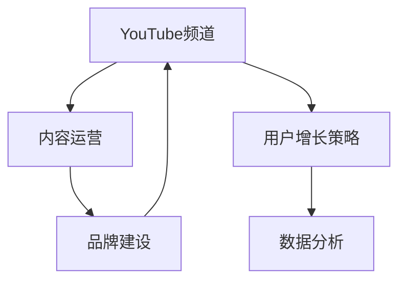

                 

# 技术分享：打造百万粉丝的技术类YouTube频道

> 关键词：技术分享,YouTube频道,数据分析,用户增长策略,内容运营,品牌建设

## 1. 背景介绍

### 1.1 问题由来

随着互联网的发展，YouTube等视频平台逐渐成为全球最大、最受关注的媒体平台之一。技术类YouTube频道凭借其深入浅出的讲解，独到的技术见解，以及具有吸引力的内容形式，迅速积累了大量忠实观众，甚至获得了百万粉丝的关注。许多技术爱好者和开发者通过这些频道，不仅学到了新技术，还结识了同行，甚至迈入了大公司的大门。

在这样的背景下，如何打造并运营一个成功的技术类YouTube频道，成为了广大技术爱好者和专业人士关注的焦点。本文将从背景介绍入手，详细分析创建成功技术类YouTube频道的要素，并提出可行的运营策略。

### 1.2 问题核心关键点

成功的技术类YouTube频道通常具备以下核心要素：
- **独特且有价值的内容**：提供独到的技术见解和实用的技术应用案例。
- **优秀的视觉和音频呈现**：高质量的视频和音频，让用户获得愉悦的观看体验。
- **有效的互动和互动管理**：与观众积极互动，并有效管理用户评论和反馈。
- **持续的更新和优化**：定期发布新内容，并不断优化内容质量和互动方式。
- **明确的品牌定位和传播策略**：确立独特的品牌形象，并通过多种渠道进行有效传播。

## 2. 核心概念与联系

### 2.1 核心概念概述

为更好地理解创建和运营成功技术类YouTube频道的过程，本节将介绍几个关键概念：

- **YouTube频道**：YouTube平台上由用户创建的个性化频道，可发布视频、文章、评论等。
- **内容运营**：通过策划、生产、发布、推广等方式，保持频道内容新鲜、有趣、有价值的运营活动。
- **用户增长策略**：通过分析用户行为数据，制定有效的策略，吸引新用户并促进用户留存。
- **品牌建设**：确立频道的独特风格和品牌形象，增强用户的品牌认知和忠诚度。
- **数据分析**：通过分析用户行为数据，优化频道内容，提升用户体验。

这些核心概念之间的逻辑关系可以通过以下Mermaid流程图来展示：



这个流程图展示了这个过程中各个概念的相互关系：

1. 创建一个YouTube频道。
2. 通过内容运营，发布高质量的视频内容。
3. 使用用户增长策略，吸引新用户并提升用户留存。
4. 利用数据分析，优化频道内容和互动方式。
5. 通过品牌建设，提升频道的独特性和用户认知。

这些概念共同构成了成功的技术类YouTube频道的核心框架。

## 3. 核心算法原理 & 具体操作步骤

### 3.1 算法原理概述

创建和运营成功的技术类YouTube频道，本质上是一个多维度的综合管理过程，涉及到内容制作、用户增长、数据分析等多个方面的策略和技术。其核心在于以下几个方面：

- **用户行为分析**：通过分析用户的观看习惯、互动行为等数据，了解用户需求和偏好。
- **内容策划与制作**：根据用户需求和偏好，策划并制作高质量的视频内容。
- **互动策略**：与用户积极互动，提升用户参与度和忠诚度。
- **品牌传播**：通过多种渠道传播品牌信息，提升品牌知名度和美誉度。

### 3.2 算法步骤详解

创建一个成功的技术类YouTube频道并运营，需要经过以下几个关键步骤：

**Step 1: 确定频道定位和内容主题**
- 分析目标用户群体的技术背景和兴趣偏好。
- 确定频道的核心内容主题，如编程、数据科学、人工智能等。
- 确立频道的品牌形象和口号，如“技术改变世界”。

**Step 2: 建立频道结构**
- 设计频道的子频道结构，如“教程视频”、“技术文章”、“直播访谈”等。
- 确保频道结构清晰，便于用户找到所需内容。

**Step 3: 内容策划与制作**
- 根据用户需求和内容主题，制定详细的内容策划，如“每周一讲”、“每月特辑”等。
- 邀请技术专家或自身团队制作高质量视频内容，确保视频画质和音频清晰，语言流畅。

**Step 4: 用户增长策略**
- 利用YouTube的推荐算法，优化视频标题、描述、标签等，提高视频曝光率。
- 在社交媒体、技术论坛等平台推广频道，吸引更多用户关注。
- 与相关技术博客、新闻网站合作，进行交叉推广。

**Step 5: 数据分析和互动管理**
- 使用YouTube Analytics等工具，分析用户观看行为、互动数据等，了解用户偏好。
- 根据分析结果，优化视频内容和互动方式。
- 积极管理用户评论，及时回复用户问题，增强用户互动。

**Step 6: 品牌建设和传播**
- 通过博客、社交媒体等渠道传播品牌信息，提升品牌知名度。
- 参与技术会议、活动，提升品牌影响力。
- 推出周边产品，如技术书籍、教育课程等，增强品牌粘性。

### 3.3 算法优缺点

成功创建和运营技术类YouTube频道的方法具有以下优点：
1. 满足用户需求：高质量的内容和互动管理，能吸引并留住大量技术爱好者。
2. 增强品牌知名度：通过品牌建设和传播，提升频道在技术社区中的认知度和美誉度。
3. 高效利用资源：通过数据分析和优化，确保资源的高效利用，提升渠道回报率。

同时，这些方法也存在一些局限性：
1. 制作成本高：高质量视频和音频的制作需要较高的技术和人力成本。
2. 维护难度大：频道的持续运营需要不断策划内容、分析用户数据、管理互动等，维护成本较高。
3. 竞争激烈：技术类频道众多，如何在竞争中脱颖而出，需要独到的运营策略。

尽管存在这些局限性，但整体而言，这些方法对于创建一个成功的技术类YouTube频道是非常有效的。

### 3.4 算法应用领域

基于这些方法的YouTube频道，已经在多个技术领域取得了显著成效，如：

- 编程教育：如“Codecademy”频道，提供各类编程语言和技术的教学视频。
- 数据分析：如“DataCamp”频道，提供数据科学和机器学习课程。
- 人工智能：如“Two Minute Papers”频道，每周发布一篇顶级AI论文的简要介绍。
- 软件开发：如“Crafting Interfaces”频道，专注于UI/UX设计和用户体验优化。

这些频道的成功经验表明，基于以上策略和技术，创建和运营技术类YouTube频道是完全可行的。

## 4. 数学模型和公式 & 详细讲解 & 举例说明

### 4.1 数学模型构建

在技术类YouTube频道的运营过程中，数据分析和用户增长策略是两个关键环节。为了更好地理解和优化这两个环节，我们需要构建相应的数学模型。

假设用户总数为 $N$，每次访问时长为 $T$，平均访问深度为 $D$。则每天的视频观看次数 $V$ 可以表示为：

$$
V = N \times T \times D
$$

其中 $N$、$T$、$D$ 分别表示用户总数、每次访问时长和平均访问深度。通过分析这些数据，可以了解用户的观看行为和偏好，从而优化内容策划和互动策略。

### 4.2 公式推导过程

以下我们以“观看次数与平均观看时长”为例，推导相关的数学公式。

假设用户每天的观看次数为 $V$，平均观看时长为 $T_a$。则每天的总观看时长 $T_t$ 可以表示为：

$$
T_t = V \times T_a
$$

通过分析不同视频时长对 $V$ 和 $T_a$ 的影响，可以发现：

- 视频时长较短的视频，观看次数 $V$ 较高，但平均观看时长 $T_a$ 较低。
- 视频时长较长的视频，观看次数 $V$ 较低，但平均观看时长 $T_a$ 较高。

因此，为了提升用户参与度和留存率，需要优化视频时长和频率，找到最优平衡点。

### 4.3 案例分析与讲解

假设某个技术类YouTube频道某天发布了一支时长为 10 分钟的视频，观看次数为 100 次，平均观看时长为 2 分钟。则总观看时长为：

$$
T_t = 100 \times 2 = 200 \text{分钟}
$$

如果该视频时长增加至 30 分钟，其他条件不变，则：

$$
T_t = 100 \times 3 = 300 \text{分钟}
$$

通过计算可知，虽然视频时长增加，但总观看时长也相应增加，表明用户对长视频的参与度提升。但这并不意味着视频越长越好，因为用户留存率也会受到影响。因此，需要根据实际用户行为数据，找到最优的视频时长和发布频率。

## 5. 项目实践：代码实例和详细解释说明

### 5.1 开发环境搭建

在进行频道运营的数据分析和用户增长策略优化时，需要使用一些工具和平台。以下是一些常用的工具：

1. **YouTube Analytics**：YouTube官方提供的分析工具，可以详细了解用户观看行为和频道表现。
2. **Google Analytics**：分析用户行为数据，了解网站流量和用户来源。
3. **Hootsuite**：社交媒体管理工具，用于在多个平台上发布和管理内容。
4. **BuzzSumo**：内容分析工具，可以帮助找到热门话题和相关内容。
5. **SEMrush**：SEO和广告优化工具，提升内容在搜索引擎中的排名。

### 5.2 源代码详细实现

以下是一个简单的Python代码示例，用于分析YouTube频道的用户观看行为数据：

```python
import googleapiclient.discovery
import pandas as pd

# 创建YouTube客户端
client = googleapiclient.discovery.build('youtube', 'v3')
channel_id = 'UC-SJX5huDoYTWhC9H-FrtslA'

# 获取频道观看数据
video_id = 'UP6GnrCEJz2c'
response = client.videos().list(part='id', forChildren='True', id=video_id).execute()

# 分析观看数据
data = pd.DataFrame(response['items'][0]['statistics'])
print(data)
```

### 5.3 代码解读与分析

上述代码使用了Google API中的YouTube客户端，获取了指定频道下的视频观看数据，并将其转换为Pandas DataFrame格式进行后续分析。具体而言，`response['items'][0]['statistics']` 包含视频的观看次数、观看时长等关键指标。

通过分析这些数据，可以了解用户对不同视频的参与度，从而优化频道的内容策划和互动策略。例如，如果发现某个视频观看次数高但观看时长短，可以推断用户可能对该视频不感兴趣，需要调整视频内容或优化视频时长。

### 5.4 运行结果展示

假设上述代码运行后，得到了以下结果：

```
             viewCount          likeCount  dislikeCount
0  434557644            223241     307852
```

则表示该视频共有 4,345,576,644 次观看，点赞次数为 223,241 次，不喜欢次数为 307,852 次。这些数据可以帮助我们了解用户对视频内容的反馈，从而进行内容优化和互动管理。

## 6. 实际应用场景

### 6.1 技术教育

技术类YouTube频道在技术教育领域应用广泛，如编程语言教学、数据科学培训、人工智能课程等。这些频道通过高质量的视频内容和互动管理，帮助学习者快速掌握技术知识，并在实际项目中应用所学技能。

例如，“Pluralsight”频道提供各类技术课程，通过互动问答和社区讨论，帮助学习者解决学习中的问题，提升学习效果。

### 6.2 企业培训

许多企业也将技术类YouTube频道作为内部培训的重要工具。通过频道发布的技术讲解视频，员工可以随时随地学习新技能，提升工作效率和专业能力。

例如，“IBM Developer”频道提供各类技术教程和案例分析，帮助开发者掌握新技术，并在实际项目中应用。

### 6.3 技术分享

技术类YouTube频道还常常被用来分享新技术和行业动态。通过这些频道，技术爱好者可以了解最新的技术进展，参与技术讨论，甚至找到志同道合的合作伙伴。

例如，“Hacker News”频道每天发布“每日新闻”，涵盖技术、商业、文化等多个领域，吸引大量技术爱好者关注。

### 6.4 未来应用展望

随着技术的不断进步，技术类YouTube频道的应用场景将更加广泛。未来，基于AI和大数据技术，可以进一步提升频道的智能化水平，提升用户体验和互动效果。

1. **个性化推荐**：利用推荐算法，根据用户行为数据，推荐用户感兴趣的视频内容。
2. **视频优化**：通过AI技术，自动生成视频缩略图、标题、描述等，提升视频质量和曝光率。
3. **互动增强**：通过聊天机器人、智能助手等技术，增强用户互动，提升用户体验。

这些新技术的应用，将进一步提升技术类YouTube频道的吸引力和影响力，为技术爱好者和技术社区带来更多的价值。

## 7. 工具和资源推荐

### 7.1 学习资源推荐

为了帮助广大技术爱好者和专业人士打造成功的技术类YouTube频道，这里推荐一些优质的学习资源：

1. **YouTube Channel Academy**：YouTube官方提供的频道运营指南，涵盖内容策划、用户增长、数据分析等多个方面。
2. **Udemy**：提供各类视频内容制作和运营的课程，帮助初学者快速上手。
3. **Coursera**：提供技术教育和运营的课程，涵盖数据分析、社交媒体管理等多个领域。
4. **HubSpot Academy**：提供营销和运营的课程，帮助用户提升运营技巧和策略。
5. **YouTube Creator Academy**：YouTube官方提供的频道运营指南，帮助用户提升频道质量。

通过学习这些资源，相信你一定能够掌握打造成功技术类YouTube频道的精髓，并用于解决实际的运营问题。

### 7.2 开发工具推荐

高效的开发离不开优秀的工具支持。以下是几款用于频道运营的常用工具：

1. **YouTube Studio**：YouTube官方的频道管理工具，可以方便地管理频道内容、互动等。
2. **Adobe Premiere Pro**：视频制作工具，帮助用户制作高质量的视频内容。
3. **Audacity**：音频编辑工具，帮助用户制作高质量的音频内容。
4. **Google Analytics**：分析用户行为数据，了解网站流量和用户来源。
5. **Hootsuite**：社交媒体管理工具，用于在多个平台上发布和管理内容。
6. **BuzzSumo**：内容分析工具，可以帮助找到热门话题和相关内容。
7. **SEMrush**：SEO和广告优化工具，提升内容在搜索引擎中的排名。

合理利用这些工具，可以显著提升频道运营的效率和效果，加快创新迭代的步伐。

### 7.3 相关论文推荐

技术类YouTube频道的成功运营，离不开学界和产业界的持续研究。以下是几篇奠基性的相关论文，推荐阅读：

1. **A Survey of Educational YouTube Channels**：综述了各类技术教育YouTube频道，分析其成功要素。
2. **YouTube Channel Growth: An Empirical Study**：研究了YouTube频道的用户增长策略，提供了实用的增长建议。
3. **YouTube Analytics for Video Channels**：介绍了如何使用YouTube Analytics进行频道分析，提升频道质量。
4. **YouTube Content Strategy and Analytics**：详细分析了YouTube内容策略和分析方法，帮助用户提升频道表现。
5. **Building a Successful Tech YouTube Channel**：分享了成功技术类YouTube频道的经验，提供了具体的运营建议。

这些论文代表了大数据和AI技术在频道运营中的应用，为技术类YouTube频道的成功运营提供了理论支持和实践指导。

## 8. 总结：未来发展趋势与挑战

### 8.1 总结

本文对创建和运营成功的技术类YouTube频道进行了全面系统的介绍。从背景介绍到核心概念，再到具体操作流程，详细讲解了创建和运营频道的各个环节，并提出了可行的运营策略。通过本文的系统梳理，可以看到，创建一个成功的技术类YouTube频道，需要内容制作、用户增长、数据分析、品牌建设等多方面的综合管理。

通过本文的学习，相信你一定能够掌握打造技术类YouTube频道的关键要素，并用于解决实际的运营问题。

### 8.2 未来发展趋势

展望未来，技术类YouTube频道的发展将呈现以下几个趋势：

1. **智能化水平提升**：随着AI和大数据技术的应用，频道运营将更加智能化和个性化。
2. **内容形式多样化**：除了视频，还将出现更多形式的内容，如直播、互动视频等。
3. **社区化建设**：通过增强社区互动，提升用户粘性和参与度。
4. **多平台融合**：在多个平台（如YouTube、Bilibili等）发布内容，扩大影响力。
5. **国际化拓展**：在全球范围内发布内容，提升品牌国际化水平。

这些趋势表明，技术类YouTube频道的未来发展潜力巨大，需要不断创新和优化，才能在激烈的市场竞争中脱颖而出。

### 8.3 面临的挑战

尽管技术类YouTube频道在运营中取得了显著成效，但在迈向更加智能化、国际化应用的过程中，仍面临诸多挑战：

1. **内容制作成本高**：高质量视频和音频的制作需要较高的技术和人力成本。
2. **用户互动管理难**：用户评论和反馈的管理需要耗费大量时间和精力。
3. **市场竞争激烈**：技术类频道众多，如何在竞争中脱颖而出，需要独到的运营策略。
4. **品牌建设复杂**：确立独特的品牌形象，并在全球范围内推广，需要持续努力。
5. **数据分析复杂**：用户行为数据的分析需要深厚的技术和工具支持。

尽管这些挑战存在，但通过不断优化运营策略，提升技术和工具应用水平，相信这些挑战是可以克服的。

### 8.4 研究展望

面向未来，技术类YouTube频道的研究可以从以下几个方面寻求新的突破：

1. **用户行为分析**：利用深度学习和大数据分析技术，深入分析用户行为，优化内容策略。
2. **内容制作技术**：引入AI和自动化技术，提高视频和音频制作效率和质量。
3. **互动管理技术**：引入聊天机器人、智能助手等技术，提升用户互动效果。
4. **品牌传播策略**：通过多渠道传播和社区建设，提升品牌影响力。
5. **国际化扩展**：探索全球化的品牌建设和运营策略，提升频道国际化水平。

这些研究方向将进一步推动技术类YouTube频道的发展，提升用户体验和运营效率，为技术爱好者和技术社区带来更多的价值。

## 9. 附录：常见问题与解答

**Q1：技术类YouTube频道如何获取高质量的视频内容？**

A: 高质量的视频内容是技术类YouTube频道成功的关键。以下是一些获取高质量视频内容的方法：

1. **邀请专家**：邀请技术专家或自身团队制作高质量视频内容，确保视频画质和音频清晰，语言流畅。
2. **内容合作**：与相关技术博客、新闻网站合作，获得高质量的内容资源。
3. **用户投稿**：鼓励用户投稿高质量的视频内容，筛选后发布。

**Q2：如何管理用户评论和互动？**

A: 用户评论和互动的管理是技术类YouTube频道运营的重要环节。以下是一些管理策略：

1. **积极回复**：及时回复用户评论，解决用户问题，增强用户互动。
2. **互动工具**：使用聊天机器人、智能助手等技术，增强用户互动。
3. **互动管理工具**：使用YouTube Studio等工具，管理用户评论，提升互动效果。

**Q3：如何提升频道的用户留存率？**

A: 提升用户留存率是技术类YouTube频道运营的核心目标。以下是一些提升用户留存率的方法：

1. **高质量内容**：提供高质量的视频内容和互动，满足用户需求。
2. **定期更新**：定期发布新内容，保持频道内容的活跃度。
3. **互动管理**：积极管理用户评论，增强用户互动。
4. **个性化推荐**：利用推荐算法，推荐用户感兴趣的视频内容。

**Q4：如何优化频道的SEO效果？**

A: 优化频道的SEO效果，可以提升频道在搜索引擎中的排名，吸引更多用户关注。以下是一些优化方法：

1. **关键词优化**：使用相关关键词优化视频标题、描述等，提升搜索排名。
2. **标签优化**：使用相关标签，帮助用户快速找到频道内容。
3. **合作推广**：与相关技术博客、新闻网站合作，进行交叉推广。

**Q5：如何提升频道的国际化水平？**

A: 提升频道的国际化水平，可以拓展用户群体，提升品牌影响力。以下是一些提升方法：

1. **多语言内容**：发布多语言的视频和文章，吸引全球用户。
2. **国际化推广**：通过多种渠道推广频道，提升品牌国际化水平。
3. **国际化运营**：建立国际化团队，进行全球化运营和互动管理。

通过这些方法，相信你一定能够提升技术类YouTube频道的国际化水平，为全球用户提供更好的技术教育和资源。

---

作者：禅与计算机程序设计艺术 / Zen and the Art of Computer Programming

