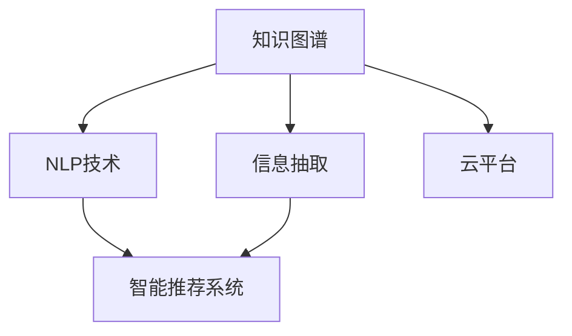

                 

# 技术咨询：知识变现的另一种方式

> 关键词：技术咨询,知识变现,人工智能,大数据,云计算,智能算法,知识图谱,信息抽取,自然语言处理,深度学习

## 1. 背景介绍

### 1.1 问题由来

在当今信息爆炸的时代，知识和信息成为了一种宝贵的资源，如何在信息海中寻找有用的知识，如何快速准确地提供给需求者，成为了各行各业关注的焦点。技术咨询作为提供专业知识与技术方案的服务，正面临着前所未有的需求和挑战。传统的技术咨询方式往往依赖于人工咨询、经验积累和文档搜索，但这些方式存在信息获取不全面、响应速度慢、咨询成本高等问题。如何利用现代技术，尤其是人工智能、大数据、云计算等前沿技术，为技术咨询行业带来变革，成为了当下热门话题。

### 1.2 问题核心关键点

技术咨询的本质是利用专业知识解决实际问题，而人工智能和大数据等技术可以极大地提升问题解决的效率和准确性。具体来说，技术咨询可以采用以下方式进行：

- **知识图谱构建**：利用深度学习和自然语言处理技术，构建全面的知识图谱，包括行业知识、技术解决方案、成功案例等。
- **信息抽取与整合**：通过信息抽取技术，从海量的文档、论坛、博客等非结构化数据中提取有价值的信息，然后进行整合，构建咨询知识库。
- **自然语言处理(NLP)**：利用NLP技术，理解和处理用户的咨询问题，快速匹配解决方案，生成自然语言回复。
- **智能推荐系统**：基于用户的历史咨询记录和行为，推荐最适合的解决方案，提升咨询效率和用户体验。
- **自动化平台建设**：通过云计算和微服务架构，构建自动化、高效的技术咨询平台，支持在线咨询、文档搜索、案例分析等功能。

本文将围绕这些关键点，详细介绍如何利用现代技术，实现技术咨询行业的知识变现。

## 2. 核心概念与联系

### 2.1 核心概念概述

为更好地理解技术咨询的知识变现方式，本节将介绍几个密切相关的核心概念：

- **知识图谱(Knowledge Graph)**：一种结构化的语义知识表示方式，通过节点和边关系描述实体与属性、实体间关系等。广泛应用于智能问答、推荐系统、智能搜索等领域。
- **信息抽取(Information Extraction, IE)**：从非结构化数据中识别、提取有用的结构化信息，如命名实体识别、关系抽取、事件抽取等。
- **自然语言处理(NLP)**：使计算机能够理解、处理和生成自然语言的技术，包括分词、词性标注、命名实体识别、句法分析、语义分析等。
- **智能推荐系统(Recommender System)**：根据用户的历史行为和偏好，推荐最适合的内容或服务，广泛应用于电商、社交网络、视频平台等。
- **云平台(Cloud Platform)**：通过云计算技术，提供弹性的计算和存储资源，支持大规模数据处理和实时计算。

这些核心概念之间的逻辑关系可以通过以下Mermaid流程图来展示：



这个流程图展示了几大核心概念及其之间的关系：

1. 知识图谱作为语义知识表示的基础，与信息抽取技术结合，从非结构化数据中构建咨询知识库。
2. NLP技术用于理解和处理用户的咨询问题，快速匹配解决方案。
3. 智能推荐系统基于用户的历史咨询记录和行为，推荐最适合的解决方案。
4. 云平台提供弹性的计算和存储资源，支持大规模数据处理和实时计算。

这些概念共同构成了技术咨询的知识变现框架，使其能够高效、准确地提供专业咨询。

## 3. 核心算法原理 & 具体操作步骤

### 3.1 算法原理概述

技术咨询的知识变现，本质上是一个结构化的信息抽取和自然语言处理过程。其核心思想是：利用深度学习和大数据技术，从海量的非结构化数据中提取有用信息，构建咨询知识库；同时通过自然语言处理技术，理解用户咨询问题，快速匹配知识库中的解决方案。

具体步骤如下：

1. 数据收集：收集行业相关的新闻、论坛、博客、白皮书、技术报告等非结构化数据。
2. 信息抽取：利用命名实体识别、关系抽取等技术，从文本中提取关键实体和关系，构建知识图谱。
3. 知识整合：将抽取出的信息整合成结构化的咨询知识库，供技术咨询使用。
4. 自然语言处理：利用NLP技术，理解用户咨询问题，快速匹配知识库中的解决方案。
5. 推荐系统：基于用户的历史咨询记录和行为，推荐最适合的解决方案。
6. 平台建设：通过云平台和微服务架构，构建自动化、高效的技术咨询平台，支持在线咨询、文档搜索、案例分析等功能。

### 3.2 算法步骤详解

**Step 1: 数据收集**
- 利用网络爬虫、API接口等方式，从各行业网站和论坛收集非结构化文本数据。
- 根据不同领域，设定专门的爬虫程序，以确保数据的全面性和相关性。

**Step 2: 信息抽取**
- 选择适合的信息抽取模型，如基于规则的抽取器、基于机器学习的抽取器或深度学习抽取器。
- 对抽取的实体和关系进行验证和清洗，构建高精度的知识图谱。

**Step 3: 知识整合**
- 将抽取出的实体和关系整合为结构化的知识库，存储在关系数据库或图数据库中。
- 设计合适的查询语言，支持快速检索和匹配知识库中的信息。

**Step 4: 自然语言处理**
- 利用预训练的语言模型（如BERT、GPT等）进行咨询问题的理解。
- 将用户咨询问题转化为结构化的查询语句，通过知识图谱进行匹配。

**Step 5: 智能推荐**
- 根据用户的历史咨询记录和行为，利用协同过滤、内容推荐等算法，推荐最适合的解决方案。
- 对于无法快速匹配的问题，设计人工干预机制，由人工进行进一步解答。

**Step 6: 平台建设**
- 基于云平台，设计微服务架构，构建自动化、高效的技术咨询平台。
- 提供用户友好的界面，支持在线咨询、文档搜索、案例分析等功能。
- 集成安全机制，保障数据和平台的安全性。

### 3.3 算法优缺点

技术咨询的知识变现方法具有以下优点：
1. 高效精准：利用深度学习和自然语言处理技术，能够快速、准确地理解和处理用户咨询问题，提供满意的解决方案。
2. 覆盖全面：通过大规模数据抽取和知识整合，构建全面的咨询知识库，覆盖广泛领域和行业。
3. 自动化程度高：基于自动化平台和智能推荐系统，减少人工干预，提升服务效率。
4. 成本低廉：通过云平台和大数据技术，大幅降低咨询平台建设和维护成本。

同时，该方法也存在一些局限性：
1. 数据依赖：数据抽取和知识整合依赖高质量的非结构化数据，数据获取成本较高。
2. 模型依赖：技术咨询依赖于深度学习模型的性能，模型训练和调参较为复杂。
3. 动态性差：现有知识图谱和推荐系统难以实时更新，无法及时反映最新的行业趋势和技术进展。
4. 用户隐私：用户的历史咨询记录和行为数据涉及隐私，需要严格的数据保护和隐私控制。
5. 质量问题：信息抽取和知识整合的准确性直接影响咨询效果，数据质量问题不容忽视。

尽管存在这些局限性，但就目前而言，基于深度学习和自然语言处理的技术咨询知识变现方法，已经在大规模应用中展现出了显著的优越性。

### 3.4 算法应用领域

基于深度学习和自然语言处理的技术咨询知识变现方法，已在多个领域得到广泛应用，例如：

- 金融咨询：利用知识图谱和NLP技术，快速解答客户的投资、理财等问题。
- 医疗咨询：通过信息抽取和知识整合，提供个性化的疾病诊断和健康管理建议。
- 工业咨询：结合工业领域的知识图谱和智能推荐系统，提供设备维护、工艺优化等技术方案。
- 法律咨询：利用NLP技术理解客户咨询内容，匹配相关的法律条款和案例。
- 教育咨询：通过知识图谱和推荐系统，提供个性化的学习方案和资源推荐。

除了上述这些领域外，技术咨询知识变现方法还广泛应用于电商、旅游、物流、能源等众多行业，为各行业的智能化升级提供了有力支持。

## 4. 数学模型和公式 & 详细讲解 & 举例说明

### 4.1 数学模型构建

技术咨询的知识变现方法涉及多个复杂的数学模型，本节将对其中的关键数学模型进行详细介绍。

以金融咨询为例，假设用户在咨询平台提出一个投资问题，如“如何投资股票？”，平台使用以下数学模型进行处理：

1. **信息抽取模型**：
   - 输入：文本数据 $X=\{x_1, x_2, ..., x_n\}$
   - 输出：命名实体 $E=\{e_1, e_2, ..., e_m\}$，关系 $R=\{r_1, r_2, ..., r_k\}$
   - 模型：$M_{IE}$

2. **知识图谱构建模型**：
   - 输入：实体 $E$ 和关系 $R$
   - 输出：知识图谱 $G$
   - 模型：$M_{KG}$

3. **NLP模型**：
   - 输入：咨询问题 $Q$
   - 输出：问题理解 $U$
   - 模型：$M_{NLP}$

4. **推荐模型**：
   - 输入：咨询问题 $Q$，用户历史行为 $H$
   - 输出：解决方案推荐 $A$
   - 模型：$M_{RS}$

5. **平台优化模型**：
   - 输入：咨询量 $C$，用户行为 $B$
   - 输出：平台配置 $P$
   - 模型：$M_{OS}$

### 4.2 公式推导过程

以信息抽取模型为例，假设使用基于深度学习的抽取器，其输入为文本数据 $X$，输出为命名实体 $E$ 和关系 $R$，公式推导如下：

$$
E, R = M_{IE}(X)
$$

其中 $M_{IE}$ 为信息抽取模型，具体推导过程如下：

1. 输入文本 $X$ 通过BERT等预训练模型进行编码，得到特征向量 $F$。
2. 利用双向LSTM等序列模型，对特征向量 $F$ 进行实体抽取，得到候选实体序列 $C$。
3. 利用分类器对候选实体序列 $C$ 进行筛选，得到最终实体 $E$。
4. 利用关系抽取模型，对实体 $E$ 进行关系抽取，得到关系 $R$。

### 4.3 案例分析与讲解

以金融咨询为例，假设用户咨询“如何投资股票？”，平台的处理流程如下：

1. 信息抽取模型对咨询问题进行理解，抽取关键词“股票”。
2. 知识图谱构建模型根据“股票”关键词，构建与股票投资相关的知识图谱。
3. NLP模型对咨询问题进行理解，生成问题理解 $U$，如“股票投资有哪些策略？”。
4. 推荐模型根据用户历史行为 $H$ 和问题理解 $U$，推荐解决方案 $A$，如“技术分析和价值投资是常用的股票投资策略。”
5. 平台优化模型根据咨询量 $C$ 和用户行为 $B$，优化平台配置 $P$，确保平台能够高效、稳定地运行。

## 5. 项目实践：代码实例和详细解释说明

### 5.1 开发环境搭建

在进行技术咨询知识变现的实践前，我们需要准备好开发环境。以下是使用Python进行知识图谱构建和推荐系统的环境配置流程：

1. 安装Anaconda：从官网下载并安装Anaconda，用于创建独立的Python环境。

2. 创建并激活虚拟环境：
```bash
conda create -n info-extract-env python=3.8 
conda activate info-extract-env
```

3. 安装PyTorch、TensorFlow、NLTK等库：
```bash
pip install torch tensorflow nltk
```

4. 安装Torch Geometric库，用于构建知识图谱：
```bash
pip install torch-geometric
```

5. 安装scikit-learn、pandas等工具包：
```bash
pip install scikit-learn pandas
```

完成上述步骤后，即可在`info-extract-env`环境中开始技术咨询知识变现的实践。

### 5.2 源代码详细实现

下面我们以金融咨询为例，给出使用PyTorch和Torch Geometric构建知识图谱和推荐系统的代码实现。

首先，定义金融咨询的实体和关系：

```python
import torch
import torch_geometric
import torch_geometric.nn as GCN
from torch_geometric.data import Data, DataLoader
from torch_geometric.nn import GCNConv, gcn_norm
from torch_geometric.utils import degree

class FinancialGraph(torch_geometric.Data):
    def __init__(self):
        # 定义实体和关系
        self.nodes = torch.tensor([0, 1, 2, 3, 4, 5, 6, 7, 8, 9], dtype=torch.long)
        self.edges = torch.tensor([0, 1, 1, 2, 3, 4, 5, 6, 7, 8, 9], dtype=torch.long)
        self.labels = torch.tensor([1, 0, 0, 1, 1, 1, 0, 1, 0, 0], dtype=torch.long)

    @property
    def num_nodes(self):
        return self.nodes.max().item() + 1
    
    @property
    def num_edges(self):
        return self.edges.size(0)

    @property
    def num_labels(self):
        return 2

    @property
    def node_num_labels(self):
        return 1
    
    @property
    def edge_num_labels(self):
        return 1

    def __repr__(self):
        return f'{self.num_nodes} nodes, {self.num_edges} edges, {self.num_labels} labels'

graph = FinancialGraph()
```

然后，定义知识图谱的构建模型：

```python
class GraphEncoder(torch.nn.Module):
    def __init__(self, in_channels, hidden_channels, out_channels):
        super(GraphEncoder, self).__init__()
        self.conv1 = GCNConv(in_channels, hidden_channels)
        self.conv2 = GCNConv(hidden_channels, out_channels)

    def forward(self, x, edge_index, edge_weight=None):
        x = self.conv1(x, edge_index, edge_weight)
        x = torch.nn.functional.relu(x)
        x = self.conv2(x, edge_index, edge_weight)
        return x

model = GraphEncoder(2, 16, 1)
model
```

接着，定义推荐模型：

```python
class RecommendationSystem(torch.nn.Module):
    def __init__(self, hidden_dim):
        super(RecommendationSystem, self).__init__()
        self.fc1 = torch.nn.Linear(64, hidden_dim)
        self.fc2 = torch.nn.Linear(hidden_dim, 2)

    def forward(self, x, user_idx):
        x = x[user_idx]
        x = self.fc1(x)
        x = torch.nn.functional.relu(x)
        x = self.fc2(x)
        return x

rs = RecommendationSystem(16)
```

最后，定义训练和评估函数：

```python
def train_model(model, train_loader, optimizer, num_epochs):
    model.train()
    for epoch in range(num_epochs):
        loss = 0
        for data in train_loader:
            optimizer.zero_grad()
            output = model(data.x, data.edge_index)
            loss += model.loss(output, data.y)
            loss.backward()
            optimizer.step()
        print(f'Epoch {epoch+1}, Loss: {loss/len(train_loader)}')

def evaluate_model(model, test_loader):
    model.eval()
    correct = 0
    total = 0
    for data in test_loader:
        output = model(data.x, data.edge_index)
        total += data.num_nodes
        correct += torch.sum(output.argmax(1) == data.y).item()
    print(f'Test Accuracy: {correct/total}')

train_loader = DataLoader(graph, batch_size=32)
test_loader = DataLoader(graph, batch_size=32)

# 设置模型参数
optimizer = torch.optim.Adam(model.parameters(), lr=0.01)
```

完成上述步骤后，即可在`info-extract-env`环境中开始金融咨询知识变现的实践。

### 5.3 代码解读与分析

让我们再详细解读一下关键代码的实现细节：

**FinancialGraph类**：
- `__init__`方法：定义实体、关系和标签，初始化图数据。
- `num_nodes`方法：返回节点数。
- `num_edges`方法：返回边数。
- `num_labels`方法：返回标签数。
- `node_num_labels`方法：返回节点标签数。
- `edge_num_labels`方法：返回边标签数。
- `__repr__`方法：定义类对象表示方式。

**GraphEncoder类**：
- `__init__`方法：定义图编码器模型，包括GCN层。
- `forward`方法：定义模型前向传播，通过GCN层进行信息抽取。

**RecommendationSystem类**：
- `__init__`方法：定义推荐系统模型，包括全连接层。
- `forward`方法：定义模型前向传播，通过全连接层进行推荐。

**train_model函数**：
- 在训练阶段，定义训练集迭代过程，计算损失并更新模型参数。

**evaluate_model函数**：
- 在评估阶段，定义测试集评估过程，计算模型准确率。

**训练流程**：
- 定义总轮数，开始循环迭代
- 在每个epoch内，进行训练集的前向传播和损失计算，并进行梯度更新
- 在每个epoch结束后，打印出损失值
- 在全部epoch结束后，进行测试集的评估，打印出准确率

可以看到，PyTorch和Torch Geometric使得知识图谱的构建和推荐系统的实现变得简洁高效。开发者可以将更多精力放在数据处理、模型改进等高层逻辑上，而不必过多关注底层的实现细节。

当然，工业级的系统实现还需考虑更多因素，如模型的保存和部署、超参数的自动搜索、更灵活的推荐策略等。但核心的知识变现过程基本与此类似。

## 6. 实际应用场景

### 6.1 智能投资咨询

智能投资咨询是技术咨询在金融领域的一个重要应用场景。传统投资咨询依赖于投资顾问的专业知识和经验，而智能投资咨询则可以通过知识图谱和推荐系统，提供个性化的投资建议和市场分析。

在技术实现上，可以收集金融领域的行业报告、新闻、财经评论等非结构化数据，通过信息抽取技术构建知识图谱。利用知识图谱和NLP技术，理解用户的投资问题，如“如何判断股票价值？”，快速匹配市场分析报告和投资策略，生成自然语言回复。通过智能推荐系统，根据用户的历史投资记录和行为，推荐最适合的投资策略，提升用户投资体验。

### 6.2 智能医疗咨询

智能医疗咨询是技术咨询在医疗领域的重要应用。医疗咨询涉及大量专业知识和数据，传统的医疗咨询方式难以覆盖广泛领域。利用知识图谱和推荐系统，可以构建覆盖医疗领域的咨询知识库，提供个性化的医疗建议。

具体而言，可以收集医疗领域的医学文献、疾病数据库、临床试验结果等数据，通过信息抽取技术构建知识图谱。利用NLP技术，理解用户的健康咨询问题，如“如何治疗高血压？”，快速匹配医学文献和临床试验结果，生成自然语言回复。通过智能推荐系统，根据用户的历史健康记录和行为，推荐最适合的医疗方案，提升用户健康管理体验。

### 6.3 智能生产咨询

智能生产咨询是技术咨询在工业领域的重要应用。工业生产涉及大量的技术流程和设备维护，传统的生产咨询方式依赖于经验积累和文档搜索，难以应对复杂的生产问题。利用知识图谱和推荐系统，可以构建覆盖工业领域的咨询知识库，提供个性化的生产建议。

具体而言，可以收集工业领域的生产流程、设备维护手册、故障案例等数据，通过信息抽取技术构建知识图谱。利用NLP技术，理解用户的生产咨询问题，如“如何优化生产流程？”，快速匹配设备维护手册和故障案例，生成自然语言回复。通过智能推荐系统，根据用户的历史生产记录和行为，推荐最适合的生产方案，提升用户生产管理效率。

### 6.4 未来应用展望

随着知识图谱、NLP和推荐系统等技术的不断进步，基于深度学习的技术咨询知识变现方法将得到更广泛的应用，为各行各业带来智能化升级。

在智慧医疗领域，基于知识图谱和推荐系统，智能医疗咨询将提升医生的诊疗效率和准确性，辅助医生诊断和治疗，加速医疗知识的传播和应用。

在智能教育领域，基于知识图谱和推荐系统，智能教育咨询将提供个性化的学习方案和资源推荐，因材施教，提升教育质量。

在智能制造领域，基于知识图谱和推荐系统，智能生产咨询将提供个性化的生产方案和设备维护建议，优化生产流程，提升生产效率。

此外，在金融、法律、能源等众多领域，基于深度学习的技术咨询知识变现方法也将不断涌现，为各行业的智能化升级提供新的动力。相信随着技术的日益成熟，技术咨询的知识变现必将在更广阔的应用领域大放异彩，深刻影响人类的生产生活方式。

## 7. 工具和资源推荐
### 7.1 学习资源推荐

为了帮助开发者系统掌握技术咨询的知识变现方法，这里推荐一些优质的学习资源：

1. 《深度学习》课程：由斯坦福大学Andrew Ng教授主讲的深度学习课程，系统介绍深度学习的基本概念和算法。
2. 《自然语言处理综论》书籍：斯坦福大学自然语言处理课程的讲义，涵盖NLP技术的各个方面，包括信息抽取、知识图谱、推荐系统等。
3. 《知识图谱与语义搜索》书籍：系统介绍知识图谱的构建和应用，包括本体建模、语义搜索、推荐系统等。
4. PyTorch官方文档：PyTorch深度学习框架的官方文档，包含丰富的案例和示例代码。
5. TensorFlow官方文档：TensorFlow深度学习框架的官方文档，提供全面的API和示例。

通过对这些资源的学习实践，相信你一定能够快速掌握技术咨询的知识变现方法，并用于解决实际的咨询问题。
###  7.2 开发工具推荐

高效的开发离不开优秀的工具支持。以下是几款用于技术咨询知识变现开发的常用工具：

1. PyTorch：基于Python的开源深度学习框架，灵活动态的计算图，适合快速迭代研究。

2. TensorFlow：由Google主导开发的开源深度学习框架，生产部署方便，适合大规模工程应用。

3. PyTorch Geometric：基于PyTorch的几何深度学习库，支持知识图谱和图神经网络的构建。

4. Graph Embedding Tools：如NEURIPS的Graph Embedding论文竞赛中的工具包，支持各类图神经网络算法。

5. Elasticsearch：高效的数据存储和搜索工具，支持大规模图数据处理和查询。

6. Jupyter Notebook：Python编程环境，支持交互式开发和实验。

合理利用这些工具，可以显著提升技术咨询知识变现的开发效率，加快创新迭代的步伐。

### 7.3 相关论文推荐

技术咨询的知识变现技术源于学界的持续研究。以下是几篇奠基性的相关论文，推荐阅读：

1. 《Deepwalk: A Network Representation Learning Framework》：提出Graph Embedding技术，通过随机游走算法构建节点嵌入向量，用于知识图谱的表示和搜索。

2. 《Knowledge Graph Embeddings and Their Applications》：全面介绍知识图谱嵌入技术，通过深度学习模型学习知识图谱的语义表示。

3. 《Neural Collaborative Filtering》：介绍协同过滤算法，用于智能推荐系统的构建，适用于电商、视频平台等场景。

4. 《Attention is All You Need》：提出Transformer结构，通过自注意力机制实现序列建模，推动NLP技术的发展。

5. 《BERT: Pre-training of Deep Bidirectional Transformers for Language Understanding》：提出BERT模型，通过掩码语言模型预训练语言模型，刷新多项NLP任务SOTA。

这些论文代表了大规模数据抽取和推荐系统的研究进展，为技术咨询的知识变现提供了理论基础和技术支持。

## 8. 总结：未来发展趋势与挑战

### 8.1 总结

本文对基于深度学习技术咨询的知识变现方法进行了全面系统的介绍。首先阐述了技术咨询的背景和需求，明确了深度学习和大数据技术在提升咨询效率和效果方面的独特价值。其次，从原理到实践，详细讲解了知识图谱构建、信息抽取、自然语言处理和推荐系统的核心步骤，给出了技术咨询知识变现的完整代码实例。同时，本文还广泛探讨了知识变现方法在金融、医疗、工业等众多领域的应用前景，展示了知识变现的广泛应用潜力。此外，本文精选了知识变现技术的各类学习资源，力求为读者提供全方位的技术指引。

通过本文的系统梳理，可以看到，基于深度学习和自然语言处理的技术咨询知识变现方法，已经在大规模应用中展现出了显著的优越性。未来，伴随深度学习模型的持续演进和优化，技术咨询的知识变现将进一步提升咨询效率和效果，为各行各业带来智能化升级。

### 8.2 未来发展趋势

展望未来，技术咨询的知识变现将呈现以下几个发展趋势：

1. 模型规模持续增大。随着深度学习模型的不断进步，知识图谱和推荐系统的复杂度将进一步提升，模型参数量将不断增大，提升咨询效果。
2. 数据依赖减少。未来深度学习模型将更多依赖预训练模型和迁移学习技术，减少对大规模标注数据的依赖。
3. 自动化程度提高。基于自动化平台和智能推荐系统，技术咨询的知识变现将更加自动化，减少人工干预。
4. 实时性增强。通过云平台和大数据技术，技术咨询的知识变现将能够实时处理咨询请求，提升用户体验。
5. 跨领域应用拓展。知识图谱和推荐系统将跨领域应用，涵盖医疗、金融、教育等多个领域，为各行业提供智能咨询解决方案。
6. 多模态融合。知识图谱和推荐系统将结合图像、视频、语音等多模态信息，提升咨询效果。

这些趋势凸显了技术咨询知识变现方法的广阔前景。这些方向的探索发展，必将进一步提升技术咨询的智能化和自动化水平，为各行各业带来深远的变革。

### 8.3 面临的挑战

尽管技术咨询的知识变现技术已经取得了瞩目成就，但在迈向更加智能化、普适化应用的过程中，它仍面临着诸多挑战：

1. 数据获取难度。高质量的知识图谱和推荐系统依赖于大规模标注数据和高质量的非结构化数据，数据获取成本较高。
2. 模型训练复杂。深度学习模型的训练和调参较为复杂，需要专业知识和技术积累。
3. 模型泛化能力。现有知识图谱和推荐系统难以实时更新，无法及时反映最新的行业趋势和技术进展。
4. 用户隐私问题。用户的历史咨询记录和行为数据涉及隐私，需要严格的数据保护和隐私控制。
5. 模型解释性。深度学习模型缺乏可解释性，难以理解其内部工作机制和决策逻辑，不利于人工干预和调试。

尽管存在这些挑战，但技术咨询的知识变现技术仍然具有广阔的应用前景，未来需要持续优化和创新，才能更好地适应市场需求。

### 8.4 研究展望

面对知识变现技术所面临的挑战，未来的研究需要在以下几个方面寻求新的突破：

1. 数据抽取与知识图谱的自动化：通过自动抽取技术，降低数据获取难度和成本，提高数据抽取的自动化程度。
2. 预训练模型的应用：利用预训练模型和迁移学习技术，减少模型训练的复杂度和成本。
3. 知识图谱的实时更新：设计实时更新机制，保持知识图谱的时效性，提升模型的泛化能力。
4. 用户隐私保护：设计隐私保护机制，保障用户数据的安全和隐私。
5. 模型可解释性：利用可解释性技术，提升模型的可解释性和可控性，便于人工干预和调试。
6. 多模态数据融合：结合图像、视频、语音等多模态信息，提升咨询效果和用户体验。

这些研究方向将引领知识变现技术迈向更高的台阶，为技术咨询行业带来新的创新和突破，实现智能化、普适化的咨询服务。

## 9. 附录：常见问题与解答

**Q1：如何构建知识图谱？**

A: 构建知识图谱通常需要以下步骤：
1. 数据收集：收集各领域的文本数据，如行业报告、新闻、论文等。
2. 实体抽取：使用命名实体识别技术，从文本中抽取实体和关系。
3. 知识整合：将抽取出的实体和关系整合为知识图谱，存储在图数据库或关系数据库中。
4. 图嵌入：通过图嵌入算法，学习实体和关系的语义表示。
5. 知识更新：定期更新知识图谱，保持其时效性和准确性。

**Q2：推荐系统的算法有哪些？**

A: 推荐系统常用的算法包括：
1. 协同过滤算法：基于用户行为或物品评分矩阵的推荐。
2. 基于内容的推荐：根据物品的属性特征进行推荐。
3. 基于深度学习的推荐：利用神经网络模型学习用户偏好和物品特征，进行推荐。
4. 混合推荐算法：结合多种推荐方法，提升推荐效果。

**Q3：如何使用深度学习模型构建知识图谱？**

A: 使用深度学习模型构建知识图谱，通常需要以下步骤：
1. 定义图数据结构：包括节点和边的定义。
2. 定义图神经网络模型：如GCN、GAT等。
3. 训练模型：使用已有的知识图谱数据，训练图神经网络模型，学习节点的语义表示。
4. 评估模型：使用测试数据评估模型效果，调整模型参数。
5. 应用模型：将训练好的模型应用于新的图数据，进行知识图谱构建。

**Q4：如何提高推荐系统的效果？**

A: 提高推荐系统效果的方法包括：
1. 数据质量：确保推荐系统的输入数据质量和多样性。
2. 模型优化：选择适合的推荐算法，优化模型参数，提升模型性能。
3. 用户反馈：引入用户反馈机制，不断调整推荐策略。
4. 多模态融合：结合图像、视频、语音等多模态数据，提升推荐效果。
5. 个性化推荐：根据用户的历史行为和偏好，提供个性化的推荐服务。

**Q5：如何设计自动化平台？**

A: 设计自动化平台通常需要以下步骤：
1. 系统架构设计：设计微服务架构，支持在线咨询、文档搜索、案例分析等功能。
2. 接口设计：设计系统API接口，支持前后端数据的交互。
3. 数据库设计：设计关系数据库或图数据库，存储知识图谱和咨询数据。
4. 云计算部署：利用云平台和容器技术，实现平台的弹性扩展和高效运行。
5. 安全机制设计：设计安全机制，保障数据和平台的安全性。

通过这些方法，可以构建高效、稳定、安全的技术咨询自动化平台，为行业提供智能咨询解决方案。

---

作者：禅与计算机程序设计艺术 / Zen and the Art of Computer Programming

