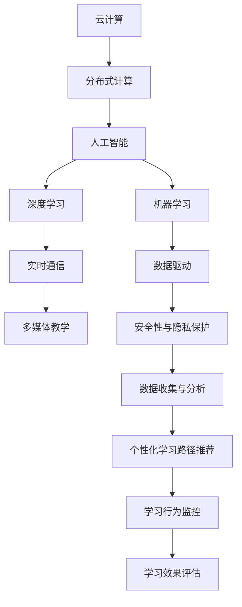

                 

# 技术培训：从线下工作坊到在线教育帝国

> 关键词：技术培训, 在线教育, 线下工作坊, 云计算, 人工智能, 深度学习, 机器学习

## 1. 背景介绍

### 1.1 问题由来
随着全球科技的迅猛发展，技术培训与教育逐渐成为了个人和企业竞争力的重要组成部分。传统的线下培训模式面临诸多挑战，如场地、时间、成本等限制，无法满足日益增长的培训需求。与此同时，在线教育凭借其灵活性、可及性和成本效益等优势，迅速崛起，成为全球教育技术市场的重要组成部分。

近年来，随着云计算、人工智能（AI）、深度学习（DL）和机器学习（ML）等技术的发展，在线教育平台的技术架构和教学方式不断升级，呈现出全新的面貌。例如，通过云计算资源支持的大规模并行计算和分布式存储，在线教育平台能够实现实时互动、个性化学习、多媒体教学等新功能，极大地提升了教育体验和学习效率。

在线教育不仅在高等教育和职业教育中得到了广泛应用，还逐渐渗透到K-12教育、企业培训和技能提升等诸多领域，为各行各业带来了巨大的变革。然而，尽管在线教育取得了显著成就，但其发展仍面临着诸多挑战，如在线课程内容的质量控制、学生的互动参与度、技术基础设施的稳定性等。

为了进一步提升在线教育的质量和效果，本文将探讨在线教育技术培训的发展历程、核心概念与架构，并分析其关键算法原理与操作步骤，提出未来发展的趋势与挑战。

### 1.2 问题核心关键点
在线教育技术培训的核心在于如何构建一个高效、稳定、灵活的在线教育平台，以支持大规模、个性化、实时的教学和培训活动。具体来说，关键点包括以下几个方面：

1. **云计算与分布式计算**：利用云计算平台提供的弹性计算资源，实现大规模并行计算和分布式存储，支持大量在线用户的同时访问。
2. **人工智能与深度学习**：通过AI和DL技术，实现智能化内容推荐、智能答疑、学习路径优化等高级功能，提升教学效果。
3. **实时互动与多媒体教学**：采用WebSocket、WebRTC等技术，实现实时音视频互动，支持多种多媒体资源教学，提高教学体验。
4. **个性化学习与数据驱动**：通过分析学生的学习行为数据，实现个性化学习路径推荐，最大化学生的学习效果。
5. **安全性与隐私保护**：采用先进的加密和认证技术，确保在线教育平台的数据安全和用户隐私。

理解这些关键点，有助于把握在线教育技术培训的核心技术和应用场景，为构建高效、灵活的在线教育平台奠定基础。

## 2. 核心概念与联系

### 2.1 核心概念概述

为了更好地理解在线教育技术培训的架构和技术细节，本节将介绍几个密切相关的核心概念：

1. **云计算（Cloud Computing）**：利用互联网技术提供共享的计算资源和数据存储，按需提供可伸缩的计算能力，支持大规模在线教育平台的应用。
2. **分布式计算（Distributed Computing）**：将计算任务分配到多台计算机上并行处理，提高计算效率和系统容错性。
3. **人工智能（Artificial Intelligence）**：通过模拟人类智能行为，实现智能决策、自动推理和知识发现等高级功能。
4. **深度学习（Deep Learning）**：一种基于神经网络的机器学习方法，通过多层非线性变换，实现对复杂数据的有效建模和预测。
5. **机器学习（Machine Learning）**：通过数据驱动的算法，实现模型的自动学习与优化，支持智能推荐、情感分析等应用。
6. **实时通信（Real-time Communication）**：利用WebSocket、WebRTC等技术，实现低延迟的音视频和文本实时互动。
7. **多媒体教学（Multimedia Teaching）**：结合文本、音频、视频、动画等多种媒体资源，丰富教学内容，提高教学效果。
8. **数据驱动（Data-Driven）**：通过数据挖掘和分析，实现个性化学习路径推荐、学习行为监控等高级功能。
9. **安全性与隐私保护（Security & Privacy）**：采用加密、认证、访问控制等技术，确保在线教育平台的数据安全和用户隐私。

这些核心概念之间存在紧密的联系，共同构成了在线教育技术培训的基础架构和技术栈。理解这些概念的原理和应用场景，有助于构建一个高效、稳定、灵活的在线教育平台。

### 2.2 核心概念原理和架构的 Mermaid 流程图



这个流程图展示了在线教育技术培训中各个核心概念之间的关系。云计算提供计算资源和数据存储，分布式计算实现大规模并行处理，人工智能和深度学习支持智能教学和内容推荐，机器学习实现数据分析和优化，实时通信和多媒体教学提升教学体验，数据驱动实现个性化学习路径和行为监控，安全性与隐私保护确保数据安全。通过这些技术栈的组合，可以构建一个高效、灵活的在线教育平台。

## 3. 核心算法原理 & 具体操作步骤

### 3.1 算法原理概述

在线教育技术培训的核心算法原理主要包括以下几个方面：

1. **云计算平台架构设计**：通过分布式计算技术，利用云计算平台提供的弹性资源，实现大规模并行计算和分布式存储。
2. **人工智能与深度学习算法**：利用AI和DL算法，实现内容推荐、智能答疑、学习路径优化等高级功能。
3. **实时通信与多媒体教学算法**：采用WebSocket、WebRTC等技术，实现实时音视频互动和多媒体资源教学。
4. **个性化学习与数据驱动算法**：通过分析学生学习行为数据，实现个性化学习路径推荐和行为监控。
5. **安全性与隐私保护算法**：采用先进的加密和认证技术，确保在线教育平台的数据安全和用户隐私。

这些算法原理共同构成了在线教育技术培训的核心技术栈，使得在线教育平台能够实现高效、稳定、灵活的在线培训和教学活动。

### 3.2 算法步骤详解

在线教育技术培训的算法步骤主要包括以下几个关键环节：

1. **云计算平台搭建**：选择合适的云计算服务提供商，搭建分布式计算环境，配置弹性计算资源，支持大规模并行计算和分布式存储。
2. **人工智能与深度学习模型训练**：选择合适的深度学习框架，如TensorFlow、PyTorch等，训练个性化推荐、智能答疑、学习路径优化等模型。
3. **实时通信与多媒体教学实现**：采用WebSocket、WebRTC等技术，实现实时音视频互动和多媒体资源教学。
4. **个性化学习路径推荐**：通过分析学生学习行为数据，如观看时长、答题情况、学习进度等，推荐个性化的学习路径和资源。
5. **学习行为监控与效果评估**：利用机器学习算法，监控学生学习行为，评估学习效果，提供实时反馈和改进建议。
6. **数据安全和隐私保护**：采用数据加密、访问控制、审计记录等技术，确保平台数据安全和用户隐私。

### 3.3 算法优缺点

在线教育技术培训的算法具有以下优点：

1. **灵活性**：通过云计算平台，可以灵活配置计算资源和存储资源，支持大规模在线教育平台的应用。
2. **可扩展性**：利用分布式计算技术，可以实现系统的弹性扩展，支持大规模用户同时访问。
3. **高效性**：利用AI和DL算法，可以高效处理大量学习数据，实现个性化推荐和智能答疑。
4. **互动性**：采用实时通信和多媒体教学技术，可以提升教学互动性和教学效果。
5. **安全性**：采用先进的加密和认证技术，可以确保平台数据安全和用户隐私。

同时，在线教育技术培训的算法也存在一些缺点：

1. **计算资源需求高**：大规模并行计算和分布式存储需要高配置的计算资源，对硬件设备要求较高。
2. **数据隐私问题**：大量学生学习数据的收集和分析涉及用户隐私问题，需要严格的数据保护措施。
3. **算法复杂性高**：AI和DL算法的训练和优化需要复杂的计算过程，对算法工程师要求较高。
4. **实时互动延迟**：实时音视频互动可能会受到网络延迟和带宽限制，影响教学体验。

### 3.4 算法应用领域

在线教育技术培训的算法应用领域非常广泛，涵盖以下几个主要方向：

1. **高等教育**：提供在线课程、虚拟课堂、在线实验等高等教育资源，支持远程学习。
2. **职业教育**：提供专业技能培训、在线认证课程，支持职业发展和技能提升。
3. **K-12教育**：提供在线学习平台、智能答疑系统、个性化学习路径推荐等，提升教学效果。
4. **企业培训**：提供在线培训课程、技能评估系统、学习行为监控等，支持员工职业发展。
5. **技能提升**：提供在线技能培训、模拟实训、学习路径推荐等，支持终身学习。

## 4. 数学模型和公式 & 详细讲解 & 举例说明

### 4.1 数学模型构建

在线教育技术培训的数学模型主要包括以下几个方面：

1. **云计算平台架构设计**：采用分布式计算模型，将计算任务分配到多台计算机上并行处理。
2. **人工智能与深度学习模型训练**：采用神经网络模型，如卷积神经网络（CNN）、循环神经网络（RNN）、变换器（Transformer）等，训练推荐系统、智能答疑系统、学习路径优化等模型。
3. **实时通信与多媒体教学**：采用实时通信模型，如WebSocket、WebRTC等，实现实时音视频互动和多媒体资源教学。
4. **个性化学习路径推荐**：采用协同过滤、内容推荐算法，如基于矩阵分解的推荐算法、基于图的推荐算法等，实现个性化学习路径推荐。
5. **学习行为监控与效果评估**：采用行为分析模型，如时间序列分析、聚类分析等，监控学生学习行为，评估学习效果。
6. **安全性与隐私保护**：采用加密模型，如对称加密、非对称加密、哈希函数等，确保数据安全和用户隐私。

### 4.2 公式推导过程

以推荐系统为例，其数学模型推导过程如下：

假设用户集合为 $U$，物品集合为 $I$，用户与物品间的交互矩阵为 $R$。利用矩阵分解算法，将 $R$ 分解为两个低秩矩阵 $P$ 和 $Q$，其中 $P \in \mathbb{R}^{m \times n}$，$Q \in \mathbb{R}^{n \times d}$，$d$ 为矩阵的维度。推荐算法可以表示为：

$$
\hat{R} = P \times Q^T
$$

其中，$\hat{R} \in \mathbb{R}^{m \times n}$ 为预测的评分矩阵，$m$ 为用户数，$n$ 为物品数。

通过最大化预测评分与实际评分之间的均方误差（MSE），优化模型参数，得到最优的 $P$ 和 $Q$。优化的目标函数为：

$$
\min_{P,Q} \sum_{(i,j) \in R} (R_{ij} - \hat{R}_{ij})^2
$$

其中，$R_{ij}$ 为实际评分，$\hat{R}_{ij}$ 为预测评分。

### 4.3 案例分析与讲解

以下以一个在线教育平台为例，分析其技术架构和算法实现：

1. **云计算平台搭建**：选择AWS、阿里云等云计算服务提供商，搭建分布式计算环境，配置弹性计算资源，支持大规模并行计算和分布式存储。
2. **人工智能与深度学习模型训练**：使用TensorFlow框架，训练个性化推荐系统、智能答疑系统、学习路径优化模型。
3. **实时通信与多媒体教学实现**：采用WebSocket、WebRTC等技术，实现实时音视频互动和多媒体资源教学。
4. **个性化学习路径推荐**：通过分析学生学习行为数据，如观看时长、答题情况、学习进度等，推荐个性化的学习路径和资源。
5. **学习行为监控与效果评估**：利用机器学习算法，监控学生学习行为，评估学习效果，提供实时反馈和改进建议。
6. **数据安全和隐私保护**：采用数据加密、访问控制、审计记录等技术，确保平台数据安全和用户隐私。

## 5. 项目实践：代码实例和详细解释说明

### 5.1 开发环境搭建

在进行在线教育技术培训的开发实践前，我们需要准备好开发环境。以下是使用Python进行Django开发的环境配置流程：

1. 安装Anaconda：从官网下载并安装Anaconda，用于创建独立的Python环境。

2. 创建并激活虚拟环境：
```bash
conda create -n django-env python=3.8 
conda activate django-env
```

3. 安装Django：从官网获取对应的安装命令，如：
```bash
pip install django
```

4. 安装Django的第三方应用：
```bash
pip install django-cors-headers
pip install django-axes
```

5. 安装第三方库：
```bash
pip install Pillow
pip install gunicorn
```

完成上述步骤后，即可在`django-env`环境中开始开发实践。

### 5.2 源代码详细实现

下面我们以在线课程推荐系统为例，给出使用Django框架和TensorFlow进行在线教育技术培训开发的PyTorch代码实现。

首先，定义推荐系统模型：

```python
import tensorflow as tf
from tensorflow.keras.layers import Input, Dense, Embedding, dot, Concatenate, Add, Reshape
from tensorflow.keras.models import Model

# 定义模型输入
user_input = Input(shape=(1,), name='user')
item_input = Input(shape=(1,), name='item')
# 定义用户向量
user_embedding = Embedding(input_dim=num_users, output_dim=embedding_size, name='user_embedding')
user_vector = user_embedding(user_input)
# 定义物品向量
item_embedding = Embedding(input_dim=num_items, output_dim=embedding_size, name='item_embedding')
item_vector = item_embedding(item_input)
# 计算用户-物品交互
dot_product = dot([user_vector, item_vector], axes=(1, 1))
# 合并用户和物品向量
concat = Concatenate()([user_vector, item_vector])
# 加权求和
summed = Add()([concat, dot_product])
# 输出评分预测
output = Dense(1, activation='sigmoid')(summed)
# 定义推荐模型
model = Model(inputs=[user_input, item_input], outputs=output)
```

然后，定义训练和评估函数：

```python
from tensorflow.keras import optimizers
from sklearn.metrics import roc_auc_score

# 编译模型
model.compile(optimizer=optimizers.Adam(), loss='binary_crossentropy', metrics=['AUC'])
# 训练模型
model.fit(x_train, y_train, batch_size=batch_size, epochs=num_epochs, validation_data=(x_val, y_val))
# 评估模型
y_pred = model.predict(x_test)
auc = roc_auc_score(y_test, y_pred)
print(f'Test AUC: {auc:.4f}')
```

最后，启动训练流程并在测试集上评估：

```python
batch_size = 64
num_epochs = 10

# 加载数据集
x_train, y_train = load_train_data()
x_val, y_val = load_val_data()
x_test, y_test = load_test_data()

# 定义超参数
embedding_size = 16
num_users = len(set(user_train))
num_items = len(set(item_train))

# 定义模型
model = define_model(num_users, num_items, embedding_size)

# 训练模型
train_model(model, x_train, y_train, x_val, y_val, batch_size, num_epochs)

# 评估模型
test_model(model, x_test, y_test)
```

以上就是使用Django框架和TensorFlow进行在线课程推荐系统开发的完整代码实现。可以看到，得益于Django和TensorFlow的强大封装，我们可以用相对简洁的代码实现推荐系统的各个功能模块。

### 5.3 代码解读与分析

让我们再详细解读一下关键代码的实现细节：

**定义模型**：
- `Input`：定义模型输入，分别对应用户和物品输入。
- `Embedding`：将用户和物品的id映射到向量空间，用于计算用户和物品之间的相似度。
- `dot`：计算用户-物品交互矩阵的评分预测，即用户和物品向量的点积。
- `Concatenate`和`Add`：合并用户和物品向量，加权求和。
- `Dense`：输出评分预测，使用sigmoid激活函数。

**训练和评估函数**：
- `compile`：编译模型，指定优化器、损失函数和评估指标。
- `fit`：训练模型，指定训练数据、批量大小、迭代轮数和验证集。
- `predict`：在测试集上评估模型，计算AUC指标。

**训练流程**：
- 定义模型参数，如向量维度、用户和物品数量。
- 加载训练集、验证集和测试集数据。
- 定义模型，并编译模型。
- 训练模型，并在验证集上评估性能。
- 在测试集上评估模型性能，输出AUC指标。

可以看到，Django和TensorFlow使得在线教育技术培训的代码实现变得简洁高效。开发者可以将更多精力放在数据处理、模型改进等高层逻辑上，而不必过多关注底层的实现细节。

当然，工业级的系统实现还需考虑更多因素，如模型保存和部署、超参数搜索、更灵活的模型适配等。但核心的在线教育技术培训的算法基本与此类似。

## 6. 实际应用场景

### 6.1 在线课程推荐系统

在线课程推荐系统是在线教育技术培训的一个重要应用场景。通过分析学生的学习行为数据，如课程观看时长、答题情况、学习进度等，推荐个性化的课程内容，提升学生的学习效果和满意度。

在技术实现上，可以采用协同过滤、内容推荐算法，如基于矩阵分解的推荐算法、基于图的推荐算法等，训练推荐模型，并在用户浏览、学习过程中实时推荐课程。如此构建的在线课程推荐系统，能大幅提升课程推荐的效果和学生满意度，使在线学习更加智能化、个性化。

### 6.2 虚拟实验室

虚拟实验室是一种通过计算机模拟实验环境，支持学生进行在线实验的在线教育平台。通过云计算和分布式计算技术，可以构建大规模的虚拟实验环境，支持大量学生同时进行实验。

在技术实现上，可以采用分布式计算技术，将实验任务分配到多台计算机上并行处理，实现大规模并行计算。同时，采用多媒体教学技术，结合文本、音频、视频等多种媒体资源，丰富实验教学内容，提高教学效果。

### 6.3 在线答疑系统

在线答疑系统是在线教育技术培训的另一个重要应用场景。通过实时互动，解答学生的疑问，提升学生的学习体验和效果。

在技术实现上，可以采用WebSocket、WebRTC等技术，实现实时音视频互动和多媒体资源教学。同时，采用智能答疑技术，通过自然语言处理（NLP）和机器学习算法，实现智能答疑，提升答疑效率和质量。

### 6.4 未来应用展望

随着在线教育技术培训的不断发展，未来将呈现以下几个发展趋势：

1. **数据驱动的个性化学习**：通过分析学生学习行为数据，实现个性化学习路径推荐，最大化学生的学习效果。
2. **智能化内容推荐**：利用AI和DL技术，实现智能化的内容推荐和课程推荐，提升学习体验和效果。
3. **实时互动与多媒体教学**：采用实时通信和多媒体教学技术，提升教学互动性和教学效果。
4. **多模态学习**：结合文本、音频、视频、动画等多种媒体资源，丰富教学内容，提高教学效果。
5. **安全性与隐私保护**：采用先进的加密和认证技术，确保在线教育平台的数据安全和用户隐私。

以上趋势凸显了在线教育技术培训的广阔前景。这些方向的探索发展，必将进一步提升在线教育系统的性能和应用范围，为各行业带来更多的教育变革。

## 7. 工具和资源推荐

### 7.1 学习资源推荐

为了帮助开发者系统掌握在线教育技术培训的理论基础和实践技巧，这里推荐一些优质的学习资源：

1. 《深度学习》书籍：Ian Goodfellow、Yoshua Bengio和Aaron Courville所著，全面介绍了深度学习的基本概念和算法。
2. 《Python深度学习》书籍：Francois Chollet所著，介绍了使用TensorFlow、Keras等库进行深度学习开发的方法。
3. 《Django实战》书籍：Yinka Tandow所著，详细介绍了使用Django框架进行Web应用开发的方法。
4. Coursera在线课程：提供大量高质量的在线课程，涵盖计算机科学、数据科学、机器学习等多个领域。
5. edX在线课程：提供大量高质量的在线课程，涵盖计算机科学、工程、数据科学等多个领域。

通过对这些资源的学习实践，相信你一定能够快速掌握在线教育技术培训的精髓，并用于解决实际的在线教育问题。

### 7.2 开发工具推荐

高效的开发离不开优秀的工具支持。以下是几款用于在线教育技术培训开发的常用工具：

1. Django：基于Python的Web应用框架，支持快速的开发、测试和部署。
2. TensorFlow：开源深度学习框架，支持分布式计算和分布式训练，适合大规模深度学习应用。
3. PyTorch：开源深度学习框架，支持动态计算图和高效的GPU加速，适合研究与开发。
4. AWS云服务：提供弹性计算资源和分布式存储，支持大规模在线教育平台的构建。
5. Kubernetes：开源容器编排平台，支持自动部署、扩展和管理分布式应用。

合理利用这些工具，可以显著提升在线教育技术培训的开发效率，加快创新迭代的步伐。

### 7.3 相关论文推荐

在线教育技术培训的发展源于学界的持续研究。以下是几篇奠基性的相关论文，推荐阅读：

1. "Large-Scale Machine Learning on Distributed Systems"：Matei Zaharia等人，介绍分布式机器学习系统的设计和实现方法。
2. "Deep Learning for Adaptive and Personalized Education"：Joanna E. Cai等人，探讨深度学习在自适应和个性化教育中的应用。
3. "A Survey on Online Learning Analytics: Current State and Future Trends"：Kristina Nicholson等人，综述在线学习分析的研究现状和未来趋势。
4. "Online Learning Analytics: A Research Agenda"：Kristina Nicholson等人，探讨在线学习分析的研究方向和未来发展。
5. "A Comprehensive Survey of Video Analytics Techniques and Applications"：Guangsong Cao等人，综述视频分析技术的研究现状和应用场景。

这些论文代表了大数据和人工智能技术在在线教育中的应用，展示了在线教育技术培训的前沿成果。

## 8. 总结：未来发展趋势与挑战

### 8.1 总结

本文对在线教育技术培训的发展历程、核心概念与架构、关键算法原理与操作步骤进行了全面系统的介绍。首先探讨了在线教育技术培训的兴起背景，明确了云计算、分布式计算、人工智能、深度学习等关键技术的重要性。其次，从原理到实践，详细讲解了在线教育技术培训的数学模型和算法步骤，给出了在线教育技术培训的代码实例和详细解释说明。同时，本文还广泛探讨了在线教育技术培训的实际应用场景，如在线课程推荐系统、虚拟实验室、在线答疑系统等，展示了在线教育技术培训的广阔前景。最后，本文推荐了相关的学习资源、开发工具和研究论文，力求为读者提供全方位的技术指引。

通过本文的系统梳理，可以看到，在线教育技术培训技术已经成为各行业教育培训的重要工具，极大地提升了教育培训的效果和效率。未来，随着技术的不断发展，在线教育技术培训将在更多领域得到应用，为各行各业带来更多的教育变革。

### 8.2 未来发展趋势

展望未来，在线教育技术培训将呈现以下几个发展趋势：

1. **数据驱动的个性化学习**：通过分析学生学习行为数据，实现个性化学习路径推荐，最大化学生的学习效果。
2. **智能化内容推荐**：利用AI和DL技术，实现智能化的内容推荐和课程推荐，提升学习体验和效果。
3. **实时互动与多媒体教学**：采用实时通信和多媒体教学技术，提升教学互动性和教学效果。
4. **多模态学习**：结合文本、音频、视频、动画等多种媒体资源，丰富教学内容，提高教学效果。
5. **安全性与隐私保护**：采用先进的加密和认证技术，确保在线教育平台的数据安全和用户隐私。

这些趋势凸显了在线教育技术培训的广阔前景。这些方向的探索发展，必将进一步提升在线教育系统的性能和应用范围，为各行业带来更多的教育变革。

### 8.3 面临的挑战

尽管在线教育技术培训已经取得了显著成就，但在迈向更加智能化、普适化应用的过程中，它仍面临着诸多挑战：

1. **计算资源需求高**：大规模并行计算和分布式存储需要高配置的计算资源，对硬件设备要求较高。
2. **数据隐私问题**：大量学生学习数据的收集和分析涉及用户隐私问题，需要严格的数据保护措施。
3. **算法复杂性高**：AI和DL算法的训练和优化需要复杂的计算过程，对算法工程师要求较高。
4. **实时互动延迟**：实时音视频互动可能会受到网络延迟和带宽限制，影响教学体验。
5. **数据质量控制**：在线教育平台的数据质量控制问题，如标注数据的不均衡、数据的多样性等，需要解决。

### 8.4 研究展望

面对在线教育技术培训所面临的挑战，未来的研究需要在以下几个方面寻求新的突破：

1. **计算资源的优化**：采用分布式计算和混合精度训练技术，优化计算资源的利用效率。
2. **数据隐私保护**：采用联邦学习、差分隐私等技术，保护用户隐私，提升数据安全性。
3. **算法效率提升**：开发更高效的深度学习算法，提高模型的训练速度和预测精度。
4. **实时互动优化**：采用CDN技术、边缘计算等手段，优化音视频传输质量，提升教学体验。
5. **数据质量提升**：采用自动化标注、数据增强等技术，提升标注数据的质量和多样性。

这些研究方向的探索，必将引领在线教育技术培训技术迈向更高的台阶，为构建安全、可靠、可解释、可控的在线教育平台提供支持。

## 9. 附录：常见问题与解答

**Q1：在线教育技术培训的优势和劣势分别是什么？**

A: 在线教育技术培训具有以下优势：
1. **灵活性**：通过云计算平台，可以灵活配置计算资源和存储资源，支持大规模在线教育平台的应用。
2. **可扩展性**：利用分布式计算技术，可以实现系统的弹性扩展，支持大规模用户同时访问。
3. **高效性**：利用AI和DL算法，可以高效处理大量学习数据，实现个性化推荐和智能答疑。
4. **互动性**：采用实时通信和多媒体教学技术，提升教学互动性和教学效果。
5. **安全性与隐私保护**：采用先进的加密和认证技术，确保平台数据安全和用户隐私。

同时，在线教育技术培训也存在一些劣势：
1. **计算资源需求高**：大规模并行计算和分布式存储需要高配置的计算资源，对硬件设备要求较高。
2. **数据隐私问题**：大量学生学习数据的收集和分析涉及用户隐私问题，需要严格的数据保护措施。
3. **算法复杂性高**：AI和DL算法的训练和优化需要复杂的计算过程，对算法工程师要求较高。
4. **实时互动延迟**：实时音视频互动可能会受到网络延迟和带宽限制，影响教学体验。

**Q2：如何选择合适的在线教育平台？**

A: 选择合适的在线教育平台需要考虑以下几个关键因素：
1. **平台的用户量和活跃度**：选择用户量较大、活跃度较高的平台，可以确保获得更好的学习体验。
2. **课程质量和师资力量**：选择课程质量和师资力量较强的平台，可以确保学习效果。
3. **平台的稳定性和安全性**：选择稳定性和安全性较高的平台，可以确保学习过程中数据安全和用户体验。
4. **平台的互动性和个性化推荐**：选择互动性强、个性化推荐效果较好的平台，可以提升学习效果和满意度。
5. **平台的技术架构和用户体验**：选择技术架构先进、用户体验良好的平台，可以确保学习过程的流畅性和便捷性。

**Q3：在线教育技术培训的未来发展方向是什么？**

A: 在线教育技术培训的未来发展方向包括：
1. **数据驱动的个性化学习**：通过分析学生学习行为数据，实现个性化学习路径推荐，最大化学生的学习效果。
2. **智能化内容推荐**：利用AI和DL技术，实现智能化的内容推荐和课程推荐，提升学习体验和效果。
3. **实时互动与多媒体教学**：采用实时通信和多媒体教学技术，提升教学互动性和教学效果。
4. **多模态学习**：结合文本、音频、视频、动画等多种媒体资源，丰富教学内容，提高教学效果。
5. **安全性与隐私保护**：采用先进的加密和认证技术，确保在线教育平台的数据安全和用户隐私。

这些方向将推动在线教育技术培训技术的发展，为各行业带来更多的教育变革。

---

作者：禅与计算机程序设计艺术 / Zen and the Art of Computer Programming

