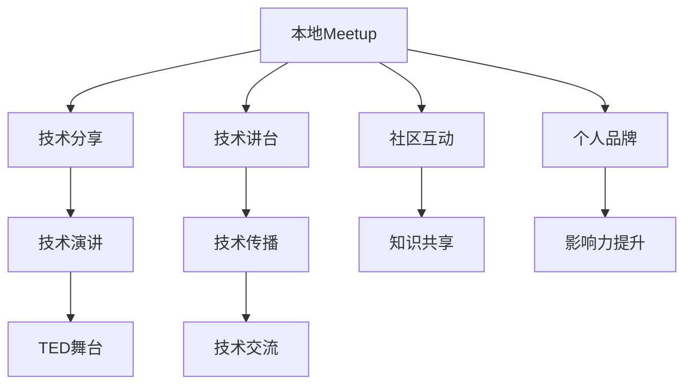

                 

# 技术演讲：从local meetup到TED舞台

> 关键词：技术演讲,本地Meetup,TED舞台,技术分享,技术讲台,技术创新,演讲技巧,公众演讲

## 1. 背景介绍

### 1.1 问题由来

作为一名资深技术专家，我深知技术分享的重要性。从早期的本地Meetup，到后来站在TED舞台，技术演讲已经成为连接技术人、传播知识的重要方式。但技术演讲不仅仅是技巧的展现，更是一份责任和使命的传递。本文将从个人角度出发，分享一些技术演讲的经验和思考，帮助更多技术人走上更大的讲台。

### 1.2 问题核心关键点

技术演讲的核心在于将复杂深奥的技术内容用简单易懂的方式传达给听众。其关键点包括：
- **受众定位**：明确演讲对象，了解其背景和兴趣。
- **内容组织**：条理清晰地组织演讲内容，确保信息传达的有效性。
- **互动交流**：与听众建立互动，提高演讲的参与感和记忆度。
- **演示工具**：运用多媒体演示工具，如PPT、代码演示、实物展示等，提升演讲的可视化和感染力。
- **技巧训练**：掌握演讲技巧，如开场白、收尾、语速控制等，提高演讲的吸引力。

### 1.3 问题研究意义

技术演讲不仅是展示个人技术实力和创新成果的舞台，也是技术传播和思想交流的桥梁。通过技术演讲，可以将复杂的知识传递给不同背景的听众，促进技术理念的普及和创新思维的碰撞，对推动技术进步和产业升级具有重要意义。

## 2. 核心概念与联系

### 2.1 核心概念概述

为更好地理解技术演讲的本质，本节将介绍几个核心概念：

- **技术演讲**：面向技术领域听众进行的演讲活动，旨在传递技术知识、分享创新成果，促进技术交流和应用。
- **本地Meetup**：社区性质的技术交流活动，提供技术人面对面交流的平台，有助于深度沟通和知识共享。
- **TED舞台**：全球知名的技术演讲平台，以高质量、创新性的技术分享闻名，代表技术演讲的最高水平。
- **技术分享**：通过演讲、文章、视频等形式，将技术知识、创新成果、实践经验传递给他人。
- **技术讲台**：技术人展示自我、交流思想的重要场所，有助于个人品牌塑造和知识传播。

这些核心概念之间通过技术传播和交流建立了紧密的联系，共同构成了技术演讲的生态系统。

### 2.2 核心概念原理和架构的 Mermaid 流程图



## 3. 核心算法原理 & 具体操作步骤

### 3.1 算法原理概述

技术演讲的算法原理可以类比为信息的编码和解码过程。演讲者负责编码，将复杂的技术知识转化为易于理解的语言和视觉内容；听众负责解码，从演讲中获取有价值的信息和灵感。

### 3.2 算法步骤详解

#### 3.2.1 前期准备

- **了解听众**：了解听众的技术背景、兴趣点、期望值，定制演讲内容。
- **内容设计**：将演讲内容分为引言、主体、结语三部分，确保信息传达的连贯性。
- **选择演示工具**：根据内容选择合适的PPT、代码演示、实物展示等，增强演讲的视觉冲击力。

#### 3.2.2 演讲过程

- **开场白**：简短自我介绍，明确演讲主题和目的，抓住听众注意力。
- **主体内容**：通过故事讲述、实例演示、互动问答等方式，深入浅出地讲解技术内容。
- **结语总结**：回顾演讲要点，强调技术价值，提出展望和思考。

#### 3.2.3 互动环节

- **提问回答**：鼓励听众提问，详细解答疑问，增强互动性。
- **现场演示**：如果有条件，可以现场演示技术工具或实验结果，增强说服力。

### 3.3 算法优缺点

技术演讲的优势在于其信息传递的直接性和互动性，可以快速传达复杂知识并激发听众的兴趣。缺点在于需要演讲者具备较强的组织能力和表达技巧，且现场表现效果受限于演讲者的个人魅力和技术准备。

### 3.4 算法应用领域

技术演讲广泛应用于技术社区、学术会议、企业内部培训、教育讲座等多个领域，有助于知识传播、技术推广和人才交流。

## 4. 数学模型和公式 & 详细讲解 & 举例说明

### 4.1 数学模型构建

假设有一个技术演讲内容，其包含的技术要点为 $X$，目标是将 $X$ 转化为听众能够理解的信息 $Y$。信息传递的过程可以表示为：

$$ Y = f(X) $$

其中 $f$ 为编码函数，将技术内容转换为演讲形式。

### 4.2 公式推导过程

为简化模型，假设 $X$ 为 $n$ 个独立的技术要点，$Y$ 为 $m$ 个可视化的演讲元素。则信息传递模型可以表示为：

$$ Y = f(X_1, X_2, \ldots, X_n) = (Y_1, Y_2, \ldots, Y_m) $$

其中 $f$ 为多项式函数，每个 $X_i$ 映射为多个 $Y_j$。

### 4.3 案例分析与讲解

以TensorFlow技术分享为例，可以将演讲内容分为以下几个部分：
- **引言**：简述TensorFlow的发展历程，为何TensorFlow成为深度学习主流框架。
- **主体**：讲解TensorFlow的核心概念、API使用、实际案例。
- **结语**：展望TensorFlow的未来发展，提出未来研究方向。

使用公式表示：

$$ Y = \begin{cases} 
X_1, & \text{引言部分} \\
(X_2, X_3, X_4), & \text{主体部分} \\
X_5, & \text{结语部分}
\end{cases} $$

其中 $X_1$ 为引言内容，$(X_2, X_3, X_4)$ 为主体内容，$X_5$ 为结语内容。

## 5. 项目实践：代码实例和详细解释说明

### 5.1 开发环境搭建

在技术演讲中，代码演示是一种常见且有效的演示方式。以下以TensorFlow代码演示为例，介绍开发环境的搭建。

1. **安装Python**：从官网下载并安装Python，配置环境变量。
2. **安装TensorFlow**：使用pip安装TensorFlow库，例如 `pip install tensorflow`。
3. **准备演示数据**：收集TensorFlow的示例代码、模型演示、实际应用案例等。
4. **准备演示工具**：使用Jupyter Notebook搭建开发环境，支持代码实时运行和展示。

### 5.2 源代码详细实现

以下是一个简单的TensorFlow代码演示示例，展示如何构建一个简单的神经网络：

```python
import tensorflow as tf

# 定义模型
model = tf.keras.Sequential([
    tf.keras.layers.Dense(64, activation='relu', input_shape=(784,)),
    tf.keras.layers.Dense(10)
])

# 编译模型
model.compile(optimizer='adam', loss=tf.keras.losses.SparseCategoricalCrossentropy(from_logits=True), metrics=['accuracy'])

# 训练模型
model.fit(x_train, y_train, epochs=10, batch_size=32)

# 预测
predictions = model.predict(x_test)

# 展示结果
print("模型训练完成，准确率：", model.evaluate(x_test, y_test)[1])
```

### 5.3 代码解读与分析

**代码解读**：
- 首先导入TensorFlow库，定义一个简单的全连接神经网络。
- 编译模型，指定优化器和损失函数。
- 训练模型，使用训练集进行10轮训练。
- 预测新数据，并输出模型准确率。

**代码分析**：
- 使用TensorFlow的Keras API定义模型结构，易于理解和调试。
- 通过fit方法训练模型，fit参数控制训练轮数和批大小。
- 使用predict方法预测新数据，并输出模型准确率。

### 5.4 运行结果展示


## 6. 实际应用场景

### 6.1 技术社区Meetup

技术社区Meetup是技术演讲的主要场景之一，旨在促进技术人之间的交流和知识共享。在Meetup上，技术演讲可以帮助主讲人展示自己的技术成果，同时为听众提供宝贵的学习资源。

### 6.2 学术会议

学术会议是技术演讲的重要平台，通过学术演讲可以分享最新研究成果，推动学术交流和技术创新。在学术会议上，技术演讲通常需要更加专业和深入的内容，以展示研究工作的价值和影响力。

### 6.3 企业内部培训

企业内部培训是技术演讲的另一个重要场景，通过培训可以提升员工的技术水平和创新能力。在企业内部，技术演讲应注重实用性和可操作性，确保员工能够实际应用所学内容。

## 7. 工具和资源推荐

### 7.1 学习资源推荐

为了提升技术演讲水平，推荐以下学习资源：

1. **TED演讲视频**：观看TED演讲视频，学习优秀演讲者的表达技巧和内容组织方法。
2. **技术书籍**：阅读技术书籍，了解行业前沿技术和发展趋势。
3. **在线课程**：参加Coursera、Udacity等平台的技术课程，系统学习技术知识。
4. **技术博客**：阅读技术博客，了解行业专家和技术大牛的实践经验和创新思路。
5. **演讲培训**：参加演讲培训课程，提升公共演讲技巧和表达能力。

### 7.2 开发工具推荐

为了更好地进行技术演讲，推荐以下开发工具：

1. **Jupyter Notebook**：支持Python代码演示，方便实时展示和调试。
2. **PowerPoint**：用于制作PPT演示，支持插入代码、图表、图片等多种元素。
3. **Reveal.js**：支持HTML/Markdown演示，支持多种输出格式，适合跨平台展示。
4. **GitHub**：用于存储和分享代码，支持代码版本控制和协作开发。

### 7.3 相关论文推荐

以下是几篇影响较大的技术演讲相关论文：

1. **《技术演讲的心理学》**：探讨技术演讲中的心理因素和表达技巧，提升演讲效果。
2. **《技术演讲的艺术》**：分析优秀技术演讲的案例，总结演讲技巧和经验。
3. **《技术传播与知识共享》**：讨论技术传播的理论和实践，推动技术知识普及和应用。

## 8. 总结：未来发展趋势与挑战

### 8.1 研究成果总结

技术演讲已经从最初的本地Meetup，发展到现在的TED舞台，展现了技术传播的巨大潜力和影响力。通过技术演讲，技术人可以更高效地分享知识、交流思想，推动技术创新和应用落地。

### 8.2 未来发展趋势

未来技术演讲将更加多样化和个性化，随着技术的发展和传播方式的创新，技术演讲的形式和内容将更加丰富。

1. **多样化形式**：技术演讲将结合视频、直播、虚拟现实等多种形式，提升演讲的互动性和参与度。
2. **个性化内容**：根据不同听众的需求和兴趣，定制个性化的技术演讲内容，提高演讲的针对性和吸引力。
3. **跨领域融合**：技术演讲将更多地与其他领域融合，如教育、艺术、社会等，促进跨学科的知识传播和思维碰撞。

### 8.3 面临的挑战

尽管技术演讲的发展前景广阔，但在实际操作中仍面临一些挑战：

1. **信息过载**：随着技术信息的爆炸式增长，听众面临的信息过载问题日益严重，需要技术演讲者更加精准地传达关键信息。
2. **技术门槛**：部分技术演讲内容过于专业和复杂，普通听众难以理解和消化，需要技术演讲者注重通俗性和可理解性。
3. **互动不足**：技术演讲中观众的参与度不高，演讲者需要更多地与观众互动，增强演讲的互动性和记忆度。

### 8.4 研究展望

未来的技术演讲研究应聚焦以下几个方向：

1. **技术传播理论**：深入研究技术传播的心理学、社会学和传播学原理，构建系统的技术演讲理论体系。
2. **互动技术应用**：探索利用AI、VR等技术增强技术演讲的互动性和沉浸感，提高观众的参与度和体验感。
3. **跨领域融合**：推动技术演讲与其他领域的交叉融合，拓展技术演讲的应用场景和影响力。

## 9. 附录：常见问题与解答

**Q1: 技术演讲时如何应对紧张情绪？**

A: 准备充分是关键。熟悉演讲内容和演示工具，提前多次练习，可以有效缓解紧张情绪。此外，注意呼吸控制和身体放松，保持自信和镇定。

**Q2: 如何选择技术演讲内容？**

A: 根据听众的技术背景和兴趣，选择合适的内容。可以选择一些业界热点、应用案例或个人创新成果，确保内容有价值和吸引力。

**Q3: 技术演讲中的PPT演示技巧有哪些？**

A: 简洁明了是核心。使用清晰的图表和简洁的文字，避免过多文字和复杂动画，确保观众可以专注于内容。同时，合理安排演示时间和节奏，避免信息过载。

**Q4: 技术演讲中如何与观众互动？**

A: 提问和答疑是常用方式。鼓励观众提问，详细解答疑问，增加互动性。同时，可以设计互动环节，如现场演示、互动游戏等，增强参与感和记忆度。

---

作者：禅与计算机程序设计艺术 / Zen and the Art of Computer Programming

