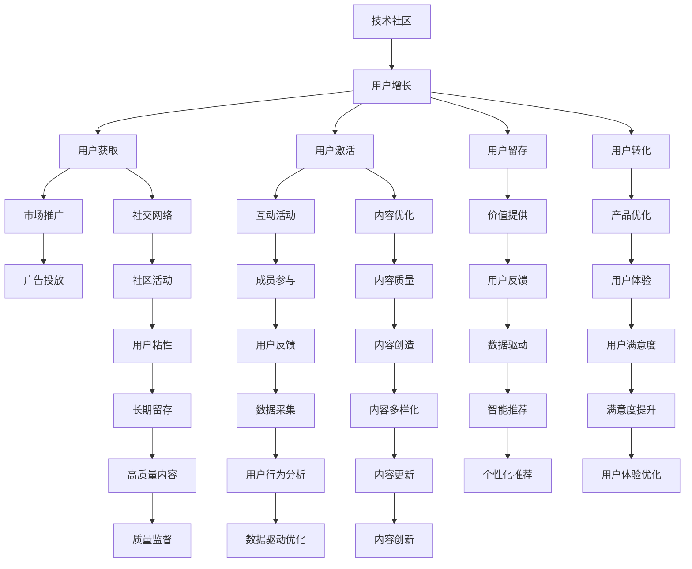

                 

# 技术社区运营：从0到10000用户

> 关键词：技术社区，用户增长，社区运营，用户转化，社区管理，用户留存

## 1. 背景介绍

### 1.1 问题由来
技术社区是技术爱好者、开发者、工程师等专业人士交流分享知识与经验的平台。它不仅能满足用户的学习需求，还能为企业和技术团队提供丰富的资源和工具，促进行业交流与合作。但许多技术社区在建立初期，用户数量很少，活跃度不高。因此，如何有效地运营社区，吸引并留住用户，成为摆在社区管理者面前的重要问题。

### 1.2 问题核心关键点
社区运营的核心目标包括吸引新用户、提升用户活跃度、增加内容供给、优化用户体验和提高用户留存率。要实现这些目标，社区管理者需掌握用户行为分析、内容优化、市场推广、用户互动、社区文化建设等多方面技能。

### 1.3 问题研究意义
高效的社区运营不仅可以提升社区的价值，还能加速技术知识的传播，促进技术的商业化和产业化。对企业而言，成功的技术社区不仅能够提升品牌知名度，还能吸引人才，驱动创新。

## 2. 核心概念与联系

### 2.1 核心概念概述

为更好地理解技术社区运营的策略和方法，本节将介绍几个密切相关的核心概念：

- 技术社区：一个以技术交流、分享、学习和创新为主题的社区平台。通常由技术爱好者、开发者、工程师等专业人士组成。

- 用户增长（Growth Hacking）：通过创新和实验，寻找和实现社区用户增长的策略和方法。涉及用户获取、激活、留存、转化等多个环节。

- 社区运营（Community Operations）：通过管理与运营，提升社区的用户活跃度和参与度。包括内容管理、活动组织、用户互动、文化建设等。

- 用户转化（User Conversion）：将潜在用户转化为活跃用户，实现用户价值的最大化。通过产品优化、营销活动、用户体验提升等方式实现。

- 用户留存（User Retention）：维持用户对社区的持续关注和参与，提升用户生命周期价值（Lifetime Value, LV）。通过提供价值、优化体验、互动活动等方式实现。

- 社区文化（Community Culture）：社区成员共有的价值观、行为规范和互动方式。对提升用户粘性和社区活力具有重要影响。

这些核心概念之间的逻辑关系可以通过以下Mermaid流程图来展示：



这个流程图展示了几大核心概念及其之间的关系：

1. 技术社区是用户增长的基础，通过各种手段吸引和激活用户。
2. 在用户获取和激活阶段，市场推广和社交网络是重要的渠道。
3. 在用户留存和转化的过程中，互动活动和内容优化能显著提升用户价值。
4. 产品优化和价值提供对用户转化有直接影响。
5. 通过成员参与和社区活动，提升用户粘性和满意度，增加长期留存。
6. 内容质量和多样性，智能推荐等都能促进高质量内容的创造。
7. 数据驱动和技术优化，是提升用户满意度和留存率的关键。

这些概念共同构成了技术社区运营的理论框架，为实践提供了指导。

## 3. 核心算法原理 & 具体操作步骤
### 3.1 算法原理概述

技术社区运营的本质是一种基于数据的策略优化过程。其核心思想是通过收集和分析用户行为数据，识别用户需求和行为模式，进而设计针对性的策略和活动，提升用户增长、活跃度、留存率和转化率。

形式化地，假设社区用户增长模型为 $G(t)$，其中 $t$ 表示时间。我们的目标是找到最优策略 $S$，使得：

$$
\max_{S} \int_{0}^{T} G(t) dt
$$

其中 $T$ 为社区运营的时间跨度。

### 3.2 算法步骤详解

基于数据驱动的社区运营，一般包括以下几个关键步骤：

**Step 1: 用户行为数据分析**
- 收集社区内用户的行为数据，如注册、登录、浏览、发布内容、参与讨论等。
- 使用A/B测试、多臂老虎机（Multi-Armed Bandit, MAB）等技术，分析不同策略对用户行为的影响。

**Step 2: 用户增长策略设计**
- 根据用户行为分析结果，设计合理的用户获取和激活策略。
- 包括市场推广（如广告投放、社交网络）、优惠活动（如注册优惠、积分奖励）、个性化推荐等。

**Step 3: 用户互动和内容优化**
- 设计并实施互动活动，如技术分享会、黑客松、问答互动等，增加用户粘性。
- 定期优化社区内容，增加高质量和多样化的文章、教程、代码库等，提升用户体验。

**Step 4: 用户留存和转化策略**
- 实施留存策略，如定期邮件、内容推荐、生日关怀等，增加用户回头率。
- 通过优化转化路径、提升用户体验，实现从潜在用户到活跃用户的转化。

**Step 5: 持续监测和优化**
- 使用数据指标持续监测用户增长、活跃度、留存率和转化率等关键指标。
- 定期进行用户调研和反馈收集，优化社区运营策略。

### 3.3 算法优缺点

基于数据的社区运营方法具有以下优点：
1. 科学合理。通过数据分析，识别用户需求和行为模式，设计出更加贴合用户需求的策略。
2. 高效低成本。数据驱动的运营策略可快速迭代和优化，不需要高昂的市场调研费用。
3. 可重复性高。数据驱动的运营方法具有较高的可重复性和可扩展性，适用于多种规模的社区。
4. 覆盖全面。数据驱动可同时关注用户获取、留存、转化等多个环节，实现全面运营。

同时，该方法也存在一定的局限性：
1. 数据依赖度高。策略设计高度依赖数据的质量和分析结果，数据获取和处理成本较高。
2. 即时性不足。数据分析需要一定时间，可能滞后于市场变化，影响策略的时效性。
3. 复杂度较高。数据驱动的运营方法需要建立完整的数据体系，对社区管理者的技能和资源要求较高。
4. 数据隐私风险。收集和分析用户数据可能涉及隐私问题，需遵守相关法律法规。

尽管存在这些局限性，但就目前而言，基于数据驱动的运营方法仍然是技术社区最主流和有效的运营范式。未来相关研究的重点在于如何进一步优化数据收集和分析方法，降低策略设计的复杂度，提高运营的即时性，同时兼顾数据隐私和安全性等因素。

### 3.4 算法应用领域

基于数据驱动的社区运营方法，在多个领域得到了广泛的应用，例如：

- 软件开发社区：如GitHub、Stack Overflow等。通过优化代码贡献、社区活动、技术交流等，吸引和留住开发者。
- 技术博客平台：如Medium、CSDN等。通过提升内容质量、互动活动、个性化推荐等，提升用户粘性和活跃度。
- 开源项目管理：如Apache、GitLab等。通过优化项目协作、代码评审、社区活动等，提升项目的贡献率和活跃度。
- 技术论坛：如Reddit、Discord等。通过增加话题讨论、用户互动、知识分享等，提升社区的活跃度和影响力。

除了上述这些经典领域外，基于数据驱动的社区运营方法也在越来越多的新兴领域得到应用，如游戏、教育、娱乐等，为这些领域带来新的技术突破和应用可能性。

## 4. 数学模型和公式 & 详细讲解 & 举例说明
### 4.1 数学模型构建

本节将使用数学语言对基于数据驱动的社区运营过程进行更加严格的刻画。

假设社区用户增长模型为 $G(t) = a + b t$，其中 $a$ 为初期用户数，$b$ 为日增长率。社区运营的目标是最大化用户数 $N(t)$：

$$
N(t) = \int_{0}^{t} G(t) dt = \frac{1}{2} a t^2 + \frac{1}{6} b t^3
$$

为了最大化 $N(t)$，需要找到 $t$ 的最优值。根据一阶导数为零的必要条件，解得：

$$
t = \frac{3a}{b}
$$

此时社区达到用户数最大化。

### 4.2 公式推导过程

以下我们以用户留存率为目标，推导留存率最大化的模型和策略。

假设社区用户留存率为 $R(t) = e^{-kt}$，其中 $k$ 为流失率。社区的目标是最大化 $R(t)$：

$$
\max_{t} R(t) = \max_{t} e^{-kt}
$$

通过求导并令导数为零，解得：

$$
t = \frac{1}{k}
$$

此时用户留存率达到最大。

### 4.3 案例分析与讲解

下面以GitHub为例，展示如何通过数据驱动的方法提升社区的用户增长和留存率。

**用户增长案例：**
- 通过分析GitHub活跃用户的行为数据，发现开发者更倾向于使用免费版。因此，GitHub设计了免费版和付费版的混合订阅模式，并利用价格弹性模型（Price Elasticity Model）进行用户获取策略优化。
- 通过数据驱动的用户调研，发现开发者更倾向于在Twitter等社交平台上分享代码。因此，GitHub在Twitter上进行针对性广告投放，并引入社交网络效应，成功吸引了大量新用户。

**用户留存案例：**
- 通过对GitHub用户行为数据分析，发现用户活跃度呈现明显的周期性波动。因此，GitHub在关键节点（如每周五）推出特别活动，如“向周五致敬”（Fridays Are Magic），提升用户活跃度和留存率。
- 通过数据驱动的内容优化，GitHub定期发布高质量的技术文章和开源项目，并利用个性化推荐算法，增加用户的参与度和粘性。

## 5. 项目实践：代码实例和详细解释说明
### 5.1 开发环境搭建

在进行社区运营实践前，我们需要准备好开发环境。以下是使用Python进行数据分析和社区运营的开发环境配置流程：

1. 安装Python：从官网下载并安装Python，建议使用3.7或以上版本。

2. 安装Jupyter Notebook：从官网下载并安装Jupyter Notebook，用于编写和运行Python代码。

3. 安装Pandas：
```bash
pip install pandas
```

4. 安装Matplotlib：
```bash
pip install matplotlib
```

5. 安装Scikit-learn：
```bash
pip install scikit-learn
```

6. 安装Seaborn：
```bash
pip install seaborn
```

完成上述步骤后，即可在Jupyter Notebook中开始社区运营实践。

### 5.2 源代码详细实现

下面我们以GitHub为例，给出使用Python进行用户行为分析的代码实现。

首先，定义用户行为数据处理函数：

```python
import pandas as pd
import matplotlib.pyplot as plt

def load_user_data(file_path):
    data = pd.read_csv(file_path)
    return data

def plot_user_activity(data):
    plt.figure(figsize=(10, 5))
    plt.plot(data['time'], data['activity'], label='User Activity')
    plt.xlabel('Time')
    plt.ylabel('Activity')
    plt.title('User Activity over Time')
    plt.legend()
    plt.show()

def calculate_growth_rate(data):
    initial_users = data.iloc[0]['users']
    growth_rate = (data.iloc[-1]['users'] - initial_users) / (data.iloc[-1]['time'] - data.iloc[0]['time'])
    return growth_rate

def calculate_retention_rate(data):
    initial_users = data.iloc[0]['users']
    retention_rate = (data.iloc[-1]['users'] / initial_users) ** (1 / data.iloc[-1]['time'])
    return retention_rate
```

然后，定义用户增长和留存率分析函数：

```python
def analyze_growth(data):
    growth_rate = calculate_growth_rate(data)
    return growth_rate

def analyze_retention(data):
    retention_rate = calculate_retention_rate(data)
    return retention_rate
```

接着，定义用户获取和留存策略优化函数：

```python
from sklearn.linear_model import LinearRegression

def optimize_growth_strategy(data):
    growth_rate = analyze_growth(data)
    model = LinearRegression()
    model.fit(data['time'], data['users'])
    predicted_growth = model.predict(data['time'].values)
    return predicted_growth

def optimize_retention_strategy(data):
    retention_rate = analyze_retention(data)
    model = LinearRegression()
    model.fit(data['time'], data['users'])
    predicted_retention = model.predict(data['time'].values)
    return predicted_retention
```

最后，启动数据分析流程：

```python
data = load_user_data('user_data.csv')
plot_user_activity(data)
growth_rate = optimize_growth_strategy(data)
retention_rate = optimize_retention_strategy(data)
print(f'Growth Rate: {growth_rate:.2f}%
Retention Rate: {retention_rate:.2f}%')
```

以上就是使用Python进行社区运营数据分析的完整代码实现。可以看到，通过简单的数据处理和回归分析，我们可以得到用户增长和留存率的预测模型，为社区运营策略提供科学的依据。

### 5.3 代码解读与分析

让我们再详细解读一下关键代码的实现细节：

**load_user_data函数**：
- 用于读取用户行为数据文件，并返回一个Pandas DataFrame对象。

**plot_user_activity函数**：
- 使用Matplotlib库绘制用户活跃度随时间变化的折线图，帮助直观展示用户行为趋势。

**calculate_growth_rate函数**：
- 计算用户增长率，公式为：$\text{增长率} = \frac{\text{末用户数} - \text{初用户数}}{\text{时间差}}$

**calculate_retention_rate函数**：
- 计算用户留存率，公式为：$\text{留存率} = (\frac{\text{末用户数}}{\text{初用户数}})^{\frac{1}{\text{时间差}}}$

**analyze_growth函数**：
- 通过调用calculate_growth_rate函数计算用户增长率，返回结果。

**analyze_retention函数**：
- 通过调用calculate_retention_rate函数计算用户留存率，返回结果。

**optimize_growth_strategy函数**：
- 使用LinearRegression模型对用户增长率进行回归分析，预测未来的用户增长情况。

**optimize_retention_strategy函数**：
- 使用LinearRegression模型对用户留存率进行回归分析，预测未来的用户留存情况。

**start_analysis函数**：
- 读取用户数据文件，绘制用户活跃度折线图，计算用户增长率和留存率，并输出结果。

通过上述代码的实现，我们展示了如何使用Python进行用户行为数据分析，为社区运营策略提供科学的依据。

当然，在实际应用中，还需要进行更复杂的数据分析和策略优化，如多目标优化、时间序列分析、数据挖掘等。但核心的思路是使用数据驱动的方法，通过分析用户行为数据，优化社区运营策略，提升用户增长和留存率。

## 6. 实际应用场景
### 6.1 智能客服系统

基于数据驱动的社区运营方法，可以应用于智能客服系统的构建。智能客服系统通过分析用户的历史行为数据，识别出常见问题和需求，自动分配给最合适的客服机器人进行处理。

在技术实现上，可以收集用户的历史互动记录、咨询问题、解决问题等数据，利用机器学习模型进行用户需求预测和问题分类，实现智能客服的自动化。智能客服系统不仅能快速响应客户咨询，还能根据用户的历史行为和偏好，提供个性化的服务。通过持续的用户行为数据收集和分析，智能客服系统还能不断优化回答策略，提升服务质量。

### 6.2 金融产品推荐

金融产品推荐社区的运营需要基于用户的行为数据，设计个性化推荐策略。通过分析用户的历史交易记录、浏览行为、投资偏好等数据，设计推荐模型，实现基于用户兴趣的个性化推荐。

在实际应用中，可以使用协同过滤、深度学习等技术，构建推荐模型，进行用户行为预测和产品推荐。通过实时监测用户行为变化，不断优化推荐策略，提升用户的满意度和留存率。同时，在推荐过程中，还需要关注用户隐私保护，确保数据的安全性和合法性。

### 6.3 教育资源平台

教育资源平台通过数据驱动的运营，提升课程质量和用户粘性。平台可以通过分析用户的访问行为、学习路径、考试成绩等数据，识别出用户的学习偏好和薄弱环节，设计针对性的学习计划和个性化推荐。

在技术实现上，可以使用数据挖掘、机器学习等技术，构建学习分析模型，进行用户行为预测和学习路径优化。同时，平台还可以通过用户反馈和行为数据，不断调整和优化课程内容，提升用户的学习效果和满意度。

### 6.4 未来应用展望

随着大数据和人工智能技术的不断发展，基于数据驱动的社区运营方法将迎来更多的应用场景和创新机遇。

在智慧医疗领域，通过分析患者的医疗记录和行为数据，构建个性化治疗和护理方案，提升医疗服务的质量和效率。

在智慧城市治理中，通过分析市民的行为数据，设计智能交通、能源管理、公共安全等系统，提升城市管理水平和市民生活质量。

在电商领域，通过分析用户的购物行为和偏好，设计个性化的推荐策略，提升用户的购物体验和满意度。

此外，在社交媒体、游戏、娱乐等众多领域，基于数据驱动的社区运营方法也将不断拓展，带来更多的创新应用和价值提升。未来，随着技术的发展和数据的丰富，社区运营将更加智能化和人性化，为人类社会带来更多的便利和可能性。

## 7. 工具和资源推荐
### 7.1 学习资源推荐

为了帮助开发者系统掌握社区运营的理论基础和实践技巧，这里推荐一些优质的学习资源：

1. 《社区运营实战指南》系列博文：由社区运营专家撰写，深入浅出地介绍了社区运营的理论基础和实战技巧。

2. 《社区运营的艺术》书籍：详细介绍了社区运营的策略和案例，适用于社区运营从业者和技术爱好者。

3. 《数据驱动的社区运营》课程：通过实际案例，讲解了如何使用数据分析和机器学习技术提升社区运营效果。

4. 《社区运营管理》在线课程：由社区管理专家讲授，涵盖社区运营的各个环节，包括用户获取、互动、内容优化等。

5. 《社区运营的N个实战案例》：通过多个实战案例，展示了如何通过数据驱动提升社区的活跃度和留存率。

通过对这些资源的学习实践，相信你一定能够快速掌握社区运营的精髓，并用于解决实际的社区问题。

### 7.2 开发工具推荐

高效的开发离不开优秀的工具支持。以下是几款用于社区运营开发的常用工具：

1. Jupyter Notebook：交互式Python开发环境，支持代码编写、数据可视化、结果展示等功能。

2. Python：通用的编程语言，支持数据处理、机器学习、数据分析等操作。

3. Pandas：Python数据处理库，支持大规模数据的读写、清洗、分析等操作。

4. Matplotlib：Python数据可视化库，支持各种图表的绘制和展示。

5. Scikit-learn：Python机器学习库，支持各种机器学习模型的实现和优化。

6. TensorFlow：Google开发的机器学习框架，支持大规模深度学习模型的训练和部署。

7. PyTorch：Facebook开发的深度学习框架，支持动态计算图和高效的模型训练。

合理利用这些工具，可以显著提升社区运营的开发效率，加快创新迭代的步伐。

### 7.3 相关论文推荐

社区运营技术的发展源于学界的持续研究。以下是几篇奠基性的相关论文，推荐阅读：

1. "The Importance of User Engagement in Online Communities"：探讨了用户参与度对社区价值的影响。

2. "Community Dynamics and Group Behavior in Online Environments"：分析了在线社区中用户行为的变化规律。

3. "User-Generated Content Analysis in Social Media Platforms"：介绍了如何通过数据分析提升用户生成内容的价值。

4. "A Framework for Scalable and Effective Community Management"：提出了社区管理的基本框架和策略。

5. "Optimizing User Experience through Personalized Recommendations"：研究了个性化推荐在社区运营中的应用。

这些论文代表了大数据驱动的社区运营技术的发展脉络。通过学习这些前沿成果，可以帮助研究者把握学科前进方向，激发更多的创新灵感。

## 8. 总结：未来发展趋势与挑战

### 8.1 总结

本文对基于数据驱动的社区运营方法进行了全面系统的介绍。首先阐述了社区运营的核心目标和关键策略，明确了运营在社区价值提升中的重要作用。其次，从原理到实践，详细讲解了数据驱动的社区运营过程，给出了社区运营实践的完整代码实例。同时，本文还广泛探讨了社区运营方法在智能客服、金融产品推荐、教育资源平台等多个行业领域的应用前景，展示了数据驱动社区运营的巨大潜力。

通过本文的系统梳理，可以看到，基于数据驱动的社区运营方法已经成为社区运营的主流范式，极大地提升了社区的用户增长、活跃度和留存率，加速了社区技术的产业化进程。未来，伴随大数据和人工智能技术的进一步发展，社区运营还将迎来更多的创新应用和价值提升。

### 8.2 未来发展趋势

展望未来，社区运营技术将呈现以下几个发展趋势：

1. 数据智能技术的应用将更加广泛。数据智能技术如强化学习、迁移学习等，将进一步提升社区运营的智能化水平。

2. 社区运营的跨领域融合将更加深入。社区运营将与更多领域如医疗、金融、教育、电商等进行深度融合，形成跨领域的数据分析和运营策略。

3. 用户行为分析的精细化程度将不断提高。通过多源数据的融合和高级分析方法的应用，能够更精准地识别用户需求和行为模式，设计出更加符合用户期望的运营策略。

4. 社区运营的自动化程度将不断提高。自动化工具和机器学习算法的应用，将进一步简化社区运营的流程，提高运营效率。

5. 社区运营的个性化程度将不断提高。基于用户行为数据的个性化推荐和内容优化，将进一步提升用户的满意度和留存率。

6. 社区运营的可持续性将不断提高。通过持续监测和优化，社区运营能够更好地适应市场变化，持续提供高质量的服务。

以上趋势凸显了社区运营技术的广阔前景。这些方向的探索发展，必将进一步提升社区的价值，为技术社区的可持续发展和产业应用注入新的动力。

### 8.3 面临的挑战

尽管社区运营技术已经取得了瞩目成就，但在迈向更加智能化、普适化应用的过程中，它仍面临着诸多挑战：

1. 数据获取难度大。社区运营需要大量的用户行为数据，但获取这些数据往往涉及隐私问题，数据获取成本较高。

2. 数据质量问题多。社区运营依赖于高质量的数据，但数据来源多样、格式不一，数据清洗和处理难度大。

3. 策略设计复杂。社区运营策略需要综合考虑多种因素，如用户需求、市场变化、法律法规等，策略设计复杂度较高。

4. 模型性能提升难。社区运营模型需要处理海量数据，对计算资源要求高，模型性能提升难度大。

5. 用户隐私风险高。社区运营涉及大量用户数据，数据隐私和安全性问题亟需解决。

6. 运营成本高。社区运营需要持续投入人力、物力和财力，运营成本较高。

正视社区运营面临的这些挑战，积极应对并寻求突破，将是大数据驱动社区运营走向成熟的必由之路。相信随着学界和产业界的共同努力，这些挑战终将一一被克服，社区运营必将在构建智能社区中扮演越来越重要的角色。

### 8.4 研究展望

面对社区运营所面临的挑战，未来的研究需要在以下几个方面寻求新的突破：

1. 数据获取和管理优化。研究如何高效、安全地获取和管理社区运营所需的数据，降低数据获取和处理的成本。

2. 数据智能算法优化。研究如何通过强化学习、迁移学习等算法提升社区运营的智能化水平，提高运营效率和效果。

3. 社区运营策略优化。研究如何综合考虑用户需求、市场变化、法律法规等因素，设计出更加科学合理的运营策略。

4. 模型性能提升技术。研究如何通过分布式计算、模型压缩、模型加速等技术，提升社区运营模型的性能，降低计算资源消耗。

5. 数据隐私和安全技术。研究如何保护用户隐私，确保数据安全和合法使用。

6. 社区运营成本控制。研究如何通过自动化、智能化等技术，降低社区运营的成本，提高运营效率。

这些研究方向的探索，必将引领社区运营技术迈向更高的台阶，为构建智能社区带来新的突破和创新。面向未来，社区运营技术还需要与其他人工智能技术进行更深入的融合，如知识表示、因果推理、强化学习等，多路径协同发力，共同推动社区运营技术的进步。只有勇于创新、敢于突破，才能不断拓展社区运营的边界，让社区运营技术更好地服务于人类社会。

## 9. 附录：常见问题与解答

**Q1：社区运营的核心目标是什么？**

A: 社区运营的核心目标包括吸引新用户、提升用户活跃度、增加内容供给、优化用户体验和提高用户留存率。

**Q2：社区运营过程中如何提升用户增长和留存？**

A: 通过数据分析和策略优化，可以实现社区运营的目标。具体方法包括市场推广、社交网络、互动活动、内容优化、个性化推荐等。

**Q3：社区运营需要哪些关键数据？**

A: 社区运营需要收集和分析用户的行为数据，如注册、登录、浏览、发布内容、参与讨论等。这些数据可以通过用户行为日志、社交媒体、交易记录等途径获取。

**Q4：社区运营中如何保证数据隐私和安全？**

A: 社区运营需要遵守相关法律法规，保护用户隐私和数据安全。可以采用数据匿名化、加密存储、访问控制等技术手段，确保数据的安全性和合法使用。

**Q5：社区运营中的机器学习模型应该如何选择和优化？**

A: 根据社区运营的具体需求，选择合适的机器学习模型进行数据处理和分析。模型选择和优化需要考虑数据量、模型复杂度、计算资源等因素，通常需要进行多次实验和评估。

通过这些问答，希望能为你提供更多的社区运营的见解和解决方案。

---

作者：禅与计算机程序设计艺术 / Zen and the Art of Computer Programming

