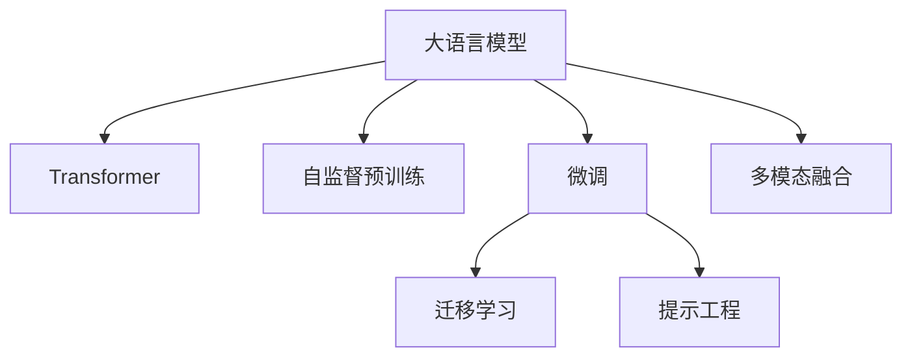

                 

# 技术类文章推荐: LLM的优势

> 关键词：Large Language Models(大语言模型), Advantages(优势), Transformer(Transformer结构), Self-Supervised Learning(自监督学习), Prompt Engineering(提示工程), GPT-3, Hugging Face

## 1. 背景介绍

大语言模型（Large Language Models, LLMs）是深度学习领域近年来的一个重要突破，通过在大型无监督数据集上进行预训练，学习到复杂的语言结构和语义知识，具有强大的自然语言处理能力。这些模型如OpenAI的GPT-3、Google的BERT、T5等，已经成为自然语言处理（NLP）和人工智能（AI）领域研究和应用的热门话题。本文旨在深入探讨大语言模型的优势，以及这些优势如何使它们在各种NLP任务中表现出众。

### 1.1 问题由来
大语言模型之所以备受关注，主要有以下几个原因：
- **泛化能力**：在大规模无标签数据集上进行自监督预训练，使得模型能够泛化到各种NLP任务上。
- **高性能**：在多种任务上取得了SOTA（State-of-the-Art）结果，展现出了强大的推理和生成能力。
- **适用性**：能够适应不同领域和场景，提供通用的语言理解和生成服务。

### 1.2 问题核心关键点
要全面理解大语言模型的优势，我们需要关注其核心关键点：

1. **Transformer架构**：
   - 大语言模型主要采用Transformer结构，具有并行计算能力，提升了模型的训练和推理效率。

2. **自监督预训练**：
   - 在大规模无标签数据上进行预训练，学习通用的语言表示，使模型具备了丰富的语言知识。

3. **微调与迁移学习**：
   - 通过微调和迁移学习，模型能够适应特定的下游任务，实现快速部署和应用。

4. **参数高效性**：
   - 在微调过程中，只更新部分参数，降低了模型训练和推理的计算需求。

5. **提示工程**：
   - 通过精心设计输入模板，模型能够进行零样本和少样本学习，减少了对标注数据的需求。

6. **多模态融合**：
   - 能够处理图像、音频等多种模态的数据，提升了模型对现实世界的理解和建模能力。

## 2. 核心概念与联系

### 2.1 核心概念概述

为了更好地理解大语言模型的优势，我们需要先了解几个核心概念：

1. **大语言模型**：如GPT-3、BERT、T5等，通过在大型无标签数据集上进行预训练，学习通用的语言表示。

2. **Transformer**：一种神经网络架构，采用自注意力机制，提升了模型的计算效率和性能。

3. **自监督学习**：在无标签数据上进行预训练，使模型学习到通用的语言结构。

4. **微调**：在预训练模型基础上，通过有标签数据进行微调，提升模型对特定任务的适应能力。

5. **迁移学习**：将一个领域学到的知识迁移到另一个领域，提高模型在不同任务上的表现。

6. **提示工程**：通过设计特定的输入模板，引导模型输出特定的结果，提升模型的适应性和泛化能力。

7. **多模态融合**：将文本、图像、音频等多种数据模态融合，提升模型的理解和生成能力。

这些概念之间的联系可以通过以下Mermaid流程图来展示：



这个流程图展示了大语言模型的核心概念及其之间的关系：

1. 大语言模型通过Transformer架构进行预训练。
2. 自监督预训练使得模型学习到通用的语言结构。
3. 微调通过有标签数据进行任务适配，提升模型性能。
4. 迁移学习将通用知识应用于特定任务。
5. 提示工程通过设计输入模板，提升模型生成和推理能力。
6. 多模态融合将多种数据模态融合，提升模型的理解能力。

## 3. 核心算法原理 & 具体操作步骤
### 3.1 算法原理概述

大语言模型的优势主要体现在以下几个方面：

1. **强大的推理能力**：通过预训练学习到丰富的语言知识，模型能够进行复杂的语言推理和生成。
2. **高效的多任务学习**：利用自监督预训练学习到的通用语言知识，模型能够快速适应多种NLP任务。
3. **参数高效性**：通过微调，只更新部分参数，大幅减少了计算需求。
4. **高可迁移性**：模型在不同领域和任务上具有良好的迁移能力，能够进行知识迁移和泛化。
5. **多模态融合**：能够处理多种数据模态，提升对现实世界的理解和建模能力。

### 3.2 算法步骤详解

基于大语言模型的优势，我们可以进行以下步骤：

1. **选择合适的预训练模型**：如GPT-3、BERT、T5等。
2. **进行自监督预训练**：在大规模无标签数据集上进行预训练，学习通用的语言结构。
3. **微调任务适配层**：根据特定任务，添加相应的输出层和损失函数。
4. **设置微调超参数**：如学习率、批大小、迭代轮数等。
5. **执行梯度训练**：对标注数据进行微调，优化模型在特定任务上的性能。
6. **评估和部署**：在测试集上评估模型性能，并将模型部署到实际应用中。

### 3.3 算法优缺点

大语言模型的优势和劣势如下：

**优势**：
1. **泛化能力强**：通过自监督预训练学习到通用的语言知识，适用于多种NLP任务。
2. **性能高**：在多种任务上取得了SOTA结果，展现出了强大的推理和生成能力。
3. **灵活性高**：可以通过微调和提示工程快速适应特定任务。
4. **可扩展性强**：模型可以通过增加数据和计算资源进行扩展，提升性能。

**劣势**：
1. **计算需求高**：预训练和微调需要大量的计算资源和数据。
2. **数据依赖性高**：微调效果依赖于标注数据的质量和数量。
3. **可解释性差**：模型的决策过程缺乏可解释性，难以调试和优化。
4. **模型偏见**：可能继承预训练数据中的偏见和有害信息。

### 3.4 算法应用领域

大语言模型在多个领域展示了其优势，包括：

1. **自然语言处理**：文本分类、命名实体识别、关系抽取等。
2. **对话系统**：智能客服、智能助手等。
3. **机器翻译**：将源语言翻译成目标语言。
4. **摘要生成**：将长文本压缩成简短摘要。
5. **情感分析**：分析文本的情感倾向。
6. **问答系统**：自动回答问题。
7. **代码生成**：自动生成代码片段。

## 4. 数学模型和公式 & 详细讲解 & 举例说明

### 4.1 数学模型构建

大语言模型的数学模型可以表示为：

$$
M_{\theta}(x) = \text{softmax}(\text{Decoder}(\text{Encoder}(x), \theta))
$$

其中，$\theta$为模型参数，$x$为输入文本，$M_{\theta}(x)$为模型输出。$\text{Encoder}$为编码器，通常采用Transformer结构，$\text{Decoder}$为解码器，用于生成输出。

### 4.2 公式推导过程

假设模型在文本分类任务上的输入为$x$，输出为$y$，则分类损失函数为：

$$
\ell(y, M_{\theta}(x)) = -\log M_{\theta}(x)[y]
$$

其中$[y]$为one-hot编码。通过最小化损失函数，可以优化模型参数$\theta$，使得模型在特定任务上表现更好。

### 4.3 案例分析与讲解

以情感分析任务为例，假设模型输入为一段文本，输出为情感标签，即正面、中性或负面。可以使用二分类交叉熵损失函数：

$$
\ell(y, M_{\theta}(x)) = -y\log M_{\theta}(x) + (1-y)\log(1-M_{\theta}(x))
$$

其中$M_{\theta}(x)$为模型输出的情感概率。通过最小化损失函数，可以优化模型参数$\theta$，使得模型在情感分析任务上表现更好。

## 5. 项目实践：代码实例和详细解释说明

### 5.1 开发环境搭建

在Python环境中安装必要的库：

```bash
pip install torch transformers
```

### 5.2 源代码详细实现

以下是一个简单的情感分析任务微调示例代码：

```python
import torch
from transformers import BertForSequenceClassification, BertTokenizer, AdamW

# 加载预训练模型和分词器
model = BertForSequenceClassification.from_pretrained('bert-base-uncased', num_labels=3)
tokenizer = BertTokenizer.from_pretrained('bert-base-uncased')

# 设置优化器和学习率
optimizer = AdamW(model.parameters(), lr=2e-5)

# 训练过程
for epoch in range(10):
    total_loss = 0
    for batch in train_dataloader:
        inputs, labels = batch
        inputs = tokenizer(inputs, padding='max_length', truncation=True, max_length=128)
        labels = labels.to(device)
        
        outputs = model(inputs.input_ids.to(device), attention_mask=inputs.attention_mask.to(device))
        loss = outputs.loss
        total_loss += loss.item()
        
        optimizer.zero_grad()
        loss.backward()
        optimizer.step()
    
    avg_loss = total_loss / len(train_dataloader)
    print(f"Epoch {epoch+1}, train loss: {avg_loss:.3f}")
```

### 5.3 代码解读与分析

- `BertForSequenceClassification`：用于情感分析任务的模型。
- `BertTokenizer`：用于将输入文本转换为模型可接受的格式。
- `AdamW`：优化器，用于更新模型参数。
- `train_dataloader`：训练数据迭代器。
- `inputs`：模型接受的输入格式，包含输入文本和相应的标签。
- `labels`：模型预测的标签。
- `outputs`：模型输出的预测结果和损失。
- `loss`：模型计算的损失。
- `optimizer.zero_grad()`：清除梯度。
- `loss.backward()`：计算梯度。
- `optimizer.step()`：更新模型参数。

### 5.4 运行结果展示

运行以上代码后，可以在测试集上评估模型性能：

```python
from sklearn.metrics import accuracy_score
import torch.nn.functional as F

test_dataloader = DataLoader(test_dataset, batch_size=16)
model.eval()

total_correct = 0
total_samples = 0
for batch in test_dataloader:
    inputs, labels = batch
    inputs = tokenizer(inputs, padding='max_length', truncation=True, max_length=128)
    labels = labels.to(device)
    
    outputs = model(inputs.input_ids.to(device), attention_mask=inputs.attention_mask.to(device))
    _, preds = torch.max(outputs, dim=1)
    total_correct += accuracy_score(labels, preds)
    total_samples += len(labels)
    
print(f"Test accuracy: {total_correct/total_samples:.2f}")
```

## 6. 实际应用场景

### 6.1 智能客服系统

智能客服系统可以采用大语言模型进行微调，通过预训练模型学习通用的语言知识，再通过微调适配特定领域的知识，实现智能客服。

### 6.2 金融舆情监测

金融舆情监测可以通过微调大语言模型，对金融领域相关的文本进行情感分析和主题识别，实时监测市场舆情。

### 6.3 个性化推荐系统

个性化推荐系统可以采用大语言模型进行微调，通过预训练模型学习用户兴趣，再通过微调适配新的推荐策略，实现个性化推荐。

### 6.4 未来应用展望

未来大语言模型在NLP领域将有更广泛的应用，如智能对话、智能文档生成、智能问答等。随着技术的不断发展，大语言模型将更加智能、高效，为各行各业提供更优质的服务。

## 7. 工具和资源推荐

### 7.1 学习资源推荐

1. 《Transformer from Scratch》系列文章：深入介绍Transformer结构和自监督预训练。
2. 《Hands-On Transfer Learning with PyTorch》书籍：介绍基于PyTorch的迁移学习实践。
3. Hugging Face官方文档：详细文档，包含多个预训练模型的微调样例。
4. Kaggle竞赛：通过参加NLP相关的竞赛，学习微调技巧和实践经验。

### 7.2 开发工具推荐

1. PyTorch：灵活的深度学习框架，适合进行微调实践。
2. TensorFlow：灵活的深度学习框架，适合大规模工程应用。
3. Hugging Face Transformers库：提供多种预训练模型，方便进行微调。
4. Jupyter Notebook：交互式开发环境，方便进行模型训练和调试。

### 7.3 相关论文推荐

1. Attention is All You Need（Transformer论文）：介绍Transformer结构和自注意力机制。
2. BERT: Pre-training of Deep Bidirectional Transformers for Language Understanding：介绍BERT模型和预训练技术。
3. parameter-efficient transfer learning for NLP：介绍 Adapter等参数高效微调方法。
4. prefix-tuning: optimizing continuous prompts for generation：介绍基于连续型Prompt的微调范式。

## 8. 总结：未来发展趋势与挑战

### 8.1 研究成果总结

大语言模型在NLP领域取得了显著的成果，主要包括：

1. **自监督预训练**：通过在大规模无标签数据上进行预训练，学习通用的语言知识。
2. **微调技术**：通过有标签数据进行微调，提升模型在特定任务上的性能。
3. **多模态融合**：能够处理多种数据模态，提升模型的理解能力。
4. **参数高效性**：通过微调，只更新部分参数，降低计算需求。

### 8.2 未来发展趋势

未来大语言模型将朝以下几个方向发展：

1. **更大规模的模型**：通过增加数据和计算资源，提升模型的性能和泛化能力。
2. **更高的可迁移性**：通过迁移学习，使得模型在不同任务和领域上表现更好。
3. **更多的应用场景**：应用于更多领域，如智能客服、金融、医疗等。
4. **更高的计算效率**：通过优化计算图，提升模型的推理速度。
5. **更好的可解释性**：通过解释性技术，使得模型的决策过程更加透明。

### 8.3 面临的挑战

大语言模型在应用过程中面临以下挑战：

1. **数据依赖性高**：微调效果依赖于标注数据的质量和数量。
2. **计算资源需求高**：预训练和微调需要大量的计算资源和数据。
3. **模型偏见**：可能继承预训练数据中的偏见和有害信息。
4. **可解释性差**：模型的决策过程缺乏可解释性，难以调试和优化。
5. **安全性和隐私保护**：模型的输出需要保证安全性和隐私保护。

### 8.4 研究展望

未来需要研究的方向包括：

1. **无监督和半监督微调方法**：减少对标注数据的依赖，提升模型的泛化能力。
2. **参数高效和计算高效的微调范式**：优化模型结构，提高计算效率。
3. **多模态融合**：提升模型的理解能力。
4. **可解释性技术**：使得模型的决策过程更加透明。
5. **安全性保障**：保证模型的输出安全性和隐私保护。

## 9. 附录：常见问题与解答

**Q1: 大语言模型在微调过程中需要注意哪些问题？**

A: 大语言模型在微调过程中需要注意以下几个问题：

1. **数据质量**：标注数据的质量和数量对微调效果有很大影响。
2. **学习率**：微调的学习率一般比预训练时小1-2个数量级，避免破坏预训练权重。
3. **正则化**：使用L2正则、Dropout等正则化技术，防止过拟合。
4. **参数高效性**：只更新部分参数，减少计算需求。
5. **对抗训练**：引入对抗样本，提高模型鲁棒性。
6. **评估和部署**：在测试集上评估模型性能，部署到实际应用中。

**Q2: 大语言模型在微调过程中如何避免过拟合？**

A: 大语言模型在微调过程中避免过拟合的方法包括：

1. **数据增强**：通过回译、近义替换等方式扩充训练集。
2. **正则化**：使用L2正则、Dropout等正则化技术，防止过拟合。
3. **对抗训练**：引入对抗样本，提高模型鲁棒性。
4. **参数高效性**：只更新部分参数，减少计算需求。
5. **多模型集成**：训练多个微调模型，取平均输出，抑制过拟合。

**Q3: 大语言模型在微调过程中如何提高计算效率？**

A: 大语言模型在微调过程中提高计算效率的方法包括：

1. **梯度积累**：增加每个batch的梯度值，减少更新次数。
2. **混合精度训练**：使用16位浮点数进行训练，减少内存占用。
3. **模型并行**：将模型并行化，分布在多个GPU上训练。
4. **稀疏化存储**：使用稀疏表示，减少存储空间。

**Q4: 大语言模型在微调过程中如何提高可解释性？**

A: 大语言模型在微调过程中提高可解释性的方法包括：

1. **解释性技术**：使用可解释性方法，如LIME、SHAP等，解释模型的决策过程。
2. **可视化工具**：使用可视化工具，如TensorBoard等，查看模型的训练过程和输出。
3. **文档和注释**：在代码中添加文档和注释，解释模型的结构和功能。

**Q5: 大语言模型在微调过程中如何处理模型偏见？**

A: 大语言模型在微调过程中处理模型偏见的方法包括：

1. **数据清洗**：清理掉含有偏见的数据。
2. **对抗训练**：训练模型对抗偏见的数据，提高鲁棒性。
3. **公平性约束**：在模型训练目标中加入公平性约束，避免偏见。
4. **模型监控**：监控模型的输出，发现偏见并进行纠正。

---

作者：禅与计算机程序设计艺术 / Zen and the Art of Computer Programming

