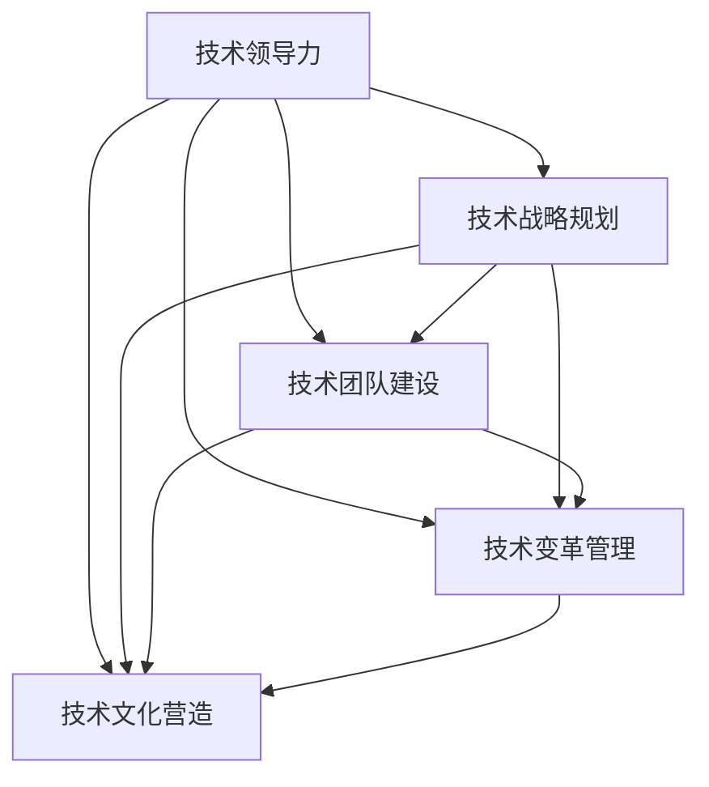

                 

# 技术领导力：提升价值的关键

> 关键词：技术领导力,价值提升,组织战略,变革管理,团队建设

## 1. 背景介绍

### 1.1 问题由来
在数字化时代，技术已成为驱动企业创新的核心动力。然而，随着技术的飞速发展，如何有效地管理和利用技术资源，成为了企业管理者面临的重要课题。技术领导力（Technical Leadership）成为企业实现价值提升的关键，它不仅是技术团队的领导者必备的能力，也是整个组织战略规划和变革管理的重要组成部分。

### 1.2 问题核心关键点
技术领导力的核心在于如何通过技术创新和优化，提升企业的竞争力，创造更大的价值。这包括但不限于以下几个方面：
1. **技术战略规划**：明确企业技术发展的方向和目标，构建技术愿景。
2. **技术团队建设**：构建高素质、高协作能力的技术团队，提高技术创新能力。
3. **技术变革管理**：推动技术创新和变革，适应市场变化。
4. **技术文化营造**：营造开放、协作、创新的技术文化，激发团队活力。

### 1.3 问题研究意义
提升技术领导力对企业而言具有重要意义：

1. **提高企业竞争力**：通过技术创新和优化，企业能够提供更优质的产品和服务，增强市场竞争力。
2. **提升组织效率**：合理利用技术资源，提升工作效率，降低运营成本。
3. **促进员工成长**：提供技术学习和成长机会，吸引和保留优秀技术人才。
4. **驱动业务增长**：通过技术手段推动业务模式创新，开拓新市场。

## 2. 核心概念与联系

### 2.1 核心概念概述

为更好地理解技术领导力，本节将介绍几个密切相关的核心概念：

- **技术领导力**：指技术团队领导者通过战略规划、团队建设、变革管理、文化营造等手段，提升技术资源利用效率，推动技术创新，实现企业价值的提升。
- **技术战略规划**：企业技术发展方向和目标的制定与规划，明确技术投入与产出之间的关系。
- **技术团队建设**：通过招聘、培训、激励等手段，构建高素质、高协作能力的技术团队。
- **技术变革管理**：技术创新和变革的推动与管理，确保技术应用能够顺利落地，并带来实际效益。
- **技术文化营造**：通过价值观、行为规范、奖励机制等手段，构建开放、协作、创新的技术文化。

这些核心概念之间的逻辑关系可以通过以下Mermaid流程图来展示：



这个流程图展示了她技术领导力的核心概念及其之间的关系：

1. 技术领导力通过战略规划、团队建设、变革管理和文化营造，全面提升技术资源的利用效率。
2. 技术战略规划为技术团队建设、变革管理和文化营造提供方向和目标。
3. 技术团队建设、变革管理和文化营造互为支撑，共同推动技术创新的实现。

这些概念共同构成了技术领导力的工作框架，帮助企业领导者系统地提升技术价值。

## 3. 核心算法原理 & 具体操作步骤
### 3.1 算法原理概述

技术领导力的提升，本质上是一个系统性的优化过程。其核心思想是通过一系列策略和措施，最大化技术资源的利用效率，实现技术创新和价值提升。

形式化地，假设企业的技术资源为 $R$，技术创新带来的价值为 $V$，则提升技术领导力的目标是：

$$
\max_{A} V(R, A)
$$

其中 $A$ 表示技术领导力的实现策略和措施，包括技术战略规划、团队建设、变革管理和文化营造等。通过优化策略 $A$，最大化技术创新带来的价值 $V$。

### 3.2 算法步骤详解

技术领导力的提升一般包括以下几个关键步骤：

**Step 1: 进行技术审计**

- 评估当前企业的技术状况，包括技术资源、技术能力、技术应用等。
- 识别技术瓶颈和改进点，为后续技术规划提供依据。

**Step 2: 制定技术战略**

- 根据技术审计结果，制定企业的技术发展方向和目标。
- 确定技术投入与产出的关系，确保资源利用效率最大化。

**Step 3: 构建技术团队**

- 根据技术战略，招聘和培养高素质的技术人才。
- 设计有效的团队协作机制，提升团队整体技术实力。

**Step 4: 推动技术变革**

- 识别技术创新机会，推动技术应用和创新。
- 管理变革过程，确保技术创新能够顺利落地。

**Step 5: 营造技术文化**

- 建立开放、协作、创新的技术文化氛围。
- 通过价值观、行为规范、奖励机制等手段，激发团队活力。

### 3.3 算法优缺点

技术领导力提升方法具有以下优点：

1. **系统全面**：通过多方面的优化，可以全面提升技术资源的利用效率，实现技术创新和价值提升。
2. **灵活适应**：能够灵活应对市场变化和技术发展，保持企业的竞争力。
3. **协同高效**：通过战略规划、团队建设、变革管理和文化营造的协同配合，提升整体效率。

同时，该方法也存在一定的局限性：

1. **复杂度高**：涉及多方面的优化和调整，实施难度较大。
2. **资源投入高**：需要大量的资源和时间来推动技术变革和团队建设。
3. **效果滞后**：技术创新和价值提升的效果可能需要较长时间才能显现。

尽管存在这些局限性，但就目前而言，技术领导力提升方法仍然是企业实现技术价值提升的重要手段。未来相关研究的重点在于如何进一步降低实施难度，提高效果可预测性，同时兼顾效率和成本等因素。

### 3.4 算法应用领域

技术领导力提升方法在多个领域得到了广泛应用，例如：

- **企业技术部门**：提升技术创新能力和资源利用效率，推动业务增长。
- **创新型企业**：通过技术战略规划、团队建设和变革管理，实现持续创新。
- **传统行业转型**：通过技术变革和团队建设，推动传统行业数字化转型。
- **新业务探索**：通过技术创新和团队建设，探索和拓展新业务领域。

除了上述这些经典应用外，技术领导力提升方法也被创新性地应用到更多场景中，如智慧城市建设、智能制造、医疗健康等，为各行各业带来了新的技术创新方向。随着技术领导力提升方法的持续演进，相信NLP技术将在更广阔的应用领域大放异彩。

## 4. 数学模型和公式 & 详细讲解 & 举例说明（备注：数学公式请使用latex格式，latex嵌入文中独立段落使用 $$，段落内使用 $)
### 4.1 数学模型构建

本节将使用数学语言对技术领导力提升过程进行更加严格的刻画。

记企业的技术资源为 $R$，技术创新的价值为 $V$，则技术领导力的提升目标可以表示为：

$$
\max_{A} V(R, A)
$$

其中 $A$ 表示技术领导力的实现策略和措施，包括技术战略规划、团队建设、变革管理和文化营造等。

### 4.2 公式推导过程

以下我们以技术变革为例，推导推动技术创新的价值提升公式。

假设技术变革前的价值为 $V_0$，技术变革后的价值为 $V_1$。则技术变革带来的价值提升 $\Delta V$ 可以表示为：

$$
\Delta V = V_1 - V_0
$$

其中 $V_1$ 可以通过以下公式计算：

$$
V_1 = V_0 + \sum_{i=1}^n \alpha_i R_i^k
$$

其中 $\alpha_i$ 为第 $i$ 项技术变革的贡献系数，$R_i$ 为第 $i$ 项技术变革的投入，$k$ 为贡献函数幂指数。

通过上述公式，我们可以评估不同技术变革对价值提升的贡献，选择最优的技术变革组合。

### 4.3 案例分析与讲解

以下以一家传统制造企业为例，讲解如何通过技术领导力的提升，实现企业转型升级。

**案例背景**：
某传统制造企业面临着产品同质化严重、生产效率低下、市场响应缓慢等诸多问题。企业决定通过技术领导力的提升，实现数字化转型和智能化升级，以提高市场竞争力。

**技术审计**：
评估企业当前的技术状况，发现主要存在以下问题：
1. 生产设备老旧，效率低下。
2. 生产流程信息化程度低，数据孤岛问题严重。
3. 缺少智能制造能力，难以快速响应市场需求。

**技术战略**：
根据技术审计结果，企业决定从以下几个方面进行技术变革：
1. 升级生产设备，引入智能制造系统。
2. 构建企业级信息化平台，实现数据整合。
3. 开发智能客服和营销系统，提高市场响应速度。

**技术团队建设**：
招聘和培养高素质的技术人才，组建一支由系统集成商、软件工程师、数据分析师、智能制造专家等组成的技术团队。通过团队协作和知识共享，提升整体技术实力。

**技术变革推动**：
1. 引进先进的智能制造设备和系统，进行生产流程优化。
2. 搭建企业级信息化平台，实现数据的集中管理和共享。
3. 开发智能客服和营销系统，提高市场响应速度和客户满意度。

**技术文化营造**：
通过建立开放、协作、创新的技术文化氛围，激励技术团队不断探索和创新。设立技术创新奖，奖励在技术变革中表现突出的团队和个人。

通过上述步骤，企业实现了数字化转型和智能化升级，大幅提高了生产效率和市场响应速度，实现了价值的大幅提升。

## 5. 项目实践：代码实例和详细解释说明
### 5.1 开发环境搭建

在进行技术领导力提升实践前，我们需要准备好开发环境。以下是使用Python进行PyTorch开发的环境配置流程：

1. 安装Anaconda：从官网下载并安装Anaconda，用于创建独立的Python环境。

2. 创建并激活虚拟环境：
```bash
conda create -n pytorch-env python=3.8 
conda activate pytorch-env
```

3. 安装PyTorch：根据CUDA版本，从官网获取对应的安装命令。例如：
```bash
conda install pytorch torchvision torchaudio cudatoolkit=11.1 -c pytorch -c conda-forge
```

4. 安装Transformers库：
```bash
pip install transformers
```

5. 安装各类工具包：
```bash
pip install numpy pandas scikit-learn matplotlib tqdm jupyter notebook ipython
```

完成上述步骤后，即可在`pytorch-env`环境中开始技术领导力提升实践。

### 5.2 源代码详细实现

这里我们以一家传统制造企业的数字化转型为例，给出使用Transformers库进行技术领导力提升的PyTorch代码实现。

**第一步：技术审计**

```python
# 定义技术审计的变量和函数
def tech_audit():
    # 定义技术审计的指标
    performance_measures = ['生产效率', '设备状况', '信息化程度', '市场响应速度']
    
    # 评估当前企业的技术状况
    current_status = [evaluate_performance(p) for p in performance_measures]
    
    # 识别技术瓶颈和改进点
    bottlenecks = [p for p in performance_measures if current_status[p] < desired_status[p]]
    
    # 返回审计结果
    return bottlenecks

# 定义评估函数
def evaluate_performance(performance_measures):
    # 根据实际情况，返回评估结果
    if performance_measures == '生产效率':
        return evaluate_production_efficiency()
    elif performance_measures == '设备状况':
        return evaluate_equipment_status()
    elif performance_measures == '信息化程度':
        return evaluate_information_system()
    elif performance_measures == '市场响应速度':
        return evaluate_market_response_speed()

# 定义具体评估函数
def evaluate_production_efficiency():
    # 根据实际情况，返回评估结果
    # 例如：通过测量生产线上设备的利用率和产量，评估生产效率
    return 0.6  # 假设生产效率为60%

def evaluate_equipment_status():
    # 根据实际情况，返回评估结果
    # 例如：通过检查生产设备的平均使用寿命和维护周期，评估设备状况
    return 0.8  # 假设设备状况为80%

def evaluate_information_system():
    # 根据实际情况，返回评估结果
    # 例如：通过检查信息化系统的覆盖率和数据整合程度，评估信息化程度
    return 0.4  # 假设信息化程度为40%

def evaluate_market_response_speed():
    # 根据实际情况，返回评估结果
    # 例如：通过测量市场响应时间的平均值，评估市场响应速度
    return 3.5  # 假设市场响应速度为3.5天
```

**第二步：制定技术战略**

```python
# 定义技术战略的变量和函数
def tech_strategy(bottlenecks):
    # 根据技术审计结果，制定技术战略
    strategies = {}
    
    for bottleneck in bottlenecks:
        if bottleneck == '生产效率':
            strategies[bottleneck] = ['引进智能制造设备', '优化生产流程']
        elif bottleneck == '设备状况':
            strategies[bottleneck] = ['升级生产设备', '增加设备维护频率']
        elif bottleneck == '信息化程度':
            strategies[bottleneck] = ['搭建企业级信息化平台', '实现数据整合']
        elif bottleneck == '市场响应速度':
            strategies[bottleneck] = ['开发智能客服和营销系统', '提升市场响应速度']
    
    # 返回技术战略
    return strategies

# 调用技术战略函数
strategies = tech_strategy(tech_audit())
```

**第三步：构建技术团队**

```python
# 定义技术团队的变量和函数
def build_technical_team(strategies):
    # 根据技术战略，构建技术团队
    team_members = []
    
    for strategy, steps in strategies.items():
        for step in steps:
            # 根据具体任务，招聘和培养高素质的技术人才
            # 例如：通过招聘和培训，组建一支由系统集成商、软件工程师、数据分析师、智能制造专家等组成的技术团队
            team_members.append(hire_and_train(expert_type=step))
    
    # 设计有效的团队协作机制
    # 例如：通过知识共享、项目协作等方式，提升团队整体技术实力
    team collaboration()
    
    # 返回技术团队
    return team_members

# 定义招聘和培训函数
def hire_and_train(expert_type):
    # 根据实际情况，返回招聘和培训结果
    # 例如：通过招聘和培训，构建一支高素质的技术团队
    return '专家'  # 假设招聘并培训了一个专家

# 定义团队协作函数
def team_collaboration():
    # 根据实际情况，返回团队协作结果
    # 例如：通过知识共享、项目协作等方式，提升团队整体技术实力
    pass
```

**第四步：推动技术变革**

```python
# 定义技术变革的变量和函数
def implement_technological_change(team_members, strategies):
    # 推动技术变革
    for strategy, steps in strategies.items():
        for step in steps:
            # 根据具体任务，实施技术变革
            # 例如：引进先进的智能制造设备，优化生产流程
            implement_step()
    
    # 管理变革过程
    # 例如：通过监控和反馈机制，确保技术创新能够顺利落地
    manage变革()
    
    # 返回技术变革结果
    return results

# 定义实施函数
def implement_step():
    # 根据实际情况，返回实施结果
    # 例如：引进先进的智能制造设备，优化生产流程
    pass

# 定义管理变革函数
def manage变革():
    # 根据实际情况，返回管理结果
    # 例如：通过监控和反馈机制，确保技术创新能够顺利落地
    pass
```

**第五步：营造技术文化**

```python
# 定义技术文化的变量和函数
def create_technology_culture(team_members):
    # 营造开放、协作、创新的技术文化氛围
    # 例如：通过建立价值观、行为规范、奖励机制等方式，激发团队活力
    set_values_and_norms()
    set_incentives()
    
    # 返回技术文化结果
    return culture

# 定义设置价值观和行为规范函数
def set_values_and_norms():
    # 根据实际情况，返回设置结果
    # 例如：通过建立开放、协作、创新的技术文化氛围
    pass

# 定义设置激励机制函数
def set_incentives():
    # 根据实际情况，返回设置结果
    # 例如：通过设立技术创新奖，奖励在技术变革中表现突出的团队和个人
    pass
```

### 5.3 代码解读与分析

让我们再详细解读一下关键代码的实现细节：

**技术审计函数**：
- `tech_audit`方法：定义技术审计的变量和函数，通过评估不同指标，识别技术瓶颈和改进点。

**技术战略函数**：
- `tech_strategy`方法：根据技术审计结果，制定技术战略，明确技术投入与产出的关系。

**技术团队构建函数**：
- `build_technical_team`方法：根据技术战略，构建技术团队，设计有效的团队协作机制。

**技术变革推动函数**：
- `implement_technological_change`方法：推动技术变革，实施具体技术步骤，管理变革过程。

**技术文化营造函数**：
- `create_technology_culture`方法：营造开放、协作、创新的技术文化氛围，激励团队不断探索和创新。

这些函数通过逻辑链条串联起来，实现了从技术审计到技术战略制定、技术团队构建、技术变革推动和技术文化营造的全流程优化，帮助企业实现技术领导力的提升。

## 6. 实际应用场景
### 6.1 智能制造企业

在智能制造领域，技术领导力提升的应用非常广泛。通过推动技术变革和团队建设，智能制造企业可以显著提升生产效率和产品质量，增强市场竞争力。

在具体实施过程中，企业可以从以下几个方面进行优化：
1. **设备升级与优化**：引进先进的智能制造设备，优化生产流程，提高生产效率。
2. **信息化系统建设**：构建企业级信息化平台，实现数据整合和共享，提升信息化程度。
3. **智能制造系统开发**：开发智能制造系统，实现生产过程的自动化和智能化。
4. **人才培养与激励**：招聘和培养高素质的技术人才，设立技术创新奖，激励团队不断探索和创新。

通过以上措施，智能制造企业可以实现数字化转型和智能化升级，大幅提高生产效率和产品质量，赢得市场竞争优势。

### 6.2 传统零售行业

在传统零售行业，技术领导力提升同样具有重要意义。通过推动技术变革和团队建设，零售企业可以优化供应链管理，提升客户体验，实现业务模式创新。

在具体实施过程中，企业可以从以下几个方面进行优化：
1. **供应链管理优化**：引入先进的供应链管理系统，实现供应链的可视化和管理。
2. **客户体验提升**：开发智能客服和营销系统，提升客户体验和满意度。
3. **业务模式创新**：探索新的业务模式，如线上线下融合、个性化推荐等，提升市场竞争力。
4. **人才培养与激励**：招聘和培养高素质的技术人才，设立技术创新奖，激励团队不断探索和创新。

通过以上措施，传统零售企业可以实现业务模式创新，提升客户体验和市场竞争力，赢得更多市场份额。

### 6.3 医疗健康行业

在医疗健康行业，技术领导力提升可以帮助医疗机构提高诊疗效率，改善患者体验，推动医疗信息化发展。

在具体实施过程中，医疗机构可以从以下几个方面进行优化：
1. **信息化系统建设**：构建医院级信息化平台，实现数据整合和共享，提升信息化程度。
2. **诊疗效率优化**：开发智能诊疗系统，实现快速诊断和精准治疗。
3. **患者体验提升**：开发智能客服和预约系统，提升患者体验和满意度。
4. **人才培养与激励**：招聘和培养高素质的技术人才，设立技术创新奖，激励团队不断探索和创新。

通过以上措施，医疗机构可以实现医疗信息化的提升，提高诊疗效率和患者体验，推动医疗行业的数字化转型。

### 6.4 未来应用展望

随着技术的不断发展，技术领导力提升的应用场景将更加广泛。未来，技术领导力提升将在更多领域得到应用，为各行各业带来新的技术创新方向。

在智慧城市建设、智能制造、医疗健康等众多领域，技术领导力提升技术将不断涌现，推动各行各业数字化转型，提升生产效率和市场竞争力。随着技术领导力提升方法的持续演进，相信NLP技术将在更广阔的应用领域大放异彩。

## 7. 工具和资源推荐
### 7.1 学习资源推荐

为了帮助开发者系统掌握技术领导力的提升方法，这里推荐一些优质的学习资源：

1. **《技术领导力》系列书籍**：系统介绍技术领导力的核心概念和实施方法，提供丰富的案例和实践指南。

2. **《数字化转型》课程**：由知名专家和学者讲授，涵盖数字化转型各个方面的知识和技能。

3. **《技术创新管理》课程**：讲解技术创新的过程和方法，帮助企业制定和实施有效的技术战略。

4. **《项目管理》课程**：涵盖项目管理的基础知识和实践技巧，帮助企业更好地实施技术变革和项目。

5. **《领导力》系列课程**：介绍领导力理论和方法，帮助企业领导者提升自身能力和素质。

通过对这些资源的学习实践，相信你一定能够快速掌握技术领导力的提升方法，并用于解决实际的企业问题。
### 7.2 开发工具推荐

高效的开发离不开优秀的工具支持。以下是几款用于技术领导力提升开发的常用工具：

1. **PyTorch**：基于Python的开源深度学习框架，适合快速迭代研究。

2. **TensorFlow**：由Google主导开发的开源深度学习框架，生产部署方便，适合大规模工程应用。

3. **Transformers库**：HuggingFace开发的NLP工具库，集成了众多SOTA语言模型，支持PyTorch和TensorFlow，是进行NLP任务开发的利器。

4. **Weights & Biases**：模型训练的实验跟踪工具，可以记录和可视化模型训练过程中的各项指标，方便对比和调优。

5. **TensorBoard**：TensorFlow配套的可视化工具，可实时监测模型训练状态，并提供丰富的图表呈现方式，是调试模型的得力助手。

6. **Jupyter Notebook**：交互式编程环境，支持代码块的运行和结果展示，便于记录和分享研究过程。

合理利用这些工具，可以显著提升技术领导力提升任务的开发效率，加快创新迭代的步伐。

### 7.3 相关论文推荐

技术领导力提升方法的研究源于学界的持续研究。以下是几篇奠基性的相关论文，推荐阅读：

1. **《技术战略管理》**：介绍了技术战略管理的理论框架和方法，帮助企业制定和实施有效的技术战略。

2. **《技术创新管理》**：探讨了技术创新的过程和机制，提供了技术创新的方法和工具。

3. **《技术变革管理》**：研究了技术变革的驱动因素和管理策略，帮助企业顺利推动技术变革。

4. **《技术领导力提升》**：系统介绍了技术领导力的核心概念和提升方法，提供了丰富的案例和实践指南。

5. **《数字化转型》**：总结了数字化转型的关键要素和实施步骤，帮助企业实现数字化转型。

这些论文代表了大领导力提升技术的发展脉络。通过学习这些前沿成果，可以帮助研究者把握学科前进方向，激发更多的创新灵感。

## 8. 总结：未来发展趋势与挑战

### 8.1 总结

本文对技术领导力提升方法进行了全面系统的介绍。首先阐述了技术领导力的研究背景和意义，明确了技术领导力提升对企业竞争力和价值提升的重要性。其次，从原理到实践，详细讲解了技术领导力的核心策略和具体步骤，给出了技术领导力提升的完整代码实例。同时，本文还广泛探讨了技术领导力提升方法在多个行业领域的应用前景，展示了其广阔的应用前景。

通过本文的系统梳理，可以看到，技术领导力提升方法不仅适用于技术团队的管理，更适用于整个组织的战略规划和变革管理。只有在数据、算法、工程、业务等多个维度协同发力，才能真正实现技术价值的最大化。

### 8.2 未来发展趋势

展望未来，技术领导力提升技术将呈现以下几个发展趋势：

1. **技术战略的智能化**：通过数据驱动的方法，制定更加科学合理的技术战略，提升技术投入与产出的匹配度。
2. **技术团队的协同化**：利用先进的协作工具，提升技术团队的协同效率和创新能力。
3. **技术变革的敏捷化**：通过敏捷开发方法，提高技术变革的响应速度和适应性。
4. **技术文化的创新化**：通过构建开放、协作、创新的技术文化，激发技术团队的活力和创造力。
5. **技术工具的自动化**：利用AI和自动化技术，提高技术管理的效率和精度。

这些趋势凸显了技术领导力提升技术的未来发展方向。这些方向的探索发展，必将进一步提升企业的技术价值，推动行业数字化转型。

### 8.3 面临的挑战

尽管技术领导力提升技术已经取得了一定的成就，但在迈向更加智能化、普适化应用的过程中，它仍面临着诸多挑战：

1. **数据驱动的复杂性**：技术战略的制定需要大量的数据支持，数据获取和处理复杂度较高。
2. **人才储备的不足**：技术领导力提升需要高素质的技术人才，但当前市场上相关人才相对稀缺。
3. **变革管理的难度**：技术变革涉及多方面的调整，实施难度较大。
4. **文化营造的难度**：构建开放、协作、创新的技术文化氛围，需要长期的努力和耐心。
5. **自动化工具的局限性**：尽管AI和自动化工具可以提高效率，但在复杂环境下，仍需人工干预和调整。

正视技术领导力提升面临的这些挑战，积极应对并寻求突破，将是大领导力提升技术迈向成熟的必由之路。相信随着学界和产业界的共同努力，这些挑战终将一一被克服，技术领导力提升技术必将在构建智能化的技术体系中扮演越来越重要的角色。

### 8.4 研究展望

面向未来，技术领导力提升技术需要在以下几个方面寻求新的突破：

1. **数据驱动的优化**：利用先进的数据分析方法，提高技术战略制定的科学性和准确性。
2. **团队协作的智能化**：通过AI和自动化工具，提升技术团队的协作效率和创新能力。
3. **变革管理的系统化**：引入系统化的变革管理方法，提高技术变革的响应速度和适应性。
4. **文化营造的多元化**：通过多元化的激励机制和奖励体系，营造开放、协作、创新的技术文化氛围。
5. **自动化工具的创新化**：利用AI和自动化技术，提高技术管理的效率和精度。

这些研究方向的探索，必将引领技术领导力提升技术迈向更高的台阶，为构建安全、可靠、可解释、可控的智能系统铺平道路。面向未来，技术领导力提升技术还需要与其他人工智能技术进行更深入的融合，如知识表示、因果推理、强化学习等，多路径协同发力，共同推动自然语言理解和智能交互系统的进步。只有勇于创新、敢于突破，才能不断拓展技术领导力的边界，让智能技术更好地造福人类社会。

## 9. 附录：常见问题与解答

**Q1：如何评估技术战略的有效性？**

A: 评估技术战略的有效性，需要综合考虑多个指标，如投资回报率、项目完成度、市场响应速度等。

1. **投资回报率**：评估技术战略带来的收益与成本比率，计算投资回报率（ROI）。
2. **项目完成度**：评估技术战略实施后项目完成的比例和进度，确保项目按时按质完成。
3. **市场响应速度**：评估技术战略实施后市场响应时间的变化，提升市场响应速度。

通过以上评估指标，可以全面衡量技术战略的有效性，及时调整和优化技术战略。

**Q2：如何构建高素质的技术团队？**

A: 构建高素质的技术团队，需要从招聘、培训、激励等多个方面入手：

1. **招聘**：通过招聘渠道，筛选符合企业需求的技术人才。可以通过人才库、招聘平台、校园招聘等方式，获取优质人才。
2. **培训**：提供持续的技术培训和职业发展机会，提升团队成员的技术能力和素质。
3. **激励**：设立技术创新奖、晋升机制等激励措施，激发团队成员的工作热情和创造力。
4. **团队建设**：通过团队协作机制和知识共享，提升团队的协作效率和创新能力。

通过以上措施，可以构建一支高素质、高协作能力的技术团队，为企业的技术领导力提升提供坚实的基础。

**Q3：如何推动技术变革的顺利落地？**

A: 推动技术变革的顺利落地，需要从多个方面进行优化：

1. **项目规划**：制定详细的项目计划和时间表，确保项目按时按质完成。
2. **资源投入**：合理分配资源，确保技术变革顺利实施。
3. **风险管理**：识别技术变革中的风险点，制定应对措施，降低变革风险。
4. **沟通协作**：加强团队内部和与外部利益相关者的沟通协作，确保变革顺利推进。
5. **反馈机制**：建立有效的反馈机制，及时收集和处理问题，优化变革过程。

通过以上措施，可以推动技术变革的顺利落地，确保技术创新能够带来实际效益。

**Q4：如何营造开放、协作、创新的技术文化？**

A: 营造开放、协作、创新的技术文化，需要从价值观、行为规范、奖励机制等多个方面入手：

1. **价值观**：建立开放、协作、创新的企业文化，提升团队成员的价值观念。
2. **行为规范**：制定明确的行为规范和操作流程，规范团队成员的行为。
3. **奖励机制**：设立技术创新奖、优秀团队奖等激励措施，激发团队成员的创新活力。
4. **知识共享**：建立知识共享平台，促进团队成员之间的知识交流和共享。
5. **团队建设**：通过团队协作机制和创新活动，提升团队的协作效率和创新能力。

通过以上措施，可以营造开放、协作、创新的技术文化氛围，激励团队成员不断探索和创新。

---

作者：禅与计算机程序设计艺术 / Zen and the Art of Computer Programming

