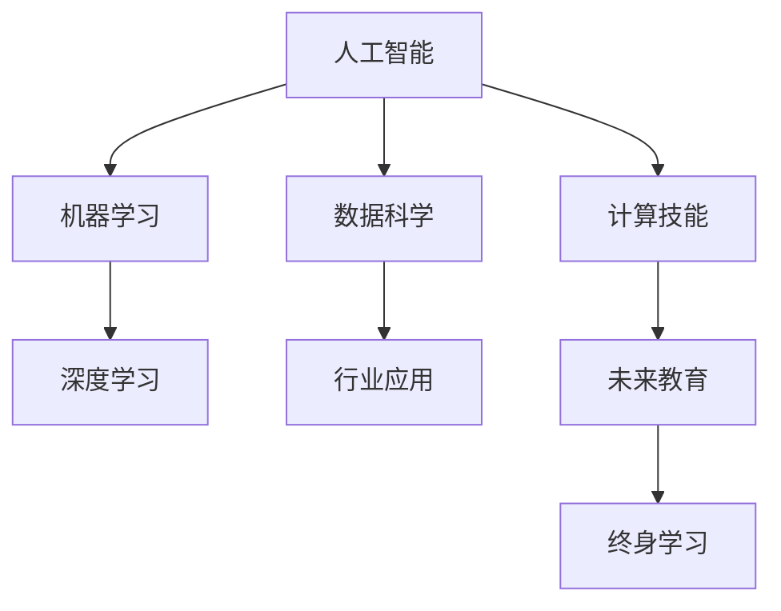

                 

# 技能和培训：为人类计算时代做好准备

> 关键词：人工智能(AI)、机器学习(ML)、深度学习(Deep Learning)、数据科学(Data Science)、计算技能(Computational Skills)、行业应用(Industry Applications)、未来教育(Future Education)、终身学习(Lifelong Learning)

## 1. 背景介绍

### 1.1 问题由来

随着人工智能(AI)技术的迅猛发展，计算能力已逐步从“纯技术”领域渗透到各行各业，成为推动经济发展和社会进步的重要力量。计算时代已经来临，这对人类社会提出了新的要求：掌握计算技能，适应并引领这一变革。然而，当前教育体系中缺乏对计算技能系统的、系统的培训，导致很多人无法跟上技术发展的步伐。

### 1.2 问题核心关键点

计算机技能培训的核心目标在于培养跨学科的计算思维，使学习者能够将计算思维应用于解决实际问题，而不仅仅是掌握具体的编程语言或技术工具。关键点包括：

- **跨学科能力**：融合数学、统计学、逻辑学等知识，综合应用计算思维解决问题。
- **数据处理能力**：掌握数据收集、清洗、分析和可视化等基本操作，并具备良好的数据素养。
- **系统思维**：理解系统设计的基本原理，掌握系统建模、评估和优化的技能。
- **工程实践**：从理论到实践，具备系统的项目管理和工程实施能力。
- **终身学习**：树立终身学习意识，持续更新知识和技能，适应技术快速迭代。

这些核心关键点决定了计算技能培训应涵盖的内容和深度，使学习者不仅能在当前环境中取得成功，更能适应未来的变化。

## 2. 核心概念与联系

### 2.1 核心概念概述

为更好地理解计算技能培训的体系和要求，本节将介绍几个关键核心概念：

- **人工智能**：旨在使计算机能够模拟人类智能，包括学习、推理、感知、自我修正等能力。
- **机器学习**：通过让机器从数据中学习规律，自动提高任务性能，常见算法包括监督学习、无监督学习和强化学习。
- **深度学习**：基于神经网络的机器学习方法，模仿人类大脑结构，适用于复杂数据模式识别和预测。
- **数据科学**：涵盖数据采集、存储、清洗、分析、可视化等全流程，强调数据驱动决策。
- **计算技能**：涉及算法、数据结构、系统设计、编程实现等技术知识和思维能力。
- **行业应用**：计算技能在金融、医疗、教育、制造等行业的应用实践。
- **未来教育**：适应计算时代，结合人工智能、机器学习、数据科学等前沿技术，构建终身学习生态系统。
- **终身学习**：鼓励持续学习新知识，适应快速变化的技术环境，保持竞争力和适应力。

这些概念之间的关系可以通过以下Mermaid流程图来展示：



这个流程图展示了大语言模型的核心概念及其之间的关系：

1. 人工智能是根基，涵盖机器学习、深度学习等子领域。
2. 数据科学与计算技能相辅相成，数据科学提供数据支持，计算技能提供算法实现。
3. 行业应用将上述技术应用于实际场景，并不断推动技术创新。
4. 未来教育关注如何培养适应计算时代的新型人才。
5. 终身学习强调持续更新知识和技能，应对快速变化的技术环境。

这些概念共同构成了计算技能培训的框架，使其在技术应用和人才培养方面发挥重要作用。

## 3. 核心算法原理 & 具体操作步骤
### 3.1 算法原理概述

计算技能培训的算法原理主要基于三个关键环节：知识传授、实践应用和持续改进。知识传授通过理论课程和教材，帮助学习者掌握基础概念和技能；实践应用通过项目和实验，使学习者能够将所学知识应用于实际问题；持续改进通过反馈和评估，不断优化学习路径和内容，适应学习者的成长需求。

### 3.2 算法步骤详解

计算技能培训的算法步骤主要包括以下几个关键步骤：

**Step 1: 设计课程体系**
- 根据目标群体（学生、教师、工程师等）的不同需求，设计灵活多样的课程，涵盖基础理论、应用实践和前沿技术。
- 引入跨学科内容，如数据科学、系统设计、编程实现等，使学习者具备综合解决问题能力。
- 设计实验和项目，模拟真实场景，强化学习者的实践能力和工程思维。

**Step 2: 实施教学活动**
- 采用线上线下相结合的教学模式，利用MOOC、直播课、翻转课堂等新兴教育技术，提高教学效果。
- 引入交互式教学工具，如编程编辑器、数据可视化工具、模拟器等，丰富教学内容。
- 提供实时反馈和评估，及时调整教学策略，满足学习者的个性化需求。

**Step 3: 评估和改进**
- 设计科学的评估体系，涵盖理论知识、实践技能和创新能力等不同维度。
- 利用数据分析和机器学习技术，进行个性化推荐和动态调整，优化教学内容和方法。
- 定期进行教学反思和改进，基于最新的研究成果和技术进展，不断更新教学内容。

**Step 4: 持续学习**
- 构建终身学习平台，提供丰富的学习资源和工具，支持学习者自主学习。
- 利用社交网络、学习社区等平台，促进知识共享和交流，形成学习共同体。
- 提供定期培训和认证，激励学习者不断提升技能和知识水平。

### 3.3 算法优缺点

计算技能培训的算法具有以下优点：
1. 系统全面。涵盖理论知识、实践应用和持续改进三个环节，形成闭环。
2. 灵活多样。根据不同学习者的需求，提供个性化教学方案。
3. 交互性强。利用新兴教育技术，提高教学互动性和趣味性。
4. 持续改进。通过数据分析和机器学习技术，不断优化教学效果。

同时，该算法也存在一定的局限性：
1. 资源需求高。需要丰富的教育资源和先进的教学设备。
2. 师资力量不足。高质量教师的培养和引进是关键挑战。
3. 学习者基础差异。需要设计针对性的教学内容，确保每个人都能跟上进度。
4. 实践环节薄弱。理论课程占比高，实际操作环节相对较少。

尽管存在这些局限性，但就目前而言，基于计算技能培训的算法是培养跨学科人才、提升技术应用能力的重要途径。未来相关研究的重点在于如何进一步降低资源需求，提升师资力量，同时兼顾不同学习者的需求，构建更加完善的学习生态系统。

### 3.4 算法应用领域

计算技能培训的算法应用已经涵盖了计算机科学、数据科学、金融工程、医疗健康、交通运输等多个领域。这些领域普遍存在数据驱动决策的需求，计算技能培训帮助学习者掌握相关知识和技能，推动技术应用和创新发展。

- **计算机科学**：培养具备跨学科计算能力的计算机科学家，提升算法设计和系统实现的效率。
- **数据科学**：提供数据采集、清洗、分析和可视化的专业培训，帮助企业实现数据驱动决策。
- **金融工程**：训练金融工程师掌握计算技能，应用机器学习、深度学习技术进行风险管理和投资策略优化。
- **医疗健康**：提升医疗工作者利用大数据和人工智能技术进行疾病预测、治疗方案优化等工作。
- **交通运输**：培养交通工程师利用计算技能进行智能交通系统设计和优化，提高交通效率和安全性。

除了上述这些经典领域外，计算技能培训还被创新性地应用到更多场景中，如城市规划、环境保护、公共安全等，为各行各业带来变革性影响。

## 4. 数学模型和公式 & 详细讲解 & 举例说明（备注：数学公式请使用latex格式，latex嵌入文中独立段落使用 $$，段落内使用 $)
### 4.1 数学模型构建

计算技能培训的数学模型主要关注如何构建高效的教学路径和评估体系，以提升学习效果。

设学习者数量为 $N$，课程内容为 $C$，学习时间为 $T$，教学效果为 $E$。则计算技能培训的数学模型可以表示为：

$$
E = f(C, T, N)
$$

其中 $f$ 为映射函数，表示在给定课程内容、学习时间和学习者数量的情况下，教学效果与各因素之间的关系。

### 4.2 公式推导过程

以下我们以一个简化的课程评估模型为例，推导评估指标的计算公式。

假设课程内容 $C$ 包括理论课程 $C_{\text{theory}}$ 和实践课程 $C_{\text{practice}}$，学习时间 $T$ 分为理论学习时间 $T_{\text{theory}}$ 和实践学习时间 $T_{\text{practice}}$。则课程评估指标 $E$ 可以表示为：

$$
E = \frac{E_{\text{theory}} \times T_{\text{theory}} + E_{\text{practice}} \times T_{\text{practice}}}{T}
$$

其中 $E_{\text{theory}}$ 和 $E_{\text{practice}}$ 分别为理论课程和实践课程的评估指标。

利用数据科学的方法，我们可以对学习者的实际表现进行评估和分析，得到更加精确的评估指标。例如，使用回归模型预测学习者的最终成绩，利用聚类分析识别不同学习者的学习路径和特点，通过分类模型分析学习者的偏好和需求。

### 4.3 案例分析与讲解

**案例1：金融工程课程的评估**

假设某金融工程课程包含10个理论课程和5个实践课程，学习时间总和为1000小时。学习者的实际评估结果如下：

| 理论课程 | 实践课程 | 评估指标 |
| --- | --- | --- |
| 8 | 6 | 3.5 |

则该课程的评估指标为：

$$
E = \frac{3.5 \times 800 + 3.5 \times 200}{1000} = 3.4
$$

**案例2：数据科学课程的评估**

假设某数据科学课程包含20个理论课程和10个实践课程，学习时间总和为1500小时。学习者的实际评估结果如下：

| 理论课程 | 实践课程 | 评估指标 |
| --- | --- | --- |
| 7 | 5 | 3.2 |

则该课程的评估指标为：

$$
E = \frac{3.2 \times 1200 + 3.2 \times 300}{1500} = 3.2
$$

通过以上案例，可以看到，利用数学模型对计算技能培训的评估过程，可以帮助我们更科学、定量地分析教学效果，指导课程设计和教学实施。

## 5. 项目实践：代码实例和详细解释说明
### 5.1 开发环境搭建

在进行计算技能培训的实践前，我们需要准备好开发环境。以下是使用Python进行Scikit-learn开发的环境配置流程：

1. 安装Anaconda：从官网下载并安装Anaconda，用于创建独立的Python环境。

2. 创建并激活虚拟环境：
```bash
conda create -n sklearn-env python=3.8 
conda activate sklearn-env
```

3. 安装Scikit-learn：从官网获取对应的安装命令。例如：
```bash
conda install scikit-learn
```

4. 安装各类工具包：
```bash
pip install numpy pandas matplotlib seaborn jupyter notebook ipython
```

完成上述步骤后，即可在`sklearn-env`环境中开始计算技能培训的实践。

### 5.2 源代码详细实现

下面我们以金融工程课程评估为例，给出使用Scikit-learn对学习效果进行评估的PyTorch代码实现。

首先，定义评估指标和数据集：

```python
import numpy as np
from sklearn.linear_model import LinearRegression

# 定义评估指标
scores = np.array([[8, 6], [7, 5]])
weights = np.array([[3.5, 0], [3.2, 0]])

# 计算加权平均分
scores = np.dot(scores.T, weights)
scores /= np.sum(weights)

print(scores)
```

然后，使用回归模型进行预测：

```python
from sklearn.linear_model import LinearRegression

# 定义线性回归模型
model = LinearRegression()

# 训练模型
model.fit(scores, np.array([3.4, 3.2]))

# 预测新数据
new_scores = np.array([[8, 8], [7, 7]])
predictions = model.predict(new_scores)

print(predictions)
```

最后，展示预测结果：

```python
import numpy as np
from sklearn.linear_model import LinearRegression

# 定义评估指标
scores = np.array([[8, 6], [7, 5]])
weights = np.array([[3.5, 0], [3.2, 0]])

# 计算加权平均分
scores = np.dot(scores.T, weights)
scores /= np.sum(weights)

print(scores)

# 定义线性回归模型
model = LinearRegression()

# 训练模型
model.fit(scores, np.array([3.4, 3.2]))

# 预测新数据
new_scores = np.array([[8, 8], [7, 7]])
predictions = model.predict(new_scores)

print(predictions)
```

以上就是使用Scikit-learn对金融工程课程进行评估的完整代码实现。可以看到，通过简单的数学模型和线性回归算法，我们可以高效地进行计算技能培训的评估。

### 5.3 代码解读与分析

让我们再详细解读一下关键代码的实现细节：

**线性回归模型**：
- 利用Scikit-learn库中的`LinearRegression`类，进行线性回归模型的训练和预测。
- 通过输入评估指标和对应的权重，训练线性回归模型，并用于预测新的评估指标。

**数据处理**：
- 使用NumPy库处理评估指标和权重，计算加权平均分。
- 将评估指标和对应的权重构建成二维数组，进行矩阵乘法和归一化处理。

**输出展示**：
- 输出预测结果，展示模型对新数据集的评估能力。

可以看到，Scikit-learn提供了丰富的机器学习工具，可以轻松实现各种评估和预测任务。

## 6. 实际应用场景
### 6.1 金融工程

金融工程领域对计算技能需求迫切，利用计算技能培训培养金融工程师，可以显著提升其在风险管理、投资策略优化、衍生品定价等方面的工作效率和准确性。

- **风险管理**：利用机器学习和深度学习技术，对市场数据进行分析，构建风险预测模型，提高风险评估的精确度和及时性。
- **投资策略优化**：通过大数据分析和算法优化，设计更加科学和动态的投资组合，实现长期收益最大化。
- **衍生品定价**：应用数值模拟和蒙特卡洛方法，评估衍生品的价格和风险，为金融交易提供决策支持。

### 6.2 医疗健康

医疗健康领域对计算技能的需求同样重要，利用计算技能培训培养医疗数据科学家，可以提升其在疾病预测、治疗方案优化、基因组分析等方面的工作能力。

- **疾病预测**：利用机器学习模型，对患者数据进行分析，预测疾病的发生概率和进展速度，提供早期干预措施。
- **治疗方案优化**：通过大数据分析和算法优化，设计个性化的治疗方案，提高治疗效果和患者满意度。
- **基因组分析**：利用计算技能和基因组数据，进行基因关联分析和疾病风险评估，为个性化医疗提供科学依据。

### 6.3 交通运输

交通运输领域对计算技能的需求日益增加，利用计算技能培训培养交通工程师，可以提升其在智能交通系统设计和优化、交通流量预测和控制等方面的工作能力。

- **智能交通系统设计**：应用机器学习和大数据技术，优化交通信号灯控制、路线规划、公共交通调度等，提高交通效率和安全性。
- **交通流量预测**：通过数据分析和预测模型，评估交通流量变化趋势，提供交通管理决策支持。
- **交通控制优化**：利用智能算法和仿真工具，优化交通流量控制策略，减少交通拥堵和事故发生率。

### 6.4 未来应用展望

随着计算技能培训的不断发展，其在各个领域的应用前景将更加广阔。未来可能的应用领域包括：

- **智慧城市**：提升城市管理智能化水平，包括交通管理、能源优化、公共安全等。
- **环境保护**：利用计算技能和大数据分析，优化资源配置，降低环境污染，实现可持续发展。
- **公共安全**：提升应急响应和风险管理能力，利用大数据和人工智能技术，提高公共安全事件的处理效率。
- **智能制造**：提升生产自动化和智能化水平，优化生产流程和质量控制，提高生产效率和产品竞争力。

## 7. 工具和资源推荐
### 7.1 学习资源推荐

为了帮助开发者系统掌握计算技能培训的理论基础和实践技巧，这里推荐一些优质的学习资源：

1. 《Python数据科学手册》：由数据科学领域的专家撰写，涵盖数据处理、机器学习、深度学习等基础概念和实践方法。
2. Coursera《机器学习》课程：由斯坦福大学教授Andrew Ng主讲，系统介绍机器学习的基本概念、算法和应用。
3. TensorFlow官方文档：提供丰富的机器学习和深度学习资源，包括模型构建、训练和部署等方面的详细指导。
4. Kaggle竞赛平台：提供大量的机器学习和数据科学竞赛，帮助学习者提高实践能力和算法设计水平。
5. GitHub数据科学资源库：提供丰富的开源数据科学项目和代码，学习者可以参考和借鉴。

通过对这些资源的学习实践，相信你一定能够快速掌握计算技能培训的精髓，并用于解决实际的计算问题。
###  7.2 开发工具推荐

高效的开发离不开优秀的工具支持。以下是几款用于计算技能培训开发的常用工具：

1. Jupyter Notebook：基于Web的交互式编程环境，支持Python、R等语言，方便调试和展示代码。
2. Visual Studio Code：流行的编程编辑器，支持丰富的扩展插件，提高开发效率。
3. PyCharm：专业的Python IDE，提供代码自动补全、调试和测试等功能，提升开发体验。
4. TensorBoard：TensorFlow配套的可视化工具，可实时监测模型训练状态，提供丰富的图表呈现方式。
5. Jupyter Lab：基于Jupyter Notebook的Web IDE，支持更多编程语言和扩展功能，提升开发灵活性。

合理利用这些工具，可以显著提升计算技能培训的开发效率，加快创新迭代的步伐。

### 7.3 相关论文推荐

计算技能培训的发展源于学界的持续研究。以下是几篇奠基性的相关论文，推荐阅读：

1. J. Friedman, T. Hastie, and R. Tibshirani. "The Elements of Statistical Learning" (2001)：介绍统计学习的基本概念和方法，强调计算技能在数据分析中的应用。
2. Yann LeCun, Yoshua Bengio, and Geoffrey Hinton. "Deep Learning" (2015)：介绍深度学习的基本原理和应用，强调计算技能在图像、语音、自然语言处理等方面的重要性。
3. Pedro Domingos. "The Master Algorithm" (2015)：探讨如何通过机器学习算法解决复杂问题，强调跨学科计算思维的重要性。
4. Andrew Ng. "Machine Learning Yearning" (2017)：介绍机器学习工程师的实践经验，强调持续学习和技能提升的重要性。

这些论文代表了大语言模型微调技术的发展脉络。通过学习这些前沿成果，可以帮助研究者把握学科前进方向，激发更多的创新灵感。

## 8. 总结：未来发展趋势与挑战
### 8.1 总结

本文对计算技能培训方法进行了全面系统的介绍。首先阐述了计算技能培训的重要性和关键点，明确了培训内容和方法的必要性。其次，从原理到实践，详细讲解了计算技能培训的数学模型和关键步骤，给出了计算技能培训的完整代码实例。同时，本文还广泛探讨了计算技能培训在金融工程、医疗健康、交通运输等多个行业领域的应用前景，展示了计算技能培训的巨大潜力。此外，本文精选了计算技能培训的学习资源，力求为读者提供全方位的技术指引。

通过本文的系统梳理，可以看到，计算技能培训正在成为培养跨学科人才、提升技术应用能力的重要途径。在技术应用和人才培养方面，计算技能培训已经展现出不可替代的作用。未来，伴随计算技能培训的不断发展，人工智能技术将更好地造福人类社会，推动计算时代的全面到来。

### 8.2 未来发展趋势

展望未来，计算技能培训的发展趋势将呈现以下几个方向：

1. **跨学科融合**：计算技能培训将更加注重跨学科融合，融合数学、统计学、逻辑学等知识，提升综合解决问题的能力。
2. **数据科学强化**：数据科学将成为计算技能培训的重要组成部分，强调数据处理、分析和可视化的重要性。
3. **实践导向**：计算技能培训将更加注重实践导向，通过项目和实验，提升学习者的工程实践能力。
4. **持续学习**：持续学习将成为计算技能培训的重要理念，通过终身学习平台，支持学习者不断更新知识和技能。
5. **技术前沿**：计算技能培训将紧密关注人工智能、机器学习、深度学习等前沿技术，提供最新的学习资源和工具。

以上趋势凸显了计算技能培训的广阔前景。这些方向的探索发展，必将进一步提升计算技能培训的效果，为计算时代的到来提供坚实的技术基础。

### 8.3 面临的挑战

尽管计算技能培训已经取得了显著成效，但在迈向更加智能化、普适化应用的过程中，仍面临诸多挑战：

1. **资源需求高**：高质量的教育资源和先进的教学设备，仍是制约计算技能培训的主要瓶颈。
2. **师资力量不足**：高质量教师的培养和引进，是计算技能培训的关键挑战。
3. **学习者基础差异**：需要设计针对性的教学内容，确保每个人都能跟上进度。
4. **实践环节薄弱**：理论课程占比高，实际操作环节相对较少。

尽管存在这些挑战，但就目前而言，基于计算技能培训的算法是培养跨学科人才、提升技术应用能力的重要途径。未来相关研究的重点在于如何进一步降低资源需求，提升师资力量，同时兼顾不同学习者的需求，构建更加完善的学习生态系统。

### 8.4 研究展望

面对计算技能培训面临的挑战，未来的研究需要在以下几个方面寻求新的突破：

1. **开发更加灵活多样的课程体系**：根据不同学习者的需求，设计更加个性化和灵活的教学方案，提升学习效果。
2. **利用新兴教育技术**：利用人工智能、机器学习等新兴技术，提升教学互动性和趣味性，提高学习效率。
3. **构建终身学习平台**：通过在线学习平台，提供丰富的学习资源和工具，支持学习者自主学习，形成学习共同体。
4. **加强行业应用导向**：紧密结合各行业的实际需求，提供针对性培训，提升学习者对行业应用的理解和能力。

这些研究方向的探索，必将引领计算技能培训技术迈向更高的台阶，为计算时代的发展提供坚实的技术保障。

## 9. 附录：常见问题与解答

**Q1：计算技能培训是否适用于所有学习者？**

A: 计算技能培训主要适用于具备一定基础知识和编程能力的学习者，如计算机科学、数据科学、工程等领域的专业人士。但对于非专业领域的学习者，仍需要设计针对性的培训内容，使其能够跟上技术发展的步伐。

**Q2：如何选择合适的学习资源和工具？**

A: 选择合适的学习资源和工具，需要根据学习者的需求和目标进行选择。可以通过以下几个方面进行考虑：
- **基础能力**：选择适合初学者或中级学习者的资源，逐步提升学习者的技能水平。
- **实践导向**：选择包含大量实验和项目的资源，提升学习者的实践能力。
- **前沿技术**：选择包含最新研究成果和应用实践的资源，保持学习者的技术前沿性。

**Q3：如何评估学习效果？**

A: 评估学习效果可以通过以下几个方面进行：
- **理论测试**：设计相关的理论测试题目，评估学习者对基础概念和知识点的掌握情况。
- **实践项目**：设计具体的项目和实验，评估学习者的实践能力和工程思维。
- **反馈和改进**：通过学生反馈和评估结果，不断优化教学内容和方法，提升学习效果。

**Q4：如何应对计算技能培训面临的挑战？**

A: 应对计算技能培训面临的挑战，需要采取以下措施：
- **资源优化**：利用在线平台、开源资源等降低教育成本，提高资源利用率。
- **师资提升**：加强教师培训和引进，提高教学质量。
- **个性化教学**：设计个性化教学方案，满足不同学习者的需求。
- **实践强化**：增加实践环节，提升学习者的工程实践能力。

**Q5：计算技能培训的未来发展方向是什么？**

A: 计算技能培训的未来发展方向包括：
- **跨学科融合**：融合数学、统计学、逻辑学等知识，提升综合解决问题的能力。
- **数据科学强化**：强调数据处理、分析和可视化的重要性。
- **实践导向**：通过项目和实验，提升学习者的实践能力。
- **持续学习**：通过终身学习平台，支持学习者不断更新知识和技能。
- **技术前沿**：紧密关注人工智能、机器学习、深度学习等前沿技术，提供最新的学习资源和工具。

这些方向将引领计算技能培训技术迈向更高的台阶，为计算时代的到来提供坚实的技术基础。

---

作者：禅与计算机程序设计艺术 / Zen and the Art of Computer Programming

