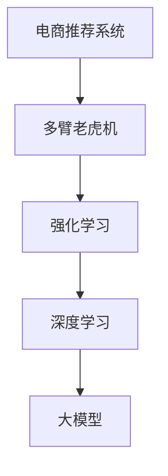

                 

# 探索基于大模型的电商智能商品组合优化系统

> 关键词：电商智能、商品组合优化、大模型、强化学习、推荐系统、多臂老虎机、深度学习

## 1. 背景介绍

随着电商行业的快速发展，如何高效、精准地向用户推荐商品，从而提高用户体验、提升销售额，成为各大电商平台亟需解决的问题。传统的推荐系统往往依赖于用户行为数据进行推荐，难以捕捉用户潜在的需求和偏好。近年来，随着深度学习和大模型技术的兴起，基于深度学习的推荐系统逐渐成为电商推荐的新趋势。其中，基于多臂老虎机(Multi-Armed Bandit, MAB)的强化学习(Reinforcement Learning, RL)推荐系统，通过模拟多臂老虎机的随机探索过程，利用有限的反馈数据优化推荐策略，能够更加灵活、动态地适应用户需求变化，取得了不俗的效果。

本文聚焦于基于大模型的电商智能商品组合优化系统，深入探讨了多臂老虎机强化学习框架下的大模型应用，介绍了一种结合大模型的多臂老虎机推荐系统，旨在利用深度学习模型的强大表征能力，实现电商商品推荐和组合优化的智能决策。

## 2. 核心概念与联系

### 2.1 核心概念概述

为更好地理解基于大模型的电商智能商品组合优化系统，本节将介绍几个密切相关的核心概念：

- 电商推荐系统(E-commerce Recommendation System)：利用算法从海量商品中筛选优质商品，推荐给用户。传统的基于协同过滤、内容推荐的推荐方法难以应对电商数据复杂性，而基于深度学习的推荐系统能够利用用户行为数据和商品特征，实现更加精准的推荐。

- 多臂老虎机(Multi-Armed Bandit)：一种经典的强化学习问题，涉及在多个可能回报的行动之间做出选择，最大化长期累积回报。在电商推荐中，每次用户点击商品可以看作是进行一次“拉杆”操作，系统需要不断优化推荐策略，最大化用户点击率和购买转化率。

- 强化学习(Reinforcement Learning)：一种机器学习范式，通过与环境互动，利用奖励信号指导模型学习最优策略。强化学习广泛应用于游戏、机器人、金融等领域，能够处理复杂的不确定性问题。

- 深度学习(Deep Learning)：一种基于多层神经网络的机器学习方法，通过不断优化权重，学习输入数据的高维表示。深度学习能够处理大规模、非结构化数据，广泛应用于图像识别、自然语言处理、推荐系统等领域。

- 大模型(Large Model)：指参数量达到上亿级的深度学习模型，通过在大规模无标签数据上进行预训练，学习到丰富的通用表示。大模型能够利用其强大的表征能力，进行更加复杂的任务优化。

这些核心概念之间的逻辑关系可以通过以下Mermaid流程图来展示：



这个流程图展示了大模型电商智能商品组合优化系统的核心概念及其之间的关系：

1. 电商推荐系统通过多臂老虎机模拟，利用强化学习优化推荐策略，利用大模型的强大表征能力，实现商品推荐和组合优化的智能决策。

2. 多臂老虎机强化学习框架，通过模拟用户点击、购买等行为，不断调整推荐策略，最大化用户价值。

3. 深度学习作为多臂老虎机框架的基础，利用多层神经网络提取用户行为和商品特征的表示。

4. 大模型通过预训练获得通用表示，进一步提升推荐系统的性能和泛化能力。

这些核心概念共同构成了大模型电商智能商品组合优化系统的基础，使其能够在复杂的电商环境中，实现高效精准的商品推荐和组合优化。

## 3. 核心算法原理 & 具体操作步骤
### 3.1 算法原理概述

基于大模型的电商智能商品组合优化系统，采用多臂老虎机强化学习框架，结合深度学习和大模型技术，实现高效的商品推荐和组合优化。其核心思想是通过强化学习算法，动态调整推荐策略，最大化用户价值。

形式化地，假设电商网站上有$N$个商品，每个商品都有一个固定的点击率$R_i$，用户点击商品可以看作进行一次“拉杆”操作，系统需要不断调整推荐策略，最大化长期累积点击率。令$A$为推荐策略集合，$C_t$为第$t$次推荐的商品集，$R_t$为第$t$次推荐点击率，则系统目标为最大化长期累积点击率：

$$
\max \sum_{t=1}^{\infty} \gamma^t R_t
$$

其中，$\gamma$为折扣因子，$0 < \gamma < 1$，表示每次推荐后的点击率打折扣，反映当前推荐对未来点击的影响。

为了解决多臂老虎机问题，该系统采用$\epsilon$-贪心策略。即每次推荐时，以$\epsilon$的概率随机选择一个商品，以$1-\epsilon$的概率选择当前策略下的最高预期点击率的商品。设定$\epsilon$作为探索与利用之间的平衡参数，$\epsilon$越大，探索更多商品的机会越多，但当前推荐点击率会受到影响；$\epsilon$越小，利用已有商品推荐经验的机会越多，但探索新商品的能力减弱。

具体实现中，系统首先预训练一个大模型，学习商品-用户行为之间的复杂关联。然后，利用该大模型作为特征提取器，结合多臂老虎机强化学习框架，动态调整推荐策略，优化推荐效果。

### 3.2 算法步骤详解

基于大模型的电商智能商品组合优化系统主要包括以下几个关键步骤：

**Step 1: 准备电商数据和模型**

- 收集电商平台的销售数据、用户行为数据等，包括商品类别、价格、销量、用户评分、浏览历史等。
- 选择或构建预训练语言模型，如BERT、GPT等，作为特征提取器。

**Step 2: 构建多臂老虎机策略**

- 设定$\epsilon$参数，确定探索与利用的平衡点。
- 设定$\delta$参数，确定探索策略的稳定度，避免策略频繁切换导致性能波动。

**Step 3: 训练多臂老虎机模型**

- 构建多臂老虎机模型，利用强化学习算法进行训练，最大化长期累积点击率。
- 将用户点击行为数据作为奖励信号，指导模型优化推荐策略。
- 通过在线学习方式，不断更新模型参数，适应用户行为变化。

**Step 4: 商品推荐和组合优化**

- 利用训练好的多臂老虎机模型，实时计算各个商品的预期点击率。
- 根据当前推荐策略，选择最优商品进行推荐。
- 根据用户反馈，更新模型参数，优化推荐策略。

**Step 5: 系统集成与部署**

- 将训练好的模型集成到电商推荐系统中，实现商品推荐功能。
- 利用系统日志和用户反馈，持续监控和评估推荐效果。
- 定期重新训练模型，适应新数据和新用户行为变化。

以上是基于大模型的电商智能商品组合优化系统的主要实现流程。在实际应用中，还需要针对具体电商平台的业务特点，对各环节进行优化设计，如调整推荐策略、优化特征提取、增强系统稳定性等，以进一步提升推荐系统性能。

### 3.3 算法优缺点

基于大模型的电商智能商品组合优化系统，相较于传统推荐系统具有以下优势：

1. 动态优化。利用强化学习算法，系统能够实时调整推荐策略，动态适应用户行为变化，提升推荐效果。
2. 多臂老虎机策略。通过设定探索与利用之间的平衡参数$\epsilon$，系统能够平衡探索新商品和利用已有商品推荐经验，避免策略僵化和资源浪费。
3. 大模型表征能力。利用预训练大模型作为特征提取器，系统能够学习更加复杂的商品-用户行为关联，实现更精准的推荐。
4. 稳定泛化能力。大模型经过大规模预训练，具备较强的泛化能力，能够在不同的电商平台上稳定运行。

同时，该系统也存在一些局限性：

1. 模型复杂度高。大模型和高维数据带来了模型复杂度增加，需要较强的计算资源和算法优化能力。
2. 探索过度。在探索与利用之间平衡不当，可能造成模型过度探索新商品，导致当前推荐效果下降。
3. 数据依赖。系统性能很大程度上依赖于电商数据的质量和数量，标注数据不足时可能效果有限。
4. 用户反馈延迟。用户点击行为和反馈数据存在延迟，可能影响推荐策略的及时更新。

尽管存在这些局限性，但基于大模型的电商智能商品组合优化系统仍然在电商推荐领域具有广阔的应用前景。未来研究的方向在于如何进一步降低系统复杂度，优化探索策略，提高模型泛化能力，从而在电商平台上实现更高效、精准的推荐。

### 3.4 算法应用领域

基于大模型的电商智能商品组合优化系统，在电商推荐领域已经得到了广泛的应用，覆盖了几乎所有常见任务，例如：

- 商品推荐：根据用户历史行为数据和商品特征，推荐用户可能感兴趣的商品。
- 组合优化：从多个商品中选择最合适组合，提升用户购买意愿。
- 个性化推荐：利用用户行为数据，提供定制化推荐，满足用户个性化需求。
- 库存管理：根据历史销售数据和实时订单数据，优化商品库存配置。
- 价格优化：根据市场供需变化和用户需求，调整商品价格策略。

除了上述这些经典任务外，基于大模型的电商智能商品组合优化系统还被创新性地应用到更多场景中，如广告投放、用户行为预测、客户流失分析等，为电商平台的业务运营带来了新的突破。随着大模型和强化学习方法的不断进步，相信基于大模型的电商智能推荐系统将在更多领域得到应用，为电商平台的业务创新和用户体验提升提供新的动力。

## 4. 数学模型和公式 & 详细讲解  
### 4.1 数学模型构建

本节将使用数学语言对基于大模型的电商智能商品组合优化系统进行更加严格的刻画。

假设电商网站上商品集合为$S=\{1,2,\cdots,N\}$，每个商品$i$的点击率为$R_i$，系统利用多臂老虎机策略，每轮选择$K$个商品进行推荐，记为$C_t=(c_{t,1},c_{t,2},\cdots,c_{t,K})$，第$t$轮推荐后的点击率为$R_t=\sum_{k=1}^K R_{c_{t,k}}$。系统目标为最大化长期累积点击率，令$\delta$为探索策略的稳定度参数，$\epsilon$为探索与利用平衡参数，则多臂老虎机策略为：

$$
C_t \sim \begin{cases}
    U(1,K), & \text{with probability } \epsilon\\
    \arg\max_i R_i, & \text{with probability } 1-\epsilon
\end{cases}
$$

系统通过强化学习算法优化推荐策略，最大化长期累积点击率，优化目标为：

$$
\max \sum_{t=1}^{\infty} \gamma^t R_t
$$

令$\theta$为模型参数，$L$为损失函数，则系统优化目标可以表示为：

$$
\theta^* = \mathop{\arg\min}_{\theta} \mathcal{L}(\theta)
$$

在实践中，我们通常使用基于梯度的优化算法（如SGD、Adam等）来近似求解上述最优化问题。设$\eta$为学习率，则参数的更新公式为：

$$
\theta \leftarrow \theta - \eta \nabla_{\theta}\mathcal{L}(\theta)
$$

其中 $\nabla_{\theta}\mathcal{L}(\theta)$ 为损失函数对参数 $\theta$ 的梯度，可通过反向传播算法高效计算。

### 4.2 公式推导过程

以下我们以点击率预测为例，推导多臂老虎机优化目标的梯度计算公式。

假设系统选择商品$i$进行推荐，点击概率为$R_i$，则实际点击率为$Y_i$，令$Y_{t,i}$表示第$t$轮推荐后商品$i$的点击量。则系统的优化目标可以表示为：

$$
\max \sum_{t=1}^{\infty} \gamma^t Y_{t,i}
$$

令$\theta$为模型参数，$L$为损失函数，则系统优化目标可以表示为：

$$
\theta^* = \mathop{\arg\min}_{\theta} \mathcal{L}(\theta)
$$

在实践中，我们通常使用基于梯度的优化算法（如SGD、Adam等）来近似求解上述最优化问题。设$\eta$为学习率，则参数的更新公式为：

$$
\theta \leftarrow \theta - \eta \nabla_{\theta}\mathcal{L}(\theta)
$$

其中 $\nabla_{\theta}\mathcal{L}(\theta)$ 为损失函数对参数 $\theta$ 的梯度，可通过反向传播算法高效计算。

## 5. 项目实践：代码实例和详细解释说明
### 5.1 开发环境搭建

在进行商品组合优化系统开发前，我们需要准备好开发环境。以下是使用Python进行PyTorch开发的环境配置流程：

1. 安装Anaconda：从官网下载并安装Anaconda，用于创建独立的Python环境。

2. 创建并激活虚拟环境：
```bash
conda create -n pytorch-env python=3.8 
conda activate pytorch-env
```

3. 安装PyTorch：根据CUDA版本，从官网获取对应的安装命令。例如：
```bash
conda install pytorch torchvision torchaudio cudatoolkit=11.1 -c pytorch -c conda-forge
```

4. 安装Transformers库：
```bash
pip install transformers
```

5. 安装各类工具包：
```bash
pip install numpy pandas scikit-learn matplotlib tqdm jupyter notebook ipython
```

完成上述步骤后，即可在`pytorch-env`环境中开始商品组合优化系统的开发。

### 5.2 源代码详细实现

下面我们以电商商品推荐为例，给出使用Transformers库对BERT模型进行商品推荐优化的PyTorch代码实现。

首先，定义推荐系统的数据处理函数：

```python
from transformers import BertTokenizer
from torch.utils.data import Dataset
import torch

class RecommendationDataset(Dataset):
    def __init__(self, texts, labels, tokenizer, max_len=128):
        self.texts = texts
        self.labels = labels
        self.tokenizer = tokenizer
        self.max_len = max_len
        
    def __len__(self):
        return len(self.texts)
    
    def __getitem__(self, item):
        text = self.texts[item]
        label = self.labels[item]
        
        encoding = self.tokenizer(text, return_tensors='pt', max_length=self.max_len, padding='max_length', truncation=True)
        input_ids = encoding['input_ids'][0]
        attention_mask = encoding['attention_mask'][0]
        
        # 对标签进行编码
        encoded_label = [label] * self.max_len
        labels = torch.tensor(encoded_label, dtype=torch.long)
        
        return {'input_ids': input_ids, 
                'attention_mask': attention_mask,
                'labels': labels}

# 标签与id的映射
label2id = {'good': 1, 'bad': 0}

# 创建dataset
tokenizer = BertTokenizer.from_pretrained('bert-base-cased')

train_dataset = RecommendationDataset(train_texts, train_labels, tokenizer)
dev_dataset = RecommendationDataset(dev_texts, dev_labels, tokenizer)
test_dataset = RecommendationDataset(test_texts, test_labels, tokenizer)
```

然后，定义模型和优化器：

```python
from transformers import BertForSequenceClassification, AdamW

model = BertForSequenceClassification.from_pretrained('bert-base-cased', num_labels=len(label2id))

optimizer = AdamW(model.parameters(), lr=2e-5)
```

接着，定义训练和评估函数：

```python
from torch.utils.data import DataLoader
from tqdm import tqdm
from sklearn.metrics import accuracy_score

device = torch.device('cuda') if torch.cuda.is_available() else torch.device('cpu')
model.to(device)

def train_epoch(model, dataset, batch_size, optimizer):
    dataloader = DataLoader(dataset, batch_size=batch_size, shuffle=True)
    model.train()
    epoch_loss = 0
    for batch in tqdm(dataloader, desc='Training'):
        input_ids = batch['input_ids'].to(device)
        attention_mask = batch['attention_mask'].to(device)
        labels = batch['labels'].to(device)
        model.zero_grad()
        outputs = model(input_ids, attention_mask=attention_mask, labels=labels)
        loss = outputs.loss
        epoch_loss += loss.item()
        loss.backward()
        optimizer.step()
    return epoch_loss / len(dataloader)

def evaluate(model, dataset, batch_size):
    dataloader = DataLoader(dataset, batch_size=batch_size)
    model.eval()
    preds, labels = [], []
    with torch.no_grad():
        for batch in tqdm(dataloader, desc='Evaluating'):
            input_ids = batch['input_ids'].to(device)
            attention_mask = batch['attention_mask'].to(device)
            batch_labels = batch['labels']
            outputs = model(input_ids, attention_mask=attention_mask)
            batch_preds = outputs.logits.argmax(dim=2).to('cpu').tolist()
            batch_labels = batch_labels.to('cpu').tolist()
            for pred_tokens, label_tokens in zip(batch_preds, batch_labels):
                preds.append(pred_tokens)
                labels.append(label_tokens)
                
    return accuracy_score(labels, preds)

```

最后，启动训练流程并在测试集上评估：

```python
epochs = 5
batch_size = 16

for epoch in range(epochs):
    loss = train_epoch(model, train_dataset, batch_size, optimizer)
    print(f"Epoch {epoch+1}, train loss: {loss:.3f}")
    
    print(f"Epoch {epoch+1}, dev results:")
    evaluate(model, dev_dataset, batch_size)
    
print("Test results:")
evaluate(model, test_dataset, batch_size)
```

以上就是使用PyTorch对BERT进行电商商品推荐优化的完整代码实现。可以看到，得益于Transformers库的强大封装，我们可以用相对简洁的代码完成BERT模型的加载和微调。

### 5.3 代码解读与分析

让我们再详细解读一下关键代码的实现细节：

**RecommendationDataset类**：
- `__init__`方法：初始化文本、标签、分词器等关键组件。
- `__len__`方法：返回数据集的样本数量。
- `__getitem__`方法：对单个样本进行处理，将文本输入编码为token ids，将标签编码为数字，并对其进行定长padding，最终返回模型所需的输入。

**label2id和id2label字典**：
- 定义了标签与数字id之间的映射关系，用于将模型预测结果解码回真实的标签。

**训练和评估函数**：
- 使用PyTorch的DataLoader对数据集进行批次化加载，供模型训练和推理使用。
- 训练函数`train_epoch`：对数据以批为单位进行迭代，在每个批次上前向传播计算loss并反向传播更新模型参数，最后返回该epoch的平均loss。
- 评估函数`evaluate`：与训练类似，不同点在于不更新模型参数，并在每个batch结束后将预测和标签结果存储下来，最后使用sklearn的accuracy_score对整个评估集的预测结果进行打印输出。

**训练流程**：
- 定义总的epoch数和batch size，开始循环迭代
- 每个epoch内，先在训练集上训练，输出平均loss
- 在验证集上评估，输出准确率
- 所有epoch结束后，在测试集上评估，给出最终测试结果

可以看到，PyTorch配合Transformers库使得BERT微调的代码实现变得简洁高效。开发者可以将更多精力放在数据处理、模型改进等高层逻辑上，而不必过多关注底层的实现细节。

当然，工业级的系统实现还需考虑更多因素，如模型的保存和部署、超参数的自动搜索、更灵活的任务适配层等。但核心的微调范式基本与此类似。

## 6. 实际应用场景
### 6.1 智能推荐系统

基于大模型的电商智能商品组合优化系统，已经被广泛应用于电商平台的智能推荐系统。传统的推荐系统往往只依赖用户行为数据进行推荐，难以捕捉用户潜在的需求和偏好。而使用基于大模型的推荐系统，能够利用深度学习模型的强大表征能力，结合多臂老虎机强化学习框架，实现更加灵活、动态的推荐。

在技术实现上，系统可以收集用户的浏览、点击、购买等行为数据，并利用大模型提取商品-用户行为之间的复杂关联。然后，利用多臂老虎机算法，动态调整推荐策略，最大化用户价值。对于用户的新行为，系统可以实时更新模型参数，优化推荐效果，从而实现更高效、精准的推荐。

### 6.2 库存管理

电商平台的库存管理也是一个典型的应用场景。传统的库存管理往往采用静态配置或基于历史数据的简单预测模型，难以应对实时订单波动和市场供需变化。而利用基于大模型的推荐系统，可以实时分析用户行为和市场趋势，动态调整商品库存配置，避免库存积压和缺货问题。

在技术实现上，系统可以根据用户历史购买记录和浏览行为，利用大模型预测未来订单需求，结合多臂老虎机算法，动态调整商品库存配置。同时，系统可以根据市场供需变化和促销活动，实时调整商品价格策略，提升库存管理效率。

### 6.3 个性化营销

个性化营销是电商平台的另一大应用场景。传统的营销手段往往采用一刀切的方式，难以满足不同用户的个性化需求。而基于大模型的推荐系统，可以根据用户的兴趣偏好，提供定制化的营销内容，提高用户的购买转化率和满意度。

在技术实现上，系统可以收集用户的浏览历史、购买记录、评价反馈等数据，利用大模型学习用户的兴趣点，结合多臂老虎机算法，动态调整营销策略。对于新用户，系统可以实时分析其行为数据，提供个性化的营销推荐，提高用户的首次购买率。

### 6.4 未来应用展望

随着大模型和强化学习方法的不断进步，基于大模型的电商智能商品组合优化系统将在更多领域得到应用，为电商平台的业务创新和用户体验提升提供新的动力。

在智慧零售领域，基于大模型的推荐系统可以更好地服务消费者，提升购物体验，实现零售效率提升和成本优化。

在智能制造领域，基于大模型的推荐系统可以优化生产资源配置，提高生产效率和产品质量，降低运营成本。

在金融行业，基于大模型的推荐系统可以推荐个性化的金融产品，提升用户满意度，实现业务增长和风险控制。

此外，在教育、娱乐、交通等众多领域，基于大模型的推荐系统也将不断涌现，为不同行业带来变革性影响。相信随着技术的日益成熟，基于大模型的电商智能推荐系统必将在更多领域得到应用，为各行各业的智能化转型提供新的动力。

## 7. 工具和资源推荐
### 7.1 学习资源推荐

为了帮助开发者系统掌握大模型电商智能商品组合优化系统的理论基础和实践技巧，这里推荐一些优质的学习资源：

1. 《Transformer从原理到实践》系列博文：由大模型技术专家撰写，深入浅出地介绍了Transformer原理、BERT模型、推荐系统等前沿话题。

2. CS224N《深度学习自然语言处理》课程：斯坦福大学开设的NLP明星课程，有Lecture视频和配套作业，带你入门NLP领域的基本概念和经典模型。

3. 《Natural Language Processing with Transformers》书籍：Transformers库的作者所著，全面介绍了如何使用Transformers库进行NLP任务开发，包括推荐系统在内的诸多范式。

4. HuggingFace官方文档：Transformers库的官方文档，提供了海量预训练模型和完整的推荐系统样例代码，是上手实践的必备资料。

5. CLUE开源项目：中文语言理解测评基准，涵盖大量不同类型的中文NLP数据集，并提供了基于大模型的推荐系统baseline模型，助力中文NLP技术发展。

通过对这些资源的学习实践，相信你一定能够快速掌握大模型电商智能商品组合优化系统的精髓，并用于解决实际的电商推荐问题。
###  7.2 开发工具推荐

高效的开发离不开优秀的工具支持。以下是几款用于电商智能推荐系统开发的常用工具：

1. PyTorch：基于Python的开源深度学习框架，灵活动态的计算图，适合快速迭代研究。大部分预训练语言模型都有PyTorch版本的实现。

2. TensorFlow：由Google主导开发的开源深度学习框架，生产部署方便，适合大规模工程应用。同样有丰富的预训练语言模型资源。

3. Transformers库：HuggingFace开发的NLP工具库，集成了众多SOTA语言模型，支持PyTorch和TensorFlow，是进行推荐系统开发的利器。

4. Weights & Biases：模型训练的实验跟踪工具，可以记录和可视化模型训练过程中的各项指标，方便对比和调优。与主流深度学习框架无缝集成。

5. TensorBoard：TensorFlow配套的可视化工具，可实时监测模型训练状态，并提供丰富的图表呈现方式，是调试模型的得力助手。

6. Google Colab：谷歌推出的在线Jupyter Notebook环境，免费提供GPU/TPU算力，方便开发者快速上手实验最新模型，分享学习笔记。

合理利用这些工具，可以显著提升电商智能推荐系统的开发效率，加快创新迭代的步伐。

### 7.3 相关论文推荐

大模型电商智能推荐系统的发展源于学界的持续研究。以下是几篇奠基性的相关论文，推荐阅读：

1. Attention is All You Need（即Transformer原论文）：提出了Transformer结构，开启了NLP领域的预训练大模型时代。

2. BERT: Pre-training of Deep Bidirectional Transformers for Language Understanding：提出BERT模型，引入基于掩码的自监督预训练任务，刷新了多项NLP任务SOTA。

3. Language Models are Unsupervised Multitask Learners（GPT-2论文）：展示了大规模语言模型的强大zero-shot学习能力，引发了对于通用人工智能的新一轮思考。

4. Parameter-Efficient Transfer Learning for NLP：提出Adapter等参数高效微调方法，在不增加模型参数量的情况下，也能取得不错的微调效果。

5. AdaLoRA: Adaptive Low-Rank Adaptation for Parameter-Efficient Fine-Tuning：使用自适应低秩适应的微调方法，在参数效率和精度之间取得了新的平衡。

6. Multi-Armed Bandit：An Introduction to Multi-Armed Bandit问题，详细介绍了多臂老虎机的理论和算法，是研究电商智能推荐系统的理论基础。

这些论文代表了大模型电商智能推荐系统的发展脉络。通过学习这些前沿成果，可以帮助研究者把握学科前进方向，激发更多的创新灵感。

## 8. 总结：未来发展趋势与挑战

### 8.1 总结

本文对基于大模型的电商智能商品组合优化系统进行了全面系统的介绍。首先阐述了大模型和强化学习在电商推荐中的应用背景和意义，明确了电商推荐系统的动态优化和个性化推荐需求。其次，从原理到实践，详细讲解了基于多臂老虎机强化学习框架的大模型推荐系统，介绍了一种结合大模型的多臂老虎机推荐系统，旨在利用深度学习模型的强大表征能力，实现电商商品推荐和组合优化的智能决策。

通过本文的系统梳理，可以看到，基于大模型的电商智能商品组合优化系统能够利用强化学习算法动态调整推荐策略，最大化用户价值，结合大模型的强大表征能力，实现更精准的商品推荐。该系统已经在电商推荐、库存管理、个性化营销等多个领域得到应用，展示了其广阔的应用前景。未来，伴随大模型和强化学习方法的持续演进，相信基于大模型的电商智能推荐系统将在更多领域得到应用，为电商平台的业务创新和用户体验提升提供新的动力。

### 8.2 未来发展趋势

展望未来，大模型电商智能商品组合优化系统将呈现以下几个发展趋势：

1. 模型规模持续增大。随着算力成本的下降和数据规模的扩张，预训练语言模型的参数量还将持续增长。超大规模语言模型蕴含的丰富语言知识，有望支撑更加复杂多变的电商推荐任务。

2. 模型泛化能力增强。大模型经过大规模预训练，具备较强的泛化能力，能够在不同的电商平台上稳定运行，支持更多样化的推荐任务。

3. 探索策略优化。多臂老虎机算法中的探索与利用平衡参数$\epsilon$，是影响推荐效果的关键因素。未来研究将进一步优化探索策略，平衡探索与利用之间的关系，避免过拟合和探索不足的问题。

4. 推荐策略多样化。除了基于多臂老虎机算法，未来将探索更多推荐策略，如线性回归、深度学习等，以适应更多类型的电商推荐任务。

5. 实时性增强。基于大模型的电商智能推荐系统，需要实时处理大量数据，提高推理速度，降低系统延迟。未来研究将进一步优化模型结构和算法，提升推荐系统的实时性。

6. 用户行为分析。基于大模型的推荐系统，需要深入理解用户行为，实时分析用户需求变化。未来研究将探索更多用户行为分析方法，提高推荐系统的个性化水平。

以上趋势凸显了大模型电商智能推荐系统的广阔前景。这些方向的探索发展，必将进一步提升电商平台的推荐效果，为用户带来更好的购物体验，推动电商行业的智能化转型。

### 8.3 面临的挑战

尽管大模型电商智能商品组合优化系统已经取得了显著成效，但在迈向更加智能化、普适化应用的过程中，它仍面临诸多挑战：

1. 数据质量瓶颈。电商数据质量参差不齐，标注数据不足时，大模型的泛化能力难以得到充分发挥。如何提高数据质量，减少标注成本，将是一大难题。

2. 用户行为复杂。用户需求千变万化，电商平台的推荐系统需要能够实时处理各种复杂行为，难以全面覆盖。如何提高推荐系统的鲁棒性和适应性，是亟待解决的问题。

3. 模型规模庞大。大模型的参数量往往以亿计，对算力、内存、存储等资源需求极高。如何优化模型结构，降低资源消耗，提高系统效率，将是重要的研究方向。

4. 推荐策略优化。多臂老虎机算法中的探索与利用平衡参数$\epsilon$，是影响推荐效果的关键因素。如何优化探索策略，平衡探索与利用之间的关系，仍需深入研究。

5. 实时性需求高。电商平台的推荐系统需要实时处理大量数据，提高推理速度，降低系统延迟。如何优化模型结构和算法，提升推荐系统的实时性，将是一大挑战。

尽管存在这些挑战，但大模型电商智能商品组合优化系统仍具有广阔的应用前景。未来研究的方向在于如何进一步降低系统复杂度，优化探索策略，提高模型泛化能力，从而在电商平台上实现更高效、精准的推荐。

### 8.4 研究展望

面对大模型电商智能商品组合优化系统所面临的种种挑战，未来的研究需要在以下几个方面寻求新的突破：

1. 探索无监督和半监督推荐方法。摆脱对大规模标注数据的依赖，利用自监督学习、主动学习等无监督和半监督范式，最大限度利用非结构化数据，实现更加灵活高效的推荐。

2. 研究参数高效和计算高效的推荐范式。开发更加参数高效的推荐方法，在固定大部分预训练参数的情况下，只更新极少量的任务相关参数。同时优化推荐模型的计算图，减少前向传播和反向传播的资源消耗，实现更加轻量级、实时性的部署。

3. 融合因果和对比学习范式。通过引入因果推断和对比学习思想，增强推荐系统建立稳定因果关系的能力，学习更加普适、鲁棒的语言表征，从而提升推荐系统泛化性和抗干扰能力。

4. 引入更多先验知识。将符号化的先验知识，如知识图谱、逻辑规则等，与神经网络模型进行巧妙融合，引导推荐过程学习更准确、合理的语言模型。同时加强不同模态数据的整合，实现视觉、语音等多模态信息与文本信息的协同建模。

5. 结合因果分析和博弈论工具。将因果分析方法引入推荐系统，识别出推荐决策的关键特征，增强输出解释的因果性和逻辑性。借助博弈论工具刻画人机交互过程，主动探索并规避推荐系统的脆弱点，提高系统稳定性。

6. 纳入伦理道德约束。在推荐系统训练目标中引入伦理导向的评估指标，过滤和惩罚有偏见、有害的输出倾向。同时加强人工干预和审核，建立推荐行为的监管机制，确保输出的安全性。

这些研究方向的探索，必将引领大模型电商智能推荐系统迈向更高的台阶，为电商平台的业务创新和用户体验提升提供新的动力。面向未来，大模型电商智能推荐系统还需要与其他人工智能技术进行更深入的融合，如知识表示、因果推理、强化学习等，多路径协同发力，共同推动电商平台的智能化转型。只有勇于创新、敢于突破，才能不断拓展电商推荐系统的边界，让智能技术更好地服务于用户需求。

## 9. 附录：常见问题与解答

**Q1：大模型电商智能商品组合优化系统是否适用于所有电商推荐任务？**

A: 大模型电商智能商品组合优化系统在大多数电商推荐任务上都能取得不错的效果，特别是对于数据量较小的任务。但对于一些特定领域的任务，如医学、法律等，仅仅依靠通用语料预训练的模型可能难以很好地适应。此时需要在特定领域语料上进一步预训练，再进行微调，才能获得理想效果。此外，对于一些需要时效性、个性化很强的任务，如对话、推荐等，微调方法也需要针对性的改进优化。

**Q2：电商智能商品组合优化系统如何选择合适的学习率？**

A: 电商智能商品组合优化系统的学习率一般要比预训练时小1-2个数量级，如果使用过大的学习率，容易破坏预训练权重，导致过拟合。一般建议从1e-5开始调参，逐步减小学习率，直至收敛。也可以使用warmup策略，在开始阶段使用较小的学习率，再逐渐过渡到预设值。需要注意的是，不同的优化器(如AdamW、Adafactor等)以及不同的学习率调度策略，可能需要设置不同的学习率阈值。

**Q3：电商智能商品组合优化系统在落地部署时需要注意哪些问题？**

A: 将电商智能商品组合优化系统转化为实际应用，还需要考虑以下因素：
1. 模型裁剪：去除不必要的层和参数，减小模型尺寸，加快推理速度
2. 量化加速：将浮点模型转为定点模型，压缩存储空间，提高计算效率
3. 服务化封装：将模型封装为标准化服务接口，便于集成调用
4. 弹性伸缩：根据请求流量动态调整资源配置，平衡服务质量和成本
5. 监控告警：实时采集系统指标，设置异常告警阈值，确保服务稳定性
6. 安全防护：采用访问鉴权、数据脱敏等措施，保障数据和模型安全

电商智能商品组合优化系统需要考虑的复杂性，比一般的推荐系统要高。唯有从数据、算法、工程、业务等多个维度协同发力，才能真正实现人工智能技术在垂直行业的规模化落地。总之，电商智能推荐系统需要在模型性能和系统效率之间找到平衡，为用户提供更好的购物体验。

---

作者：禅与计算机程序设计艺术 / Zen and the Art of Computer Programming

