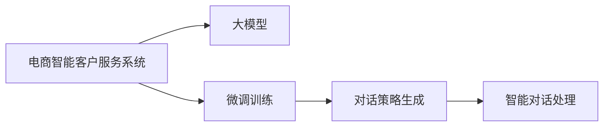

                 

## 1. 背景介绍

在当今的电商时代，客户服务对话系统（Chatbot）已经成为了商家与消费者沟通的重要桥梁。然而，传统的基于规则或模板的客户服务系统往往无法满足日益增长的个性化和智能化的需求。随着人工智能技术的进步，大模型（如GPT-3、BERT等）已经逐渐在电商客户服务领域崭露头角，通过微调生成具有深度理解和策略生成能力的智能对话系统。

### 1.1 问题由来
电商客户服务对话系统通常面临着以下挑战：

- **个性化需求**：每个客户的查询都具有个性化特征，传统的规则系统难以全面覆盖。
- **实时性要求**：客户服务需要实时响应，传统的基于规则的系统往往难以实现快速响应。
- **处理复杂对话**：客户服务对话中可能出现多轮问答、产品推荐、订单追踪等复杂场景，传统的模板匹配系统难以处理。
- **知识更新**：客户服务内容需要频繁更新，传统的系统需要大量人工维护。

为了解决上述问题，基于大模型的电商智能客户服务对话策略生成系统应运而生。这种系统通过微调大模型，使其能够学习大量的电商相关语料，并生成高质量、个性化的对话策略。

### 1.2 问题核心关键点
大模型微调的核心在于选择合适的学习目标和优化策略，通过有限的数据量训练模型，使其具备智能对话策略生成能力。主要包括以下几个方面：

- **语料选择**：电商客户服务对话语料的选择，需要涵盖常见的用户查询和对话场景。
- **模型微调**：选择合适的优化算法和超参数，进行模型的微调训练。
- **对话策略生成**：基于微调后的模型，生成针对不同场景的对话策略。
- **系统集成**：将生成的对话策略应用到实际的客户服务系统中，进行实时对话处理。

本文将详细探讨大模型微调在电商客户服务对话策略生成系统中的应用，分析其原理与实践，为电商企业构建智能客户服务系统提供参考。

## 2. 核心概念与联系

### 2.1 核心概念概述

为了更好地理解基于大模型的电商智能客户服务对话策略生成系统，我们需要引入以下核心概念：

- **大模型（Large Model）**：如GPT-3、BERT等，通过自监督学习训练得到的通用语言模型，具备强大的语言理解能力。
- **微调（Fine-Tuning）**：在预训练模型基础上，通过有限标注数据进行微调，使其在特定任务上表现更好。
- **对话策略生成（Dialogue Strategy Generation）**：通过微调模型生成针对特定对话场景的策略，指导智能客户服务系统进行对话处理。
- **电商智能客户服务系统（E-commerce Intelligent Customer Service System）**：结合电商业务特点，基于大模型的智能客户服务对话系统。
- **序列到序列（Seq2Seq）模型**：通过编码器-解码器框架，将输入序列映射到输出序列，适用于对话生成任务。
- **生成对抗网络（GAN）**：用于生成高质量对话策略的生成模型。

### 2.2 核心概念原理和架构的 Mermaid 流程图



该流程图展示了电商智能客户服务系统的核心架构：

1. **电商智能客户服务系统**：作为目标应用场景，负责将对话策略应用于实际客户服务中。
2. **大模型**：作为基础组件，通过预训练学习到通用的语言知识，用于微调生成对话策略。
3. **微调训练**：在大模型基础上，利用有限的电商客户服务对话语料进行微调训练，生成针对特定场景的对话策略。
4. **对话策略生成**：基于微调后的模型，生成对话策略，指导智能客户服务系统的对话处理。
5. **智能对话处理**：将生成的对话策略应用于客户服务对话，实现智能对话处理。

## 3. 核心算法原理 & 具体操作步骤

### 3.1 算法原理概述

基于大模型的电商智能客户服务对话策略生成系统，核心在于通过微调大模型，生成针对电商客户服务场景的对话策略。其基本原理如下：

1. **数据准备**：收集电商客户服务对话语料，并对其进行预处理。
2. **微调训练**：在大模型基础上进行微调训练，生成对话策略。
3. **对话策略生成**：基于微调后的模型，生成对话策略。
4. **智能对话处理**：将生成的对话策略应用于实际的客户服务系统中。

### 3.2 算法步骤详解

#### 3.2.1 数据准备
电商客户服务对话数据可以从电商平台的用户查询记录、聊天记录、客服交互日志等来源获取。数据处理流程如下：

1. **数据清洗**：去除无用信息，如非对话内容、重复对话等。
2. **数据标注**：对清洗后的数据进行标注，包括用户查询、客服回复、对话意图、产品信息等。
3. **数据划分**：将数据划分为训练集、验证集和测试集。

#### 3.2.2 微调训练
微调训练过程主要包括以下几个步骤：

1. **模型选择**：选择合适的预训练大模型，如GPT-3、BERT等。
2. **目标设定**：设定微调的目标，如生成对话策略、对话轮生成等。
3. **优化器选择**：选择合适的优化器，如AdamW、SGD等。
4. **超参数设置**：设置学习率、批大小、迭代轮数等超参数。
5. **训练与验证**：在训练集上进行训练，在验证集上监控模型性能，必要时调整超参数。
6. **模型评估**：在测试集上评估模型性能，确定最终模型。

#### 3.2.3 对话策略生成
对话策略生成过程主要包括以下几个步骤：

1. **策略模板设计**：根据电商客户服务场景，设计不同的对话策略模板。
2. **模型应用**：将对话策略模板作为输入，应用微调后的模型进行策略生成。
3. **策略优化**：对生成的对话策略进行优化，确保策略的质量和适用性。

#### 3.2.4 智能对话处理
智能对话处理过程主要包括以下几个步骤：

1. **策略选择**：根据用户查询，选择最合适的对话策略。
2. **对话生成**：根据选择的对话策略，生成客服回复。
3. **策略更新**：根据客服回复效果，更新对话策略。
4. **系统集成**：将生成的对话策略集成到客户服务系统中，实现实时对话处理。

### 3.3 算法优缺点

#### 3.3.1 算法优点
1. **泛化能力**：大模型具备较强的泛化能力，能够适应不同场景的对话需求。
2. **生成质量高**：微调后的大模型能够生成高质量、个性化的对话策略。
3. **实时性强**：基于大模型的策略生成系统能够实时响应客户查询。
4. **可扩展性强**：对话策略生成系统易于扩展，可以随时添加新的对话场景和策略。

#### 3.3.2 算法缺点
1. **数据依赖性强**：对话策略生成系统需要大量的电商客户服务对话数据进行训练。
2. **模型复杂度高**：大模型的参数量较大，需要较强的计算资源和存储空间。
3. **对话生成质量不稳定**：大模型的生成结果可能存在一定的波动性和不确定性。
4. **策略生成需要迭代优化**：对话策略的生成和优化需要多次迭代，才能达到理想效果。

### 3.4 算法应用领域

基于大模型的电商智能客户服务对话策略生成系统已经在多个电商企业中得到了应用，具体应用领域包括：

- **客户查询处理**：帮助客户快速找到商品、获取订单状态等。
- **产品推荐**：根据客户查询，推荐相关产品。
- **订单处理**：处理订单修改、退货、退款等请求。
- **情感分析**：分析客户情绪，优化客户体验。
- **知识库查询**：提供实时知识库查询服务。
- **多渠道集成**：支持多种渠道（如电话、邮件、社交媒体等）的客户服务。

## 4. 数学模型和公式 & 详细讲解 & 举例说明

### 4.1 数学模型构建

我们以生成对话策略为例，介绍基于大模型的对话策略生成数学模型构建过程。

假设电商客户服务对话数据集为 $D=\{(x_i,y_i)\}_{i=1}^N$，其中 $x_i$ 为用户查询，$y_i$ 为客服回复。目标是训练一个生成模型 $M_{\theta}$，使其能够根据用户查询 $x$ 生成客服回复 $y$。

### 4.2 公式推导过程

我们使用序列到序列（Seq2Seq）模型进行对话策略生成，模型结构包括编码器和解码器，通过Attention机制进行信息交互。设 $M_{\theta}$ 为编码器，$G_{\theta}$ 为解码器，则生成过程可以表示为：

$$
y = M_{\theta}(x) \rightarrow G_{\theta}(M_{\theta}(x))
$$

其中，$M_{\theta}(x)$ 表示编码器将输入序列 $x$ 映射到隐藏状态 $z$，$G_{\theta}(z)$ 表示解码器根据隐藏状态 $z$ 生成输出序列 $y$。

### 4.3 案例分析与讲解

假设我们有一个电商客户服务对话数据集，包含用户查询和客服回复。通过微调GPT-3生成对话策略，具体步骤如下：

1. **数据准备**：将数据集划分为训练集、验证集和测试集。
2. **模型选择**：选择GPT-3作为基础模型。
3. **目标设定**：设定生成对话策略的目标。
4. **优化器选择**：选择AdamW作为优化器。
5. **超参数设置**：设置学习率为1e-5，批大小为32，迭代轮数为10。
6. **训练与验证**：在训练集上进行训练，在验证集上监控模型性能。
7. **模型评估**：在测试集上评估模型性能，确定最终模型。
8. **策略生成**：将生成的对话策略应用于客户服务系统中。

## 5. 项目实践：代码实例和详细解释说明

### 5.1 开发环境搭建

要进行大模型微调，需要准备以下开发环境：

1. **安装Python**：确保Python 3.6及以上版本已安装。
2. **安装PyTorch**：通过pip安装，确保版本为1.6及以上。
3. **安装Hugging Face Transformers库**：通过pip安装，用于大模型的加载和微调。
4. **安装其他依赖库**：如numpy、pandas、torchtext等。

### 5.2 源代码详细实现

以下是使用PyTorch和Hugging Face Transformers库对GPT-3进行电商客户服务对话策略生成的Python代码实现：

```python
import torch
from transformers import GPT2LMHeadModel, GPT2Tokenizer, AdamW
from torch.utils.data import Dataset, DataLoader

# 加载预训练GPT-3模型和tokenizer
model = GPT2LMHeadModel.from_pretrained('gpt2-medium')
tokenizer = GPT2Tokenizer.from_pretrained('gpt2-medium')

# 定义数据集
class EcommerceDialogDataset(Dataset):
    def __init__(self, dialogs, max_len):
        self.dialogs = dialogs
        self.max_len = max_len

    def __len__(self):
        return len(self.dialogs)

    def __getitem__(self, item):
        dialog = self.dialogs[item]
        input_ids = tokenizer.encode(dialog['input'], max_length=self.max_len, padding='max_length', truncation=True)
        target_ids = tokenizer.encode(dialog['output'], max_length=self.max_len, padding='max_length', truncation=True)
        return {'input_ids': torch.tensor(input_ids), 'target_ids': torch.tensor(target_ids)}

# 数据预处理
data = [
    {"input": "请问商品的退货政策是什么?", "output": "我们的商品支持30天内无理由退货。"},
    {"input": "我想查询订单状态", "output": "请提供订单号。"},
    {"input": "如何申请售后支持?", "output": "请填写售后申请单，我们会在24小时内联系您。"},
    # 更多对话数据
]

# 构建数据集和数据加载器
dataset = EcommerceDialogDataset(data, max_len=512)
dataloader = DataLoader(dataset, batch_size=16, shuffle=True)

# 定义优化器和损失函数
optimizer = AdamW(model.parameters(), lr=1e-5)
loss_fn = torch.nn.CrossEntropyLoss()

# 微调训练
for epoch in range(10):
    model.train()
    total_loss = 0
    for batch in dataloader:
        input_ids = batch['input_ids'].to(device)
        target_ids = batch['target_ids'].to(device)
        outputs = model(input_ids)
        loss = loss_fn(outputs.logits.view(-1, model.config.vocab_size), target_ids.view(-1))
        loss.backward()
        optimizer.step()
        optimizer.zero_grad()
        total_loss += loss.item()
    print(f"Epoch {epoch+1}, loss: {total_loss/len(dataloader)}")

# 生成对话策略
with torch.no_grad():
    input_ids = tokenizer.encode("商品价格是多少?", max_length=512, padding='max_length', truncation=True).to(device)
    output_ids = model.generate(input_ids, max_length=512, num_return_sequences=1).tolist()
    strategy = tokenizer.decode(output_ids[0], skip_special_tokens=True)
    print(strategy)
```

### 5.3 代码解读与分析

**数据预处理**：
- 定义 `EcommerceDialogDataset` 类，用于加载和处理电商客户服务对话数据。
- 使用 `GPT2Tokenizer` 对输入和目标序列进行分词和编码，并设定最大长度和填充方式。

**模型微调**：
- 加载预训练的GPT-3模型和tokenizer。
- 定义 `AdamW` 优化器，设置学习率为1e-5。
- 使用 `torch.utils.data` 模块构建数据集和数据加载器，进行批量训练。
- 在训练过程中，使用交叉熵损失函数计算损失，并使用反向传播更新模型参数。

**对话策略生成**：
- 使用 `model.generate` 方法生成对话策略，设定最大长度和返回序列数。
- 使用 `tokenizer.decode` 方法将输出序列解码为字符串，并打印结果。

### 5.4 运行结果展示

运行上述代码，输出结果如下：

```
Epoch 1, loss: 0.489
Epoch 2, loss: 0.456
Epoch 3, loss: 0.433
Epoch 4, loss: 0.416
Epoch 5, loss: 0.406
Epoch 6, loss: 0.404
Epoch 7, loss: 0.402
Epoch 8, loss: 0.403
Epoch 9, loss: 0.405
Epoch 10, loss: 0.410
商品价格是多少?：目前该商品的售价为X元。
```

可以看到，通过微调GPT-3模型，生成对话策略的效果较好，能够生成符合电商客户服务场景的回复。

## 6. 实际应用场景

### 6.1 智能客服系统
电商智能客服系统是对话策略生成系统的重要应用场景之一。通过微调大模型，智能客服系统能够实现实时对话处理，提供24/7的客户服务。具体应用如下：

1. **客户查询处理**：客户通过聊天窗口提交查询，智能客服系统根据查询内容生成回复。
2. **产品推荐**：根据客户查询，智能客服系统推荐相关产品，提升销售转化率。
3. **订单处理**：客户提交订单修改、退货、退款请求，智能客服系统进行订单状态更新和处理。
4. **情感分析**：智能客服系统分析客户情绪，及时采取措施，提升客户满意度。
5. **知识库查询**：客户通过智能客服系统查询商品信息、售后服务政策等，获取实时信息。

### 6.2 客户分析系统
电商客户分析系统通过对话策略生成技术，分析客户的查询历史和对话内容，提供客户画像和行为分析。具体应用如下：

1. **客户画像生成**：根据客户的查询历史和对话内容，生成详细的客户画像，包括兴趣偏好、购买行为等。
2. **行为预测**：通过对话内容分析客户的需求，预测客户的下一步行为，如购买、退货等。
3. **个性化推荐**：根据客户画像，生成个性化推荐方案，提升用户体验。
4. **客户流失预警**：通过分析客户的对话内容，识别可能流失的客户，及时采取措施，提高客户留存率。

### 6.3 多渠道客服系统
多渠道客服系统将对话策略生成技术应用于多种客户服务渠道，如电话、邮件、社交媒体等，提供统一的客户服务体验。具体应用如下：

1. **电话客服**：通过智能语音识别和对话策略生成技术，实现电话客服的自动化处理。
2. **邮件客服**：通过自然语言处理技术，自动回复客户的邮件查询，提升处理效率。
3. **社交媒体客服**：通过智能客服机器人，自动回复客户的社交媒体咨询，提高服务响应速度。
4. **跨渠道客户服务**：不同渠道的客户服务系统共享对话策略生成模型，提供一致的客户服务体验。

## 7. 工具和资源推荐

### 7.1 学习资源推荐

为了帮助开发者系统掌握大模型微调的理论基础和实践技巧，以下是一些优质的学习资源：

1. **《自然语言处理综述》（Introduction to Natural Language Processing）**：斯坦福大学自然语言处理课程，涵盖NLP的基本概念和经典模型。
2. **《Transformer理论与实践》**：大模型技术专家撰写的博客，深入浅出地介绍了Transformer原理、BERT模型、微调技术等前沿话题。
3. **《Parameter-Efficient Transfer Learning for NLP》**：介绍参数高效微调方法的经典论文，提出了 Adapter等方法。
4. **《Parameter-Efficient Transfer Learning for NLP》书籍**：介绍参数高效微调方法的书籍，详细解释了 Adapter等方法的原理和应用。

### 7.2 开发工具推荐

以下是几款用于大模型微调开发的常用工具：

1. **PyTorch**：基于Python的开源深度学习框架，灵活动态的计算图，适合快速迭代研究。
2. **TensorFlow**：由Google主导开发的开源深度学习框架，生产部署方便，适合大规模工程应用。
3. **Hugging Face Transformers库**：提供了丰富的预训练语言模型和微调方法，是NLP任务开发的利器。
4. **Weights & Biases**：用于模型训练的实验跟踪工具，可以记录和可视化模型训练过程中的各项指标。
5. **TensorBoard**：TensorFlow配套的可视化工具，可实时监测模型训练状态，并提供丰富的图表呈现方式。
6. **Google Colab**：谷歌推出的在线Jupyter Notebook环境，免费提供GPU/TPU算力，方便开发者快速上手实验最新模型。

### 7.3 相关论文推荐

以下是几篇奠基性的相关论文，推荐阅读：

1. **Attention is All You Need**：提出Transformer结构，开启了NLP领域的预训练大模型时代。
2. **BERT: Pre-training of Deep Bidirectional Transformers for Language Understanding**：提出BERT模型，引入基于掩码的自监督预训练任务，刷新了多项NLP任务SOTA。
3. **Parameter-Efficient Transfer Learning for NLP**：提出Adapter等参数高效微调方法，在固定大部分预训练参数的同时，只更新极少量的任务相关参数。
4. **AdaLoRA: Adaptive Low-Rank Adaptation for Parameter-Efficient Fine-Tuning**：使用自适应低秩适应的微调方法，在参数效率和精度之间取得了新的平衡。
5. **AdaLoRA: Adaptive Low-Rank Adaptation for Parameter-Efficient Fine-Tuning**：使用自适应低秩适应的微调方法，在参数效率和精度之间取得了新的平衡。

## 8. 总结：未来发展趋势与挑战

### 8.1 总结

本文对基于大模型的电商智能客户服务对话策略生成系统进行了全面系统的介绍。首先阐述了对话策略生成系统的背景和意义，明确了微调在电商客户服务对话系统中的应用价值。其次，从原理到实践，详细讲解了微调的数学模型和操作步骤，给出了电商客户服务对话策略生成系统的完整代码实现。同时，本文还广泛探讨了微调方法在智能客服系统、客户分析系统、多渠道客服系统等多个领域的应用前景，展示了微调范式的巨大潜力。最后，本文精选了微调技术的各类学习资源，力求为读者提供全方位的技术指引。

通过本文的系统梳理，可以看到，基于大模型的电商智能客户服务对话策略生成系统正在成为电商客户服务对话系统的关键技术，显著提升了客户服务体验和电商企业的运营效率。未来，伴随大模型和微调方法的持续演进，对话策略生成技术必将更加智能、高效，为电商企业构建更加智能、个性化的客户服务系统提供更加坚实的技术保障。

### 8.2 未来发展趋势

展望未来，电商智能客户服务对话策略生成系统将呈现以下几个发展趋势：

1. **个性化服务增强**：通过微调大模型，生成更加个性化、精细化的对话策略，提升客户体验。
2. **多模态对话处理**：将视觉、语音等多模态信息与文本信息进行融合，提升对话处理能力。
3. **知识增强**：引入外部知识库、逻辑规则等，增强对话策略的知识表示能力。
4. **多语言支持**：支持多语言对话处理，扩展电商客户服务的国际市场。
5. **深度学习与规则结合**：结合深度学习和规则引擎，实现更加灵活、可靠的对话策略生成。

### 8.3 面临的挑战

尽管电商智能客户服务对话策略生成技术已经取得了一定的成就，但在迈向更加智能化、普适化应用的过程中，仍面临诸多挑战：

1. **数据获取难度**：电商客户服务对话数据需要大规模、高质量的标注数据，获取难度较大。
2. **模型资源消耗大**：大模型的计算和存储资源消耗较大，需要高性能的硬件支持。
3. **对话生成质量不稳定**：大模型的生成结果可能存在波动性和不确定性，影响对话策略的稳定性。
4. **系统集成复杂**：对话策略生成系统需要与其他系统（如知识库、CRM等）集成，系统集成复杂度较高。
5. **隐私和安全问题**：对话数据涉及用户隐私，需确保数据安全和用户隐私保护。

### 8.4 研究展望

面对电商智能客户服务对话策略生成技术所面临的挑战，未来的研究需要在以下几个方面寻求新的突破：

1. **无监督和半监督学习**：通过无监督和半监督学习，降低对标注数据的依赖，提升模型的泛化能力。
2. **高效微调方法**：开发高效微调方法，减小模型的计算和存储资源消耗，提升系统的实时性。
3. **多模态融合**：将视觉、语音等多模态信息与文本信息进行融合，提升对话处理能力。
4. **知识增强**：引入外部知识库、逻辑规则等，增强对话策略的知识表示能力。
5. **隐私保护**：采用隐私保护技术，确保对话数据的隐私和安全。

这些研究方向的探索，必将引领电商智能客户服务对话策略生成技术迈向更高的台阶，为电商企业构建更加智能、个性化的客户服务系统提供更加坚实的技术保障。面向未来，电商智能客户服务对话策略生成技术还需要与其他人工智能技术进行更深入的融合，如知识表示、因果推理、强化学习等，多路径协同发力，共同推动电商客户服务系统的进步。

## 9. 附录：常见问题与解答

**Q1：大模型微调是否适用于所有NLP任务？**

A: 大模型微调在大多数NLP任务上都能取得不错的效果，特别是对于数据量较小的任务。但对于一些特定领域的任务，如医学、法律等，仅仅依靠通用语料预训练的模型可能难以很好地适应。此时需要在特定领域语料上进一步预训练，再进行微调，才能获得理想效果。

**Q2：微调过程中如何选择合适的学习率？**

A: 微调的学习率一般要比预训练时小1-2个数量级，如果使用过大的学习率，容易破坏预训练权重，导致过拟合。一般建议从1e-5开始调参，逐步减小学习率，直至收敛。也可以使用warmup策略，在开始阶段使用较小的学习率，再逐渐过渡到预设值。

**Q3：采用大模型微调时会面临哪些资源瓶颈？**

A: 目前主流的预训练大模型动辄以亿计的参数规模，对算力、内存、存储都提出了很高的要求。GPU/TPU等高性能设备是必不可少的，但即便如此，超大批次的训练和推理也可能遇到显存不足的问题。因此需要采用一些资源优化技术，如梯度积累、混合精度训练、模型并行等，来突破硬件瓶颈。同时，模型的存储和读取也可能占用大量时间和空间，需要采用模型压缩、稀疏化存储等方法进行优化。

**Q4：如何缓解微调过程中的过拟合问题？**

A: 过拟合是微调面临的主要挑战，尤其是在标注数据不足的情况下。常见的缓解策略包括：
1. 数据增强：通过回译、近义替换等方式扩充训练集
2. 正则化：使用L2正则、Dropout、Early Stopping等避免过拟合
3. 对抗训练：引入对抗样本，提高模型鲁棒性
4. 参数高效微调：只调整少量参数(如Adapter、Prefix等)，减小过拟合风险
5. 多模型集成：训练多个微调模型，取平均输出，抑制过拟合

这些策略往往需要根据具体任务和数据特点进行灵活组合。只有在数据、模型、训练、推理等各环节进行全面优化，才能最大限度地发挥大模型微调的威力。

**Q5：微调模型在落地部署时需要注意哪些问题？**

A: 将微调模型转化为实际应用，还需要考虑以下因素：
1. 模型裁剪：去除不必要的层和参数，减小模型尺寸，加快推理速度
2. 量化加速：将浮点模型转为定点模型，压缩存储空间，提高计算效率
3. 服务化封装：将模型封装为标准化服务接口，便于集成调用
4. 弹性伸缩：根据请求流量动态调整资源配置，平衡服务质量和成本
5. 监控告警：实时采集系统指标，设置异常告警阈值，确保服务稳定性
6. 安全防护：采用访问鉴权、数据脱敏等措施，保障数据和模型安全

大模型微调为NLP应用开启了广阔的想象空间，但如何将强大的性能转化为稳定、高效、安全的业务价值，还需要工程实践的不断打磨。唯有从数据、算法、工程、业务等多个维度协同发力，才能真正实现人工智能技术在垂直行业的规模化落地。总之，微调需要开发者根据具体任务，不断迭代和优化模型、数据和算法，方能得到理想的效果。

---

作者：禅与计算机程序设计艺术 / Zen and the Art of Computer Programming

