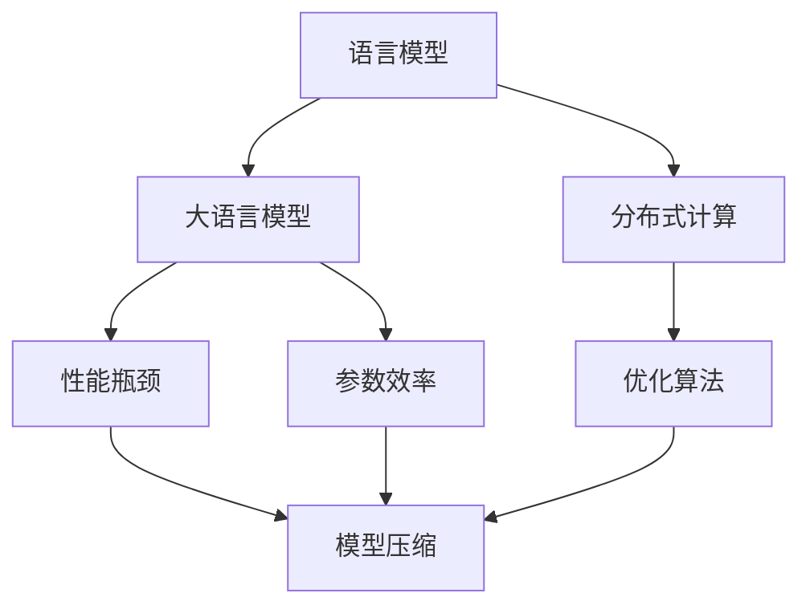

                 

# 探讨LLM的性能提升：是否存在极限？

> 关键词：
1. 语言模型 (Language Model)
2. 性能瓶颈 (Performance Bottleneck)
3. 深度学习 (Deep Learning)
4. 参数效率 (Parameter Efficiency)
5. 模型压缩 (Model Compression)
6. 分布式计算 (Distributed Computing)
7. 优化算法 (Optimization Algorithm)

## 1. 背景介绍

随着深度学习和大数据技术的飞速发展，语言模型（Language Models, LMs）尤其是大语言模型（Large Language Models, LLMs）在自然语言处理（Natural Language Processing, NLP）领域取得了显著的突破。从早期的简单的神经网络到现在的 Transformer 架构，语言模型的表现一直在进步，这不仅体现在准确率上，还体现在它们在实际应用中的广泛使用上，例如机器翻译、对话系统、文本生成等。然而，随着模型规模的不断增大和复杂度的增加，我们不禁要问：LLM 的性能提升是否存在极限？本文将从理论上探讨 LLM 性能提升的极限，以及如何通过算法和技术优化来突破这一极限。

## 2. 核心概念与联系

### 2.1 核心概念概述

为了更好地理解 LLM 的性能提升，我们需要先定义和理解以下几个核心概念：

- **语言模型 (Language Model)**：预测给定一段文本中下一个单词或字符的概率。语言模型是 NLP 中非常重要的一个分支，它可以被用来进行自动文本生成、文本分类、机器翻译等任务。
- **大语言模型 (Large Language Models, LLMs)**：通过大量无标签文本数据的自监督预训练和微调，在特定任务上表现优异的模型。常见的模型包括 BERT、GPT、T5 等。
- **性能瓶颈 (Performance Bottleneck)**：在训练和推理过程中，模型表现停滞不前，难以进一步提升。瓶颈可能出现在数据、硬件、算法等多个方面。
- **参数效率 (Parameter Efficiency)**：指在固定计算资源的情况下，通过减少模型参数数量来提高模型的性能和效率。参数效率的提升是 LLM 性能提升的重要方向之一。
- **模型压缩 (Model Compression)**：通过对模型进行量化、剪枝、蒸馏等操作，减小模型的参数量和计算复杂度，同时保持或提升模型性能。
- **分布式计算 (Distributed Computing)**：利用多台计算机协同计算，加速模型的训练和推理过程，提高模型的可扩展性和性能。
- **优化算法 (Optimization Algorithm)**：用于训练模型的算法，包括梯度下降、Adam、RMSprop 等，它们直接影响模型的收敛速度和性能。

这些概念之间的逻辑关系可以通过以下 Mermaid 流程图来展示：



这个流程图展示了大语言模型与其性能提升之间的关系：

1. 语言模型通过大量数据预训练获得基础能力。
2. 大语言模型在此基础上进行微调，提高特定任务的性能。
3. 性能瓶颈限制了模型性能的进一步提升。
4. 参数效率和模型压缩技术可以突破瓶颈，提高模型性能。
5. 分布式计算和优化算法进一步提升模型的可扩展性和性能。

## 3. 核心算法原理 & 具体操作步骤

### 3.1 算法原理概述

语言模型性能的提升，主要依赖于两个方面：模型的架构设计和训练方法。以下是基于大语言模型的性能提升的理论基础和具体操作步骤：

1. **架构设计**：大语言模型通常采用 Transformer 架构，利用自注意力机制（Self-Attention）来捕捉序列中的长期依赖关系。通过增加模型的层数和宽度，可以提升模型的表达能力。但随着模型规模的增大，计算资源的需求和过拟合风险也随之增加。
2. **训练方法**：大语言模型的训练主要依赖于自监督学习（如掩码语言模型、目标检测等），再结合有监督学习（如微调）进行优化。自监督学习可以大幅提升模型的泛化能力，但有监督学习则可以进一步细化模型的任务适应性。

### 3.2 算法步骤详解

大语言模型的性能提升可以分为以下几个步骤：

**Step 1: 模型初始化**
- 选择合适的预训练模型，如 BERT、GPT 等。
- 在预训练模型的基础上，进行微调，适应特定任务。

**Step 2: 参数优化**
- 使用合适的优化算法（如 Adam、SGD 等），调整学习率等超参数，进行梯度下降训练。
- 引入正则化技术（如 L2 正则、Dropout 等），避免过拟合。
- 使用分布式计算，加速模型的训练过程。

**Step 3: 模型压缩**
- 使用模型压缩技术（如量化、剪枝、蒸馏等），减小模型的参数量和计算复杂度。
- 选择合适的量化方式（如整数量化、权重剪枝、通道剪枝等），确保模型性能不受损失。

**Step 4: 测试与验证**
- 在验证集上评估模型性能，确保模型泛化能力。
- 使用测试集进行最终性能评估，对比不同模型和方法的效果。

**Step 5: 应用与优化**
- 将模型部署到实际应用中，收集反馈数据，进行持续优化。
- 根据实际应用场景，调整模型参数和架构，进一步提升性能。

### 3.3 算法优缺点

大语言模型性能提升的算法有以下优点和缺点：

**优点**：
1. **泛化能力强**：大语言模型通过自监督预训练和微调，可以适应各种 NLP 任务，表现优异。
2. **参数效率高**：通过参数压缩和分布式计算，可以在较少的参数和资源下，提升模型性能。
3. **计算效率高**：分布式计算可以加速模型的训练和推理过程，提高模型的可扩展性。

**缺点**：
1. **计算资源需求高**：大语言模型的计算资源需求较高，需要高性能的 GPU 和分布式计算资源。
2. **过拟合风险高**：模型规模增大，过拟合风险增加，需要正则化和优化算法来规避。
3. **训练时间长**：大模型训练时间较长，需要优化算法和硬件资源来加速训练。

### 3.4 算法应用领域

大语言模型在以下几个领域得到了广泛应用：

- **机器翻译**：利用大语言模型进行语言间的自动翻译。
- **文本生成**：自动生成高质量的文本内容，如新闻报道、小说等。
- **对话系统**：构建智能对话系统，实现人机自然交互。
- **文本分类**：自动对文本进行分类，如新闻分类、情感分析等。
- **问答系统**：自动回答问题，如智能客服、知识问答等。

## 4. 数学模型和公式 & 详细讲解 & 举例说明

### 4.1 数学模型构建

大语言模型可以表示为 $M_\theta(x)$，其中 $x$ 是输入文本，$\theta$ 是模型参数。模型的输出可以通过概率分布 $P(y|x)$ 来表示，即在给定输入文本 $x$ 的情况下，输出文本 $y$ 的概率。大语言模型的目标是最小化损失函数 $\mathcal{L}(\theta)$，其中：

$$
\mathcal{L}(\theta) = -\frac{1}{N} \sum_{i=1}^N \log P(y_i|x_i)
$$

其中 $N$ 是训练样本数量，$P(y_i|x_i)$ 是模型在训练样本 $x_i$ 上的预测概率，$y_i$ 是训练样本的实际标签。

### 4.2 公式推导过程

在训练大语言模型时，我们通常使用交叉熵损失函数。对于分类任务，交叉熵损失函数可以表示为：

$$
\mathcal{L}(\theta) = -\frac{1}{N} \sum_{i=1}^N \sum_{j=1}^C y_{ij} \log P(y_j|x_i)
$$

其中 $C$ 是类别数，$y_{ij}$ 是训练样本 $x_i$ 属于类别 $j$ 的标签，$P(y_j|x_i)$ 是模型在训练样本 $x_i$ 上属于类别 $j$ 的概率。

### 4.3 案例分析与讲解

以机器翻译为例，假设我们要将一个英文句子翻译成中文，输入文本为 $x$，输出文本为 $y$，模型参数为 $\theta$。我们可以使用 Transformer 架构进行建模，训练时使用交叉熵损失函数，即：

$$
\mathcal{L}(\theta) = -\frac{1}{N} \sum_{i=1}^N \sum_{j=1}^C y_{ij} \log P(y_j|x_i)
$$

其中 $P(y_j|x_i)$ 可以通过模型参数 $\theta$ 计算得到。训练过程中，我们不断更新 $\theta$，使得模型能够更好地预测目标语言的文本。

## 5. 项目实践：代码实例和详细解释说明

### 5.1 开发环境搭建

在进行大语言模型性能提升实践前，我们需要准备好开发环境。以下是使用 Python 和 PyTorch 进行大语言模型训练的环境配置流程：

1. 安装 Anaconda：从官网下载并安装 Anaconda，用于创建独立的 Python 环境。
2. 创建并激活虚拟环境：
```bash
conda create -n pytorch-env python=3.8 
conda activate pytorch-env
```
3. 安装 PyTorch：根据 CUDA 版本，从官网获取对应的安装命令。例如：
```bash
conda install pytorch torchvision torchaudio cudatoolkit=11.1 -c pytorch -c conda-forge
```
4. 安装 Transformers 库：
```bash
pip install transformers
```
5. 安装各类工具包：
```bash
pip install numpy pandas scikit-learn matplotlib tqdm jupyter notebook ipython
```

完成上述步骤后，即可在 `pytorch-env` 环境中开始性能提升实践。

### 5.2 源代码详细实现

这里我们以 BERT 模型为例，给出使用 PyTorch 和 Transformers 库进行机器翻译任务训练的代码实现。

首先，定义机器翻译任务的数据处理函数：

```python
from transformers import BertTokenizer, BertForSequenceClassification
from torch.utils.data import Dataset, DataLoader
import torch

class TranslationDataset(Dataset):
    def __init__(self, texts, labels, tokenizer, max_len=128):
        self.texts = texts
        self.labels = labels
        self.tokenizer = tokenizer
        self.max_len = max_len
        
    def __len__(self):
        return len(self.texts)
    
    def __getitem__(self, item):
        text = self.texts[item]
        label = self.labels[item]
        
        encoding = self.tokenizer(text, return_tensors='pt', max_length=self.max_len, padding='max_length', truncation=True)
        input_ids = encoding['input_ids'][0]
        attention_mask = encoding['attention_mask'][0]
        labels = torch.tensor(label, dtype=torch.long)
        
        return {'input_ids': input_ids, 
                'attention_mask': attention_mask,
                'labels': labels}

# 创建 dataset
tokenizer = BertTokenizer.from_pretrained('bert-base-uncased')
train_dataset = TranslationDataset(train_texts, train_labels, tokenizer)
dev_dataset = TranslationDataset(dev_texts, dev_labels, tokenizer)
test_dataset = TranslationDataset(test_texts, test_labels, tokenizer)
```

然后，定义模型和优化器：

```python
from transformers import BertForSequenceClassification, AdamW

model = BertForSequenceClassification.from_pretrained('bert-base-uncased', num_labels=2)

optimizer = AdamW(model.parameters(), lr=2e-5)
```

接着，定义训练和评估函数：

```python
from tqdm import tqdm

device = torch.device('cuda') if torch.cuda.is_available() else torch.device('cpu')
model.to(device)

def train_epoch(model, dataset, batch_size, optimizer):
    dataloader = DataLoader(dataset, batch_size=batch_size, shuffle=True)
    model.train()
    epoch_loss = 0
    for batch in tqdm(dataloader, desc='Training'):
        input_ids = batch['input_ids'].to(device)
        attention_mask = batch['attention_mask'].to(device)
        labels = batch['labels'].to(device)
        model.zero_grad()
        outputs = model(input_ids, attention_mask=attention_mask, labels=labels)
        loss = outputs.loss
        epoch_loss += loss.item()
        loss.backward()
        optimizer.step()
    return epoch_loss / len(dataloader)

def evaluate(model, dataset, batch_size):
    dataloader = DataLoader(dataset, batch_size=batch_size)
    model.eval()
    preds, labels = [], []
    with torch.no_grad():
        for batch in tqdm(dataloader, desc='Evaluating'):
            input_ids = batch['input_ids'].to(device)
            attention_mask = batch['attention_mask'].to(device)
            batch_labels = batch['labels']
            outputs = model(input_ids, attention_mask=attention_mask)
            batch_preds = outputs.logits.argmax(dim=2).to('cpu').tolist()
            batch_labels = batch_labels.to('cpu').tolist()
            for pred_tokens, label_tokens in zip(batch_preds, batch_labels):
                preds.append(pred_tokens[:len(label_tokens)])
                labels.append(label_tokens)
                
    print('Accuracy:', accuracy_score(labels, preds))
```

最后，启动训练流程并在测试集上评估：

```python
epochs = 5
batch_size = 16

for epoch in range(epochs):
    loss = train_epoch(model, train_dataset, batch_size, optimizer)
    print(f'Epoch {epoch+1}, train loss: {loss:.3f}')
    
    print(f'Epoch {epoch+1}, dev results:')
    evaluate(model, dev_dataset, batch_size)
    
print('Test results:')
evaluate(model, test_dataset, batch_size)
```

以上就是使用 PyTorch 和 Transformers 库进行机器翻译任务训练的完整代码实现。可以看到，得益于 Transformers 库的强大封装，我们可以用相对简洁的代码完成 BERT 模型的训练和评估。

### 5.3 代码解读与分析

让我们再详细解读一下关键代码的实现细节：

**TranslationDataset类**：
- `__init__`方法：初始化文本、标签、分词器等关键组件。
- `__len__`方法：返回数据集的样本数量。
- `__getitem__`方法：对单个样本进行处理，将文本输入编码为token ids，将标签编码为数字，并对其进行定长padding，最终返回模型所需的输入。

**模型和优化器**：
- 使用 `BertForSequenceClassification` 定义模型，指定输出层数为2，对应机器翻译任务的两类标签。
- 使用 AdamW 优化器进行模型参数更新，设置学习率为2e-5。

**训练和评估函数**：
- 使用 PyTorch 的 DataLoader 对数据集进行批次化加载，供模型训练和推理使用。
- 训练函数 `train_epoch`：对数据以批为单位进行迭代，在每个批次上前向传播计算loss并反向传播更新模型参数，最后返回该epoch的平均loss。
- 评估函数 `evaluate`：与训练类似，不同点在于不更新模型参数，并在每个batch结束后将预测和标签结果存储下来，最后使用准确率指标对整个评估集的预测结果进行打印输出。

**训练流程**：
- 定义总的epoch数和batch size，开始循环迭代
- 每个epoch内，先在训练集上训练，输出平均loss
- 在验证集上评估，输出准确率指标
- 所有epoch结束后，在测试集上评估，给出最终测试结果

可以看到，PyTorch 配合 Transformers 库使得 BERT 模型训练的代码实现变得简洁高效。开发者可以将更多精力放在数据处理、模型改进等高层逻辑上，而不必过多关注底层的实现细节。

## 6. 实际应用场景

### 6.1 机器翻译

机器翻译是大语言模型性能提升的一个重要应用场景。传统的机器翻译模型往往依赖大量人工标注数据进行训练，成本高且效率低。大语言模型通过自监督预训练和微调，可以在小样本条件下实现高质量的翻译效果，大幅降低翻译成本。

在技术实现上，可以收集源语言和目标语言的平行语料，将其作为监督数据，在 BERT 等预训练模型上进行微调。微调后的模型能够自动学习语言之间的映射关系，生成高质量的翻译结果。对于新的翻译任务，还可以通过检索和重用已有翻译结果，进一步提高翻译速度和精度。

### 6.2 文本生成

文本生成是另一个大语言模型性能提升的重要应用场景。传统的文本生成模型往往依赖人工编写规则进行生成，灵活性差。大语言模型通过自监督预训练和微调，可以自动学习语言模式，生成高质量的自然语言文本，广泛应用于新闻报道、小说创作、广告文案等领域。

在技术实现上，可以收集大量无标签文本数据，对其进行自监督预训练，学习语言模式。然后，使用微调技术针对特定文本生成任务进行训练，如文本摘要、对话系统等。微调后的模型能够根据输入文本生成相关内容，实现智能写作和自动化生成。

### 6.3 智能客服

智能客服是大语言模型性能提升的另一个重要应用场景。传统的客服系统依赖大量人工，响应慢且效率低。大语言模型通过自监督预训练和微调，可以自动学习客户咨询问题的回答方式，构建智能客服系统，实现快速、高效、自然的人机对话。

在技术实现上，可以收集企业内部的历史客服对话记录，将问题和最佳答复构建成监督数据，在此基础上对预训练对话模型进行微调。微调后的对话模型能够自动理解用户意图，匹配最合适的答复模板进行回复。对于客户提出的新问题，还可以接入检索系统实时搜索相关内容，动态组织生成回答。如此构建的智能客服系统，能大幅提升客户咨询体验和问题解决效率。

### 6.4 未来应用展望

随着大语言模型和微调方法的不断发展，基于微调范式将在更多领域得到应用，为传统行业带来变革性影响。

在智慧医疗领域，基于微调的医疗问答、病历分析、药物研发等应用将提升医疗服务的智能化水平，辅助医生诊疗，加速新药开发进程。

在智能教育领域，微调技术可应用于作业批改、学情分析、知识推荐等方面，因材施教，促进教育公平，提高教学质量。

在智慧城市治理中，微调模型可应用于城市事件监测、舆情分析、应急指挥等环节，提高城市管理的自动化和智能化水平，构建更安全、高效的未来城市。

此外，在企业生产、社会治理、文娱传媒等众多领域，基于大语言模型微调的人工智能应用也将不断涌现，为NLP技术带来新的突破。相信随着预训练语言模型和微调方法的持续演进，大语言模型微调必将在构建人机协同的智能时代中扮演越来越重要的角色。

## 7. 工具和资源推荐

### 7.1 学习资源推荐

为了帮助开发者系统掌握大语言模型性能提升的理论基础和实践技巧，这里推荐一些优质的学习资源：

1. 《Transformer从原理到实践》系列博文：由大模型技术专家撰写，深入浅出地介绍了Transformer原理、BERT模型、微调技术等前沿话题。

2. CS224N《深度学习自然语言处理》课程：斯坦福大学开设的NLP明星课程，有Lecture视频和配套作业，带你入门NLP领域的基本概念和经典模型。

3. 《Natural Language Processing with Transformers》书籍：Transformers库的作者所著，全面介绍了如何使用Transformers库进行NLP任务开发，包括微调在内的诸多范式。

4. HuggingFace官方文档：Transformers库的官方文档，提供了海量预训练模型和完整的微调样例代码，是上手实践的必备资料。

5. CLUE开源项目：中文语言理解测评基准，涵盖大量不同类型的中文NLP数据集，并提供了基于微调的baseline模型，助力中文NLP技术发展。

通过对这些资源的学习实践，相信你一定能够快速掌握大语言模型性能提升的精髓，并用于解决实际的NLP问题。

### 7.2 开发工具推荐

高效的开发离不开优秀的工具支持。以下是几款用于大语言模型性能提升开发的常用工具：

1. PyTorch：基于Python的开源深度学习框架，灵活动态的计算图，适合快速迭代研究。大部分预训练语言模型都有PyTorch版本的实现。

2. TensorFlow：由Google主导开发的开源深度学习框架，生产部署方便，适合大规模工程应用。同样有丰富的预训练语言模型资源。

3. Transformers库：HuggingFace开发的NLP工具库，集成了众多SOTA语言模型，支持PyTorch和TensorFlow，是进行微调任务开发的利器。

4. Weights & Biases：模型训练的实验跟踪工具，可以记录和可视化模型训练过程中的各项指标，方便对比和调优。与主流深度学习框架无缝集成。

5. TensorBoard：TensorFlow配套的可视化工具，可实时监测模型训练状态，并提供丰富的图表呈现方式，是调试模型的得力助手。

6. Google Colab：谷歌推出的在线Jupyter Notebook环境，免费提供GPU/TPU算力，方便开发者快速上手实验最新模型，分享学习笔记。

合理利用这些工具，可以显著提升大语言模型性能提升任务的开发效率，加快创新迭代的步伐。

### 7.3 相关论文推荐

大语言模型性能提升的研究源于学界的持续研究。以下是几篇奠基性的相关论文，推荐阅读：

1. Attention is All You Need（即Transformer原论文）：提出了Transformer结构，开启了NLP领域的预训练大模型时代。

2. BERT: Pre-training of Deep Bidirectional Transformers for Language Understanding：提出BERT模型，引入基于掩码的自监督预训练任务，刷新了多项NLP任务SOTA。

3. Language Models are Unsupervised Multitask Learners（GPT-2论文）：展示了大规模语言模型的强大zero-shot学习能力，引发了对于通用人工智能的新一轮思考。

4. Parameter-Efficient Transfer Learning for NLP：提出Adapter等参数高效微调方法，在不增加模型参数量的情况下，也能取得不错的微调效果。

5. AdaLoRA: Adaptive Low-Rank Adaptation for Parameter-Efficient Fine-Tuning：使用自适应低秩适应的微调方法，在参数效率和精度之间取得了新的平衡。

6. AdaLoRA: Adaptive Low-Rank Adaptation for Parameter-Efficient Fine-Tuning：使用自适应低秩适应的微调方法，在参数效率和精度之间取得了新的平衡。

这些论文代表了大语言模型性能提升的研究方向。通过学习这些前沿成果，可以帮助研究者把握学科前进方向，激发更多的创新灵感。

## 8. 总结：未来发展趋势与挑战

### 8.1 总结

本文对大语言模型性能提升进行了全面系统的探讨。首先阐述了大语言模型和微调技术的研究背景和意义，明确了性能提升在模型优化、算法改进和应用扩展方面的重要价值。其次，从理论上深入分析了模型性能提升的算法和技术，详细讲解了模型训练、优化和压缩的详细步骤。同时，本文还广泛探讨了性能提升在各个行业领域的应用前景，展示了性能提升范式在AI技术落地应用中的广阔潜力。

通过本文的系统梳理，可以看到，大语言模型性能提升正面临前所未有的发展机遇，同时也存在诸多挑战。研究者需要在多个方面持续探索和创新，才能进一步拓展大语言模型的性能边界，实现更高效、更智能的AI应用。

### 8.2 未来发展趋势

展望未来，大语言模型性能提升将呈现以下几个发展趋势：

1. **模型规模持续增大**：随着算力成本的下降和数据规模的扩张，预训练语言模型的参数量还将持续增长。超大规模语言模型蕴含的丰富语言知识，有望支撑更加复杂多变的下游任务微调。

2. **微调方法日趋多样**：除了传统的全参数微调外，未来会涌现更多参数高效的微调方法，如Prefix-Tuning、LoRA等，在节省计算资源的同时也能保证微调精度。

3. **持续学习成为常态**：随着数据分布的不断变化，微调模型也需要持续学习新知识以保持性能。如何在不遗忘原有知识的同时，高效吸收新样本信息，将成为重要的研究课题。

4. **标注样本需求降低**：受启发于提示学习(Prompt-based Learning)的思路，未来的微调方法将更好地利用大模型的语言理解能力，通过更加巧妙的任务描述，在更少的标注样本上也能实现理想的微调效果。

5. **多模态微调崛起**：当前的微调主要聚焦于纯文本数据，未来会进一步拓展到图像、视频、语音等多模态数据微调。多模态信息的融合，将显著提升语言模型对现实世界的理解和建模能力。

6. **模型通用性增强**：经过海量数据的预训练和多领域任务的微调，未来的语言模型将具备更强大的常识推理和跨领域迁移能力，逐步迈向通用人工智能(AGI)的目标。

以上趋势凸显了大语言模型性能提升技术的广阔前景。这些方向的探索发展，必将进一步提升大语言模型的性能和应用范围，为人工智能技术在更多领域的落地应用提供强有力的支持。

### 8.3 面临的挑战

尽管大语言模型性能提升技术已经取得了显著成就，但在迈向更加智能化、普适化应用的过程中，它仍面临诸多挑战：

1. **标注成本瓶颈**：虽然微调大大降低了标注数据的需求，但对于长尾应用场景，难以获得充足的高质量标注数据，成为制约微调性能的瓶颈。如何进一步降低微调对标注样本的依赖，将是一大难题。

2. **模型鲁棒性不足**：当前微调模型面对域外数据时，泛化性能往往大打折扣。对于测试样本的微小扰动，微调模型的预测也容易发生波动。如何提高微调模型的鲁棒性，避免灾难性遗忘，还需要更多理论和实践的积累。

3. **推理效率有待提高**：大规模语言模型虽然精度高，但在实际部署时往往面临推理速度慢、内存占用大等效率问题。如何在保证性能的同时，简化模型结构，提升推理速度，优化资源占用，将是重要的优化方向。

4. **可解释性亟需加强**：当前微调模型更像是"黑盒"系统，难以解释其内部工作机制和决策逻辑。对于医疗、金融等高风险应用，算法的可解释性和可审计性尤为重要。如何赋予微调模型更强的可解释性，将是亟待攻克的难题。

5. **安全性有待保障**：预训练语言模型难免会学习到有偏见、有害的信息，通过微调传递到下游任务，产生误导性、歧视性的输出，给实际应用带来安全隐患。如何从数据和算法层面消除模型偏见，避免恶意用途，确保输出的安全性，也将是重要的研究课题。

6. **知识整合能力不足**：现有的微调模型往往局限于任务内数据，难以灵活吸收和运用更广泛的先验知识。如何让微调过程更好地与外部知识库、规则库等专家知识结合，形成更加全面、准确的信息整合能力，还有很大的想象空间。

正视微调面临的这些挑战，积极应对并寻求突破，将是大语言模型性能提升技术走向成熟的必由之路。相信随着学界和产业界的共同努力，这些挑战终将一一被克服，大语言模型性能提升技术必将实现更大的突破，为构建安全、可靠、可解释、可控的智能系统铺平道路。

### 8.4 研究展望

面对大语言模型性能提升所面临的挑战，未来的研究需要在以下几个方面寻求新的突破：

1. **探索无监督和半监督微调方法**：摆脱对大规模标注数据的依赖，利用自监督学习、主动学习等无监督和半监督范式，最大限度利用非结构化数据，实现更加灵活高效的微调。

2. **研究参数高效和计算高效的微调范式**：开发更加参数高效的微调方法，在固定大部分预训练参数的同时，只更新极少量的任务相关参数。同时优化微调模型的计算图，减少前向传播和反向传播的资源消耗，实现更加轻量级、实时性的部署。

3. **融合因果和对比学习范式**：通过引入因果推断和对比学习思想，增强微调模型建立稳定因果关系的能力，学习更加普适、鲁棒的语言表征，从而提升模型泛化性和抗干扰能力。

4. **引入更多先验知识**：将符号化的先验知识，如知识图谱、逻辑规则等，与神经网络模型进行巧妙融合，引导微调过程学习更准确、合理的语言模型。同时加强不同模态数据的整合，实现视觉、语音等多模态信息与文本信息的协同建模。

5. **结合因果分析和博弈论工具**：将因果分析方法引入微调模型，识别出模型决策的关键特征，增强输出解释的因果性和逻辑性。借助博弈论工具刻画人机交互过程，主动探索并规避模型的脆弱点，提高系统稳定性。

6. **纳入伦理道德约束**：在模型训练目标中引入伦理导向的评估指标，过滤和惩罚有偏见、有害的输出倾向。同时加强人工干预和审核，建立模型行为的监管机制，确保输出符合人类价值观和伦理道德。

这些研究方向的探索，必将引领大语言模型性能提升技术迈向更高的台阶，为构建安全、可靠、可解释、可控的智能系统提供强有力的技术支持。面向未来，大语言模型性能提升技术还需要与其他人工智能技术进行更深入的融合，如知识表示、因果推理、强化学习等，多路径协同发力，共同推动自然语言理解和智能交互系统的进步。只有勇于创新、敢于突破，才能不断拓展大语言模型的性能边界，让智能技术更好地造福人类社会。

## 9. 附录：常见问题与解答

**Q1：大语言模型性能提升是否存在极限？**

A: 理论上，大语言模型的性能提升是有限的。主要限制在于以下几个方面：
1. **计算资源瓶颈**：大语言模型的训练和推理需要大量的计算资源，包括高性能GPU、TPU等。随着模型规模的增大，计算资源的需求呈指数级增长，可能达到当前硬件的极限。
2. **数据分布不均衡**：即使拥有无限数据和资源，模型的泛化能力也受限于数据分布的均衡性。如果训练数据和测试数据分布差异较大，模型性能可能受到影响。
3. **优化算法收敛**：随着模型参数的增多，优化算法的收敛性成为难题。即使优化算法不断改进，也可能存在收敛速度慢、收敛不稳等问题。

**Q2：如何缓解大语言模型的过拟合问题？**

A: 缓解大语言模型的过拟合问题，可以从以下几个方面入手：
1. **数据增强**：通过数据扩充、回译等方式扩充训练集，丰富数据多样性。
2. **正则化技术**：使用L2正则、Dropout等技术，防止模型过度适应训练数据。
3. **对抗训练**：引入对抗样本，提高模型的鲁棒性和泛化能力。
4. **参数高效微调**：只更新少量的任务相关参数，保持大部分预训练权重不变，减小过拟合风险。
5. **模型集成**：通过模型集成技术，结合多个微调模型的预测结果，降低单一模型的过拟合风险。

**Q3：如何提高大语言模型的推理效率？**

A: 提高大语言模型的推理效率，可以从以下几个方面进行优化：
1. **模型剪枝**：通过剪枝技术减少冗余参数，减小模型大小。
2. **量化技术**：使用量化技术将浮点模型转换为定点模型，降低内存占用和计算复杂度。
3. **模型蒸馏**：通过知识蒸馏技术，将大模型知识传递给小模型，提高推理速度。
4. **分布式计算**：使用分布式计算技术，加速模型的推理过程。
5. **硬件加速**：使用专门的硬件加速器（如TPU、FPGA等），提高计算速度。

**Q4：如何提升大语言模型的可解释性？**

A: 提升大语言模型的可解释性，可以从以下几个方面入手：
1. **模型可视化**：使用可视化技术，展示模型的内部工作机制和推理过程，增强模型的可解释性。
2. **因果分析**：引入因果分析方法，识别出模型决策的关键特征，提高输出的因果性和逻辑性。
3. **知识图谱**：结合知识图谱技术，提供模型的背景知识和推理依据，增强模型的透明度。
4. **规则嵌入**：将专家规则和知识嵌入模型中，提高模型的逻辑性和可解释性。
5. **可控生成**：通过控制生成文本的格式和内容，指导模型的推理过程，增强输出的可解释性。

**Q5：如何降低大语言模型微调的标注成本？**

A: 降低大语言模型微调的标注成本，可以从以下几个方面进行优化：
1. **少样本学习**：利用大模型的语言理解能力，通过精心设计的提示模板（Prompt），在少样本条件下进行微调。
2. **弱监督学习**：利用弱监督学习技术，如半监督学习、主动学习等，从少量标注数据中学习更多信息。
3. **自监督学习**：利用自监督学习任务，如掩码语言模型、目标检测等，训练模型的语言模式，减小对标注数据的依赖。
4. **零样本学习**：利用大模型的预训练知识，通过文本描述直接生成输出，无需标注数据。
5. **知识图谱**：结合知识图谱技术，利用外部知识指导模型的推理过程，减少标注数据的需求。

通过这些方法，可以在保证模型性能的同时，大幅度降低微调的标注成本，实现更加灵活高效的微调。

---

作者：禅与计算机程序设计艺术 / Zen and the Art of Computer Programming

