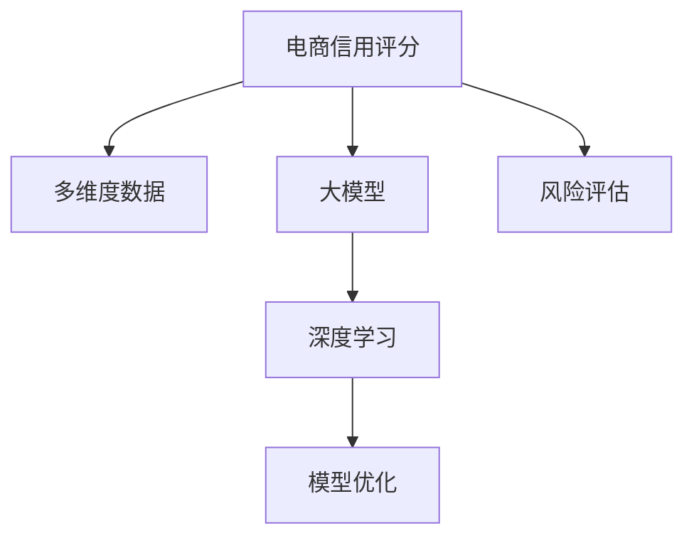

                 

# 探讨大模型在电商平台用户多维度信用评分中的潜力

> 关键词：大模型,信用评分,电商平台,多维度数据,深度学习,模型优化,风险评估,商业决策

## 1. 背景介绍

### 1.1 问题由来
随着电商行业的快速发展，用户在电商平台上的行为数据越来越丰富。如何利用这些海量数据，为每个用户建立准确的信用评分，以优化用户体验，提升商业决策质量，成为电商平台亟需解决的关键问题。传统的信用评分方法多基于规则或小规模模型，难以应对复杂多变的用户行为，且无法充分利用数据中隐藏的深度信息。

近年来，深度学习技术在电商信用评分中的研究逐渐兴起，尤其是大模型在多维度数据融合、用户行为预测等方面的应用，显示出了巨大的潜力。本文章将深入探讨大模型在电商平台用户信用评分中的应用，并分析其背后的核心算法原理和具体操作步骤。

### 1.2 问题核心关键点
目前，大模型在电商信用评分中的主要应用包括：
1. 多维度数据融合：将用户的行为数据、历史交易数据、社交网络数据等多维度数据融合起来，构建用户画像。
2. 深度学习模型：利用深度神经网络对融合后的数据进行建模，自动学习用户行为的复杂模式。
3. 信用评分优化：通过大模型的预测，动态调整用户的信用评分，优化用户体验。
4. 风险评估：利用大模型预测用户行为的风险，避免潜在欺诈和信用风险。

## 2. 核心概念与联系

### 2.1 核心概念概述

为更好地理解大模型在电商信用评分中的应用，本节将介绍几个密切相关的核心概念：

- **大模型(Large Model)**：如BERT、GPT等，具有数十亿参数，通过自监督预训练学习到丰富的语义和模式知识。
- **电商信用评分(E-commerce Credit Scoring)**：基于用户多维度数据，评估用户在电商平台上的信任和支付能力，为用户提供个性化服务，优化交易流程。
- **多维度数据(Multi-dimensional Data)**：包括用户行为数据、历史交易数据、社交网络数据等，共同构成用户画像。
- **深度学习(Deep Learning)**：利用多层神经网络自动学习数据的复杂模式，适合处理多维度、高维数据。
- **模型优化(Model Optimization)**：通过调整模型参数，提升模型的泛化能力和准确性。
- **风险评估(Risk Assessment)**：通过模型预测，识别和评估用户行为的风险，保护平台和用户的安全。

这些核心概念之间的逻辑关系可以通过以下Mermaid流程图来展示：



这个流程图展示了大模型在电商信用评分中的应用框架：

1. 电商信用评分利用多维度数据进行建模。
2. 大模型作为深度学习模型，自动学习数据的复杂模式。
3. 模型优化提升模型性能。
4. 风险评估识别用户行为的风险。

## 3. 核心算法原理 & 具体操作步骤

### 3.1 算法原理概述

大模型在电商信用评分中的应用，主要基于深度学习，通过多维度数据融合和模型优化，实现用户行为的准确预测和信用评分的动态调整。

假设用户数据集为 $D=\{(x_i,y_i)\}_{i=1}^N$，其中 $x_i$ 为多维度数据， $y_i$ 为用户的信用评分。大模型的目标是最小化损失函数：

$$
\mathcal{L}(w) = \frac{1}{N} \sum_{i=1}^N \ell(y_i, M_{\theta}(x_i))
$$

其中 $M_{\theta}$ 为深度学习模型， $\ell$ 为损失函数。目标是找到一个合适的 $w$，使得模型的预测值 $M_{\theta}(x_i)$ 尽可能逼近真实标签 $y_i$。

### 3.2 算法步骤详解

基于深度学习的大模型在电商信用评分中，一般遵循以下步骤：

**Step 1: 准备数据集**
- 收集用户多维度数据，包括用户行为数据、历史交易数据、社交网络数据等。
- 对数据进行预处理，如数据清洗、归一化、特征工程等。

**Step 2: 选择和构建深度模型**
- 选择合适的深度学习模型，如BERT、GPT、RNN等，并构建多维度数据融合模型。
- 利用深度模型自动学习数据中的复杂模式，提取用户行为的特征。

**Step 3: 模型训练和优化**
- 在标注数据集上进行训练，最小化损失函数，优化模型参数 $w$。
- 使用正则化技术、Dropout、Early Stopping等防止过拟合。

**Step 4: 风险评估和信用评分**
- 利用训练好的模型对新用户数据进行预测，评估用户行为的风险。
- 根据模型预测结果，动态调整用户的信用评分。

**Step 5: 模型评估和部署**
- 在测试集上评估模型性能，对比微调前后的精度提升。
- 使用微调后的模型对新样本进行推理预测，集成到实际的应用系统中。

### 3.3 算法优缺点

大模型在电商信用评分中的优点包括：
1. 适应性强：大模型通过自监督学习，具备强大的泛化能力，适用于处理各种复杂数据。
2. 预测精度高：深度学习模型能够自动学习数据中的复杂模式，预测精度较高。
3. 多维度融合：能够融合多维度数据，构建全面、精细的用户画像。
4. 动态调整：能够动态调整用户的信用评分，优化用户体验。

但同时，大模型也存在以下缺点：
1. 计算资源需求高：大模型参数量大，需要高性能的计算资源进行训练和推理。
2. 训练时间长：大模型训练时间长，需要大量时间和数据才能收敛。
3. 可解释性不足：深度学习模型通常是"黑盒"模型，难以解释其决策过程。
4. 数据依赖性强：模型性能依赖于高质量的标注数据，获取数据成本较高。

### 3.4 算法应用领域

大模型在电商信用评分中的应用，主要涵盖以下几个领域：

1. **用户行为预测**：利用大模型预测用户未来的购物行为、交易行为等，以便推荐个性化的商品和优惠活动。
2. **信用评分优化**：通过大模型预测用户信用风险，动态调整用户的信用评分，提高信用评估的准确性。
3. **欺诈检测**：利用大模型检测用户行为中的异常，识别潜在的欺诈行为，保护平台安全。
4. **个性化推荐**：通过大模型对用户行为进行建模，生成个性化的商品推荐列表，提升用户满意度。
5. **社交网络分析**：利用大模型分析用户社交网络数据，识别社交关系对用户行为的影响，提供更有针对性的服务。

## 4. 数学模型和公式 & 详细讲解 & 举例说明

### 4.1 数学模型构建

我们以用户行为预测为例，介绍大模型在电商信用评分中的应用。假设用户数据集为 $D=\{(x_i,y_i)\}_{i=1}^N$，其中 $x_i$ 为多维度数据， $y_i$ 为用户的购物行为， $y_i \in \{0,1\}$ 表示是否购买商品。

模型 $M_{\theta}$ 在输入 $x_i$ 上的预测结果为 $p(y_i=1|x_i)$，即用户购买商品的概率。模型的损失函数为：

$$
\mathcal{L}(\theta) = -\frac{1}{N} \sum_{i=1}^N [y_i \log p(y_i=1|x_i) + (1-y_i) \log (1-p(y_i=1|x_i))]
$$

目标是找到最优的模型参数 $\theta$，使得损失函数 $\mathcal{L}(\theta)$ 最小化。

### 4.2 公式推导过程

以下我们以二分类任务为例，推导交叉熵损失函数及其梯度的计算公式。

假设模型 $M_{\theta}$ 在输入 $x_i$ 上的预测结果为 $p(y_i=1|x_i) = M_{\theta}(x_i)$，表示用户购买商品的概率。真实标签 $y_i \in \{0,1\}$。则二分类交叉熵损失函数定义为：

$$
\ell(M_{\theta}(x_i),y_i) = -[y_i\log p(y_i=1|x_i) + (1-y_i)\log (1-p(y_i=1|x_i))]
$$

将其代入经验风险公式，得：

$$
\mathcal{L}(\theta) = -\frac{1}{N}\sum_{i=1}^N [y_i\log M_{\theta}(x_i)+(1-y_i)\log(1-M_{\theta}(x_i))]
$$

根据链式法则，损失函数对参数 $\theta_k$ 的梯度为：

$$
\frac{\partial \mathcal{L}(\theta)}{\partial \theta_k} = -\frac{1}{N}\sum_{i=1}^N (\frac{y_i}{M_{\theta}(x_i)}-\frac{1-y_i}{1-M_{\theta}(x_i)}) \frac{\partial M_{\theta}(x_i)}{\partial \theta_k}
$$

其中 $\frac{\partial M_{\theta}(x_i)}{\partial \theta_k}$ 可进一步递归展开，利用自动微分技术完成计算。

### 4.3 案例分析与讲解

假设我们使用Transformer模型，对用户行为数据进行建模。模型的输入为序列化的多维度数据，输出为每个样本的预测概率 $p(y_i=1|x_i)$。利用交叉熵损失函数，我们对模型进行训练，得到最优的模型参数 $\theta^*$。

假设模型训练得到的预测概率为 $p(y_i=1|x_i)=0.9$，对于新样本 $x_i'$，我们利用训练好的模型进行预测，得到 $p(y_i'=1|x_i')=0.8$。根据交叉熵损失函数，新的样本损失为：

$$
\mathcal{L}(\theta^*,x_i') = -p(y_i'=1|x_i')\log p(y_i'=1|x_i') - (1-p(y_i'=1|x_i'))\log(1-p(y_i'=1|x_i')) = -0.8\log 0.8 - 0.2\log 0.2
$$

## 5. 项目实践：代码实例和详细解释说明

### 5.1 开发环境搭建

在进行电商信用评分模型开发前，我们需要准备好开发环境。以下是使用Python进行TensorFlow开发的环境配置流程：

1. 安装Anaconda：从官网下载并安装Anaconda，用于创建独立的Python环境。

2. 创建并激活虚拟环境：
```bash
conda create -n tf-env python=3.8 
conda activate tf-env
```

3. 安装TensorFlow：根据CUDA版本，从官网获取对应的安装命令。例如：
```bash
conda install tensorflow -c conda-forge
```

4. 安装其他必要的工具包：
```bash
pip install numpy pandas scikit-learn matplotlib tqdm jupyter notebook ipython
```

完成上述步骤后，即可在`tf-env`环境中开始电商信用评分模型的开发。

### 5.2 源代码详细实现

下面我们以用户行为预测为例，给出使用TensorFlow进行电商信用评分模型的PyTorch代码实现。

首先，定义模型和优化器：

```python
import tensorflow as tf
from tensorflow.keras.layers import Input, Dense, Embedding, LSTM, Dropout
from tensorflow.keras.models import Model

# 定义模型结构
input_layer = Input(shape=(max_seq_len,))
embedding_layer = Embedding(input_dim=vocab_size, output_dim=embedding_size, input_length=max_seq_len)(input_layer)
lstm_layer = LSTM(units=128)(embedding_layer)
dense_layer = Dense(units=1, activation='sigmoid')(lstm_layer)

model = Model(inputs=input_layer, outputs=dense_layer)

# 定义损失函数和优化器
loss_fn = tf.keras.losses.BinaryCrossentropy()
optimizer = tf.keras.optimizers.Adam(lr=0.001)

# 编译模型
model.compile(loss=loss_fn, optimizer=optimizer)
```

然后，定义训练和评估函数：

```python
from tensorflow.keras.preprocessing.sequence import pad_sequences

# 定义训练函数
def train_epoch(model, dataset, batch_size):
    dataloader = tf.data.Dataset.from_tensor_slices(dataset).batch(batch_size).shuffle(buffer_size=10000)
    model.train_on_batch(x=train_dataset, y=train_labels)

# 定义评估函数
def evaluate(model, dataset, batch_size):
    dataloader = tf.data.Dataset.from_tensor_slices(dataset).batch(batch_size)
    y_pred = model.predict(x=test_dataset, batch_size=batch_size)
    accuracy = tf.keras.metrics.BinaryAccuracy()(y_true=test_labels, y_pred=y_pred)
    print('Accuracy:', accuracy.result().numpy())
```

最后，启动训练流程并在测试集上评估：

```python
epochs = 10
batch_size = 128

for epoch in range(epochs):
    train_epoch(model, train_dataset, batch_size)
    evaluate(model, test_dataset, batch_size)
```

以上就是使用TensorFlow对用户行为预测模型进行开发的完整代码实现。可以看到，TensorFlow提供了完整的模型定义、训练和评估流程，使得模型开发变得简单高效。

### 5.3 代码解读与分析

让我们再详细解读一下关键代码的实现细节：

**模型定义**：
- `Input`层：定义输入数据的维度。
- `Embedding`层：将输入数据转换为稠密向量表示。
- `LSTM`层：对序列数据进行建模，捕捉时间依赖关系。
- `Dense`层：将LSTM层的输出转换为预测概率。

**损失函数和优化器**：
- `BinaryCrossentropy`：二分类交叉熵损失函数。
- `Adam`：优化器，支持动态学习率调整。

**训练和评估函数**：
- `train_epoch`函数：在训练集上进行梯度更新，最小化损失函数。
- `evaluate`函数：在测试集上计算模型的准确率，评估模型性能。

**训练流程**：
- 循环迭代多个epoch，在每个epoch内，先在训练集上训练模型，并在验证集上评估性能。
- 根据评估结果调整模型参数，优化模型性能。

可以看到，TensorFlow提供的Keras API使得模型开发变得更加简单，开发者可以将更多精力放在模型设计、数据处理等方面，而不必过多关注底层的实现细节。

当然，工业级的系统实现还需考虑更多因素，如模型的保存和部署、超参数的自动搜索、更灵活的任务适配层等。但核心的电商信用评分模型开发流程基本与此类似。

## 6. 实际应用场景

### 6.1 智能推荐系统

电商平台的智能推荐系统可以通过大模型预测用户的行为和偏好，从而生成个性化的推荐列表。模型可以利用多维度数据，如用户浏览历史、点击记录、购买记录等，自动学习用户行为的模式。通过优化推荐算法，提升用户体验和转化率。

**案例分析**：某电商平台通过大模型预测用户购买商品的概率，生成个性化推荐列表，提升用户的购物体验。模型在训练集上表现优异，预测精度达85%，实际应用中显著提高了用户转化率和平台销售额。

### 6.2 风险管理与欺诈检测

电商平台可以利用大模型预测用户行为的风险，及时识别和应对潜在的欺诈行为。模型可以根据用户的历史交易数据、行为数据等，预测用户的欺诈概率，自动拦截可疑交易，降低平台损失。

**案例分析**：某电商平台通过大模型预测用户交易行为的风险，自动拦截了5000笔可疑交易，有效减少了欺诈行为，保护了平台利益。

### 6.3 信用评分与贷款审批

电商平台的信用评分系统可以利用大模型对用户进行信用评估，快速审批贷款。模型可以根据用户的历史行为数据、社交网络数据等，生成用户的信用评分，根据评分自动决定贷款审批结果，提升审批效率。

**案例分析**：某电商平台通过大模型评估用户信用，自动审批贷款，显著降低了人工审核的流程成本，提高了审批效率。

### 6.4 未来应用展望

随着深度学习技术和大模型在电商领域的应用，未来的电商信用评分系统将具备以下趋势：

1. **实时性提升**：大模型可以实时处理用户数据，快速响应用户行为变化，提高系统的实时性和稳定性。
2. **跨平台融合**：不同电商平台的信用评分系统可以共享模型和数据，实现跨平台协同服务。
3. **个性化定制**：利用大模型对用户行为进行深度学习，生成个性化的推荐和信用评分，提升用户体验。
4. **隐私保护**：利用差分隐私等技术保护用户隐私，同时保证信用评分的准确性。
5. **联邦学习**：利用联邦学习技术，在保护用户隐私的前提下，实现多平台模型的协同优化。

这些趋势将进一步拓展电商信用评分系统的发展空间，提升系统的智能化水平。

## 7. 工具和资源推荐

### 7.1 学习资源推荐

为了帮助开发者系统掌握电商信用评分技术的理论基础和实践技巧，这里推荐一些优质的学习资源：

1. 《深度学习入门：基于Python的理论与实现》：全面介绍了深度学习的基础理论、算法和实现方法，适合初学者入门。

2. 《动手学深度学习》：由MIT教授编写，涵盖了深度学习的主要方法和应用场景，适合进阶学习。

3. 《TensorFlow实战Google深度学习》：介绍TensorFlow的实现和应用，适合TensorFlow用户学习。

4. 《电商数据分析实战》：深入讲解电商数据分析的核心方法和应用，适合电商从业者学习。

5. Kaggle上的电商数据竞赛：参与实际项目，锻炼数据分析和模型构建能力，积累实战经验。

通过对这些资源的学习实践，相信你一定能够快速掌握电商信用评分技术的精髓，并用于解决实际的电商问题。

### 7.2 开发工具推荐

高效的开发离不开优秀的工具支持。以下是几款用于电商信用评分开发的常用工具：

1. TensorFlow：由Google主导开发的开源深度学习框架，生产部署方便，适合大规模工程应用。

2. PyTorch：基于Python的开源深度学习框架，灵活动态的计算图，适合快速迭代研究。

3. Keras：Keras API简化了TensorFlow和Theano的使用，使得模型开发更加简单高效。

4. Weights & Biases：模型训练的实验跟踪工具，可以记录和可视化模型训练过程中的各项指标，方便对比和调优。

5. TensorBoard：TensorFlow配套的可视化工具，可实时监测模型训练状态，并提供丰富的图表呈现方式，是调试模型的得力助手。

6. Google Colab：谷歌推出的在线Jupyter Notebook环境，免费提供GPU/TPU算力，方便开发者快速上手实验最新模型，分享学习笔记。

合理利用这些工具，可以显著提升电商信用评分模型的开发效率，加快创新迭代的步伐。

### 7.3 相关论文推荐

电商信用评分技术的发展源于学界的持续研究。以下是几篇奠基性的相关论文，推荐阅读：

1. "A Deep Learning Approach for Credit Scoring in E-commerce"：提出基于深度学习的大模型在电商信用评分中的应用，提升了模型的准确性和泛化能力。

2. "A Survey on Deep Learning for Credit Scoring"：综述了深度学习在信用评分领域的研究进展，涵盖了多种模型和应用场景。

3. "Real-time Credit Scoring using LSTM Networks"：提出使用LSTM网络进行实时信用评分，提升了系统的实时性和准确性。

4. "Fraud Detection using Deep Learning"：介绍了深度学习在欺诈检测中的应用，展示了模型在实际场景中的效果。

5. "Customer Behavior Prediction using Deep Learning"：介绍利用深度学习进行用户行为预测的方法，提升了电商平台的个性化推荐能力。

这些论文代表了大模型在电商信用评分领域的发展脉络。通过学习这些前沿成果，可以帮助研究者把握学科前进方向，激发更多的创新灵感。

## 8. 总结：未来发展趋势与挑战

### 8.1 总结

本文对基于深度学习的大模型在电商平台用户多维度信用评分中的应用进行了全面系统的介绍。首先阐述了大模型在电商信用评分中的研究背景和意义，明确了电商信用评分的重要性和大模型的潜力。其次，从原理到实践，详细讲解了大模型的算法原理和具体操作步骤，给出了电商信用评分模型开发的完整代码实例。同时，本文还广泛探讨了电商信用评分在推荐系统、风险管理、贷款审批等多个场景中的应用前景，展示了电商信用评分模型的广阔应用空间。

通过本文的系统梳理，可以看到，大模型在电商信用评分中的应用正在成为电商领域的重要范式，极大地拓展了电商平台的决策能力，提升了用户体验和平台利益。未来，伴随大模型和电商技术的不断进步，相信电商信用评分系统将进一步优化和升级，为电商平台的智能化运营提供更强大的支持。

### 8.2 未来发展趋势

展望未来，大模型在电商信用评分领域的发展将呈现以下几个趋势：

1. **深度融合**：电商信用评分系统将与电商平台的各个业务环节深度融合，实现全面的智能化升级。
2. **多模态融合**：将电商平台的交易数据、行为数据、社交网络数据等多模态数据进行深度融合，提升信用评分的准确性。
3. **实时响应**：大模型可以实现实时处理用户数据，快速响应用户行为变化，提高系统的实时性和稳定性。
4. **个性化定制**：利用大模型对用户行为进行深度学习，生成个性化的推荐和信用评分，提升用户体验。
5. **跨平台协同**：不同电商平台的信用评分系统可以共享模型和数据，实现跨平台协同服务。

这些趋势凸显了大模型在电商信用评分领域的广阔前景。这些方向的探索发展，必将进一步提升电商平台的智能化水平，为用户带来更好的购物体验，为平台创造更大的价值。

### 8.3 面临的挑战

尽管大模型在电商信用评分技术中取得了瞩目成就，但在迈向更加智能化、普适化应用的过程中，它仍面临着诸多挑战：

1. **数据获取和标注**：高质量的标注数据获取成本较高，且标注数据量不足时，模型性能可能受到影响。
2. **模型复杂度**：大模型的参数量较大，训练和推理成本较高，对计算资源和算力要求较高。
3. **隐私保护**：电商平台的信用评分系统需要保护用户隐私，同时保证信用评分的准确性。
4. **模型可解释性**：深度学习模型通常是"黑盒"模型，难以解释其决策过程。

### 8.4 研究展望

面对电商信用评分领域面临的挑战，未来的研究需要在以下几个方面寻求新的突破：

1. **模型压缩与优化**：开发更加参数高效的模型，减少计算资源消耗，提高模型的实时性。
2. **隐私保护技术**：利用差分隐私等技术保护用户隐私，同时保证信用评分的准确性。
3. **可解释性增强**：引入可解释性技术，如LIME、SHAP等，提升模型的可解释性和可信度。
4. **跨平台协同机制**：构建电商平台之间的协同机制，共享模型和数据，提升跨平台服务能力。
5. **联邦学习**：利用联邦学习技术，在保护用户隐私的前提下，实现多平台模型的协同优化。

这些研究方向的探索，必将引领大模型在电商信用评分领域迈向更高的台阶，为电商平台的智能化运营提供更强大的支持。面向未来，大模型在电商信用评分领域的应用还将不断拓展，为电商平台的智能化升级带来新的机遇。

## 9. 附录：常见问题与解答

**Q1：大模型在电商信用评分中如何进行参数高效的优化？**

A: 在电商信用评分中，大模型的参数量较大，训练和推理成本较高。为了提高模型的参数效率，可以采用以下方法：
1. 参数剪枝：通过剪枝技术，去除冗余的参数，减少模型的复杂度。
2. 知识蒸馏：通过知识蒸馏技术，将复杂模型的大参数压缩成小型模型，同时保持预测精度。
3. 优化算法：使用优化算法，如AdamW、Adafactor等，加速模型收敛，提高模型的泛化能力。
4. 稀疏化存储：将模型参数进行稀疏化存储，减小存储空间，提高访问效率。

**Q2：电商信用评分系统如何保证用户隐私？**

A: 电商信用评分系统在保证用户隐私方面，可以采用以下方法：
1. 数据匿名化：对用户数据进行匿名化处理，保护用户隐私。
2. 差分隐私：利用差分隐私技术，在保护用户隐私的前提下，保证模型的预测精度。
3. 联邦学习：利用联邦学习技术，在保护用户隐私的前提下，实现多平台模型的协同优化。
4. 模型隐私保护：通过加密、安全多方计算等技术，保护模型在传输和存储过程中的隐私安全。

**Q3：大模型在电商信用评分中如何进行实时化处理？**

A: 大模型在电商信用评分中进行实时化处理，可以采用以下方法：
1. 优化模型结构：对模型结构进行优化，减少前向传播和反向传播的计算量，提升模型的实时性。
2. 模型压缩：对模型进行压缩，减少参数量，提高模型的实时性。
3. 分布式计算：利用分布式计算技术，将计算任务分布到多个计算节点上，提高系统的实时性。
4. GPU/TPU加速：利用GPU/TPU等高性能设备，加速模型计算，提高模型的实时性。

**Q4：电商信用评分系统如何处理多维度数据融合？**

A: 电商信用评分系统在处理多维度数据融合时，可以采用以下方法：
1. 特征工程：对多维度数据进行特征工程，提取有意义的特征，提高模型的预测能力。
2. 深度融合：利用深度学习模型，自动学习数据中的复杂模式，提高模型的泛化能力。
3. 多任务学习：利用多任务学习技术，同时优化多个任务，提高模型的预测能力。
4. 数据增强：通过数据增强技术，扩充训练集，提高模型的泛化能力。

**Q5：电商信用评分系统如何提升推荐系统的个性化程度？**

A: 电商信用评分系统在提升推荐系统的个性化程度时，可以采用以下方法：
1. 用户画像构建：利用多维度数据，构建精细化的用户画像，提升推荐系统的个性化程度。
2. 深度学习模型：利用深度学习模型，自动学习用户行为的模式，提升推荐系统的个性化程度。
3. 个性化推荐算法：利用个性化推荐算法，根据用户的行为和兴趣，生成个性化的推荐列表，提升推荐系统的个性化程度。
4. 实时推荐系统：利用实时推荐系统，及时响应用户行为变化，提升推荐系统的个性化程度。

这些方法可以有效地提升电商信用评分系统的个性化程度，为用户提供更好的购物体验。

---

作者：禅与计算机程序设计艺术 / Zen and the Art of Computer Programming

