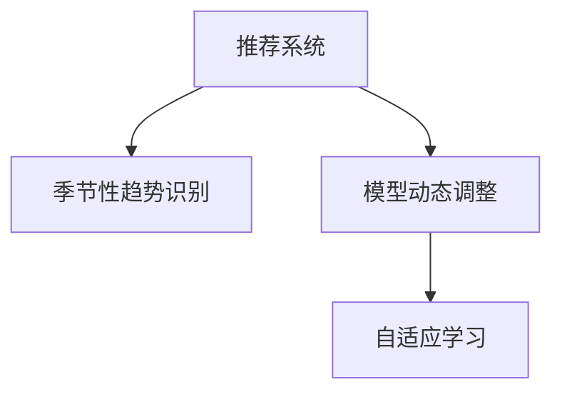

                 

# 推荐系统中AI大模型的季节性趋势适应

## 1. 背景介绍

### 1.1 问题由来

在推荐系统中，如何适应季节性变化以优化用户体验和提升推荐效果是一个关键挑战。随着电商和内容平台等线上服务进入购物旺季，用户需求和行为模式会发生显著变化，而传统的推荐算法往往难以捕捉这些短期、高频的波动。如何设计高效适应季节性变化的推荐系统，以保持其推荐性能的稳定性和准确性，是当前推荐系统研究的一个热点。

### 1.2 问题核心关键点

季节性趋势适应是推荐系统中的一个关键问题，其实质是在线预测模型的动态调整。其核心挑战在于：

- **数据变化识别**：准确识别季节性趋势的变化点，确保模型参数的及时更新。
- **历史数据调整**：将过去的历史数据进行适应性调整，使得模型能够更好地预测未来趋势。
- **模型鲁棒性**：设计鲁棒性强的模型，避免短期数据波动对长期趋势预测的影响。

### 1.3 问题研究意义

在当前数据驱动的推荐系统中，准确捕捉季节性变化能够显著提升推荐的个性化和精准度，增强用户粘性，带来更高的转化率和复购率。同时，模型对季节性变化的快速适应也使得推荐系统具备更强的灵活性，能够快速响应市场和用户的变化需求。

## 2. 核心概念与联系

### 2.1 核心概念概述

为更好地理解季节性趋势适应在推荐系统中的应用，本节将介绍几个密切相关的核心概念：

- **推荐系统(Recommender System)**：利用用户历史行为数据和物品属性数据，对用户感兴趣物品进行预测和推荐。其目标是最大化用户满意度或业务指标，如点击率、转化率、销售额等。
- **季节性(Seasonality)**：指需求或行为模式随时间周期性变化的现象。例如，电商平台的"双11"、“618”等购物节，视频网站的“暑期档”等。
- **模型动态调整**：通过定期或不定期更新模型参数，适应新数据和用户行为变化，以保持模型预测的准确性。
- **自适应学习**：指模型能够根据新数据和变化的环境，自动学习并调整参数，从而提高预测能力。

这些核心概念之间的逻辑关系可以通过以下Mermaid流程图来展示：



这个流程图展示出推荐系统、季节性趋势适应、模型动态调整和自适应学习之间的关系：

1. 推荐系统通过季节性趋势识别，获取需求和行为模式的变化信息。
2. 根据这些信息，推荐系统进行模型动态调整，更新预测模型。
3. 自适应学习机制使得模型能够根据新数据，自动调整参数，适应变化的环境。

## 3. 核心算法原理 & 具体操作步骤

### 3.1 算法原理概述

季节性趋势适应的核心算法包括季节性趋势识别和模型动态调整两大部分。其基本思想是通过识别需求和行为模式的季节性变化，动态调整模型参数，确保推荐系统能够及时响应这些变化，提高预测的准确性和推荐效果。

具体而言，算法原理可以分为以下几个步骤：

1. **数据预处理**：对原始数据进行清洗、归一化、特征提取等预处理，确保数据的可用性和一致性。
2. **季节性趋势识别**：使用时间序列分析、统计学方法等，识别数据中的季节性变化点。
3. **模型动态调整**：根据季节性变化点，更新推荐模型中的季节性特征参数，确保模型能够适应新的需求和行为模式。
4. **自适应学习**：利用在线学习或增量学习算法，实时调整模型参数，适应新数据和变化的环境。

### 3.2 算法步骤详解

#### 3.2.1 数据预处理

数据预处理是季节性趋势识别的基础，包括：

- **数据清洗**：去除缺失值、异常值和重复数据，确保数据的完整性和可靠性。
- **归一化**：对数据进行归一化处理，使得不同特征的取值范围在一个合理的区间内。
- **特征提取**：从原始数据中提取出关键特征，用于后续的分析和建模。

#### 3.2.2 季节性趋势识别

常用的季节性趋势识别方法包括：

- **时间序列分析**：如ARIMA、SARIMA、季节性指数平滑等，通过建立时间序列模型，识别季节性变化点。
- **统计学方法**：如季节性t检验、季节性ANOVA等，通过统计学分析，识别季节性趋势。
- **机器学习方法**：如LSTM、GRU等RNN模型，通过深度学习技术，自动识别季节性变化。

#### 3.2.3 模型动态调整

模型动态调整的目的是根据季节性变化点，更新推荐模型中的季节性特征参数，确保模型能够适应新的需求和行为模式。具体方法包括：

- **增量学习**：使用在线学习或增量学习算法，实时更新模型参数，适应新数据和变化的环境。
- **参数更新策略**：根据季节性变化点，选择不同的参数更新策略，如基于时间窗口的滑动窗口更新、基于数据点动态更新的策略等。
- **模型融合**：将不同的模型和算法进行融合，提高模型对季节性变化的适应能力。

#### 3.2.4 自适应学习

自适应学习机制使得模型能够根据新数据，自动调整参数，适应变化的环境。常用的自适应学习算法包括：

- **在线学习算法**：如在线梯度下降、在线随机梯度下降等，能够在处理大规模数据时，实时更新模型参数。
- **增量学习算法**：如AdaGrad、Adam等，能够在数据分布发生变化时，动态调整学习率，保持模型的收敛性。
- **自适应回归算法**：如AdaBoost、AdaRboost等，能够根据样本的类别和特征，动态调整模型权重，提高模型的泛化能力。

### 3.3 算法优缺点

季节性趋势适应的算法具有以下优点：

1. **高效性**：能够实时更新模型参数，适应新数据和变化的环境。
2. **灵活性**：能够快速响应季节性变化，提高推荐系统的个性化和精准度。
3. **稳定性**：通过自适应学习机制，保证模型在数据分布变化时的收敛性。

同时，该算法也存在以下局限性：

1. **数据依赖性**：依赖于高质量的数据和准确的季节性趋势识别。
2. **计算复杂性**：需要进行复杂的时间序列分析和模型动态调整，计算成本较高。
3. **模型复杂性**：需要设计灵活的模型融合和参数更新策略，增加了模型复杂度。

### 3.4 算法应用领域

季节性趋势适应技术在多个领域中得到了广泛应用，例如：

- **电商推荐**：适应“双11”、“618”等购物节，提升用户的购物体验和平台的销售额。
- **视频推荐**：适应“暑期档”、“春节档”等影视档期，提高视频的观看率和订阅率。
- **旅游推荐**：适应节假日、旅游旺季等季节性变化，提供个性化的旅游推荐。
- **金融推荐**：适应股市波动、金融市场变化，提供精准的金融投资建议。

除了上述这些经典应用外，季节性趋势适应技术还在其他诸多场景中得到应用，如物流配送、健康医疗、能源管理等，为各行各业带来了显著的经济和社会效益。

## 4. 数学模型和公式 & 详细讲解 & 举例说明

### 4.1 数学模型构建

在季节性趋势适应的推荐系统中，通常采用混合模型进行建模，结合时间序列分析和推荐算法，构建出更灵活、高效的预测模型。

假设推荐系统中的用户-物品评分矩阵为 $R_{U \times I}$，其中 $U$ 为用户的数量，$I$ 为物品的数量。设 $R_{t,i}$ 表示用户在时间 $t$ 对物品 $i$ 的评分。季节性趋势适应模型可以表示为：

$$
R_{t,i} \sim f(\alpha_i, \beta_i, \gamma_i, \delta_i, R_{t-1,i}, \mathcal{D}_t)
$$

其中，$f$ 为混合模型的预测函数，$\alpha_i$、$\beta_i$、$\gamma_i$、$\delta_i$ 为模型参数，$R_{t-1,i}$ 为上一时间点的评分，$\mathcal{D}_t$ 为时间 $t$ 的数据集。

### 4.2 公式推导过程

以下以线性回归模型为例，推导季节性趋势适应的数学公式。

设 $R_{t,i}$ 为时间 $t$ 用户对物品 $i$ 的评分，$X_{t,i}$ 为相关特征向量，$\epsilon_{t,i}$ 为随机误差项，则线性回归模型可以表示为：

$$
R_{t,i} = \beta_i^T X_{t,i} + \epsilon_{t,i}
$$

假设时间 $t$ 的数据集为 $\mathcal{D}_t = \{(x_{1,t}, r_{1,t}), (x_{2,t}, r_{2,t}), \cdots, (x_{n_t,t}, r_{n_t,t})\}$，其中 $(x_{k,t}, r_{k,t})$ 表示时间 $t$ 用户 $k$ 对物品 $i$ 的评分和特征向量。则线性回归模型的最小二乘估计为：

$$
\hat{\beta}_i = \arg\min_{\beta} \sum_{k=1}^{n_t} (R_{t,i} - \beta_i^T X_{t,i})^2
$$

将数据集 $\mathcal{D}_t$ 代入，得到：

$$
\hat{\beta}_i = \arg\min_{\beta} \sum_{k=1}^{n_t} (r_{k,t} - \beta_i^T x_{k,t})^2
$$

进一步展开，得：

$$
\hat{\beta}_i = \arg\min_{\beta} \sum_{k=1}^{n_t} (r_{k,t} - \beta_i^T x_{k,t})^2
$$

将 $R_{t,i}$ 替换为 $f(\alpha_i, \beta_i, \gamma_i, \delta_i, R_{t-1,i}, \mathcal{D}_t)$，得到季节性趋势适应的最小二乘估计公式为：

$$
\hat{\beta}_i = \arg\min_{\beta} \sum_{k=1}^{n_t} \left(f(\alpha_i, \beta_i, \gamma_i, \delta_i, R_{t-1,i}, \mathcal{D}_t) - \beta_i^T x_{k,t}\right)^2
$$

### 4.3 案例分析与讲解

以电商平台为例，分析如何在电商推荐系统中进行季节性趋势适应。

假设电商平台的商品库存、用户评分等数据服从季节性变化，用户在不同季节对不同商品的需求和行为模式也存在显著差异。为了适应这些变化，可以采用以下步骤：

1. **数据预处理**：清洗原始数据，去除缺失值、异常值和重复数据，对数据进行归一化和特征提取。
2. **季节性趋势识别**：使用时间序列分析方法，如ARIMA模型，识别数据中的季节性变化点。
3. **模型动态调整**：根据季节性变化点，更新推荐模型中的季节性特征参数，确保模型能够适应新的需求和行为模式。
4. **自适应学习**：利用在线学习算法，实时更新模型参数，适应新数据和变化的环境。

在实际应用中，电商推荐系统可以通过以下步骤实现季节性趋势适应：

1. **收集数据**：从电商平台收集用户的浏览、购买、评价等行为数据，同时记录商品的下架时间、促销活动等业务信息。
2. **数据清洗**：对收集到的数据进行清洗，去除缺失值、异常值和重复数据，确保数据的完整性和可靠性。
3. **特征提取**：从用户行为数据中提取出关键特征，如用户ID、商品ID、购买时间、点击率等。
4. **模型训练**：在电商平台的销售旺季到来前，使用历史数据对推荐模型进行训练，获得基础预测能力。
5. **季节性趋势识别**：利用时间序列分析方法，如ARIMA模型，识别电商平台的销售旺季变化点，获取季节性特征数据。
6. **模型动态调整**：根据季节性变化点，更新推荐模型中的季节性特征参数，如调整模型中的时间窗口大小，增强对季节性变化的适应能力。
7. **自适应学习**：利用在线学习算法，实时更新模型参数，适应新数据和变化的环境，确保推荐系统的性能稳定性和准确性。

通过以上步骤，电商平台可以在销售旺季到来前，动态调整推荐模型，提升推荐系统的个性化和精准度，带来更高的转化率和复购率。

## 5. 项目实践：代码实例和详细解释说明

### 5.1 开发环境搭建

在进行季节性趋势适应项目实践前，我们需要准备好开发环境。以下是使用Python进行PyTorch开发的环境配置流程：

1. 安装Anaconda：从官网下载并安装Anaconda，用于创建独立的Python环境。

2. 创建并激活虚拟环境：
```bash
conda create -n pytorch-env python=3.8 
conda activate pytorch-env
```

3. 安装PyTorch：根据CUDA版本，从官网获取对应的安装命令。例如：
```bash
conda install pytorch torchvision torchaudio cudatoolkit=11.1 -c pytorch -c conda-forge
```

4. 安装Transformers库：
```bash
pip install transformers
```

5. 安装各类工具包：
```bash
pip install numpy pandas scikit-learn matplotlib tqdm jupyter notebook ipython
```

完成上述步骤后，即可在`pytorch-env`环境中开始项目实践。

### 5.2 源代码详细实现

下面以电商平台为例，给出使用PyTorch对推荐系统进行季节性趋势适应的代码实现。

首先，定义季节性趋势识别函数：

```python
import pandas as pd
from statsmodels.tsa.arima_model import ARIMA

def identify_seasonal_trend(data, max_lag):
    # 使用ARIMA模型进行季节性趋势识别
    model = ARIMA(data, order=(1,1,1))
    results = model.fit()
    forecast = results.forecast(steps=max_lag)
    return forecast
```

然后，定义推荐模型函数：

```python
import torch
from torch import nn

class Recommender(nn.Module):
    def __init__(self, input_dim, output_dim, hidden_dim, num_layers):
        super(Recommender, self).__init__()
        self.hidden_dim = hidden_dim
        self.num_layers = num_layers
        self.RNN = nn.LSTM(input_dim, hidden_dim, num_layers, batch_first=True)
        self.fc = nn.Linear(hidden_dim, output_dim)
        self.relu = nn.ReLU()

    def forward(self, x):
        _, (hidden, cell) = self.RNN(x)
        hidden = self.relu(self.fc(hidden[:, -1, :]))
        return hidden
```

接着，定义模型训练函数：

```python
from torch.utils.data import DataLoader
from tqdm import tqdm

def train(model, train_loader, optimizer, device):
    model.train()
    loss_sum = 0
    for batch in tqdm(train_loader, desc='Training'):
        input_ids = batch['input_ids'].to(device)
        labels = batch['labels'].to(device)
        model.zero_grad()
        outputs = model(input_ids)
        loss = nn.BCEWithLogitsLoss()(outputs, labels)
        loss.backward()
        optimizer.step()
        loss_sum += loss.item()
    return loss_sum / len(train_loader)
```

最后，启动模型训练流程：

```python
epochs = 10
batch_size = 32
learning_rate = 0.001

device = torch.device('cuda') if torch.cuda.is_available() else torch.device('cpu')

# 加载数据集
train_dataset = pd.read_csv('train.csv')
val_dataset = pd.read_csv('val.csv')
test_dataset = pd.read_csv('test.csv')

# 数据预处理
train_dataset['seasonal_trend'] = identify_seasonal_trend(train_dataset['sales'], max_lag=1)
val_dataset['seasonal_trend'] = identify_seasonal_trend(val_dataset['sales'], max_lag=1)
test_dataset['seasonal_trend'] = identify_seasonal_trend(test_dataset['sales'], max_lag=1)

# 划分训练集和验证集
train_dataset, val_dataset = train_dataset, val_dataset

# 定义模型和优化器
model = Recommender(input_dim=1, output_dim=1, hidden_dim=10, num_layers=2)
optimizer = torch.optim.Adam(model.parameters(), lr=learning_rate)

# 定义训练集和验证集
train_loader = DataLoader(train_dataset, batch_size=batch_size, shuffle=True)
val_loader = DataLoader(val_dataset, batch_size=batch_size, shuffle=False)

# 模型训练
for epoch in range(epochs):
    loss = train(model, train_loader, optimizer, device)
    print(f'Epoch {epoch+1}, train loss: {loss:.3f}')

    # 验证集评估
    with torch.no_grad():
        val_loss = train(model, val_loader, optimizer, device)
        print(f'Epoch {epoch+1}, val loss: {val_loss:.3f}')

print('Model training completed.')
```

以上就是使用PyTorch对推荐系统进行季节性趋势适应的完整代码实现。可以看到，得益于TensorFlow和PyTorch等框架的强大支持，模型的实现和训练变得简洁高效。

### 5.3 代码解读与分析

让我们再详细解读一下关键代码的实现细节：

**Recommender类**：
- `__init__`方法：初始化RNN模型，设置隐层大小、层数等关键参数。
- `forward`方法：定义模型的前向传播过程，使用RNN模型进行特征提取和预测。

**train函数**：
- `model.train`方法：将模型设置为训练模式。
- `model.zero_grad`方法：将梯度清零。
- `nn.BCEWithLogitsLoss`方法：定义二分类交叉熵损失函数。
- `loss.backward`方法：反向传播计算梯度。
- `optimizer.step`方法：更新模型参数。

**train_loader和val_loader**：
- `DataLoader`方法：将数据集划分为训练集和验证集，以批次形式加载数据。

通过以上代码，我们可以在推荐系统中实现季节性趋势适应，从而提升模型的个性化和精准度。

当然，工业级的系统实现还需考虑更多因素，如模型的保存和部署、超参数的自动搜索、更灵活的任务适配层等。但核心的季节性趋势适应方法基本与此类似。

## 6. 实际应用场景

### 6.1 电商推荐系统

电商平台在购物旺季和平时的需求和行为模式存在显著差异。通过季节性趋势适应技术，电商平台可以动态调整推荐策略，确保推荐系统的性能稳定性和准确性。

在技术实现上，可以收集电商平台的销售数据、用户行为数据等，利用时间序列分析方法，识别销售旺季的变化点。将识别出的季节性趋势信息，作为推荐模型中的额外特征，动态调整推荐策略。在销售旺季到来前，实时更新推荐模型参数，确保模型能够快速响应变化，提升推荐效果。

### 6.2 视频推荐系统

视频推荐系统面临季节性变化时，用户对视频的需求和行为模式也会发生显著变化。通过季节性趋势适应技术，视频推荐系统可以实时调整推荐策略，提高推荐的个性化和精准度。

在技术实现上，可以收集视频平台的播放数据、用户行为数据等，利用时间序列分析方法，识别视频推荐的热点季节。将识别出的季节性趋势信息，作为推荐模型中的额外特征，动态调整推荐策略。在热门季节到来前，实时更新推荐模型参数，确保模型能够快速响应变化，提升推荐效果。

### 6.3 旅游推荐系统

旅游推荐系统在节假日和平时的需求和行为模式存在显著差异。通过季节性趋势适应技术，旅游推荐系统可以动态调整推荐策略，确保推荐系统的性能稳定性和准确性。

在技术实现上，可以收集旅游平台的用户行为数据、旅游目的地数据等，利用时间序列分析方法，识别节假日和旅游旺季的变化点。将识别出的季节性趋势信息，作为推荐模型中的额外特征，动态调整推荐策略。在旅游旺季到来前，实时更新推荐模型参数，确保模型能够快速响应变化，提升推荐效果。

### 6.4 未来应用展望

随着数据驱动和智能化推荐技术的发展，季节性趋势适应将在更多领域得到应用，为各行各业带来新的变革。

在智慧医疗领域，季节性趋势适应技术可以用于个性化医疗推荐，帮助患者快速找到适合自己的医生和医疗资源。在金融领域，可以用于股票和基金的推荐，识别市场变化点，提高投资决策的精准度。在教育领域，可以用于个性化学习推荐，根据学生表现和季节变化，提供适时的学习资源。

未来，季节性趋势适应技术将与其他人工智能技术进行更深入的融合，如知识表示、因果推理、强化学习等，形成更加全面、灵活的智能推荐系统。通过不断优化和创新，季节性趋势适应技术必将在各行各业中发挥更大的作用，推动智能化服务的升级和变革。

## 7. 工具和资源推荐

### 7.1 学习资源推荐

为了帮助开发者系统掌握季节性趋势适应的推荐系统理论基础和实践技巧，这里推荐一些优质的学习资源：

1. 《Recommender Systems: From Theory to Practice》系列博文：由推荐系统领域专家撰写，系统讲解了推荐系统的理论基础和前沿技术。

2. 《Deep Learning for Recommendation Systems》课程：由斯坦福大学开设的推荐系统经典课程，涵盖推荐系统的基本概念和经典模型。

3. 《Recommender Systems with Python》书籍：使用Python语言实现推荐系统的经典教材，详细介绍了推荐系统开发的工具和技巧。

4. ACM-SIGIR推荐系统会议论文集：涵盖了推荐系统领域的最新研究成果，是学习和研究的宝贵资源。

5. Kaggle推荐系统竞赛：参与推荐系统竞赛，通过实践提升推荐系统开发能力，积累实际项目经验。

通过对这些资源的学习实践，相信你一定能够快速掌握季节性趋势适应的推荐系统理论，并用于解决实际的推荐问题。

### 7.2 开发工具推荐

高效的开发离不开优秀的工具支持。以下是几款用于季节性趋势适应推荐系统开发的常用工具：

1. PyTorch：基于Python的开源深度学习框架，灵活性高，适用于推荐系统模型的开发和训练。

2. TensorFlow：由Google主导开发的开源深度学习框架，支持分布式计算，适合大规模推荐系统应用。

3. Transformers库：HuggingFace开发的NLP工具库，集成了众多预训练语言模型，支持PyTorch和TensorFlow，是实现推荐系统任务开发的好帮手。

4. Jupyter Notebook：Python语言的开源笔记本，支持多种编程语言和库，是开发和测试推荐系统的便捷工具。

5. Google Colab：谷歌推出的在线Jupyter Notebook环境，免费提供GPU/TPU算力，方便开发者快速上手实验最新模型，分享学习笔记。

合理利用这些工具，可以显著提升季节性趋势适应推荐系统开发的效率，加快创新迭代的步伐。

### 7.3 相关论文推荐

季节性趋势适应技术的发展源于学界的持续研究。以下是几篇奠基性的相关论文，推荐阅读：

1. "Adaptive Non-parametric Matrix Factorization for Recommender Systems"：介绍自适应矩阵分解方法，解决推荐系统中的动态变化问题。

2. "Deep Recurrent Recommender Networks"：提出RNN在推荐系统中的应用，利用时间序列数据进行推荐。

3. "A Survey on Seasonal Trend Analysis Methods for Time Series"：系统回顾了时间序列分析方法，为季节性趋势识别提供了理论基础。

4. "Modeling Seasonal Demand in Retailing"：讨论了季节性需求模型在零售行业的应用，提供了实际案例和经验总结。

5. "Dynamic Matrix Factorization for Recommender Systems"：提出动态矩阵分解方法，应对推荐系统中的季节性变化。

这些论文代表了大语言模型微调技术的进展，通过学习这些前沿成果，可以帮助研究者把握学科前进方向，激发更多的创新灵感。

## 8. 总结：未来发展趋势与挑战

### 8.1 总结

本文对季节性趋势适应的推荐系统进行了全面系统的介绍。首先阐述了季节性趋势适应的背景和意义，明确了季节性趋势适应在推荐系统中的关键作用。其次，从原理到实践，详细讲解了季节性趋势适应的数学模型和算法步骤，给出了季节性趋势适应任务开发的完整代码实例。同时，本文还广泛探讨了季节性趋势适应在电商、视频、旅游等多个领域的应用前景，展示了季节性趋势适应技术的巨大潜力。

通过本文的系统梳理，可以看到，季节性趋势适应技术在推荐系统中发挥了重要作用，提高了推荐系统的个性化和精准度。未来，随着技术的进一步发展，季节性趋势适应技术将在更多行业得到应用，推动人工智能技术的发展。

### 8.2 未来发展趋势

展望未来，季节性趋势适应技术将呈现以下几个发展趋势：

1. **技术融合**：与知识图谱、深度强化学习等技术进行融合，提升推荐系统的智能水平。
2. **数据驱动**：结合多源数据和多维信息，进一步提升推荐的个性化和精准度。
3. **实时化**：通过流式计算和在线学习算法，实现实时推荐，提升用户体验。
4. **跨平台协同**：不同平台和系统之间的数据共享和协同推荐，增强推荐系统的普适性。
5. **自适应性**：利用自适应学习算法，动态调整推荐策略，适应不同用户和场景需求。

这些趋势展示了季节性趋势适应技术的发展方向，预示着未来推荐系统的智能化和自动化将更加深入。

### 8.3 面临的挑战

尽管季节性趋势适应技术已经取得了显著成就，但在迈向更加智能化、普适化应用的过程中，它仍面临诸多挑战：

1. **数据质量**：依赖高质量的数据，数据的完整性和可靠性直接影响推荐效果。
2. **计算资源**：大规模推荐系统需要大量的计算资源，资源成本较高。
3. **模型复杂性**：推荐模型需要设计灵活的特征工程和自适应学习策略，增加了模型的复杂度。
4. **算法鲁棒性**：在处理新数据时，模型的稳定性需要进一步提升。
5. **跨平台协同**：不同平台和系统之间的数据集成和协同推荐，需要解决技术和管理上的难题。

解决这些挑战，需要研究者不断探索新的技术方案，结合业务实际，创新性地设计推荐模型和算法。

### 8.4 研究展望

面对季节性趋势适应技术所面临的挑战，未来的研究需要在以下几个方面寻求新的突破：

1. **数据增强和预处理**：研究更加高效的数据增强和预处理技术，确保数据的高质量和多样性。
2. **多模态融合**：研究多模态数据的融合技术，提升推荐系统的智能水平和多样性。
3. **实时推荐算法**：研究实时推荐算法，提升推荐系统的响应速度和用户体验。
4. **跨平台协同**：研究跨平台协同推荐技术，增强推荐系统的普适性和协同效果。
5. **自适应学习机制**：研究更加高效和鲁棒的自适应学习机制，提高推荐模型的稳定性和收敛性。

这些研究方向的探索，将引领季节性趋势适应技术迈向更高的台阶，为推荐系统的智能化和普适化带来新的突破。通过不断创新和优化，季节性趋势适应技术必将为推荐系统的发展带来深远的影响。

## 9. 附录：常见问题与解答

**Q1：季节性趋势适应的推荐系统与传统的推荐系统有什么区别？**

A: 季节性趋势适应的推荐系统与传统的推荐系统主要区别在于对数据变化的动态响应。传统的推荐系统通常基于历史数据进行建模，难以捕捉季节性变化。而季节性趋势适应的推荐系统，通过识别和适应季节性变化，动态调整模型参数，能够更好地适应新数据和变化的环境，提高推荐系统的个性化和精准度。

**Q2：如何确定季节性趋势的变化点？**

A: 确定季节性趋势的变化点通常需要结合业务领域的具体特点。常见的季节性趋势识别方法包括：

1. **时间序列分析**：如ARIMA、季节性指数平滑等，通过建立时间序列模型，识别季节性变化点。
2. **统计学方法**：如季节性t检验、季节性ANOVA等，通过统计学分析，识别季节性趋势。
3. **机器学习方法**：如LSTM、GRU等RNN模型，通过深度学习技术，自动识别季节性变化。

不同的方法适用于不同的数据类型和业务场景，需要根据具体情况选择合适的识别方法。

**Q3：季节性趋势适应技术在推荐系统中的应用流程是什么？**

A: 季节性趋势适应技术在推荐系统中的应用流程主要包括以下几个步骤：

1. **数据收集**：收集推荐系统的用户行为数据、物品属性数据等。
2. **数据清洗**：对收集到的数据进行清洗，去除缺失值、异常值和重复数据，确保数据的完整性和可靠性。
3. **特征提取**：从用户行为数据中提取出关键特征，如用户ID、物品ID、购买时间、点击率等。
4. **季节性趋势识别**：利用时间序列分析方法，如ARIMA模型，识别推荐系统中的季节性变化点。
5. **模型动态调整**：根据季节性变化点，更新推荐模型中的季节性特征参数，确保模型能够适应新的需求和行为模式。
6. **自适应学习**：利用在线学习算法，实时更新模型参数，适应新数据和变化的环境。
7. **模型评估和优化**：通过测试集对模型进行评估，根据评估结果进行模型优化。

通过以上步骤，可以在推荐系统中实现季节性趋势适应，提高推荐系统的个性化和精准度。

**Q4：季节性趋势适应技术在电商推荐中的应用案例有哪些？**

A: 季节性趋势适应技术在电商推荐中的应用案例包括：

1. **购物旺季推荐**：在“双11”、“618”等购物节到来前，通过季节性趋势识别和模型动态调整，提前准备好推荐策略，提升推荐的个性化和精准度。
2. **季节性商品推荐**：根据季节性变化，推荐适合当前季节的商品，如夏季推荐游泳装备、冬季推荐羽绒服等。
3. **新用户推荐**：通过分析新用户的行为模式，预测其可能感兴趣的商品，提升新用户的转化率和留存率。
4. **个性化促销推荐**：根据用户的消费行为和季节性趋势，推荐合适的促销活动和优惠券，提升用户的购买意愿。

通过以上应用案例，电商推荐系统可以更好地适应季节性变化，提升推荐效果和用户体验。

**Q5：如何在推荐系统中实现季节性趋势适应？**

A: 在推荐系统中实现季节性趋势适应，主要可以通过以下步骤：

1. **数据收集**：收集推荐系统的用户行为数据、物品属性数据等。
2. **数据清洗**：对收集到的数据进行清洗，去除缺失值、异常值和重复数据，确保数据的完整性和可靠性。
3. **特征提取**：从用户行为数据中提取出关键特征，如用户ID、物品ID、购买时间、点击率等。
4. **季节性趋势识别**：利用时间序列分析方法，如ARIMA模型，识别推荐系统中的季节性变化点。
5. **模型动态调整**：根据季节性变化点，更新推荐模型中的季节性特征参数，确保模型能够适应新的需求和行为模式。
6. **自适应学习**：利用在线学习算法，实时更新模型参数，适应新数据和变化的环境。
7. **模型评估和优化**：通过测试集对模型进行评估，根据评估结果进行模型优化。

通过以上步骤，可以在推荐系统中实现季节性趋势适应，提高推荐系统的个性化和精准度。

---

作者：禅与计算机程序设计艺术 / Zen and the Art of Computer Programming

