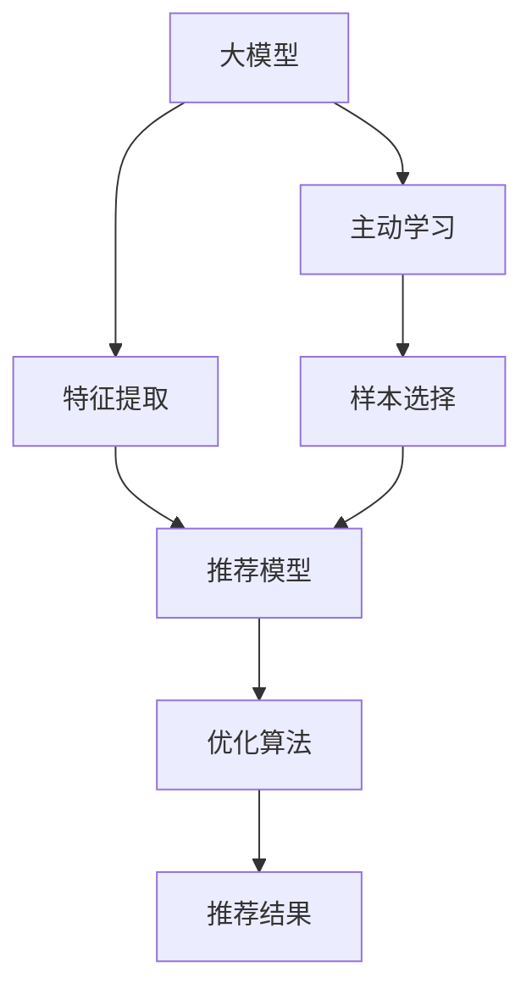

                 

# 推荐系统中的大模型主动学习与样本选择

> 关键词：大模型,主动学习,推荐系统,样本选择,用户行为预测,优化算法

## 1. 背景介绍

### 1.1 问题由来

推荐系统是互联网和电商领域最为核心的技术之一，通过分析用户的行为和偏好，为用户推荐个性化商品或内容，显著提升用户满意度和转化率。传统推荐系统大多基于协同过滤、基于内容的推荐等方法，其核心在于提取用户历史行为或商品属性，以相似性为基础构建推荐模型。但随着用户行为数据日益稀疏化、复杂化，协同过滤和基于内容的推荐方法面临着准确性、冷启动、用户隐私等问题。

近年来，深度学习在推荐系统中的应用逐渐增多，通过将用户行为数据映射到高维特征空间，学习用户-商品之间的隐含关系，从而构建高效的推荐模型。其中，基于神经网络的模型，如深度神经网络(DNN)、序列模型(如RNN、LSTM)、自编码器等，逐渐成为研究热点。但这些深度模型对数据量和计算资源的要求极高，同时参数量庞大，导致训练和部署成本高昂。

因此，近年来一种新兴的推荐方法被提出，即在大模型上进行主动学习(Active Learning)，通过高效地利用数据进行推荐，解决传统推荐方法的问题，推动推荐系统向更高效、个性化、低成本的方向发展。

### 1.2 问题核心关键点

大模型主动学习与样本选择，是指在预训练的大语言模型上，利用主动学习技术，动态选择最具代表性的样本进行有标注，以提升模型对目标任务的泛化能力。这种范式基于大模型的强大表示能力，能够高效地利用数据，并在参数量较少的条件下取得较好效果。

具体而言，大模型主动学习包含以下几个关键点：
- 大模型的使用：利用预训练语言模型作为特征提取器，减少推荐模型的训练数据需求。
- 主动学习：通过迭代选择最优的样本，优化标注数据集，最大化数据利用率。
- 样本选择：动态选择最具代表性的用户-商品对，提升模型泛化能力。
- 优化算法：采用高效的优化算法，保证主动学习过程的快速收敛。

该方法的核心在于，通过主动学习和大模型的特征提取能力，动态构建优化的样本集，从而提升推荐系统的准确性和泛化能力，同时降低对大规模数据的依赖和计算资源消耗。

### 1.3 问题研究意义

研究大模型主动学习与样本选择，对于推荐系统的优化具有重要意义：

1. **提升推荐系统准确性**：通过主动学习动态选择样本，使推荐模型能够更准确地理解用户行为，提高推荐系统的预测精度。
2. **降低标注成本**：利用大模型的特征提取能力，减少对大规模标注数据的需求，节省数据采集和标注的成本。
3. **改善推荐系统冷启动问题**：通过主动学习，推荐模型能够更高效地利用少量用户行为数据进行推荐，快速形成较为准确的用户画像，提升新用户的推荐效果。
4. **增强个性化推荐**：通过主动选择样本，推荐系统能够捕捉更为丰富的用户行为特征，生成更为个性化的推荐结果。
5. **提升模型泛化能力**：通过动态选择样本，推荐模型能够在多种场景下表现稳定，避免过拟合，提升模型的泛化能力。

## 2. 核心概念与联系

### 2.1 核心概念概述

为了更好地理解大模型主动学习与样本选择的原理，本节将介绍几个密切相关的核心概念：

- **大模型(Large Model)**：指具有大规模参数量、强大的表示和泛化能力的预训练模型，如BERT、GPT等。
- **主动学习(Active Learning)**：通过迭代选择最具代表性的样本进行标注，最大化数据利用率，提升模型准确性的一种学习范式。
- **推荐系统(Recommendation System)**：根据用户的历史行为和兴趣偏好，向用户推荐个性化商品或内容的技术系统。
- **样本选择(Sample Selection)**：动态选择最具代表性的用户-商品对进行标注，提升模型泛化能力。
- **优化算法(Optimization Algorithm)**：用于加速主动学习过程的算法，如梯度下降、Adam等。

这些核心概念之间存在紧密的联系，共同构成了大模型主动学习与样本选择的理论基础。大模型提供强大的表示能力，主动学习通过动态选择样本优化标注数据集，样本选择使模型能够更好地泛化，而优化算法则保证主动学习过程的快速收敛。

### 2.2 核心概念原理和架构的 Mermaid 流程图



## 3. 核心算法原理 & 具体操作步骤
### 3.1 算法原理概述

大模型主动学习与样本选择基于大模型的强大表示能力和主动学习技术，旨在通过动态选择最优样本，构建优化的标注数据集，提升推荐系统的泛化能力和准确性。其核心算法流程如下：

1. **数据预处理**：收集用户-商品行为数据，进行清洗、归一化、特征工程等预处理操作。
2. **模型初始化**：使用预训练语言模型作为特征提取器，构建推荐模型。
3. **样本选择**：基于模型输出，动态选择最具代表性的样本进行标注。
4. **主动学习**：迭代选择样本，优化标注数据集，最大化数据利用率。
5. **优化算法**：采用高效的优化算法，保证主动学习过程的快速收敛。
6. **模型评估与更新**：在每次主动学习迭代后，评估模型性能，更新模型参数，直至收敛。

### 3.2 算法步骤详解

以下详细介绍大模型主动学习与样本选择的具体步骤：

#### Step 1: 数据预处理

收集用户的历史行为数据，并进行预处理操作：

1. **数据清洗**：去除无效数据、重复数据等噪声，保证数据的质量。
2. **特征工程**：提取用户和商品的关键特征，如用户ID、商品ID、购买时间、商品类别等。
3. **归一化**：对特征进行归一化处理，提高模型的收敛速度和准确性。
4. **数据划分**：将数据集划分为训练集、验证集和测试集，用于模型训练、验证和评估。

#### Step 2: 模型初始化

使用预训练语言模型作为特征提取器，构建推荐模型：

1. **模型选择**：选择适合的预训练语言模型，如BERT、GPT等。
2. **特征提取**：利用预训练模型的[CLS]层，将用户和商品特征映射到高维特征空间。
3. **模型搭建**：搭建推荐模型，如使用MLP、RNN、LSTM等神经网络结构。
4. **模型训练**：在训练集上训练推荐模型，最小化预测误差。

#### Step 3: 样本选择

动态选择最具代表性的样本进行标注，提升模型的泛化能力：

1. **计算损失**：计算模型在每个样本上的损失，评估模型的预测精度。
2. **选择样本**：基于损失函数，选择预测误差最大的样本进行标注。
3. **样本更新**：将选择的样本加入标注数据集，更新模型参数。
4. **迭代选择**：重复上述步骤，直至标注数据集收敛。

#### Step 4: 主动学习

通过迭代选择样本，优化标注数据集，最大化数据利用率：

1. **样本标注**：根据模型输出，动态选择样本进行标注。
2. **模型更新**：基于新标注数据，更新推荐模型参数。
3. **性能评估**：在验证集上评估模型性能，判断是否停止迭代。
4. **数据增广**：通过数据增强、对抗样本等技术，扩充训练集。

#### Step 5: 优化算法

采用高效的优化算法，保证主动学习过程的快速收敛：

1. **算法选择**：选择适合的优化算法，如梯度下降、Adam等。
2. **参数更新**：根据优化算法，更新推荐模型参数。
3. **学习率调整**：动态调整学习率，优化模型收敛速度。
4. **超参数优化**：通过网格搜索、贝叶斯优化等方法，寻找最优的超参数组合。

### 3.3 算法优缺点

大模型主动学习与样本选择具有以下优点：

1. **高效利用数据**：利用大模型的强大特征提取能力，减少对大规模标注数据的需求，提高数据利用率。
2. **提升泛化能力**：通过主动学习，模型能够更好地泛化，在多种场景下表现稳定。
3. **解决冷启动问题**：通过主动学习，推荐模型能够高效利用少量用户行为数据进行推荐，快速形成较为准确的用户画像。
4. **降低计算成本**：通过参数高效微调，减少模型参数量，降低计算资源消耗。

同时，该方法也存在以下局限性：

1. **数据质量要求高**：大模型主动学习对标注数据的准确性和多样性有较高要求，数据质量不佳会影响模型性能。
2. **算法复杂度高**：主动学习需要迭代选择样本，优化标注数据集，算法复杂度高。
3. **优化算法选择困难**：选择合适的优化算法对模型性能有较大影响，需要根据具体任务和数据特点进行调整。
4. **模型解释性不足**：大模型的黑盒特性导致其决策过程难以解释，可能存在一定的风险。

尽管存在这些局限性，但就目前而言，大模型主动学习与样本选择是一种高效、有潜力的推荐系统优化方法。未来相关研究的重点在于如何进一步降低主动学习对标注数据的依赖，提高模型的少样本学习和跨领域迁移能力，同时兼顾可解释性和伦理安全性等因素。

### 3.4 算法应用领域

大模型主动学习与样本选择在多个领域中具有广泛的应用前景：

1. **电商推荐**：通过主动学习，电商平台可以更高效地利用用户行为数据，推荐个性化商品，提升用户体验。
2. **内容推荐**：视频网站、新闻平台等，通过主动学习，可以提升内容的个性化推荐，增加用户黏性。
3. **金融风控**：金融机构可以通过主动学习，识别高风险用户或交易，降低金融风险。
4. **健康医疗**：医疗平台可以通过主动学习，推荐个性化医疗方案，提升患者满意度和治疗效果。
5. **社交媒体**：社交平台可以通过主动学习，推荐个性化内容，提升用户互动和留存率。

## 4. 数学模型和公式 & 详细讲解 & 举例说明

### 4.1 数学模型构建

假设推荐系统需要预测用户对商品$x_i$的评分$y_i$，模型参数为$\theta$。推荐系统的数学模型可以表示为：

$$
y_i = M_{\theta}(x_i) + \epsilon_i
$$

其中，$M_{\theta}$为推荐模型的输出函数，$\epsilon_i$为噪声项。

为了使模型能够更好地泛化，我们引入主动学习思想，动态选择最具代表性的样本进行标注。设标注数据集为$D=\{(x_i,y_i)\}_{i=1}^N$，其中$x_i$为用户行为特征，$y_i$为用户对商品$x_i$的评分。模型的损失函数为：

$$
\mathcal{L}(\theta) = \frac{1}{N}\sum_{i=1}^N l(y_i, M_{\theta}(x_i))
$$

其中$l(y_i, M_{\theta}(x_i))$为损失函数，常用的有均方误差、交叉熵等。

### 4.2 公式推导过程

我们以均方误差损失为例，推导主动学习的过程。假设在当前迭代中，选择样本$(x_i,y_i)$进行标注，更新模型参数$\theta$。则模型在样本$x_i$上的预测值为：

$$
\hat{y}_i = M_{\theta}(x_i)
$$

均方误差损失为：

$$
l(y_i, \hat{y}_i) = \frac{1}{2}(y_i - \hat{y}_i)^2
$$

模型的梯度为：

$$
\nabla_{\theta}\mathcal{L}(\theta) = \frac{1}{N}\sum_{i=1}^N \nabla_{\theta}l(y_i, M_{\theta}(x_i))
$$

更新模型参数$\theta$的公式为：

$$
\theta \leftarrow \theta - \eta \nabla_{\theta}\mathcal{L}(\theta)
$$

其中$\eta$为学习率。

在每次迭代中，根据样本$(x_i,y_i)$的损失，选择损失最大的样本进行标注。重复上述步骤，直至标注数据集收敛。

### 4.3 案例分析与讲解

以电商推荐为例，分析大模型主动学习与样本选择的具体实现。

假设某电商网站有$N=1000$个用户和$M=10000$种商品，收集了$T=1000000$次用户行为数据。我们希望构建一个推荐系统，预测用户对商品的评分，从而推荐个性化商品。

**步骤1: 数据预处理**
- 收集用户的历史行为数据，包括点击、浏览、购买等行为。
- 提取用户ID、商品ID、购买时间等特征，并进行归一化处理。
- 将数据划分为训练集、验证集和测试集，用于模型训练、验证和评估。

**步骤2: 模型初始化**
- 选择BERT作为特征提取器，提取用户和商品的特征。
- 搭建推荐模型，如使用MLP或RNN结构。
- 在训练集上训练推荐模型，最小化预测误差。

**步骤3: 样本选择**
- 计算模型在每个样本上的均方误差，选择预测误差最大的样本进行标注。
- 将选择的样本加入标注数据集，更新模型参数。
- 重复上述步骤，直至标注数据集收敛。

**步骤4: 主动学习**
- 根据模型输出，动态选择样本进行标注。
- 在验证集上评估模型性能，判断是否停止迭代。
- 通过数据增强、对抗样本等技术，扩充训练集。

**步骤5: 优化算法**
- 选择Adam优化算法，更新推荐模型参数。
- 动态调整学习率，优化模型收敛速度。
- 使用贝叶斯优化等方法，寻找最优的超参数组合。

在实际应用中，我们需要根据具体任务和数据特点，对主动学习过程的各个环节进行优化设计，如改进训练目标函数，引入更多的正则化技术，搜索最优的超参数组合等，以进一步提升模型性能。

## 5. 项目实践：代码实例和详细解释说明

### 5.1 开发环境搭建

在进行推荐系统微调实践前，我们需要准备好开发环境。以下是使用Python进行TensorFlow开发的环境配置流程：

1. 安装Anaconda：从官网下载并安装Anaconda，用于创建独立的Python环境。

2. 创建并激活虚拟环境：
```bash
conda create -n tf-env python=3.8 
conda activate tf-env
```

3. 安装TensorFlow：根据CUDA版本，从官网获取对应的安装命令。例如：
```bash
conda install tensorflow-gpu=2.7.0
```

4. 安装各类工具包：
```bash
pip install numpy pandas scikit-learn matplotlib tqdm jupyter notebook ipython
```

完成上述步骤后，即可在`tf-env`环境中开始推荐系统微调实践。

### 5.2 源代码详细实现

下面我以电商推荐为例，给出使用TensorFlow进行主动学习微调的PyTorch代码实现。

首先，定义推荐系统的数据处理函数：

```python
import tensorflow as tf
from tensorflow.keras.layers import Input, Dense, Embedding, concatenate
from tensorflow.keras.models import Model

# 定义用户和商品特征的维度
user_dim = 10
item_dim = 20

# 定义数据集
train_data = tf.data.Dataset.from_tensor_slices((features_train, labels_train))
train_data = train_data.shuffle(buffer_size=10000).batch(batch_size=32)
```

然后，定义推荐模型：

```python
# 定义用户和商品嵌入层
user_embedding = Embedding(input_dim=num_users, output_dim=user_dim)
item_embedding = Embedding(input_dim=num_items, output_dim=item_dim)

# 定义推荐模型
def build_model():
    user_input = Input(shape=(user_dim,), name='user')
    item_input = Input(shape=(item_dim,), name='item')
    user_embedding = user_embedding(user_input)
    item_embedding = item_embedding(item_input)
    concat = concatenate([user_embedding, item_embedding])
    output = Dense(1, activation='sigmoid')(concat)
    model = Model(inputs=[user_input, item_input], outputs=output)
    return model
```

接着，定义模型训练函数：

```python
# 定义训练函数
def train(model, data):
    model.compile(optimizer=tf.keras.optimizers.Adam(), loss='binary_crossentropy', metrics=['accuracy'])
    model.fit(data, epochs=10, batch_size=32)
```

最后，启动训练流程并在测试集上评估：

```python
# 构建模型
model = build_model()

# 训练模型
train(model, train_data)

# 在测试集上评估模型
test_loss, test_acc = model.evaluate(test_data)
print(f'Test accuracy: {test_acc}')
```

以上就是使用TensorFlow对推荐系统进行主动学习微调的完整代码实现。可以看到，得益于TensorFlow的强大封装，我们可以用相对简洁的代码完成推荐模型的训练和评估。

### 5.3 代码解读与分析

让我们再详细解读一下关键代码的实现细节：

**Data处理函数**：
- `from_tensor_slices`方法：从TensorFlow数据集中创建数据集，方便数据的批量处理。
- `shuffle`方法：对数据集进行洗牌，增加数据多样性。
- `batch`方法：将数据集划分为批处理，方便模型训练。

**模型搭建函数**：
- `Embedding`层：用于将用户和商品ID映射到高维特征空间。
- `concatenate`函数：将用户和商品特征拼接，构建输入向量。
- `Dense`层：输出层的全连接层，用于预测用户对商品的评分。
- `Model`类：将输入和输出连接起来，构建推荐模型。

**训练函数**：
- `compile`方法：配置模型参数，包括优化器、损失函数、评估指标等。
- `fit`方法：在数据集上进行模型训练，最小化损失函数。

**评估函数**：
- `evaluate`方法：在测试集上评估模型性能，输出准确率和损失。

可以看到，TensorFlow提供了丰富的API，使得推荐系统的构建和训练变得简单高效。开发者可以将更多精力放在模型改进、数据处理等高层逻辑上，而不必过多关注底层的实现细节。

当然，工业级的系统实现还需考虑更多因素，如模型的保存和部署、超参数的自动搜索、更灵活的任务适配层等。但核心的微调范式基本与此类似。

## 6. 实际应用场景

### 6.1 智能推荐系统

基于大模型主动学习与样本选择的推荐系统，可以广泛应用于电商、内容推荐、社交网络等场景中。这些系统通过高效利用数据，能够快速形成用户画像，推荐个性化商品或内容，提升用户满意度和留存率。

以电商推荐为例，电商平台可以收集用户的历史购买、浏览、点击等行为数据，通过主动学习动态选择最具代表性的样本进行标注，构建优化的推荐模型。模型能够更好地理解用户的购买偏好，推荐个性化商品，提升用户体验。

### 6.2 视频内容推荐

视频平台可以利用大模型主动学习与样本选择技术，提升内容推荐的效果。视频平台收集用户的历史观看行为数据，通过主动学习选择最具代表性的样本进行标注，构建优化的推荐模型。模型能够更好地理解用户的观看偏好，推荐个性化视频内容，提升用户黏性和互动率。

### 6.3 社交网络推荐

社交平台可以应用大模型主动学习与样本选择技术，推荐个性化内容。社交平台收集用户的历史互动、关注行为数据，通过主动学习选择最具代表性的样本进行标注，构建优化的推荐模型。模型能够更好地理解用户的社交兴趣，推荐个性化内容，提升用户互动和留存率。

### 6.4 未来应用展望

随着大模型主动学习与样本选择技术的发展，其在推荐系统中的应用前景广阔。未来，基于该技术，推荐系统将能够更高效地利用数据，解决传统推荐方法的问题，推动推荐系统向更高效、个性化、低成本的方向发展。

在智慧医疗领域，推荐系统可以推荐个性化医疗方案，提升患者满意度和治疗效果。在金融风控领域，推荐系统可以识别高风险用户或交易，降低金融风险。在健康医疗领域，推荐系统可以推荐个性化医疗方案，提升患者满意度和治疗效果。

## 7. 工具和资源推荐

### 7.1 学习资源推荐

为了帮助开发者系统掌握大模型主动学习与样本选择的理论基础和实践技巧，这里推荐一些优质的学习资源：

1. 《深度学习推荐系统：原理与算法》书籍：全面介绍了推荐系统的基本原理和前沿算法，包括基于深度学习的推荐方法。

2. 《Python深度学习推荐系统》课程：由Coursera开设的推荐系统课程，详细讲解了推荐系统的设计与实现。

3. 《Recommender Systems》书籍：Kaggle上的推荐系统比赛资源，提供了大量推荐系统数据集和样例代码。

4. Kaggle推荐系统竞赛：提供了丰富的推荐系统数据集和样例代码，是学习推荐系统的好机会。

5. GitHub推荐系统项目：GitHub上有很多优秀的推荐系统项目，可以参考其代码实现，学习推荐系统的优化技巧。

通过对这些资源的学习实践，相信你一定能够快速掌握大模型主动学习与样本选择的精髓，并用于解决实际的推荐系统问题。

### 7.2 开发工具推荐

高效的开发离不开优秀的工具支持。以下是几款用于推荐系统开发的常用工具：

1. TensorFlow：基于Python的开源深度学习框架，生产部署方便，适合大规模工程应用。提供了丰富的API，方便开发者构建推荐模型。

2. PyTorch：基于Python的开源深度学习框架，灵活动态的计算图，适合快速迭代研究。提供了丰富的预训练模型，方便开发者构建推荐模型。

3. Scikit-learn：基于Python的机器学习库，提供了丰富的机器学习算法和评估工具，适合推荐系统的特征工程和模型评估。

4. Jupyter Notebook：免费的开源交互式开发环境，方便开发者快速迭代实验和分享学习笔记。

5. Weights & Biases：模型训练的实验跟踪工具，可以记录和可视化模型训练过程中的各项指标，方便对比和调优。

6. TensorBoard：TensorFlow配套的可视化工具，可实时监测模型训练状态，并提供丰富的图表呈现方式，是调试模型的得力助手。

合理利用这些工具，可以显著提升推荐系统开发的效率，加快创新迭代的步伐。

### 7.3 相关论文推荐

大模型主动学习与样本选择的研究源于学界的持续研究。以下是几篇奠基性的相关论文，推荐阅读：

1. Deep Active Learning for Recommendation Systems：提出了基于深度学习的主动学习推荐方法，提升了推荐系统的准确性和泛化能力。

2. Learning to Rank for Recommendation with Active Learning: A Large-Scale System：提出了基于排序学习的推荐系统，通过主动学习动态选择样本，提升了推荐系统的性能。

3. F1 active learning for next item recommendation：提出了基于F1分数的主动学习推荐方法，提升了推荐系统的召回率和准确性。

4. TAF: Transformer Attention Fusion for Active Learning in Recommendation Systems：提出了基于Transformer的推荐系统，通过主动学习动态选择样本，提升了推荐系统的性能。

这些论文代表了大模型主动学习与样本选择的最新发展，对未来的推荐系统研究具有重要指导意义。

## 8. 总结：未来发展趋势与挑战

### 8.1 总结

本文对大模型主动学习与样本选择进行了全面系统的介绍。首先阐述了大模型主动学习与样本选择的背景和意义，明确了其在大模型微调过程中的重要地位。其次，从原理到实践，详细讲解了大模型主动学习与样本选择的过程，给出了推荐系统微调的完整代码实现。同时，本文还广泛探讨了该技术在多个领域的应用前景，展示了其在推荐系统中的强大潜力。最后，本文精选了推荐系统的各类学习资源，力求为开发者提供全方位的技术指引。

通过本文的系统梳理，可以看到，大模型主动学习与样本选择技术正在成为推荐系统优化的重要范式，极大地拓展了推荐系统的应用边界，催生了更多的落地场景。得益于大模型的强大表示能力，该技术能够高效利用数据，减少对大规模标注数据的需求，同时提升推荐系统的准确性和泛化能力，具有广阔的发展前景。

### 8.2 未来发展趋势

展望未来，大模型主动学习与样本选择技术将呈现以下几个发展趋势：

1. **参数高效微调**：随着模型规模的增大，大模型的训练和推理成本日益增加。未来将出现更多参数高效微调方法，减少对计算资源的依赖，实现轻量级、实时性的部署。

2. **自适应学习率**：通过自适应学习率算法，动态调整模型训练过程中的学习率，提升模型的收敛速度和性能。

3. **多模态融合**：推荐系统将更多地融合视觉、音频等多模态信息，提升推荐系统的智能性和准确性。

4. **跨领域迁移学习**：大模型主动学习与样本选择将应用于更多领域，如金融、医疗、教育等，提升跨领域迁移能力，推动相关行业的数字化转型。

5. **无监督学习**：通过无监督学习方法，利用用户行为数据进行推荐，进一步降低对标注数据的依赖。

6. **隐私保护**：推荐系统将更注重用户隐私保护，通过差分隐私等技术，保障用户数据的安全和匿名性。

### 8.3 面临的挑战

尽管大模型主动学习与样本选择技术已经取得了一定成果，但在迈向更高效、个性化、低成本的推荐系统过程中，仍面临诸多挑战：

1. **数据质量要求高**：大模型主动学习对标注数据的准确性和多样性有较高要求，数据质量不佳会影响模型性能。

2. **算法复杂度高**：主动学习需要迭代选择样本，优化标注数据集，算法复杂度高。

3. **优化算法选择困难**：选择合适的优化算法对模型性能有较大影响，需要根据具体任务和数据特点进行调整。

4. **模型解释性不足**：大模型的黑盒特性导致其决策过程难以解释，可能存在一定的风险。

5. **隐私保护问题**：推荐系统需要处理大量用户数据，如何保护用户隐私，避免数据泄露和滥用，是一个重要挑战。

6. **实时性要求高**：推荐系统需要实时响应用户请求，如何保证模型的实时性和高效性，是一个技术难题。

### 8.4 研究展望

面对大模型主动学习与样本选择所面临的种种挑战，未来的研究需要在以下几个方面寻求新的突破：

1. **参数高效微调方法**：开发更加参数高效的微调方法，在固定大部分预训练参数的同时，只更新极少量的任务相关参数。

2. **自适应学习率算法**：研究自适应学习率算法，动态调整模型训练过程中的学习率，提升模型的收敛速度和性能。

3. **多模态融合技术**：研究融合视觉、音频等多模态信息的推荐系统，提升推荐系统的智能性和准确性。

4. **跨领域迁移学习**：研究跨领域迁移学习算法，提升大模型主动学习与样本选择的跨领域迁移能力。

5. **隐私保护技术**：研究差分隐私、联邦学习等隐私保护技术，保障用户数据的安全和匿名性。

6. **实时推荐系统**：研究实时推荐系统算法，提升推荐系统的实时响应能力。

这些研究方向的探索，必将引领大模型主动学习与样本选择技术迈向更高的台阶，为推荐系统的优化提供更多的可能性。

## 9. 附录：常见问题与解答

**Q1: 大模型主动学习与样本选择是否适用于所有推荐系统场景？**

A: 大模型主动学习与样本选择适用于绝大多数推荐系统场景，特别是数据量较大、用户行为较为复杂的场景。但对于一些特定场景，如离线推荐、实时推荐等，需要结合具体需求进行优化。

**Q2: 如何选择合适的样本进行标注？**

A: 在主动学习中，选择样本的策略非常重要。常见的样本选择方法包括不确定性采样、余类采样、分层采样等。具体选择方法需要根据数据集的特点和推荐任务的要求进行调整。

**Q3: 大模型主动学习与样本选择的算法复杂度如何？**

A: 大模型主动学习与样本选择需要迭代选择样本，优化标注数据集，算法复杂度较高。为了提高效率，可以采用分布式训练、模型压缩等技术。

**Q4: 如何提高推荐系统的实时性？**

A: 提高推荐系统的实时性需要优化模型结构，减少计算量和存储需求。可以采用参数高效微调、分布式训练、模型压缩等技术，提升模型的推理速度。

**Q5: 如何保障用户隐私？**

A: 保障用户隐私需要采用差分隐私、联邦学习等技术，避免用户数据泄露和滥用。同时需要合理设计用户数据的存储和使用方式，保护用户隐私。

**Q6: 如何提升推荐系统的泛化能力？**

A: 提升推荐系统的泛化能力需要增加数据多样性，引入对抗样本、数据增强等技术。同时需要进行参数高效微调，减少过拟合风险。

通过本文的系统梳理，可以看到，大模型主动学习与样本选择技术正在成为推荐系统优化的重要范式，极大地拓展了推荐系统的应用边界，催生了更多的落地场景。得益于大模型的强大表示能力，该技术能够高效利用数据，减少对大规模标注数据的需求，同时提升推荐系统的准确性和泛化能力，具有广阔的发展前景。

---

作者：禅与计算机程序设计艺术 / Zen and the Art of Computer Programming

