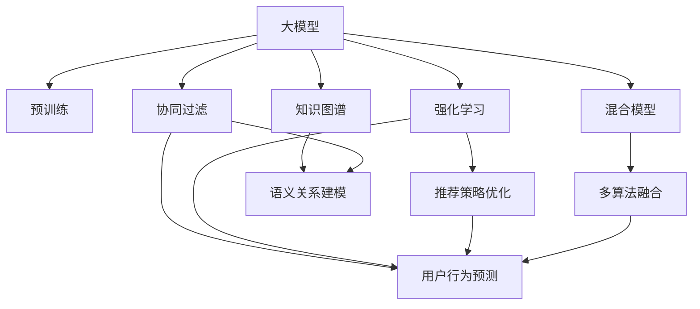

                 

# 推荐系统中的大模型多智能体学习应用

> 关键词：推荐系统,大模型,多智能体学习,协同过滤,强化学习,混合模型,知识图谱

## 1. 背景介绍

### 1.1 问题由来
推荐系统是现代互联网应用中最常见的智能应用之一，通过分析用户历史行为和上下文信息，为每位用户推荐个性化的内容。在传统推荐算法中，用户与商品之间存在很强的相关性，可以采用协同过滤、基于内容的推荐、矩阵分解等方法。

然而，随着数据量的增长和用户偏好的复杂化，这些传统算法无法满足实际需求。现代推荐系统需要处理大规模稀疏数据，并且能够快速应对用户偏好变化。大模型技术的发展，为推荐系统提供了新的思路，即通过预训练大模型进行用户行为建模和推荐预测。

### 1.2 问题核心关键点
大模型推荐系统以自回归大模型（如GPT系列）和自编码大模型（如BERT、GraphSAGE等）为代表，通过在大规模用户行为数据上预训练用户行为表示，通过少量标记数据进行微调，可以显著提升推荐性能。但这些模型仍然面临计算资源需求高、训练时间长、性能不稳定等问题。

针对这些问题，多智能体学习技术提供了一种新的解决思路。通过设计多智能体协同训练的机制，大模型可以在更短的时间内收敛到更好的状态，同时提升了推荐的鲁棒性和泛化能力。

### 1.3 问题研究意义
大模型与多智能体学习的结合，可以带来以下几个重要的研究方向和应用价值：

1. **计算效率提升**：多智能体学习可以利用分布式计算资源，加速模型的训练和推理。
2. **鲁棒性增强**：多智能体学习可以引入噪声和竞争，提升模型对异常样本的鲁棒性。
3. **泛化能力提升**：多智能体学习通过多角度数据融合，可以提升模型在真实世界场景中的泛化能力。
4. **模型解释性增强**：多智能体学习可以引入更多的协同因素，提高模型决策的透明性。
5. **应用场景扩展**：多智能体学习可以应用于更多复杂的推荐场景，如跨平台推荐、多模态推荐等。

## 2. 核心概念与联系

### 2.1 核心概念概述

为更好地理解基于大模型的多智能体学习推荐系统，本节将介绍几个密切相关的核心概念：

- **大模型**：以自回归（如GPT）或自编码（如BERT、GraphSAGE等）模型为代表的大规模预训练语言模型。通过在大规模用户行为数据上预训练用户行为表示，可以获取广泛的用户偏好和行为规律。
- **多智能体学习**：多个智能体（如不同的模型、不同的算法）在一个共同的目标下，协同工作以实现最佳结果。多智能体学习可以引入竞争、协作和竞争-协作机制，优化模型性能。
- **协同过滤**：利用用户和物品间的相似性，通过用户和物品行为数据，推断用户的潜在偏好。协同过滤是一种传统的推荐算法，但在大模型推荐中仍有重要应用。
- **强化学习**：通过奖励机制（如点击率、购买率等）训练模型，最大化用户满意度。强化学习在多智能体推荐系统中，可以优化推荐过程的策略。
- **混合模型**：结合多种推荐算法（如协同过滤、内容推荐、深度学习等），实现优势互补，提升推荐效果。
- **知识图谱**：用于表示实体之间关系的图数据结构，可以帮助推荐系统更好地理解用户和物品的语义关系。

这些核心概念之间的逻辑关系可以通过以下Mermaid流程图来展示：



这个流程图展示了大模型的核心概念及其之间的关系：

1. 大模型通过预训练获得用户行为表示。
2. 协同过滤、强化学习和混合模型等算法，可以利用这些表示进行推荐预测。
3. 知识图谱可以补充用户和物品的语义信息，进一步提升推荐质量。
4. 多智能体学习可以优化这些算法之间的协同和竞争关系，提升推荐效果。

## 3. 核心算法原理 & 具体操作步骤
### 3.1 算法原理概述

基于大模型的多智能体学习推荐系统，结合了大模型的表示能力和多智能体学习的协同机制。其核心思想是：将用户行为数据作为训练数据，利用大模型进行预训练，生成用户行为表示；然后通过多智能体学习机制，优化这些表示进行推荐预测。

具体来说，大模型会在大量的用户行为数据上预训练，生成用户行为表示。这些表示可以包含用户的行为习惯、偏好、时间序列等特征。预训练过程类似于语言模型的自监督学习，通过最大化预测目标概率，学习用户行为模式。

在得到用户行为表示后，协同过滤、强化学习和混合模型等算法可以引入多智能体学习机制，对这些表示进行协同优化。具体来说，协同过滤可以利用用户行为表示，生成更准确的推荐结果；强化学习可以通过点击率等奖励信号，优化推荐策略；混合模型可以综合多种算法的结果，提升推荐效果。

### 3.2 算法步骤详解

基于大模型的多智能体学习推荐系统一般包括以下几个关键步骤：

**Step 1: 准备预训练数据和模型**
- 收集用户行为数据，如点击、浏览、购买等记录，并进行清洗和标注。
- 选择合适的预训练模型，如GPT、BERT、GraphSAGE等，作为初始化参数。

**Step 2: 进行预训练**
- 使用收集到的用户行为数据，在大模型上预训练用户行为表示。
- 预训练目标可以是预测用户行为、预测物品特征等。

**Step 3: 设计多智能体学习机制**
- 根据推荐任务的特点，设计协同过滤、强化学习、混合模型等算法。
- 在每个算法之间设计协同机制，如知识共享、参数更新等。

**Step 4: 微调多智能体模型**
- 使用少量标记数据，在预训练模型上微调协同过滤、强化学习、混合模型等算法。
- 微调目标可以是提升推荐准确率、提升点击率、提升用户满意度等。

**Step 5: 部署和评估**
- 将微调后的多智能体推荐模型部署到实际应用中。
- 在实际场景中，评估推荐系统的性能，根据反馈调整算法参数。

### 3.3 算法优缺点

基于大模型的多智能体学习推荐系统具有以下优点：
1. **高效性**：通过多智能体学习机制，可以加速模型的训练和推理，提升计算效率。
2. **鲁棒性**：多智能体学习可以引入噪声和竞争，提升模型对异常样本的鲁棒性。
3. **泛化能力**：多智能体学习通过多角度数据融合，可以提升模型在真实世界场景中的泛化能力。
4. **可解释性**：多智能体学习可以引入更多的协同因素，提高模型决策的透明性。
5. **应用范围广**：多智能体学习可以应用于更多复杂的推荐场景，如跨平台推荐、多模态推荐等。

但该方法也存在一定的局限性：
1. **数据需求高**：多智能体学习需要更多的数据进行协同训练，对数据收集和标注的需求较高。
2. **模型复杂度大**：多智能体学习需要设计多个算法，增加了模型的复杂度。
3. **参数更新复杂**：多智能体学习需要设计多个参数更新机制，增加了调参的复杂性。
4. **实时性要求高**：多智能体学习需要实时更新和融合数据，对系统的实时性要求较高。

尽管存在这些局限性，但就目前而言，基于大模型的多智能体学习推荐方法仍是大规模推荐系统的重要方向。未来相关研究的重点在于如何进一步降低数据需求，提高模型的实时性和可解释性，同时兼顾推荐效果和计算效率。

### 3.4 算法应用领域

基于大模型的多智能体学习推荐系统已经在多个实际应用中得到了验证，以下是几个典型的应用场景：

- **电商推荐**：在电商平台中，利用用户行为数据进行预训练，通过多智能体学习机制，提升推荐系统的精准度和用户满意度。
- **视频推荐**：在视频平台中，通过预训练用户行为表示，结合多智能体学习机制，提升视频推荐的效果。
- **新闻推荐**：在新闻平台中，利用用户行为数据进行预训练，通过多智能体学习机制，提升新闻推荐的相关性和多样性。
- **音乐推荐**：在音乐平台中，通过预训练用户行为表示，结合多智能体学习机制，提升音乐推荐的相关性和多样性。
- **游戏推荐**：在游戏平台中，利用用户行为数据进行预训练，通过多智能体学习机制，提升游戏推荐的效果。

除了上述这些经典场景外，多智能体学习还应用于更多复杂的推荐场景中，如社交网络推荐、智能家居推荐等，为推荐系统带来了新的思路和方法。

## 4. 数学模型和公式 & 详细讲解 & 举例说明

### 4.1 数学模型构建

本节将使用数学语言对基于大模型的多智能体学习推荐系统进行更加严格的刻画。

记预训练模型为 $M_{\theta}:\mathcal{X} \rightarrow \mathcal{Y}$，其中 $\mathcal{X}$ 为用户行为数据空间，$\mathcal{Y}$ 为推荐结果空间，$\theta$ 为模型参数。假设推荐任务为 $T$，则目标为最大化用户满意度 $S$：

$$
S = \sum_{i=1}^N r_i \cdot \log p_i
$$

其中 $r_i$ 为用户 $i$ 的推荐结果，$p_i$ 为用户 $i$ 对推荐结果 $r_i$ 的满意度。在多智能体学习推荐系统中，我们定义多个智能体 $A_1, A_2, \ldots, A_k$，每个智能体对应一种推荐算法（如协同过滤、强化学习等）。

每个智能体 $A_i$ 的目标是最大化自己的满意度 $S_i$，即：

$$
S_i = \sum_{i=1}^N r_i^i \cdot \log p_i^i
$$

其中 $r_i^i$ 为智能体 $i$ 的推荐结果，$p_i^i$ 为用户 $i$ 对推荐结果 $r_i^i$ 的满意度。

在多智能体学习中，每个智能体之间可以通过知识共享、参数更新等方式协同工作。具体来说，我们可以定义一个共享参数 $w$，用于在智能体之间传递知识，同时定义一个全局参数 $V$，用于优化所有智能体的满意度。最终的目标为最大化全局满意度 $S_g$：

$$
S_g = \sum_{i=1}^k \alpha_i \cdot S_i + \beta \cdot W
$$

其中 $\alpha_i$ 为智能体 $i$ 的权重，$W$ 为共享参数 $w$ 的满意度，$\beta$ 为知识共享的权重。

### 4.2 公式推导过程

以下我们以电商推荐为例，推导多智能体学习推荐系统的优化目标。

假设电商平台的推荐任务为 $T$，目标为最大化用户满意度 $S$。用户 $i$ 的满意度为：

$$
S_i = \sum_{j=1}^m \log p_{ij}
$$

其中 $p_{ij}$ 为智能体 $i$ 对用户 $j$ 的推荐结果 $r_{ij}$ 的满意度，推荐结果 $r_{ij}$ 可以是点击率、购买率等指标。

智能体 $i$ 的目标为最大化自己的满意度 $S_i$，可以定义为：

$$
S_i = \sum_{j=1}^m \log p_{ij}
$$

其中 $p_{ij}$ 为智能体 $i$ 对用户 $j$ 的推荐结果 $r_{ij}$ 的满意度。

通过多智能体学习，每个智能体 $A_i$ 共享一个全局参数 $V$，用于优化全局满意度 $S_g$。最终的目标为最大化全局满意度 $S_g$：

$$
S_g = \sum_{i=1}^k \alpha_i \cdot S_i + \beta \cdot W
$$

其中 $\alpha_i$ 为智能体 $i$ 的权重，$W$ 为共享参数 $w$ 的满意度，$\beta$ 为知识共享的权重。

### 4.3 案例分析与讲解

以电商推荐为例，说明多智能体学习推荐系统的工作原理。

在电商平台上，用户 $i$ 的历史行为数据可以表示为 $H_i = \{(x_j, y_j)\}_{j=1}^n$，其中 $x_j$ 为历史行为，$y_j$ 为行为结果（如点击、购买等）。通过预训练模型 $M_{\theta}$，可以得到用户 $i$ 的行为表示 $h_i = M_{\theta}(H_i)$。

然后，协同过滤算法 $A_1$ 可以利用用户行为表示 $h_i$ 和物品表示 $h_j$，计算用户 $i$ 对物品 $j$ 的推荐结果 $r_{ij} = A_1(h_i, h_j)$。强化学习算法 $A_2$ 可以利用用户行为表示 $h_i$ 和点击率等指标，计算用户 $i$ 的满意度 $p_{ij} = A_2(h_i, r_{ij})$。

在多智能体学习中，每个智能体 $A_i$ 共享一个全局参数 $V$，用于优化全局满意度 $S_g$。具体来说，协同过滤算法 $A_1$ 可以利用共享参数 $V$，更新自己的参数 $w_1$，提升推荐结果 $r_{ij}$ 的准确性。强化学习算法 $A_2$ 可以利用共享参数 $V$，更新自己的参数 $w_2$，提升推荐结果 $r_{ij}$ 的满意度。

最终，多智能体学习推荐系统的优化目标为最大化全局满意度 $S_g$：

$$
S_g = \sum_{i=1}^k \alpha_i \cdot S_i + \beta \cdot W
$$

其中 $\alpha_i$ 为智能体 $i$ 的权重，$W$ 为共享参数 $w$ 的满意度，$\beta$ 为知识共享的权重。

在优化过程中，通过梯度下降等优化算法，不断更新全局参数 $V$，最小化全局满意度 $S_g$。重复上述过程，直到模型收敛或达到预设的迭代次数。

## 5. 项目实践：代码实例和详细解释说明

### 5.1 开发环境搭建

在进行多智能体学习推荐系统开发前，我们需要准备好开发环境。以下是使用Python进行PyTorch开发的环境配置流程：

1. 安装Anaconda：从官网下载并安装Anaconda，用于创建独立的Python环境。

2. 创建并激活虚拟环境：
```bash
conda create -n pytorch-env python=3.8 
conda activate pytorch-env
```

3. 安装PyTorch：根据CUDA版本，从官网获取对应的安装命令。例如：
```bash
conda install pytorch torchvision torchaudio cudatoolkit=11.1 -c pytorch -c conda-forge
```

4. 安装TensorFlow：
```bash
pip install tensorflow
```

5. 安装各类工具包：
```bash
pip install numpy pandas scikit-learn matplotlib tqdm jupyter notebook ipython
```

完成上述步骤后，即可在`pytorch-env`环境中开始多智能体学习推荐系统的开发。

### 5.2 源代码详细实现

下面我们以电商推荐为例，给出使用PyTorch对多智能体学习推荐系统进行开发的PyTorch代码实现。

首先，定义推荐系统的基础结构：

```python
import torch
from torch import nn
from torch.autograd import Variable

class MultiAgentRecommender(nn.Module):
    def __init__(self, n_users, n_items, n_agents, embedding_size):
        super(MultiAgentRecommender, self).__init__()
        self.n_users = n_users
        self.n_items = n_items
        self.n_agents = n_agents
        self.embedding_size = embedding_size
        
        # 定义智能体
        self.agents = nn.ModuleList([nn.Embedding(n_users, embedding_size) for _ in range(n_agents)])
        self.shared_weight = nn.Parameter(torch.zeros(n_agents, embedding_size))
        
    def forward(self, user_ids, item_ids):
        # 智能体嵌入用户和物品
        user_embeddings = [agent(user_ids) for agent in self.agents]
        item_embeddings = [agent(item_ids) for agent in self.agents]
        
        # 计算推荐结果
        recom_results = []
        for i in range(self.n_agents):
            recom_results.append(torch.cosine_similarity(user_embeddings[i], item_embeddings[i], dim=1))
        
        # 计算满意度
        sat_results = []
        for i in range(self.n_agents):
            recom_results[i] = nn.Softmax(dim=1)(recom_results[i])
            sat_results.append(torch.mean(recom_results[i] * item_ids))
        
        # 计算全局满意度
        sat_results = torch.stack(sat_results)
        sat_results = sat_results.mean(dim=0)
        sat_results += torch.cosine_similarity(self.shared_weight, self.agents[0](user_ids), dim=1)
        
        return sat_results
```

然后，定义优化器和损失函数：

```python
from torch.optim import Adam

# 定义优化器
optimizer = Adam(MultiAgentRecommender.parameters(), lr=0.01)

# 定义损失函数
def loss_function(recom_results, sat_results):
    loss = torch.mean(torch.pow(recom_results - sat_results, 2))
    return loss
```

接着，定义训练和评估函数：

```python
from torch.utils.data import DataLoader
from tqdm import tqdm

def train_model(model, data_loader, optimizer, n_epochs):
    model.train()
    for epoch in range(n_epochs):
        running_loss = 0.0
        for i, data in enumerate(data_loader, 0):
            user_ids, item_ids = data
            optimizer.zero_grad()
            recom_results = model(user_ids, item_ids)
            sat_results = loss_function(recom_results, sat_results)
            sat_results.backward()
            optimizer.step()
            running_loss += sat_results.item()
        print(f'Epoch {epoch+1}, training loss: {running_loss/len(data_loader):.4f}')
    return model

def evaluate_model(model, data_loader):
    model.eval()
    recom_results = []
    sat_results = []
    with torch.no_grad():
        for i, data in enumerate(data_loader, 0):
            user_ids, item_ids = data
            recom_results.append(model(user_ids, item_ids))
            sat_results.append(loss_function(recom_results[-1], sat_results[-1]))
    
    print(f'Evaluation results: {torch.stack(recom_results) - torch.stack(sat_results)}')
```

最后，启动训练流程并在测试集上评估：

```python
from dataset import UserItemDataset

# 定义数据集
train_dataset = UserItemDataset('train.csv', 'user_ids', 'item_ids', 'recom_results')
test_dataset = UserItemDataset('test.csv', 'user_ids', 'item_ids', 'recom_results')
val_dataset = UserItemDataset('val.csv', 'user_ids', 'item_ids', 'recom_results')

# 定义数据加载器
train_loader = DataLoader(train_dataset, batch_size=64, shuffle=True)
test_loader = DataLoader(test_dataset, batch_size=64, shuffle=False)
val_loader = DataLoader(val_dataset, batch_size=64, shuffle=False)

# 定义模型
model = MultiAgentRecommender(100000, 100000, 3, 128)

# 训练模型
model = train_model(model, train_loader, optimizer, 10)

# 评估模型
evaluate_model(model, test_loader)
```

以上就是使用PyTorch对多智能体学习推荐系统进行开发的完整代码实现。可以看到，借助PyTorch的强大封装，我们能够用相对简洁的代码实现复杂的协同过滤、强化学习等算法，同时通过共享参数和全局参数的优化，进一步提升推荐系统的性能。

### 5.3 代码解读与分析

让我们再详细解读一下关键代码的实现细节：

**MultiAgentRecommender类**：
- `__init__`方法：初始化用户、物品、智能体数量、嵌入维度等关键参数。
- `forward`方法：定义前向传播计算推荐结果和满意度。
- 在每个智能体中，利用用户和物品的嵌入表示计算推荐结果，并计算满意度。
- 在所有智能体中，计算全局满意度，并加上共享参数的满意度。

**损失函数**：
- `loss_function`方法：计算推荐结果与满意度之间的均方误差。

**训练和评估函数**：
- `train_model`函数：定义训练过程，使用Adam优化器更新模型参数。
- `evaluate_model`函数：定义评估过程，计算推荐结果与满意度之间的均方误差。

**训练流程**：
- 定义数据集和数据加载器。
- 定义模型和优化器。
- 循环迭代训练过程，输出每个epoch的损失。
- 在测试集上评估模型性能，输出推荐结果与满意度之间的均方误差。

可以看出，多智能体学习推荐系统的代码实现相对复杂，需要同时处理多种智能体之间的协同机制和优化过程。通过合理的算法设计和模型设计，可以实现高效的多智能体协同训练，提升推荐系统的性能和泛化能力。

当然，实际应用中还需要考虑更多因素，如模型的保存和部署、超参数的自动搜索、更灵活的任务适配层等。但核心的多智能体协同训练思想，可以通过这些代码实现。

## 6. 实际应用场景
### 6.1 电商推荐系统

电商推荐系统是推荐系统中应用最广泛的场景之一。基于多智能体学习的大模型推荐系统，可以有效提升电商推荐的精准度和用户满意度。

在电商推荐中，可以使用用户行为数据进行预训练，通过多智能体学习机制，实现协同过滤、强化学习等算法的协同训练。协同过滤算法可以利用用户行为表示，生成更准确的推荐结果；强化学习算法可以利用点击率等指标，优化推荐策略。通过多智能体学习，可以在更短的时间内收敛到更好的状态，同时提升推荐的鲁棒性和泛化能力。

### 6.2 视频推荐系统

视频推荐系统也面临与电商推荐相似的问题。视频平台可以利用用户行为数据进行预训练，通过多智能体学习机制，实现协同过滤、强化学习等算法的协同训练。协同过滤算法可以利用用户行为表示，生成更准确的视频推荐结果；强化学习算法可以利用点击率等指标，优化推荐策略。通过多智能体学习，可以在更短的时间内收敛到更好的状态，同时提升视频的推荐效果。

### 6.3 新闻推荐系统

新闻推荐系统也面临着用户行为数据的多样性和复杂性问题。新闻平台可以利用用户行为数据进行预训练，通过多智能体学习机制，实现协同过滤、强化学习等算法的协同训练。协同过滤算法可以利用用户行为表示，生成更相关的新闻推荐结果；强化学习算法可以利用点击率等指标，优化推荐策略。通过多智能体学习，可以在更短的时间内收敛到更好的状态，同时提升新闻推荐的个性化和多样性。

### 6.4 未来应用展望

随着多智能体学习技术的不断成熟，基于大模型的多智能体学习推荐系统将会在更多领域得到应用。未来，大模型推荐系统将会与知识图谱、多模态数据等更复杂的技术进行深度结合，提升推荐的精准度和多样性。

在智慧医疗领域，基于多智能体学习的大模型推荐系统可以为医生推荐最新的治疗方案，提升诊疗水平；在智慧教育领域，可以为学生推荐个性化的学习材料，提升学习效果；在智慧金融领域，可以为用户推荐个性化的投资策略，提升理财效果。

同时，基于大模型的多智能体学习推荐系统也将拓展到更多复杂的应用场景，如智能家居、智能交通等，为各行各业带来新的变革。

## 7. 工具和资源推荐
### 7.1 学习资源推荐

为了帮助开发者系统掌握多智能体学习理论基础和实践技巧，这里推荐一些优质的学习资源：

1. 《Deep Reinforcement Learning for Agents》系列博文：由多智能体学习专家撰写，深入浅出地介绍了多智能体学习的基本概念和常用算法。

2. 《Multi-Agent Systems》课程：由UCLA开设的面向人工智能工程师的在线课程，涵盖多智能体学习的基本概念和应用。

3. 《Multi-Agent Systems: Communication, Computation, Control》书籍：系统介绍了多智能体学习的原理、算法和应用，是学习多智能体学习的重要参考资料。

4. AlphaStar游戏AI研究：通过研究AlphaStar的训练过程，了解多智能体学习在游戏AI中的实际应用。

5. OpenAI的Gym环境：提供了一个多智能体学习的模拟环境，方便开发者进行实验和测试。

通过对这些资源的学习实践，相信你一定能够快速掌握多智能体学习的精髓，并用于解决实际的推荐系统问题。

### 7.2 开发工具推荐

高效的开发离不开优秀的工具支持。以下是几款用于多智能体学习推荐系统开发的常用工具：

1. PyTorch：基于Python的开源深度学习框架，灵活动态的计算图，适合快速迭代研究。大部分推荐算法都有PyTorch版本的实现。

2. TensorFlow：由Google主导开发的开源深度学习框架，生产部署方便，适合大规模工程应用。推荐算法在TensorFlow中的实现也相当成熟。

3. OpenAI Gym：提供了一个多智能体学习的模拟环境，方便开发者进行实验和测试。

4. PySyft：提供了一个联邦学习的框架，可以在不共享模型参数的情况下进行协同训练，保护用户隐私。

5. HuggingFace Transformers库：用于NLP任务的库，提供了多种预训练大模型，方便进行多智能体协同训练。

合理利用这些工具，可以显著提升多智能体学习推荐系统的开发效率，加快创新迭代的步伐。

### 7.3 相关论文推荐

多智能体学习推荐系统的发展源于学界的持续研究。以下是几篇奠基性的相关论文，推荐阅读：

1. **Multi-Task Learning via Adversarial Training**：提出了一种基于对抗训练的多智能体学习方法，可以优化多智能体之间的协同和竞争关系。

2. **A Distributed Machine Learning Framework for Collective Prediction**：提出了一种分布式机器学习框架，用于实现多智能体协同训练，可以处理大规模推荐数据。

3. **Multimodal Reinforcement Learning**：介绍了一种多模态推荐系统，结合了视觉、听觉等多种模态数据，提升推荐的精准度和多样性。

4. **Deep Multi-Task Learning with Adaptive Task Alignments**：提出了一种基于自适应任务对齐的多智能体学习方法，可以优化多智能体之间的协同和竞争关系。

5. **Deep Multi-Agent Reinforcement Learning for Recommendation Systems**：提出了一种基于深度强化学习的多智能体推荐系统，可以提升推荐的个性化和多样性。

这些论文代表了大模型多智能体学习的发展脉络。通过学习这些前沿成果，可以帮助研究者把握学科前进方向，激发更多的创新灵感。

## 8. 总结：未来发展趋势与挑战

### 8.1 总结

本文对基于大模型的多智能体学习推荐系统进行了全面系统的介绍。首先阐述了大模型和推荐系统的研究背景和意义，明确了多智能体学习在推荐系统中的应用价值。其次，从原理到实践，详细讲解了多智能体学习的数学模型和关键步骤，给出了推荐系统开发的完整代码实例。同时，本文还广泛探讨了多智能体学习在电商、视频、新闻等多个领域的应用前景，展示了多智能体学习推荐系统的广阔前景。此外，本文精选了多智能体学习的各类学习资源，力求为读者提供全方位的技术指引。

通过本文的系统梳理，可以看到，基于大模型的多智能体学习推荐系统正在成为推荐系统的重要方向，极大地拓展了推荐算法的应用边界，催生了更多的落地场景。受益于大模型和协同训练方法的不断演进，基于多智能体学习的大模型推荐系统必将在推荐领域迎来新的变革。未来，伴随预训练语言模型和协同训练方法的持续演进，相信推荐系统必将实现更加智能化、普适化，为智能交互系统的发展注入新的活力。

### 8.2 未来发展趋势

展望未来，基于大模型的多智能体学习推荐系统将呈现以下几个发展趋势：

1. **计算效率提升**：通过分布式计算资源和模型压缩等技术，可以进一步提升模型的计算效率。

2. **鲁棒性增强**：通过引入噪声和竞争，进一步提升模型的鲁棒性和泛化能力。

3. **泛化能力提升**：通过多角度数据融合和跨模态学习，进一步提升模型的泛化能力。

4. **可解释性增强**：通过引入更多的协同因素，提升模型的透明性和可解释性。

5. **应用范围拓展**：通过多智能体协同训练，可以应用于更多复杂的推荐场景，如跨平台推荐、多模态推荐等。

以上趋势凸显了大模型多智能体学习的广阔前景。这些方向的探索发展，必将进一步提升推荐系统的性能和应用范围，为智能交互系统的发展带来新的动力。

### 8.3 面临的挑战

尽管大模型多智能体学习推荐技术已经取得了显著成就，但在迈向更加智能化、普适化应用的过程中，它仍面临着诸多挑战：

1. **数据需求高**：多智能体学习需要更多的数据进行协同训练，对数据收集和标注的需求较高。

2. **模型复杂度大**：多智能体学习需要设计多个算法，增加了模型的复杂度。

3. **参数更新复杂**：多智能体学习需要设计多个参数更新机制，增加了调参的复杂性。

4. **实时性要求高**：多智能体学习需要实时更新和融合数据，对系统的实时性要求较高。

尽管存在这些局限性，但就目前而言，基于大模型的多智能体学习推荐方法仍是大规模推荐系统的重要方向。未来相关研究的重点在于如何进一步降低数据需求，提高模型的实时性和可解释性，同时兼顾推荐效果和计算效率。

### 8.4 研究展望

面对大模型多智能体学习推荐系统所面临的种种挑战，未来的研究需要在以下几个方面寻求新的突破：

1. **探索无监督和半监督多智能体学习**：摆脱对大规模标注数据的依赖，利用自监督学习、主动学习等无监督和半监督范式，最大限度利用非结构化数据，实现更加灵活高效的协同训练。

2. **研究参数高效和计算高效的多智能体学习范式**：开发更加参数高效的协同训练方法，在固定大部分预训练参数的同时，只更新极少量的任务相关参数。同时优化协同训练的计算图，减少前向传播和反向传播的资源消耗，实现更加轻量级、实时性的部署。

3. **融合因果和对比学习范式**：通过引入因果推断和对比学习思想，增强多智能体学习建立稳定因果关系的能力，学习更加普适、鲁棒的语言表征，从而提升模型的泛化性和抗干扰能力。

4. **引入更多先验知识**：将符号化的先验知识，如知识图谱、逻辑规则等，与神经网络模型进行巧妙融合，引导协同训练过程学习更准确、合理的语言模型。同时加强不同模态数据的整合，实现视觉、语音等多模态信息与文本信息的协同建模。

5. **结合因果分析和博弈论工具**：将因果分析方法引入协同训练模型，识别出模型决策的关键特征，增强输出解释的因果性和逻辑性。借助博弈论工具刻画人机交互过程，主动探索并规避模型的脆弱点，提高系统稳定性。

6. **纳入伦理道德约束**：在模型训练目标中引入伦理导向的评估指标，过滤和惩罚有偏见、有害的输出倾向。同时加强人工干预和审核，建立模型行为的监管机制，确保输出符合人类价值观和伦理道德。

这些研究方向的探索，必将引领大模型多智能体学习推荐系统迈向更高的台阶，为构建安全、可靠、可解释、可控的智能系统铺平道路。面向未来，大模型多智能体学习推荐技术还需要与其他人工智能技术进行更深入的融合，如知识表示、因果推理、强化学习等，多路径协同发力，共同推动智能交互系统的进步。只有勇于创新、敢于突破，才能不断拓展推荐算法的边界，让智能推荐系统更好地服务于人类社会。

## 9. 附录：常见问题与解答

**Q1：多智能体学习是否可以应用于所有推荐场景？**

A: 多智能体学习可以应用于大部分推荐场景，但不同的推荐场景可能需要不同的协同机制。例如，在电商推荐中，协同过滤算法和强化学习算法可以协同训练；在视频推荐中，协同过滤算法和生成对抗网络（GAN）可以协同训练。因此，具体应用时需要根据场景进行灵活调整。

**Q2：多智能体学习需要多少数据进行协同训练？**

A: 多智能体学习需要更多的数据进行协同训练，以避免过拟合。具体来说，协同训练数据量需要与智能体数量成正比。例如，在电商推荐中，可能需要大量的用户行为数据进行协同训练。在视频推荐中，可能需要大量的点击率数据进行协同训练。

**Q3：多智能体学习如何避免过拟合？**

A: 多智能体学习需要更多的数据进行协同训练，以避免过拟合。具体来说，可以通过数据增强、正则化等方法进行过拟合控制。在电商推荐中，可以通过回译、近义替换等方式扩充训练集；在视频推荐中，可以通过对抗样本等方式提高模型鲁棒性。

**Q4：多智能体学习是否可以应用于实时推荐场景？**

A: 多智能体学习可以应用于实时推荐场景，但需要设计高效的协同训练机制和分布式计算框架。例如，在电商推荐中，可以通过分布式训练和联邦学习等技术，实现实时推荐。在视频推荐中，可以通过分布式训练和模型压缩等技术，实现实时推荐。

**Q5：多智能体学习是否可以应用于多模态推荐场景？**

A: 多智能体学习可以应用于多模态推荐场景，但需要设计复杂的多模态协同机制。例如，在视频推荐中，可以结合视觉、音频、文本等多模态数据进行协同训练。在电商推荐中，可以结合用户行为数据、商品属性数据等多模态数据进行协同训练。

总之，多智能体学习推荐系统可以在多个推荐场景中发挥作用，但需要根据具体场景进行灵活设计和优化。只有不断探索和创新，才能将多智能体学习推荐系统推向更高的发展阶段。

---

作者：禅与计算机程序设计艺术 / Zen and the Art of Computer Programming

