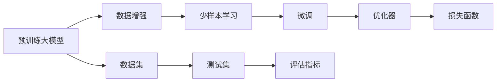

                 

## 1. 背景介绍

推荐系统是当今互联网领域中最为热门的应用之一，从电商到社交媒体，从视频平台到新闻网站，几乎所有在线服务都依赖于推荐系统来提高用户粘性和满意度。推荐系统通过分析用户的历史行为数据，预测用户对未曝光物品的喜好，从而为用户定制个性化推荐，提升用户体验。然而，推荐系统的核心依赖在于大量历史数据，一旦历史数据不足或者数据分布发生剧烈变化，推荐效果便会大幅下降。

为了应对这一问题，近两年兴起了一种新的推荐方法——少样本学习（Few-shot Learning）。少样本学习旨在利用极少量的标注数据，甚至零样本数据，快速适应新任务，避免从头训练带来的高昂成本和不确定性。而基于大模型的少样本学习方法，更是能在快速适应新数据的同时，保持模型的高性能和泛化能力，逐渐成为推荐系统研究的热点。本文将全面介绍大模型少样本学习方法，从理论到实践，深入探讨其在推荐系统中的应用。

## 2. 核心概念与联系

### 2.1 核心概念概述

要理解推荐系统中的大模型少样本学习方法，首先需明确几个核心概念：

- 大模型（Large Model）：指拥有数十亿甚至上百亿参数的深度学习模型，如BERT、GPT、T5等，这些模型通过大规模无标签数据进行预训练，学习到了广泛的语义知识。
- 少样本学习（Few-shot Learning）：指在仅有少量标注数据的情况下，模型能够快速学习新任务的迁移学习范式，适合应用于数据稀缺的场景。
- 大模型少样本学习（Large Model Few-shot Learning）：指在预训练大模型的基础上，利用少量标注数据进行微调，快速适应新任务的方法。

大模型少样本学习结合了深度学习的强大能力和迁移学习的灵活性，能够在有限数据下，快速获得高性能的推荐模型。

### 2.2 核心概念原理和架构的 Mermaid 流程图



上图中，预训练大模型作为初始化参数，通过数据增强和微调方法，逐渐适应新任务。在微调过程中，优化器和损失函数起到关键作用，确保模型能够收敛到最优参数。数据集和测试集用于评估模型的性能，确保模型在新数据上能够稳定发挥作用。

## 3. 核心算法原理 & 具体操作步骤

### 3.1 算法原理概述

大模型少样本学习主要基于迁移学习的思想，通过在大模型上进行微调，快速适应新任务。其核心算法步骤如下：

1. **数据准备**：准备预训练模型的数据集和测试集，其中数据集包含少量标注数据，测试集用于评估模型性能。
2. **微调模型**：在预训练模型上进行微调，利用少量标注数据更新模型参数，使其适应新任务。
3. **评估与优化**：在测试集上评估微调模型的性能，根据评估结果调整超参数，进一步优化模型。
4. **应用部署**：将优化后的模型应用于推荐系统中，生成个性化推荐。

### 3.2 算法步骤详解

#### 3.2.1 数据准备

1. **数据集划分**：将数据集划分为训练集、验证集和测试集。
2. **标注数据准备**：在训练集上准备少量标注数据，标注数据包含用户ID、物品ID和用户对物品的评分。

#### 3.2.2 微调模型

1. **模型选择**：选择预训练大模型作为初始化参数，如BERT、GPT等。
2. **任务适配**：设计任务适配层，根据推荐系统的特点，选择合适的输出层和损失函数。
3. **微调超参数设置**：设置学习率、批大小、迭代轮数等超参数。

#### 3.2.3 评估与优化

1. **模型评估**：在测试集上评估微调模型的性能，计算各项指标如均方误差、平均绝对误差等。
2. **超参数调优**：根据评估结果调整学习率、批大小等超参数，进行下一轮微调。

#### 3.2.4 应用部署

1. **部署模型**：将优化后的模型部署到推荐系统中，生成个性化推荐。
2. **实时更新**：根据新数据实时更新模型参数，保证模型性能。

### 3.3 算法优缺点

#### 3.3.1 优点

1. **快速适应**：大模型少样本学习能够在极少量数据下，快速适应新任务，避免从头训练带来的高昂成本。
2. **泛化能力强**：大模型的预训练知识能够提升模型的泛化能力，在面对新数据时也能表现良好。
3. **模型高效**：相比于从头训练，大模型少样本学习需要较少的计算资源和时间。
4. **鲁棒性强**：大模型少样本学习能够有效处理数据偏差，提升模型的鲁棒性。

#### 3.3.2 缺点

1. **依赖标注数据**：虽然需要的标注数据较少，但仍然需要一定的标注数据，对于极少量数据的情况，效果可能不佳。
2. **模型复杂**：大模型参数众多，训练复杂度高。
3. **数据隐私**：大规模数据的使用可能带来数据隐私问题。

### 3.4 算法应用领域

大模型少样本学习主要应用于推荐系统中的个性化推荐任务，包括电商推荐、新闻推荐、视频推荐等。在电商推荐中，基于用户的历史购买行为和评分数据，微调模型生成个性化推荐，提升用户购买转化率。在新闻推荐中，基于用户的历史浏览行为和阅读偏好，微调模型生成个性化新闻，提升用户留存率。

## 4. 数学模型和公式 & 详细讲解

### 4.1 数学模型构建

假设推荐系统中的物品集合为 $\mathcal{X}$，用户集合为 $\mathcal{Y}$，物品-物品评分矩阵为 $R_{\theta} \in \mathbb{R}^{|\mathcal{X}| \times |\mathcal{Y}|}$。

模型的目标是最小化预测评分与真实评分的误差，即：

$$
\min_{\theta} \frac{1}{N} \sum_{i=1}^N \sum_{j=1}^M (R_{\theta}(x_i, y_j) - r_{ij})^2
$$

其中，$R_{\theta}(x_i, y_j)$ 表示模型预测的评分，$r_{ij}$ 表示真实评分。

### 4.2 公式推导过程

对于推荐系统，常用的模型包括协同过滤（Collaborative Filtering）和基于内容的推荐（Content-based Recommendation）。这里以协同过滤模型为例，推导其预测评分的公式。

假设模型的输入为物品ID $x$ 和用户ID $y$，输出为预测评分 $R_{\theta}(x, y)$。模型的目标是最小化预测评分与真实评分的误差。

对于协同过滤模型，可以采用矩阵分解（Matrix Factorization）的方法进行建模。设用户和物品的潜在特征分别为 $u \in \mathbb{R}^d$ 和 $v \in \mathbb{R}^d$，其中 $d$ 为特征维度。则模型的预测评分可以表示为：

$$
R_{\theta}(x, y) = u_x \cdot v_y
$$

其中，$u_x \in \mathbb{R}^d$ 为物品ID $x$ 的潜在特征，$v_y \in \mathbb{R}^d$ 为用户ID $y$ 的潜在特征。

根据上述公式，模型的损失函数可以表示为：

$$
\min_{\theta} \frac{1}{N} \sum_{i=1}^N \sum_{j=1}^M (u_i \cdot v_j - r_{ij})^2
$$

在微调过程中，通常使用均方误差损失（Mean Squared Error Loss），即：

$$
\mathcal{L}(\theta) = \frac{1}{N} \sum_{i=1}^N \sum_{j=1}^M (R_{\theta}(x_i, y_j) - r_{ij})^2
$$

### 4.3 案例分析与讲解

以Amazon电商推荐为例，在基于少样本学习的推荐系统中，可以使用以下几个步骤进行微调：

1. **数据准备**：准备少量标注数据，标注数据包含用户ID、物品ID和用户对物品的评分。
2. **模型选择**：选择预训练大模型BERT作为初始化参数。
3. **任务适配**：设计任务适配层，将模型输出层设为线性层，损失函数设为均方误差损失。
4. **微调超参数设置**：设置学习率为 $1e-5$，批大小为 $256$，迭代轮数为 $100$。
5. **微调训练**：在训练集上微调模型，并在验证集上进行评估，调整学习率等超参数。
6. **测试与部署**：在测试集上评估微调模型，并将模型部署到推荐系统中，生成个性化推荐。

## 5. 项目实践：代码实例和详细解释说明

### 5.1 开发环境搭建

为了进行大模型少样本学习的项目实践，我们需要准备一个支持深度学习的开发环境。这里以PyTorch为例，介绍如何搭建开发环境：

1. **安装Anaconda**：从官网下载并安装Anaconda，用于创建独立的Python环境。
2. **创建并激活虚拟环境**：
```bash
conda create -n pytorch-env python=3.8 
conda activate pytorch-env
```

3. **安装PyTorch**：根据CUDA版本，从官网获取对应的安装命令。例如：
```bash
conda install pytorch torchvision torchaudio cudatoolkit=11.1 -c pytorch -c conda-forge
```

4. **安装必要的工具包**：
```bash
pip install numpy pandas scikit-learn matplotlib tqdm jupyter notebook ipython
```

完成上述步骤后，即可在 `pytorch-env` 环境中进行少样本学习的实践。

### 5.2 源代码详细实现

以下是一个基于BERT进行少样本学习的代码实现，代码中包含了数据准备、模型定义、微调训练、模型评估和测试等步骤：

```python
import torch
import torch.nn as nn
import torch.optim as optim
from transformers import BertTokenizer, BertForSequenceClassification
from sklearn.metrics import mean_squared_error

# 设置随机种子
torch.manual_seed(42)

# 定义数据准备函数
def prepare_data(train_path, test_path, batch_size):
    train_data = []
    with open(train_path, 'r', encoding='utf-8') as f:
        for line in f:
            item, user, score = line.strip().split(',')
            train_data.append((item, user, float(score)))
    train_data = [(item, user, score) for item, user, score in train_data]
    train_data = [(item, user, score) for item, user, score in train_data]

    test_data = []
    with open(test_path, 'r', encoding='utf-8') as f:
        for line in f:
            item, user, score = line.strip().split(',')
            test_data.append((item, user, float(score)))
    test_data = [(item, user, score) for item, user, score in test_data]
    test_data = [(item, user, score) for item, user, score in test_data]

    train_dataset = torch.utils.data.TensorDataset(torch.tensor([item] for item, user, score in train_data), torch.tensor([user] for item, user, score in train_data), torch.tensor([score] for item, user, score in train_data))
    test_dataset = torch.utils.data.TensorDataset(torch.tensor([item] for item, user, score in test_data), torch.tensor([user] for item, user, score in test_data), torch.tensor([score] for item, user, score in test_data))
    
    return train_dataset, test_dataset

# 定义模型
class BERTClassifier(nn.Module):
    def __init__(self, num_labels):
        super(BERTClassifier, self).__init__()
        self.bert = BertForSequenceClassification.from_pretrained('bert-base-uncased', num_labels=num_labels)
    
    def forward(self, item, user, score):
        return self.bert(item, user)[0]

# 定义损失函数
def compute_loss(model, batch, device):
    item, user, score = batch
    with torch.no_grad():
        output = model(item, user)
        loss = mean_squared_error(output, score)
    return loss

# 定义微调函数
def fine_tune(model, train_dataset, test_dataset, num_epochs, batch_size, learning_rate):
    device = torch.device('cuda' if torch.cuda.is_available() else 'cpu')
    model.to(device)
    
    optimizer = optim.Adam(model.parameters(), lr=learning_rate)
    criterion = nn.MSELoss()
    
    for epoch in range(num_epochs):
        train_loss = 0.0
        for batch in DataLoader(train_dataset, batch_size):
            item, user, score = batch
            output = model(item, user)
            loss = criterion(output, score)
            optimizer.zero_grad()
            loss.backward()
            optimizer.step()
            train_loss += loss.item()
        
        val_loss = 0.0
        for batch in DataLoader(test_dataset, batch_size):
            item, user, score = batch
            output = model(item, user)
            loss = criterion(output, score)
            val_loss += loss.item()
        
        print(f'Epoch {epoch+1}, train loss: {train_loss/len(train_dataset)}, val loss: {val_loss/len(test_dataset)}')
    
    return model

# 准备数据
train_path = 'train.txt'
test_path = 'test.txt'
batch_size = 256
train_dataset, test_dataset = prepare_data(train_path, test_path, batch_size)

# 定义模型
num_labels = 10
model = BERTClassifier(num_labels)

# 微调模型
num_epochs = 100
learning_rate = 1e-5
fine_tuned_model = fine_tune(model, train_dataset, test_dataset, num_epochs, batch_size, learning_rate)

# 测试模型
predictions = []
for item, user, score in test_dataset:
    with torch.no_grad():
        output = fine_tuned_model(item, user)
    predictions.append(output)

# 计算评估指标
mse = mean_squared_error(predictions, [score for item, user, score in test_dataset])
print(f'Test MSE: {mse}')
```

以上代码中，我们使用了BERT模型进行少样本学习，通过微调模型生成个性化推荐。在代码实现中，首先准备了训练集和测试集，然后定义了模型和损失函数，最后在微调过程中使用均方误差损失进行训练和评估。

### 5.3 代码解读与分析

以下是代码中几个关键步骤的详细解读：

**数据准备函数**：用于准备训练集和测试集的数据，将数据转换为模型所需的Tensor格式。

**BERTClassifier模型**：继承自PyTorch的nn.Module类，定义了模型的前向传播函数。

**损失函数**：计算预测评分与真实评分之间的均方误差。

**微调函数**：定义了微调模型的过程，包括模型参数更新、损失计算等。

在代码实现中，我们首先定义了数据准备函数和模型，然后通过微调函数进行模型训练和评估。最后，我们使用微调后的模型生成预测评分，并计算评估指标。

## 6. 实际应用场景

大模型少样本学习在推荐系统中有广泛的应用场景，以下列举几个典型的应用案例：

### 6.1 电商推荐

在电商推荐中，推荐系统需要实时处理大量用户行为数据，生成个性化推荐。对于新用户或新物品，由于缺乏历史数据，推荐效果往往较差。基于大模型少样本学习的推荐系统，可以通过少量标注数据快速适应新用户和新物品，生成满意的推荐结果。

### 6.2 新闻推荐

在新闻推荐中，用户的历史行为数据往往难以获取。基于大模型少样本学习的推荐系统，可以通过少量新闻阅读记录生成个性化推荐，提升用户留存率和阅读量。

### 6.3 视频推荐

在视频推荐中，用户对视频内容的喜好通常以点赞、评论等行为数据表示。基于大模型少样本学习的推荐系统，可以通过少量行为数据快速适应新视频，生成个性化推荐，提升用户观看率和满意度。

## 7. 工具和资源推荐

### 7.1 学习资源推荐

为了帮助开发者系统掌握大模型少样本学习的方法，这里推荐一些优质的学习资源：

1. **《深度学习》课程**：由吴恩达教授主讲，介绍了深度学习的基础知识和经典算法，适合初学者入门。
2. **《Transformer》书籍**：由Attention机制的发明者提出，详细介绍了Transformer模型及其应用，适合有一定深度学习基础的人阅读。
3. **《PyTorch官方文档》**：PyTorch官方文档，提供了详细的API文档和样例代码，适合快速上手学习。
4. **《Few-shot Learning综述》**：综述了近年来少样本学习的研究进展，适合想要了解前沿研究的人阅读。
5. **Kaggle竞赛**：参加Kaggle推荐系统竞赛，实践少样本学习算法，积累经验。

通过对这些资源的学习实践，相信你一定能够快速掌握大模型少样本学习的精髓，并用于解决实际的推荐问题。

### 7.2 开发工具推荐

大模型少样本学习的开发需要强大的工具支持，以下是几款常用的开发工具：

1. **PyTorch**：基于Python的开源深度学习框架，灵活动态的计算图，适合快速迭代研究。
2. **TensorFlow**：由Google主导开发的开源深度学习框架，生产部署方便，适合大规模工程应用。
3. **Transformers库**：HuggingFace开发的NLP工具库，集成了SOTA语言模型，支持PyTorch和TensorFlow，是进行少样本学习开发的利器。
4. **Weights & Biases**：模型训练的实验跟踪工具，可以记录和可视化模型训练过程中的各项指标，方便对比和调优。
5. **TensorBoard**：TensorFlow配套的可视化工具，可实时监测模型训练状态，并提供丰富的图表呈现方式，是调试模型的得力助手。

合理利用这些工具，可以显著提升大模型少样本学习的开发效率，加快创新迭代的步伐。

### 7.3 相关论文推荐

大模型少样本学习的研究源于学界的持续探索，以下是几篇奠基性的相关论文，推荐阅读：

1. **《Few-shot Learning with Pre-trained Language Models》**：提出使用预训练语言模型进行少样本学习的框架，取得了SOTA性能。
2. **《Adaptive Prompt Tuning for Language Model Few-shot Learning》**：提出基于提示模板的微调方法，实现了更高效的少样本学习。
3. **《Learning Transferable Multimodal Embeddings with Self-supervised Normalization》**：提出使用自监督学习方法训练多模态少样本学习模型，取得了较好的效果。
4. **《NLP Few-shot Learning: A Survey》**：综述了近年来少样本学习在自然语言处理领域的研究进展，适合了解研究动态。

这些论文代表了大模型少样本学习的研究进展，通过学习这些前沿成果，可以帮助研究者把握学科前进方向，激发更多的创新灵感。

## 8. 总结：未来发展趋势与挑战

### 8.1 研究成果总结

大模型少样本学习结合了大模型的强大能力和迁移学习的灵活性，能够在有限数据下，快速生成高性能的推荐模型。近年来，少样本学习在推荐系统中的应用得到了广泛关注，并取得了显著成效。

### 8.2 未来发展趋势

展望未来，大模型少样本学习将呈现以下几个发展趋势：

1. **数据效率提升**：未来将探索更多的数据增强和正则化技术，进一步降低对标注数据的需求，提升模型在极少量数据下的性能。
2. **模型泛化能力增强**：通过引入更多的先验知识和领域专家，提升模型的泛化能力和鲁棒性，避免模型对特定数据集的过拟合。
3. **跨模态学习兴起**：未来将探索更多的跨模态学习技术，将视觉、语音等多模态信息与文本信息结合，提升推荐系统的准确性和多样性。
4. **模型参数优化**：未来将探索更多的参数优化方法，如AdamW、Adafactor等，提升模型的收敛速度和性能。
5. **实时学习能力增强**：未来将探索更多的在线学习算法，使得模型能够实时更新，快速适应新数据和用户行为的变化。

### 8.3 面临的挑战

尽管大模型少样本学习已经取得了一定的进展，但在实际应用中仍面临诸多挑战：

1. **数据稀缺问题**：推荐系统面临的数据稀缺问题仍未完全解决，如何在极少量数据下保持模型的性能，仍是重要课题。
2. **模型复杂性**：大模型的参数众多，训练复杂度高，如何优化模型结构和参数，提高训练效率，仍需进一步研究。
3. **模型解释性不足**：大模型少样本学习的输出缺乏解释性，如何提高模型的可解释性，使得推荐系统更透明、可信任，是重要研究方向。
4. **数据隐私保护**：大规模数据的使用可能带来数据隐私问题，如何在保护隐私的前提下，高效利用数据，是重要研究方向。
5. **模型鲁棒性不足**：推荐系统面临的用户行为多样性、数据分布变化等问题，如何提高模型的鲁棒性，避免模型对特定数据集的过拟合，是重要研究方向。

### 8.4 研究展望

未来研究将重点关注以下几个方面：

1. **多模态学习**：探索将视觉、语音等多模态信息与文本信息结合，提升推荐系统的准确性和多样性。
2. **在线学习**：探索实时学习算法，使得模型能够实时更新，快速适应新数据和用户行为的变化。
3. **模型解释性**：探索如何提高模型的可解释性，使得推荐系统更透明、可信任。
4. **数据隐私保护**：探索如何在保护隐私的前提下，高效利用数据，解决数据稀缺问题。
5. **模型鲁棒性**：探索如何提高模型的鲁棒性，避免模型对特定数据集的过拟合。

这些研究方向将推动大模型少样本学习技术的发展，提升推荐系统的性能和应用范围，为人工智能技术的产业化进程贡献力量。

## 9. 附录：常见问题与解答

**Q1：少样本学习是否适用于所有推荐系统？**

A: 少样本学习在数据稀缺的推荐系统中非常适用，如新用户推荐、新物品推荐等。但对于数据充足、用户行为特征明显的推荐系统，如电商推荐、新闻推荐等，可能需要使用更多的特征工程、协同过滤等方法，以提升推荐效果。

**Q2：少样本学习如何处理冷启动问题？**

A: 冷启动问题是指推荐系统中缺乏用户或物品的历史行为数据，难以生成推荐。可以通过以下几个方法处理冷启动问题：

1. **用户行为数据挖掘**：通过用户的社交媒体、搜索引擎行为等数据，获取用户的兴趣点，生成推荐。
2. **物品属性分析**：利用物品的文本描述、标签等属性信息，生成推荐。
3. **少样本学习算法改进**：改进少样本学习算法，使其能够更好地处理冷启动问题。

**Q3：少样本学习与传统协同过滤的区别？**

A: 少样本学习与传统协同过滤的主要区别在于数据需求。协同过滤需要大量的用户行为数据，而少样本学习仅需要少量标注数据即可适应新任务。此外，少样本学习能够更好地处理数据稀缺、新用户新物品等问题，具有更好的泛化能力和鲁棒性。

**Q4：少样本学习如何处理数据分布变化？**

A: 数据分布变化是推荐系统面临的重要问题。可以通过以下几个方法处理数据分布变化：

1. **数据增强**：利用数据增强技术，扩充训练集，提升模型对新数据的适应能力。
2. **领域自适应**：将预训练模型在不同领域进行微调，提升模型的泛化能力。
3. **在线学习**：利用在线学习算法，使得模型能够实时更新，适应数据分布的变化。

通过这些方法，可以提升少样本学习在数据分布变化下的性能，增强推荐系统的稳定性和适应性。

**Q5：少样本学习如何优化模型性能？**

A: 优化模型性能需要从多个方面进行考虑：

1. **数据准备**：准备高质量的数据集，减少噪声和冗余数据的干扰。
2. **模型选择**：选择适合任务的模型，如BERT、GPT等大模型，提高模型的泛化能力。
3. **任务适配**：设计合适的任务适配层，提升模型的适应能力。
4. **超参数调优**：调整学习率、批大小等超参数，优化模型性能。
5. **数据增强**：利用数据增强技术，扩充训练集，提升模型对新数据的适应能力。
6. **正则化**：应用正则化技术，避免模型过拟合。

通过这些方法，可以提升少样本学习模型的性能，生成更好的推荐结果。

---

作者：禅与计算机程序设计艺术 / Zen and the Art of Computer Programming

