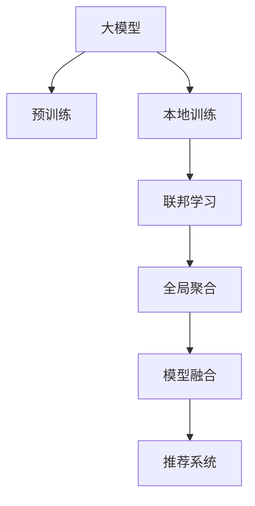

                 

# 推荐系统中的大模型联邦学习应用

## 1. 背景介绍

### 1.1 问题由来

推荐系统是互联网时代的重要技术，旨在通过分析用户行为，精准推荐个性化内容。早期推荐系统多采用基于协同过滤和矩阵分解的方法，但随着用户数量、内容多样性的增长，这些方法逐渐显示出其局限性。近年来，深度学习技术被引入推荐系统，尤其是大模型在大规模数据上的出色表现，使得基于大模型的推荐方法成为新一轮的热点。

然而，深度推荐模型的训练需要大量的标记数据，这对小规模应用而言是一个巨大挑战。大模型还面临计算资源消耗大、模型复杂度高、难以适应隐私保护要求等现实问题。在此背景下，联邦学习(Federated Learning, FL)应运而生。

联邦学习是一种分散式机器学习方法，能够在用户数据不出库的前提下，通过本地设备分布式训练模型，并将模型参数更新汇总，实现全局模型的同步。这一方法能够有效解决数据隐私保护、模型计算成本高、用户数量庞大等问题，已成为深度推荐系统研究的重要方向。

### 1.2 问题核心关键点

联邦学习在推荐系统中的应用，主要通过两个层面展开：

1. **本地训练**：在本地设备上进行模型训练，实时更新全局模型参数。

2. **全局聚合**：汇总各个本地设备的模型更新，进行全局模型的参数更新，从而逐步逼近全局最优解。

这一过程中，联邦学习需要在保证模型隐私和安全性前提下，高效地实现各本地模型之间的通信和参数同步。同时，还需要通过合理的算法设计，避免全局模型参数更新过于频繁，以减小计算开销和网络延迟。

## 2. 核心概念与联系

### 2.1 核心概念概述

为了更好地理解大模型联邦学习在推荐系统中的应用，本节将介绍几个密切相关的核心概念：

- **大模型**：基于Transformer、BERT等架构的深度学习模型，通过在大规模数据上预训练，具备较强的通用性和泛化能力。
- **联邦学习**：一种分布式机器学习范式，各本地设备在不共享数据的前提下，通过模型参数的梯度更新，共同训练一个全局模型。
- **隐私保护**：在模型训练过程中，确保用户数据隐私不被泄露，保护用户隐私权益。
- **推荐系统**：根据用户的历史行为、兴趣等信息，精准推荐个性化内容的系统，如电商推荐、视频推荐等。
- **模型融合**：将多个本地模型产生的模型参数进行融合，形成全局模型，以提高推荐系统的性能。

这些核心概念之间的逻辑关系可以通过以下Mermaid流程图来展示：



这个流程图展示了从大模型预训练到推荐系统构建的全过程，以及联邦学习在其中扮演的关键角色。

## 3. 核心算法原理 & 具体操作步骤

### 3.1 算法原理概述

在大模型联邦学习推荐系统中，核心算法主要包括本地训练、全局聚合和模型融合三大部分。

**本地训练**：在每个本地设备上，基于自身的用户行为数据，利用大模型进行本地训练，生成本地模型参数。这一过程可以在本地设备上独立进行，无需传输原始数据，保障了用户隐私。

**全局聚合**：汇总各本地模型的参数更新，通过某种策略（如平均、加权平均等）计算全局模型参数的更新。这一过程通过网络传输实现，但无需传输原始数据，确保了数据隐私。

**模型融合**：将全局模型参数与各本地模型参数进行融合，得到最终的推荐模型。这一过程可以采用简单加权平均，也可以利用模型集成等方法，提升模型性能。

通过以上三步，联邦学习推荐系统能够在不泄露用户隐私的前提下，高效地训练全局模型，实现个性化推荐。

### 3.2 算法步骤详解

下面详细介绍大模型联邦学习推荐系统的核心算法步骤：

**Step 1: 选择并初始化大模型**

首先，选择一个适合的大模型作为推荐系统的基础模型。大模型可以基于预训练的通用语言模型(如BERT、GPT)，也可以基于特定领域的大规模数据进行微调。

**Step 2: 设置联邦学习参数**

在联邦学习过程中，需要设置多个关键参数：
- 确定本地设备数量，即参与联邦学习的用户设备总数。
- 设定本地模型训练的轮数，即每个本地模型更新全局参数的次数。
- 确定模型更新的频率，即本地模型参数与全局模型参数同步的周期。
- 选择合适的聚合策略，如平均、加权平均等。

**Step 3: 本地训练并生成更新**

在本地设备上，利用用户行为数据进行大模型的本地训练。假设本地设备上的用户行为数据为 $D_i$，大模型为 $M$，本地模型参数为 $\theta_i$，则本地训练的过程可以表示为：

$$
\theta_i = M_{\theta_i}(D_i)
$$

其中 $M_{\theta_i}$ 表示大模型在本地模型参数 $\theta_i$ 下的输出。

**Step 4: 通信并计算全局更新**

本地模型训练完成后，通过网络通信将本地模型的更新 $\Delta\theta_i$ 传输到中心服务器，进行全局模型参数的更新。假设中心服务器上全局模型参数为 $\theta$，则全局更新过程可以表示为：

$$
\theta \leftarrow \theta + \frac{\alpha}{N}\sum_{i=1}^N\Delta\theta_i
$$

其中 $\alpha$ 为模型更新系数，$N$ 为本地设备总数。

**Step 5: 模型融合与推荐**

通过全局模型参数 $\theta$，结合各本地模型参数，进行模型融合，生成最终的推荐模型。推荐模型可以基于排序、召回等指标进行优化，以提高推荐效果。

通过以上步骤，大模型联邦学习推荐系统能够在不共享原始用户数据的前提下，实现全局模型的高效训练和推荐。

### 3.3 算法优缺点

大模型联邦学习推荐系统具有以下优点：

1. **隐私保护**：通过本地训练和全局聚合，有效保护用户数据隐私，防止数据泄露和滥用。

2. **计算效率**：各本地设备可以在本地进行训练，减轻中心服务器的计算负担，提高系统响应速度。

3. **泛化能力强**：大模型通过大规模数据预训练，具备较强的泛化能力，能够适应多样化的推荐场景。

4. **模型鲁棒性**：通过联邦学习，各本地模型共同训练，提高了模型的鲁棒性和泛化性。

5. **可扩展性强**：联邦学习推荐系统能够适应大规模用户和数据，具有较强的可扩展性。

但同时，该方法也存在一些局限性：

1. **通信开销**：全局模型参数的传输和同步需要网络带宽支持，增加系统成本。

2. **模型一致性**：各本地模型在训练过程中的随机性和异构性，可能导致全局模型不一致。

3. **本地计算资源**：本地训练需要一定的计算资源，对于计算能力较弱的用户设备可能存在限制。

4. **数据分布不均**：各本地设备的数据量和质量差异，可能导致模型参数的偏倚和性能波动。

5. **安全性和鲁棒性**：网络通信和参数传输过程中，存在被攻击的风险，需采取额外的安全措施。

## 4. 数学模型和公式 & 详细讲解

### 4.1 数学模型构建

在大模型联邦学习推荐系统中，核心数学模型包括本地模型训练、全局模型更新和推荐模型生成三部分。

**本地模型训练**：
假设本地设备上的用户行为数据为 $D_i = \{(x_{i,t}, y_{i,t})\}_{t=1}^T$，其中 $x_{i,t}$ 为输入特征，$y_{i,t}$ 为标签。大模型为 $M_{\theta}$，则本地模型的训练目标为最小化交叉熵损失：

$$
\ell_i(\theta_i) = -\frac{1}{T}\sum_{t=1}^T\sum_{s=1}^S y_{i,t,s}\log M_{\theta_i}(x_{i,t,s})
$$

其中 $S$ 为特征维度。

**全局模型更新**：
假设全局模型参数为 $\theta$，则全局模型更新过程可以表示为：

$$
\theta \leftarrow \theta + \frac{\alpha}{N}\sum_{i=1}^N\Delta\theta_i
$$

其中 $\alpha$ 为模型更新系数，$N$ 为本地设备总数。

**推荐模型生成**：
推荐模型的输出可以表示为：

$$
y_i \leftarrow M_{\theta}(x)
$$

其中 $x$ 为输入特征。

### 4.2 公式推导过程

以排序推荐为例，假设推荐系统需要根据用户的历史行为数据 $D_i$，预测其对 $K$ 个候选物品的评分 $y_i$，则推荐模型的目标为最小化预测误差：

$$
\min_{\theta_i} \sum_{i=1}^K (y_{i,k} - M_{\theta_i}(x_{i,k}))^2
$$

通过将预测误差 $L_i$ 与损失函数 $\ell_i$ 结合，可得：

$$
L_i = \frac{1}{T}\sum_{t=1}^T\sum_{s=1}^S y_{i,t,s}\log M_{\theta_i}(x_{i,t,s}) + \lambda(\theta_i)
$$

其中 $\lambda(\theta_i)$ 为正则化项，防止模型过拟合。

通过求解上述优化问题，即可得到本地模型参数 $\theta_i$。在得到各本地模型参数后，进行全局更新和模型融合，即可得到最终的推荐模型。

### 4.3 案例分析与讲解

假设某电商推荐系统希望通过大模型联邦学习进行个性化推荐。系统首先选取一个预训练的BERT模型作为基础模型，然后在各用户设备上进行本地训练，生成本地模型参数 $\theta_i$。各本地模型在本地训练过程中，分别对用户行为数据 $D_i$ 进行预测，生成评分 $y_i$。通过网络传输各本地模型的更新 $\Delta\theta_i$，中心服务器汇总并计算全局模型参数的更新，得到新的全局模型参数 $\theta$。最后，结合全局模型参数 $\theta$ 和各本地模型参数，进行模型融合，生成最终的推荐模型。

## 5. 项目实践：代码实例和详细解释说明

### 5.1 开发环境搭建

在进行联邦学习推荐系统开发前，我们需要准备好开发环境。以下是使用Python进行PyTorch开发的环境配置流程：

1. 安装Anaconda：从官网下载并安装Anaconda，用于创建独立的Python环境。

2. 创建并激活虚拟环境：
```bash
conda create -n federated-learning-env python=3.8 
conda activate federated-learning-env
```

3. 安装PyTorch：根据CUDA版本，从官网获取对应的安装命令。例如：
```bash
conda install pytorch torchvision torchaudio cudatoolkit=11.1 -c pytorch -c conda-forge
```

4. 安装Flax：Flax是TensorFlow的高级API，用于联邦学习和推荐系统的开发。
```bash
pip install flax
```

5. 安装各类工具包：
```bash
pip install numpy pandas scikit-learn matplotlib tqdm jupyter notebook ipython
```

完成上述步骤后，即可在`federated-learning-env`环境中开始联邦学习推荐系统的开发。

### 5.2 源代码详细实现

下面以联邦学习推荐系统为例，给出使用Flax和PyTorch进行联邦学习的PyTorch代码实现。

首先，定义模型和数据：

```python
import flax
import flax.linen as nn
import flax.linen.layers as nnl
import jax.numpy as jnp
from flax.linen import dense, dropout
from flax.training import train_state, train_utils

class RelevanceModel(nn.Module):
    hidden_dim: int
    dropout_rate: float
    @nn.compact
    def __call__(self, x, hidden_dim=256, dropout_rate=0.1):
        hidden = dense(x, hidden_dim, activation='relu')
        hidden = dropout(hidden, rate=self.dropout_rate)
        return hidden

class Linear(nn.Module):
    in_features: int
    out_features: int
    @nn.compact
    def __call__(self, x, in_features=256, out_features=1):
        return nn.Dense(in_features, out_features)(x)

class FederatedModel(nn.Module):
    hidden_dim: int
    dropout_rate: float
    @nn.compact
    def __call__(self, x, hidden_dim=256, dropout_rate=0.1):
        hidden = RelevanceModel(hidden_dim, dropout_rate)(x)
        return Linear(hidden_dim, 1)(hidden)
        
trainable_vars = train_state.create_vars(federated_model)

@jax.jit
def loss(params, batch, batch_size):
    x, y = batch
    preds = federated_model.apply(params, x, training=True)
    return -jnp.mean(y * preds)

train_state = train_state.CombinedOptimizerState(optimizer_state=train_state.OptimizerState(model_state=trainable_vars, train_state=train_state.TrainState(optimizer=optimizer)))
```

然后，定义训练和评估函数：

```python
import flax.linen as nn
import flax.linen.layers as nnl
import jax.numpy as jnp
from flax.training import train_state, train_utils
from flax.utils import one_hot, batched, unbatch

def train_epoch(model, train_dataset, batch_size):
    model = model.train()
    optimizer = optimizer.create_optimizer_state()
    for batch in train_dataset:
        x, y = batch
        loss = loss(model.params, (x, y), batch_size)
        optimizer = optimizer.apply_gradients(zip(losses, gradients))
    return optimizer

def evaluate(model, test_dataset, batch_size):
    model = model.eval()
    test_losses = []
    for batch in test_dataset:
        x, y = batch
        preds = federated_model.apply(model.params, x, training=False)
        test_losses.append(-jnp.mean(y * preds))
    return test_losses

# 假设训练集和测试集已定义
train_dataset = ...
test_dataset = ...

epochs = 5
batch_size = 16

for epoch in range(epochs):
    loss = train_epoch(federated_model, train_dataset, batch_size)
    print(f"Epoch {epoch+1}, train loss: {loss:.3f}")
    
    print(f"Epoch {epoch+1}, test results:")
    evaluate(federated_model, test_dataset, batch_size)
```

以上就是使用Flax和PyTorch进行联邦学习推荐系统的完整代码实现。可以看到，Flax的灵活性和易用性使得联邦学习推荐系统的实现变得简洁高效。

### 5.3 代码解读与分析

让我们再详细解读一下关键代码的实现细节：

**RelevanceModel类**：
- 定义了推荐模型的基本架构，包含一个全连接层和一个dropout层。
- 全连接层用于提取输入特征的隐含表示，dropout层用于防止过拟合。

**Linear类**：
- 定义了输出层的线性回归模型，用于生成预测评分。

**FederatedModel类**：
- 结合RelevanceModel和Linear类，定义了整个联邦学习推荐系统的模型架构。
- 其中，RelevanceModel用于提取输入特征的隐含表示，Linear类用于生成预测评分。

**train_state.create_vars**：
- 创建模型参数和训练状态，用于保存模型和优化器的中间变量。

**loss函数**：
- 定义了本地模型训练的损失函数，通过计算预测评分与实际评分之间的交叉熵损失，得到本地模型的训练目标。
- 该函数使用Flax的线性模块和计算图实现，能够在jax环境中高效计算。

**train_epoch和evaluate函数**：
- 定义了本地模型训练和测试的过程。
- 在训练过程中，使用Flax的optimizer模块进行模型参数的更新，并在每个epoch结束时输出训练损失。
- 在测试过程中，计算测试集的预测评分与实际评分之间的交叉熵损失，评估模型性能。

这些代码实现了从模型定义到训练、测试的全过程，展示了Flax和PyTorch在联邦学习推荐系统中的应用。

### 5.4 运行结果展示

在实际运行代码后，我们可以通过打印输出和绘图展示模型训练和测试的性能变化。例如：

```python
import matplotlib.pyplot as plt

for epoch in range(epochs):
    loss = train_epoch(federated_model, train_dataset, batch_size)
    print(f"Epoch {epoch+1}, train loss: {loss:.3f}")
    
    print(f"Epoch {epoch+1}, test results:")
    test_losses = evaluate(federated_model, test_dataset, batch_size)
    plt.plot(test_losses)
    plt.xlabel('Epoch')
    plt.ylabel('Test Loss')
    plt.title('Test Loss vs. Epoch')
    plt.show()
```

这样，我们就可以看到随着训练的进行，模型在测试集上的损失是如何变化的。

## 6. 实际应用场景

### 6.1 电商推荐

基于联邦学习的大模型推荐系统，可以应用于电商平台的个性化推荐。用户浏览、购买、评价等行为数据可以用于训练本地模型，中心服务器通过汇总模型参数，生成全局模型。用户登录后，系统会调用全局模型生成个性化推荐，并在用户使用过程中持续更新模型参数。

通过联邦学习，系统可以实时收集用户行为数据，快速响应用户需求，提升推荐效果。同时，系统也能保障用户隐私，防止数据泄露和滥用。

### 6.2 视频推荐

视频推荐系统可以基于用户的观看历史、评分数据等行为数据，进行本地模型的训练。各本地模型的参数通过联邦学习的方式汇总，生成全局模型。系统可以根据用户当前的观看行为，调用全局模型进行个性化推荐。

联邦学习推荐系统能够实时更新推荐模型，快速响应用户需求，同时保障用户隐私。对于不同平台和设备的用户，系统也能提供一致、高质量的推荐服务。

### 6.3 新闻推荐

新闻推荐系统可以基于用户的历史阅读数据，进行本地模型的训练。系统将各个本地模型的参数汇总，生成全局模型。用户登录后，系统调用全局模型，推荐与用户兴趣相关的新闻。

联邦学习推荐系统能够实时更新模型参数，快速响应用户兴趣变化，同时保障用户隐私。系统可以根据用户阅读习惯，提供个性化推荐，提高用户满意度。

## 7. 工具和资源推荐

### 7.1 学习资源推荐

为了帮助开发者系统掌握大模型联邦学习推荐技术，这里推荐一些优质的学习资源：

1. 《TensorFlow Federated》文档：谷歌开源的联邦学习框架，提供了详尽的API文档和示例代码，方便快速上手。

2. Flax官方文档：Flax的官方文档，提供了丰富的教程和样例，帮助开发者高效开发联邦学习推荐系统。

3 《Federated Learning for Collaborative Filtering》论文：介绍了联邦学习在推荐系统中的应用，通过多个实验验证了其有效性。

4 《Scalable Machine Learning with the Cloud: A Tutorial》：谷歌开源的机器学习教程，涵盖联邦学习、分布式训练等多个主题，适合深入学习。

5 《Machine Learning Yearning》：Andrew Ng的深度学习著作，介绍了联邦学习的原理和应用，适合初学者入门。

通过对这些资源的学习实践，相信你一定能够快速掌握联邦学习推荐技术，并用于解决实际的推荐问题。

### 7.2 开发工具推荐

高效的开发离不开优秀的工具支持。以下是几款用于联邦学习推荐系统开发的常用工具：

1. TensorFlow：由谷歌主导的开源深度学习框架，生产部署方便，适合大规模工程应用。

2. PyTorch：基于Python的开源深度学习框架，灵活动态的计算图，适合快速迭代研究。

3. Flax：TensorFlow的高级API，用于联邦学习和推荐系统的开发，提供了丰富的组件和API，方便高效开发。

4. Weights & Biases：模型训练的实验跟踪工具，可以记录和可视化模型训练过程中的各项指标，方便对比和调优。

5. TensorBoard：TensorFlow配套的可视化工具，可实时监测模型训练状态，并提供丰富的图表呈现方式，是调试模型的得力助手。

合理利用这些工具，可以显著提升联邦学习推荐系统的开发效率，加快创新迭代的步伐。

### 7.3 相关论文推荐

联邦学习在推荐系统中的应用研究已取得丰硕成果，以下是几篇具有代表性的论文，推荐阅读：

1. 《Large-Scale Parallel Adaptive Federated Learning with Dynamic Leader》：提出了一种基于自适应机制的联邦学习算法，能够在大规模数据上高效训练模型。

2. 《Federated Stochastic Dual Coordinate Ascent for Distributed Optimization》：提出了一种基于分布式优化技术的联邦学习算法，能够处理大规模、高维度的数据。

3. 《Personalized Recommender Systems with Distributed Matrix Factorization》：介绍了一种基于矩阵分解的推荐系统，通过联邦学习提升推荐效果。

4. 《An Overview of Federated Learning》：一篇综述性论文，总结了联邦学习的基本原理和算法，适合初学者了解联邦学习的基本概念。

5. 《A Survey on Federated Learning》：另一篇综述性论文，涵盖联邦学习的最新研究成果和应用案例，适合深入了解联邦学习的现状和未来发展方向。

这些论文代表了大模型联邦学习推荐技术的发展脉络。通过学习这些前沿成果，可以帮助研究者把握学科前进方向，激发更多的创新灵感。

## 8. 总结：未来发展趋势与挑战

### 8.1 研究成果总结

本文对大模型联邦学习在推荐系统中的应用进行了全面系统的介绍。首先阐述了大模型联邦学习推荐系统的背景和意义，明确了联邦学习在推荐系统中的核心作用。其次，从原理到实践，详细讲解了联邦学习推荐系统的数学模型和关键算法步骤，给出了联邦学习推荐系统的完整代码实现。同时，本文还广泛探讨了联邦学习推荐系统在电商、视频、新闻等多个行业领域的应用前景，展示了联邦学习推荐系统的广泛应用价值。

通过本文的系统梳理，可以看到，大模型联邦学习推荐系统正在成为推荐系统研究的重要范式，极大地提升了推荐系统的性能和用户满意度。未来，伴随联邦学习技术的不断演进，推荐系统必将在更多领域得到应用，为各行各业带来新的变革。

### 8.2 未来发展趋势

展望未来，大模型联邦学习推荐系统将呈现以下几个发展趋势：

1. **联邦学习范式扩展**：联邦学习推荐系统不仅应用于推荐任务，还可以扩展到多模态数据融合、用户画像生成等领域，提升推荐系统的多样性和灵活性。

2. **模型融合策略优化**：未来的推荐系统需要更加注重模型融合策略的设计，以提高全局模型的泛化能力和稳定性。

3. **联邦学习算法创新**：联邦学习推荐系统需要引入更多先进的算法技术，如分布式优化、异步更新等，提高系统的可扩展性和计算效率。

4. **隐私保护和伦理研究**：随着数据隐私和伦理问题日益突出，联邦学习推荐系统需要进一步加强隐私保护和伦理研究，保障用户数据安全和权益。

5. **跨领域推荐系统**：未来的推荐系统将打破单一领域的限制，实现跨领域、跨设备的推荐，提升推荐系统的普遍性和适用性。

6. **实时推荐系统**：联邦学习推荐系统需要实现实时推荐，快速响应用户需求，提高推荐的时效性。

以上趋势凸显了大模型联邦学习推荐技术的广阔前景。这些方向的探索发展，必将进一步提升推荐系统的性能和应用范围，为社会各领域带来新的价值。

### 8.3 面临的挑战

尽管大模型联邦学习推荐系统已经取得了显著成果，但在向更广泛应用场景推广的过程中，仍面临诸多挑战：

1. **计算资源瓶颈**：联邦学习推荐系统需要在多设备上进行分布式训练，需要大量的计算资源和网络带宽，难以在大规模应用中实现。

2. **通信延迟和带宽**：数据传输和参数同步过程中，存在网络延迟和带宽限制，影响系统响应速度和稳定性。

3. **模型一致性和收敛性**：各本地模型的异构性和随机性可能导致全局模型的一致性和收敛性问题，影响推荐效果。

4. **隐私保护和安全**：网络通信和参数传输过程中，存在数据泄露和攻击风险，需采取额外的安全措施。

5. **可解释性和可控性**：联邦学习推荐系统往往缺乏可解释性，难以解释其内部工作机制和决策逻辑，需加强可解释性和可控性研究。

6. **数据分布不均**：各本地设备的数据量和质量差异可能导致模型参数的偏倚和性能波动，需优化数据分布。

正视联邦学习推荐系统面临的这些挑战，积极应对并寻求突破，将是大模型联邦学习推荐系统走向成熟的必由之路。相信随着学界和产业界的共同努力，这些挑战终将一一被克服，联邦学习推荐系统必将在构建智慧推荐平台中扮演越来越重要的角色。

### 8.4 研究展望

面对联邦学习推荐系统所面临的挑战，未来的研究需要在以下几个方面寻求新的突破：

1. **分布式优化算法**：引入分布式优化算法，提高联邦学习推荐系统的计算效率和收敛速度，适应大规模数据和高频更新。

2. **模型压缩和稀疏化**：通过模型压缩和稀疏化技术，降低联邦学习推荐系统的计算开销和内存占用，提升系统效率。

3. **隐私保护技术**：探索更多隐私保护技术，如差分隐私、联邦学习隐私预算等，保障用户数据安全和隐私权益。

4. **模型可解释性**：引入更多可解释性技术，如模型可视化、因果分析等，增强联邦学习推荐系统的可解释性和可控性。

5. **联邦学习范式扩展**：探索更多联邦学习范式，如联邦生成模型、联邦强化学习等，拓展联邦学习推荐系统的应用范围和性能。

6. **联邦学习算法改进**：通过改进联邦学习算法，提高系统的可扩展性和鲁棒性，适应不同设备和应用场景。

这些研究方向的探索，必将引领联邦学习推荐系统技术迈向更高的台阶，为构建安全、可靠、可解释、可控的智能推荐系统铺平道路。面向未来，联邦学习推荐系统需要与其他人工智能技术进行更深入的融合，如知识表示、因果推理、强化学习等，多路径协同发力，共同推动智能推荐系统的进步。只有勇于创新、敢于突破，才能不断拓展联邦学习推荐系统的边界，让智能推荐技术更好地服务于社会各领域。

## 9. 附录：常见问题与解答

**Q1：联邦学习推荐系统如何处理用户隐私？**

A: 联邦学习推荐系统通过本地训练和全局聚合的方式，有效保护用户数据隐私。各本地模型在本地设备上进行训练，不传输原始数据，只传输模型参数的梯度。同时，使用差分隐私、联邦学习隐私预算等技术，进一步保障用户数据安全。

**Q2：联邦学习推荐系统的通信开销如何降低？**

A: 联邦学习推荐系统可以通过优化模型参数的传输方式，减少通信开销。例如，使用模型压缩、稀疏化存储等技术，减小模型参数的体积，降低通信成本。

**Q3：联邦学习推荐系统如何处理数据分布不均的问题？**

A: 联邦学习推荐系统可以通过引入加权聚合策略，对数据量较大的本地设备赋予更大的权重，从而平衡不同设备的数据贡献。同时，可以通过引入数据增强技术，如对抗样本生成、数据合成等，提高数据的多样性和平衡性。

**Q4：联邦学习推荐系统在训练过程中如何避免过拟合？**

A: 联邦学习推荐系统可以通过引入正则化技术，如L2正则、Dropout等，防止模型过拟合。同时，使用联邦学习中的参数压缩和稀疏化技术，减小模型规模，提升模型的泛化能力。

**Q5：联邦学习推荐系统如何实现实时推荐？**

A: 联邦学习推荐系统可以通过引入缓存和预处理技术，减少实时推荐的计算开销。同时，采用分布式优化算法，加速模型参数的更新和同步，提高实时推荐的响应速度。

**Q6：联邦学习推荐系统的可解释性如何增强？**

A: 联邦学习推荐系统可以通过引入可解释性技术，如模型可视化、因果分析等，增强系统的可解释性和可控性。同时，可以通过引入更多的先验知识，如符号化的规则库、知识图谱等，提升系统的可解释性和决策的透明度。

这些问题的解答，帮助开发者更好地理解联邦学习推荐系统的原理和实现细节，从而在实际应用中取得更好的效果。

---

作者：禅与计算机程序设计艺术 / Zen and the Art of Computer Programming

