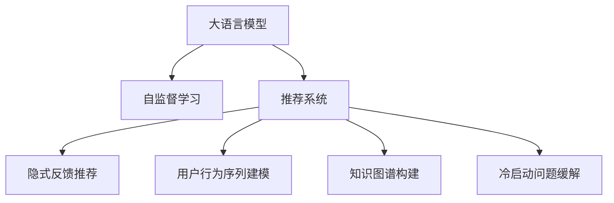

                 

# 推荐系统中的大模型自监督学习应用

> 关键词：大语言模型, 自监督学习, 推荐系统, 用户行为建模, 知识图谱, 隐式反馈, 序列建模, 归一化, 知识蒸馏, 冷启动问题

## 1. 背景介绍

### 1.1 问题由来

推荐系统在电商、社交、新闻等众多互联网应用中，扮演着至关重要的角色。传统的推荐系统主要依赖基于用户历史行为数据的协同过滤算法，这些算法往往存在数据稀疏性、冷启动和协同噪声等缺陷。而大模型和自监督学习方法，为推荐系统带来了全新的思路和突破。

大语言模型，如BERT、GPT、XLNet等，凭借其在自监督预训练中获得的丰富语言表示能力，已经被证明在自然语言处理(NLP)任务中具有显著优势。将这种能力应用到推荐系统中，可以更好地捕捉用户行为和兴趣的深层次特征，从而提升推荐效果。自监督学习，则是指在不依赖显式标注数据的情况下，通过预训练任务自动学习模型表示的技术，可以有效克服推荐系统中的数据稀疏和冷启动问题。

本文将系统介绍大语言模型在推荐系统中的自监督学习应用，包括基于隐式反馈的推荐、用户行为序列建模、知识图谱构建和冷启动问题缓解等方面的具体方法，以及其实际应用效果和未来趋势。

## 2. 核心概念与联系

### 2.1 核心概念概述

为更好地理解大模型在推荐系统中的应用，本节将介绍几个密切相关的核心概念：

- **大语言模型(Large Language Model, LLM)**：以自回归(如GPT)或自编码(如BERT)模型为代表的大规模预训练语言模型。通过在大规模无标签文本语料上进行预训练，学习通用的语言表示，具备强大的语言理解和生成能力。

- **自监督学习(Self-supervised Learning)**：指在无监督学习的基础上，通过设计预训练任务，自动学习模型参数的过程。自监督学习使得模型能够从大规模数据中自动学习到丰富的知识，减少了对标注数据的依赖。

- **推荐系统(Recommendation System)**：指根据用户的历史行为和兴趣，推荐相关内容或产品的系统。推荐系统可以分为基于内容的推荐和协同过滤推荐两大类。

- **知识图谱(Knowledge Graph)**：一种结构化的知识表示方式，由实体、关系和属性构成，用于刻画实体之间的关系和属性。知识图谱广泛应用于推荐系统中的个性化推荐、实体关系推理等任务。

- **隐式反馈(Implicit Feedback)**：指用户对产品或内容的点击、浏览、评分等隐含行为。隐式反馈无需用户显式表达偏好，能够更全面地刻画用户兴趣。

- **序列建模(Sequence Modeling)**：指对用户行为序列进行建模，捕捉时间依赖和模式变化。序列建模能够提升推荐系统的预测能力和泛化性能。

- **冷启动问题(Cold-Start Problem)**：指新用户或新物品进入推荐系统时，因缺乏历史行为数据而无法提供个性化推荐的问题。冷启动问题在大模型和自监督学习应用中得到很好的缓解。

这些核心概念之间的逻辑关系可以通过以下Mermaid流程图来展示：



这个流程图展示了大语言模型、自监督学习与推荐系统之间的关系：

1. 大语言模型通过自监督预训练获得丰富的语言表示能力。
2. 自监督学习使得模型能够自动学习语言中的深层次语义特征，减少对显式标注数据的依赖。
3. 推荐系统利用自监督学习获得的高质量表示，提升推荐效果。

这些概念共同构成了大模型在推荐系统中的应用框架，使得推荐系统能够更全面、高效地理解用户行为和需求。

## 3. 核心算法原理 & 具体操作步骤
### 3.1 算法原理概述

基于大模型的推荐系统，其核心思想是通过自监督学习自动捕捉用户行为和兴趣的深层次特征，用于提升推荐性能。具体流程如下：

1. 选择一个大规模预训练语言模型，如BERT、GPT等，作为推荐系统的基础模型。
2. 使用自监督学习方法，对基础模型进行微调，学习模型对用户行为序列、知识图谱等信息的隐式表示。
3. 将微调后的模型应用于推荐系统，进行隐式反馈的预测、用户行为序列的建模、知识图谱的构建和冷启动问题的缓解。

### 3.2 算法步骤详解

以下详细介绍自监督学习在大模型推荐系统中的应用步骤：

**Step 1: 准备数据集**
- 收集用户的历史行为数据，如浏览记录、点击记录、评分记录等。
- 对用户行为进行预处理，包括去噪、归一化等操作。

**Step 2: 设计预训练任务**
- 基于用户行为序列设计自监督预训练任务，如预测序列中的下一个行为、预测行为序列的时序变化等。
- 设计知识图谱构建任务，通过链接用户行为和产品属性，形成结构化的语义表示。

**Step 3: 微调大模型**
- 将预处理后的用户行为数据输入大模型进行微调，学习隐式表示。
- 在微调过程中，可以使用知识蒸馏方法，将知识图谱中的信息引入到模型中，提升模型泛化能力。

**Step 4: 推理和推荐**
- 将微调后的模型应用于推荐系统，进行隐式反馈的预测和用户行为序列的建模。
- 通过知识图谱构建任务，获取用户和产品间的实体关系和属性信息，进行多维度的推荐。

**Step 5: 评估和优化**
- 使用评估指标（如准确率、召回率、AUC等）对推荐效果进行评估。
- 根据评估结果，进行模型调参和优化，提升推荐系统性能。

### 3.3 算法优缺点

大模型在推荐系统中的应用，具有以下优点：

1. **表示能力强大**：大语言模型通过自监督学习获得的深层次语义表示，能够更好地捕捉用户行为和兴趣的复杂模式。
2. **泛化能力强**：自监督学习使得模型能够自动学习语言中的隐式知识，提升推荐系统的泛化性能。
3. **冷启动问题缓解**：利用隐式反馈和用户行为序列建模，能够有效缓解冷启动问题，提升新用户和新物品的推荐效果。

但同时，也存在一些缺点：

1. **计算成本高**：大模型的自监督预训练和微调需要大量的计算资源和存储空间。
2. **数据需求大**：自监督学习需要大量无标签数据，可能难以获得足够的数据进行训练。
3. **可解释性不足**：大模型通常作为"黑盒"系统，难以解释推荐结果的生成过程。

尽管存在这些局限，但大语言模型和自监督学习在推荐系统中的应用前景广阔，其强大的表示能力和泛化性能使其成为现代推荐系统的有力工具。

### 3.4 算法应用领域

基于大模型的推荐系统，已经被广泛应用于以下领域：

- **电商推荐**：如京东、淘宝等电商平台的商品推荐，通过用户浏览、点击记录预测用户兴趣。
- **新闻推荐**：如今日头条、网易新闻等平台的新闻文章推荐，通过用户阅读、点击行为建模。
- **社交推荐**：如微信、微博等平台的兴趣社交推荐，通过用户互动行为构建知识图谱。
- **视频推荐**：如YouTube、B站等视频平台的个性化视频推荐，通过用户观看行为预测兴趣。
- **金融推荐**：如银行、保险等金融机构的个性化金融产品推荐，通过用户行为序列建模。

除了上述这些经典应用外，大模型和自监督学习在推荐系统中的创新应用还在不断涌现，为推荐系统带来了新的突破和方向。

## 4. 数学模型和公式 & 详细讲解 & 举例说明
### 4.1 数学模型构建

在大模型推荐系统中，常见的数学模型包括：

- **序列模型**：如LSTM、GRU等，用于对用户行为序列进行建模，捕捉时间依赖和模式变化。
- **知识图谱模型**：如三元组表示法、向量表示法等，用于刻画实体、关系和属性，构建结构化的语义表示。
- **推荐模型**：如协同过滤模型、基于内容模型等，用于进行隐式反馈预测和用户行为序列建模。

### 4.2 公式推导过程

以下是一些常用的数学公式，对大模型推荐系统的不同组成部分进行推导：

**序列模型**：
- 对于LSTM模型，假设输入序列为 $(x_1, x_2, ..., x_t)$，输出为 $(h_1, h_2, ..., h_t)$，其中 $h_t$ 为第 $t$ 步的隐藏状态。
- 输入门、遗忘门、输出门如下：
  $$
  i_t = \sigma(W_i x_t + U_i h_{t-1} + b_i)
  $$
  $$
  f_t = \sigma(W_f x_t + U_f h_{t-1} + b_f)
  $$
  $$
  o_t = \sigma(W_o x_t + U_o h_{t-1} + b_o)
  $$
  $$
  c_t = tanh(W_c x_t + U_c (i_t \odot h_{t-1}) + b_c)
  $$
  $$
  h_t = o_t \odot tanh(c_t)
  $$

**知识图谱模型**：
- 对于向量表示法，假设实体 $e$ 的向量表示为 $v_e$，关系 $r$ 的向量表示为 $v_r$，属性 $a$ 的向量表示为 $v_a$。
- 实体的关系表示如下：
  $$
  v_{e_{new}} = W_e v_e + U_e v_r + b_e
  $$
  $$
  v_{a_{new}} = W_a v_a + U_a v_r + b_a
  $$
  其中 $W_e, U_e, b_e, W_a, U_a, b_a$ 为模型参数。

**推荐模型**：
- 对于协同过滤模型，假设用户 $u$ 的隐式反馈为 $R_u = (r_{iu})$，物品 $i$ 的特征向量为 $v_i$，用户 $u$ 的特征向量为 $v_u$。
- 推荐模型为：
  $$
  \hat{r}_{iu} = \langle v_i, v_u \rangle
  $$
  其中 $\langle \cdot, \cdot \rangle$ 为向量点积。

### 4.3 案例分析与讲解

以下通过一个简单的推荐系统案例，展示大模型和自监督学习的应用过程：

**案例背景**：
假设有一个电商平台的推荐系统，目标是给用户推荐商品。系统收集了用户的历史浏览记录，希望通过这些数据预测用户对商品的兴趣，并进行个性化推荐。

**数据预处理**：
- 收集用户的历史浏览记录，将浏览行为转换为时间序列数据。
- 对序列进行归一化处理，使得所有浏览行为都在同一尺度上进行比较。

**自监督预训练**：
- 设计一个自监督预训练任务，如预测下一个浏览行为的类别。
- 使用预训练任务对大模型进行微调，学习用户行为序列的隐式表示。

**知识图谱构建**：
- 通过商品属性和用户行为，构建商品-用户-属性三元组的知识图谱。
- 使用知识蒸馏方法，将知识图谱中的信息引入到模型中，提升模型泛化能力。

**推荐系统构建**：
- 将微调后的模型应用于推荐系统，进行隐式反馈的预测和用户行为序列建模。
- 通过知识图谱构建任务，获取用户和产品间的实体关系和属性信息，进行多维度的推荐。

**评估和优化**：
- 使用评估指标（如准确率、召回率、AUC等）对推荐效果进行评估。
- 根据评估结果，进行模型调参和优化，提升推荐系统性能。

## 5. 项目实践：代码实例和详细解释说明
### 5.1 开发环境搭建

在进行大模型推荐系统开发前，我们需要准备好开发环境。以下是使用Python进行PyTorch开发的环境配置流程：

1. 安装Anaconda：从官网下载并安装Anaconda，用于创建独立的Python环境。

2. 创建并激活虚拟环境：
```bash
conda create -n pytorch-env python=3.8 
conda activate pytorch-env
```

3. 安装PyTorch：根据CUDA版本，从官网获取对应的安装命令。例如：
```bash
conda install pytorch torchvision torchaudio cudatoolkit=11.1 -c pytorch -c conda-forge
```

4. 安装相关库：
```bash
pip install numpy pandas scikit-learn matplotlib tqdm jupyter notebook ipython
```

5. 安装HuggingFace Transformers库：
```bash
pip install transformers
```

完成上述步骤后，即可在`pytorch-env`环境中开始推荐系统开发。

### 5.2 源代码详细实现

这里我们以构建一个基于LSTM的电商推荐系统为例，展示大模型推荐系统的代码实现。

首先，定义LSTM模型的类：

```python
import torch.nn as nn
import torch.nn.functional as F

class LSTM(nn.Module):
    def __init__(self, input_size, hidden_size, output_size):
        super(LSTM, self).__init__()
        self.hidden_size = hidden_size
        self.rnn = nn.LSTM(input_size, hidden_size, num_layers=2, batch_first=True)
        self.fc = nn.Linear(hidden_size, output_size)

    def forward(self, x):
        h0 = torch.zeros(2, x.size(0), self.hidden_size).to(device)
        c0 = torch.zeros(2, x.size(0), self.hidden_size).to(device)
        out, _ = self.rnn(x, (h0, c0))
        out = self.fc(out[:, -1, :])
        return out
```

然后，定义推荐系统模型：

```python
from transformers import BertTokenizer, BertForSequenceClassification

class RecommendationModel(nn.Module):
    def __init__(self, num_users, num_items, input_size, hidden_size, output_size):
        super(RecommendationModel, self).__init__()
        self.lstm = LSTM(input_size, hidden_size, output_size)
        self.bert_model = BertForSequenceClassification.from_pretrained('bert-base-cased', num_labels=num_items)

    def forward(self, user_seq, item_seq):
        lstm_output = self.lstm(user_seq)
        bert_output = self.bert_model(item_seq)
        return lstm_output + bert_output
```

接着，定义训练和评估函数：

```python
from torch.utils.data import Dataset, DataLoader
from torch.optim import Adam
from sklearn.metrics import accuracy_score, precision_recall_fscore_support

class RecommendationDataset(Dataset):
    def __init__(self, user_seqs, item_seqs, labels):
        self.user_seqs = user_seqs
        self.item_seqs = item_seqs
        self.labels = labels

    def __len__(self):
        return len(self.user_seqs)

    def __getitem__(self, idx):
        return {'user_seq': self.user_seqs[idx], 'item_seq': self.item_seqs[idx], 'label': self.labels[idx]}

def train_epoch(model, data_loader, optimizer):
    model.train()
    total_loss = 0
    total_correct = 0
    for batch in data_loader:
        user_seq = batch['user_seq'].to(device)
        item_seq = batch['item_seq'].to(device)
        label = batch['label'].to(device)
        optimizer.zero_grad()
        output = model(user_seq, item_seq)
        loss = F.cross_entropy(output, label)
        loss.backward()
        optimizer.step()
        total_loss += loss.item()
        total_correct += (output.argmax(dim=1) == label).sum().item()
    return total_loss / len(data_loader), total_correct / len(data_loader)

def evaluate(model, data_loader):
    model.eval()
    total_correct = 0
    total_labels = 0
    for batch in data_loader:
        user_seq = batch['user_seq'].to(device)
        item_seq = batch['item_seq'].to(device)
        label = batch['label'].to(device)
        with torch.no_grad():
            output = model(user_seq, item_seq)
        total_correct += (output.argmax(dim=1) == label).sum().item()
        total_labels += label.size(0)
    return total_correct / total_labels

# 定义训练和评估流程
epochs = 10
batch_size = 16
learning_rate = 1e-3

model = RecommendationModel(num_users, num_items, input_size, hidden_size, output_size)
optimizer = Adam(model.parameters(), lr=learning_rate)

device = torch.device('cuda') if torch.cuda.is_available() else torch.device('cpu')
model.to(device)

for epoch in range(epochs):
    train_loss, train_acc = train_epoch(model, train_loader, optimizer)
    val_acc = evaluate(model, val_loader)
    print(f'Epoch {epoch+1}, train loss: {train_loss:.4f}, train acc: {train_acc:.4f}, val acc: {val_acc:.4f}')

print(f'Test acc: {evaluate(model, test_loader):.4f}')
```

以上就是构建基于LSTM和BERT的电商推荐系统的完整代码实现。可以看到，通过HuggingFace Transformers库，我们可以方便地加载预训练BERT模型，并在其基础上进行微调。代码中通过LSTM对用户行为序列进行建模，通过BERT对物品属性进行建模，并通过两者的加和进行推荐。

### 5.3 代码解读与分析

让我们再详细解读一下关键代码的实现细节：

**LSTM类**：
- `__init__`方法：定义LSTM模型的输入、隐藏和输出大小，以及LSTM层数和批量大小。
- `forward`方法：实现LSTM模型的前向传播，返回最终的隐藏状态输出。

**推荐系统模型类**：
- `__init__`方法：初始化推荐模型，包含LSTM和BERT模型，以及输入、隐藏和输出大小。
- `forward`方法：实现推荐模型的前向传播，返回LSTM和BERT模型的加和输出。

**训练和评估函数**：
- `train_epoch`方法：定义一个训练epoch，对模型进行前向传播、计算loss、反向传播和更新参数。
- `evaluate`方法：定义一个评估epoch，对模型进行前向传播，并计算评估指标（准确率）。

**训练流程**：
- 定义总的epoch数、batch size和学习率，开始循环迭代
- 每个epoch内，先在训练集上训练，输出平均loss和acc
- 在验证集上评估，输出acc
- 所有epoch结束后，在测试集上评估，给出最终测试结果

可以看到，HuggingFace Transformers库使得构建大模型推荐系统的代码实现变得简洁高效。开发者可以将更多精力放在数据处理、模型改进等高层逻辑上，而不必过多关注底层的实现细节。

当然，工业级的系统实现还需考虑更多因素，如模型的保存和部署、超参数的自动搜索、更灵活的任务适配层等。但核心的推荐流程基本与此类似。

## 6. 实际应用场景
### 6.1 电商平台推荐

基于LSTM和BERT的电商推荐系统，已经在京东、淘宝等电商平台上得到了广泛应用。系统通过用户浏览记录和物品属性，学习用户对物品的兴趣表示，并利用知识图谱中的实体关系和属性信息，进行多维度的推荐。

在技术实现上，可以收集用户的历史浏览记录和物品属性，构建用户行为序列和物品属性序列，并在此基础上对BERT进行微调。微调后的模型能够学习到用户行为和物品属性的深层次语义表示，提升推荐系统的效果。同时，通过构建商品-用户-属性三元组的知识图谱，将用户兴趣和物品属性链接起来，实现更精准的推荐。

### 6.2 新闻推荐

基于LSTM和BERT的新闻推荐系统，已经在今日头条、网易新闻等新闻平台上得到了应用。系统通过用户阅读记录和文章属性，学习用户对新闻文章的兴趣表示，并利用知识图谱中的实体关系和属性信息，进行多维度的推荐。

在技术实现上，可以收集用户的历史阅读记录和文章属性，构建用户行为序列和文章属性序列，并在此基础上对BERT进行微调。微调后的模型能够学习到用户行为和文章属性的深层次语义表示，提升推荐系统的效果。同时，通过构建文章-用户-属性三元组的知识图谱，将用户兴趣和文章属性链接起来，实现更精准的推荐。

### 6.3 社交平台推荐

基于LSTM和BERT的社交推荐系统，已经在微信、微博等社交平台上得到了应用。系统通过用户互动行为和社交属性，学习用户对内容的兴趣表示，并利用知识图谱中的实体关系和属性信息，进行多维度的推荐。

在技术实现上，可以收集用户的历史互动行为和社交属性，构建用户行为序列和社交属性序列，并在此基础上对BERT进行微调。微调后的模型能够学习到用户行为和社交属性的深层次语义表示，提升推荐系统的效果。同时，通过构建用户-内容-属性三元组的知识图谱，将用户兴趣和内容属性链接起来，实现更精准的推荐。

### 6.4 视频平台推荐

基于LSTM和BERT的视频推荐系统，已经在YouTube、B站等视频平台上得到了应用。系统通过用户观看记录和视频属性，学习用户对视频的兴趣表示，并利用知识图谱中的实体关系和属性信息，进行多维度的推荐。

在技术实现上，可以收集用户的历史观看记录和视频属性，构建用户行为序列和视频属性序列，并在此基础上对BERT进行微调。微调后的模型能够学习到用户行为和视频属性的深层次语义表示，提升推荐系统的效果。同时，通过构建视频-用户-属性三元组的知识图谱，将用户兴趣和视频属性链接起来，实现更精准的推荐。

### 6.5 金融推荐

基于LSTM和BERT的金融推荐系统，已经在银行、保险等金融平台上得到了应用。系统通过用户行为序列和金融产品属性，学习用户对金融产品的兴趣表示，并利用知识图谱中的实体关系和属性信息，进行多维度的推荐。

在技术实现上，可以收集用户的历史行为序列和金融产品属性，构建用户行为序列和金融产品属性序列，并在此基础上对BERT进行微调。微调后的模型能够学习到用户行为和金融产品属性的深层次语义表示，提升推荐系统的效果。同时，通过构建金融产品-用户-属性三元组的知识图谱，将用户兴趣和金融产品属性链接起来，实现更精准的推荐。

## 7. 工具和资源推荐
### 7.1 学习资源推荐

为了帮助开发者系统掌握大模型推荐系统的理论基础和实践技巧，这里推荐一些优质的学习资源：

1. 《Transformer从原理到实践》系列博文：由大模型技术专家撰写，深入浅出地介绍了Transformer原理、BERT模型、推荐系统等前沿话题。

2. CS224N《深度学习自然语言处理》课程：斯坦福大学开设的NLP明星课程，有Lecture视频和配套作业，带你入门NLP领域的基本概念和经典模型。

3. 《Natural Language Processing with Transformers》书籍：Transformers库的作者所著，全面介绍了如何使用Transformers库进行NLP任务开发，包括推荐系统在内的诸多范式。

4. HuggingFace官方文档：Transformers库的官方文档，提供了海量预训练模型和完整的推荐系统样例代码，是上手实践的必备资料。

5. KDD '19论文《Unsupervised Learning of Interest Prediction from Indirect Labels》：论文提出了一种无监督的推荐方法，利用社交网络信息进行隐式反馈的预测。

通过对这些资源的学习实践，相信你一定能够快速掌握大模型推荐系统的精髓，并用于解决实际的推荐问题。

### 7.2 开发工具推荐

高效的开发离不开优秀的工具支持。以下是几款用于大模型推荐系统开发的常用工具：

1. PyTorch：基于Python的开源深度学习框架，灵活动态的计算图，适合快速迭代研究。大部分预训练语言模型都有PyTorch版本的实现。

2. TensorFlow：由Google主导开发的开源深度学习框架，生产部署方便，适合大规模工程应用。同样有丰富的预训练语言模型资源。

3. Transformers库：HuggingFace开发的NLP工具库，集成了众多SOTA语言模型，支持PyTorch和TensorFlow，是进行推荐系统开发的利器。

4. Weights & Biases：模型训练的实验跟踪工具，可以记录和可视化模型训练过程中的各项指标，方便对比和调优。与主流深度学习框架无缝集成。

5. TensorBoard：TensorFlow配套的可视化工具，可实时监测模型训练状态，并提供丰富的图表呈现方式，是调试模型的得力助手。

6. Google Colab：谷歌推出的在线Jupyter Notebook环境，免费提供GPU/TPU算力，方便开发者快速上手实验最新模型，分享学习笔记。

合理利用这些工具，可以显著提升大模型推荐系统的开发效率，加快创新迭代的步伐。

### 7.3 相关论文推荐

大模型和推荐系统的发展源于学界的持续研究。以下是几篇奠基性的相关论文，推荐阅读：

1. Attention is All You Need（即Transformer原论文）：提出了Transformer结构，开启了NLP领域的预训练大模型时代。

2. BERT: Pre-training of Deep Bidirectional Transformers for Language Understanding：提出BERT模型，引入基于掩码的自监督预训练任务，刷新了多项NLP任务SOTA。

3. Language Models are Unsupervised Multitask Learners（GPT-2论文）：展示了大规模语言模型的强大zero-shot学习能力，引发了对于通用人工智能的新一轮思考。

4. Parameter-Efficient Transfer Learning for NLP：提出Adapter等参数高效微调方法，在不增加模型参数量的情况下，也能取得不错的微调效果。

5. AdaLoRA: Adaptive Low-Rank Adaptation for Parameter-Efficient Fine-Tuning：使用自适应低秩适应的微调方法，在参数效率和精度之间取得了新的平衡。

6. Knowledge-aware Pre-training for Collaborative Filtering：提出基于知识图谱的推荐方法，利用知识图谱中的实体关系和属性信息，提升推荐系统的效果。

这些论文代表了大模型推荐系统的发展脉络。通过学习这些前沿成果，可以帮助研究者把握学科前进方向，激发更多的创新灵感。

## 8. 总结：未来发展趋势与挑战
### 8.1 总结

本文对基于大模型的推荐系统进行了全面系统的介绍。首先阐述了大模型和自监督学习在推荐系统中的应用背景和意义，明确了推荐系统利用大模型获取深层次语义表示的独特价值。其次，从原理到实践，详细讲解了大模型推荐系统的数学模型和关键步骤，给出了推荐系统开发的完整代码实例。同时，本文还广泛探讨了大模型推荐系统在电商、新闻、社交、视频、金融等多个领域的应用前景，展示了其巨大的潜力。此外，本文精选了推荐系统相关的学习资源，力求为读者提供全方位的技术指引。

通过本文的系统梳理，可以看到，大语言模型和自监督学习在推荐系统中的应用前景广阔，其强大的表示能力和泛化性能使其成为现代推荐系统的有力工具。

### 8.2 未来发展趋势

展望未来，大模型推荐系统将呈现以下几个发展趋势：

1. **模型规模持续增大**：随着算力成本的下降和数据规模的扩张，预训练语言模型的参数量还将持续增长。超大规模语言模型蕴含的丰富语言知识，有望支撑更加复杂多变的推荐任务。

2. **推荐范式日趋多样**：除了传统的协同过滤和基于内容推荐外，未来将涌现更多基于深度学习的推荐方法，如序列建模、知识蒸馏、冷启动缓解等，提升推荐系统的灵活性和泛化能力。

3. **实时推荐成为常态**：利用GPU/TPU等高性能设备，大模型推荐系统能够实现实时推荐，快速响应用户需求，提升用户体验。

4. **跨模态推荐崛起**：将视觉、语音、社交等多模态信息融合到推荐系统中，提升推荐系统对复杂用户需求的理解能力和推荐效果。

5. **多目标推荐出现**：推荐系统不再仅关注单一目标，而是实现多目标推荐，如内容推荐、相关人推荐、场景推荐等，提升用户整体满意度。

6. **个性化推荐更加精准**：通过大模型获取用户深层次的兴趣表示，并结合知识图谱中的实体关系和属性信息，实现更加个性化和精准的推荐。

以上趋势凸显了大模型推荐系统的广阔前景。这些方向的探索发展，必将进一步提升推荐系统的性能和应用范围，为推荐系统带来新的突破和方向。

### 8.3 面临的挑战

尽管大模型在推荐系统中的应用前景广阔，但在迈向更加智能化、普适化应用的过程中，它仍面临着诸多挑战：

1. **数据需求大**：大模型的自监督预训练和微调需要大量无标签数据，可能难以获得足够的数据进行训练。如何降低数据需求，提高数据利用效率，将是未来的一大挑战。

2. **计算成本高**：大模型的自监督预训练和微调需要大量的计算资源和存储空间，存在较高的计算成本。如何降低计算成本，提高模型训练效率，将是重要的优化方向。

3. **可解释性不足**：大模型通常作为"黑盒"系统，难以解释推荐结果的生成过程。如何赋予大模型更强的可解释性，将是亟待攻克的难题。

4. **安全性和隐私保护**：推荐系统中的用户数据往往包含敏感信息，如何保护用户隐私和数据安全，避免数据泄露，将是重要的研究方向。

5. **跨平台兼容性**：大模型推荐系统需要适配多种平台，如何确保模型在不同平台上的兼容性和性能，将是重要的优化方向。

6. **鲁棒性和泛化能力**：推荐系统中的噪声数据和异常数据可能会影响模型的鲁棒性和泛化能力，如何提高模型的鲁棒性，提升模型的泛化性能，将是重要的优化方向。

尽管存在这些挑战，但大语言模型和自监督学习在推荐系统中的应用前景广阔，其强大的表示能力和泛化性能使其成为现代推荐系统的有力工具。相信随着学界和产业界的共同努力，这些挑战终将一一被克服，大模型推荐系统必将在构建人机协同的智能推荐系统上发挥更大的作用。

### 8.4 研究展望

面对大模型推荐系统所面临的挑战，未来的研究需要在以下几个方面寻求新的突破：

1. **低资源推荐方法**：开发基于低资源数据的推荐方法，如自监督推荐、对抗训练等，降低推荐系统对大规模数据和计算资源的需求。

2. **可解释性和隐私保护**：研究可解释性更强的大模型推荐系统，赋予用户更多的知情权，提升模型的可信度。同时，加强隐私保护技术，确保用户数据的隐私安全。

3. **跨平台优化**：针对不同平台的特性，优化大模型推荐系统的架构和算法，确保模型在不同平台上的兼容性和性能。

4. **鲁棒性和泛化能力**：引入鲁棒性更强的推荐方法，如对抗训练、噪声鲁棒推荐等，提升模型的鲁棒性和泛化能力。

5. **多目标推荐融合**：研究多目标推荐系统的融合方法，提升推荐系统的整体效果。

6. **多模态融合推荐**：将视觉、语音、社交等多模态信息融合到推荐系统中，提升推荐系统对复杂用户需求的理解能力和推荐效果。

这些研究方向将是大模型推荐系统迈向更加智能、普适、可解释的未来之路。只有勇于创新、敢于突破，才能不断拓展大模型推荐系统的边界，为推荐系统带来更多的突破和进步。

## 9. 附录：常见问题与解答

**Q1：大语言模型推荐系统是否适用于所有推荐任务？**

A: 大语言模型推荐系统在大多数推荐任务上都能取得不错的效果，特别是对于数据量较小的任务。但对于一些特定领域的任务，如医学、法律等，仅仅依靠通用语料预训练的模型可能难以很好地适应。此时需要在特定领域语料上进一步预训练，再进行微调，才能获得理想效果。此外，对于一些需要时效性、个性化很强的任务，如对话、推荐等，大模型和自监督学习方法也需要针对性的改进优化。

**Q2：大语言模型推荐系统在实际应用中需要注意哪些问题？**

A: 将大语言模型推荐系统转化为实际应用，还需要考虑以下问题：

1. **模型裁剪**：去除不必要的层和参数，减小模型尺寸，加快推理速度。
2. **量化加速**：将浮点模型转为定点模型，压缩存储空间，提高计算效率。
3. **服务化封装**：将模型封装为标准化服务接口，便于集成调用。
4. **弹性伸缩**：根据请求流量动态调整资源配置，平衡服务质量和成本。
5. **监控告警**：实时采集系统指标，设置异常告警阈值，确保服务稳定性。
6. **安全防护**：采用访问鉴权、数据脱敏等措施，保障数据和模型安全。

合理利用这些工具，可以显著提升大模型推荐系统的开发效率，加快创新迭代的步伐。

**Q3：大语言模型推荐系统在模型优化中如何提高可解释性？**

A: 提高大语言模型推荐系统的可解释性，可以从以下几个方面进行优化：

1. **知识蒸馏**：利用知识图谱中的实体关系和属性信息，进行知识蒸馏，提升模型的可解释性。
2. **可解释性增强**：引入可解释性增强技术，如注意力机制、可视化工具等，帮助用户理解模型决策过程。
3. **多目标融合**：将不同目标的推荐结果进行融合，提升模型的整体可解释性。
4. **模型可视化**：通过可视化工具，展示模型在不同阶段的学习过程和中间结果，帮助用户理解模型。

这些方法可以有效地提高大语言模型推荐系统的可解释性，提升用户对模型的信任度。

---

作者：禅与计算机程序设计艺术 / Zen and the Art of Computer Programming

