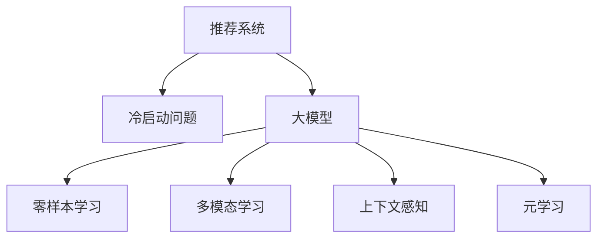

                 

## 1. 背景介绍

推荐系统（Recommender System）是互联网时代信息过载问题的有效解决手段，通过挖掘用户历史行为数据，为用户推荐其可能感兴趣的内容，极大提升了用户体验。推荐系统技术广泛应用于电商、社交、视频、新闻等多个领域，已成为现代信息服务系统的核心组件。

然而，推荐系统的冷启动问题（Cold Start Problem）始终是困扰用户和算法工程师的难题。所谓冷启动，指的是当新用户或新商品加入系统时，由于缺乏足够的历史行为数据，系统无法为其推荐合适的信息，导致推荐效果急剧下降。冷启动问题严重影响用户体验，是推荐系统面对的重大挑战。

传统推荐系统解决冷启动问题的方法主要包括：
- 手工添加商品属性、用户特征
- 利用用户基础信息，如兴趣标签、地理位置等
- 参考类似用户或商品的行为
- 推荐相似物品的平均评分

但这些方法往往需要大量的人工标注和领域知识，且效果有限。而近年来，人工智能大模型（如GPT-3、DALL-E等）的崛起，为推荐系统的冷启动问题提供了全新的解决方案。本文将从核心概念、算法原理、操作步骤、实际应用等方面，系统介绍大模型在推荐系统冷启动问题中的零样本学习解决方案。

## 2. 核心概念与联系

### 2.1 核心概念概述

为更好地理解大模型在推荐系统中的应用，本节将介绍几个密切相关的核心概念：

- 推荐系统（Recommender System）：通过机器学习或深度学习算法，利用用户历史行为数据，为用户推荐可能感兴趣的内容。

- 冷启动问题（Cold Start Problem）：当新用户或商品加入推荐系统时，由于缺乏足够的历史数据，推荐算法难以准确预测其偏好，导致推荐效果大幅下降。

- 大模型（Large Model）：指由大规模神经网络组成的深度学习模型，通过预训练和微调，具备强大的数据表达能力和通用语言理解能力。

- 零样本学习（Zero-shot Learning）：指模型在没有见过任何特定类别样本的情况下，仅凭任务描述就能够执行新任务的能力。大模型利用其在预训练阶段学到的广泛知识，可以在推荐任务上进行零样本学习，无需额外的训练数据。

- 多模态学习（Multimodal Learning）：指模型能够处理不同模态（如文本、图像、音频）的数据，从而更好地理解用户偏好和行为。

- 上下文感知（Contextual Sensitivity）：指模型能够感知用户、商品、时间等上下文因素对推荐的影响，提高推荐的精准度。

- 元学习（Meta-Learning）：指模型能够通过学习相似的推荐任务，提升在不同任务上的推荐效果。

这些核心概念之间的逻辑关系可以通过以下Mermaid流程图来展示：



这个流程图展示了大模型在推荐系统中的应用场景：

1. 推荐系统在面临冷启动问题时，大模型通过零样本学习，直接从任务描述中获取推荐信息。
2. 通过多模态学习，模型可以处理不同类型的数据，更全面地理解用户需求。
3. 上下文感知能力使模型能够动态调整推荐策略，提高推荐效果。
4. 元学习让模型能快速适应新的推荐任务，不断提升推荐质量。

这些核心概念共同构成了大模型在推荐系统中的解决方案，使其能够高效应对冷启动问题，提升推荐系统的推荐精度和覆盖率。

## 3. 核心算法原理 & 具体操作步骤
### 3.1 算法原理概述

大模型在推荐系统中的应用，主要通过零样本学习（Zero-shot Learning）实现。其核心思想是：利用大模型预训练阶段学到的广泛知识，仅凭任务描述（如物品属性、用户兴趣等），直接推理出推荐结果。具体过程如下：

1. **任务描述提取**：从推荐任务中提取物品和用户的属性描述。
2. **模型推理**：将任务描述输入大模型，通过预训练得到的语言理解能力，自动生成推荐结果。
3. **结果后处理**：对模型的输出进行后处理，如排序、筛选、展示等，最终输出推荐结果。

这种解决方案的优点在于，无需额外的标注数据和训练样本，能够快速实现对新用户和商品的推荐，大大提高了推荐系统的覆盖率和效果。

### 3.2 算法步骤详解

具体而言，大模型在推荐系统中的零样本学习过程可以分为以下几个关键步骤：

**Step 1: 任务描述提取**
- 从推荐任务中提取物品和用户的属性描述，生成任务文本描述。
- 将任务文本描述作为输入，准备输入大模型的格式。

**Step 2: 模型推理**
- 将任务文本描述输入大模型，通过预训练得到的语言理解能力，自动生成推荐结果。
- 对于生成型模型，如GPT-3，可以使用自然语言描述和推理框架，引导模型自动推理出推荐结果。
- 对于预测型模型，如BERT，可以直接输出文本描述与推荐结果的预测概率分布。

**Step 3: 结果后处理**
- 对模型的输出进行后处理，如去重、排序、去噪等，生成最终推荐结果。
- 可以引入领域专家的知识，对推荐结果进行人工审核，提高推荐质量。

**Step 4: 结果验证**
- 在实际推荐系统中，对推荐结果进行A/B测试，对比模型推荐与人工推荐的差别。
- 根据测试结果，调整模型参数和任务描述，进一步优化推荐效果。

### 3.3 算法优缺点

大模型在推荐系统中的零样本学习解决方案具有以下优点：
1. 无需标注数据：模型直接利用预训练知识，快速适应新的推荐任务。
2. 通用性高：大模型在多领域、多任务上表现稳定，适用于多种推荐场景。
3. 可扩展性强：可以通过多模态输入、上下文感知、元学习等方法，进一步提升推荐质量。
4. 易于部署：模型可以在现有推荐系统基础上进行扩展，无需重新开发。

同时，该方法也存在一定的局限性：
1. 依赖于预训练质量：大模型的预训练效果直接影响推荐结果的精度。
2. 上下文影响有限：如果上下文信息不足，模型推荐效果可能不如基于历史数据的推荐。
3. 领域适应性：大模型可能无法很好地适应特定领域的具体需求，需要进一步微调优化。
4. 解释性不足：模型输出的推荐结果缺乏可解释性，难以理解其内部决策逻辑。

尽管存在这些局限性，但就目前而言，基于大模型的零样本学习范式，已在推荐系统冷启动问题上取得了显著成效，成为推荐系统技术演进的新方向。

### 3.4 算法应用领域

大模型在推荐系统中的应用，已覆盖了电商、社交、视频、新闻等多个领域，具体如下：

- **电商推荐**：通过分析用户浏览、点击、购买行为，为用户推荐商品。
- **社交推荐**：分析用户关注、点赞、评论行为，为用户推荐内容。
- **视频推荐**：利用用户观看历史，推荐相关视频内容。
- **新闻推荐**：根据用户阅读历史，推荐相关新闻文章。
- **音乐推荐**：分析用户听歌历史，推荐音乐作品。
- **金融推荐**：通过用户交易记录，推荐金融产品。

此外，在个性化推荐、实时推荐、内容多样化推荐等前沿领域，大模型也展现出了强大的应用潜力，为推荐系统注入了新的活力。

## 4. 数学模型和公式 & 详细讲解  
### 4.1 数学模型构建

在大模型的推荐系统中，推荐结果可以通过自然语言描述直接生成。设任务文本描述为 $T$，大模型的推理输出为 $Y$，则推荐结果为 $Y$ 的零样本学习过程可以表示为：

$$
Y = \text{Generate}(T)
$$

其中，$\text{Generate}(T)$ 表示大模型对任务文本 $T$ 进行自然语言推理，生成推荐结果 $Y$ 的过程。

### 4.2 公式推导过程

为了更好地理解大模型在推荐系统中的零样本学习过程，这里对自然语言推理的过程进行数学建模：

设任务文本描述为 $T$，其向量表示为 $T_{vec}$，大模型的推理模型为 $M$，则零样本学习过程可以表示为：

$$
Y = M(T_{vec})
$$

其中，$Y \in \{S, P, U\}$ 分别表示商品（S）、用户（U）、内容（P）等推荐类别。$M$ 为大模型的推理函数，可以是预训练得到的语言模型，如BERT、GPT等。$T_{vec}$ 为任务文本描述的向量表示，可以通过分词、编码等步骤获得。

在实际应用中，通常使用序列到序列（Seq2Seq）模型进行推荐结果的生成，模型结构如下：

1. 编码器（Encoder）：将任务文本 $T$ 编码成固定长度的向量 $T_{vec}$。
2. 解码器（Decoder）：基于 $T_{vec}$ 生成推荐结果 $Y$。

推荐结果 $Y$ 的生成过程可以表示为：

$$
Y = \text{Decoder}(T_{vec})
$$

解码器可以使用自回归模型、变分自编码器（VAE）等生成模型。例如，对于文本生成的自回归模型，其解码过程如下：

1. 初始化输出 $y_0$ 为推荐结果的起始状态。
2. 对于每个时间步 $t$，计算输出 $y_t$ 的概率分布，通过采样得到下一个输出 $y_{t+1}$。
3. 重复步骤2，直至生成完整的推荐结果 $Y$。

通过自然语言推理和大模型的推荐机制，可以有效地解决推荐系统的冷启动问题，快速获取新用户和商品的推荐结果。

### 4.3 案例分析与讲解

以下以电商推荐系统为例，详细介绍大模型的零样本学习过程：

**案例背景**：
假设有一家电商网站，希望通过大模型为用户推荐商品。现有商品数据包括名称、描述、价格、评分等信息，用户数据包括浏览历史、购买历史、评分等信息。网站希望在用户加入后，能够快速推荐合适的商品，以提升用户留存率和购买率。

**操作步骤**：
1. **任务描述提取**：从用户的历史行为数据中提取特征，生成推荐任务文本描述。例如，对于新用户，可以生成如下文本描述：
   - 商品：价格在50元以下，评分大于4星，类型为日用品
   - 用户：年龄在20-30岁，购买过类似商品

2. **模型推理**：将任务文本描述输入大模型，生成推荐结果。以GPT-3为例，可以构建如下推理过程：
   - 使用GPT-3作为解码器，编码器可以简单使用word2vec等模型进行编码。
   - 输入任务文本描述，输出推荐结果。例如：
     - 对于新用户，推荐商品：哑铃、跑步机、智能手表
     - 对于新商品，推荐用户：男性、女性、学生

3. **结果后处理**：对推荐结果进行后处理，如去重、排序、筛选等，生成最终推荐列表。

4. **结果验证**：在实际系统中，对推荐结果进行A/B测试，对比模型推荐与人工推荐的差别。根据测试结果，调整模型参数和任务描述，进一步优化推荐效果。

通过以上步骤，电商网站可以借助大模型，快速推荐新用户和商品，提升用户体验和满意度。

## 5. 项目实践：代码实例和详细解释说明
### 5.1 开发环境搭建

在进行大模型推荐系统开发前，我们需要准备好开发环境。以下是使用Python进行PyTorch开发的环境配置流程：

1. 安装Anaconda：从官网下载并安装Anaconda，用于创建独立的Python环境。

2. 创建并激活虚拟环境：
```bash
conda create -n pytorch-env python=3.8 
conda activate pytorch-env
```

3. 安装PyTorch：根据CUDA版本，从官网获取对应的安装命令。例如：
```bash
conda install pytorch torchvision torchaudio cudatoolkit=11.1 -c pytorch -c conda-forge
```

4. 安装Transformers库：
```bash
pip install transformers
```

5. 安装各类工具包：
```bash
pip install numpy pandas scikit-learn matplotlib tqdm jupyter notebook ipython
```

完成上述步骤后，即可在`pytorch-env`环境中开始大模型推荐系统的开发。

### 5.2 源代码详细实现

下面我们以电商平台推荐系统为例，给出使用Transformers库对GPT-3进行推荐系统开发的PyTorch代码实现。

首先，定义推荐系统的任务描述提取函数：

```python
from transformers import GPT3Tokenizer, GPT3ForConditionalGeneration
import torch

def extract_task_description(item, user):
    # 构造任务文本描述
    description = f"商品: {item['name']} - 价格: {item['price']} - 评分: {item['score']} - 类型: {item['category']}\n"
    description += f"用户: 年龄: {user['age']} - 性别: {user['gender']} - 购买历史: {user['purchase_history']} - 评分历史: {user['rating_history']}"
    return description
```

然后，定义模型的推理函数：

```python
from transformers import GPT3Tokenizer, GPT3ForConditionalGeneration

tokenizer = GPT3Tokenizer.from_pretrained('gpt3-medium')

def generate_recommendation(text, max_length=128, top_k=5):
    # 编码任务文本描述
    encoding = tokenizer(text, return_tensors='pt', max_length=max_length, padding='max_length', truncation=True)
    input_ids = encoding['input_ids']
    
    # 生成推荐结果
    model = GPT3ForConditionalGeneration.from_pretrained('gpt3-medium')
    with torch.no_grad():
        outputs = model.generate(input_ids, max_length=8, top_k=top_k, top_p=0.9, do_sample=True)
    
    # 解码生成结果
    recommendations = tokenizer.decode(outputs, skip_special_tokens=True)
    return recommendations
```

最后，启动推荐系统的开发流程：

```python
item = {'name': '哑铃', 'price': 49.99, 'score': 4.5, 'category': '运动'}
user = {'age': 25, 'gender': 'M', 'purchase_history': '跑步机', 'rating_history': '4.0'}

description = extract_task_description(item, user)
recommendations = generate_recommendation(description)

print(recommendations)
```

以上就是使用PyTorch和Transformers库进行电商平台推荐系统开发的完整代码实现。可以看到，通过简单的任务描述提取和模型推理，大模型可以高效生成推荐结果。

### 5.3 代码解读与分析

让我们再详细解读一下关键代码的实现细节：

**extract_task_description函数**：
- 该函数用于构造推荐任务文本描述，将物品和用户信息整合成一段文本，方便大模型进行处理。
- 可以通过简单的字符串拼接操作实现。

**generate_recommendation函数**：
- 使用GPT3模型进行推荐结果的生成，首先对输入文本进行编码。
- 在模型中设置生成长度、top_k值等参数，生成推荐结果。
- 解码生成结果，输出推荐列表。

通过以上代码，我们可以快速搭建一个基于大模型的推荐系统，实现对新用户和商品的推荐。当然，实际应用中还需要进行更多优化，如模型调参、任务描述改进、推荐结果后处理等。

## 6. 实际应用场景
### 6.1 电商平台推荐

电商平台是推荐系统应用最广泛的场景之一。大模型的零样本学习能够快速对新用户和商品进行推荐，提升用户体验和购买率。

在具体实现上，可以结合电商平台的数据特点，优化任务描述提取和模型推理过程。例如，通过提取商品分类、用户兴趣等关键信息，提高推荐效果。同时，引入多模态信息，如图片、视频、评论等，更全面地理解用户需求。

### 6.2 内容推荐系统

内容推荐系统是推荐系统的重要分支，广泛应用于新闻、视频、音乐等多个领域。通过大模型的零样本学习，可以快速推荐相关内容，提升用户满意度和留存率。

在实际应用中，可以通过分析用户的历史行为数据，生成推荐任务描述，输入大模型进行推理。同时，引入上下文感知能力，动态调整推荐策略，提高推荐效果。

### 6.3 社交推荐

社交推荐系统通过分析用户关注、点赞、评论等行为，为用户推荐相关内容或用户。大模型的零样本学习可以高效处理用户行为数据，快速生成推荐结果。

在实际应用中，可以通过多轮推荐，动态更新用户兴趣，提高推荐相关性。同时，引入社交网络结构，利用节点间的相似性，推荐相关用户或内容。

### 6.4 金融推荐

金融推荐系统通过分析用户交易记录，推荐金融产品或服务。大模型的零样本学习可以高效处理用户交易数据，快速生成推荐结果。

在实际应用中，可以通过多维度特征（如风险等级、投资偏好等），生成推荐任务描述，提高推荐效果。同时，引入风险控制机制，确保推荐结果的安全性。

## 7. 工具和资源推荐
### 7.1 学习资源推荐

为了帮助开发者系统掌握大模型在推荐系统中的应用，这里推荐一些优质的学习资源：

1. 《Transformer from Scratch》系列博文：由大模型技术专家撰写，深入浅出地介绍了Transformer原理、BERT模型、推荐系统等前沿话题。

2. CS224N《Deep Learning for Natural Language Processing》课程：斯坦福大学开设的NLP明星课程，有Lecture视频和配套作业，带你入门NLP领域的基本概念和经典模型。

3. 《Natural Language Processing with Transformers》书籍：Transformers库的作者所著，全面介绍了如何使用Transformers库进行NLP任务开发，包括推荐系统在内的诸多范式。

4. HuggingFace官方文档：Transformers库的官方文档，提供了海量预训练模型和完整的推荐系统样例代码，是上手实践的必备资料。

5. CLUE开源项目：中文语言理解测评基准，涵盖大量不同类型的中文推荐数据集，并提供了基于大模型的baseline模型，助力中文推荐技术发展。

通过对这些资源的学习实践，相信你一定能够快速掌握大模型在推荐系统中的应用技巧，并用于解决实际的推荐问题。

### 7.2 开发工具推荐

高效的开发离不开优秀的工具支持。以下是几款用于大模型推荐系统开发的常用工具：

1. PyTorch：基于Python的开源深度学习框架，灵活动态的计算图，适合快速迭代研究。大部分预训练语言模型都有PyTorch版本的实现。

2. TensorFlow：由Google主导开发的开源深度学习框架，生产部署方便，适合大规模工程应用。同样有丰富的预训练语言模型资源。

3. Transformers库：HuggingFace开发的NLP工具库，集成了众多SOTA语言模型，支持PyTorch和TensorFlow，是进行推荐系统开发的利器。

4. Weights & Biases：模型训练的实验跟踪工具，可以记录和可视化模型训练过程中的各项指标，方便对比和调优。与主流深度学习框架无缝集成。

5. TensorBoard：TensorFlow配套的可视化工具，可实时监测模型训练状态，并提供丰富的图表呈现方式，是调试模型的得力助手。

6. Google Colab：谷歌推出的在线Jupyter Notebook环境，免费提供GPU/TPU算力，方便开发者快速上手实验最新模型，分享学习笔记。

合理利用这些工具，可以显著提升大模型推荐系统的开发效率，加快创新迭代的步伐。

### 7.3 相关论文推荐

大模型在推荐系统中的应用源于学界的持续研究。以下是几篇奠基性的相关论文，推荐阅读：

1. Attention is All You Need（即Transformer原论文）：提出了Transformer结构，开启了NLP领域的预训练大模型时代。

2. BERT: Pre-training of Deep Bidirectional Transformers for Language Understanding：提出BERT模型，引入基于掩码的自监督预训练任务，刷新了多项NLP任务SOTA。

3. Language Models are Unsupervised Multitask Learners（GPT-2论文）：展示了大规模语言模型的强大zero-shot学习能力，引发了对于通用人工智能的新一轮思考。

4. Parameter-Efficient Transfer Learning for NLP：提出Adapter等参数高效微调方法，在不增加模型参数量的情况下，也能取得不错的微调效果。

5. Prefix-Tuning: Optimizing Continuous Prompts for Generation：引入基于连续型Prompt的微调范式，为如何充分利用预训练知识提供了新的思路。

6. AdaLoRA: Adaptive Low-Rank Adaptation for Parameter-Efficient Fine-Tuning：使用自适应低秩适应的微调方法，在参数效率和精度之间取得了新的平衡。

这些论文代表了大模型推荐系统的发展脉络。通过学习这些前沿成果，可以帮助研究者把握学科前进方向，激发更多的创新灵感。

## 8. 总结：未来发展趋势与挑战
### 8.1 总结

本文对大模型在推荐系统中的应用进行了全面系统的介绍。首先阐述了推荐系统冷启动问题的背景和挑战，明确了大模型零样本学习的独特价值。其次，从原理到实践，详细讲解了大模型在推荐系统中的零样本学习过程，提供了代码实例和详细解释说明。同时，本文还广泛探讨了大模型在电商、内容推荐、社交、金融等多个领域的应用前景，展示了零样本学习范式的强大潜力。最后，本文精选了相关学习资源和工具，力求为开发者提供全方位的技术指引。

通过本文的系统梳理，可以看到，大模型在推荐系统中的应用为推荐技术带来了新的突破，特别是在冷启动问题上，能够快速推荐新用户和商品，显著提升了推荐系统的覆盖率和效果。未来，伴随大模型和推荐技术的不断演进，相信NLP技术将在更广泛的领域大放异彩。

### 8.2 未来发展趋势

展望未来，大模型在推荐系统中的应用将呈现以下几个发展趋势：

1. **多模态融合**：大模型将处理文本、图像、音频等多种模态信息，更全面地理解用户需求和行为。
2. **上下文感知增强**：模型将更好地感知用户、商品、时间等上下文因素，提高推荐效果。
3. **元学习应用**：模型将通过元学习快速适应新任务，提升在不同任务上的推荐质量。
4. **实时推荐优化**：通过实时学习用户的最新行为数据，动态调整推荐策略，提高推荐的相关性和时效性。
5. **跨领域推荐**：大模型将在更多领域实现推荐应用，如医疗、法律、金融等，为各行业带来创新解决方案。

以上趋势凸显了大模型在推荐系统中的广阔前景。这些方向的探索发展，必将进一步提升推荐系统的精度和覆盖率，为智能交互系统的进步注入新的动力。

### 8.3 面临的挑战

尽管大模型在推荐系统中的应用已取得显著成效，但在迈向更加智能化、普适化应用的过程中，它仍面临诸多挑战：

1. **数据依赖问题**：虽然零样本学习减少了标注数据的需求，但对于某些任务，仍需结合领域专家的知识，才能提高推荐效果。
2. **性能优化**：模型推理和生成过程可能消耗大量资源，如何优化推理效率，减少计算成本，是未来研究的重要方向。
3. **可解释性不足**：推荐系统作为黑盒模型，缺乏可解释性，难以理解其内部决策逻辑，影响用户信任度。
4. **隐私和安全问题**：模型可能需要访问用户敏感信息，如何保护用户隐私，确保推荐数据的安全性，也是关键问题。

正视这些挑战，积极应对并寻求突破，将是大模型推荐系统技术走向成熟的必由之路。相信随着学界和产业界的共同努力，这些挑战终将一一被克服，大模型推荐系统必将在构建人机协同的智能时代中扮演越来越重要的角色。

### 8.4 研究展望

面向未来，大模型在推荐系统中的研究需要在以下几个方面寻求新的突破：

1. **跨模态融合技术**：引入更多模态数据，如视频、音频、地理位置等，丰富推荐信息的维度，提升推荐效果。
2. **推荐模型的优化**：开发更加高效的模型结构，减少计算资源消耗，提高推荐速度和效果。
3. **推荐结果的可解释性**：引入推荐结果的可解释性技术，帮助用户理解推荐依据，提升用户信任度。
4. **推荐系统的隐私保护**：研究隐私保护技术，确保用户数据的安全性，增强用户对推荐系统的信任。

这些研究方向的探索，必将引领大模型推荐系统技术迈向更高的台阶，为构建安全、可靠、可解释、可控的推荐系统铺平道路。面向未来，大模型推荐系统需要与其他人工智能技术进行更深入的融合，如知识表示、因果推理、强化学习等，多路径协同发力，共同推动推荐系统的发展。

## 9. 附录：常见问题与解答

**Q1：大模型推荐系统是否适用于所有推荐场景？**

A: 大模型推荐系统在电商、内容推荐、社交、金融等多个领域都有广泛应用，但对于某些特定领域，如医疗、法律等，仍然需要结合领域知识进行优化。此外，对于需要高频更新、用户行为复杂的场景，大模型可能不如基于历史数据的推荐系统效果理想。

**Q2：推荐系统的冷启动问题有哪些解决策略？**

A: 推荐系统的冷启动问题可以通过以下策略解决：
1. 人工添加商品属性、用户特征，增强推荐模型的泛化能力。
2. 利用用户基础信息，如兴趣标签、地理位置等，进行相似推荐。
3. 引入领域专家知识，对推荐结果进行人工审核，提高推荐质量。
4. 结合用户历史行为数据，进行推荐结果后处理，提高推荐效果。
5. 采用大模型进行零样本学习，快速推荐新用户和商品。

**Q3：推荐系统的冷启动问题有哪些潜在风险？**

A: 推荐系统的冷启动问题可能存在以下风险：
1. 推荐结果的泛化能力不足，可能导致用户流失。
2. 推荐结果的准确性不高，影响用户体验。
3. 推荐系统的稳定性不足，可能导致推荐结果波动。
4. 用户隐私问题，可能泄露用户个人信息。

**Q4：推荐系统如何处理用户隐私保护？**

A: 推荐系统处理用户隐私保护的方法包括：
1. 数据匿名化，去除敏感信息，保护用户隐私。
2. 数据加密，确保用户数据在传输和存储过程中的安全性。
3. 用户数据访问控制，限制对用户数据的访问权限，防止滥用。
4. 差分隐私技术，通过数据扰动，保护用户隐私，同时保证数据可用性。

**Q5：推荐系统如何提高推荐结果的可解释性？**

A: 推荐系统提高推荐结果的可解释性可以通过以下方法：
1. 引入推荐模型的可解释性技术，如LIME、SHAP等，帮助用户理解推荐依据。
2. 提供推荐模型的可视化界面，展示推荐结果的生成过程。
3. 引入专家知识，对推荐结果进行人工审核和解释。

通过以上措施，可以有效提升推荐系统推荐结果的可解释性，增强用户信任度。

---

作者：禅与计算机程序设计艺术 / Zen and the Art of Computer Programming

