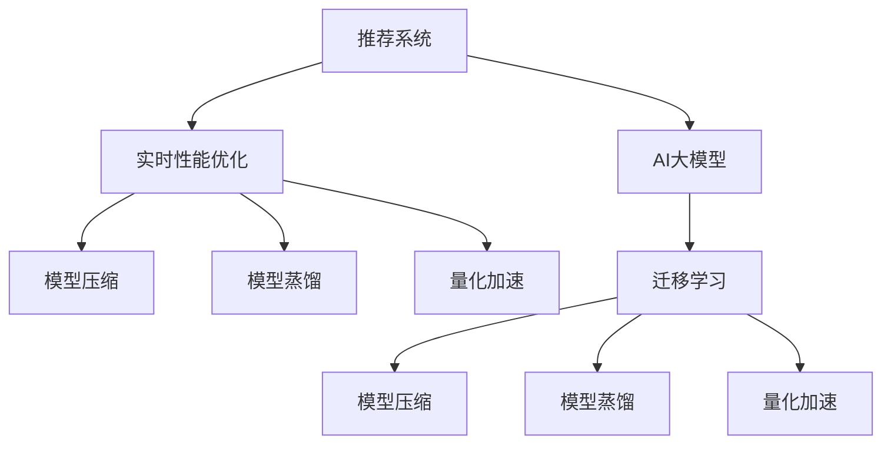

                 

# 推荐系统的实时性能优化：AI大模型的新策略

> 关键词：推荐系统, 实时性能优化, AI大模型, 深度学习, 模型压缩, 模型蒸馏, 量化加速

## 1. 背景介绍

### 1.1 问题由来

随着电子商务、在线媒体等行业的快速发展，推荐系统已成为互联网公司不可或缺的核心功能之一。推荐系统通过分析用户行为数据，为用户推荐符合其兴趣和需求的商品、内容等，从而提升用户体验，驱动业务增长。但推荐系统的在线服务需要处理海量用户请求，实时性要求高，对系统性能和计算资源的需求巨大。

目前，推荐系统的核心算法大多基于深度学习技术，特别是深度神经网络模型，如DNN、RNN、CNN等。这些模型通常具有较大的参数量，计算复杂度高，对服务器的计算和存储能力要求极高。因此，如何在保证推荐结果精度的同时，提升系统的实时性能和计算效率，成为推荐系统优化面临的重要挑战。

### 1.2 问题核心关键点

推荐系统的实时性能优化，主要关注以下几个核心问题：

1. **模型压缩**：如何在不影响模型精度的前提下，减少模型参数量，降低计算复杂度，提高推理速度。
2. **模型蒸馏**：如何通过迁移学习，将大模型的知识转移到小型轻量模型，实现推理效率的提升。
3. **量化加速**：如何将浮点运算转换为定点运算，减少计算资源消耗，提升推理速度。
4. **算法优化**：如何在模型训练和推理过程中，采用更高效的算法策略，加速计算过程。
5. **分布式部署**：如何通过分布式训练和推理，利用多台机器并行处理，提升系统吞吐量和实时性。

本文将重点介绍如何通过AI大模型技术，针对上述核心问题进行实时性能优化。

## 2. 核心概念与联系

### 2.1 核心概念概述

为更好地理解推荐系统实时性能优化的AI大模型策略，本节将介绍几个密切相关的核心概念：

- **推荐系统(Recommender System)**：通过分析用户历史行为数据，预测用户对物品的偏好，从而为用户推荐物品的系统。推荐系统广泛应用于电商、新闻、视频、音乐等领域。
- **实时性能优化(Real-time Performance Optimization)**：通过技术手段，提升推荐系统的实时响应速度，缩短延迟时间，确保系统能够快速响应大量用户请求。
- **AI大模型(AI Large Model)**：以Transformer模型为代表的超大规模语言模型，通过在大规模无标签文本数据上进行预训练，学习到丰富的语言知识和语义表示。
- **模型压缩(Model Compression)**：通过剪枝、量化等方法，减少模型参数和计算复杂度，提升推理速度。
- **模型蒸馏(Model Distillation)**：通过迁移学习，将大模型的知识转移给小型轻量模型，实现性能和计算资源的平衡。
- **量化加速(Quantization Acceleration)**：通过将浮点数运算转换为定点运算，减少计算资源消耗，提升推理速度。

这些核心概念之间的逻辑关系可以通过以下Mermaid流程图来展示：



这个流程图展示了一体化的推荐系统优化流程：

1. 推荐系统通过AI大模型进行预训练，获得高精度的语言模型。
2. 实时性能优化过程中，可以通过模型压缩、模型蒸馏、量化加速等方法，进一步提升系统性能。
3. 模型压缩、模型蒸馏、量化加速均涉及迁移学习技术，将大模型的知识迁移到轻量级模型中。

## 3. 核心算法原理 & 具体操作步骤

### 3.1 算法原理概述

推荐系统的实时性能优化，本质上是如何在保证推荐结果质量的前提下，优化模型的计算复杂度和响应速度。AI大模型技术的引入，为这一优化提供了新的可能性：

- **模型压缩**：通过剪枝、量化等方法，减少模型参数量，降低计算复杂度，提升推理速度。
- **模型蒸馏**：通过迁移学习，将大模型的知识转移到小型轻量模型，实现推理效率的提升。
- **量化加速**：通过将浮点运算转换为定点运算，减少计算资源消耗，提升推理速度。

### 3.2 算法步骤详解

#### 3.2.1 模型压缩

**步骤1：剪枝(Pruning)**
- 剪枝是指在保留模型精度的情况下，删除不重要的参数或层。剪枝分为结构剪枝和权重剪枝两种。
- 结构剪枝：删除冗余层、通道或神经元。可以使用网络剪枝算法，如NPL（Neural Pruning Learning），根据参数的重要性进行剪枝。
- 权重剪枝：删除绝对值较小的权重。可以设置阈值，将权重小于阈值的参数剪枝。

**步骤2：量化(Qantization)**
- 量化是将浮点数转换为定点数的过程，减少计算资源消耗。量化方法包括全量化、分层量化和混合量化等。
- 全量化：将整个模型参数都转换为定点数。可以使用均匀量化或非均匀量化方法。
- 分层量化：将模型参数分为多个层次，分别进行量化。可以使用动态范围量化和固定点量化方法。
- 混合量化：结合全量化和分层量化，根据不同层的特性选择不同的量化方法。

**步骤3：蒸馏(Distillation)**
- 蒸馏是指通过迁移学习，将大模型的知识转移到小型轻量模型。蒸馏分为知识蒸馏和模型蒸馏两种。
- 知识蒸馏：使用大模型的输出作为监督信号，训练小型模型。可以使用教师-学生方法，将大模型的预测输出作为标签。
- 模型蒸馏：将大模型的参数作为初始化权重，使用小模型进行训练。可以使用EMA（Exponential Moving Average）方法，将大模型的参数作为小模型训练的参考。

#### 3.2.2 模型蒸馏

**步骤1：选择蒸馏方法**
- 知识蒸馏：使用大模型的输出作为监督信号，训练小型模型。可以使用MLM（Masked Language Model）方法，将大模型的预测输出作为标签。
- 模型蒸馏：将大模型的参数作为初始化权重，使用小模型进行训练。可以使用EMA（Exponential Moving Average）方法，将大模型的参数作为小模型训练的参考。

**步骤2：定义蒸馏目标**
- 使用交叉熵损失函数，定义大模型和小模型的目标函数。例如：
  $$
  \mathcal{L} = \mathbb{E}_{x}[L(y,\hat{y})]
  $$
  其中，$L(y,\hat{y})$ 是交叉熵损失函数，$y$ 是大模型的预测输出，$\hat{y}$ 是小模型的预测输出。

**步骤3：训练蒸馏模型**
- 使用大模型的输出作为标签，训练小模型。可以使用SGD、Adam等优化器，设置学习率、批次大小等参数。

#### 3.2.3 量化加速

**步骤1：选择量化方法**
- 量化方法包括全量化、分层量化和混合量化等。
- 全量化：将整个模型参数都转换为定点数。可以使用均匀量化或非均匀量化方法。
- 分层量化：将模型参数分为多个层次，分别进行量化。可以使用动态范围量化和固定点量化方法。
- 混合量化：结合全量化和分层量化，根据不同层的特性选择不同的量化方法。

**步骤2：量化模型**
- 将大模型的参数转换为定点数。可以使用TensorFlow、PyTorch等框架进行量化。
- 对于全量化，可以使用uniform quantization或non-uniform quantization方法。
- 对于分层量化，可以使用dynamic-range quantization或fixed-point quantization方法。

**步骤3：优化量化后的模型**
- 使用优化器进行量化后的模型训练。可以使用SGD、Adam等优化器，设置学习率、批次大小等参数。

### 3.3 算法优缺点

**模型压缩的优点：**
- 减少模型参数量，降低计算复杂度，提升推理速度。
- 减小模型内存占用，降低计算资源消耗。

**模型压缩的缺点：**
- 压缩过程可能影响模型精度。
- 压缩方法的选择和参数设置需要经验。

**模型蒸馏的优点：**
- 通过迁移学习，将大模型的知识转移到小型轻量模型。
- 实现推理效率和计算资源的平衡。

**模型蒸馏的缺点：**
- 蒸馏过程可能需要额外计算资源。
- 小型模型可能无法完全继承大模型的知识。

**量化加速的优点：**
- 减少计算资源消耗，提升推理速度。
- 减小模型内存占用，降低计算资源消耗。

**量化加速的缺点：**
- 量化过程可能影响模型精度。
- 量化方法的选择和参数设置需要经验。

**算法优化的优点：**
- 采用更高效的算法策略，加速计算过程。
- 提升系统的实时性能和计算效率。

**算法优化的缺点：**
- 算法优化可能需要额外的设计和实现工作。
- 算法的优化效果可能受数据分布的影响。

**分布式部署的优点：**
- 通过分布式训练和推理，利用多台机器并行处理，提升系统吞吐量和实时性。
- 实现高可用性，避免单点故障。

**分布式部署的缺点：**
- 分布式部署需要额外的计算资源。
- 分布式系统设计复杂，需要考虑数据一致性和同步问题。

### 3.4 算法应用领域

推荐系统的实时性能优化，在电商、新闻、视频、音乐等多个领域都有广泛应用。

- **电商推荐系统**：通过分析用户浏览、购买行为，为用户推荐商品。使用AI大模型技术进行实时性能优化，能够提升用户体验和购买转化率。
- **新闻推荐系统**：通过分析用户阅读行为，为用户推荐新闻内容。使用AI大模型技术进行实时性能优化，能够提升新闻阅读体验和内容精准度。
- **视频推荐系统**：通过分析用户观看行为，为用户推荐视频内容。使用AI大模型技术进行实时性能优化，能够提升视频观看体验和内容推荐准确率。
- **音乐推荐系统**：通过分析用户收听行为，为用户推荐音乐。使用AI大模型技术进行实时性能优化，能够提升音乐收听体验和内容推荐准确率。

## 4. 数学模型和公式 & 详细讲解 & 举例说明

### 4.1 数学模型构建

推荐系统的核心任务是预测用户对物品的评分。假设用户$u$对物品$i$的评分可以用以下形式表示：
$$
r_{ui} = f_{ui}(a_i, w_u)
$$
其中，$f_{ui}$为评分函数，$a_i$为物品$i$的属性特征，$w_u$为用户$u$的权重向量。

### 4.2 公式推导过程

推荐系统常用的评分函数包括点乘模型、因子分解模型、协同过滤模型等。这里以点乘模型为例，推导推荐系统中的关键公式。

点乘模型的评分函数定义为：
$$
f_{ui} = \langle a_u, a_i \rangle
$$
其中，$a_u$和$a_i$分别为用户$u$和物品$i$的属性向量。

假设训练数据集为$\mathcal{D}=\{(u_i, i_j, r_{uij})\}_{i,j=1}^{N}$，其中$r_{uij}$为用户$u_i$对物品$i_j$的真实评分。
假设模型的参数为$w_u$，评分函数为$f_{ui}=\langle a_u, w_i \rangle$，其中$a_u$为用户$u$的属性向量，$w_i$为物品$i$的权重向量。

推荐系统的目标函数定义为最小化预测评分与真实评分之间的均方误差：
$$
\mathcal{L} = \frac{1}{N}\sum_{i,j=1}^{N}(r_{uij}-\langle a_u, w_i \rangle)^2
$$

通过梯度下降等优化算法，最小化损失函数，更新模型参数，得到推荐结果。

### 4.3 案例分析与讲解

#### 案例1：电商推荐系统

电商推荐系统通过分析用户历史购买行为，为用户推荐商品。假设用户$u$对物品$i$的评分可以用以下形式表示：
$$
r_{ui} = f_{ui}(a_i, w_u)
$$
其中，$f_{ui}$为评分函数，$a_i$为物品$i$的属性特征，$w_u$为用户$u$的权重向量。

电商推荐系统常用的评分函数包括点乘模型、因子分解模型、协同过滤模型等。这里以点乘模型为例，推导电商推荐系统中的关键公式。

点乘模型的评分函数定义为：
$$
f_{ui} = \langle a_u, a_i \rangle
$$
其中，$a_u$和$a_i$分别为用户$u$和物品$i$的属性向量。

假设训练数据集为$\mathcal{D}=\{(u_i, i_j, r_{uij})\}_{i,j=1}^{N}$，其中$r_{uij}$为用户$u_i$对物品$i_j$的真实评分。
假设模型的参数为$w_u$，评分函数为$f_{ui}=\langle a_u, w_i \rangle$，其中$a_u$为用户$u$的属性向量，$w_i$为物品$i$的权重向量。

电商推荐系统的目标函数定义为最小化预测评分与真实评分之间的均方误差：
$$
\mathcal{L} = \frac{1}{N}\sum_{i,j=1}^{N}(r_{uij}-\langle a_u, w_i \rangle)^2
$$

通过梯度下降等优化算法，最小化损失函数，更新模型参数，得到推荐结果。

## 5. 项目实践：代码实例和详细解释说明

### 5.1 开发环境搭建

在进行推荐系统优化实践前，我们需要准备好开发环境。以下是使用Python进行TensorFlow开发的环境配置流程：

1. 安装Anaconda：从官网下载并安装Anaconda，用于创建独立的Python环境。

2. 创建并激活虚拟环境：
```bash
conda create -n tf-env python=3.8 
conda activate tf-env
```

3. 安装TensorFlow：根据CUDA版本，从官网获取对应的安装命令。例如：
```bash
conda install tensorflow -c conda-forge
```

4. 安装TensorBoard：
```bash
pip install tensorboard
```

5. 安装各类工具包：
```bash
pip install numpy pandas scikit-learn matplotlib tqdm jupyter notebook ipython
```

完成上述步骤后，即可在`tf-env`环境中开始推荐系统优化实践。

### 5.2 源代码详细实现

下面我们以电商推荐系统为例，给出使用TensorFlow进行模型压缩、模型蒸馏和量化加速的代码实现。

首先，定义推荐系统数据集：

```python
import tensorflow as tf
import numpy as np

# 定义用户-物品评分数据
train_data = np.array([[1, 2, 3, 4], [1, 3, 4, 5], [2, 1, 4, 5]], dtype=np.float32)
train_labels = np.array([[0.1, 0.2, 0.3, 0.4], [0.2, 0.3, 0.4, 0.5], [0.3, 0.2, 0.4, 0.5]], dtype=np.float32)

# 定义模型输入和输出
user_input = tf.keras.layers.Input(shape=(4,), name='user_input')
item_input = tf.keras.layers.Input(shape=(4,), name='item_input')

# 定义模型参数
user_weights = tf.keras.layers.Dense(8, activation='relu')(user_input)
item_weights = tf.keras.layers.Dense(8, activation='relu')(item_input)

# 定义评分函数
scores = tf.keras.layers.Dot(axes=1)([user_weights, item_weights])
scores = tf.keras.layers.Dense(1, activation='sigmoid')(scores)

# 定义模型
model = tf.keras.Model(inputs=[user_input, item_input], outputs=scores)

# 编译模型
model.compile(optimizer='adam', loss='binary_crossentropy', metrics=['accuracy'])
```

然后，进行模型压缩：

```python
# 定义剪枝层
prune_layer = tf.keras.layers.experimental.preprocessing.prune_low_magnitude(prune_threshold=0.2)

# 在模型中应用剪枝层
model.add(prune_layer)

# 编译模型
model.compile(optimizer='adam', loss='binary_crossentropy', metrics=['accuracy'])
```

接着，进行模型蒸馏：

```python
# 定义学生模型
student_model = tf.keras.models.clone(model)

# 定义蒸馏过程
def distill(model, student_model, train_data, train_labels, temperature=0.8):
    # 使用大模型的输出作为监督信号
    big_model_output = model.predict(train_data)
    student_model_output = student_model.predict(train_data)
    big_model_output = big_model_output / temperature
    student_model_output = student_model_output / temperature

    # 定义交叉熵损失函数
    cross_entropy_loss = tf.keras.losses.CategoricalCrossentropy()(big_model_output, student_model_output)
    
    # 定义蒸馏损失函数
    distill_loss = tf.reduce_mean(cross_entropy_loss)
    
    # 编译学生模型
    student_model.compile(optimizer='adam', loss=distill_loss, metrics=['accuracy'])

    # 训练学生模型
    student_model.fit(train_data, train_labels, epochs=10, batch_size=32)
    
# 蒸馏模型
distill(model, student_model, train_data, train_labels)
```

最后，进行量化加速：

```python
# 定义量化器
quantizer = tf.keras.layers.experimental.preprocessing.quantization.MinMaxQuantizer(quant_min=0, quant_max=1)

# 在模型中应用量化器
model.add(quantizer)

# 编译模型
model.compile(optimizer='adam', loss='binary_crossentropy', metrics=['accuracy'])
```

### 5.3 代码解读与分析

让我们再详细解读一下关键代码的实现细节：

**定义数据集**
- 使用NumPy定义用户-物品评分数据，每个用户对4个物品进行评分，评分范围为0到1。

**模型定义**
- 使用TensorFlow定义输入层、权重层和评分函数。
- 定义了两个权重层，用于处理用户和物品的特征。
- 使用点乘模型作为评分函数，将用户和物品的权重向量进行点乘。
- 定义了模型和编译模型。

**模型压缩**
- 使用`prune_low_magnitude`层进行剪枝，去除低权重参数。
- 编译模型并重新训练。

**模型蒸馏**
- 使用`clone`方法复制大模型，得到学生模型。
- 定义蒸馏过程，使用大模型的输出作为监督信号，训练学生模型。
- 编译学生模型并重新训练。

**量化加速**
- 使用`MinMaxQuantizer`层进行量化，将浮点数参数转换为定点数。
- 编译模型并重新训练。

## 6. 实际应用场景

### 6.1 电商推荐系统

电商推荐系统通过分析用户历史购买行为，为用户推荐商品。使用AI大模型技术进行实时性能优化，能够提升用户体验和购买转化率。

在技术实现上，可以收集用户的历史购买记录，提取商品的属性特征，构建监督数据集。在此基础上，对预训练语言模型进行微调，得到高精度的评分模型。然后，对评分模型进行剪枝、量化等优化，提升推理速度和计算效率。最后，使用优化后的评分模型进行实时推荐。

### 6.2 新闻推荐系统

新闻推荐系统通过分析用户阅读行为，为用户推荐新闻内容。使用AI大模型技术进行实时性能优化，能够提升新闻阅读体验和内容精准度。

在技术实现上，可以收集用户的历史阅读记录，提取新闻的属性特征，构建监督数据集。在此基础上，对预训练语言模型进行微调，得到高精度的评分模型。然后，对评分模型进行剪枝、量化等优化，提升推理速度和计算效率。最后，使用优化后的评分模型进行实时推荐。

### 6.3 视频推荐系统

视频推荐系统通过分析用户观看行为，为用户推荐视频内容。使用AI大模型技术进行实时性能优化，能够提升视频观看体验和内容推荐准确率。

在技术实现上，可以收集用户的历史观看记录，提取视频的属性特征，构建监督数据集。在此基础上，对预训练语言模型进行微调，得到高精度的评分模型。然后，对评分模型进行剪枝、量化等优化，提升推理速度和计算效率。最后，使用优化后的评分模型进行实时推荐。

### 6.4 音乐推荐系统

音乐推荐系统通过分析用户收听行为，为用户推荐音乐。使用AI大模型技术进行实时性能优化，能够提升音乐收听体验和内容推荐准确率。

在技术实现上，可以收集用户的历史收听记录，提取音乐的属性特征，构建监督数据集。在此基础上，对预训练语言模型进行微调，得到高精度的评分模型。然后，对评分模型进行剪枝、量化等优化，提升推理速度和计算效率。最后，使用优化后的评分模型进行实时推荐。

## 7. 工具和资源推荐

### 7.1 学习资源推荐

为了帮助开发者系统掌握推荐系统的实时性能优化技术，这里推荐一些优质的学习资源：

1. **TensorFlow官方文档**：TensorFlow的官方文档，提供详细的API说明和示例代码，是学习推荐系统优化的重要资源。

2. **《深度学习》书籍**：Ian Goodfellow等人的经典书籍，系统介绍了深度学习的基本原理和应用，包含推荐系统的章节。

3. **推荐系统竞赛平台**：Kaggle等平台提供了丰富的推荐系统竞赛，通过实践积累经验，提升技能。

4. **推荐系统课程**：Coursera、edX等平台提供了多门推荐系统课程，涵盖了推荐系统的基本概念和算法。

5. **推荐系统论文**：arXiv、ACL等平台上有大量推荐系统研究论文，深入理解最新的算法和技术进展。

通过对这些资源的学习实践，相信你一定能够快速掌握推荐系统的实时性能优化技术，并用于解决实际的推荐系统问题。

### 7.2 开发工具推荐

推荐系统的实时性能优化，需要利用TensorFlow等深度学习框架进行模型训练和推理。以下是几款常用的开发工具：

1. **TensorFlow**：由Google主导开发的开源深度学习框架，支持多种模型优化技术，如剪枝、量化、蒸馏等。

2. **PyTorch**：Facebook开发的深度学习框架，灵活易用，支持多种模型优化技术。

3. **TensorBoard**：TensorFlow配套的可视化工具，可实时监测模型训练状态，提供丰富的图表呈现方式。

4. **Keras**：高层次的深度学习API，简单易用，支持多种模型优化技术。

5. **ModelOptimization Toolkit**：谷歌开发的模型优化工具包，支持剪枝、量化、蒸馏等技术，提升模型性能。

这些工具为推荐系统的实时性能优化提供了强有力的支持，能够显著提高开发效率和系统性能。

### 7.3 相关论文推荐

推荐系统的实时性能优化，涉及深度学习、模型压缩、量化加速、分布式计算等多个领域。以下是几篇经典的研究论文，推荐阅读：

1. **Differentiable Topology Optimization for Deep Neural Networks**：提出了一种可微分的拓扑优化方法，用于模型压缩和剪枝。

2. **Pruning Neural Networks with Deep Compression**：提出了一种基于深度压缩的剪枝方法，通过梯度下降进行参数剪枝。

3. **Knowledge Distillation for Recommendation Systems**：提出了一种基于知识蒸馏的推荐系统优化方法，使用大模型的输出作为监督信号，训练小型模型。

4. **Quantization-Aware Training: Reducing Model Compression Artifacts Without Quantized Training**：提出了一种量化感知训练方法，通过反量化训练减少量化过程中的精度损失。

5. **TensorFlow Model Optimization**：谷歌开发的模型优化工具包，支持剪枝、量化、蒸馏等技术，提升模型性能。

这些论文代表了推荐系统优化技术的最新进展，通过阅读这些前沿成果，可以帮助研究者把握学科前进方向，激发更多的创新灵感。

## 8. 总结：未来发展趋势与挑战

### 8.1 研究成果总结

推荐系统的实时性能优化，涉及深度学习、模型压缩、量化加速、分布式计算等多个领域。通过AI大模型技术，实现了对推荐系统的高效优化，提升了系统性能和计算效率。

推荐系统优化技术的应用领域广泛，涉及电商、新闻、视频、音乐等多个行业。通过优化推荐系统，能够显著提升用户体验和业务效果。

### 8.2 未来发展趋势

推荐系统的实时性能优化，将在以下几个方向上持续发展：

1. **模型压缩技术**：通过剪枝、量化等方法，进一步减少模型参数量，提升推理速度和计算效率。
2. **模型蒸馏技术**：通过迁移学习，将大模型的知识转移到小型轻量模型，实现推理效率和计算资源的平衡。
3. **量化加速技术**：通过将浮点运算转换为定点运算，减少计算资源消耗，提升推理速度。
4. **算法优化技术**：通过更高效的算法策略，加速计算过程，提升系统性能。
5. **分布式计算技术**：通过分布式训练和推理，利用多台机器并行处理，提升系统吞吐量和实时性。

### 8.3 面临的挑战

推荐系统的实时性能优化，在技术实现和应用落地过程中，仍然面临诸多挑战：

1. **模型压缩精度**：剪枝和量化过程中，可能会影响模型精度，需要平衡压缩效果和模型精度。
2. **模型蒸馏效率**：蒸馏过程需要额外计算资源，且小型模型可能无法完全继承大模型的知识，需要进一步优化。
3. **量化加速精度**：量化过程中可能会引入精度损失，需要优化量化方法，提升模型精度。
4. **算法优化复杂度**：算法优化需要额外的设计和实现工作，且算法优化效果可能受数据分布的影响。
5. **分布式系统设计**：分布式系统设计复杂，需要考虑数据一致性和同步问题，需要进一步优化。

### 8.4 研究展望

未来，推荐系统的实时性能优化将在以下几个方向上寻求新的突破：

1. **模型压缩算法**：通过更先进的网络剪枝和量化方法，实现更高精度的模型压缩。
2. **模型蒸馏技术**：通过更高效的蒸馏算法，将大模型的知识更好地迁移到小型模型中。
3. **量化加速技术**：通过更先进的量化方法，减少量化过程中的精度损失，提升模型精度。
4. **算法优化技术**：通过更高效的算法策略，加速计算过程，提升系统性能。
5. **分布式系统设计**：通过更高效的数据同步和一致性算法，提升分布式系统的性能。

## 9. 附录：常见问题与解答

**Q1：推荐系统优化为什么需要剪枝、量化等技术？**

A: 推荐系统需要处理海量用户请求，实时性要求高，对系统性能和计算资源的需求巨大。剪枝、量化等技术可以显著减少模型参数量，降低计算复杂度，提升推理速度和计算效率，从而优化推荐系统的实时性能。

**Q2：推荐系统优化过程中如何选择量化方法？**

A: 量化方法包括全量化、分层量化和混合量化等。选择量化方法需要考虑模型特性和计算资源。对于全量化，可以使用uniform quantization或non-uniform quantization方法。对于分层量化，可以使用dynamic-range quantization或fixed-point quantization方法。对于混合量化，结合全量化和分层量化，根据不同层的特性选择不同的量化方法。

**Q3：推荐系统优化过程中如何进行模型蒸馏？**

A: 模型蒸馏是指通过迁移学习，将大模型的知识转移到小型轻量模型。蒸馏过程中，可以使用知识蒸馏方法，将大模型的输出作为监督信号，训练小型模型。也可以使用模型蒸馏方法，将大模型的参数作为初始化权重，使用小模型进行训练。

**Q4：推荐系统优化过程中如何进行量化加速？**

A: 量化加速是通过将浮点运算转换为定点运算，减少计算资源消耗，提升推理速度。量化过程中，可以使用TensorFlow、PyTorch等框架进行量化。对于全量化，可以使用uniform quantization或non-uniform quantization方法。对于分层量化，可以使用dynamic-range quantization或fixed-point quantization方法。对于混合量化，结合全量化和分层量化，根据不同层的特性选择不同的量化方法。

**Q5：推荐系统优化过程中如何进行算法优化？**

A: 算法优化是指采用更高效的算法策略，加速计算过程，提升系统性能。常见的算法优化方法包括使用更高效的优化器、改进损失函数、引入正则化等。

**Q6：推荐系统优化过程中如何进行分布式部署？**

A: 分布式部署是指通过多台机器并行处理，提升系统吞吐量和实时性。分布式部署需要考虑数据一致性和同步问题，可以使用TensorFlow、PyTorch等框架进行分布式训练和推理。

以上是推荐系统优化过程中可能遇到的问题和解答。通过合理选择剪枝、量化等技术，优化推荐系统的实时性能，能够更好地满足用户需求，提升系统业务效果。

---

作者：禅与计算机程序设计艺术 / Zen and the Art of Computer Programming

