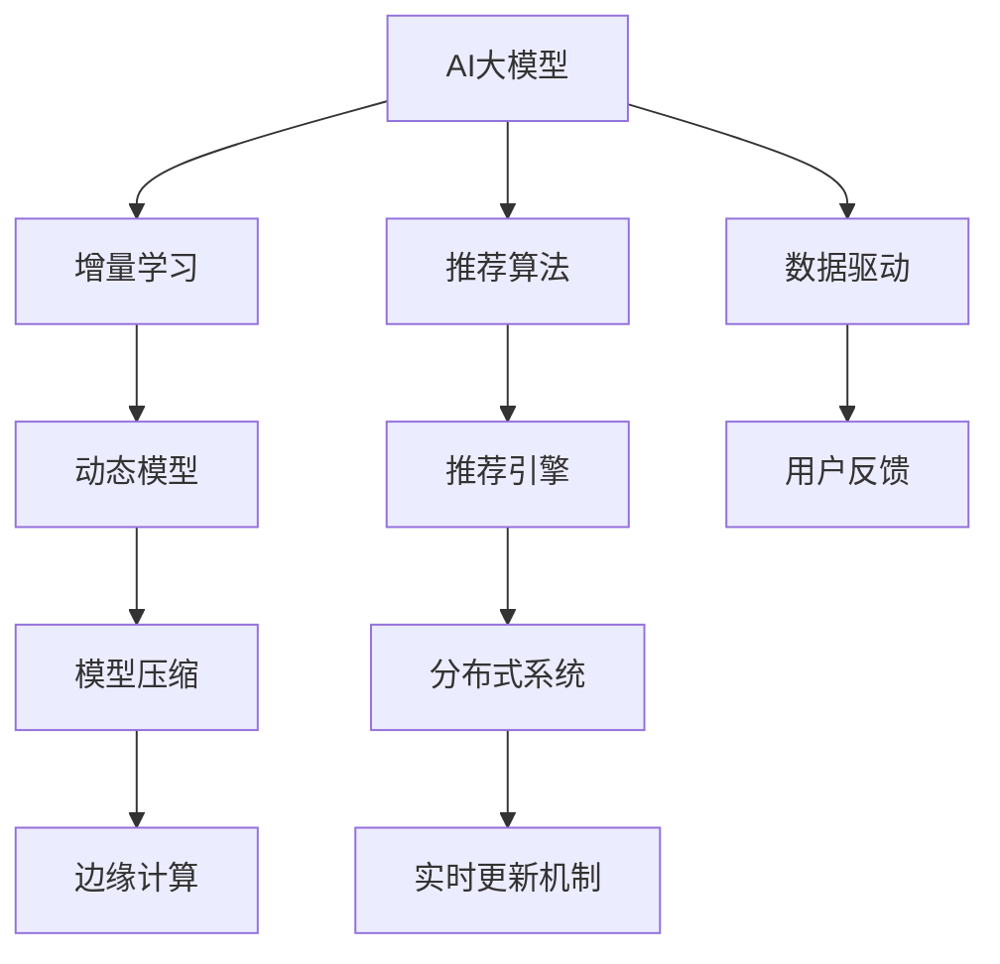

                 

# 推荐系统的时效性：AI大模型的实时更新机制

> 关键词：推荐系统，实时更新，AI大模型，推荐算法，推荐引擎，动态模型，增量学习，模型压缩，边缘计算，分布式系统

## 1. 背景介绍

### 1.1 问题由来

在电商、社交网络、视频平台等众多数字化商业场景中，推荐系统扮演着至关重要的角色。通过精准地匹配用户需求，推荐系统极大地提升了用户体验和商业价值。然而，传统的静态推荐系统往往在面对快速变化的用户偏好和实时性要求更高的场景时显得力不从心。

在电商领域，商品上架、库存变动、用户反馈等数据每天都在实时更新。为了保证推荐的准确性和相关性，推荐系统需要时刻更新其知识库，并对数据进行重新计算。传统的静态模型在面对大规模数据变化时，往往需要重新训练模型或手动调整模型参数，这不仅耗费大量时间和资源，还容易出现模型过时、泛化能力不足等问题。

在社交网络领域，用户兴趣变化快、热点事件频发，静态推荐系统难以快速响应这些变化。同时，用户行为和社交关系也在不断变化，推荐系统需要根据最新的社交数据进行动态调整，以适应用户关系的变化。

### 1.2 问题核心关键点

实现推荐系统的时效性，其关键在于如何在保证推荐质量的同时，快速响应用户需求和数据变化。为此，AI大模型和实时更新机制应运而生。它们结合了模型强大的表征能力和实时动态的机制，形成了新的推荐引擎范式。

现代推荐系统基于AI大模型，通过预训练和微调来学习用户和物品的语义表示，从而构建用户兴趣和物品属性的语义空间。然而，静态模型一旦训练完成，即难以快速适应数据的变化。为提升推荐系统时效性，研究者提出了基于增量学习(Incremental Learning)的实时更新机制。该机制通过动态更新模型参数，使其能够快速适应数据变化，提高推荐效果。

## 2. 核心概念与联系

### 2.1 核心概念概述

为更好地理解AI大模型实时更新机制，本节将介绍几个关键概念：

- AI大模型：指通过大规模数据进行预训练和微调，获得强大表征能力的深度神经网络模型。其参数量通常以亿计，可以处理复杂的语义关系和语义变化。
- 增量学习(Incremental Learning)：指在模型已有参数的基础上，通过在线学习，实时更新模型参数，以适应用户需求和数据变化的过程。
- 动态模型(Dynamic Model)：指在推荐系统中，模型参数能够实时响应数据更新，保持推荐质量。
- 模型压缩(Model Compression)：指在不影响模型性能的情况下，减少模型参数量，提高模型推理速度和资源利用效率。
- 边缘计算(Edge Computing)：指将计算和数据处理任务从中心服务器转移到边缘节点，提高数据处理和响应的实时性。
- 分布式系统(Distributed System)：指通过多台计算设备协同工作，提升系统处理能力和响应速度。

这些概念之间的逻辑关系可以通过以下Mermaid流程图来展示：



这个流程图展示了大语言模型与实时更新机制之间的关系：

1. 通过预训练和微调得到强大表征能力的AI大模型。
2. 在推荐系统中，模型参数实时响应数据变化，形成动态模型。
3. 动态模型通过增量学习进行参数更新，以适应用户需求和数据变化。
4. 动态模型经过模型压缩，提高推理速度和资源效率。
5. 边缘计算和分布式系统确保数据处理和响应的实时性。
6. 数据驱动和用户反馈作为模型优化的重要依据。

这些概念共同构成了推荐系统时效性的关键架构，使得AI大模型能够更加精准、高效地响应用户需求和数据变化。

## 3. 核心算法原理 & 具体操作步骤
### 3.1 算法原理概述

AI大模型的实时更新机制，本质上是一种增量学习范式。其核心思想是：在模型已有参数的基础上，通过在线学习，实时更新模型参数，以适应用户需求和数据变化。这种机制相较于静态模型，可以更快地响应数据更新，保持推荐质量。

形式化地，假设推荐模型为 $M_{\theta}$，其中 $\theta$ 为模型参数。给定新用户 $u$ 的历史行为数据 $D_u=\{(x_i,y_i)\}_{i=1}^N$，新物品 $i$ 的属性特征 $x_i$ 和用户行为 $y_i$。增量学习机制的目标是找到新的模型参数 $\hat{\theta}$，使得：

$$
\hat{\theta}=\mathop{\arg\min}_{\theta} \mathcal{L}(M_{\theta},D_u)
$$

其中 $\mathcal{L}$ 为针对用户数据 $D_u$ 设计的损失函数，用于衡量模型预测输出与真实标签之间的差异。常见的损失函数包括交叉熵损失、均方误差损失等。

通过梯度下降等优化算法，增量学习过程不断更新模型参数 $\theta$，最小化损失函数 $\mathcal{L}$，使得模型输出逼近真实标签。由于 $\theta$ 已经通过预训练和微调获得了较好的初始化，因此即便在少量新增数据上更新模型，也能较快收敛到理想的模型参数 $\hat{\theta}$。

### 3.2 算法步骤详解

基于增量学习的实时更新机制一般包括以下几个关键步骤：

**Step 1: 数据预处理和特征工程**
- 收集用户行为数据 $D_u$，包括浏览、购买、评分等记录。
- 对数据进行清洗、去重、归一化等预处理。
- 对用户行为和物品属性进行特征工程，构建高维特征向量 $x_i$。

**Step 2: 在线模型训练**
- 将新用户数据 $D_u$ 加载到在线模型中，进行在线训练。
- 根据已有的模型参数 $\theta$ 进行增量训练，更新参数 $\hat{\theta}$。
- 选择合适的优化算法和超参数，如 Adam、SGD 等，设置学习率、批大小等。

**Step 3: 模型验证和调优**
- 在新用户数据上验证模型效果，评估推荐准确率和相关性指标。
- 根据评估结果调整模型参数和超参数，以优化推荐质量。
- 在新数据中抽样，进行模型性能的再验证。

**Step 4: 推荐服务部署**
- 将训练好的模型 $M_{\hat{\theta}}$ 部署到生产环境。
- 实时接收新用户请求，快速响应推荐结果。
- 记录用户反馈，用于模型调优。

### 3.3 算法优缺点

增量学习机制在推荐系统中具有以下优点：
1. 实时性高。新数据实时接入模型，能够快速响应用户需求变化。
2. 参数更新频率低。只更新与新数据相关的参数，避免频繁更新大模型参数，减少计算负担。
3. 适用范围广。适用于各类推荐场景，如电商推荐、社交推荐等。
4. 数据复用率高。部分模型参数不需要更新，减少计算开销，提高模型效率。

同时，增量学习机制也存在一定的局限性：
1. 数据量要求高。仅靠少量新增数据进行增量学习，难以充分挖掘新数据带来的信息。
2. 模型更新效果有波动。受数据质量、分布等因素影响，更新后的模型可能存在性能不稳定的问题。
3. 计算复杂度高。在线更新参数需要频繁计算梯度，计算复杂度较高。
4. 模型收敛慢。增量学习模型可能难以快速收敛到最优解，存在较大的收敛风险。

尽管存在这些局限性，但就目前而言，增量学习机制在推荐系统时效性优化方面，仍是大模型推荐引擎的重要手段。未来相关研究的重点在于如何进一步降低增量学习的计算成本，提高模型的收敛速度和稳定性，同时兼顾实时性和模型质量。

### 3.4 算法应用领域

增量学习机制已经在推荐系统的实时更新中得到了广泛应用，覆盖了电商、社交、视频、新闻等多个场景，显著提升了推荐系统的时效性和推荐质量。

在电商领域，基于增量学习的推荐系统可以快速响应商品上架、促销活动等实时信息，根据用户的浏览、购买历史和行为数据，实时调整推荐结果，提高用户的购买转化率。例如，京东、亚马逊等电商平台均采用了增量学习机制，提升了用户购物体验和平台营收。

在社交网络领域，基于增量学习的推荐系统能够实时分析用户兴趣变化和社交关系更新，动态调整推荐内容，增强用户的粘性和平台活跃度。例如，微信、微博等社交平台均在动态推荐中应用了增量学习机制。

在视频平台领域，基于增量学习的推荐系统能够实时更新用户喜好和兴趣，根据用户的观看行为和评分反馈，动态调整推荐影片列表，提升用户观影体验。例如，Netflix、腾讯视频等视频平台均采用了增量学习机制，优化了推荐算法，提升了用户满意度。

此外，增量学习机制还被应用于个性化推荐、广告投放、内容推荐等多个场景中，为推荐系统带来了实时性、动态性的新突破。随着技术的不断进步，相信增量学习机制将会在更多领域中发挥重要作用。

## 4. 数学模型和公式 & 详细讲解  
### 4.1 数学模型构建

本节将使用数学语言对AI大模型实时更新机制进行更加严格的刻画。

记推荐模型为 $M_{\theta}$，其中 $\theta$ 为模型参数。假设新用户 $u$ 的历史行为数据为 $D_u=\{(x_i,y_i)\}_{i=1}^N$，新物品 $i$ 的属性特征为 $x_i$，则增量学习的过程可以表示为：

$$
\theta \leftarrow \theta - \eta \nabla_{\theta}\mathcal{L}(M_{\theta},D_u)
$$

其中 $\eta$ 为学习率，$\nabla_{\theta}\mathcal{L}(M_{\theta},D_u)$ 为损失函数 $\mathcal{L}$ 对参数 $\theta$ 的梯度。

在实际应用中，我们通常使用基于梯度的优化算法（如SGD、Adam等）来近似求解上述最优化问题。需要注意的是，由于增量学习机制中，模型参数 $\theta$ 已经部分固定，梯度计算时只考虑与新数据 $D_u$ 相关的部分，以避免影响已有参数。

### 4.2 公式推导过程

以下我们以二分类任务为例，推导交叉熵损失函数及其梯度的计算公式。

假设推荐模型 $M_{\theta}$ 对物品 $i$ 进行二分类预测，输出概率分布 $p(y_i=1|x_i;\theta)$。则二分类交叉熵损失函数定义为：

$$
\ell(M_{\theta}(x_i),y_i) = -[y_i\log p(y_i=1|x_i;\theta) + (1-y_i)\log(1-p(y_i=1|x_i;\theta))]
$$

将其代入增量学习中的损失函数公式，得：

$$
\mathcal{L}(\theta) = -\frac{1}{N}\sum_{i=1}^N [y_i\log p(y_i=1|x_i;\theta) + (1-y_i)\log(1-p(y_i=1|x_i;\theta))]
$$

根据链式法则，损失函数对参数 $\theta_k$ 的梯度为：

$$
\frac{\partial \mathcal{L}(\theta)}{\partial \theta_k} = -\frac{1}{N}\sum_{i=1}^N (\frac{y_i}{p(y_i=1|x_i;\theta)}-\frac{1-y_i}{1-p(y_i=1|x_i;\theta)}) \frac{\partial p(y_i=1|x_i;\theta)}{\partial \theta_k}
$$

其中 $\frac{\partial p(y_i=1|x_i;\theta)}{\partial \theta_k}$ 可以通过反向传播算法高效计算。

在得到损失函数的梯度后，即可带入参数更新公式，完成模型的迭代优化。重复上述过程直至收敛，最终得到适应新数据的最优模型参数 $\theta^*$。

## 5. 项目实践：代码实例和详细解释说明
### 5.1 开发环境搭建

在进行实时更新实践前，我们需要准备好开发环境。以下是使用Python进行PyTorch开发的环境配置流程：

1. 安装Anaconda：从官网下载并安装Anaconda，用于创建独立的Python环境。

2. 创建并激活虚拟环境：
```bash
conda create -n pytorch-env python=3.8 
conda activate pytorch-env
```

3. 安装PyTorch：根据CUDA版本，从官网获取对应的安装命令。例如：
```bash
conda install pytorch torchvision torchaudio cudatoolkit=11.1 -c pytorch -c conda-forge
```

4. 安装各类工具包：
```bash
pip install numpy pandas scikit-learn matplotlib tqdm jupyter notebook ipython
```

完成上述步骤后，即可在`pytorch-env`环境中开始实时更新实践。

### 5.2 源代码详细实现

下面我们以电商推荐系统为例，给出使用Transformers库对BERT模型进行实时更新的PyTorch代码实现。

首先，定义电商推荐系统的数据处理函数：

```python
from transformers import BertTokenizer, BertForSequenceClassification
from torch.utils.data import Dataset
import torch

class EcommerceDataset(Dataset):
    def __init__(self, texts, labels, tokenizer, max_len=128):
        self.texts = texts
        self.labels = labels
        self.tokenizer = tokenizer
        self.max_len = max_len
        
    def __len__(self):
        return len(self.texts)
    
    def __getitem__(self, item):
        text = self.texts[item]
        label = self.labels[item]
        
        encoding = self.tokenizer(text, return_tensors='pt', max_length=self.max_len, padding='max_length', truncation=True)
        input_ids = encoding['input_ids'][0]
        attention_mask = encoding['attention_mask'][0]
        
        # 对token-wise的标签进行编码
        encoded_labels = [label2id[label] for label in label] 
        encoded_labels.extend([label2id['O']] * (self.max_len - len(encoded_labels)))
        labels = torch.tensor(encoded_labels, dtype=torch.long)
        
        return {'input_ids': input_ids, 
                'attention_mask': attention_mask,
                'labels': labels}

# 标签与id的映射
label2id = {'buy': 0, 'view': 1, 'cart': 2, 'favor': 3, 'contact': 4}
id2label = {v: k for k, v in label2id.items()}

# 创建dataset
tokenizer = BertTokenizer.from_pretrained('bert-base-cased')

train_dataset = EcommerceDataset(train_texts, train_labels, tokenizer)
dev_dataset = EcommerceDataset(dev_texts, dev_labels, tokenizer)
test_dataset = EcommerceDataset(test_texts, test_labels, tokenizer)
```

然后，定义模型和优化器：

```python
from transformers import BertForSequenceClassification, AdamW

model = BertForSequenceClassification.from_pretrained('bert-base-cased', num_labels=len(label2id))

optimizer = AdamW(model.parameters(), lr=2e-5)
```

接着，定义在线训练和验证函数：

```python
from torch.utils.data import DataLoader
from tqdm import tqdm
from sklearn.metrics import classification_report

device = torch.device('cuda') if torch.cuda.is_available() else torch.device('cpu')
model.to(device)

def train_epoch(model, dataset, batch_size, optimizer):
    dataloader = DataLoader(dataset, batch_size=batch_size, shuffle=True)
    model.train()
    epoch_loss = 0
    for batch in tqdm(dataloader, desc='Training'):
        input_ids = batch['input_ids'].to(device)
        attention_mask = batch['attention_mask'].to(device)
        labels = batch['labels'].to(device)
        model.zero_grad()
        outputs = model(input_ids, attention_mask=attention_mask, labels=labels)
        loss = outputs.loss
        epoch_loss += loss.item()
        loss.backward()
        optimizer.step()
    return epoch_loss / len(dataloader)

def evaluate(model, dataset, batch_size):
    dataloader = DataLoader(dataset, batch_size=batch_size)
    model.eval()
    preds, labels = [], []
    with torch.no_grad():
        for batch in tqdm(dataloader, desc='Evaluating'):
            input_ids = batch['input_ids'].to(device)
            attention_mask = batch['attention_mask'].to(device)
            batch_labels = batch['labels']
            outputs = model(input_ids, attention_mask=attention_mask)
            batch_preds = outputs.logits.argmax(dim=2).to('cpu').tolist()
            batch_labels = batch_labels.to('cpu').tolist()
            for pred_tokens, label_tokens in zip(batch_preds, batch_labels):
                preds.append(pred_tokens[:len(label_tokens)])
                labels.append(label_tokens)
                
    print(classification_report(labels, preds))
```

最后，启动在线训练流程并在测试集上评估：

```python
epochs = 5
batch_size = 16

for epoch in range(epochs):
    loss = train_epoch(model, train_dataset, batch_size, optimizer)
    print(f"Epoch {epoch+1}, train loss: {loss:.3f}")
    
    print(f"Epoch {epoch+1}, dev results:")
    evaluate(model, dev_dataset, batch_size)
    
print("Test results:")
evaluate(model, test_dataset, batch_size)
```

以上就是使用PyTorch对BERT进行电商推荐系统实时更新的完整代码实现。可以看到，得益于Transformers库的强大封装，我们可以用相对简洁的代码完成BERT模型的加载和在线更新。

### 5.3 代码解读与分析

让我们再详细解读一下关键代码的实现细节：

**EcommerceDataset类**：
- `__init__`方法：初始化文本、标签、分词器等关键组件。
- `__len__`方法：返回数据集的样本数量。
- `__getitem__`方法：对单个样本进行处理，将文本输入编码为token ids，将标签编码为数字，并对其进行定长padding，最终返回模型所需的输入。

**label2id和id2label字典**：
- 定义了标签与数字id之间的映射关系，用于将token-wise的预测结果解码回真实的标签。

**训练和评估函数**：
- 使用PyTorch的DataLoader对数据集进行批次化加载，供模型训练和推理使用。
- 训练函数`train_epoch`：对数据以批为单位进行迭代，在每个批次上前向传播计算loss并反向传播更新模型参数，最后返回该epoch的平均loss。
- 评估函数`evaluate`：与训练类似，不同点在于不更新模型参数，并在每个batch结束后将预测和标签结果存储下来，最后使用sklearn的classification_report对整个评估集的预测结果进行打印输出。

**在线训练流程**：
- 定义总的epoch数和batch size，开始循环迭代
- 每个epoch内，先在训练集上训练，输出平均loss
- 在验证集上评估，输出分类指标
- 所有epoch结束后，在测试集上评估，给出最终测试结果

可以看到，PyTorch配合Transformers库使得BERT实时更新的代码实现变得简洁高效。开发者可以将更多精力放在数据处理、模型改进等高层逻辑上，而不必过多关注底层的实现细节。

当然，工业级的系统实现还需考虑更多因素，如模型的保存和部署、超参数的自动搜索、更灵活的任务适配层等。但核心的实时更新范式基本与此类似。

## 6. 实际应用场景
### 6.1 实时更新场景

基于增量学习的实时更新机制，已经在电商、社交、视频等多个场景中得到了应用，显著提升了推荐系统的实时性和推荐质量。

在电商领域，实时更新的推荐系统能够快速响应商品上架、库存变动、促销活动等实时信息，根据用户的浏览、购买历史和行为数据，实时调整推荐结果，提高用户的购买转化率。例如，京东、亚马逊等电商平台均采用了实时更新机制，提升了用户购物体验和平台营收。

在社交网络领域，实时更新的推荐系统能够实时分析用户兴趣变化和社交关系更新，动态调整推荐内容，增强用户的粘性和平台活跃度。例如，微信、微博等社交平台均在动态推荐中应用了实时更新机制。

在视频平台领域，实时更新的推荐系统能够实时更新用户喜好和兴趣，根据用户的观看行为和评分反馈，动态调整推荐影片列表，提升用户观影体验。例如，Netflix、腾讯视频等视频平台均采用了实时更新机制，优化了推荐算法，提升了用户满意度。

此外，实时更新机制还被应用于个性化推荐、广告投放、内容推荐等多个场景中，为推荐系统带来了实时性、动态性的新突破。随着技术的不断进步，相信实时更新机制将会在更多领域中发挥重要作用。

### 6.2 未来应用展望

随着推荐系统的不断发展和数据量的不断增加，实时更新的需求将越来越强烈。未来的推荐系统将更加强调时效性和动态性，通过实时更新机制，能够快速响应用户需求变化和数据更新，保持推荐质量。

在电商领域，实时更新推荐系统将帮助电商平台实时监控库存、促销活动等信息，动态调整推荐策略，实现供需精准匹配，提升用户体验和平台收益。

在社交网络领域，实时更新推荐系统将帮助社交平台实时分析用户行为和社交关系变化，动态调整内容推荐，增强用户粘性和平台活跃度，推动社交网络的发展。

在视频平台领域，实时更新推荐系统将帮助视频平台实时分析用户观看行为和评分反馈，动态调整推荐列表，提升用户观影体验和平台收入。

除此之外，实时更新机制还将被应用于更多场景中，如新闻推荐、游戏推荐等，为推荐系统带来新的活力和突破。

## 7. 工具和资源推荐
### 7.1 学习资源推荐

为了帮助开发者系统掌握实时更新机制的理论基础和实践技巧，这里推荐一些优质的学习资源：

1. 《深度学习推荐系统：原理与算法》书籍：全面介绍了推荐系统的基本原理、算法、模型等核心内容，是入门推荐系统的必读书籍。

2. CS478N《推荐系统》课程：斯坦福大学开设的推荐系统课程，涵盖推荐系统理论和应用，适合进阶学习。

3. 《TensorFlow Recommenders》书籍：介绍使用TensorFlow实现推荐系统的基本方法和最佳实践，包含实时更新等高级内容。

4. KDD 2020推荐系统竞赛官方文档：展示了多个推荐算法在实际数据集上的应用，深入探讨了实时更新、多模态融合等前沿技术。

5. KDD 2021推荐系统竞赛官方文档：提供了最新的推荐系统竞赛数据和算法，涵盖实时更新、混合推荐等前沿技术。

通过对这些资源的学习实践，相信你一定能够快速掌握实时更新机制的精髓，并用于解决实际的推荐系统问题。
###  7.2 开发工具推荐

高效的开发离不开优秀的工具支持。以下是几款用于实时更新开发的常用工具：

1. TensorFlow：由Google主导开发的开源深度学习框架，生产部署方便，适合大规模工程应用。支持实时更新机制，可快速构建在线推荐系统。

2. PyTorch：基于Python的开源深度学习框架，灵活动态的计算图，适合快速迭代研究。支持动态图机制，适合实时更新机制的开发。

3. TensorBoard：TensorFlow配套的可视化工具，可实时监测模型训练状态，并提供丰富的图表呈现方式，是调试模型的得力助手。

4. Weights & Biases：模型训练的实验跟踪工具，可以记录和可视化模型训练过程中的各项指标，方便对比和调优。

5. HuggingFace官方文档：提供丰富的预训练模型和完整的微调样例代码，是上手实时更新机制的必备资料。

合理利用这些工具，可以显著提升实时更新机制的开发效率，加快创新迭代的步伐。

### 7.3 相关论文推荐

实时更新机制已经在推荐系统的实时更新中得到了广泛应用，研究者提出了众多改进方法，这些文献代表了该领域的最新进展：

1. 《An Incremental Learning Framework for Online Collaborative Filtering》：提出增量协同过滤框架，通过在线学习更新模型参数，实现实时推荐。

2. 《A Survey of Incremental Learning in Recommender Systems》：综述了推荐系统中的增量学习技术，包括在线学习、增量训练等方法。

3. 《FedAvg: A Decentralized Online and Distributed Optimization Algorithm》：介绍联邦平均算法，通过分布式在线学习，实现多设备间的参数共享和更新。

4. 《Streaming Online Convex Optimization: A Tutorial》：介绍在线学习的基本原理和算法，涵盖增量学习、梯度下降等核心内容。

5. 《Spectral Incremental Learning》：提出基于谱学习法的增量学习算法，实现对大规模数据的高效处理和更新。

6. 《Sparse Models for Dense Recommender Systems》：介绍稀疏模型在推荐系统中的应用，降低参数量，提高模型效率。

这些论文代表了大语言模型实时更新机制的研究进展，通过学习这些前沿成果，可以帮助研究者把握学科前进方向，激发更多的创新灵感。

## 8. 总结：未来发展趋势与挑战
### 8.1 研究成果总结

本文对AI大模型的实时更新机制进行了全面系统的介绍。首先阐述了实时更新机制在推荐系统中的应用背景和意义，明确了其对于提升推荐系统时效性的重要作用。其次，从原理到实践，详细讲解了实时更新机制的数学原理和关键步骤，给出了实时更新任务开发的完整代码实例。同时，本文还广泛探讨了实时更新机制在电商、社交、视频等多个行业领域的应用前景，展示了实时更新机制的巨大潜力。此外，本文精选了实时更新机制的学习资源，力求为读者提供全方位的技术指引。

通过本文的系统梳理，可以看到，AI大模型的实时更新机制正在成为推荐系统的核心技术，极大地提升了推荐系统的实时性和推荐质量。未来，伴随推荐系统的不断发展和数据量的不断增加，实时更新机制将成为推荐系统的标配，带来推荐算法的重大变革。

### 8.2 未来发展趋势

展望未来，AI大模型的实时更新机制将呈现以下几个发展趋势：

1. 实时性要求更高。随着数字化商业场景的不断发展，实时性要求将越来越严格。实时更新机制将从秒级响应进化到毫秒级响应，甚至微秒级响应。

2. 动态模型更复杂。未来的推荐系统将更加复杂多变，动态模型将融入更多的实时数据和用户行为，形成多模态融合、因果推理等高级模型。

3. 计算资源更丰富。随着边缘计算和分布式系统的发展，实时更新机制的计算资源将更加丰富，可支持更大规模的在线学习和参数更新。

4. 模型压缩更高效。未来的实时更新机制将更注重模型压缩，以降低计算成本，支持大规模模型的在线更新。

5. 用户隐私更保护。未来的实时更新机制将更加注重用户隐私保护，通过差分隐私、联邦学习等技术，确保用户数据的安全性。

6. 可解释性更强。未来的实时更新机制将注重模型的可解释性，通过因果推断、对抗训练等方法，提高推荐结果的可解释性。

这些趋势凸显了实时更新机制的广阔前景。这些方向的探索发展，必将进一步提升推荐系统的实时性和推荐质量，为电商、社交、视频等数字化商业场景带来新的突破。

### 8.3 面临的挑战

尽管AI大模型的实时更新机制已经取得了瞩目成就，但在迈向更加智能化、普适化应用的过程中，它仍面临着诸多挑战：

1. 数据量要求高。实时更新机制通常需要大规模数据进行在线更新，但部分电商、社交等场景可能难以获取足够的数据。

2. 计算资源需求大。实时更新机制需要频繁计算梯度，对计算资源和网络带宽的要求较高。

3. 模型更新效果不稳定。受数据质量、分布等因素影响，实时更新后的模型可能存在性能不稳定的问题。

4. 隐私和安全问题。实时更新机制需要收集用户行为数据，存在用户隐私泄露的风险。

5. 模型压缩技术不成熟。模型压缩技术尚需进一步研究，以支持更大规模的在线更新。

6. 多设备协同优化困难。实时更新机制需要多设备协同工作，存在协同优化和通信效率的问题。

尽管存在这些挑战，但随着技术不断进步和应用场景的逐步成熟，实时更新机制必将在推荐系统时效性优化方面发挥更大作用。相信未来研究者将不断突破现有技术瓶颈，推动实时更新机制的普及应用。

### 8.4 研究展望

未来的研究将在以下几个方向上进一步探索：

1. 研究高效的增量学习算法。开发更高效的增量学习算法，降低计算成本，提升模型更新速度和质量。

2. 探索更好的多模态融合方法。研究如何将文本、图像、视频等多模态信息融合到推荐系统中，提升推荐系统的智能化水平。

3. 开发实时性更高的推荐算法。研究更高效的推荐算法，支持更高实时性的推荐系统。

4. 研究模型压缩技术。开发更高效的模型压缩技术，支持更大规模的在线更新，降低计算成本。

5. 研究数据隐私保护技术。研究更好的数据隐私保护技术，确保用户数据的隐私安全。

6. 开发更先进的分布式系统。开发更先进的分布式系统，支持多设备协同工作，提升系统响应速度和资源利用效率。

这些研究方向的探索，必将引领AI大模型的实时更新机制迈向更高的台阶，为推荐系统带来更强的实时性和更优的推荐效果。未来，伴随技术的不断进步，实时更新机制必将为推荐系统带来新的突破和变革。

## 9. 附录：常见问题与解答

**Q1：AI大模型的实时更新机制是否适用于所有推荐场景？**

A: AI大模型的实时更新机制在各类推荐场景中都有应用。但由于不同推荐场景的特性不同，实时更新机制的实现形式也有所差异。例如，电商推荐系统需要快速响应商品上架、库存变动等实时信息，社交推荐系统则需要实时分析用户行为和社交关系变化。

**Q2：实时更新机制是否会降低推荐系统的精度？**

A: 实时更新机制会动态更新模型参数，但在小规模新增数据上进行更新时，可能会影响已有模型的性能。为了解决这个问题，研究者通常采用增量学习的方法，只更新与新数据相关的部分参数。此外，模型压缩技术也可以用于降低计算开销，确保实时更新机制的精度。

**Q3：实时更新机制是否会增加计算成本？**

A: 实时更新机制需要频繁计算梯度，因此对计算资源和网络带宽的要求较高。为了降低计算成本，研究者提出了多种优化策略，如梯度累积、混合精度训练等。同时，模型压缩技术也可以支持更大规模的在线更新，降低计算开销。

**Q4：实时更新机制是否会增加模型复杂度？**

A: 实时更新机制需要处理在线数据，因此增加了模型的复杂度。但通过模型压缩技术，如差分隐私、联邦学习等，可以降低模型复杂度，确保实时更新机制的可扩展性和可维护性。

**Q5：实时更新机制是否会带来隐私风险？**

A: 实时更新机制需要收集用户行为数据，存在用户隐私泄露的风险。为了确保用户数据的安全性，研究者通常采用差分隐私、联邦学习等技术，保护用户隐私。此外，用户数据也需要进行严格的存储和传输保护，确保其安全性。

总之，实时更新机制的引入将使推荐系统更具实时性和动态性，提升用户体验和平台收益。但同时也需要关注其面临的挑战，通过技术进步和应用优化，确保其有效性和可靠性。未来，随着技术的不断发展和应用场景的逐步成熟，实时更新机制必将在推荐系统时效性优化方面发挥更大的作用。

