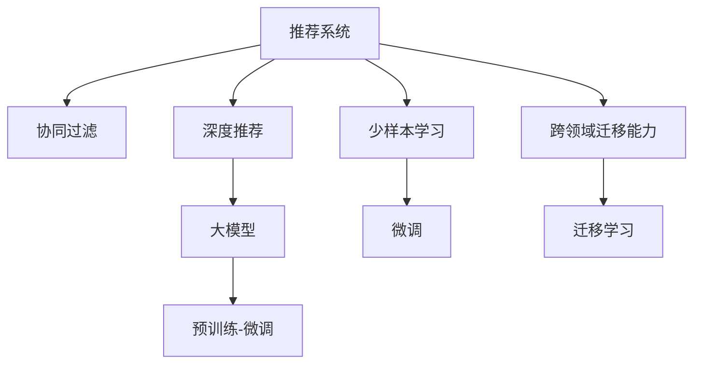

                 

# 推荐系统的未来发展：大模型的主导

> 关键词：推荐系统,大模型,协同过滤,深度学习,深度推荐,强化学习,混合推荐,算法优化

## 1. 背景介绍

### 1.1 问题由来

推荐系统(Recommender System)是信息时代的重要应用领域，其目标是根据用户的历史行为和偏好，为其推荐个性化的内容，提升用户体验和满意度。早期的推荐系统主要基于基于协同过滤(Collaborative Filtering)的算法，如基于用户的协同过滤和基于物品的协同过滤。然而，随着数据量的爆炸性增长和模型性能的不断提升，深度学习、深度推荐和强化学习等技术逐渐成为推荐系统的核心驱动力。

随着深度神经网络的兴起，深度推荐系统开始崭露头角。深度神经网络具有强大的非线性拟合能力，可以充分利用用户行为和物品属性的高维度特征，自动学习用户兴趣和物品特征之间的隐含关系。但即便如此，深度推荐系统也存在一些难以克服的局限，如数据稀疏性、冷启动问题、可解释性不足等。

大模型作为当前AI领域的重要方向，凭借其预训练-微调(Pre-training and Fine-tuning, PFT)的强大能力，已经开始主导推荐系统的未来发展。通过在大规模数据上预训练，大模型可以学习到更全面、更精准的推荐逻辑。而通过针对具体任务的微调，大模型能够在个性化推荐中发挥更好的性能。

### 1.2 问题核心关键点

大模型在推荐系统中的核心作用在于：
1. **高维特征表示**：大模型可以自动学习并提取用户行为和物品属性的高维度特征，从而更精准地捕捉用户兴趣和物品属性之间的隐含关系。
2. **跨领域迁移能力**：大模型能够跨领域迁移其预训练的知识，从而在更广泛的应用场景中发挥作用。
3. **少样本学习**：大模型能够在少量标注数据的情况下，通过微调快速适应新任务，提升推荐精度。
4. **鲁棒性增强**：大模型通过预训练在大规模数据上学习到更鲁棒的特征表示，能够更好地抵抗数据噪声和异常值的影响。
5. **泛化能力提升**：大模型通过跨领域迁移，可以在相似但不同的推荐场景中实现更好的泛化。

## 2. 核心概念与联系

### 2.1 核心概念概述

为了更好地理解大模型在推荐系统中的作用，本节将介绍几个密切相关的核心概念：

- 推荐系统(Recommender System)：旨在根据用户历史行为和偏好，为其推荐个性化内容的系统。推荐系统广泛应用于电商、新闻、视频、社交网络等领域。

- 协同过滤(Collaborative Filtering)：基于用户历史行为和物品属性，通过相似度计算，推测用户对未知物品的偏好。传统协同过滤包括基于用户的协同过滤和基于物品的协同过滤。

- 深度推荐系统(Deep Recommendation System)：基于深度神经网络的推荐系统，具有强大的非线性拟合能力，可以自动学习用户兴趣和物品特征之间的隐含关系。

- 大模型(Large Model)：指在大规模数据上进行预训练的神经网络模型，如BERT、GPT、DALL-E等。通过预训练，大模型可以学习到丰富的语义和领域知识。

- 预训练-微调(Pre-training and Fine-tuning, PFT)：指在大规模无标注数据上预训练模型，并在特定任务上进行微调，以适应特定任务，提升模型性能。

- 少样本学习(Few-shot Learning)：指在只有少量标注样本的情况下，通过微调模型快速适应新任务，提升模型性能。

- 跨领域迁移能力(Cross-Domain Transferability)：指预训练模型在跨领域、跨任务中的泛化能力，通过迁移学习，预训练模型可以在新的推荐场景中发挥作用。

这些核心概念之间的逻辑关系可以通过以下Mermaid流程图来展示：



这个流程图展示了大模型在推荐系统中的核心作用：

1. 推荐系统通过协同过滤和深度推荐技术为用户推荐内容。
2. 深度推荐系统依赖于深度神经网络。
3. 大模型通过预训练学习到丰富的语义和领域知识。
4. 预训练-微调使大模型能够在特定任务上表现更佳。
5. 少样本学习和大模型的跨领域迁移能力，使模型在新的推荐场景中也能快速适应。

## 3. 核心算法原理 & 具体操作步骤

### 3.1 算法原理概述

基于大模型的推荐系统，其核心思想是通过预训练学习到丰富的语义和领域知识，并在特定推荐任务上进行微调，从而获得更好的个性化推荐效果。

具体来说，基于大模型的推荐系统包括以下几个关键步骤：

1. **预训练**：在大规模数据集上，使用大模型进行预训练，学习到丰富的语义和领域知识。
2. **微调**：在特定推荐任务上，使用少量标注数据对预训练模型进行微调，调整其参数，使其适应推荐任务。
3. **少样本学习**：在标注数据不足的情况下，利用大模型的跨领域迁移能力，通过少量示例进行推荐。
4. **跨领域迁移**：通过预训练模型在不同推荐场景之间的迁移，提升模型的泛化能力。

### 3.2 算法步骤详解

基于大模型的推荐系统一般包括以下几个关键步骤：

**Step 1: 准备预训练模型和数据集**
- 选择合适的预训练语言模型 $M_{\theta}$ 作为初始化参数，如BERT、GPT等。
- 准备推荐任务 $T$ 的标注数据集 $D$，划分为训练集、验证集和测试集。一般要求标注数据与预训练数据的分布不要差异过大。

**Step 2: 设计推荐任务适配层**
- 根据推荐任务类型，在预训练模型顶层设计合适的输出层和损失函数。
- 对于推荐任务，通常使用交叉熵损失、均方误差损失等。
- 在输出层，可以设计一个多层的全连接神经网络或Transformer，用于计算用户和物品的相似度。

**Step 3: 设置微调超参数**
- 选择合适的优化算法及其参数，如 AdamW、SGD 等，设置学习率、批大小、迭代轮数等。
- 设置正则化技术及强度，包括权重衰减、Dropout、Early Stopping 等。
- 确定冻结预训练参数的策略，如仅微调顶层，或全部参数都参与微调。

**Step 4: 执行梯度训练**
- 将训练集数据分批次输入模型，前向传播计算损失函数。
- 反向传播计算参数梯度，根据设定的优化算法和学习率更新模型参数。
- 周期性在验证集上评估模型性能，根据性能指标决定是否触发 Early Stopping。
- 重复上述步骤直到满足预设的迭代轮数或 Early Stopping 条件。

**Step 5: 测试和部署**
- 在测试集上评估微调后模型 $M_{\hat{\theta}}$ 的性能，对比微调前后的精度提升。
- 使用微调后的模型对新样本进行推荐，集成到实际的应用系统中。
- 持续收集新的数据，定期重新微调模型，以适应数据分布的变化。

### 3.3 算法优缺点

基于大模型的推荐系统具有以下优点：
1. 高效性：大模型的预训练可以处理大规模数据，提高模型的泛化能力和泛化能力。
2. 可解释性：大模型可以通过可解释性技术，帮助理解模型的决策逻辑，提高模型的可信任性。
3. 鲁棒性：大模型通过预训练在大规模数据上学习到更鲁棒的特征表示，能够更好地抵抗数据噪声和异常值的影响。
4. 少样本学习：大模型在少量标注数据的情况下，仍能通过微调快速适应新任务，提升推荐精度。
5. 跨领域迁移：大模型能够跨领域迁移其预训练的知识，提升推荐系统的泛化能力。

同时，该方法也存在一定的局限性：
1. 依赖标注数据：微调的效果很大程度上取决于标注数据的质量和数量，获取高质量标注数据的成本较高。
2. 模型复杂度高：大模型的参数量较大，在推理时可能面临计算和内存的瓶颈。
3. 迁移能力有限：当目标任务与预训练数据的分布差异较大时，微调的性能提升有限。
4. 可解释性不足：大模型的决策过程通常缺乏可解释性，难以对其推理逻辑进行分析和调试。

尽管存在这些局限性，但就目前而言，基于大模型的推荐系统仍然是推荐系统领域的主流范式。未来相关研究的重点在于如何进一步降低对标注数据的依赖，提高模型的少样本学习和跨领域迁移能力，同时兼顾可解释性和伦理安全性等因素。

### 3.4 算法应用领域

基于大模型的推荐系统已经在电商、新闻、视频、社交网络等多个领域得到了广泛应用，具体包括：

- 电商推荐：根据用户历史购买记录和浏览行为，为用户推荐商品。大模型的预训练可以学习到商品属性和用户兴趣之间的隐含关系，提高推荐精度。
- 新闻推荐：根据用户历史阅读记录和兴趣标签，为用户推荐新闻文章。大模型的预训练可以学习到新闻内容与用户兴趣之间的语义关系，提高推荐相关性。
- 视频推荐：根据用户历史观看记录和评分，为用户推荐视频内容。大模型的预训练可以学习到视频属性和用户兴趣之间的隐含关系，提高推荐多样性。
- 社交网络推荐：根据用户历史互动行为，为用户推荐其他用户或内容。大模型的预训练可以学习到社交网络中的关系链和用户兴趣，提高推荐准确性。

除了上述这些经典应用外，大模型在推荐系统中的应用还在不断扩展，如个性化商品定制、智能客服、广告投放等，为推荐系统的应用提供了新的思路和方向。

## 4. 数学模型和公式 & 详细讲解  
### 4.1 数学模型构建

本节将使用数学语言对基于大模型的推荐系统进行更加严格的刻画。

记推荐任务 $T$ 的训练集为 $D=\{(x_i,y_i)\}_{i=1}^N, x_i \in \mathcal{X}, y_i \in \mathcal{Y}$，其中 $\mathcal{X}$ 为用户行为，$\mathcal{Y}$ 为用户兴趣。假设预训练语言模型为 $M_{\theta}$，其中 $\theta$ 为预训练得到的模型参数。

定义模型 $M_{\theta}$ 在用户行为 $x$ 上的输出为 $h_{\theta}(x)$，表示用户对物品 $y$ 的兴趣程度。则推荐任务的目标函数为：

$$
\mathcal{L}(\theta) = -\frac{1}{N}\sum_{i=1}^N \ell(h_{\theta}(x_i),y_i)
$$

其中 $\ell$ 为交叉熵损失函数，用于衡量模型预测输出与真实标签之间的差异。在实际应用中，交叉熵损失函数通常用于二分类任务，而推荐任务可以采用均方误差损失函数。

通过优化上述目标函数，可以训练出推荐模型 $M_{\theta}$。在训练过程中，可以使用梯度下降等优化算法来更新模型参数 $\theta$，最小化损失函数 $\mathcal{L}$，使得模型输出逼近真实标签。

### 4.2 公式推导过程

以下我们以推荐任务为例，推导交叉熵损失函数及其梯度的计算公式。

假设模型 $M_{\theta}$ 在用户行为 $x$ 上的输出为 $h_{\theta}(x) \in [0,1]$，表示用户对物品 $y$ 的兴趣程度。真实标签 $y \in \{0,1\}$。则二分类交叉熵损失函数定义为：

$$
\ell(h_{\theta}(x),y) = -[y\log h_{\theta}(x) + (1-y)\log (1-h_{\theta}(x))]
$$

将其代入经验风险公式，得：

$$
\mathcal{L}(\theta) = -\frac{1}{N}\sum_{i=1}^N [y_i\log h_{\theta}(x_i)+(1-y_i)\log(1-h_{\theta}(x_i))]
$$

根据链式法则，损失函数对参数 $\theta_k$ 的梯度为：

$$
\frac{\partial \mathcal{L}(\theta)}{\partial \theta_k} = -\frac{1}{N}\sum_{i=1}^N (\frac{y_i}{h_{\theta}(x_i)}-\frac{1-y_i}{1-h_{\theta}(x_i)}) \frac{\partial h_{\theta}(x_i)}{\partial \theta_k}
$$

其中 $\frac{\partial h_{\theta}(x_i)}{\partial \theta_k}$ 可进一步递归展开，利用自动微分技术完成计算。

在得到损失函数的梯度后，即可带入参数更新公式，完成模型的迭代优化。重复上述过程直至收敛，最终得到适应推荐任务的最优模型参数 $\theta^*$。

## 5. 项目实践：代码实例和详细解释说明
### 5.1 开发环境搭建

在进行推荐系统开发前，我们需要准备好开发环境。以下是使用Python进行PyTorch开发的环境配置流程：

1. 安装Anaconda：从官网下载并安装Anaconda，用于创建独立的Python环境。

2. 创建并激活虚拟环境：
```bash
conda create -n pytorch-env python=3.8 
conda activate pytorch-env
```

3. 安装PyTorch：根据CUDA版本，从官网获取对应的安装命令。例如：
```bash
conda install pytorch torchvision torchaudio cudatoolkit=11.1 -c pytorch -c conda-forge
```

4. 安装TensorFlow：使用pip安装TensorFlow。

5. 安装各类工具包：
```bash
pip install numpy pandas scikit-learn matplotlib tqdm jupyter notebook ipython
```

完成上述步骤后，即可在`pytorch-env`环境中开始推荐系统开发。

### 5.2 源代码详细实现

这里我们以电商推荐系统为例，给出使用PyTorch对BERT模型进行推荐系统微调的PyTorch代码实现。

首先，定义推荐任务的数据处理函数：

```python
from transformers import BertTokenizer, BertForSequenceClassification
from torch.utils.data import Dataset
import torch

class RecommendationDataset(Dataset):
    def __init__(self, items, clicks, tokenizer, max_len=128):
        self.items = items
        self.clicks = clicks
        self.tokenizer = tokenizer
        self.max_len = max_len
        
    def __len__(self):
        return len(self.items)
    
    def __getitem__(self, item):
        item_id = self.items[item]
        click_count = self.clicks[item]
        
        encoding = self.tokenizer(item_id, return_tensors='pt', max_length=self.max_len, padding='max_length', truncation=True)
        input_ids = encoding['input_ids'][0]
        attention_mask = encoding['attention_mask'][0]
        
        # 对点击次数进行编码
        encoded_clicks = [click_count] * (self.max_len)
        labels = torch.tensor(encoded_clicks, dtype=torch.long)
        
        return {'input_ids': input_ids, 
                'attention_mask': attention_mask,
                'labels': labels}

# 点击次数与id的映射
click2id = {'0': 0, '1': 1}
id2click = {v: k for k, v in click2id.items()}

# 创建dataset
tokenizer = BertTokenizer.from_pretrained('bert-base-cased')

train_dataset = RecommendationDataset(train_items, train_clicks, tokenizer)
dev_dataset = RecommendationDataset(dev_items, dev_clicks, tokenizer)
test_dataset = RecommendationDataset(test_items, test_clicks, tokenizer)
```

然后，定义模型和优化器：

```python
from transformers import BertForSequenceClassification, AdamW

model = BertForSequenceClassification.from_pretrained('bert-base-cased', num_labels=2)

optimizer = AdamW(model.parameters(), lr=2e-5)
```

接着，定义训练和评估函数：

```python
from torch.utils.data import DataLoader
from tqdm import tqdm
from sklearn.metrics import accuracy_score

device = torch.device('cuda') if torch.cuda.is_available() else torch.device('cpu')
model.to(device)

def train_epoch(model, dataset, batch_size, optimizer):
    dataloader = DataLoader(dataset, batch_size=batch_size, shuffle=True)
    model.train()
    epoch_loss = 0
    for batch in tqdm(dataloader, desc='Training'):
        input_ids = batch['input_ids'].to(device)
        attention_mask = batch['attention_mask'].to(device)
        labels = batch['labels'].to(device)
        model.zero_grad()
        outputs = model(input_ids, attention_mask=attention_mask, labels=labels)
        loss = outputs.loss
        epoch_loss += loss.item()
        loss.backward()
        optimizer.step()
    return epoch_loss / len(dataloader)

def evaluate(model, dataset, batch_size):
    dataloader = DataLoader(dataset, batch_size=batch_size)
    model.eval()
    preds, labels = [], []
    with torch.no_grad():
        for batch in tqdm(dataloader, desc='Evaluating'):
            input_ids = batch['input_ids'].to(device)
            attention_mask = batch['attention_mask'].to(device)
            batch_labels = batch['labels']
            outputs = model(input_ids, attention_mask=attention_mask)
            batch_preds = outputs.logits.argmax(dim=2).to('cpu').tolist()
            batch_labels = batch_labels.to('cpu').tolist()
            for pred_tokens, label_tokens in zip(batch_preds, batch_labels):
                pred_clicks = [click2id[_id] for _id in pred_tokens]
                label_clicks = [id2click[_id] for _id in label_tokens]
                preds.append(pred_clicks[:len(label_tokens)])
                labels.append(label_clicks)
                
    print(accuracy_score(labels, preds))
```

最后，启动训练流程并在测试集上评估：

```python
epochs = 5
batch_size = 16

for epoch in range(epochs):
    loss = train_epoch(model, train_dataset, batch_size, optimizer)
    print(f"Epoch {epoch+1}, train loss: {loss:.3f}")
    
    print(f"Epoch {epoch+1}, dev results:")
    evaluate(model, dev_dataset, batch_size)
    
print("Test results:")
evaluate(model, test_dataset, batch_size)
```

以上就是使用PyTorch对BERT进行电商推荐系统微调的完整代码实现。可以看到，得益于Transformers库的强大封装，我们可以用相对简洁的代码完成BERT模型的加载和微调。

### 5.3 代码解读与分析

让我们再详细解读一下关键代码的实现细节：

**RecommendationDataset类**：
- `__init__`方法：初始化物品、点击次数、分词器等关键组件。
- `__len__`方法：返回数据集的样本数量。
- `__getitem__`方法：对单个样本进行处理，将物品输入编码为token ids，将点击次数编码为数字，并对其进行定长padding，最终返回模型所需的输入。

**click2id和id2click字典**：
- 定义了点击次数与数字id之间的映射关系，用于将token-wise的预测结果解码回真实的标签。

**训练和评估函数**：
- 使用PyTorch的DataLoader对数据集进行批次化加载，供模型训练和推理使用。
- 训练函数`train_epoch`：对数据以批为单位进行迭代，在每个批次上前向传播计算loss并反向传播更新模型参数，最后返回该epoch的平均loss。
- 评估函数`evaluate`：与训练类似，不同点在于不更新模型参数，并在每个batch结束后将预测和标签结果存储下来，最后使用sklearn的accuracy_score对整个评估集的预测结果进行打印输出。

**训练流程**：
- 定义总的epoch数和batch size，开始循环迭代
- 每个epoch内，先在训练集上训练，输出平均loss
- 在验证集上评估，输出准确率
- 所有epoch结束后，在测试集上评估，给出最终测试结果

可以看到，PyTorch配合Transformers库使得BERT微调的代码实现变得简洁高效。开发者可以将更多精力放在数据处理、模型改进等高层逻辑上，而不必过多关注底层的实现细节。

当然，工业级的系统实现还需考虑更多因素，如模型的保存和部署、超参数的自动搜索、更灵活的任务适配层等。但核心的微调范式基本与此类似。

## 6. 实际应用场景
### 6.1 智能客服系统

基于大模型推荐系统的智能客服系统，能够根据用户历史交互记录，推荐最合适的客服人员或解决方案。智能客服系统通常采用协同过滤或深度推荐技术，为用户推荐与当前问题最相关的解决方案，从而提升用户满意度和问题解决效率。

在技术实现上，可以收集企业的历史客服交互记录，将问题和最佳答复构建成监督数据，在此基础上对预训练推荐模型进行微调。微调后的推荐模型能够自动理解用户意图，匹配最合适的答案模板进行回复。对于用户提出的新问题，还可以接入检索系统实时搜索相关内容，动态组织生成回答。如此构建的智能客服系统，能大幅提升客户咨询体验和问题解决效率。

### 6.2 金融舆情监测

金融机构需要实时监测市场舆论动向，以便及时应对负面信息传播，规避金融风险。传统的人工监测方式成本高、效率低，难以应对网络时代海量信息爆发的挑战。基于大模型推荐系统的文本分类和情感分析技术，为金融舆情监测提供了新的解决方案。

具体而言，可以收集金融领域相关的新闻、报道、评论等文本数据，并对其进行主题标注和情感标注。在此基础上对预训练语言模型进行微调，使其能够自动判断文本属于何种主题，情感倾向是正面、中性还是负面。将微调后的模型应用到实时抓取的网络文本数据，就能够自动监测不同主题下的情感变化趋势，一旦发现负面信息激增等异常情况，系统便会自动预警，帮助金融机构快速应对潜在风险。

### 6.3 个性化推荐系统

当前的推荐系统往往只依赖用户的历史行为数据进行物品推荐，无法深入理解用户的真实兴趣偏好。基于大模型推荐系统的个性化推荐系统可以更好地挖掘用户行为背后的语义信息，从而提供更精准、多样的推荐内容。

在实践中，可以收集用户浏览、点击、评论、分享等行为数据，提取和用户交互的物品标题、描述、标签等文本内容。将文本内容作为模型输入，用户的后续行为（如是否点击、购买等）作为监督信号，在此基础上微调预训练语言模型。微调后的模型能够从文本内容中准确把握用户的兴趣点。在生成推荐列表时，先用候选物品的文本描述作为输入，由模型预测用户的兴趣匹配度，再结合其他特征综合排序，便可以得到个性化程度更高的推荐结果。

### 6.4 未来应用展望

随着大模型和推荐系统的不断发展，基于微调范式将在更多领域得到应用，为传统行业带来变革性影响。

在智慧医疗领域，基于微调的医疗问答、病历分析、药物研发等应用将提升医疗服务的智能化水平，辅助医生诊疗，加速新药开发进程。

在智能教育领域，微调技术可应用于作业批改、学情分析、知识推荐等方面，因材施教，促进教育公平，提高教学质量。

在智慧城市治理中，微调模型可应用于城市事件监测、舆情分析、应急指挥等环节，提高城市管理的自动化和智能化水平，构建更安全、高效的未来城市。

此外，在企业生产、社会治理、文娱传媒等众多领域，基于大模型推荐系统的应用也将不断涌现，为NLP技术带来了新的突破。相信随着技术的日益成熟，微调方法将成为推荐系统的重要范式，推动人工智能技术在垂直行业的规模化落地。

## 7. 工具和资源推荐
### 7.1 学习资源推荐

为了帮助开发者系统掌握大模型推荐系统的理论基础和实践技巧，这里推荐一些优质的学习资源：

1. 《Deep Learning for Recommendation Systems》书籍：详细介绍了深度学习在推荐系统中的应用，包括协同过滤、深度推荐、混合推荐等。

2. CS229《机器学习》课程：斯坦福大学开设的经典机器学习课程，涵盖推荐系统的理论基础和算法设计，是学习推荐系统的必备资源。

3. KDD'20《Big Relevance: Deep Learning Recommendations and Users》论文：提出了基于大模型的推荐系统，介绍了预训练和微调的基本思路。

4. ICML'22《Sparse Big Data Recommender Systems》论文：提出了一种基于大模型的稀疏推荐系统，能够在处理稀疏数据时保持高效性。

5. JMLR《Hybrid Deep Learning Models for Recommender Systems》论文：提出了一种结合深度学习和协同过滤的混合推荐模型，能够在保持推荐精度的同时提升可解释性。

6. GitHub开源项目Recommenders：收集了众多推荐系统的源代码和论文，提供从理论到实践的全面学习资源。

通过对这些资源的学习实践，相信你一定能够快速掌握大模型推荐系统的精髓，并用于解决实际的推荐问题。
###  7.2 开发工具推荐

高效的开发离不开优秀的工具支持。以下是几款用于大模型推荐系统开发的常用工具：

1. PyTorch：基于Python的开源深度学习框架，灵活动态的计算图，适合快速迭代研究。推荐系统中的预训练语言模型有PyTorch版本的实现。

2. TensorFlow：由Google主导开发的开源深度学习框架，生产部署方便，适合大规模工程应用。推荐系统中的深度推荐模型有TensorFlow版本的实现。

3. Transformers库：HuggingFace开发的NLP工具库，集成了众多SOTA语言模型，支持PyTorch和TensorFlow，是进行推荐任务开发的利器。

4. Weights & Biases：模型训练的实验跟踪工具，可以记录和可视化模型训练过程中的各项指标，方便对比和调优。与主流深度学习框架无缝集成。

5. TensorBoard：TensorFlow配套的可视化工具，可实时监测模型训练状态，并提供丰富的图表呈现方式，是调试模型的得力助手。

6. Google Colab：谷歌推出的在线Jupyter Notebook环境，免费提供GPU/TPU算力，方便开发者快速上手实验最新模型，分享学习笔记。

合理利用这些工具，可以显著提升大模型推荐系统的开发效率，加快创新迭代的步伐。

### 7.3 相关论文推荐

大模型和推荐系统的研究源于学界的持续研究。以下是几篇奠基性的相关论文，推荐阅读：

1. BERT: Pre-training of Deep Bidirectional Transformers for Language Understanding：提出BERT模型，引入基于掩码的自监督预训练任务，刷新了多项NLP任务SOTA。

2. Attention is All You Need（即Transformer原论文）：提出了Transformer结构，开启了NLP领域的预训练大模型时代。

3. Deep Recommendation Systems with Neural Collaborative Filtering（Wu et al. 2019）：提出基于神经网络的协同过滤推荐系统，在深度推荐系统中具有重要地位。

4. Sparse Big Data Recommender Systems（Kowalczyk et al. 2022）：提出了一种基于大模型的稀疏推荐系统，能够在处理稀疏数据时保持高效性。

5. Hybrid Deep Learning Models for Recommender Systems（Xu et al. 2020）：提出了一种结合深度学习和协同过滤的混合推荐模型，能够在保持推荐精度的同时提升可解释性。

6. Advances in Neural Information Processing Systems（AAAI'21《Deep & Large Scale Recommender Systems》）：总结了深度学习在推荐系统中的最新进展，包括预训练和微调的基本思路。

这些论文代表了大模型推荐系统的发展脉络。通过学习这些前沿成果，可以帮助研究者把握学科前进方向，激发更多的创新灵感。

## 8. 总结：未来发展趋势与挑战

### 8.1 总结

本文对基于大模型的推荐系统进行了全面系统的介绍。首先阐述了大模型和推荐系统的发展背景和研究意义，明确了大模型在推荐系统中的核心作用。其次，从原理到实践，详细讲解了大模型的预训练和微调过程，给出了推荐系统微调的完整代码实例。同时，本文还广泛探讨了大模型推荐系统在智能客服、金融舆情、个性化推荐等多个行业领域的应用前景，展示了微调范式的巨大潜力。此外，本文精选了大模型推荐系统的各类学习资源，力求为读者提供全方位的技术指引。

通过本文的系统梳理，可以看到，基于大模型的推荐系统正在成为推荐系统领域的重要范式，极大地拓展了推荐系统的应用边界，催生了更多的落地场景。受益于大规模语料的预训练，推荐系统能够处理更复杂的推荐逻辑，提高推荐精度和多样性。未来，伴随大模型和推荐系统的持续演进，基于微调范式将在更广泛的应用领域得到应用，为推荐系统的应用提供新的思路和方向。

### 8.2 未来发展趋势

展望未来，大模型推荐系统将呈现以下几个发展趋势：

1. 模型规模持续增大。随着算力成本的下降和数据规模的扩张，预训练语言模型的参数量还将持续增长。超大规模语言模型蕴含的丰富语义和领域知识，有望支撑更加复杂多变的推荐场景。

2. 推荐算法多样化。除了传统的协同过滤和深度推荐，未来将涌现更多推荐算法，如混合推荐、强化学习推荐、元推荐等，进一步提升推荐系统的多样性和灵活性。

3. 数据利用效率提升。未来推荐系统将更好地利用用户行为数据，通过数据增强、归一化、降维等技术提升数据利用效率，进一步提升推荐效果。

4. 少样本学习和跨领域迁移能力增强。未来推荐系统将更好地利用大模型的跨领域迁移能力，在标注数据不足的情况下，通过微调快速适应新任务，提升推荐精度。

5. 实时推荐系统发展。未来推荐系统将更加注重实时性，通过流式数据处理、增量模型训练等技术，实现实时推荐，提升用户体验。

6. 推荐系统伦理和安全研究。随着推荐系统的普及，其对用户隐私、公平性、安全性的影响将引起更多关注。未来推荐系统将更加注重伦理和安全研究，提升系统的可信任性和可靠性。

以上趋势凸显了大模型推荐系统的广阔前景。这些方向的探索发展，必将进一步提升推荐系统的性能和应用范围，为人类推荐系统的应用提供新的思路和方向。

### 8.3 面临的挑战

尽管大模型推荐系统已经取得了瞩目成就，但在迈向更加智能化、普适化应用的过程中，它仍面临着诸多挑战：

1. 数据稀疏性问题。推荐系统通常需要大量的用户行为数据，但在许多场景下，用户行为数据是稀疏的，难以满足模型训练的需求。

2. 冷启动问题。对于新用户或新物品，推荐系统无法利用其历史数据进行推荐，导致冷启动问题。

3. 用户隐私保护。推荐系统需要收集用户行为数据，如何在保护用户隐私的同时，提升推荐效果，是一个重要的问题。

4. 推荐系统的公平性。推荐系统在处理长尾数据时，可能存在偏差，导致少数群体被边缘化。如何提升推荐系统的公平性，需要更多的研究和探索。

5. 推荐系统的鲁棒性。推荐系统在面对数据噪声和异常值时，可能出现错误推荐。如何提高推荐系统的鲁棒性，需要更多理论和实践的积累。

6. 推荐系统的可解释性。推荐系统的决策过程通常缺乏可解释性，难以对其推理逻辑进行分析和调试。如何提升推荐系统的可解释性，是一个重要的问题。

尽管存在这些挑战，但通过持续的研究和探索，相信这些问题都能逐步得到解决。大模型推荐系统必将在推荐系统领域发挥更大的作用，推动推荐系统的持续进步。

### 8.4 研究展望

面对大模型推荐系统所面临的种种挑战，未来的研究需要在以下几个方面寻求新的突破：

1. 探索新的推荐算法。除了传统的协同过滤和深度推荐，未来将涌现更多推荐算法，如混合推荐、强化学习推荐、元推荐等，进一步提升推荐系统的多样性和灵活性。

2. 开发更加高效的推荐模型。通过模型裁剪、量化加速等技术，提高推荐模型的计算效率和推理速度，满足实时推荐的需求。

3. 引入外部知识。将符号化的先验知识，如知识图谱、逻辑规则等，与神经网络模型进行巧妙融合，引导推荐过程学习更准确、合理的推荐逻辑。

4. 结合因果分析和博弈论工具。将因果分析方法引入推荐模型，识别出模型决策的关键特征，增强推荐输出的因果性和逻辑性。借助博弈论工具刻画人机交互过程，主动探索并规避推荐模型的脆弱点，提高系统稳定性。

5. 纳入伦理道德约束。在模型训练目标中引入伦理导向的评估指标，过滤和惩罚有偏见、有害的推荐输出倾向。同时加强人工干预和审核，建立推荐系统的监管机制，确保输出符合人类价值观和伦理道德。

这些研究方向的探索，必将引领大模型推荐系统走向更高的台阶，为构建智能、公平、可控的推荐系统提供新的思路和方向。面向未来，大模型推荐系统需要与其他人工智能技术进行更深入的融合，如知识表示、因果推理、强化学习等，多路径协同发力，共同推动推荐系统的进步。只有勇于创新、敢于突破，才能不断拓展推荐系统的边界，让推荐系统更好地服务于人类的生活和工作。

## 9. 附录：常见问题与解答

**Q1：大模型推荐系统是否适用于所有推荐场景？**

A: 大模型推荐系统在大多数推荐场景上都能取得不错的效果，特别是对于数据量较大的推荐场景。但对于一些特定领域的推荐场景，如推荐系统在特定行业的应用，还需要进行针对性的优化和调整。

**Q2：微调过程中的学习率如何设置？**

A: 微调过程中的学习率一般要比预训练时小1-2个数量级，如果使用过大的学习率，容易破坏预训练权重，导致过拟合。一般建议从1e-5开始调参，逐步减小学习率，直至收敛。也可以使用warmup策略，在开始阶段使用较小的学习率，再逐渐过渡到预设值。

**Q3：推荐系统在标注数据不足的情况下如何进行微调？**

A: 在标注数据不足的情况下，可以通过利用大模型的跨领域迁移能力，进行少样本学习和微调。即使用少量标注数据进行微调，同时利用其他领域的数据进行增强，提升推荐系统的泛化能力。

**Q4：如何提高推荐系统的实时性？**

A: 推荐系统的实时性可以通过流式数据处理、增量模型训练等技术实现。例如，可以使用在线学习算法，在每次收到新的用户行为数据时，实时更新模型参数，从而实现实时推荐。

**Q5：推荐系统的可解释性如何提升？**

A: 推荐系统的可解释性可以通过引入可解释性技术提升，如LIME、SHAP等，对推荐结果进行可视化解释，帮助理解推荐模型的决策逻辑。此外，结合因果分析和博弈论工具，可以进一步提升推荐系统的可解释性和稳定性。

这些问题的解答展示了推荐系统在大模型微调下的实际应用场景和潜在挑战，帮助开发者更好地理解大模型推荐系统的工作原理和优化方向。相信随着技术的不断进步，大模型推荐系统将在更多领域得到应用，为推荐系统的应用提供新的思路和方向。

---

作者：禅与计算机程序设计艺术 / Zen and the Art of Computer Programming

