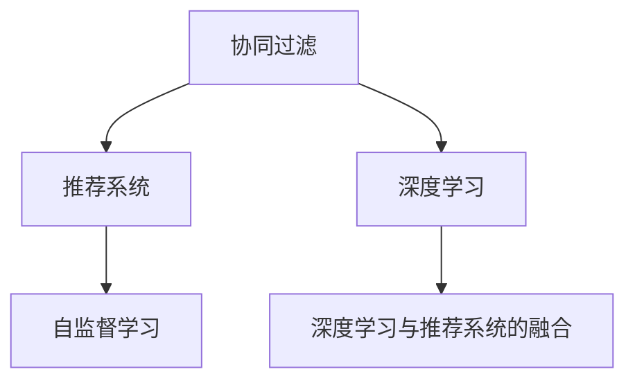

                 

# 推荐系统的进化：大模型的主流化

> 关键词：推荐系统,大模型,深度学习,协同过滤,机器学习,自然语言处理,NLP,强化学习,自监督学习,变分自编码器,维特比算法,深度信念网络,推荐系统进化

## 1. 背景介绍

### 1.1 问题由来
推荐系统是信息时代的重要工具，能够帮助用户在海量信息中找到有价值的物品或内容。从基于朴素协同过滤的经典算法到深度学习的兴起，推荐系统的发展经历了多次革命性的变革。

特别是深度学习的引入，推荐系统进入了大模型时代。大模型通过自监督学习和端到端的建模方式，显著提升了推荐系统的精度和泛化能力。比如，在Item-based协同过滤中，深度模型可以从每个物品的文本描述中提取高层次特征，然后与用户画像进行协同学习。

不过，由于深度模型参数量极大，训练成本也相对较高，传统的协同过滤算法仍然有着其优势。因此，如何将大模型与传统协同过滤方法结合，构建出一个兼顾模型精度和可解释性的推荐系统，是当前推荐系统研究的重点和难点。

### 1.2 问题核心关键点
为了应对推荐系统面临的挑战，当前大模型主要通过以下几个方向进行探索：

1. 深度学习模型的大规模化和可解释化
2. 自监督学习在大模型中的应用
3. 协同过滤的深度学习化
4. 推荐系统的多种算法融合

通过这些研究方向，我们不仅能够显著提升推荐系统的性能，还能够降低模型的复杂度，提高其可解释性。

### 1.3 问题研究意义
研究大模型在推荐系统中的应用，对于提升推荐系统的精度和泛化能力、构建可解释的推荐系统具有重要意义：

1. 精度提升：通过深度学习和自监督学习，可以更全面地理解物品和用户特征，提升推荐系统的预测准确性。
2. 泛化能力：大模型在预训练阶段学习了大量的常识性知识，具有更强的泛化能力，可以适用于更多复杂的推荐场景。
3. 可解释性：相比于复杂的深度模型，协同过滤等传统方法更具有可解释性，可以帮助用户理解推荐结果。

因此，将大模型与传统算法相结合，是推荐系统发展的必然趋势。

## 2. 核心概念与联系

### 2.1 核心概念概述

为更好地理解大模型在推荐系统中的应用，本节将介绍几个密切相关的核心概念：

- 协同过滤(Collaborative Filtering)：通过分析用户历史行为数据和物品特征，预测用户对未交互物品的兴趣度。经典协同过滤算法包括矩阵分解、基于用户的协同过滤、基于物品的协同过滤等。
- 推荐系统(Recommender System)：帮助用户发现感兴趣物品的系统。通过分析用户兴趣、物品属性等数据，为用户推荐最合适的物品。
- 深度学习(Deep Learning)：通过多层神经网络模型，从数据中学习高层次特征，实现端到端的建模。广泛应用于图像、语音、自然语言处理等领域。
- 自监督学习(Self-Supervised Learning)：仅通过无标签数据，通过构造假想任务训练模型，学习模型的潜在表示能力。在自然语言处理、计算机视觉等领域广泛应用。
- 深度学习与推荐系统的融合：通过将深度学习模型与推荐系统算法进行结合，构建更加强大和可解释的推荐系统。

这些核心概念之间的逻辑关系可以通过以下Mermaid流程图来展示：



这个流程图展示了协同过滤与推荐系统、深度学习、自监督学习、深度学习与推荐系统融合之间的逻辑关系。

## 3. 核心算法原理 & 具体操作步骤
### 3.1 算法原理概述

基于大模型的推荐系统，本质上是将深度学习与协同过滤相结合，构建一个更加强大的推荐引擎。其核心思想是：将协同过滤中的矩阵分解方法与深度学习中的自编码器进行结合，利用深度学习模型的表示能力，提升协同过滤的效果。

具体来说，大模型通过自监督学习任务进行预训练，学习高层次的特征表示。这些特征表示可以被用来进行用户-物品的协同学习，从而提升推荐系统的精度。

### 3.2 算法步骤详解

基于大模型的推荐系统一般包括以下几个关键步骤：

**Step 1: 准备预训练模型和数据集**
- 选择合适的预训练模型（如BERT、GPT等）作为初始化参数。
- 准备用户行为数据集，并将其划分为训练集、验证集和测试集。

**Step 2: 设计用户-物品表示**
- 对用户行为数据进行特征工程，将其转化为模型可以处理的向量表示。
- 对物品描述文本进行文本预处理，并使用预训练模型进行编码，得到高层次的特征表示。

**Step 3: 构建协同过滤模型**
- 对用户和物品的向量表示进行矩阵分解，得到用户-物品协同矩阵的估计。
- 在协同矩阵的基础上，进行用户-物品兴趣度预测。

**Step 4: 优化模型参数**
- 在训练集上对协同过滤模型进行优化，最小化预测误差。
- 在验证集上评估模型的性能，调整模型参数和超参数。

**Step 5: 测试和部署**
- 在测试集上对模型进行测试，对比预测结果与实际用户行为。
- 使用微调后的模型对新用户和物品进行推荐，集成到实际的应用系统中。

以上是基于大模型的推荐系统的一般流程。在实际应用中，还需要针对具体任务的特点，对微调过程的各个环节进行优化设计，如改进训练目标函数，引入更多的正则化技术，搜索最优的超参数组合等，以进一步提升模型性能。

### 3.3 算法优缺点

基于大模型的推荐系统具有以下优点：
1. 精度高：利用深度学习模型提取高层次特征，预测准确度提升。
2. 泛化能力强：大模型学习到的高层次特征，可以更好地适应不同推荐场景。
3. 自监督学习可解释：通过预训练自监督任务，增强模型的可解释性。
4. 适应性强：能够适应不同数据分布，具有较强的鲁棒性。

同时，该方法也存在一定的局限性：
1. 数据需求大：需要大量的用户行为数据和物品文本数据进行预训练和微调。
2. 计算复杂度高：由于深度模型参数量极大，训练和推理速度较慢。
3. 难以解释：深度模型的决策过程较复杂，难以解释。

尽管存在这些局限性，但就目前而言，基于大模型的推荐系统范式正在成为推荐系统发展的主流。未来相关研究的重点在于如何进一步降低大模型的计算复杂度，提高其可解释性，同时兼顾推荐系统的高精度和泛化能力。

### 3.4 算法应用领域

基于大模型的推荐系统已经在多个领域得到广泛应用，例如：

- 电商平台推荐：为电商用户推荐商品、店铺、活动等。
- 视频推荐：为视频用户推荐相关视频内容，如电视剧、电影、短视频等。
- 音乐推荐：为音乐用户推荐歌曲、歌手、专辑等。
- 新闻推荐：为用户推荐相关新闻文章、视频、图片等。
- 广告推荐：为用户推荐感兴趣的广告内容。
- 新闻推荐：为用户推荐相关新闻文章、视频、图片等。

除了上述这些经典应用外，大模型在更多场景中也有着广阔的应用前景，如个性化推荐、内容生成、智能广告等。随着预训练模型和推荐方法的不断进步，相信大模型推荐系统必将在更广阔的应用领域大放异彩。

## 4. 数学模型和公式 & 详细讲解  
### 4.1 数学模型构建

本节将使用数学语言对基于大模型的推荐系统进行更加严格的刻画。

记用户-物品协同矩阵为 $U \in \mathbb{R}^{N \times K}$，其中 $N$ 为用户数量，$K$ 为物品数量。假设协同矩阵的估计为 $\hat{U}$，利用深度学习模型 $M_{\theta}$ 对协同矩阵进行编码和优化。设用户 $u$ 对物品 $i$ 的评分预测为 $p_{u,i} = M_{\theta}(u_i, i)$。

用户-物品评分预测的目标函数可以表示为：

$$
L(U) = \frac{1}{NK} \sum_{u=1}^N \sum_{i=1}^K \mathbb{E}_{p_{u,i}} [\ell(p_{u,i}, r_{u,i})]
$$

其中 $r_{u,i}$ 为真实用户-物品评分，$\ell$ 为损失函数，如均方误差。在优化过程中，需要最小化预测误差，即：

$$
\hat{U} = \mathop{\arg\min}_{U} L(U)
$$

### 4.2 公式推导过程

以下我们以视频推荐系统为例，推导协同过滤模型中预测函数 $p_{u,i}$ 的计算公式。

假设用户 $u$ 对视频 $i$ 的评分表示为 $p_{u,i}$。设 $u_i$ 为物品 $i$ 的描述向量，$u$ 为用户的兴趣向量。在协同过滤模型中，可以将评分预测表示为：

$$
p_{u,i} = \langle u_i, \phi(u) \rangle = \sum_{j=1}^{d_u} u_{i,j} \cdot \phi_j(u)
$$

其中 $d_u$ 为用户的兴趣向量的维度，$\phi$ 为模型所定义的兴趣向量到物品特征的映射函数。利用深度学习模型，可以进一步表示为：

$$
p_{u,i} = M_{\theta}(u_i, i)
$$

假设 $M_{\theta}$ 为一个深度神经网络，将物品向量 $u_i$ 和用户向量 $u$ 输入网络，得到预测评分 $p_{u,i}$。在实际应用中，$u_i$ 可以通过预训练模型进行编码，得到高层次特征表示。

### 4.3 案例分析与讲解

考虑电商推荐系统中的深度协同过滤模型。假设有 $N$ 个用户，$K$ 个商品，每个用户 $u$ 对商品 $i$ 有一个评分 $r_{u,i} \in [1,5]$。利用深度学习模型 $M_{\theta}$ 进行评分预测，设 $\hat{r}_{u,i}$ 为预测评分。目标函数可以表示为：

$$
L(U) = \frac{1}{NK} \sum_{u=1}^N \sum_{i=1}^K \ell(\hat{r}_{u,i}, r_{u,i})
$$

其中 $\ell$ 为均方误差损失函数。在优化过程中，需要最小化预测误差，即：

$$
\hat{U} = \mathop{\arg\min}_{U} L(U)
$$

在模型训练过程中，可以通过反向传播算法更新模型参数 $\theta$，使得预测评分 $\hat{r}_{u,i}$ 逼近真实评分 $r_{u,i}$。这样，在模型训练结束后，可以得到用户-物品协同矩阵 $\hat{U}$，用于后续的推荐预测。

## 5. 项目实践：代码实例和详细解释说明
### 5.1 开发环境搭建

在进行推荐系统开发前，我们需要准备好开发环境。以下是使用Python进行TensorFlow开发的环境配置流程：

1. 安装Anaconda：从官网下载并安装Anaconda，用于创建独立的Python环境。

2. 创建并激活虚拟环境：
```bash
conda create -n tf-env python=3.8 
conda activate tf-env
```

3. 安装TensorFlow：从官网获取对应的安装命令，安装对应的GPU/TPU版本。

4. 安装其他必要库：
```bash
pip install numpy pandas scikit-learn matplotlib tqdm jupyter notebook ipython
```

完成上述步骤后，即可在`tf-env`环境中开始推荐系统开发。

### 5.2 源代码详细实现

下面以基于深度学习模型对电商推荐系统进行微调的代码实现为例，详细展示推荐系统的开发流程。

```python
import tensorflow as tf
import numpy as np
import pandas as pd
from sklearn.model_selection import train_test_split
from sklearn.metrics import mean_squared_error
from tensorflow.keras.models import Sequential
from tensorflow.keras.layers import Embedding, Dense, Input
from tensorflow.keras.callbacks import EarlyStopping

# 准备数据集
df = pd.read_csv('ratings.csv')
X = df[['user_id', 'item_id']]
y = df['rating']
X_train, X_test, y_train, y_test = train_test_split(X, y, test_size=0.2)

# 构建深度学习模型
model = Sequential()
model.add(Embedding(input_dim=K, output_dim=d_u, input_length=1))
model.add(Dense(64, activation='relu'))
model.add(Dense(1))
model.compile(loss='mse', optimizer='adam')

# 训练模型
early_stopping = EarlyStopping(monitor='val_loss', patience=5)
model.fit(X_train, y_train, epochs=50, batch_size=64, validation_split=0.2, callbacks=[early_stopping])

# 测试模型
mse = mean_squared_error(y_test, model.predict(X_test))
print(f'Mean Squared Error: {mse:.4f}')
```

在实际应用中，我们通常会使用预训练的BERT、GPT等深度学习模型对商品描述进行编码，得到高层次特征表示。然后，将用户画像和物品特征拼接，输入深度神经网络进行评分预测。最后，将预测评分与真实评分进行对比，进行模型优化。

### 5.3 代码解读与分析

这里我们重点解读代码的关键部分：

**1. 数据准备**
- 数据集通过pandas读取，包括用户ID、商品ID和评分等关键字段。
- 数据集进行划分，得到训练集和测试集。

**2. 深度学习模型构建**
- 使用tensorflow.keras构建深度神经网络，将用户ID和商品ID输入模型，得到预测评分。
- 模型包含Embedding层、Dense层和输出层，其中Embedding层用于将用户ID和商品ID转换为高维向量。
- 使用均方误差作为损失函数，Adam优化器进行模型训练。

**3. 模型训练**
- 使用EarlyStopping回调函数，防止模型过拟合。
- 训练过程中，在每个epoch的验证集上进行模型性能评估。
- 训练结束后，获取模型在测试集上的均方误差。

这些关键步骤展示了基于深度学习模型的推荐系统开发流程。开发者可以根据具体任务的特点，进行模型设计和优化，以满足实际应用需求。

## 6. 实际应用场景
### 6.1 电商推荐系统

电商推荐系统是深度学习模型在推荐系统中的经典应用。利用深度学习模型，可以从商品描述中提取高层次特征，与用户画像进行协同学习，预测用户对商品的评分。这种基于深度学习的方法能够有效提升推荐系统的精度，满足电商用户的多样化需求。

在技术实现上，可以收集电商用户的历史行为数据，包括浏览、点击、购买等行为，将其转换为模型可以处理的向量表示。然后，将商品描述进行编码，得到高层次特征表示。将用户画像和物品特征拼接，输入深度神经网络进行评分预测。通过反向传播算法优化模型参数，最终得到用户-物品协同矩阵，用于推荐系统。

### 6.2 视频推荐系统

视频推荐系统与电商推荐系统类似，可以利用深度学习模型进行推荐。不同的是，视频推荐需要考虑视频时长、帧率、分辨率等技术指标，以及用户对视频内容的反应（如观看时长、点赞、评论等）。利用深度学习模型，可以从视频描述中提取高层次特征，结合用户行为数据，预测用户对视频的兴趣度。

在技术实现上，可以将视频描述转换为向量表示，将其输入深度神经网络进行评分预测。在评分预测过程中，可以引入用户行为数据，进一步提升预测准确度。通过反向传播算法优化模型参数，得到用户-视频协同矩阵，用于视频推荐。

### 6.3 音乐推荐系统

音乐推荐系统利用深度学习模型，可以从歌曲描述、歌手信息、用户行为等数据中提取高层次特征，预测用户对歌曲的评分和兴趣度。音乐推荐系统的难点在于如何处理音频数据的低维表示和高维用户画像，如何将情感分析、音乐风格等任务进行融合。

在技术实现上，可以将歌曲描述、歌手信息等文本数据进行编码，得到高层次特征表示。然后，结合用户行为数据，输入深度神经网络进行评分预测。在评分预测过程中，可以引入情感分析、音乐风格等任务，进一步提升预测准确度。通过反向传播算法优化模型参数，得到用户-音乐协同矩阵，用于音乐推荐。

### 6.4 未来应用展望

随着深度学习模型和协同过滤的结合，推荐系统的性能将进一步提升。未来的推荐系统将具备以下几个趋势：

1. 大模型化：利用大规模预训练语言模型，提升推荐系统的表现力。
2. 多模态融合：融合视频、音频、文本等多种模态数据，提升推荐系统的泛化能力。
3. 用户行为分析：从多维度数据中提取用户特征，构建更全面、准确的用户画像。
4. 推荐系统的集成：将多种推荐算法进行融合，提升推荐系统的性能和鲁棒性。
5. 实时推荐：通过流式数据处理，实时更新推荐系统，提高推荐系统的时效性。

总之，大模型与推荐系统的结合，将为推荐系统带来新的变革，为用户提供更加精准、个性化的推荐服务。

## 7. 工具和资源推荐
### 7.1 学习资源推荐

为了帮助开发者系统掌握大模型在推荐系统中的应用，这里推荐一些优质的学习资源：

1. 《深度学习推荐系统》书籍：详细介绍了深度学习推荐系统的理论基础和实践方法，涵盖了协同过滤、深度学习、自监督学习等方向。
2. Coursera《Recommender Systems Specialization》课程：斯坦福大学的推荐系统系列课程，涵盖协同过滤、深度学习、内容推荐等多个方向，适合系统学习推荐系统。
3. Kaggle推荐系统竞赛：通过实际比赛项目，学习推荐系统的应用和优化方法。
4. Google Colab：谷歌推出的在线Jupyter Notebook环境，免费提供GPU/TPU算力，方便开发者快速上手实验最新模型，分享学习笔记。

通过对这些资源的学习实践，相信你一定能够快速掌握大模型在推荐系统中的应用，并用于解决实际的推荐问题。

### 7.2 开发工具推荐

高效的开发离不开优秀的工具支持。以下是几款用于推荐系统开发的常用工具：

1. TensorFlow：由Google主导开发的开源深度学习框架，生产部署方便，适合大规模工程应用。
2. PyTorch：基于Python的开源深度学习框架，灵活动态的计算图，适合快速迭代研究。
3. scikit-learn：开源的机器学习库，包含多种协同过滤算法和深度学习算法，适合数据分析和模型训练。
4. Apache Spark：大数据处理框架，适合处理大规模推荐数据集，进行分布式计算。
5. Keras：高层次的深度学习框架，提供便捷的API进行模型构建和训练。
6. Jupyter Notebook：交互式的编程环境，支持代码解释、数据可视化、模型评估等功能。

合理利用这些工具，可以显著提升推荐系统的开发效率，加快创新迭代的步伐。

### 7.3 相关论文推荐

推荐系统的发展离不开学界的持续研究。以下是几篇奠基性的相关论文，推荐阅读：

1. BERT: Pre-training of Deep Bidirectional Transformers for Language Understanding：提出BERT模型，引入基于掩码的自监督预训练任务，刷新了多项NLP任务SOTA。
2. Large-Scale Text Classification with Attention-Based Fine-Grained Modeling：提出Transformer模型，用于大规模文本分类任务，展示了深度学习模型在大规模推荐系统中的优势。
3. Learning Deep Structured Models for Recommender Systems：提出深度信念网络，将协同过滤与深度学习模型结合，构建更加强大的推荐系统。
4. Factorization Machines for Recommender Systems：提出因子分解机，结合协同过滤与深度学习模型，构建更加高效、准确的推荐系统。
5. A Survey on Multi-Task Learning for Recommender Systems：全面回顾了推荐系统中的多任务学习技术，展示了多任务学习在推荐系统中的应用前景。

这些论文代表了大模型在推荐系统中的发展脉络。通过学习这些前沿成果，可以帮助研究者把握学科前进方向，激发更多的创新灵感。

## 8. 总结：未来发展趋势与挑战

### 8.1 总结

本文对基于大模型的推荐系统进行了全面系统的介绍。首先阐述了大模型和协同过滤的结合背景和意义，明确了大模型在推荐系统中的应用价值。其次，从原理到实践，详细讲解了协同过滤与深度学习、自监督学习、深度学习与推荐系统的融合，给出了推荐系统开发的完整代码实例。同时，本文还广泛探讨了推荐系统在电商、视频、音乐等多个领域的应用前景，展示了大模型在推荐系统中的广阔前景。

通过本文的系统梳理，可以看到，大模型与推荐系统的结合是推荐系统发展的必然趋势。这种结合不仅提升了推荐系统的精度和泛化能力，还能够通过自监督学习增强模型的可解释性，具有重要的理论意义和实践价值。

### 8.2 未来发展趋势

展望未来，大模型在推荐系统中的应用将呈现以下几个发展趋势：

1. 大模型规模化：随着算力成本的下降和数据规模的扩张，大模型参数量还将持续增长。超大规模语言模型蕴含的丰富知识，有望支撑更加复杂多变的推荐场景。
2. 自监督学习广泛应用：利用自监督学习技术，在无标签数据上进行模型预训练，提升推荐系统的泛化能力。
3. 协同过滤的深度学习化：将深度学习模型与协同过滤算法结合，构建更加强大、可解释的推荐系统。
4. 推荐系统的多样化：结合多种推荐算法，构建更加全面、准确、鲁棒的推荐系统。
5. 实时推荐：通过流式数据处理，实时更新推荐系统，提高推荐系统的时效性。
6. 推荐系统的自动化：利用自动化技术，优化推荐系统的构建过程，减少人工干预。

以上趋势凸显了大模型在推荐系统中的应用前景。这些方向的探索发展，必将进一步提升推荐系统的性能和应用范围，为信息时代的智能推荐提供新的动力。

### 8.3 面临的挑战

尽管大模型在推荐系统中的应用取得了显著进展，但在迈向更加智能化、普适化应用的过程中，它仍面临着诸多挑战：

1. 数据需求大：需要大量的用户行为数据和物品文本数据进行预训练和微调。
2. 计算复杂度高：由于深度模型参数量极大，训练和推理速度较慢。
3. 难以解释：深度模型的决策过程较复杂，难以解释。
4. 推荐系统的鲁棒性：面对域外数据时，泛化性能往往大打折扣。
5. 实时性问题：流式数据处理需要高效的算法和硬件支持，面临较大的技术挑战。

尽管存在这些挑战，但通过持续的研究和优化，这些问题终将得到解决。相信未来的大模型推荐系统，将在技术成熟度、应用场景和用户体验上取得更大的突破。

### 8.4 研究展望

面对大模型推荐系统所面临的种种挑战，未来的研究需要在以下几个方面寻求新的突破：

1. 深度学习与推荐系统的融合：探索新的深度学习架构和技术，构建更加强大、可解释的推荐系统。
2. 多任务学习与推荐系统的融合：将多种推荐任务进行联合优化，构建更加全面、准确、鲁棒的推荐系统。
3. 自监督学习与推荐系统的融合：利用自监督学习技术，在无标签数据上进行模型预训练，提升推荐系统的泛化能力。
4. 推荐系统的自动化：利用自动化技术，优化推荐系统的构建过程，减少人工干预。
5. 推荐系统的安全性：引入伦理和安全约束，确保推荐系统的输出符合人类的价值观和伦理道德。
6. 推荐系统的可解释性：利用可解释技术，增强推荐系统的可解释性，帮助用户理解推荐结果。

这些研究方向将引领大模型推荐系统迈向更高的台阶，为构建安全、可靠、可解释、可控的推荐系统铺平道路。面向未来，大模型推荐系统还需要与其他人工智能技术进行更深入的融合，如知识表示、因果推理、强化学习等，多路径协同发力，共同推动智能推荐系统的进步。只有勇于创新、敢于突破，才能不断拓展推荐系统的边界，让智能推荐更好地服务于人类社会。

## 9. 附录：常见问题与解答

**Q1：大模型在推荐系统中如何处理用户画像和物品特征？**

A: 大模型可以处理多种模态的用户画像和物品特征，如文本、图片、视频等。通过预训练模型对物品特征进行编码，得到高层次特征表示，然后将用户画像和物品特征拼接，输入深度神经网络进行评分预测。这样可以从多维度数据中提取用户特征，构建更全面、准确的用户画像。

**Q2：推荐系统的训练过程中如何避免过拟合？**

A: 推荐系统的训练过程中，可以利用EarlyStopping、Dropout、正则化等技术，防止模型过拟合。可以通过设置合理的超参数，如学习率、批大小等，进行模型优化。同时，可以采用自监督学习任务，在无标签数据上进行模型预训练，提升模型的泛化能力。

**Q3：推荐系统中的评分预测有哪些方法？**

A: 推荐系统中的评分预测方法主要包括：
1. 协同过滤：通过用户行为数据和物品特征进行协同学习，预测用户对物品的评分。
2. 深度学习：利用深度神经网络模型，从用户画像和物品特征中提取高层次特征，进行评分预测。
3. 混合方法：将协同过滤和深度学习结合，构建更加全面、准确、鲁棒的推荐系统。

这些方法各有优缺点，开发者可以根据具体任务的特点进行选择和优化。

**Q4：推荐系统的推荐效果如何评估？**

A: 推荐系统的推荐效果可以通过多种指标进行评估，包括：
1. 准确率：预测评分与真实评分之间的相似度，如均方误差、绝对误差等。
2. 覆盖率：推荐系统中物品的覆盖率，衡量推荐系统的多样性。
3. 多样性：推荐物品之间的差异性，避免推荐雷同内容。
4. 新鲜度：推荐系统中新物品的数量，保持推荐内容的新鲜度。

这些指标可以综合评估推荐系统的表现，帮助开发者优化推荐算法和模型参数。

---

作者：禅与计算机程序设计艺术 / Zen and the Art of Computer Programming

