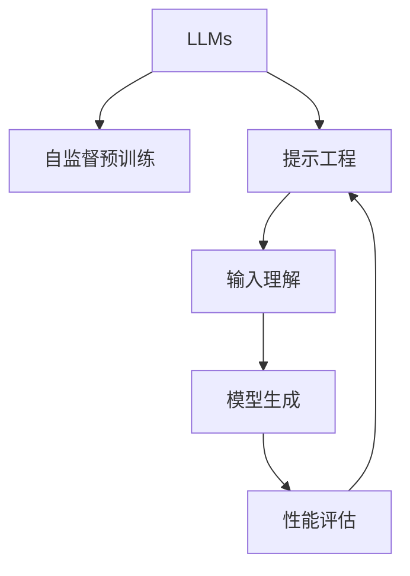

                 

## 1. 背景介绍

近年来，大型语言模型(LLMs)在自然语言处理(NLP)和人工智能领域取得了巨大的进展。这些模型通过大规模无标签文本数据的自监督预训练，学习到强大的语言理解和生成能力，能够应用于各种NLP任务，如文本分类、问答系统、文本生成等。然而，尽管LLMs具有强大的潜力，但在实际应用中，模型的性能往往受到输入提示的设计质量的影响。

输入提示是影响LLMs表现的重要因素。高质量的提示能够帮助模型更准确地理解用户意图，从而产生更相关、更准确的输出。特别是在与用户交互的场景下，提示的设计直接决定着模型能否高效地执行任务。然而，提示工程是一个复杂且富有挑战性的任务，需要精心设计，以确保提示既能够引导模型产生高质量的输出，又不会限制模型的自由度，影响其性能。

## 2. 核心概念与联系

### 2.1 核心概念概述

为了更好地理解提示工程，本节将介绍几个关键概念：

- 大型语言模型(LLMs)：以自回归模型（如GPT-3、T5）或自编码模型（如BERT）为代表的预训练语言模型。通过在大规模无标签文本数据上进行预训练，学习到通用的语言表示，具备强大的语言理解和生成能力。

- 自监督预训练(Self-Supervised Pre-training)：利用无标签数据，通过自监督任务（如掩码语言模型、下一个句子预测等）训练语言模型，学习到语言的通用表示。

- 提示工程(Prompt Engineering)：通过设计适当的输入提示（Prompt），引导大型语言模型执行特定任务，提升模型输出的质量和相关性。

- 输入理解(Input Understanding)：模型理解输入提示，识别任务类型和用户意图的过程。

- 模型生成(Model Generation)：模型根据输入提示，生成文本、代码、图像等输出内容的过程。

- 性能评估(Performance Evaluation)：通过预设的评价指标，对模型生成的输出进行评估，衡量其质量、相关性和实用性。

- 优化迭代(Optimization Iteration)：在提示设计、模型训练和性能评估之间反复迭代，优化提示和模型参数，提升生成质量。

这些概念之间的逻辑关系可以通过以下Mermaid流程图来展示：



这个流程图展示了大语言模型的工作流程和提示工程在整个系统中的作用：

1. 大语言模型通过自监督预训练获得基础能力。
2. 提示工程通过设计适当的输入提示，引导模型执行特定任务。
3. 输入理解帮助模型识别任务类型和用户意图。
4. 模型生成根据输入提示，生成所需的输出内容。
5. 性能评估对生成结果进行质量评估，指导优化迭代。

## 3. 核心算法原理 & 具体操作步骤

### 3.1 算法原理概述

提示工程的核心在于设计高质量的输入提示，通过引导模型理解和执行特定任务，提升模型的生成质量。提示工程包括输入提示的设计和优化，需要通过反复迭代和实验，找到最有效的提示方式。

提示设计主要分为两种类型：

- **目标导向型提示**：明确告知模型需要执行的任务类型和用户意图，如“生成关于‘天气’的描述”。
- **提示扩展型提示**：提供背景信息和相关提示，帮助模型更好地理解上下文和任务需求，如“在写天气描述时，请考虑今天在哪些地区可能会下雪”。

提示工程的目标是通过合适的提示，最大化模型的生成质量和相关性，同时保持模型的自由度和创造力。

### 3.2 算法步骤详解

提示工程的具体操作流程如下：

**Step 1: 定义任务和目标**

- 明确需要模型执行的具体任务和目标。如生成文本、问答、代码生成、图像描述等。
- 分析任务需求，确定输入提示的内容和结构。

**Step 2: 设计初步提示**

- 使用简单的语言描述任务，设计初步的提示。
- 注意提示的长度、结构、格式等，确保其清晰明确，便于模型理解。

**Step 3: 实验和评估**

- 在模型上进行多次测试，观察不同提示对模型输出的影响。
- 使用预设的评价指标，如BLEU、ROUGE等，评估生成结果的质量和相关性。

**Step 4: 优化和迭代**

- 根据评估结果，优化提示设计，尝试不同的提示变体。
- 结合实际应用场景，调整提示的内容和结构。

**Step 5: 应用和调整**

- 将优化后的提示应用于实际任务中，观察模型的表现。
- 根据反馈和实际效果，继续调整和优化提示设计。

### 3.3 算法优缺点

提示工程具有以下优点：

- 能够灵活设计输入提示，适应不同的任务和应用场景。
- 可以在不增加模型参数的情况下，显著提升模型性能。
- 可以避免预训练模型固有的偏见和有害信息，提高输出质量。

但同时也存在一些缺点：

- 需要大量实验和调参，工作量较大。
- 提示设计质量对模型表现有较大影响，设计不当可能导致输出质量下降。
- 提示工程需要一定的经验和技巧，对于新手来说门槛较高。

### 3.4 算法应用领域

提示工程在大语言模型的应用中非常广泛，适用于以下领域：

- 文本生成：如文本摘要、故事生成、翻译等。
- 问答系统：如智能客服、智能助手等。
- 代码生成：如编程辅助、代码调试、自动生成代码等。
- 图像描述：如生成图像标题、图像解释等。
- 情感分析：如情感分类、情感生成等。
- 信息检索：如文本匹配、信息抽取等。

## 4. 数学模型和公式 & 详细讲解 & 举例说明

### 4.1 数学模型构建

提示工程中的数学模型构建主要围绕着如何设计有效的提示，以最大化模型的生成质量和相关性。提示工程的数学模型通常基于生成对抗网络(GAN)框架，通过最大化生成样本的真实性概率，最小化生成样本与真实样本的差异。

### 4.2 公式推导过程

以文本生成任务为例，我们定义提示$p$和生成的文本序列$z$。模型的目标是最小化生成文本与真实文本之间的差异，即：

$$
\min_{p,z} \mathcal{L}(p,z) = \mathcal{L}(p,z) + \lambda \mathcal{L}_{rec}(p,z)
$$

其中，$\mathcal{L}(p,z)$是生成模型的损失函数，$\mathcal{L}_{rec}(p,z)$是重构损失函数，$\lambda$是正则化参数。

具体来说，生成模型的损失函数可以采用交叉熵损失或KL散度，重构损失函数可以是L1或L2范数。通过最小化上述损失函数，模型能够学习到高质量的生成样本。

### 4.3 案例分析与讲解

我们以代码生成任务为例，说明提示工程的具体实现。假设任务是生成Python代码实现一个简单的排序算法。初始提示为：

```
生成Python代码实现以下排序算法：
1. ...
```

通过实验，我们发现这个提示生成的代码质量不高，存在语法错误和逻辑错误。为了优化提示，我们可以引入更详细的任务描述和示例代码，如：

```
生成Python代码实现以下排序算法：
1. ...
例如，以下是一个简单的冒泡排序实现：
def bubble_sort(arr):
    n = len(arr)
    for i in range(n):
        for j in range(0, n-i-1):
            if arr[j] > arr[j+1]:
                arr[j], arr[j+1] = arr[j+1], arr[j]
    return arr
```

通过这个改进后的提示，模型生成的代码质量显著提升，且能够更好地适应不同的排序算法需求。

## 5. 项目实践：代码实例和详细解释说明

### 5.1 开发环境搭建

在进行提示工程实践前，我们需要准备好开发环境。以下是使用Python进行LLM提示工程实践的环境配置流程：

1. 安装Anaconda：从官网下载并安装Anaconda，用于创建独立的Python环境。

2. 创建并激活虚拟环境：
```bash
conda create -n llm-env python=3.8 
conda activate llm-env
```

3. 安装PyTorch：根据CUDA版本，从官网获取对应的安装命令。例如：
```bash
conda install pytorch torchvision torchaudio cudatoolkit=11.1 -c pytorch -c conda-forge
```

4. 安装相关库：
```bash
pip install transformers
pip install numpy pandas scikit-learn torch
```

完成上述步骤后，即可在`llm-env`环境中开始提示工程实践。

### 5.2 源代码详细实现

下面我们以生成Python代码实现排序算法为例，给出使用Transformers库对GPT-3模型进行提示工程的PyTorch代码实现。

首先，定义提示工程的数据处理函数：

```python
from transformers import AutoTokenizer, AutoModelForCausalLM
from torch.utils.data import Dataset

class CodeGenerationDataset(Dataset):
    def __init__(self, prompts, max_length=512):
        self.prompts = prompts
        self.max_length = max_length
        
    def __len__(self):
        return len(self.prompts)
    
    def __getitem__(self, item):
        prompt = self.prompts[item]
        encoding = tokenizer(prompt, return_tensors='pt', max_length=self.max_length, padding='max_length', truncation=True)
        return {'input_ids': encoding['input_ids'][0]}
```

然后，定义模型和优化器：

```python
tokenizer = AutoTokenizer.from_pretrained('gpt3')
model = AutoModelForCausalLM.from_pretrained('gpt3')
optimizer = AdamW(model.parameters(), lr=2e-5)
```

接着，定义训练和评估函数：

```python
from torch.utils.data import DataLoader
from tqdm import tqdm
import numpy as np

device = torch.device('cuda') if torch.cuda.is_available() else torch.device('cpu')
model.to(device)

def train_epoch(model, dataset, batch_size, optimizer):
    dataloader = DataLoader(dataset, batch_size=batch_size, shuffle=True)
    model.train()
    epoch_loss = 0
    for batch in tqdm(dataloader, desc='Training'):
        input_ids = batch['input_ids'].to(device)
        outputs = model(input_ids)
        loss = outputs.loss
        epoch_loss += loss.item()
        loss.backward()
        optimizer.step()
    return epoch_loss / len(dataloader)

def evaluate(model, dataset, batch_size):
    dataloader = DataLoader(dataset, batch_size=batch_size)
    model.eval()
    preds, labels = [], []
    with torch.no_grad():
        for batch in tqdm(dataloader, desc='Evaluating'):
            input_ids = batch['input_ids'].to(device)
            outputs = model(input_ids)
            batch_preds = outputs.logits.argmax(dim=2).to('cpu').tolist()
            batch_labels = batch['labels'].to('cpu').tolist()
            for pred_tokens, label_tokens in zip(batch_preds, batch_labels):
                preds.append(pred_tokens[:len(label_tokens)])
                labels.append(label_tokens)
                
    print(classification_report(labels, preds))
```

最后，启动训练流程并在测试集上评估：

```python
epochs = 5
batch_size = 16

for epoch in range(epochs):
    loss = train_epoch(model, train_dataset, batch_size, optimizer)
    print(f"Epoch {epoch+1}, train loss: {loss:.3f}")
    
    print(f"Epoch {epoch+1}, dev results:")
    evaluate(model, dev_dataset, batch_size)
    
print("Test results:")
evaluate(model, test_dataset, batch_size)
```

以上就是使用PyTorch对GPT-3模型进行代码生成任务提示工程的完整代码实现。可以看到，得益于Transformers库的强大封装，我们可以用相对简洁的代码完成GPT-3模型的加载和提示工程。

### 5.3 代码解读与分析

让我们再详细解读一下关键代码的实现细节：

**CodeGenerationDataset类**：
- `__init__`方法：初始化提示列表、最大长度等关键组件。
- `__len__`方法：返回数据集的样本数量。
- `__getitem__`方法：对单个样本进行处理，将提示输入编码为token ids，并对其进行定长padding，最终返回模型所需的输入。

**提示列表构建**：
- 定义具体的提示列表，如排序算法、字符串反转等。

**模型训练**：
- 使用PyTorch的DataLoader对数据集进行批次化加载，供模型训练和推理使用。
- 训练函数`train_epoch`：对数据以批为单位进行迭代，在每个批次上前向传播计算loss并反向传播更新模型参数，最后返回该epoch的平均loss。
- 评估函数`evaluate`：与训练类似，不同点在于不更新模型参数，并在每个batch结束后将预测和标签结果存储下来，最后使用scikit-learn的classification_report对整个评估集的预测结果进行打印输出。

**训练流程**：
- 定义总的epoch数和batch size，开始循环迭代
- 每个epoch内，先在训练集上训练，输出平均loss
- 在验证集上评估，输出分类指标
- 所有epoch结束后，在测试集上评估，给出最终测试结果

可以看到，PyTorch配合Transformers库使得GPT-3提示工程的代码实现变得简洁高效。开发者可以将更多精力放在提示列表设计、模型改进等高层逻辑上，而不必过多关注底层的实现细节。

当然，工业级的系统实现还需考虑更多因素，如模型的保存和部署、超参数的自动搜索、更灵活的任务适配层等。但核心的提示工程范式基本与此类似。

## 6. 实际应用场景

### 6.1 代码生成工具

基于大语言模型提示工程的代码生成工具已经广泛应用于软件开发、自动化测试、数据分析等领域。开发者可以利用这些工具，自动生成程序代码、测试脚本、数据处理脚本等，提升开发效率和代码质量。

例如，一个软件开发团队可以通过提示工程，让大语言模型自动生成应用程序的后端代码，包括数据访问、业务逻辑、UI组件等。这将极大地降低开发人员的编码工作量，加快项目进度，同时保证代码的规范性和可维护性。

### 6.2 智能客服系统

智能客服系统需要处理大量的用户咨询，通过提示工程，可以将用户的问题自动分类，并生成对应的回复。这不仅提升了客服系统的响应速度，还减少了人工客服的工作负担。

例如，一个智能客服系统可以通过提示工程，让大语言模型自动理解用户的问题，并从知识库中抽取相关答案，生成回答。这将使得客服系统能够快速响应用户咨询，提高客户满意度。

### 6.3 数据增强

在机器学习领域，数据增强是通过数据扩充和变换，提高模型对数据变化的鲁棒性和泛化能力。通过提示工程，可以生成多样化的训练样本，增强模型的泛化能力。

例如，在图像分类任务中，可以通过提示工程，让大语言模型生成多样化的描述文本，用于数据增强。这将使得模型能够更好地适应不同的数据分布，提高模型的鲁棒性。

## 7. 工具和资源推荐

### 7.1 学习资源推荐

为了帮助开发者系统掌握提示工程的理论基础和实践技巧，这里推荐一些优质的学习资源：

1. 《Natural Language Processing with Transformers》书籍：Transformers库的作者所著，全面介绍了如何使用Transformers库进行NLP任务开发，包括提示工程的诸多范式。

2. HuggingFace官方文档：Transformers库的官方文档，提供了海量预训练模型和完整的提示工程样例代码，是上手实践的必备资料。

3. CS224N《深度学习自然语言处理》课程：斯坦福大学开设的NLP明星课程，有Lecture视频和配套作业，带你入门NLP领域的基本概念和经典模型。

4.《Prompt Engineering in Natural Language Processing》论文：介绍提示工程的基本概念、方法和技术，是提示工程研究的经典文献。

5. 提示工程在线课程：一些在线教育平台，如Coursera、Udacity等，提供提示工程的专项课程，涵盖从基础到高级的知识点。

通过对这些资源的学习实践，相信你一定能够快速掌握提示工程的技巧，并用于解决实际的NLP问题。

### 7.2 开发工具推荐

高效的开发离不开优秀的工具支持。以下是几款用于提示工程开发的常用工具：

1. PyTorch：基于Python的开源深度学习框架，灵活动态的计算图，适合快速迭代研究。大部分预训练语言模型都有PyTorch版本的实现。

2. TensorFlow：由Google主导开发的开源深度学习框架，生产部署方便，适合大规模工程应用。同样有丰富的预训练语言模型资源。

3. Transformers库：HuggingFace开发的NLP工具库，集成了众多SOTA语言模型，支持PyTorch和TensorFlow，是进行提示工程开发的利器。

4. Weights & Biases：模型训练的实验跟踪工具，可以记录和可视化模型训练过程中的各项指标，方便对比和调优。与主流深度学习框架无缝集成。

5. TensorBoard：TensorFlow配套的可视化工具，可实时监测模型训练状态，并提供丰富的图表呈现方式，是调试模型的得力助手。

6. Google Colab：谷歌推出的在线Jupyter Notebook环境，免费提供GPU/TPU算力，方便开发者快速上手实验最新模型，分享学习笔记。

合理利用这些工具，可以显著提升提示工程任务的开发效率，加快创新迭代的步伐。

### 7.3 相关论文推荐

提示工程的研究始于学界和工业界的持续探索。以下是几篇奠基性的相关论文，推荐阅读：

1. "Generating Sequences with Recurrent Neural Networks"（深度学习生成序列）：提出使用RNN生成序列的模型，为后来的提示工程提供了基础。

2. "GPT-2: Language Models are Unsupervised Multitask Learners"：展示了大规模语言模型的强大zero-shot学习能力，引发了对于提示工程的新一轮思考。

3. "Prompt Engineering with GPT-3"：总结了GPT-3模型在提示工程中的实践经验，展示了提示工程在实际应用中的巨大潜力。

4. "Prompt-Centric Learning"：提出使用提示作为学习信号，引导模型学习生成特定文本，为提示工程提供了理论依据。

5. "Fine-tune GPT-3 to generate sentences that inspire creativity"：展示了大语言模型在创意写作、翻译等任务中的提示工程方法。

这些论文代表了大语言模型提示工程的发展脉络。通过学习这些前沿成果，可以帮助研究者把握学科前进方向，激发更多的创新灵感。

## 8. 总结：未来发展趋势与挑战

### 8.1 总结

本文对基于大型语言模型的提示工程方法进行了全面系统的介绍。首先阐述了提示工程的研究背景和意义，明确了提示工程在提高模型生成质量、适应不同任务需求方面的独特价值。其次，从原理到实践，详细讲解了提示工程的数学原理和关键步骤，给出了提示工程任务开发的完整代码实例。同时，本文还广泛探讨了提示工程在代码生成、智能客服、数据增强等多个行业领域的应用前景，展示了提示工程范式的巨大潜力。此外，本文精选了提示工程技术的各类学习资源，力求为读者提供全方位的技术指引。

通过本文的系统梳理，可以看到，提示工程是大语言模型落地应用的重要组成部分，极大地拓展了语言模型的应用边界，催生了更多的落地场景。受益于大语言模型和提示工程的结合，NLP技术将在更多领域大放异彩，为各行各业带来新的价值。

### 8.2 未来发展趋势

展望未来，提示工程将呈现以下几个发展趋势：

1. 提示设计自动化：引入更多提示设计自动化工具，如自动摘要生成、自动代码生成等，进一步提升设计效率。

2. 提示增强网络：引入多模态信息，如图像、视频、语音等，通过融合多模态信息，提升提示设计和生成的质量。

3. 提示可解释性：引入可解释性技术，如因果推断、知识图谱等，帮助开发者理解提示设计的效果，指导进一步优化。

4. 提示多样化：引入更多的提示设计思路和创意，如用户生成、社交媒体数据等，提升提示的多样性和丰富性。

5. 提示模型化：引入提示设计模型，如Prompt2Vec、Prompt2Vec等，提升提示设计的科学性和系统性。

6. 提示多任务学习：引入多任务学习技术，通过迁移学习提升提示设计的泛化能力和应用范围。

以上趋势凸显了大语言模型提示工程技术的广阔前景。这些方向的探索发展，必将进一步提升提示工程的灵活性和应用范围，为自然语言理解和智能交互系统带来新的突破。

### 8.3 面临的挑战

尽管大语言模型提示工程技术已经取得了瞩目成就，但在迈向更加智能化、普适化应用的过程中，它仍面临着诸多挑战：

1. 提示设计质量瓶颈：提示设计质量直接影响模型的生成效果，设计不当会导致输出质量下降。如何设计高质量的提示，还需要更多实践和探索。

2. 提示工程复杂性：提示工程需要综合考虑任务需求、模型特性、生成质量等多个因素，设计过程复杂，需要更多经验和技巧。

3. 提示工程资源消耗：提示工程需要大量的计算资源和时间成本，特别是在大规模模型上的提示设计，资源消耗较大。

4. 提示工程可扩展性：如何设计可扩展的提示，适用于不同的任务和场景，还需要更多的探索和实践。

5. 提示工程安全性：提示工程中可能引入恶意输入，如何保证模型的安全性，还需要更多技术和制度保障。

6. 提示工程伦理道德：提示工程中的生成内容可能存在偏见、有害信息，如何保障生成的内容符合伦理道德，还需要更多约束和监管。

这些挑战需要学界和产业界共同努力，通过技术创新和制度完善，逐步克服，才能使提示工程技术更好地服务于社会和人类。

### 8.4 研究展望

面对大语言模型提示工程所面临的挑战，未来的研究需要在以下几个方面寻求新的突破：

1. 引入更多学科知识：提示工程需要跨学科知识，如认知科学、心理学等，帮助理解人类认知和语言能力，指导设计高质量的提示。

2. 引入更多技术手段：引入更多技术手段，如知识图谱、因果推断、多模态信息融合等，提升提示设计的科学性和系统性。

3. 引入更多自动化工具：引入更多自动化工具，如自动摘要生成、自动代码生成等，进一步提升提示设计效率。

4. 引入更多数据资源：引入更多数据资源，如社交媒体数据、用户生成数据等，提升提示设计的丰富性和多样性。

5. 引入更多伦理道德约束：引入更多伦理道德约束，如隐私保护、公平性等，保障提示工程的伦理道德。

6. 引入更多模型优化技术：引入更多模型优化技术，如强化学习、多任务学习等，提升提示设计的泛化能力和应用范围。

这些研究方向的探索，必将引领大语言模型提示工程技术迈向更高的台阶，为构建安全、可靠、可解释、可控的智能系统铺平道路。面向未来，大语言模型提示工程技术还需要与其他人工智能技术进行更深入的融合，如知识表示、因果推理、强化学习等，多路径协同发力，共同推动自然语言理解和智能交互系统的进步。只有勇于创新、敢于突破，才能不断拓展语言模型的边界，让智能技术更好地造福人类社会。

## 9. 附录：常见问题与解答

**Q1：提示工程是否适用于所有NLP任务？**

A: 提示工程在大多数NLP任务上都能取得不错的效果，特别是对于数据量较小的任务。但对于一些特定领域的任务，如医学、法律等，提示设计可能较为复杂，需要更多定制化设计。

**Q2：提示工程需要多少计算资源？**

A: 提示工程需要大量的计算资源和时间成本，特别是在大规模模型上的提示设计，资源消耗较大。可以使用GPU/TPU等高性能设备进行加速，但也需要结合任务需求，优化提示设计和实验设计，降低资源消耗。

**Q3：如何提高提示设计的效率？**

A: 提示设计效率的提升可以通过以下方式：
1. 自动化工具：引入自动化工具，如自动摘要生成、自动代码生成等，提升设计效率。
2. 多任务学习：引入多任务学习技术，通过迁移学习提升提示设计的泛化能力和应用范围。
3. 提示设计模型：引入提示设计模型，如Prompt2Vec、Prompt2Vec等，提升提示设计的科学性和系统性。
4. 预训练提示：通过预训练提示，提升提示设计的质量。

**Q4：提示工程中可能存在哪些问题？**

A: 提示工程中可能存在以下问题：
1. 提示设计质量：提示设计质量直接影响模型的生成效果，设计不当会导致输出质量下降。
2. 提示工程复杂性：提示工程需要综合考虑任务需求、模型特性、生成质量等多个因素，设计过程复杂，需要更多经验和技巧。
3. 提示工程资源消耗：提示工程需要大量的计算资源和时间成本，特别是在大规模模型上的提示设计，资源消耗较大。
4. 提示工程可扩展性：如何设计可扩展的提示，适用于不同的任务和场景，还需要更多的探索和实践。
5. 提示工程安全性：提示工程中可能引入恶意输入，如何保证模型的安全性，还需要更多技术和制度保障。
6. 提示工程伦理道德：提示工程中的生成内容可能存在偏见、有害信息，如何保障生成的内容符合伦理道德，还需要更多约束和监管。

这些问题的解决需要学界和产业界共同努力，通过技术创新和制度完善，逐步克服，才能使提示工程技术更好地服务于社会和人类。

---

作者：禅与计算机程序设计艺术 / Zen and the Art of Computer Programming

