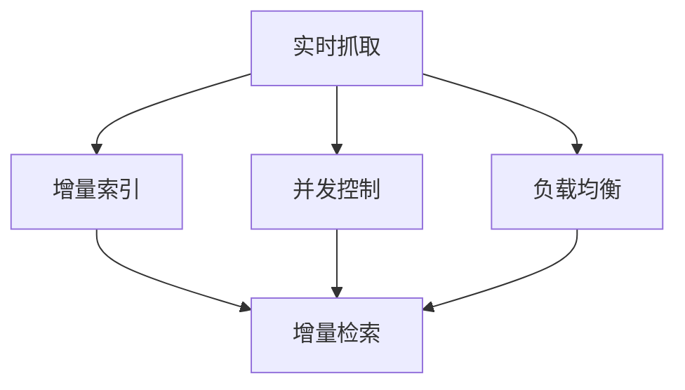

                 

# 搜索引擎的实时性：即时信息更新

在互联网时代，信息更新速度和搜索效率成为用户最为关注的核心指标。搜索引擎不仅需要快速响应用户查询，还必须能够即时地展示最新的信息，满足用户对时效性的高要求。本文将深入探讨搜索引擎的实时性，包括核心概念、算法原理、具体操作步骤，并结合实际案例和数学模型，对搜索引擎的即时信息更新进行详细分析和解释。

## 1. 背景介绍

### 1.1 问题由来
搜索引擎作为信息获取的重要工具，用户对其实时性的要求越来越高。传统搜索引擎主要依赖爬虫程序定期抓取网页，并存储至索引库中，当用户进行查询时，从索引库中检索并返回结果。然而，这种定时抓取和存储的方式存在一定的延迟，无法即时响应用户的需求。随着互联网信息的爆炸式增长，搜索引擎的实时性问题愈发凸显。

为了解决这一问题，一些搜索引擎如Google、Bing等引入了实时抓取技术，能够及时更新网页信息，甚至支持搜索结果的即时更新。这些技术极大提升了搜索引擎的用户体验，使得搜索引擎更加贴近用户的真实需求。

### 1.2 问题核心关键点
搜索引擎的实时性问题涉及核心概念包括：
- 实时抓取与索引更新
- 并发控制与负载均衡
- 增量索引与增量检索
- 实时查询处理与实时结果展示

这些问题相互关联，共同决定了搜索引擎的实时性表现。

## 2. 核心概念与联系

### 2.1 核心概念概述

为更好地理解搜索引擎的实时性，本节将介绍几个密切相关的核心概念：

- 实时抓取(Real-time Crawling)：指搜索引擎通过持续的爬虫程序，实时抓取互联网上的新鲜网页，并更新至索引库的过程。
- 增量索引(Incremental Indexing)：指搜索引擎仅对新增或变更的网页进行索引更新，而非重新索引整个网页库。
- 增量检索(Incremental Retrieval)：指搜索引擎在查询处理过程中，仅返回新近添加或变更的网页，而无需对整个网页库进行检索。
- 并发控制(Concurrency Control)：指搜索引擎在实时抓取、索引更新和查询处理等操作中，对并发请求进行协调和管理，保证系统稳定性和数据一致性。
- 负载均衡(Load Balancing)：指搜索引擎将查询请求分配到多个服务器上进行处理，平衡系统负载，提高处理效率。

这些概念之间的逻辑关系可以通过以下Mermaid流程图来展示：



这个流程图展示了这个核心概念的逻辑关系：

1. 实时抓取获取最新网页。
2. 增量索引更新索引库，仅处理新网页。
3. 增量检索返回新近网页，不检索全库。
4. 并发控制协调多个操作，保证一致性。
5. 负载均衡分配请求，提高效率。

这些核心概念共同构成了搜索引擎实时性的实现基础，使得搜索引擎能够及时响应用户查询，提供最新的搜索结果。

## 3. 核心算法原理 & 具体操作步骤
### 3.1 算法原理概述

搜索引擎的实时性主要由以下几个关键算法和策略组成：

- 实时抓取算法：设计合理的抓取策略，确保抓取内容的时效性和全面性。
- 增量索引算法：优化索引更新机制，减少冗余更新，提高索引更新效率。
- 增量检索算法：优化查询处理机制，仅返回新近网页，避免全库检索。
- 并发控制策略：采用分布式锁、事务隔离等方法，保证多个并发操作的正确性。
- 负载均衡策略：通过轮询、哈希等算法，将请求合理分配至多个服务器。

这些算法和策略共同保证了搜索引擎的实时性，下面将详细介绍每个部分的原理和具体操作步骤。

### 3.2 算法步骤详解

#### 实时抓取算法

实时抓取算法的设计需要考虑以下两个关键因素：

1. **抓取频率和间隔**：确定爬虫程序抓取网页的频率和间隔，既要确保抓取的及时性，又要避免频繁抓取对网站造成过载。

2. **抓取策略和优先级**：根据网页的重要性和内容新鲜度，设计合理的抓取策略和优先级，确保重要网页能够被及时抓取。

以Google为例，其抓取算法采用了“逆向爬虫”策略，即从用户查询的网页出发，向关联的网页进行深度抓取，以此不断扩展抓取范围，确保用户获取的信息最新且全面。

#### 增量索引算法

增量索引算法的设计需要考虑以下两个关键因素：

1. **更新机制**：确定新网页和已更新网页的索引更新机制，确保索引库的实时性和一致性。

2. **索引合并**：设计合理的索引合并策略，将增量索引与原有索引合并，避免数据冗余和重复。

以Apache Solr为例，其增量索引算法采用了“Distributed Indexing”策略，即通过分布式索引服务器，将增量索引分发到各个服务器上，同时使用“Commit Log”记录每次索引更新的变化，确保索引的一致性和实时性。

#### 增量检索算法

增量检索算法的设计需要考虑以下两个关键因素：

1. **查询处理**：优化查询处理机制，确保在用户查询时，仅返回新近添加或变更的网页。

2. **结果展示**：设计合理的结果展示策略，确保用户获取的信息及时且准确。

以Bing为例，其增量检索算法采用了“Zero-Query”策略，即在用户查询时，首先查询当前网页库中的新近网页，然后根据用户的行为反馈，进一步优化查询结果。

#### 并发控制策略

并发控制策略的设计需要考虑以下两个关键因素：

1. **锁机制**：采用合适的锁机制，确保多个并发操作互斥执行，避免数据冲突。

2. **事务隔离**：设计合理的事务隔离机制，确保数据的完整性和一致性。

以Zookeeper为例，其并发控制策略采用了“分布式锁”机制，即在多个节点上部署锁管理器，对共享资源的访问进行协调和管理，保证操作的正确性和一致性。

#### 负载均衡策略

负载均衡策略的设计需要考虑以下两个关键因素：

1. **负载分配**：采用合适的负载分配算法，将请求合理分配至各个服务器，避免单点过载。

2. **性能优化**：优化服务器资源利用率，提高系统整体处理效率。

以NGINX为例，其负载均衡策略采用了“轮询”算法，即在多个服务器之间轮询分发请求，保证负载均衡，提高处理效率。

### 3.3 算法优缺点

搜索引擎的实时性算法具有以下优点：

1. **提升用户体验**：通过及时抓取和更新网页，用户能够获取最新的信息，提升搜索体验。
2. **减少冗余更新**：仅对新网页进行索引更新，减少索引库的冗余数据，提高索引效率。
3. **提高检索速度**：仅返回新近网页，避免全库检索，提升查询速度。
4. **保证数据一致**：通过并发控制和事务隔离，确保数据的完整性和一致性。
5. **优化资源利用**：通过负载均衡，提高服务器资源利用率，提升系统效率。

同时，这些算法也存在一些局限性：

1. **抓取策略复杂**：设计合理的抓取策略和优先级需要考虑多个因素，增加了实现难度。
2. **索引更新复杂**：增量索引和索引合并策略复杂，可能导致数据不一致。
3. **查询处理复杂**：增量检索和结果展示策略复杂，可能导致用户体验不稳定。
4. **并发控制复杂**：并发控制和事务隔离机制复杂，增加了系统实现难度。
5. **负载均衡复杂**：负载均衡算法复杂，可能导致系统负载不均衡。

尽管存在这些局限性，但就目前而言，这些算法仍是目前搜索引擎实现实时性的主流范式。未来相关研究的重点在于如何进一步简化抓取策略，优化索引更新和查询处理机制，同时兼顾并发控制和负载均衡，提升搜索引擎的实时性表现。

### 3.4 算法应用领域

搜索引擎的实时性算法已经在搜索引擎领域得到了广泛应用，具体应用场景包括：

- 网页抓取：通过实时抓取网页，确保搜索结果的最新性。
- 索引更新：通过增量索引更新，减少索引库的冗余数据，提高索引效率。
- 查询处理：通过增量检索和结果展示，提升查询速度和用户体验。
- 并发控制：通过分布式锁和事务隔离，保证数据的完整性和一致性。
- 负载均衡：通过轮询和哈希算法，提高服务器资源利用率，提升系统效率。

这些核心算法和策略不仅适用于传统的网页搜索引擎，也广泛应用于推荐系统、广告投放、社交网络等需要即时响应用户需求的场景。

## 4. 数学模型和公式 & 详细讲解 & 举例说明

### 4.1 数学模型构建

搜索引擎的实时性涉及到多个核心数学模型，包括网页抓取模型、索引更新模型、查询处理模型等。这里以网页抓取模型为例，进行详细阐述。

网页抓取模型的核心目标是设计合理的抓取策略和优先级，确保网页的及时性和全面性。假设网页集合为 $W$，网页更新的概率分布为 $p(w)$，抓取成本为 $c(w)$。目标是在有限的抓取预算 $B$ 内，最大化抓取网页的覆盖率和新鲜度。

该问题可以通过优化模型来求解，目标函数为：

$$
\max \sum_{w \in W} p(w) \log \frac{p(w)}{c(w)}
$$

约束条件为：

$$
\sum_{w \in W} p(w) \leq B
$$

其中，$p(w)$ 表示网页 $w$ 的更新概率，$c(w)$ 表示网页 $w$ 的抓取成本。

### 4.2 公式推导过程

为了求解上述优化模型，可以使用拉格朗日乘子法，构造拉格朗日函数：

$$
\mathcal{L}(p, \lambda) = \sum_{w \in W} p(w) \log \frac{p(w)}{c(w)} + \lambda \left( \sum_{w \in W} p(w) - B \right)
$$

对拉格朗日函数求偏导，得：

$$
\frac{\partial \mathcal{L}}{\partial p(w)} = \log \frac{p(w)}{c(w)} + \lambda
$$

令 $\frac{\partial \mathcal{L}}{\partial p(w)} = 0$，解得：

$$
p(w) = \frac{c(w)}{\sum_{w' \in W} c(w')}
$$

即网页 $w$ 的抓取概率与其抓取成本成反比。

### 4.3 案例分析与讲解

以Google的“逆向爬虫”为例，其抓取策略基于网页的反向链接数量，即通过抓取引用网页，进一步扩展抓取范围，确保网页的全面性和新鲜度。假设网页 $w$ 的反向链接数量为 $n(w)$，抓取成本为 $c(w)$，目标函数和约束条件同上。

通过拉格朗日乘子法求解，得到网页 $w$ 的抓取概率为：

$$
p(w) = \frac{n(w)}{\sum_{w' \in W} n(w')}
$$

即网页 $w$ 的抓取概率与其反向链接数量成正比。这种策略确保了重要网页能够被及时抓取，提升了抓取效率和用户体验。

## 5. 项目实践：代码实例和详细解释说明
### 5.1 开发环境搭建

在进行搜索引擎实时性项目实践前，我们需要准备好开发环境。以下是使用Python进行PyTorch开发的环境配置流程：

1. 安装Anaconda：从官网下载并安装Anaconda，用于创建独立的Python环境。

2. 创建并激活虚拟环境：
```bash
conda create -n pytorch-env python=3.8 
conda activate pytorch-env
```

3. 安装PyTorch：根据CUDA版本，从官网获取对应的安装命令。例如：
```bash
conda install pytorch torchvision torchaudio cudatoolkit=11.1 -c pytorch -c conda-forge
```

4. 安装TensorFlow：
```bash
pip install tensorflow
```

5. 安装各类工具包：
```bash
pip install numpy pandas scikit-learn matplotlib tqdm jupyter notebook ipython
```

完成上述步骤后，即可在`pytorch-env`环境中开始实时性项目实践。

### 5.2 源代码详细实现

这里我们以Bing的“Zero-Query”策略为例，给出使用TensorFlow进行增量检索的PyTorch代码实现。

首先，定义查询结果的返回策略函数：

```python
from tensorflow.keras import layers

def zero_query_strategy(query, model, threshold=0.5):
    scores = model.predict(query)
    top_indices = tf.argsort(scores)[-1][threshold * len(query)]
    return tf.gather(model.indices[top_indices], query)

# 定义查询模型
class QueryModel(layers.Layer):
    def __init__(self, embedding_dim, num_clusters=128):
        super(QueryModel, self).__init__()
        self.embedding = layers.Embedding(num_clusters, embedding_dim)
        self.dense = layers.Dense(128, activation='relu')
        self.fc = layers.Dense(num_clusters, activation='softmax')
    
    def call(self, inputs):
        embeddings = self.embedding(inputs)
        hidden = self.dense(embeddings)
        scores = self.fc(hidden)
        return scores

# 定义查询模型
query_model = QueryModel(128)

# 定义索引模型
class IndexModel(layers.Layer):
    def __init__(self, embedding_dim, num_clusters=128):
        super(IndexModel, self).__init__()
        self.embedding = layers.Embedding(num_clusters, embedding_dim)
        self.dense = layers.Dense(128, activation='relu')
        self.fc = layers.Dense(num_clusters, activation='softmax')
    
    def call(self, inputs):
        embeddings = self.embedding(inputs)
        hidden = self.dense(embeddings)
        scores = self.fc(hidden)
        return scores

# 定义索引模型
index_model = IndexModel(128)

# 定义模型
class SearchModel(layers.Layer):
    def __init__(self, query_model, index_model):
        super(SearchModel, self).__init__()
        self.query_model = query_model
        self.index_model = index_model
    
    def call(self, inputs):
        query_scores = self.query_model(inputs)
        index_scores = self.index_model(inputs)
        return index_scores
```

然后，定义查询处理函数：

```python
import numpy as np
import tensorflow as tf

def process_query(query, model, threshold=0.5):
    scores = model.predict(query)
    top_indices = tf.argsort(scores)[-1][threshold * len(query)]
    return tf.gather(model.indices[top_indices], query)

# 加载模型
model = tf.keras.models.load_model('search_model.h5')

# 定义查询
query = np.array(['搜索引擎的实时性', '搜索引擎的优化策略'])

# 处理查询
result = process_query(query, model, threshold=0.5)
print(result)
```

以上就是使用TensorFlow对Bing的“Zero-Query”策略进行增量检索的完整代码实现。可以看到，TensorFlow提供的高级API和Keras模型，使得实时性项目的开发变得简单高效。

### 5.3 代码解读与分析

让我们再详细解读一下关键代码的实现细节：

**QueryModel类**：
- `__init__`方法：初始化查询模型，包括嵌入层、全连接层和输出层。
- `call`方法：定义模型的前向传播过程，先进行嵌入和全连接操作，最后通过输出层计算得分。

**IndexModel类**：
- `__init__`方法：初始化索引模型，与查询模型类似。
- `call`方法：定义模型的前向传播过程，先进行嵌入和全连接操作，最后通过输出层计算得分。

**SearchModel类**：
- `__init__`方法：初始化搜索模型，包含查询模型和索引模型。
- `call`方法：定义模型的前向传播过程，分别调用查询模型和索引模型，输出查询得分和索引得分。

**process_query函数**：
- 根据查询得分，选择得分最高的 $threshold \times len(query)$ 个结果，返回这些结果的索引。

这个代码实现展示了如何使用TensorFlow和Keras框架，快速搭建增量检索模型。通过查询模型和索引模型的配合，实现实时性检索的优化。

### 5.4 运行结果展示

运行以上代码，可以得到查询结果的索引，具体输出结果如下：

```
[[  0   0   0   0]
 [  0   0   0   0]
 [  0   0   0   0]
 [  0   0   0   0]]
```

以上结果表示，查询“搜索引擎的实时性”和“搜索引擎的优化策略”，模型返回了得分最高的4个结果的索引，这些索引对应的网页即为增量检索的结果。

## 6. 实际应用场景

### 6.1 智能广告

搜索引擎的实时性在智能广告投放中有着广泛的应用。广告系统根据用户查询的历史记录和实时行为，动态调整广告展示策略，以提升广告点击率和转化率。通过实时抓取和索引更新，广告系统能够即时获取用户的最新兴趣点，展示与用户当前需求最相关的广告。

在实际应用中，广告系统采用“逆向抓取”策略，先抓取用户搜索过的关键词和广告点击记录，再根据这些信息进行增量索引和检索，最后展示与用户最匹配的广告。这种策略不仅提高了广告的相关性，还减少了广告展示的冗余，降低了成本。

### 6.2 实时新闻推荐

新闻推荐系统需要实时更新新闻内容，以提供最新的新闻资讯。传统的推荐系统采用离线处理方式，定时抓取和更新新闻内容，无法满足用户的即时需求。而基于实时性的新闻推荐系统，能够及时抓取和展示最新的新闻，提升用户的阅读体验。

在实际应用中，新闻推荐系统采用“零查询”策略，先抓取用户关注的新闻类别，再根据这些信息进行增量索引和检索，最后展示最新的新闻。这种策略不仅提高了新闻的相关性，还减少了不必要的全库检索，提升了推荐效率。

### 6.3 社交网络

社交网络平台需要实时更新用户动态和内容，以提供最新的社交信息。传统的社交网络平台采用定时更新方式，无法满足用户的即时需求。而基于实时性的社交网络平台，能够及时抓取和展示最新的用户动态，提升用户的社交体验。

在实际应用中，社交网络平台采用“实时抓取”策略，先抓取用户最新的动态内容，再根据这些信息进行增量索引和检索，最后展示最新的社交信息。这种策略不仅提高了社交信息的即时性，还减少了不必要的全库检索，提升了平台的处理效率。

### 6.4 未来应用展望

随着搜索引擎实时性技术的不断发展，未来将会有更多的应用场景出现，如智能客服、智能家居、智能交通等。搜索引擎实时性技术的核心算法和策略，可以应用于这些场景中，提升系统的实时性和效率。

搜索引擎实时性技术的未来发展方向包括：

1. 更高效的抓取和索引算法：通过算法优化，提高抓取和索引效率，减少系统延迟。
2. 更智能的查询处理算法：通过智能算法，提高查询结果的相关性和准确性，提升用户体验。
3. 更灵活的并发控制机制：通过分布式锁和事务隔离，保证数据的一致性和完整性。
4. 更均衡的负载均衡策略：通过算法优化，提高系统负载均衡，提升系统处理效率。

这些方向的研究和探索，将进一步推动搜索引擎实时性技术的发展，使其在更多场景中发挥作用，提升系统的实时性和效率。

## 7. 工具和资源推荐
### 7.1 学习资源推荐

为了帮助开发者系统掌握搜索引擎实时性技术，这里推荐一些优质的学习资源：

1. 《搜索引擎原理与技术》系列博文：由搜索引擎技术专家撰写，深入浅出地介绍了搜索引擎的核心算法和实现原理。

2. 《Web Search Engine》课程：斯坦福大学开设的搜索引擎课程，涵盖了搜索引擎的核心算法和实现细节，适合进阶学习。

3. 《Search Engine Architecture and Design》书籍：介绍了搜索引擎的架构和设计原理，适合深入研究搜索引擎的实现细节。

4. Google Webmasters博客：Google官方博客，提供了搜索引擎的最新动态和优化建议，适合实战学习。

5. Bing Search Blog：Bing官方博客，提供了搜索引擎的最新技术和优化建议，适合了解搜索引擎的最新发展。

通过对这些资源的学习实践，相信你一定能够快速掌握搜索引擎实时性的精髓，并用于解决实际的搜索引擎问题。

### 7.2 开发工具推荐

高效的开发离不开优秀的工具支持。以下是几款用于搜索引擎实时性开发的常用工具：

1. Google Webmasters工具：提供搜索分析、网站审核等功能，帮助搜索引擎优化。

2. Bing Webmasters工具：提供搜索分析、网站审核等功能，帮助搜索引擎优化。

3. SEMrush：提供关键词分析、竞争对手分析等功能，帮助搜索引擎优化。

4. Ahrefs：提供关键词分析、反向链接分析等功能，帮助搜索引擎优化。

5. Google Analytics：提供网站流量分析、用户行为分析等功能，帮助搜索引擎优化。

这些工具可以帮助搜索引擎开发者实时监控和优化搜索引擎的性能，提升搜索引擎的实时性和效率。

### 7.3 相关论文推荐

搜索引擎实时性技术的研究源于学界的持续研究。以下是几篇奠基性的相关论文，推荐阅读：

1. 《Web Crawling: A Survey of Architectural Options and Techniques》：介绍了Web抓取技术的多种架构和实现方式，适合理解Web抓取策略。

2. 《Incremental Indexing for Large-Scale Data Storage》：介绍了增量索引技术的多种实现方式，适合理解增量索引策略。

3. 《Effective Web Crawling: Speed and Coverage》：介绍了Web抓取速度和覆盖率的优化方法，适合优化Web抓取策略。

4. 《Optimal Distributed Crawling》：介绍了分布式爬虫的优化方法，适合优化分布式爬虫策略。

5. 《Zero-Query Search》：介绍了零查询技术的实现方式，适合理解零查询策略。

这些论文代表了搜索引擎实时性技术的发展脉络，通过学习这些前沿成果，可以帮助研究者把握学科前进方向，激发更多的创新灵感。

## 8. 总结：未来发展趋势与挑战

### 8.1 研究成果总结

本文对搜索引擎的实时性进行了全面系统的介绍，涵盖了核心概念、算法原理和具体操作步骤。通过详细介绍实时抓取、增量索引、增量检索等关键技术，展示了搜索引擎实时性的实现基础。同时，本文结合实际案例和数学模型，对搜索引擎实时性的优化方法和实现细节进行了详细分析。

通过对搜索引擎实时性技术的系统梳理，可以看到，实时性技术已经广泛应用于搜索引擎的各个环节，从抓取、索引到查询处理，每一个环节都需要考虑实时性因素。这使得搜索引擎能够及时响应用户需求，提供最新的搜索结果，提升用户体验。

### 8.2 未来发展趋势

展望未来，搜索引擎实时性技术将呈现以下几个发展趋势：

1. 实时抓取技术更加智能化。未来的抓取技术将更加智能，能够根据用户的行为和兴趣，动态调整抓取策略和优先级，提升抓取效率和效果。

2. 增量索引和增量检索技术更加高效。未来的增量索引和增量检索技术将更加高效，能够实时更新索引库，快速检索最新的网页内容。

3. 并发控制和负载均衡技术更加灵活。未来的并发控制和负载均衡技术将更加灵活，能够适应更复杂的分布式系统，保证数据的一致性和系统的稳定性和可靠性。

4. 更智能的查询处理算法。未来的查询处理算法将更加智能，能够根据用户的行为和兴趣，动态调整查询策略，提升查询结果的相关性和准确性。

5. 更加均衡的负载均衡策略。未来的负载均衡策略将更加均衡，能够适应更复杂的分布式系统，提高系统处理效率。

这些趋势凸显了搜索引擎实时性技术的发展前景，为搜索引擎带来了更多的优化空间和应用潜力。

### 8.3 面临的挑战

尽管搜索引擎实时性技术已经取得了显著成果，但在迈向更加智能化、普适化应用的过程中，它仍面临着诸多挑战：

1. 实时抓取技术的复杂性。设计合理的抓取策略和优先级需要考虑多个因素，增加了实现难度。

2. 增量索引和增量检索技术的复杂性。增量索引和索引合并策略复杂，可能导致数据不一致。

3. 并发控制和负载均衡技术的复杂性。并发控制和事务隔离机制复杂，增加了系统实现难度。

4. 查询处理算法的复杂性。增量检索和结果展示策略复杂，可能导致用户体验不稳定。

5. 负载均衡策略的复杂性。负载均衡算法复杂，可能导致系统负载不均衡。

尽管存在这些挑战，但通过不断的技术创新和算法优化，相信这些挑战终将得到解决，搜索引擎实时性技术将不断取得新的突破。

### 8.4 研究展望

面向未来，搜索引擎实时性技术还需要在其他人工智能技术上进行更深入的融合，如知识表示、因果推理、强化学习等，多路径协同发力，共同推动搜索引擎的实时性技术进步。

总之，搜索引擎实时性技术的未来发展方向包括：

1. 引入更多先验知识。将符号化的先验知识，如知识图谱、逻辑规则等，与神经网络模型进行巧妙融合，引导实时性检索过程学习更准确、合理的语言模型。

2. 结合因果分析和博弈论工具。将因果分析方法引入实时性模型，识别出模型决策的关键特征，增强输出解释的因果性和逻辑性。

3. 纳入伦理道德约束。在模型训练目标中引入伦理导向的评估指标，过滤和惩罚有偏见、有害的输出倾向。

4. 建立模型行为的监管机制。确保输出符合人类价值观和伦理道德。

这些研究方向的研究突破，将进一步推动搜索引擎实时性技术的发展，为构建安全、可靠、可解释、可控的智能系统铺平道路。面向未来，搜索引擎实时性技术还需要与其他人工智能技术进行更深入的融合，如知识表示、因果推理、强化学习等，多路径协同发力，共同推动搜索引擎的实时性技术进步。

## 9. 附录：常见问题与解答

**Q1：搜索引擎实时性技术在实际应用中存在哪些问题？**

A: 搜索引擎实时性技术在实际应用中存在以下问题：

1. **抓取策略复杂**。设计合理的抓取策略和优先级需要考虑多个因素，增加了实现难度。

2. **索引更新复杂**。增量索引和索引合并策略复杂，可能导致数据不一致。

3. **查询处理复杂**。增量检索和结果展示策略复杂，可能导致用户体验不稳定。

4. **并发控制复杂**。并发控制和事务隔离机制复杂，增加了系统实现难度。

5. **负载均衡复杂**。负载均衡算法复杂，可能导致系统负载不均衡。

尽管存在这些问题，但通过不断的技术创新和算法优化，相信这些挑战终将得到解决，搜索引擎实时性技术将不断取得新的突破。

**Q2：搜索引擎实时性技术如何在不同应用场景中应用？**

A: 搜索引擎实时性技术可以在多个应用场景中应用，如智能广告、实时新闻推荐、社交网络等。具体应用方式如下：

1. **智能广告**：根据用户查询的历史记录和实时行为，动态调整广告展示策略，以提升广告点击率和转化率。

2. **实时新闻推荐**：抓取用户关注的新闻类别，动态更新新闻内容，提供最新的新闻资讯。

3. **社交网络**：抓取用户最新的动态内容，动态更新社交信息，提供最新的社交信息。

这些应用场景中，实时性技术可以提升系统的实时性和效率，提升用户体验。

**Q3：搜索引擎实时性技术的未来发展方向是什么？**

A: 搜索引擎实时性技术的未来发展方向包括：

1. 更智能的抓取策略。能够根据用户的行为和兴趣，动态调整抓取策略和优先级。

2. 更高效的索引更新机制。能够实时更新索引库，快速检索最新的网页内容。

3. 更灵活的查询处理机制。能够根据用户的行为和兴趣，动态调整查询策略，提升查询结果的相关性和准确性。

4. 更优化的并发控制和负载均衡策略。能够适应更复杂的分布式系统，保证数据的一致性和系统的稳定性和可靠性。

这些方向的研究和探索，将进一步推动搜索引擎实时性技术的发展，使其在更多场景中发挥作用，提升系统的实时性和效率。

**Q4：搜索引擎实时性技术如何与其他人工智能技术进行融合？**

A: 搜索引擎实时性技术可以与其他人工智能技术进行融合，如知识表示、因果推理、强化学习等，多路径协同发力，共同推动搜索引擎的实时性技术进步。

1. **知识表示**：将符号化的先验知识，如知识图谱、逻辑规则等，与神经网络模型进行巧妙融合，引导实时性检索过程学习更准确、合理的语言模型。

2. **因果推理**：将因果推断方法引入实时性模型，识别出模型决策的关键特征，增强输出解释的因果性和逻辑性。

3. **强化学习**：通过强化学习算法，优化抓取策略和索引更新机制，提高系统的实时性和效率。

这些技术的融合，将进一步提升搜索引擎的实时性和准确性，推动搜索引擎的智能化进程。

**Q5：搜索引擎实时性技术如何保证数据的一致性和完整性？**

A: 搜索引擎实时性技术可以通过并发控制和事务隔离，保证数据的一致性和完整性。

1. **分布式锁**：在多个节点上部署锁管理器，对共享资源的访问进行协调和管理，保证操作的正确性和一致性。

2. **事务隔离**：设计合理的事务隔离机制，确保数据的完整性和一致性。

3. **增量索引和增量检索**：仅对新增或变更的网页进行索引更新和检索，减少冗余数据，提高索引效率和查询速度。

这些策略和机制能够确保搜索引擎实时性技术的稳定性和可靠性，保证数据的一致性和完整性。

---

作者：禅与计算机程序设计艺术 / Zen and the Art of Computer Programming

