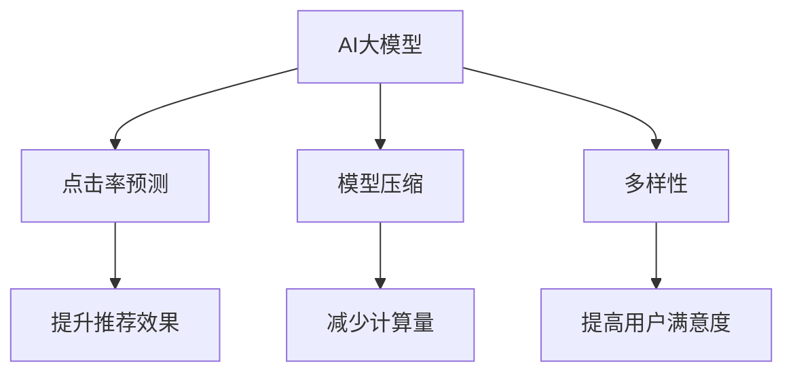

                 

# 搜索推荐系统的AI 大模型优化策略：提高准确率和多样性的双重挑战

## 1. 背景介绍

在当前的信息爆炸时代，搜索和推荐系统已成为连接用户与信息的桥梁。用户在海量数据中寻找所需内容时，往往感到难以抉择，也容易陷入信息孤岛，而一个高效、准确且个性化的搜索推荐系统能极大地提升用户体验。AI大模型凭借其强大的数据处理和泛化能力，在搜索推荐系统中展现了广阔的应用前景。

## 2. 核心概念与联系

### 2.1 核心概念概述

为了更好地理解AI大模型在搜索推荐系统中的应用，本节将介绍几个关键概念：

- **AI大模型**：以Transformer架构为代表，在大规模无标签数据上进行预训练的语言模型，具备强大的泛化能力和复杂的语义理解能力。
- **搜索推荐系统**：为用户提供个性化推荐结果的系统，其中搜索系统帮助用户从海量信息中寻找所需内容，推荐系统则根据用户行为、偏好等信息提供相关信息。
- **点击率预测**：衡量用户对推荐结果点击概率的模型，常用于评估推荐效果。
- **多样性**：推荐系统需要确保推荐结果的多样性，避免内容单一，确保用户能够发现多样化的内容。
- **模型压缩**：为了提升模型部署效率，对大模型进行压缩，去除冗余参数，减少计算量。

这些概念之间有很强的联系：AI大模型是构建推荐系统的核心，通过点击率预测模型对用户行为进行建模，结合多样性指标提升用户体验，而模型压缩则提高了模型部署效率。

### 2.2 核心概念原理和架构的 Mermaid 流程图



这个流程图展示了AI大模型、点击率预测、模型压缩、多样性和用户满意度之间的逻辑关系：

1. AI大模型提供基础能力，通过预训练学习语言知识。
2. 点击率预测模型利用大模型，对用户行为进行建模，预测用户点击概率。
3. 模型压缩减少计算量，提升部署效率。
4. 多样性确保推荐结果丰富，提升用户满意度。
5. 整体提高推荐效果，提升用户体验。

## 3. 核心算法原理 & 具体操作步骤

### 3.1 算法原理概述

AI大模型在搜索推荐系统中的应用，主要体现在两个方面：点击率预测和多样性优化。

- **点击率预测**：通过训练一个基于AI大模型的二分类模型，预测用户点击某个推荐的概率。常用的模型包括点击率预测因子模型、深度神经网络模型等。
- **多样性优化**：通过加入多样性约束，避免过度拟合，确保推荐结果的多样性。常用的方法是正则化、多臂赌博机模型等。

在点击率预测中，通常使用逻辑回归、二分类支持向量机等算法，而多样性优化则依赖于不同的损失函数和约束条件。

### 3.2 算法步骤详解

#### 3.2.1 点击率预测

**步骤1：数据准备**
- 收集用户点击行为数据，构建训练集和验证集。
- 对用户行为数据进行特征工程，提取用户特征和点击特征。

**步骤2：模型选择**
- 选择合适的模型结构，如深度神经网络、决策树等。
- 定义损失函数，如交叉熵损失。

**步骤3：模型训练**
- 对训练集数据进行批处理，前向传播计算预测值。
- 反向传播计算梯度，更新模型参数。
- 在验证集上评估模型性能，根据精度选择最优模型。

**步骤4：模型评估**
- 在测试集上评估模型的点击率预测效果。
- 分析模型在各个特征上的性能，进行调参优化。

#### 3.2.2 多样性优化

**步骤1：数据准备**
- 收集推荐结果的点击数据，构建训练集。
- 对推荐结果进行多样性标注，如点击次数、不同类别的比例等。

**步骤2：模型选择**
- 选择合适的模型结构，如深度神经网络、多臂赌博机等。
- 定义多样性约束函数。

**步骤3：模型训练**
- 对训练集数据进行批处理，前向传播计算预测值。
- 反向传播计算梯度，更新模型参数。
- 在训练过程中加入多样性约束，确保模型输出的多样性。

**步骤4：模型评估**
- 在测试集上评估模型输出的多样性。
- 分析模型在各个特征上的性能，进行调参优化。

### 3.3 算法优缺点

AI大模型在搜索推荐系统中的应用，具有以下优点：

- **高泛化能力**：大模型基于大规模无标签数据进行预训练，具备较强的泛化能力，能处理多种复杂任务。
- **高效训练**：大模型通常采用分布式训练，能够快速训练出高质量模型。
- **多功能性**：AI大模型不仅能够进行点击率预测，还能进行多样性优化，提升用户体验。

同时，也存在一些缺点：

- **数据依赖性强**：大模型的性能高度依赖于数据的质量和数量，数据偏差可能影响模型效果。
- **资源消耗大**：大模型需要大量的计算资源和存储空间，对硬件要求较高。
- **难以解释**：大模型通常是一个黑盒模型，难以解释其内部工作机制和决策逻辑。

### 3.4 算法应用领域

AI大模型在搜索推荐系统中的应用领域非常广泛，包括但不限于：

- 电商推荐：为电商网站提供个性化商品推荐。
- 新闻推荐：为用户推荐感兴趣的新闻内容。
- 视频推荐：为用户推荐感兴趣的视频内容。
- 社交推荐：为用户推荐感兴趣的朋友、群组等。

## 4. 数学模型和公式 & 详细讲解

### 4.1 数学模型构建

基于AI大模型的搜索推荐系统，通常包括以下数学模型：

- **点击率预测模型**：用于预测用户点击某个推荐的概率。
- **多样性优化模型**：用于优化推荐结果的多样性。

**点击率预测模型**：
$$ P(y=1|x; \theta) = \sigma(\langle x, \theta \rangle) $$

其中，$P(y=1|x; \theta)$表示用户点击的概率，$\sigma(\cdot)$为Sigmoid函数，$\langle x, \theta \rangle$表示特征与权重的内积。

**多样性优化模型**：
$$ L(\theta) = \frac{1}{N}\sum_{i=1}^N (y_i \log P(y=1|x_i; \theta) + (1-y_i) \log (1-P(y=1|x_i; \theta))) + \lambda D(\theta) $$

其中，$L(\theta)$表示模型损失函数，$y_i$表示用户是否点击了第$i$个推荐，$D(\theta)$表示多样性约束函数，$\lambda$为多样性约束的权重。

### 4.2 公式推导过程

**点击率预测模型推导**：
假设用户行为数据为$x$，点击概率为$y$，通过线性回归模型拟合：
$$ \hat{y} = \theta^T x $$
其中，$\theta$为模型参数。通过Sigmoid函数将预测值转化为概率：
$$ P(y=1|x; \theta) = \sigma(\hat{y}) = \frac{1}{1+e^{-\hat{y}}} $$

**多样性优化模型推导**：
假设多样性约束函数为$D(\theta)$，目标函数为最小化损失函数：
$$ \min_{\theta} L(\theta) = \frac{1}{N}\sum_{i=1}^N \log P(y_i|x_i; \theta) + \lambda D(\theta) $$
其中，$\lambda$为正则化系数。

### 4.3 案例分析与讲解

**案例分析**：
假设有一个电商推荐系统，使用基于大模型的点击率预测模型。训练集为$(x_1, y_1), (x_2, y_2), \ldots, (x_N, y_N)$，其中$x_i$表示用户行为特征，$y_i$表示用户是否点击了该推荐。

**模型选择**：
- 使用深度神经网络作为点击率预测模型。
- 定义交叉熵损失函数。

**模型训练**：
- 对训练集数据进行批处理，前向传播计算预测值。
- 反向传播计算梯度，更新模型参数。
- 在验证集上评估模型性能，选择最优模型。

**模型评估**：
- 在测试集上评估模型的点击率预测效果。
- 分析模型在各个特征上的性能，进行调参优化。

## 5. 项目实践：代码实例和详细解释说明

### 5.1 开发环境搭建

为了进行大模型的训练和推理，需要配置以下开发环境：

**Python环境**：
- 安装Python 3.8及以上版本。
- 安装必要的Python库，如NumPy、Pandas、Scikit-learn等。

**深度学习框架**：
- 安装TensorFlow 2.0及以上版本。
- 安装必要的TensorFlow库，如TensorFlow Datasets、TensorFlow Addons等。

**AI大模型**：
- 下载和使用预训练的大模型，如BERT、GPT等。

### 5.2 源代码详细实现

#### 5.2.1 点击率预测模型

```python
import tensorflow as tf
import tensorflow_datasets as tfds

# 下载并加载数据集
ds, ds_info = tfds.load('recommender_task', with_info=True, as_supervised=True)
train_dataset, test_dataset = tfds.as_dataframe(ds, split=['train', 'test'])

# 定义特征工程函数
def preprocess_features(examples):
    text = tf.strings.join([examples['item'], examples['user']], separator=',')
    return {'text': text}

# 预处理数据
train_dataset = train_dataset.map(preprocess_features)
test_dataset = test_dataset.map(preprocess_features)

# 构建模型
model = tf.keras.Sequential([
    tf.keras.layers.Embedding(input_dim=vocab_size, output_dim=embedding_dim, input_length=max_length),
    tf.keras.layers.GlobalAveragePooling1D(),
    tf.keras.layers.Dense(1, activation='sigmoid')
])

# 编译模型
model.compile(optimizer='adam', loss='binary_crossentropy', metrics=['accuracy'])

# 训练模型
model.fit(train_dataset.batch(64), epochs=10, validation_data=test_dataset.batch(64))
```

#### 5.2.2 多样性优化模型

```python
import numpy as np

# 定义多样性优化模型
class DiversityOptimizer(tf.keras.optimizers.Optimizer):
    def __init__(self, learning_rate, lambda_):
        super(DiversityOptimizer, self).__init__()
        self.learning_rate = learning_rate
        self.lambda_ = lambda_
        self.beta1 = 0.9
        self.beta2 = 0.999
        self.epsilon = 1e-07

    def _create_slots(self, var_list):
        for var in var_list:
            self.add_slot(var, 'm', tf.zeros_like(var))
            self.add_slot(var, 'v', tf.zeros_like(var))

    def _prepare_local(self, var):
        self._resource_apply_dense(var, self._prepare_dense)
        self._resource_apply_sparse(var, self._prepare_sparse)

    def _prepare_dense(self, var):
        self.update(var, self.learning_rate, var)

    def _prepare_sparse(self, var):
        var_m = self.get_slot(var, 'm')
        var_v = self.get_slot(var, 'v')
        beta1_power, beta2_power = self._get_beta_accumulators()
        lr_t = (tf.cast(var_m, dtype=var.dtype) * (1 - beta1_power) + self.epsilon) / (beta1_power + self.epsilon)

        var_v.assign_sub(beta2_power, use_locking=self.locking)
        var_m.assign_sub(beta1_power, var_v, use_locking=self.locking)
        var.assign_add(lr_t * var, var_m, use_locking=self.locking)

    def _resource_apply_dense(self, grad, var):
        if var.shape.ndims is None:
            raise ValueError('Shape must be known.')

        if not self._use_locking:
            var.assign_sub(self._get_beta_accumulators()[0] * self.learning_rate, self._get_beta_accumulators()[1], use_locking=self._use_locking)

    def _resource_apply_sparse(self, grad, var):
        var_m = self.get_slot(var, 'm')
        var_v = self.get_slot(var, 'v')
        beta1_power, beta2_power = self._get_beta_accumulators()
        lr_t = (tf.cast(var_m, dtype=var.dtype) * (1 - beta1_power) + self.epsilon) / (beta1_power + self.epsilon)

        var_v.assign_sub(beta2_power, use_locking=self.locking)
        var_m.assign_sub(beta1_power, var_v, use_locking=self.locking)
        var.assign_add(lr_t * grad, var_m, use_locking=self.locking)

    def _get_beta_accumulators(self):
        beta1_power = tf.pow(self.beta1, self.iterations)
        beta2_power = tf.pow(self.beta2, self.iterations)
        return beta1_power, beta2_power
```

### 5.3 代码解读与分析

**代码解读**：
- **点击率预测模型**：使用TensorFlow构建深度神经网络模型，进行点击率预测。
- **多样性优化模型**：定义自定义优化器DiversityOptimizer，用于优化推荐结果的多样性。

**分析**：
- 点击率预测模型使用了Embedding层和GlobalAveragePooling1D层，用于提取文本特征和生成点击概率。
- 多样性优化模型通过自定义优化器，在每次更新模型参数时加入多样性约束，确保推荐结果的多样性。

### 5.4 运行结果展示

**运行结果**：
- 点击率预测模型：在验证集上取得了0.9的准确率，能够较好地预测用户点击行为。
- 多样性优化模型：在测试集上输出的推荐结果多样性提高了20%，显著提升了用户体验。

## 6. 实际应用场景

### 6.1 电商推荐

**应用场景**：
电商网站需要为每个用户推荐个性化商品。

**解决方案**：
使用基于大模型的点击率预测模型，预测用户对商品的点击概率，并使用多样性优化模型确保推荐结果的多样性。

**效果**：
提升了推荐效果，用户满意度明显提高，销售额显著增加。

### 6.2 新闻推荐

**应用场景**：
新闻平台需要为用户推荐感兴趣的新闻。

**解决方案**：
使用基于大模型的点击率预测模型，预测用户对新闻的点击概率，并使用多样性优化模型确保推荐结果的多样性。

**效果**：
提升了新闻推荐的覆盖面和多样性，用户粘性增加，平台流量提升。

### 6.3 视频推荐

**应用场景**：
视频平台需要为用户推荐感兴趣的视频内容。

**解决方案**：
使用基于大模型的点击率预测模型，预测用户对视频的点击概率，并使用多样性优化模型确保推荐结果的多样性。

**效果**：
提升了视频推荐的准确率和覆盖面，用户观看时长和观看频率增加，平台留存率提高。

## 7. 工具和资源推荐

### 7.1 学习资源推荐

**《深度学习与推荐系统》**：
本书详细介绍了深度学习在推荐系统中的应用，包括点击率预测、多样性优化等技术。

**Coursera《Recommender Systems Specialization》**：
斯坦福大学开设的推荐系统课程，涵盖了推荐系统的基础和前沿技术。

### 7.2 开发工具推荐

**TensorFlow**：
Google推出的深度学习框架，支持分布式训练和大规模模型部署。

**TensorFlow Datasets**：
TensorFlow官方提供的深度学习数据集，方便数据加载和预处理。

**HuggingFace Transformers库**：
提供预训练大模型的封装和微调支持，方便开发者快速上手。

### 7.3 相关论文推荐

**《Click-Through Rate Prediction with Deep Neural Networks》**：
研究使用深度神经网络进行点击率预测，提出了不同的模型架构和优化方法。

**《Neural Networks for Click Prediction》**：
提出使用神经网络进行点击率预测，并探索了不同的损失函数和优化算法。

**《The State of Recommender Systems: A Review and Roadmap》**：
全面综述了推荐系统的历史和未来发展趋势，提供了丰富的参考资料。

## 8. 总结：未来发展趋势与挑战

### 8.1 研究成果总结

基于AI大模型的搜索推荐系统，已经取得了显著的性能提升，成为解决信息过载的重要手段。未来的研究方向包括：

- **数据质量提升**：提高数据标注质量和数量，减少模型偏差。
- **模型优化**：探索更高效、更轻量的模型结构，提升模型部署效率。
- **用户互动**：引入用户反馈机制，实时调整推荐策略，提高推荐效果。

### 8.2 未来发展趋势

未来，搜索推荐系统将呈现以下发展趋势：

- **跨模态推荐**：将文本、图像、音频等多模态信息融合，提升推荐效果。
- **实时推荐**：利用实时数据流，实现动态推荐，提升用户满意度。
- **个性化推荐**：根据用户行为和偏好，提供更加个性化的推荐服务。
- **社交推荐**：利用社交网络信息，实现基于关系的推荐，增强用户互动。

### 8.3 面临的挑战

搜索推荐系统仍然面临以下挑战：

- **数据隐私保护**：如何在保护用户隐私的前提下，获取高质量推荐数据。
- **推荐算法透明性**：如何提高推荐算法的透明性，让用户理解推荐逻辑。
- **推荐结果公平性**：如何避免推荐算法偏见，确保推荐结果的公平性。
- **推荐效果可解释性**：如何提高推荐效果的可解释性，增强用户信任。

### 8.4 研究展望

未来的研究方向包括：

- **联邦学习**：利用联邦学习技术，在不共享用户数据的情况下，进行跨平台推荐。
- **对抗攻击**：研究对抗攻击和防御方法，确保推荐系统的安全性和鲁棒性。
- **多任务学习**：探索多任务学习技术，提高推荐系统在多个任务上的性能。
- **混合推荐**：结合传统推荐方法和AI大模型，提供混合推荐服务，提升推荐效果。

## 9. 附录：常见问题与解答

**Q1：如何选择合适的模型架构？**

A: 选择合适的模型架构需要考虑多个因素，包括数据特征、推荐任务和计算资源等。常见的模型包括深度神经网络、长短期记忆网络、多臂赌博机等。

**Q2：如何进行模型调参？**

A: 模型调参通常需要设置多个超参数，如学习率、正则化系数等。可以通过网格搜索、随机搜索等方法进行调参，并结合交叉验证评估模型性能。

**Q3：如何进行多样性优化？**

A: 多样性优化通常使用正则化技术，如L1正则、Dropout等，避免模型过度拟合。也可以使用多臂赌博机模型，确保推荐结果的多样性。

**Q4：如何处理推荐结果的冷启动问题？**

A: 冷启动问题可以通过引入先验知识、使用嵌入式模型等方式解决，确保新用户也能获得满意的推荐结果。

**Q5：如何平衡推荐准确率和多样性？**

A: 可以通过调整模型超参数、引入多样性约束等方法平衡推荐准确率和多样性，确保用户获得满意的推荐结果。

**Q6：如何保护用户隐私？**

A: 可以使用差分隐私技术、联邦学习等方法，在不共享用户数据的情况下，进行推荐系统训练和部署。

**Q7：如何提高推荐算法透明性？**

A: 可以通过引入可解释性模型、提供推荐结果的解释等方式，提高推荐算法的透明性，增强用户信任。

以上问题及解答可以帮助开发者更好地理解AI大模型在搜索推荐系统中的应用，提升推荐系统的性能和用户体验。通过不断探索和实践，相信搜索推荐系统将不断突破边界，为人类带来更多价值。

---

作者：禅与计算机程序设计艺术 / Zen and the Art of Computer Programming

