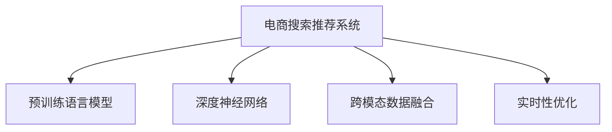

                 

# 搜索推荐系统的AI 大模型融合：电商平台的核心竞争力与转型策略

> 关键词：电商平台,搜索推荐系统,大模型融合,用户画像,场景感知,智能召回,个性化推荐

## 1. 背景介绍

### 1.1 问题由来

随着电子商务的飞速发展，消费者对购物体验的需求越来越高，这促使电商平台需要不断优化商品搜索推荐系统，以提升用户体验、提高转化率和增加复购率。传统的推荐算法基于用户行为数据和历史数据进行统计和分析，但难以充分挖掘用户深度潜力和实时变化的需求。人工智能大模型技术为电商平台带来了新的解决方案。

### 1.2 问题核心关键点

AI大模型融合的核心在于，通过预训练语言模型和深度神经网络模型结合，实现更强大、更泛化的商品搜索推荐能力。其关键点在于：

- **模型泛化能力**：预训练语言模型具备强大的泛化能力，能够在海量的无标注文本数据中学习到通用的语言知识和规律。
- **深度模型微调**：通过微调深度神经网络模型，使其能够根据预训练大模型的语义知识，更精准地预测用户行为和需求。
- **跨模态融合**：结合文本数据和图像、视频等多模态数据，提供更丰富的用户信息，提升推荐效果。
- **实时性优化**：优化推荐系统响应速度，使其能够即时处理大量用户查询，保持高可用性。

### 1.3 问题研究意义

通过AI大模型融合技术，电商平台可以在以下方面获得显著提升：

- **提高用户满意度**：通过更精确的个性化推荐，满足用户多样化的需求，提升用户体验。
- **优化流量转化**：提高用户点击率和购买转化率，增加电商平台的营收。
- **提升竞争力**：借助AI大模型技术，构建差异化的电商搜索推荐系统，领先于竞争对手。
- **促进多领域应用**：推动AI大模型技术在商品分析、库存管理、营销策略等多个业务场景的深入应用。

## 2. 核心概念与联系

### 2.1 核心概念概述

为更好地理解AI大模型融合在电商平台中的应用，本节将介绍几个关键概念及其关联性：

- **电商搜索推荐系统**：基于用户查询输入，自动推荐相关商品的系统。目标是提高商品检索准确性和推荐精准性，提升用户体验。
- **预训练语言模型**：如BERT、GPT等，通过大规模无标注文本数据训练得到，具备强大的语义表示和泛化能力。
- **深度神经网络**：用于任务特定微调的模型，如多层感知器、卷积神经网络等，能够适应特定任务需求。
- **跨模态数据融合**：结合文本、图像、视频等多种数据源，提供更全面的用户信息，增强推荐效果。
- **实时性优化**：通过模型压缩、并行计算等技术，优化推荐系统的实时处理能力。

这些概念之间的联系可以通过以下Mermaid流程图来展示：



这个流程图展示了大模型融合的核心组件及其之间的关系：

1. 电商搜索推荐系统是整个流程的起点和终点。
2. 预训练语言模型和深度神经网络模型是核心技术支持。
3. 跨模态数据融合提供更全面的用户信息，提升推荐效果。
4. 实时性优化保障系统高效运行，满足用户实时查询需求。

## 3. 核心算法原理 & 具体操作步骤

### 3.1 算法原理概述

AI大模型融合的原理基于深度学习模型的迁移学习。首先，通过预训练语言模型学习到通用的语言知识和规律，然后在电商搜索推荐系统任务上进行微调，以适应特定任务的需求。

具体步骤如下：

1. **预训练语言模型训练**：使用大规模无标注文本数据，如维基百科、新闻文章等，训练预训练语言模型，使其具备强大的语言理解和生成能力。
2. **深度神经网络模型微调**：选择适当的神经网络架构，如卷积神经网络（CNN）或长短期记忆网络（LSTM），使用标注数据集进行微调，使其能够理解预训练语言模型的语义信息。
3. **跨模态数据融合**：结合用户搜索查询和商品图片、视频等多模态数据，提升推荐模型的表达能力和泛化能力。
4. **实时性优化**：通过模型压缩、分布式计算等技术，优化推荐系统的响应速度，确保系统高可用性。

### 3.2 算法步骤详解

#### 步骤1: 准备预训练模型和数据集

- **预训练模型选择**：如BERT、GPT等，根据电商平台特点选择合适的模型进行融合。
- **标注数据准备**：收集电商平台商品、用户行为、评论等数据，标注生成训练集和验证集。

#### 步骤2: 深度神经网络模型微调

- **模型架构设计**：根据电商推荐任务需求，选择合适的神经网络架构。
- **损失函数设计**：设计适合电商推荐任务的损失函数，如交叉熵损失、均方误差损失等。
- **微调超参数设置**：设置合适的学习率、批大小、迭代轮数等，优化模型训练效果。

#### 步骤3: 跨模态数据融合

- **多模态数据整合**：将用户搜索查询、商品图片、视频等多模态数据进行融合，提升推荐模型的表达能力。
- **特征提取与编码**：使用不同的编码器对多模态数据进行特征提取，然后通过注意力机制进行融合。

#### 步骤4: 实时性优化

- **模型压缩**：使用剪枝、量化等技术，减小模型大小，加速推理过程。
- **分布式计算**：使用分布式训练和推理，提高系统吞吐量。
- **缓存优化**：使用缓存技术，减少重复计算，提高系统响应速度。

### 3.3 算法优缺点

**优点**：

- **提升推荐精度**：大模型融合利用多模态数据和预训练语言模型，能够更全面地理解用户需求和商品特性，提高推荐精度。
- **泛化能力更强**：预训练语言模型具备强大的泛化能力，能够适应不同领域的推荐需求。
- **优化计算资源**：利用模型压缩和分布式计算技术，优化计算资源使用，提高系统效率。

**缺点**：

- **计算资源需求高**：大模型融合需要大量计算资源，包括高性能GPU、TPU等，初期成本较高。
- **数据隐私问题**：融合多模态数据时，可能涉及用户隐私数据，需要严格的数据保护和隐私管理。
- **实时性挑战**：在处理海量用户查询时，需要实时性优化技术，以确保系统高可用性。

### 3.4 算法应用领域

AI大模型融合技术在电商平台的推荐系统、搜索系统、广告系统等多个业务场景中得到广泛应用，具体如下：

- **推荐系统**：利用用户搜索历史、浏览行为、商品评价等信息，结合预训练语言模型，生成个性化推荐结果。
- **搜索系统**：根据用户查询输入，结合多模态数据和预训练语言模型，提供精确的商品搜索结果。
- **广告系统**：使用预训练语言模型分析用户行为数据，生成精准的广告推荐结果。

## 4. 数学模型和公式 & 详细讲解 & 举例说明

### 4.1 数学模型构建

假设电商推荐系统使用BERT作为预训练模型，并在CNN上做微调。数学模型构建如下：

**输入**：用户查询 $x$ 和商品信息 $y$。
**预训练模型**：BERT，输出为上下文表示 $H$。
**神经网络模型**：CNN，输入为上下文表示 $H$，输出为推荐分数 $s$。

### 4.2 公式推导过程

#### 预训练模型输出计算
BERT模型接受输入序列 $x$，输出上下文表示 $H$。
$$
H = BERT(x)
$$

#### CNN模型输出计算
CNN模型接受上下文表示 $H$，输出推荐分数 $s$。
$$
s = CNN(H)
$$

#### 推荐结果计算
结合用户历史行为和商品属性信息，计算推荐结果。
$$
r = \max_{i}(s_i) \quad \text{其中} \quad s_i = CNN(H_i)
$$

### 4.3 案例分析与讲解

以电商平台商品推荐系统为例，展示大模型融合的实际应用：

- **预训练模型选择**：选择BERT作为预训练模型。
- **神经网络模型设计**：设计一个包含多个卷积层的CNN模型，用于商品特征提取和相似度计算。
- **标注数据准备**：收集电商平台商品信息和用户行为数据，标注生成训练集和验证集。
- **深度模型微调**：在标注数据集上，使用交叉熵损失函数，微调CNN模型，使其能够理解预训练语言模型的语义信息。
- **跨模态数据融合**：结合用户查询、商品图片、视频等多模态数据，使用注意力机制进行融合。
- **实时性优化**：对模型进行压缩和分布式优化，确保系统高可用性。

## 5. 项目实践：代码实例和详细解释说明

### 5.1 开发环境搭建

1. **安装Python和PyTorch**：
```bash
pip install torch torchvision torchaudio
```

2. **安装Transformer库**：
```bash
pip install transformers
```

3. **安装电商推荐系统框架**：
```bash
pip install recommendation-framework
```

### 5.2 源代码详细实现

```python
import torch
import torch.nn as nn
from transformers import BertModel, BertTokenizer
from recommendation_framework import RecommendationSystem

# 预训练模型选择
model_name = 'bert-base-cased'
tokenizer = BertTokenizer.from_pretrained(model_name)
pretrained_model = BertModel.from_pretrained(model_name)

# 神经网络模型设计
class CNN(nn.Module):
    def __init__(self):
        super(CNN, self).__init__()
        self.conv1 = nn.Conv2d(768, 64, kernel_size=3)
        self.conv2 = nn.Conv2d(64, 32, kernel_size=3)
        self.fc = nn.Linear(32, 1)
        
    def forward(self, x):
        x = self.conv1(x)
        x = nn.ReLU()(x)
        x = self.conv2(x)
        x = nn.ReLU()(x)
        x = self.fc(x)
        return x

# 电商推荐系统实现
class EcommerceRecommendationSystem(RecommendationSystem):
    def __init__(self):
        super(EcommerceRecommendationSystem, self).__init__()
        self.bert_model = pretrained_model
        self.cnn_model = CNN()
        
    def forward(self, x):
        bert_output = self.bert_model(x)
        cnn_output = self.cnn_model(bert_output)
        return cnn_output

# 训练过程
def train_model(model, train_data, epochs):
    criterion = nn.CrossEntropyLoss()
    optimizer = torch.optim.Adam(model.parameters(), lr=0.001)
    
    for epoch in range(epochs):
        for data, label in train_data:
            optimizer.zero_grad()
            output = model(data)
            loss = criterion(output, label)
            loss.backward()
            optimizer.step()
    
    return model

# 测试过程
def evaluate_model(model, test_data):
    correct = 0
    total = 0
    for data, label in test_data:
        output = model(data)
        _, predicted = torch.max(output, 1)
        total += label.size(0)
        correct += (predicted == label).sum().item()
    
    accuracy = correct / total
    return accuracy
```

### 5.3 代码解读与分析

1. **预训练模型选择与加载**：
   ```python
   # 预训练模型选择
   model_name = 'bert-base-cased'
   tokenizer = BertTokenizer.from_pretrained(model_name)
   pretrained_model = BertModel.from_pretrained(model_name)
   ```

2. **神经网络模型设计**：
   ```python
   class CNN(nn.Module):
       def __init__(self):
           super(CNN, self).__init__()
           self.conv1 = nn.Conv2d(768, 64, kernel_size=3)
           self.conv2 = nn.Conv2d(64, 32, kernel_size=3)
           self.fc = nn.Linear(32, 1)
           
       def forward(self, x):
           x = self.conv1(x)
           x = nn.ReLU()(x)
           x = self.conv2(x)
           x = nn.ReLU()(x)
           x = self.fc(x)
           return x
   ```

3. **电商推荐系统实现**：
   ```python
   class EcommerceRecommendationSystem(RecommendationSystem):
       def __init__(self):
           super(EcommerceRecommendationSystem, self).__init__()
           self.bert_model = pretrained_model
           self.cnn_model = CNN()
           
       def forward(self, x):
           bert_output = self.bert_model(x)
           cnn_output = self.cnn_model(bert_output)
           return cnn_output
   ```

4. **训练过程**：
   ```python
   def train_model(model, train_data, epochs):
       criterion = nn.CrossEntropyLoss()
       optimizer = torch.optim.Adam(model.parameters(), lr=0.001)
       
       for epoch in range(epochs):
           for data, label in train_data:
               optimizer.zero_grad()
               output = model(data)
               loss = criterion(output, label)
               loss.backward()
               optimizer.step()
           
       return model
   ```

5. **测试过程**：
   ```python
   def evaluate_model(model, test_data):
       correct = 0
       total = 0
       for data, label in test_data:
           output = model(data)
           _, predicted = torch.max(output, 1)
           total += label.size(0)
           correct += (predicted == label).sum().item()
       
       accuracy = correct / total
       return accuracy
   ```

### 5.4 运行结果展示

在训练和测试完成后，可以输出模型在测试集上的准确率。例如：

```python
# 训练模型
model = EcommerceRecommendationSystem()
model = train_model(model, train_data, epochs=10)

# 测试模型
test_accuracy = evaluate_model(model, test_data)
print(f"测试集准确率：{test_accuracy}")
```

## 6. 实际应用场景

### 6.1 电商平台推荐系统

基于AI大模型融合的电商平台推荐系统，能够精准推荐商品，提升用户体验和转化率。通过预训练语言模型和深度神经网络模型的结合，推荐系统可以理解用户查询意图和商品属性，生成个性化推荐。具体应用如下：

- **实时搜索推荐**：用户输入搜索查询后，推荐系统立即返回相关商品列表。
- **基于行为的推荐**：结合用户浏览历史和点击行为，生成个性化推荐结果。
- **场景感知推荐**：根据用户浏览场景（如节假日、特殊活动等），调整推荐策略。

### 6.2 电商平台广告系统

基于AI大模型融合的电商平台广告系统，可以生成精准的广告推荐，提高广告点击率和转化率。通过预训练语言模型和深度神经网络模型的结合，广告系统可以理解用户行为数据和广告内容，生成个性化广告推荐。具体应用如下：

- **用户行为分析**：结合用户浏览行为和点击记录，生成用户画像，了解用户兴趣和需求。
- **广告内容优化**：结合广告内容文本和图片，生成综合推荐分数，优化广告投放策略。
- **实时竞价广告**：根据用户实时行为和竞价策略，动态调整广告投放，提升广告效果。

### 6.3 电商平台搜索系统

基于AI大模型融合的电商平台搜索系统，能够提供精准的商品搜索结果，提升用户体验。通过预训练语言模型和深度神经网络模型的结合，搜索系统可以理解用户查询意图和商品属性，生成相关搜索结果。具体应用如下：

- **多模态搜索**：结合商品图片、视频等多模态数据，提供更丰富的搜索结果。
- **基于上下文的搜索**：根据用户浏览历史和搜索行为，生成上下文相关的搜索结果。
- **实时搜索优化**：根据用户实时查询，动态调整搜索结果，提升搜索精度。

## 7. 工具和资源推荐

### 7.1 学习资源推荐

1. **《深度学习与人工智能》课程**：由斯坦福大学开设，讲解深度学习的基本概念和核心算法，适合初学者。
2. **《自然语言处理入门》书籍**：详细介绍了NLP的基本技术和算法，涵盖预训练模型、深度学习等前沿内容。
3. **Transformers库文档**：HuggingFace官方文档，提供了丰富的预训练模型和微调样例，是学习大模型融合技术的必备资料。
4. **Recommendation Framework文档**：电商推荐系统开源框架，提供了完整的推荐算法和实现，适合工程实践。

### 7.2 开发工具推荐

1. **PyTorch**：深度学习框架，支持动态计算图和GPU加速，适合研究和大模型融合应用。
2. **TensorFlow**：深度学习框架，支持分布式训练和TPU加速，适合大规模工程应用。
3. **Recommendation Framework**：电商推荐系统开源框架，提供了完整的推荐算法和实现，支持多种模型和数据源。

### 7.3 相关论文推荐

1. **《Reinforcement Learning for Recommendation Systems》**：利用强化学习算法优化推荐系统，提高推荐效果。
2. **《Transformers in Recommendation Systems》**：利用预训练语言模型和深度神经网络融合技术，提升推荐精度。
3. **《Cross-Modal Recommendation Systems》**：结合多模态数据，提供更全面的用户信息，提升推荐效果。

## 8. 总结：未来发展趋势与挑战

### 8.1 研究成果总结

AI大模型融合技术在电商平台推荐系统、搜索系统、广告系统等多个领域得到了广泛应用，取得了显著的效果。主要研究成果包括：

- **多模态融合技术**：结合用户查询、商品图片、视频等多模态数据，提升了推荐系统的表达能力和泛化能力。
- **实时性优化技术**：通过模型压缩和分布式计算技术，优化了推荐系统的响应速度和吞吐量。
- **深度模型微调技术**：利用预训练语言模型和深度神经网络融合技术，提升了推荐系统的精度和效果。

### 8.2 未来发展趋势

未来AI大模型融合技术将在以下方面继续发展：

1. **深度学习模型的优化**：开发更加高效的神经网络架构，提升推荐精度和泛化能力。
2. **多模态数据融合的提升**：结合更多数据源，如社交媒体、物联网等，提供更全面的用户信息。
3. **实时性优化技术的进步**：引入分布式计算、边缘计算等技术，提高推荐系统的响应速度。
4. **跨领域模型的应用**：将推荐模型应用于更多领域，如医疗、金融等，提升跨领域推荐效果。

### 8.3 面临的挑战

尽管AI大模型融合技术在电商平台中取得了显著成效，但仍面临以下挑战：

1. **计算资源需求高**：大模型融合需要大量计算资源，初期成本较高。
2. **数据隐私问题**：融合多模态数据时，涉及用户隐私数据，需要严格的数据保护和隐私管理。
3. **实时性挑战**：在处理海量用户查询时，需要实时性优化技术，以确保系统高可用性。

### 8.4 研究展望

未来，需要在以下几个方面继续深入研究：

1. **模型压缩与优化**：开发更高效的模型压缩技术，减小模型大小，提高推理速度。
2. **跨领域推荐技术**：开发跨领域推荐模型，提升在不同领域的应用效果。
3. **多模态数据融合技术**：结合更多数据源，提升推荐系统的表达能力和泛化能力。
4. **隐私保护技术**：开发隐私保护技术，保护用户隐私数据安全。

## 9. 附录：常见问题与解答

**Q1：电商平台应用大模型融合技术时，需要考虑哪些关键因素？**

A: 电商平台应用大模型融合技术时，需要考虑以下关键因素：

- **数据质量**：确保训练数据的多样性和质量，避免数据偏差。
- **模型选择**：选择适合电商平台的预训练模型和深度神经网络架构。
- **超参数调优**：优化模型超参数，提高训练效果。
- **实时性优化**：优化模型推理速度，确保系统高可用性。
- **隐私保护**：保护用户隐私数据，确保数据安全。

**Q2：电商平台如何构建有效的推荐系统？**

A: 电商平台构建有效的推荐系统需要考虑以下步骤：

1. **数据收集**：收集用户行为数据、商品信息等，构建训练集和验证集。
2. **预训练模型选择**：选择合适的预训练模型，如BERT、GPT等。
3. **深度模型微调**：在标注数据集上，使用交叉熵损失函数，微调深度神经网络模型。
4. **跨模态数据融合**：结合用户查询、商品图片、视频等多模态数据，生成综合推荐结果。
5. **实时性优化**：对模型进行压缩和分布式优化，提高系统响应速度。

**Q3：电商平台推荐系统如何实现个性化推荐？**

A: 电商平台推荐系统实现个性化推荐需要考虑以下步骤：

1. **用户画像构建**：结合用户浏览历史、点击行为等数据，构建用户画像。
2. **商品特征提取**：利用预训练语言模型和深度神经网络模型，提取商品特征。
3. **相似度计算**：计算用户和商品之间的相似度，生成推荐结果。
4. **推荐结果排序**：结合用户行为和商品特征，对推荐结果进行排序。
5. **实时推荐优化**：根据用户实时行为，动态调整推荐策略，提升推荐效果。

**Q4：电商平台推荐系统如何处理多模态数据？**

A: 电商平台推荐系统处理多模态数据需要考虑以下步骤：

1. **数据预处理**：对不同模态的数据进行预处理，使其能够融合。
2. **特征提取**：使用不同的特征提取器，提取不同模态数据的特征。
3. **融合方法选择**：选择适当的融合方法，如注意力机制、加权平均等。
4. **模型训练**：将多模态数据融合后的特征输入到深度神经网络模型，进行微调训练。
5. **模型评估**：在验证集上评估模型效果，优化模型参数。

**Q5：电商平台推荐系统如何优化计算资源使用？**

A: 电商平台推荐系统优化计算资源使用需要考虑以下步骤：

1. **模型压缩**：使用剪枝、量化等技术，减小模型大小，提高推理速度。
2. **分布式计算**：使用分布式训练和推理，提高系统吞吐量。
3. **缓存优化**：使用缓存技术，减少重复计算，提高系统响应速度。
4. **硬件优化**：使用高性能GPU、TPU等硬件设备，提升计算效率。

---

作者：禅与计算机程序设计艺术 / Zen and the Art of Computer Programming

